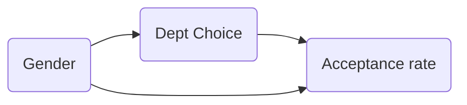
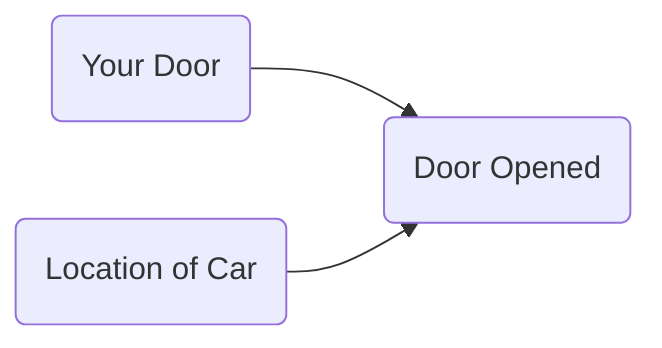

#  causal inference

## classic studies

- [Descriptive Representation and Judicial Outcomes in Multiethnic Societies](https://onlinelibrary.wiley.com/doi/full/10.1111/ajps.12187) (Grossman et al. 2016)
  - judicial outcomes of arabs depended on whether there was an Arab judge on the panel
- [Using Maimonides' Rule to Estimate the Effect of Class Size on Scholastic Achievement](http://citeseerx.ist.psu.edu/viewdoc/summary?doi=10.1.1.554.9675) (angrist & lavy 1999)
  - reducing class size induces a signi􏰜cant and substantial increase in test scores for fourth and 5th graders, although not for third graders.
- [Smoking and Lung Cancer: Recent Evidence and a Discussion of Some Questions](https://academic.oup.com/jnci/article/22/1/173/912572) (cornfield et al. 1959)
  - not a traditional statistics paper
  - most of it is a review of various scientific evidence about smoking and cancer
  - small methodology section that describes an early version of sensitivity analysis
  - describes one of the most important contributions causal inference has made to science
- [Attributing Effects to a Cluster-Randomized Get-Out-the-Vote Campaign](https://www.tandfonline.com/doi/abs/10.1198/jasa.2009.ap06589) (hansen & bowers 2009)
  - about a randomized experiment
  - proved complex to analyze and led to some controversy in political science
  - resolves that controversy using well-chosen statistical tools.
  - Because randomization is present in the design I think the assumptions are much less of a stretch than in many settings (this is also the case in the Angrist, Imbens, Rubin paper)

### natural experiments

- [John Snow on cholera](https://alondoninheritance.com/london-characters/john-snow-soho-cholera-outbreak-1864/) - natural experiment - change of water pollution allowed for computing effect of the water pollution on cholera
- [Who Gets a Swiss Passport? A Natural Experiment in Immigrant Discrimination](http://www.hangartner.net/files/passportapsr.pdf) (Hainmueller & Hangartner 2013)
  - naturalization decisions vary with immigrants' attributes
  - is there immigration against immigrants based on country of origin?
  - citizenship requires voting by municipality
- [When Natural Experiments Are Neither Natural nor Experiments](http://sekhon.berkeley.edu/papers/SekhonTitiunik.pdf) (sekhon & titunik 2012)
  - even when natural interventions are randomly assigned, some of the treatment–control comparisons made available by natural experiments may not be valid

### instrumental variables

- [Identification of Causal Effects Using Instrumental Variables](https://www.jstor.org/stable/2291629?seq=1#metadata_info_tab_contents) (angrist, imbens, & rubin 1996)
  - bridges the literature of instrumental variables in econometrics and the literature of causal inference in statistics
  - applied paper with delicate statistics
  - carefully discuss the assumptions
  - instrumental variables - regression w/ constant treatment effects
  - effect of veteran status on mortality, using lottery number as instrument

### matching

- [Matching and thick description in an observational study of mortality after surgery.](https://www.ncbi.nlm.nih.gov/pubmed/12933551) (rosenbaum & silber 2001)
  - spends a lot of time discussing links between quantitative and qualitative analyses
  - takes the process of checking assumptions very seriously, and it deals with an important scientific problem

### "paradoxes"

- **simpson's paradox** = **yule-simpson paradox** - trend appears in several different groups but disappears/reverses when groups are combined
  - [Sex Bias in Graduate Admissions: Data from Berkeley](https://homepage.stat.uiowa.edu/~mbognar/1030/Bickel-Berkeley.pdf) (bickel et al. 1975)
  - e.g. overall men seemed to have higher acceptance rates, but in each dept. women seemed to have higher acceptance rates - explanation is that women selectively apply to harder depts.

- monty hall problem: why you should switch

- berkson's paradox - diseases in hospitals are correlated even when they are not in the general population
  - possible explanation - only having both diseases together is strong enough to put you in the hospital

## problems beyond ATE

### causal mechanisms

- treatment effect variation?
- principal stratification
- interference

#### mediation analysis

*Mediation analysis aims to identify a mechanism through which a cause has an effect. Direct effects measure when the treatment varies as mediators are held constant.*

- if there are multiple possible paths by which a variable can exert influence, can figure out which path does what, even with just observational data

- cannot just condition on $M$! This can lead to spurious associations

- which pathway do causes flow through from X to Y (direct/indirect?)

- 

- consider potential outcomes with hypothetical intervention on $T$:
  
  - $\{M(t), Y(t)\}$
  
- hypothetical intervention on $T$ and $M$:
  
  - $\{Y(t, m)\}$
  
- hypothetical intervention on $T$ fixing $M$ to $M(t') = M_{t'}$ (nested potential outcome, robs & greenland, 1992; pearl, 2001)
  - $\{Y(t, M_{t'})\}$
  - has also been called a priori counterfactual (frangakis & rubin, 2002)
  - when $t \neq t'$, this can't be observed and can't be falsified
  
- **total effect** $\tau=E\{Y(1)-Y(0)\} = \textrm{NDE + NIE}$
  
  - assumes composition assumption $Y(1, M_1) = Y(1)$, very reasonable
  
- **natural direct effect** $\mathrm{NDE}=E\left\{Y\left(1, M_{0}\right)-Y\left(0, M_{0}\right)\right\}$

  - **controlled direct effect** $\mathrm{CDE}=E\left\{Y\left(1, m\right)-Y\left(0, m\right)\right\}$ is simpler: sets mediator to some assumed value $m$ rather than the actual value seen in the data $M_0$
  - w/ composition: $=E\left\{Y\left(1, M_{0}\right)-Y\left(0\right)\right\}$

- **natural indirect effect** $\mathrm{NIE}=E\left\{Y\left(1, M_1\right)-Y\left(1, M_{0}\right)\right\}$
  
- w/ composition: $=E\left\{Y\left( 1 \right)-Y\left(1, M_0\right)\right\}$
  
- **mediation formula**

  - can condition effects on $x$

    - $\operatorname{NDE}(x)=E\left\{Y\left(1, M_{0}\right)-Y\left(0, M_{0}\right) \mid X=x\right\}$
    - $\operatorname{NIE}(x)=E\left\{Y\left(1, M_{1}\right)-Y\left(1, M_{0}\right) \mid X=x\right\}$
    
  - estimators

    - $\widehat{NDE}(x) = E\left\{Y\left(t, M_{t^{\prime}}\right) \mid X=x\right\}=\sum_{m} E(Y \mid T=t, M=m, X=x) \operatorname{pr}\left(M=m \mid T=t^{\prime}, X=x\right)$
    - $\widehat{NIE}(x) = E\left\{Y\left(t, M_{t^{\prime}}\right)\right\}=\sum_{x} E\left\{Y\left(t, M_{t^{\prime}}\right) \mid X=x\right\} P(X=x)$

  - estimators depend on 4 assumptions

    1. no treatment-outcome confounding: $T \perp Y(t, m) \mid X$

    2. no mediator-outcome confounding: $M \perp Y(t, m) \mid (X, T)$

    3. assumption 3: no treatment-mediator confounding: $T \perp M(t) \mid X$

    4. no cross-world independence between potential outcomes and potential mdediators: $Y(t, m) \perp M(z') \; \forall \; t, t', m$

  - assumption notes
    - 1 + 2 are equivalent to $T, M) \perp Y(t, m) \mid X$
    - first three essentially assume that $T$ and $M$ are both randomized
    - 1-3 are very strong but hold with squentially randomized treatment + mediator
    - 4 cannot be verified

  - baron-kenny method (assumes linear models): 

### heterogenous treatment effects

*Heterogenous treatment effects refer to effects which differ for different subgroups / individuals in a population and requires more refined modeling.*

- **conditional average treatment effect (CATE)** - get treatment effect for each individual conditioned on its covariates
  - meta-learners - break down CATE into regression subproblems
    - e.g. T-learner (foster et al. 2011, simplest) - fit one model for conditional expectation of each potential outcome and then subtract
    - e.g. X-learner (kunzel et al. 19)
    - e.g. R-learner (nie-wager, 20)
    - e.g. S-learner (hill 11)
  - tree-based methods
    - e.g. causal tree ([athey & imbens, 16](https://www.pnas.org/content/113/27/7353.short)) - like decision tree, but change splitting criterion for differentiating 2 outcomes
    - e.g. causal forest ([wager & athey, 18](https://www.tandfonline.com/doi/full/10.1080/01621459.2017.1319839))
    - e.g. BART (hill, 12)
- **subgroup analysis** - identify subgroups with treatment effects far from the average
  - generally easier than CATE
- [staDISC](https://arxiv.org/pdf/2008.10109.pdf) (dwivedi, tan et al. 2020) - learn stable / interpretable subgroups for causal inference
  - CATE - estimate with a bunch of different models
    - meta-learners: T/X/R/S-learners
    - tree-based methods: causal tree/forest, BART
    - **calibration** to evaluate subgroup CATEs
      - main difficulty: hard to do model selection / validation (especially with imbalanced data)
        - often use some kind of proxy loss function
      - solution: compare average CATE within a bin to CATE on test data in bin
        - actual CATE doesn't seem to generalize
        - but ordering of groups seems pretty preserved
      - stability: check stability of this with many CATE estimators
  - subgroup analysis
    - use CATE as a stepping stone to finding subgroups
    - easier, but still linked to real downstream tasks (e.g. identify which subgroup to treat)
    - main difficulty: can quickly overfit
    - **cell-search** - sequential
      - first prune features using feature importance
      - target: maximize a cell's true positive - false positive (subject to using as few features as possible)
      - sequentially find cell which maximizes target
        - find all cells which perform close to as good as this cell
        - remove all cells contained in another cell
        - pick one randomly, remove all points in this cell, then continue
    - stability: rerun search multiple times and look for stable cells / stable cell coverage

### causal discovery

*Causal discovery aims to identify causal relationships (sometimes under some smoothness / independence assumptions. This is often impossible in general.*

- overview

  - basics: conditional indep. checks can only determine graphs up to markov equivalence

  - 2 approaches
    - test noise distr. of relationships in different directions
    - check variables which reduce entropy the most

- [Learning and Testing Causal Models with Interventions](https://proceedings.neurips.cc/paper/2018/hash/78631a4bb5303be54fa1cfdcb958c00a-Abstract.html) (acharya et al. 2018)
  
  - given DAG, want to learn distribution on interventions with minimum number of interventions, variables intevened on, numper of samples draw per intervention
  
- [Discovering Causal Signals in Images](http://openaccess.thecvf.com/content_cvpr_2017/papers/Lopez-Paz_Discovering_Causal_Signals_CVPR_2017_paper.pdf) (lopez-paz et al. 2017)
  - C(A, B) - count number of images in which B would disappear if A was removed
  - we say A *causes* B when C(A, B) is (sufficiently) greater than the converse C(B, A)
  - basics
    - given joint distr. of (A, B), we want to know if A -> B, B-> A
      - with no assumptions, this is nonidentifiable
    - requires 2 assumptions
      - ICM: independence between cause and mechanism (i.e. the function doesn't change based on distr. of X) - this usually gets violated in anticausal direction
      - causal sufficiency - we aren't missing any vars
    - ex. 
      - here noise is indep. from x (causal direction), but can't be independent from y (non-causal direction)
      - in (c), function changes based on input
    - can turn this into binary classification and learn w/ network: given X, Y, does X->Y or Y-X?
  - on images, they get scores for different objects (w/ bounding boxes)
    - eval - when one thing is erased, does the other also get erased?
- [Origo : causal inference by compression](https://link.springer.com/article/10.1007/s10115-017-1130-5) (budhathoki & vreekan, 2017) - similar intuition as ICM: causal directions are more easily compressible
- [Visual Causal Feature Learning](https://arxiv.org/abs/1412.2309) (chalupka, perona, & eberhardt, 2015)
  - assume the behavior $T$ is a function of some hidden causes $H_i$ and the image
    - 
  - **Causal Coarsening Theorem** - causal partition is coarser version of the observational partition
    - observational partition - divide images into partition where each partition has constant prediction $P(T|I)$
    - causal partition - divide images into partition where each partition has constant $P(T|man(I))$
      - $man(I)$ does visual manipulation which changes $I$, while keeping all $H_i$ fixed and $T$ fixed
        - ex. turn a digit into a 7 (or turn a 7 into not a 7)
  - can further simplify the problem into $P(T|I) = P(T|C, S)$
    - $C$ are the causes and $S$ are the spurious correlates
    - any other variable $X$ such that $P(T|I) = P(T|X)$ has Shannon entropy $H(X) \geq H(C, S)$ - these are the simplest descriptions of $P(T|I$)
  - causal effect prediction
    - first, create causal dataset of $P(T|man(I))$ and train, so the model can't learn spurious correlations
    - then train on this - very similar to adversarial training
  
- [Visual Physics: Discovering Physical Laws from Videos](https://arxiv.org/abs/1911.11893)
  - 3 steps
    - Mask R-CNN finds bounding box of object and center of bounding box is taken to be location
    - $\beta-VAE$ compresses the trajectory to some latent repr. (while also being able to predict held-out points of the trajectory)
    - **Eureqa** package does eq. discovery on latent repr + trajectory
      - includes all basic operations, such as addition, mult., sine function
      - R-squared value measures goodness of fit
  - see also SciNet -  [Discovering physical concepts with neural networks](https://arxiv.org/abs/1807.10300) (iten et al. 2020)
  - see also the field of symbolic regression
    - genetic programming is the most pervalent method here
    - alternatives: sparse regression, dimensional function synthesis
  
- [link to iclr talk](https://www.technologyreview.com/s/613502/deep-learning-could-reveal-why-the-world-works-the-way-it-does/?fbclid=IwAR3LF2dc_3EvWXzEHhtrsqtH9Vs-4pjPALfuqKCOma9_gqLXMKDeCWrcdrQ) (bottou 2019)

### stable/invariant predictors

*Under certain assumptions, invariance to data perturbations (i.e. interventions) can help us identify causal effects.*

- [Invariance, Causality and Robustness](https://arxiv.org/abs/1812.08233) (buhlmann 18)
  - predict $Y^e$ given $X^e$ such that the prediction “works well” or is “robust” for all $e ∈ \mathcal F$ based on data from much fewer environments $e \in \mathcal E$
    - assumption: ideally $e$ changes only the distr. of $X^e$ (so doesn't act directly on $Y^e$ or change the mechanism between $X^e$ and $Y^e$)
    - assumption (invariance): there exists a subset of "causal" covariates - when conditioning on these covariates, the loss is the same across all environments $e$
    - when these assumptions are satisfied, then minimizing a worst-case risk over environments $e$ yields a causal parameter
  - identifiability issue: we typically can't identify the causal variables without very many perturbations $e$
    - **Invariant Causal Prediction (ICP)** only identifies variables as causal if they appear in all invariant sets
  - anchor regression model helps to relax assumptions
- [Invariant Risk Minimization](https://arxiv.org/abs/1907.02893) (arjovsky, bottou, gulrajani, & lopez-paz 2019)
  - random splitting causes problems with our data
  - what to perform well under different distributions of X, Y
  - can't be solved via robust optimization
  - a correlation is spurious when we do not expect it to hold in the future in the same manner as it held in the past
    - i.e. spurious correlations are unstable
  - assume we have infinite data, and know what kinds of changes our distribution for the problem might have (e.g. variance of features might change)
    - make a model which has the minimum test error regardless of the distribution of the problem
  - adds a penalty inspired by invariance (which can be viewed as a stability criterion)
- [The Hierarchy of Stable Distributions and Operators to Trade Off Stability and Performance](https://arxiv.org/abs/1905.11374) (subbaswamy, chen, & saria 2019)
  - different predictors learn different things
  - only pick the stable parts of what they learn (in a graph representation)
  - there is a tradeoff between stability to all shifts and average performance on the shifts we expect to see
  - different types of methods
    - *transfer learning* - given unlabelled test data, match training/testing representations
    - *proactive methods* - make assumptions about possible set of target distrs.
    - *data-driven methods* - assume independence of cause and mechanism, like ICP, and use data from different shifts to find invariant subsets
    - *explicit graph methods* - assume explicit knowledge of graph representing the data-generating process
  - hierarchy
    - level 1 - invariant conditional distrs. of the form $P(Y|\mathbf Z)$
    - level 2 - conditional interventional distrs. of the form $P(Y|do(\mathbf W), \mathbf Z)$
    - level 3 - distributions corresponding to counterfactuals
- [Causality for Machine Learning](https://arxiv.org/abs/1911.10500) (scholkopf 19)
  - most of ml is built on the iid assumption and fails when it is violated (e.g. cow on a beach)

### misc problems

- [Incremental causal effects](https://arxiv.org/abs/1907.13258) (rothenhausler & yu, 2019)
  - instead of considering a treatment, consider an infinitesimal change in a continuous treatment
  - use assumption of local independence and can prove some nice things
    - local ignorability assumption states that potential outcomes are independent of the current treatment assignment in a neighborhood of observations
  
- **probability of necessity** $PN(t, y) = P(Y^{T=t'}=y'|T=t, Y=y)$ = "probability of causation" (Robins & Greenland, 1989)

  - find the probability that $Y$ would be $y′$ had $T$ been $t'$, given that, in reality, $Y$ is actually $y$ and $T$ is $t$

  - If $Y$ is monotonic relative to $T$ $i.e ., Y^{T=1}(x) \geq Y^{T=0}(x),$ then $\mathrm{PN}$ is identifiable whenever the causal effect $P(y \mid d o(t))$ is identifiable and, moreover,
    $$
    \mathrm{PN}=\underbrace{\frac{P(y \mid t)-P\left(y \mid t^{\prime}\right)}{P(y \mid t)}}_{\text{excess risk ratio}}+\underbrace{\frac{P\left(y \mid t^{\prime}\right)-P\left(y \mid d o\left(t^{\prime}\right)\right)}{P(t, y)}}_{\text{confounding adjustment}}
    $$

## different assumptions / experimental designs

- [The Blessings of Multiple Causes](https://arxiv.org/abs/1805.06826) (wang & blei, 2019) - having multiple causes can help construct / find all the confounders
  - controversial whether this works in general
  - [On Multi-Cause Causal Inference with Unobserved Confounding: Counterexamples, Impossibility, and Alternatives](https://arxiv.org/abs/1902.10286) (d'amour 2019)

## solutions to basic problems

### learning "causal representations"

- [Learning Representations for Counterfactual Inference](https://arxiv.org/abs/1605.03661) (johansson et al. 2016)
  - 
  - also an extra loss: penalty that encourages counterfactual preds to be close to nearest observed outcome from the same set
  - fit linear ridge regression on top of representation $\phi$
  - not exactly the same as the setting in [fair repr. learning](http://www.cs.toronto.edu/~zemel/documents/fair-icml-final.pdf) or [domain adversarial training](https://www.jmlr.org/papers/volume17/15-239/15-239.pdf) - MMD or Wasserstein distance instead of classification
- [Estimating individual treatment effect: generalization bounds and algorithms](https://arxiv.org/abs/1606.03976) (shalit et al. 2017)
  - 
  - bound for estimating ITE $\tau(x)$ is uper bounded by error for learning $Y_1$ and $Y_0$ plus a term for the  Integral Probability Metric (IPM)
  - IPM measures distance between $p(x|T = 0)$ and $P(x|T = 1)$, and requires that they overlap at $x$
  - In his foundational text about causality, Pearl (2009) writes: “Whereas in traditional learning tasks we attempt to generalize from one set of insteances to another, the causal modeling task is to generalize from behavior under one set of conditions to behavior under another set. *Causal models should therefore be chosen by a criterion that challenges their stability against changing conditions..*.”
- [Learning Weighted Representations for Generalization Across Designs](https://arxiv.org/abs/1802.08598) (johansson et al. 2018)
  - 
- [Counterfactual Representation Learning with Balancing Weights](https://arxiv.org/abs/2010.12618) (assaad et al. 2020)
  - combine balancing weights with representation learning: Balancing Weights Counterfactual Regression (BWCFR)
    - representation learning has trade-off between balance and predictive power ([zhang, bellot, & van der Schaar, 2020](https://arxiv.org/abs/2001.04754))
    - weights are from propensity scores, unlike johansson et al. 2018
    - intuition: upweight regions with good overlap
  - bounds on degree of imbalance as a function of propensity model

### limitations

- [Limits of Estimating Heterogeneous Treatment Effects: Guidelines for Practical Algorithm Design](http://proceedings.mlr.press/v80/alaa18a.html) (alaa & van der schaar, 2018)
  - over enforcing balance can be harmful, as it may inadvertently remove information that is predictive of outcomes
  - analyze optimal minimax rate for ITE using Bayesian nonparametric methods
    - with small sample size: selection bias matters
    - with large sample size: smoothness and sparsity of $\mathbb{E}\left[Y_{i}^{(0)} \mid X_{i}=x\right]$ and $\mathbb{E}\left[Y_{i}^{(1)} \mid X_{i}=x\right]$
      - suggests smoothness of mean function for each group should be different, so better to approximate each individually rather than their difference directly
  - algorithm: non-stationary Gaussian process w/ doubly-robust huperparameters