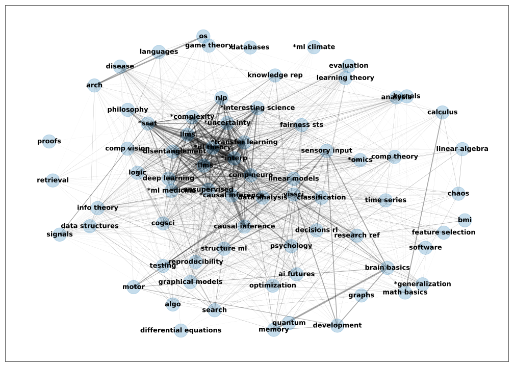

# overview 👋

These are a series of notes (see [csinva.io](https://csinva.io/)) to serve as useful reference for people in machine learning / ai / neuroscience. 

Below are the high-level topics of each note, with an auto-generated graph showing their similarities (based on tf-idf).

`*`Topics labelled with an asterisk are research-level notes, not introductory.

The raw similarities are given in the plot below:

