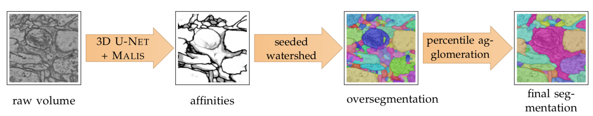
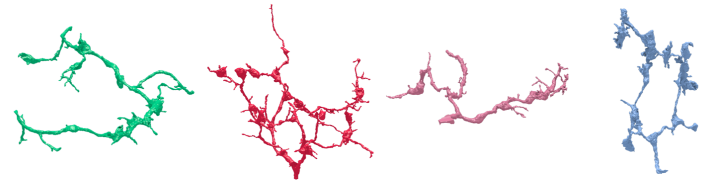

# connectomics
**chandan singh**  

---

The brain is an immensely complicated system consisting of on the order of 86 billion neurons and 15 trillion synapses. Connectomics is the loose term referring to the field interested in mapping the brain. Two general categories exist: *structural connectomics*, which aims to map physical anatomy and *functional connectomics*, which aims to map the functions of different brain regions.

# Structural connectomics

Structural connectomics is interested in developing a map of how the brain is physically connected. The field had early success with simple organisms, such as *C. Elegans* (a roundworm), which has precisely 302 neurons ([source](http://www.opensourcebrain.org/projects/celegans)):

Recent efforts have mapped the brains of much larger organisms, such as the *[Drosophila](https://www.janelia.org/news/complete-fly-brain-imaged-at-nanoscale-resolution)* (fruit fly). One very difficult part of this is converting from raw microscope images to segmented neurons. I have been part of some work focused on automating this process using machine learning algorithms. has focused on automating this process using computer vision algorithms (see below).

Our [initial approach in 2014](/assets/write_ups/singh_15_rf_segmentation.pdf), using random forests didn't scale well to very large datasets and this work culminated in a novel technique/loss function for performing segmentation using deep learning: [Large Scale Image Segmentation with Structured Loss based Deep Learning for Connectome Reconstruction](https://ieeexplore.ieee.org/document/8364622/), resulting in the automatic segmentation of some interesting-looking neurons:

# Functional connectomics

Functional connectomics focuses on developing maps of how functions are represented by the activity in different brain regions. These maps tend to be lower resolution that the anatomical maps provided by structural connectomics, but can tell us about higher-level concepts, such as language and speech.

My foray into functional connectomics aimed to generate maps for connectivity between 160 brain regions in the human brain, based on the [ABIDE](http://fcon_1000.projects.nitrc.org/indi/abide/) dataset. Using graphical models, we analyzed how connectivity differs between people with and without autism. Specifically, we used a [constrained, weighted-l1 minimization approach](https://arxiv.org/abs/1709.04090), graphically depicted below.

