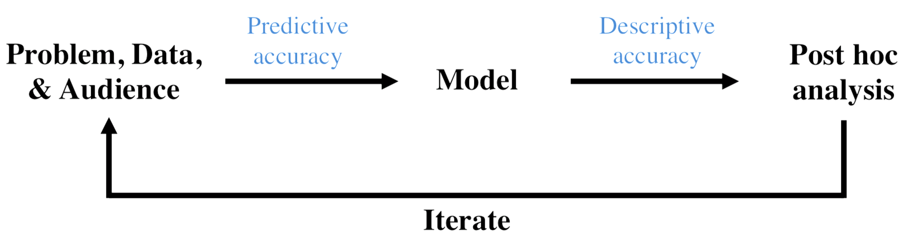

# interpretable machine learning

**chandan singh** 

---

Modern machine learning (ML) models, particularly deep neural networks, are difficult to understand and explain. This has consequences when these networks are used to make critical decisions. Thus it is important to develop methods that can interpret these highly complex models. As ML models enter into high-stakes fields, interpretability will become increasingly important. 

Interpretable ML as a field is still fairly immature, with many still asking the basic question "what is interpretability?". One recent work from our group aims to address this problem and understand the current landscape of the field of interpretable ML: [Interpretable machine learning: definitions, methods, and applications](https://arxiv.org/abs/1901.04592).

## desiderata

The work introduces three desiderata a good interpretable ML pipeline should satisfy: **predictive accuracy**, **descriptive accuracy**, and **relevancy**. These are depicted in a typical data-science lifecycle below.

## methods

The work also categorizes existing methods into two main categories: **model-based interpretability** (i.e. the construction of models that readily provide insight into the relationships they have learned) and **post-hoc interpretability** (i.e. methods that analyze a trained model in order to provide insights into the learned relationships).

Most of my recent work (e.g. [ACD](https://openreview.net/pdf?id=SkEqro0ctQ)), has focused on post-hoc interpretability. I am currently working on developing post-hoc methods for getting variable importances for random forests as well as model-based methods for more interpretable deep learning.