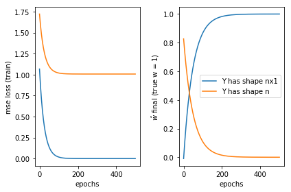

A serious, easy-to-make mistake in pytorch and how to fix it. *Update: the most recent version of pytorch throws a warning before casting*

**output shape error**: when using pytorch, it is important that the output has the right dimension. For example, if Y is one-dimensional, the Y vector must have shape (batch_size, 1) and not just shape (batch_size). The ``output_shape_err.ipynb`` notebook demonstrates this.

