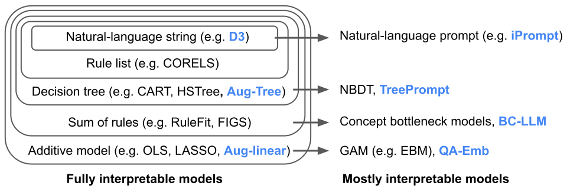

*Explaining data* is the overaching goal of data-driven science, allowing us to discover and quantitatively test hypotheses.
The pursuit of data-driven explanations has led to the development of many interpretable models that allow a user to understand data patterns, such as decision trees, rule lists, and sparse linear models.
However, these models are often not suitable to the peculiarities of text data, which is generally sparse, high-dimensional, and full of complex interactions.
In contrast, large language models (LMs) have displayed impressive proficiency at handling text data, but they are often considered black boxes. Here, let's look at some recent work on bridging the gap between interpretable models and LMs.

# Interpretable models

Many interpretable models have been proposed to interpret data involved in prediction problems (e.g. classification or regression). They may take slightly different forms (see some in Fig 1), but provide a complete description of the prediction process (as long as they're sufficiently accurate and small!). These models excel at tabular data, but struggle with other structured domains, such as text data.

|                           Rule set                           |                        Rule list                        |                        Rule tree                        |                       Algebraic models                       |
| :----------------------------------------------------------: | :-----------------------------------------------------: | :-----------------------------------------------------: | :----------------------------------------------------------: |
|  |  |  |  |

<b>Figure 1. </b>Different types of interpretable models. See scikit-learn friendly implementations [here](https://github.com/csinva/imodels),

# Adding LMs to interpretable models

Fig 2 shows some newer model forms that seek data explanations using LMs/ interpretable models. For text data, These models are often more accurate than their interpretable counterparts, but still provide a complete description of the prediction process.

In the most direct case, an LM is fed data corresponding to 2 groups (binary classification) and prompted to directly produce a description of the difference between the groups ([D3](https://proceedings.mlr.press/v162/zhong22a.html)/[D5](https://arxiv.org/abs/2302.14233)).
Alternatively, given a dataset and a pre-trained LM, [iPrompt](https://arxiv.org/abs/2210.01848) searches for a natural-language prompt that works well to predict on the dataset, which serves as a description of the data. This is more general than D3, as it is not restricted to binary groups, but is also more computationally intensive, as finding a good prompt often requires iterative LM calls.
Either of these approaches can also be applied recursively ([TreePrompt](https://arxiv.org/abs/2310.14034)), resulting in a hierarchical natural-language description of the data.

<b>Figure 2. </b>Different types of interpretable models, with text-specific approaches in bold.

In parallel to these methods, [Aug-imodels](https://arxiv.org/abs/2209.11799) use LMs to improve fully interpretable models directly.
For example, Aug-Linear uses an LM to augment a linear model, resulting in a more accurate model that is still completely interpretable.
Aug-Tree uses an LM to augment the keyphrases used in a decision tree split, resulting in a more accurate but still fully interpretable decsion tree.

This line of research is still in its infancy, but there is great potential in combining LMs and interpretable models!