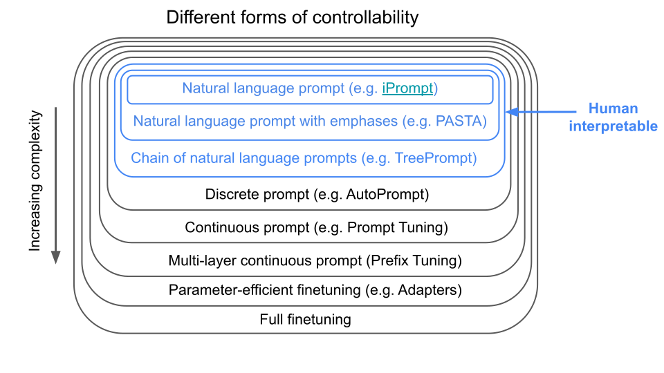

*We taught models to write. Now can they follow instructions?*

The recent success of large language models (LLMs), such as ChatGPT, has ushered in a variety of new of NLP usecases. These usecases bring new challenges regarding *model steering* and *alignment* (see this [nice review](https://arxiv.org/abs/2309.15025)). In this post, I'll discuss some of these challenges, established methods for addressing them, and a couple directions I find interesting in this area.

## Definitions and existing methods

Model steering is broadly the process of controlling the output of a model. This is generally achieved through [prompting](https://en.wikipedia.org/wiki/Prompt_engineering), where a model is given a question in text and queried for an answer.

## Improving prompting

## Mechanistic improvement of LLMs

