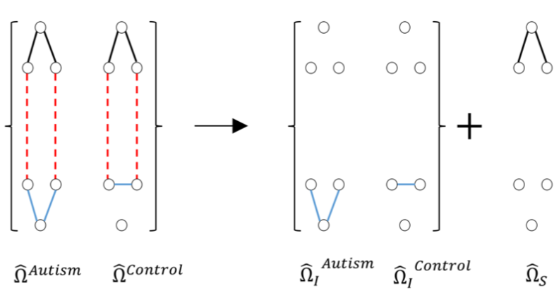

# connectomics
**chandan singh**  

---

The human brain is an immensely complicated system consisting of on the order of 86 billion neurons and 15 trillion synapses. Connectomics is the loose term referring to the field interested in mapping the brain. Two general categories exist: *structural connectomics*, which aims to map physical anatomy and *functional connectomics*, which aims to map the functions of different brain regions.

# Structural connectomics

Structural connectomics is interested in developing a map of how the brain is physically connected. The field had early success with simple organisms, such as *C. Elegans* (a roundworm), which has precisely 302 neurons ([source](http://www.opensourcebrain.org/projects/celegans)):

Recent efforts have mapped the brains of much larger organisms, such as the *[Drosophila](https://www.janelia.org/news/complete-fly-brain-imaged-at-nanoscale-resolution)* (fruit fly). One very difficult computational step in this process is converting from raw microscope images to segmented neurons. Recent studies have worked to automate this process using machine learning algorithms (see an example below).

Most of this work nowadays uses deep neural networks, as many earlir approaches (e.g. [using random forests](/assets/write_ups/singh_15_rf_segmentation.pdf)) did not scale well to very large datasets. In a [recent paper](https://ieeexplore.ieee.org/document/8364622/), we were able to design a novel loss function for deep neural networks which allowed for accurate, scalable neuron segmentation. Some reconstructed neurons from that paper are shown below.

# Functional connectomics

Functional connectomics focuses on developing maps of how *functions* are represented by the activity in different brain regions. These maps tend to be lower resolution than the anatomical maps provided by structural connectomics, but can tell us about higher-level concepts, such as language and speech.

In a [recent paper](https://arxiv.org/abs/1709.04090), we analyze functional connectomics using fMRI resting-state data. The goal was to generate maps for connectivity between 160 brain regions in the human brain, based on the [ABIDE](http://fcon_1000.projects.nitrc.org/indi/abide/) dataset. Using graphical models, we analyzed how connectivity differs between people with and without autism. Specifically, we used a constrained, weighted-l1 minimization approach, graphically depicted below and analyzed the resulting connections for different groups.

