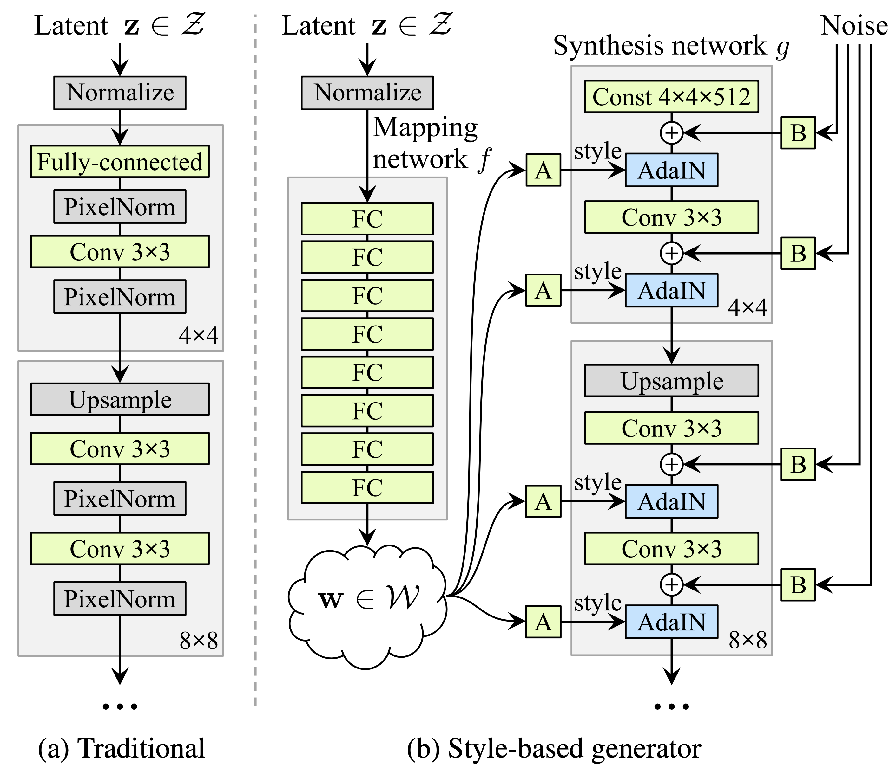

<div class="iframe-box" style="margin-top: 0px">
<iframe class="iframe" src="https://csinva.github.io/notes/cheat_sheets/disentanglement_cheat_sheet#/"
        frameborder="0" width="100%" height="auto" allowfullscreen="true" mozallowfullscreen="true" webkitallowfullscreen="true"></iframe>
</div>

# VAEs

*Some good disentangled VAE implementations are [here](https://github.com/YannDubs/disentangling-vae) and more general VAE implementations are [here](https://github.com/AntixK/PyTorch-VAE)*.

The goal is to obtain a nice latent representation $\mathbf z$ for our inputs $\mathbf x$. To do this, we learn parameters $\phi$ for the encoder $p_\phi( \mathbf z\vert \mathbf x)$ and $\theta$ for the decoder $q_{\mathbf \theta} ( \mathbf x\vert \mathbf z)$. We do this with the standard vae setup, whereby a code $z$ is sampled, using the output of the encoder (intro to VAEs [here](https://towardsdatascience.com/intuitively-understanding-variational-autoencoders-1bfe67eb5daf)).


## disentangled vae loss function


$$\overbrace{\mathbb E_{p_\phi(\mathbf z \vert \mathbf x)}}^{\text{Samples}} [ \underbrace{-\log q_{\mathbf \theta} ( \mathbf x\vert \mathbf z)}*{\text{reconstruction loss}} ] + {\color{teal}\beta}; \sum_i \underbrace{\text{KL} \left(p*\phi( \mathbf z_i\vert \mathbf x):\vert \vert:prior(\mathbf z_i) \right)}*{\text{compactness prior loss}} + \gamma ; \underbrace{\text{KL} \left( q*\phi(\mathbf z\vert \mathbf x) \vert \vert \prod_i q_\phi( \mathbf z_i\vert \mathbf x) \right)}_{\text{total correlation loss}}$$


| reconstruction loss                             | compactness prior loss                           |         total correlation loss             |
| ----------------------------------------------- | ------------------------------------------------- |:-------------------------------------------: |
| encourages accurate reconstruction of the input | encourages points to be compactly placed in space | encourages latent variables to be independent |


- summarizing the losses
  - **reconstruction loss** - measures the quality of the reconstruction, the form of the loss changes based on the assumed distribution of the likelihood of each pixel
    - *binary cross entropy loss* - corresopnds to bernoulli distr., most common - doesn't penalize (0.1, 0.2) and (0.4, 0.5) the same way, which might be problematic
    - *mse loss* - gaussian distr. - tends to focus on a fex pixels that are very wrong
    - *l1 loss* - laplace distr.
  - **compactness prior loss**
    - doesn't use the extra injected latent noise
    - tries to push all the points to the same place
    - emphasises smoothness of z, using as few dimensions of z as possible, and the main axes of z to capture most of the data variability
    - usually assume prior is standard normal, resulting in pushing the code means to 0 and code variance to 1
    - we can again split this term $\sum_i \underbrace{\text{KL} \left(p_\phi( \mathbf z_i\vert \mathbf x)\:\vert\vert\:prior(\mathbf z_i) \right)}_{\text{compactness prior loss}} = \underbrace{\sum_i I(x; z)}_{\text{mutual info}} + \underbrace{\text{KL} \left(p_\phi( \mathbf z_i)\:\vert\vert\:prior(\mathbf z_i) \right)}_{\text{factorial prior loss}}$
      - (see [factor-vae paper for proof](https://arxiv.org/pdf/1802.05983.pdf))
  - **total correlation loss** - encourages factors to be independent
    - measures dependence between marginals of the latent vars
    - intractable (requires pass through the whole dset)
    - instead sample $dec_\phi(\mathbf z\vert \mathbf x)$ and create $\prod_j dec_\phi( \mathbf z_i\vert \mathbf x) $ by permuting across the batch dimension
      - now, calculate the kl with the *density-ratio trick* - train a classifier to approximate the ratio from these terms


## disentangled vae in code

```python
# Reconstruction + KL divergence losses summed over all elements and batch
def loss_function(x_reconstructed, x, mu, logvar, beta=1):
  '''
  Params
  ------
  x_reconstructed: torch.Tensor
		Reconstructed input, with values between 0-1
	x: torch.Tensor
		input, values unrestricted
  '''
  
  # reconstruction loss (assuming bernoulli distr.)
  # BCE = sum_i [x_rec_i * log(x_i) + (1 - x_rec_i) * log(1-x_i)]
	rec_loss = F.binary_cross_entropy(x_reconstructed, x, reduction='sum')

  # compactness prior loss
	# 0.5 * sum(1 + log(sigma^2) - mu^2 - sigma^2)
	KLD = -0.5 * torch.sum(1 + logvar - mu.pow(2) - logvar.exp())
  
  # total correlation loss (calculate tc-vae way)
	z_sample = mu + torch.randn_like(exp(0.5 * logvar))
	log_pz, log_qz, log_prod_qzi, log_q_zCx = func(z_sample, mu, logvar)
  # I[z;x] = KL[q(z,x)\vert\vertq(x)q(z)] = E_x[KL[q(z\vertx)\vert\vertq(z)]]
  mi_loss = (log_q_zCx - log_qz).mean()
  # TC[z] = KL[q(z)\vert\vert\prod_i z_i]
  tc_loss = (log_qz - log_prod_qzi).mean()
  # dw_kl_loss is KL[q(z)\vert\vertp(z)] instead of usual KL[q(z\vertx)\vert\vertp(z))]
  dw_kl_loss = (log_prod_qzi - log_pz).mean()
  
	return rec_loss + beta * KLD
```


## how do these terms appear in different papers

- [vae](https://arxiv.org/abs/1312.6114) (kingma & welling, 2013)
- [beta-vae](https://openreview.net/references/pdf?id=Sy2fzU9gl) (higgins et al. 2017) - add hyperparameter $\beta$ to weight the compactness prior term
- [beta-vae H](https://arxiv.org/pdf/1804.03599.pdf) (burgess et al. 2018) - add parameter $C$ to control the contribution of the compactness prior term
  - $\overbrace{\mathbb  E_{p_\phi(\mathbf z\vert \mathbf x)}}^{\text{samples}} [ \underbrace{-\log q_{\mathbf \theta} ( \mathbf x\vert \mathbf z)}_{\text{reconstruction loss}} ]      		+ \textcolor{teal}{\beta}\; \vert\sum_i \underbrace{\text{KL} \left(p_\phi( \mathbf z_i\vert \mathbf x)\:\vert\vert\:prior(\mathbf z_i) \right)}_{\text{compactness prior loss}} -C\vert																		 					$
  -  C is gradually increased from zero (allowing for a larger compactness prior loss) until good quality reconstruction is achieved
- [factor-vae](https://arxiv.org/abs/1802.05983) (kim & minh 2018) - adds total correlation loss term
  - computes correlation loss term using discriminator
  - [beta-TC-VAE = beta-total-correlation VAE](https://arxiv.org/abs/1802.04942) (chen et al. 2018) - same objective but computed without need for discriminator
  - [Interpretable VAEs for nonlinear group factor analysis](https://arxiv.org/abs/1802.06765)
- [Adversarial Latent Autoencoder](https://arxiv.org/pdf/2004.04467.pdf) (pidhorskyi et al. 2020)
- - - improve quality of generated VAE reconstructions by using a different setup which allows for using a GAN loss
    - 

- more papers
  - [infoVAE](https://arxiv.org/abs/1706.02262)
  - [dipVAE](https://arxiv.org/abs/1711.00848)
  - [vq-vae](https://arxiv.org/abs/1711.00937)
  - [Learning Disentangled Representations with Semi-Supervised Deep Generative Models](http://papers.nips.cc/paper/7174-learning-disentangled-representations-with-semi-supervised-deep-generative-models)
    - specify graph structure for some of the vars and learn the rest

# evaluating distentanglement

- *note* - vae's come with reconstruction loss + compactness prior loss which can be looked at on their own
- data
  - [dsprites dataset](https://github.com/deepmind/dsprites-dataset/) has known latent factors we try to recover
- [beta-vae **disentanglement metric score** = higgins metric](https://medium.com/uci-nlp/summary-beta-vae-learning-basic-visual-concepts-with-a-constrained-variational-framework-91ad843b49e8) - see if we can capture known disentangled repr. using pairs of things where only one thing changes
  - start with a known generative model that has an observed set of independent and interpretable factors (e.g. scale, color, etc.) that can be used to simulate data.
  - create a dataset comprised of pairs of generated data for which a single factor is held constant (e.g. a pair of images which have objects with the same color).
  - use the inference network to map each pair of images to a pair of latent variables.
  - train a linear classifier to predict which interpretable factor was held constant based on the latent representations. The accuracy of this predictor is the disentanglement metric score.

# non-VAE

- [InfoGAN: Interpretable Representation Learning by Information Maximizing Generative Adversarial Nets](https://arxiv.org/abs/1606.03657) (chen et al. 2016)
  - encourages $I(x; c)$ to be high for a subset of the latent variables $z$
    - slightly different than vae - defined under the distribution $p(c) p(x\vert c)$ whereas vae uses $p_{data}(x)enc(z\vert x)$
  - mutual info is intractable so optimizes a lower bound
- [Stylegan](https://arxiv.org/abs/1812.04948) (karras et al. 2018)
  - 
- [Stylegan2](https://arxiv.org/abs/1912.04958) (karras et al. 2019)
  - 
- [unifying vae and nonlinear ica](https://arxiv.org/pdf/1907.04809.pdf) (khemakhem et al. 2020)
	- ICA
	  - maximize non-gaussianity of $z$ - use kurtosis, negentropy
	  - minimize mutual info between components of $z$ - use KL, max entropy
