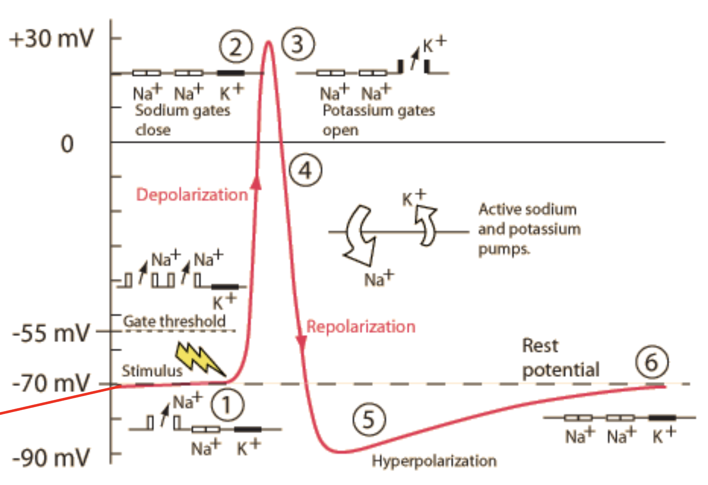

Biological neurons are incredibly complex. Their computations involve integrating inputs from thousands of other neurons over time and space, with sophisticated molecular machinery. The research here explores these computations in detail through biophysical simulations. Surprisingly, simplicity often emerges from all of this complexity.

In particular, one form of simplicity is the idea that real neurons linearly sum their inputs. This is an old idea, dating back to [McCulloch and Pitts](https://towardsdatascience.com/mcculloch-pitts-model-5fdf65ac5dd1) and is an often-used simplifying assumption in modern artificial neural networks. However, it is known that real neurons compute in a very complicated manner involving many nonlinearities.

## engineering simplicity through complexity

In one [recently published study](http://rdcu.be/FDUo), we ask the qustion: "Can a complex, realistic neuron model behave like a simple perceptron and simply sum its inputs?" The results suggest they can: for an increase in the synaptic input $x$, a realistic model can yield a linear increase in somatic voltage $c\cdot x$. This simplicity is surprising, as we know neurons have complex integration processes, but simplicity (in terms of the input-output function of the neuron) seems to emerge from all the complexity.

Furthermore, the results show that it requires no extra energy for a neuron model to linearly sum its inputs. This is also surprising, since synaptic excitation tends to decay as signals travel from the synapses to the soma, and intuitively it seems that neurons would require expending extra energy to counteract this.

## discovering simplicity through complexity

In another [recent study](http://journals.plos.org/plosone/article?id=10.1371/journal.pone.0180839) published in Plos One, we investigate a realistic model and find that the nonlinear complexities that drive the neurons behavior in fact interact to produce linearity (in terms of the neurons time-to-spike and its input intensity). We consider this neuron's time-to-spike as an appropriate encoding of the hidden intensity which controls the neuron's inputs. We find that this biologically appropriate and biophysically complex neuron has a simple characterization for interpulse interval coding, a characterization not demonstrated by the biophysically simpler passive model often used by neurotheoreticians or by more complicated neurons specified through two or three differential equations. Thus, we have an example where biophysical complexity, at the level of cell morphology and voltage-activated channels, leads to input-output simplicity at the level of a neuron's encoding of information.

## misc
Over the years, I've also worked on some other interesting problems related to neural coding including:

- [Examining the Effect of Action Potential Back Propagation on Spike Shape](/assets/write_ups/singh_14_dendrite_backprop.pdf)
- [Simulations of action potential propagation and velocity](https://github.com/csinva/act_potential)
