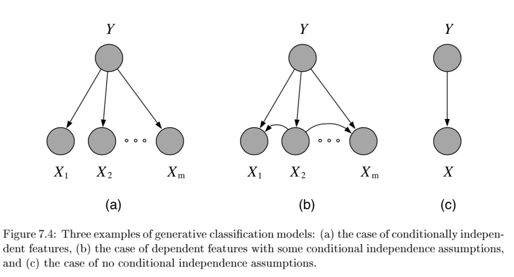
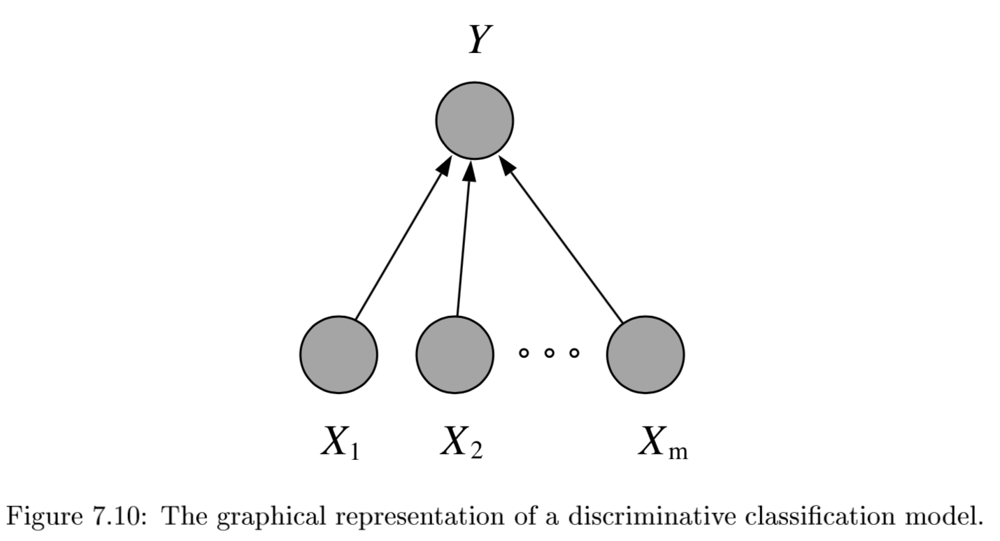

* TOC
{:toc}
# overview

- asymptotic classifier - assume you get infinite training / testing points
- *discriminative* - model $P(Y\vert X)$ directly
  - smaller asymptotic error
  - slow convergence ~ $O(p)$
- *generative* - model $P(X\vert Y)$  directly
  - generally has higher bias -> can handle missing data
  - fast convergence ~ $O[log(p)]$

# binary classification

- $\hat{y}=sign(w^T x)$
- usually don't minimize 0-1 loss (combinatorial)
- usually $w^Tx$ includes b term, but generally we don't want to regularize b

| Model               | $\hat{w}$ objective                      |
| ------------------- | ---------------------------------------- |
| Perceptron          | $\sum_i max(0,  -y_i \cdot w^T x_i)$     |
| Linear SVM          | $w^Tw + C \sum_i max(0,1-y_i \cdot w^T x_i)$ |
| Logistic regression | $w^Tw + C \sum_i log(1+exp(-y_i \cdot w^T x_i))$ |
- *perceptron* - tries to find separating hyperplane
  - whenever misclassified, update w
  - can add in delta term to maximize margin

# multiclass classification

- reducing multiclass (K categories) to binary
  - *one-against-all*
    - train K binary classifiers
    - class i = positive otherwise negative
    - take max of predictions
  - *one-vs-one* = *all-vs-all*
    - train C(K,2) binary classifiers
    - labels are class i and class j
    - inference - any class can get up to k-1 votes, must decide how to break ties
  - flaws - learning only optimizes *local correctness*
- single classifier
  - *multiclass perceptron* (Kesler)
    - if label=i, want $w_i ^Tx > w_j^T x \quad \forall j$
    - if not, update $w_i$ and $w_j$* accordingly
    - *kessler construction*
      - $w =  [w_1 ... w_k] $
      - want $w_i^T x > w_j^T x \quad \forall j$
      - rewrite $w^T \phi (x,i) > w^T \phi (x,j) \quad \forall j$
        - here $\phi (x,i)$ puts x in the ith spot and zeros elsewhere
        - $\phi$ is often used for feature representation
      - define margin: 
        $\Delta (y,y') = \begin{cases} \delta& if y \neq y' \\\ 0& if y=y'\end{cases}$
      - check if $y=argmax_{y'}w^T \phi(x,y') + \delta (y,y')$
  - multiclass SVMs (Crammer & Singer)
    - minimize total norm of weights s.t. true label is score at least 1 more than second best label
  - multinomial logistic regression = multi-class *log-linear* model
    - $P(y\vert x,w)=\frac{exp(w^T_yx)}{\sum_{y' \in \{ 1,...,K\}} exp(w_{y'}^T,x)}$
      - we control the peakedness of this by dividing by stddev
    - *soft-max*: sometimes substitue this for $w^T_y x$ 

# linear classification - J. 7

- *decision theory* - models don't require finding $p(y\|x)$
- regression doesn't work with classification
  - even in binary case, outliers can skew fit
- linear model $\implies$ boundaries are hyperplanes
- generative models
  1. Gaussian class-conditional densities
     1. binary case: posterior probability $p(Y=1|x, \theta)$ is a sigmoid $\frac{1}{1+e^{-z}}$ where $z = \beta^Tx+\gamma$
        1. multiclass extends to *softmax function*: $\frac{e^{\beta_k^Tx}}{\sum_i e^{\beta_i^Tx}}$
     2. only a linear classifier when covariance matrices are the same
        1. otherwise a quadratic classifier
     3. LDA / QDA?
     4. MLE for estimates are pretty intuitive
  2. naive Bayes classifier
     1. assumes multinomial Y
     2. with very clever tricks, can produce $P(Y^i=1|x, \eta)$ again as a softmax
  3. exponential family
     1. includes Gaussian, binomial, Poisson, gamma, Dirichlet
     2. $p(x|\eta) = \text{exp}[\eta^Tx - a(\eta)] h(x)$
     3. for classification, anything from exponential family will result in posterior probability that is logistic function of a linear function of x
- discriminative models: 
  1. logistic regression: $p(Y=1|x, \theta) = logistic(\theta^Tx)$
     1. assume Y ~ $Bernoulli(\mu_n)$ with $\mu_n=logistic(\theta^Tx$)
     2. can solve this online with GD of ***likelihood***
     3. better to solve with iteratively reweighted least squares
  2. multiway logistic classification
     1. Assume $P(Y^k=1|x, \theta) = \frac{e^{\beta_k^Tx}}{\sum_i e^{\beta_i^Tx}}$, just as arises from class-conditional exponential family distributions
  3. probit (binary) regression
     1. $p(Y=1|x, \theta) = \phi(\theta^Tx)$ where $\phi$ is the Gaussian CDF
     2. pretty similar to logistic
  4. noise-OR (binary) model
     1. consider $Y = X_1 \lor X_2 \lor … X_m$ where each has a probability of failing
        1. define $\theta$ to be the failure probabilities
     2. $p(Y=1|x, \theta) = 1-e^{-\theta^Tx}$
  5. other (binary) exponential models
     1. $p(Y=1|x, \theta) = 1-e^{-\theta^Tx}$ but x doesn't have to be binary
     2. *complementary log-log model*: $p(Y=1|x, \theta) = 1-\text{exp}[e^{-\theta^Tx}]

# discriminative

## svms

- svm benefits
  1. *maximum margin separator* generalizes well
  2. *kernel trick* makes it very nonlinear
  3. nonparametric - can retain training examples, although often get rid of many
- notation
  - $y \in \{-1,1\}$
  - $h(x) = g(w^Tx +b)$
    - g(z) = 1 if $z \geq 0$ and -1 otherwise
- define *functional margin* $\gamma^{(i)} = y^{(i)} (w^T x +b)$
  - want to limit the size of $(w, b)$ so we can't arbitrarily increase functional margin
  - function margin $\hat{\gamma}$ is smallest functional margin in a training set
- *geometric margin* = functional margin / $\vert \vert w\vert \vert $
  - if $\vert \vert w\vert \vert =1$, then same as functional margin
  - invariant to scaling of w
- optimal margin classifier
  - want $$max \: \gamma \\\: s.t. \: y^{(i)} (w^T x^{(i)} + b) \geq \gamma, i=1,..,m\\ \vert \vert w\vert \vert =1$$
    - difficult to solve, especially because of $\vert \vert w\vert \vert =1$ constraint
    - assume $\hat{\gamma}=1$ - just a scaling factor
    - now we are maximizing $1/\vert \vert w\vert \vert $
  - equivalent to this formulation: $$min \: 1/2 \vert \vert w\vert \vert ^2 \\s.t. \: y^{(i)}(w^Tx^{(i)}+b)\geq1, i = 1,...,m$$
- Lagrange duality
  - dual representation is found by solving $\underset{a}{argmax} \sum_j \alpha_j - 1/2 \sum_{j,k} \alpha_j \alpha_k y_j y_k (x_j \cdot x_k)$ subject to $\alpha_j \geq 0$ and $\sum_j \alpha_j y_j = 0$
  - data only enter in form of dot products, even when predicting $h(x) = sgn(\sum_j \alpha_j y_j (x \cdot x_j) - b)$
  - weights $\alpha_j$ are zero except for *support vectors*
- replace dot product $x_j \cdot x_k$ with *kernel function* $K(x_j, x_k)$
  - faster than just transforming x
  - allows to find optimal linear separators efficiently
- *soft margin* classifier - lets examples fall on wrong side of decision boundary
  - assigns them penalty proportional to distance required to move them back to correct side
- want to maximize margin $M = \frac{2}{\sqrt{w^T w}}$
  - we get this from $M=\vert x^+ - x^-\vert  = \vert \lambda w\vert  = \lambda \sqrt{w^Tw} $
  - separable case: argmin($w^Tw$) subject to 
  - $w^Tx+b\geq 1$ for all x in +1 class
  - $w^Tx+b\leq 1$ for all x in -1 class
- solve with quadratic programming
- non-separable case: argmin($w^T w/2 + C \sum_i^n \epsilon_i$) subject to
  - $w^Tx_i +b \geq 1-\epsilon_i $ for all x in +1 class
  - $w^Tx_i +b \leq -1+\epsilon_i $ for all x in -1 class
  - $\forall i, \epsilon_i \geq 0$
  - large C can lead to overfitting
- benefits
  - number of parameters remains the same (and most are set to 0)
  - we only care about support vectors
  - maximizing margin is like regularization: reduces overfitting
- optimization
  - these can be solved with quadratic programming QP
  - solve a dual formulation (Lagrangian) instead of QPs directly so we can use kernel trick
    - primal: $min_w max_\alpha L(w,\alpha)$
    - dual: $max_\alpha min_w L(w,\alpha)$
  - KKT condition for strong duality
    - complementary slackness: $\lambda_i f_i(x) = 0, i=1,...,m$
- VC (Vapnic-Chervonenkis) dimension - if data is mapped into sufficiently high dimension, then samples will be linearly separable (N points, N-1 dims)
- kernel functions - new ways to compute dot product (similarity function)
  - original testing function: $\hat{y}=sign(\Sigma_{i\in train} \alpha_i y_i x_i^Tx_{test}+b)$
  - with kernel function: $\hat{y}=sign(\Sigma_{i\in train} \alpha_i y_i K(x_i,x_{test})+b)$
  - linear $K(x,z) = x^Tz$
  - polynomial $K (x, z) = (1+x^Tz)^d$
  - radial basis kernel $K (x, z) = exp(-r\vert \vert x-z\vert \vert ^2)$
  - computing these is O($m^2$), but dot-product is just $O(m)$
  - function that corresponds to an inner product in some expanded feature space
- practical guide
  - use m numbers to represent categorical features
  - scale before applying
  - fill in missing values
  - start with RBF

## logistic regression

- $p_i = P(Y_i=1\|x_i) = exp(x_i^T \theta) / (1+exp(x_i^T \theta))$
- $Logit(p_i) = log(p_i / (1-p_i)) = x_i^T \theta$
- predict using Bernoulli distribution with this parameter p
- can be extended to multiple classes - multinomial distribution

## decision trees - R&N 18.3; HTF 9.2.1-9.2.3

- *inductive bias*
  - prefer small trees
  - prefer tres with high IG near root
- good for certain types of problems
  - instances are attribute-value pairs
  - target function has discrete output values
  - disjunctive descriptions may be required
  - training data may have errors
  - training data may have missing attributes
- greedy - use statistical test to figure out which attribute is best
  - split on this attribute then repeat
- growing algorithm
  1. *information gain* - decrease in entropy
     - weight resulting branches by their probs
     - bias towards attributes with many values
     - use *GainRatio* = Gain/SplitInformation
       - can incorporate *SplitInformation* - discourages selection of attributes with many uniformly distributed values
       - sometimes SplitInformation is very low (when almost all attributes are in one category)
         - might want to filter using Gain then use GainRatio
  2. regression tree
     - must decide when to stop splitting and start applying linear regression
     - must *minimize SSE* 
- can get stuck in local optima
- avoid overfitting 
  - don't grow too deep
  - early stopping doesn't see combinations of useful attributes
  - overfit then prune - proven more succesful
    - *reduced-error pruning* - prune only if doesn't decrease error on validation set
    - *$\chi^2$ pruning* - test if each split is statistically significant with $\chi^2$ test
    - *rule post-pruning* = *cost-complexity pruning*
      1. Infer the decision tree from the training set, growing the tree until the training data is fit as well as possible and allowing overfitting to occur.
      2. Convert the learned tree into an equivalent set of rules by creating one rule for each path from the root node to a leaf node.
         - these rules are easier to work with, have no structure
      3. Prune (generalize) each rule by removing any preconditions that result in improving its estimated accuracy.
      4. Sort the pruned rules by their estimated accuracy, and consider them in this sequence when classifying subsequent instances.
- incorporating continuous-valued attributes
  - have to pick threshold to split on
    - candidate thresholds: separate examples that differ in their target classificaiton
      - just evaluate them all
- missing values
  - could just fill in most common value
  - also could assign values probabilistically
- differing costs
  - can bias the tree to favor low-cost attributes
    - ex. divide gain by the cost of the attribute
- high variance - instability - small changes in training set will result in changes of tree model
- many trees
  - *bagging* = bootstrap aggregation - an ensemble method
    - *bootstrap* - resampling with replacement
    - training multiple models by randomly drawing new training data
    - bootstrap with replacement can keep the sampling size the same as the original size
  - *random forest* - for each split of each tree, choose from only m of the p possible features
    - smaller m decorrelates trees, reduces variance
    - RF with m=p $\implies$ bagging
  - voting
    - consensus: take the majority vote
    - average: take average of distribution of votes
      - reduces variance, better for improving more variable (unstable) models
    - *adaboost* - weight models based on their performance

# generative

## naive bayes classifier

- let $C_1,...,C_L$ be the classes of Y
- want Posterior $P(C\vert X) = \frac{P(X\vert C)(P(C)}{P(X)}$ 
- MAP rule - maximum A Posterior rule
  - use prior P(C)
  - given x, predict $C^*=\text{argmax}_C P(C\vert X_1,...,X_p)=\text{argmax}_C P(X_1,...,X_p\vert C) P(C)$
    - generally ignore constant denominator
- naive assumption - assume that all input attributes are conditionally independent given C
  - $P(X_1,...,X_p\vert C) = P(X_1\vert C)\cdot...\cdot P(X_p\vert C) = \prod_i P(X_i\vert C)$ 
- learning
  - learn L distributions $P(C_1),P(C_2),...,P(C_L)$
  - learn $P(X_j=x_{jk}\vert C_i)$
  - for j in 1:p
  - i in 1:$\vert C\vert $
  - k in 1:$\vert X_j\vert $
  - for discrete case we store $P(X_j\vert c_i)$, otherwise we assume a prob. distr. form
- naive: $\vert C\vert  \cdot (\vert X_1\vert  + \vert X_2\vert  + ... + \vert X_p\vert )$ distributions
- otherwise: $\vert C\vert \cdot (\vert X_1\vert  \cdot \vert X_2\vert  \cdot ... \cdot \vert X_p\vert )$
- testing
  - $P(X\vert c)$ - look up for each feature $X_i\vert C$ and try to maximize
- smoothing - used to fill in 0s
  - $P(x_i\vert c_j) = \frac{N(x_i, c_j) +1}{N(c_j)+\vert X_i\vert }$ 
  - then, $\sum_i P(x_i\vert c_j) = 1$

## gaussian classifiers

- distributions
  - Normal $P(X_j\vert C_i) = \frac{1}{\sigma_{ij} \sqrt{2\pi}} exp\left( -\frac{(X_j-\mu_{ij})^2}{2\sigma_{ij}^2}\right)$- requires storing $\vert C\vert \cdot p$ distributions
  - Multivariate Normal $\frac{1}{(2\pi)^{D/2}} \frac{1}{\vert \Sigma\vert ^{1/2}} exp\left(-\frac{1}{2} (x-\mu)^T \Sigma^{-1} (x-\mu)\right)$where $\Sigma$ is covariance matrix
- decision boundary are points satisfying $P(C_i\vert X) = P(C_j\vert X)$
- LDA - linear discriminant analysis - assume covariance matrix is the same across classes
  - Gaussian distributions are shifted versions of each other
  - decision boundary is linear
- QDA - different covariance matrices
  - estimate the covariance matrix separately for each class C
  - decision boundaries are quadratic
  - fits data better but has more parameters to estimate
- Regularized discriminant analysis - shrink the separate covariance matrices towards a common matrix
  - $\Sigma_k = \alpha \Sigma_k + (1-\alpha) \Sigma$
- treat each feature attribute and class label as random variables
  - we assume distributions for these
  - for 1D Gaussian, just set mean and var to sample mean and sample var

## text classification

- bag of words - represent text as a vector of word frequencies X
  - remove stopwords, stemming, collapsing multiple - NLTK package in python
  - assumes word order isn't important
  - can store n-grams
- multivariate Bernoulli: $P(X\vert C)=P(w_1=true,w_2=false,...\vert C)$
- multivariate Binomial: $P(X\vert C)=P(w_1=n_1,w_2=n_2,...\vert C)$
  - this is inherently naive
- time complexity
  - training O(n*average\_doc\_length\_train+$\vert c\vert \vert dict\vert $)
  - testing O($\vert C\vert $ average\_doc\_length\_test)
- implementation
  - have symbol for unknown words
  - underflow prevention - take logs of all probabilities so we don't get 0
  - $c = \text{argmax }log \:P(c) + \sum_i log \: P(X_i\vert c)$

# instance-based (nearest neighbors)

- also called lazy learners = nonparametric models
- makes Voronoi diagrams
- can take majority vote of neighbors or weight them by distance
- distance can be Euclidean, cosine, or other
  - should scale attributes so large-valued features don't dominate
  - *Mahalanobois* distance metric takes into account covariance between neighbors
  - in higher dimensions, distances tend to be much farther, worse extrapolation
  - sometimes need to use *invariant metrics*
    - ex. rotate digits to find the most similar angle before computing pixel difference
      - could just augment data, but can be infeasible
      - computationally costly so we can approximate the curve these rotations make in pixel space with the *invariant tangent line*
      - stores this line for each point and then find distance as the distance between these lines
- finding NN with *k-d* (k-dimensional) tree
  - balanced binary tree over data with arbitrary dimensions
  - each level splits in one dimension
  - might have to search both branches of tree if close to split
- finding NN with *locality-sensitive hashing*
  - approximate
  - make multiple hash tables
    - each uses random subset of bit-string dimensions to project onto a line
    - union candidate points from all hash tables and actually check their distances
- comparisons
  - error rate of 1 NN is never more than twice that of Bayes error

# likelihood calcs

## single Bernoulli

- L(p) = P(Train | Bernoulli(p)) = $P(X_1,...,X_n\vert p)=\prod_i P(X_i\vert p)=\prod_i p^{X_i} (1-p)^{1-X_i}$
- $=p^x (1-p)^{n-x}$ where x = $\sum x_i$
- $log(L(p)) = log(p^x (1-p)^{n-x}=x log(p) + (n-x) log(1-p)$
- $0=\frac{dL(p)}{dp} = \frac{x}{p} - \frac{n-x}{1-p} = \frac{x-xp - np+xp}{p(1-p)}=x-np$
- $\implies \hat{p} = \frac{x}{n}$

## multinomial

- $L(\theta)=P(Train\vert Multinomial(\theta))=P(d_1,...,d_n\vert \theta_1,...,\theta_p)$ where d is a document of counts x
- =$\prod_i^n P(d_i\vert \theta_1,...\theta_p)=\prod_i^n factorials \cdot \theta_1^{x_1},...,\theta_p^{x_p}$- ignore factorials because they are always same
  - require $\sum \theta_i = 1$
- $\implies \theta_i = \frac{\sum_{j=1}^n x_{ij}}{N}$ where N is total number of words in all docs