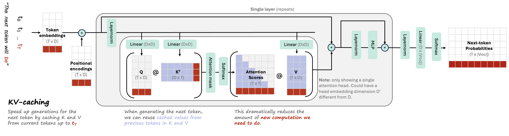

{:toc}

See related papers in the [📌 llm research](https://csinva.io/notes/research_ovws/ovw_llms.html) and [📌 interpretability](https://csinva.io/notes/research_ovws/ovw_interp.html) pages.

# basics




- **attention** = vector of importance weights
  - to predict or infer one element, such as a pixel in an image or a word in a sentence, we estimate using the attention vector how strongly it is correlated with (or “*attends to*” other elements and take the sum of their values weighted by the attention vector as the approximation of the target
- vanilla transformer: multihead attention, add + norm, position-wise ffn, add + norm
- self-attention layer [implementation](https://github.com/mertensu/transformer-tutorial), [mathematics](https://homes.cs.washington.edu/~thickstn/docs/transformers.pdf), and **chandan's self-attention [cheat-sheet](https://slides.com/chandansingh-2/deck-51f404)**

# historically influential transformer-based models

**nlp** (see also [this link](https://medium.com/nlplanet/a-brief-timeline-of-nlp-from-bag-of-words-to-the-transformer-family-7caad8bbba56))

- early papers
  - attention is all you need ([vaswani et al. 2017](https://arxiv.org/abs/1706.03762)) - initial transformer
    - encoder-decoder transformer for seq-to-seq (most new models don't have  special encoder-decoder structure for translation)
    - Semi-supervised Sequence Learning ([dai & quoc le, 2015](https://arxiv.org/abs/1511.01432)) - context vector is weighted sum of context vector at each word
  - ULMFiT ([howard & ruder, 2018](https://arxiv.org/abs/1801.06146))
- BERT ([devlin et al. 2018](https://arxiv.org/abs/1810.04805)) - semi-supervised learning (predict masked word - this is bidirectional) + supervised finetuning
  - RoBERTa ([liu et al. 2019](https://arxiv.org/abs/1907.11692))
  - BART ([lewis et al. 2019](https://arxiv.org/abs/1910.13461)) - generalizes BERT with sequence-to-squence training: train by (1) corrupting text then (2) reconstruct the original text
  - ELMo ([peters...zettlemoyer, 2018](https://arxiv.org/abs/1802.05365)) - no word embeddings - train embeddings w/ bidirectional lstm (on language modeling)
  - XLNet ([yang...quoc le, 2020](https://arxiv.org/abs/1906.08237))
- GPT-4 (openai, 2023) - adds multimodal understanding + boosts context length to 32k
  - GPT-4o - adds more multimodality for input/output
  - GPT-3 ([brown et al. 2020](https://arxiv.org/abs/2005.14165?2)) - identical to GPT-2 except larger and replaces dense attention with sparse attention
    - sizes: largest has 175B params, 96 layers, 96 heads in each layer, head with dim 128, vocab size ~50k
  - InstructGPT ([ouyang...lowe, 2022](https://arxiv.org/abs/2203.02155))
  - GPT-2 ([radford et al. 2018](https://d4mucfpksywv.cloudfront.net/better-language-models/language_models_are_unsupervised_multitask_learners.pdf))
  - GPT ([radford et al. 2018](https://s3-us-west-2.amazonaws.com/openai-assets/research-covers/language-unsupervised/language_understanding_paper.pdf))
  - Gopher ([deepmind, 2021](https://arxiv.org/abs/2112.11446)) - basically gpt-3 with slight mods (replace layernorm by RMSnorm, different positional embeddings)
  - open-source (from meta ai): [LlaMa 2](https://ai.meta.com/research/publications/llama-2-open-foundation-and-fine-tuned-chat-models/), [LLaMa](https://scontent-sea1-1.xx.fbcdn.net/v/t39.8562-6/333078981_693988129081760_4712707815225756708_n.pdf?_nc_cat=108&ccb=1-7&_nc_sid=ad8a9d&_nc_ohc=0JlbsRuMCfYAX89GkW5&_nc_ht=scontent-sea1-1.xx&oh=00_AfAKI4SBnQesKWtXsUVxzF9w_IT_qOgOTTKNpeZRptOBuw&oe=63FDD562), [OPT-IML](https://arxiv.org/abs/2212.12017), [OPT](https://arxiv.org/abs/2205.01068)
    - [GPT4All](https://s3.amazonaws.com/static.nomic.ai/gpt4all/2023_GPT4All_Technical_Report.pdf) (LLaMA 7B finetuned on code/stories/dialogue)
- ELECTRA: Pre-training Text Encoders as Discriminators Rather Than Generators ([clark...quoc le, chris manning, 2020](https://arxiv.org/abs/2003.10555)) - more efficient: rather than standard masked training, use generator-discriminator setup for "token detection"

  - generator replaces many masked tokens with plausible samples - train with MLM
  - discriminator tries to guess which tokens were the masked ones - this is the main model that gets used
- LongNet: Scaling Transformers to 1,000,000,000 Tokens ([ding, ..., wei, 2023](https://arxiv.org/abs/2307.02486)) - multiscale attention similar to wavelets
  - Longformer: The Long-Document Transformer ([Beltagy, Peters, & Cohan 2020](https://arxiv.org/abs/2004.05150)) - processes very long contexts
- PaLM: Scaling Language Modeling with Pathways ([Google 2022](https://arxiv.org/abs/2204.02311)) - 540 Billion params
  - pathways hardware center allows for fast/efficient training
  - discontinuous improvements - at some point large model improves
  - Chinchilla: Training Compute-Optimal LLMs ([DeepMind 2022](https://arxiv.org/abs/2203.15556))
    - "chinchilla scaling laws" - for compute-optimal training, the model size and the number of training tokens should be scaled equally
- T0 ([sanh...rush, 2022](https://arxiv.org/pdf/2110.08207.pdf)) - multitask training enables better zero-shot generalization
  - T5 ([raffel...liu, 2020](https://jmlr.org/papers/volume21/20-074/20-074.pdf)) -- text-to-text transfer transformer
  - UL2: Unifying Language Learning Paradigms ([tay...metzler, 2022](https://arxiv.org/abs/2205.05131)) - open-source 20B model, beats GPT-3 at zero-shot
- early instruction following

  - FLAN-PaLM: Scaling Instruction-Finetuned Language Models ([chung, ..., quoc le, jason wei, 2022](https://arxiv.org/abs/2210.11416)) - finetune with datasets phrased as instructions
    - FLAN ([wei, ..., le, 2021](https://arxiv.org/abs/2109.01652)) - finetune on instructions to follows instructions
- subquadratic attention
  - MAMBA ([gu & dao, 2023](https://arxiv.org/abs/2312.00752)) - state-space model
- reasoning models
  - O1, O3, Deepseek-R1, ...
- smaller newer models
  - phi-1, phi-2
  - mistral 7B, mixtral MoE
- clinical
  - ClinicalGPT: LLMs Finetuned with Diverse Medical Data and Comprehensive Evaluation ([wang, ..., li, 2023](https://arxiv.org/abs/2306.09968))
  - BioGPT ([luo...poon, liu, 2022](https://academic.oup.com/bib/article-abstract/23/6/bbac409/6713511))
    - ChatDoctor (finetuned LLAMA) ([yunxiang, ..., you, 2023](https://arxiv.org/abs/2303.14070))
    - PubMedGPT (2.7B): ([bolton, hall, ..., manning, liang, 2022](https://crfm.stanford.edu/2022/12/15/pubmedgpt.html)) -> renamed to *BioMedLM*
    - BioBERT: [A pre-trained biomedical language representation model for biomedical text mining](https://arxiv.org/abs/1901.08746) (2019)
    - PubMedBERT: [Domain-Specific Language Model Pretraining for Biomedical Natural Language Processing](https://arxiv.org/abs/2007.15779) (gu...gao, poon, 2021)
    - Med-PaLM 2 ([google, 2023](https://arxiv.org/abs/2305.09617)) - state of the art QA
      - LLMs Encode Clinical Knowledge ([singhal, ..., natarajan, 2022, google/deepmind](https://arxiv.org/abs/2212.13138)) - introduce MultiMedQA dataset + derive Med-PaLM, a prompt-tuned version of PaLM
    - PMC-LLaMA ([wu et al. 2023](https://arxiv.org/pdf/2304.14454.pdf))
- paper parsing
  - Nougat: Neural Optical Understanding for Academic Documents ([blecher…scialom, sojnic, 2023](https://arxiv.org/abs/2308.13418))
  - PDFTriage: Question Answering over Long, Structured Documents ([adobe, 2023](https://arxiv.org/abs/2309.08872))


**other**

- text-vision models
  - CLIP ([radford et al. 2021](https://cdn.openai.com/papers/Learning_Transferable_Visual_Models_From_Natural_Language.pdf)) - jointly train text/images
    - batch-based loss: encodings from same image/text pair should be close while encodings across different examples in the batch should be different
    - note: empirically works better with very large batch size
  - DALL-E 2 ([OpenAI, 2022](https://openai.com/dall-e-2/))
    - clip is foundation as generative model
    - generates text + image embeddings
    - "prior network" maps text embedding to image embedding
    - adds diffusion model
    - Stable diffusion ([stability.ai, 2022](https://stability.ai/blog/stable-diffusion-public-release)) - open-source recreation, now highly optimized for speed
    - Imagen ([google, 2022](https://arxiv.org/abs/2205.11487))
  - BLIP-2 ([salesforce, 2023](https://arxiv.org/abs/2301.12597)) - Bootstrapping Language-Image Pre-training with Frozen Image Encoders and LLMs  
    - BEiT-3 ([2022](https://arxiv.org/abs/2208.10442)) - treat vision as language and large-scale multimodal training
    - outperforms [Flamingo](https://arxiv.org/abs/2204.14198) (2022), which uses more domain knowledge to connect vision & language
  - video
    - Text-To-4D Dynamic Scene Generation ([meta, 2023](https://arxiv.org/abs/2301.11280v1))

- vision (rather than words, people generally use image patches as tokens)
  - VIT: An Image is Worth 16x16 Words: Transformers for Image Recognition at Scale ([dosoviskiy, ..., houlsby, 2020](https://arxiv.org/abs/2010.11929))
    - attention augmentation to resnet for vision ([bello...quoc le, 2020](https://arxiv.org/abs/1904.09925))
  - DINOv2 (FAIR, 2022)
    - DINO: Emerging Properties in Self-Supervised Vision Transformers ([FAIR, 2021](https://arxiv.org/abs/2104.14294))
  - SAM 2 ([FAIR, 2024](https://arxiv.org/abs/2408.00714)) - strong segmentation model (handles 2D images or 2D images + time)
    - SAM 1 ([FAIR, 2023](https://arxiv.org/abs/2304.02643)) - segmentation for 2D images
  - Masked Autoencoders Are Scalable Vision Learners ([he...dollar, girshick, 2021](https://arxiv.org/abs/2111.06377)) - BERT-style training
    -  speed up by not applying encoder to mask tokens + adding mask to a lot of the data (like 75%)
    -  really good results without much data
  - spatial transformers networks ([deepmind, 2015](https://papers.nips.cc/paper/5854-spatial-transformer-networks.pdf ))
  
- reinforcement learning (RL)
  - AdA: Human-Timescale Adaptation in an Open-Ended Task Space ([deepmind, 2023](https://arxiv.org/abs/2301.07608))
  - GATO: A Generalist Agent ([deepmind, 2022](https://arxiv.org/abs/2205.06175)) - single agent plays many different video games
    - different modalities are converted to tokens differently (e.g. image patches are fed through resnet)
  - In-context Reinforcement Learning with Algorithm Distillation ([laskin, wang, ..., sahni, satinder singh, mnih, 2022, deepmind](https://arxiv.org/abs/2210.14215)) - learn to improve an RL algorithm
    - put history of (observation, action, reward) sequences into context and then use them to predict new action given new observation
  - Decision Transformer: Reinforcement Learning via Sequence Modeling ([chen, lu, ...abbeel, srinivas, mordatch, 2021](https://arxiv.org/pdf/2106.01345.pdf)) - transformer that predicts what the next highest reward step is instead of the next word

- agents

  - AutoGen: Enabling Next-Gen LLM Applications via Multi-Agent Conversation ([wu, bansal, ..., wang, 2024](https://arxiv.org/pdf/2308.08155.pdf))

- dialog
  - ChatGPT
  - GODEL: Large-Scale Pre-Training for Goal-Directed Dialog ([baolin peng, galley, ..., gao , 2022](https://arxiv.org/abs/2206.11309)) - add grounded pre-training
  - Deal or No Deal? End-to-End Learning for Negotiation Dialogues ([lewis...batra, 2017, Meta](https://arxiv.org/abs/1706.05125) ) - controversial paper where agents "make up their own language" (this is pre-transformers)
  
- MINERVA: Solving Quantitative Reasoning Problems with Language Models ([google, 2022](https://arxiv.org/abs/2206.14858)) - train on well-parsed, domain-specific data (math arxiv) to solve math-reasoning problems

  - autoformalization ([wu..., szegedy, 2022](https://arxiv.org/abs/2205.12615)) - translating from natural language math to formal language
  - produce sql/python that then finds an answer ([cheng...zettlemoyer, smith, yu, 2022](https://arxiv.org/abs/2210.02875))

- CODEX: Evaluating LLMs Trained on Code ([2021, openai](https://arxiv.org/abs/2107.03374))
  - Repair Is Nearly Generation: Multilingual Program Repair with LLMs ([Joshi et al. 2022](https://arxiv.org/abs/2208.11640))
  - Improving automatically generated code from Codex via Automated Program Repair ([Fan et al. 2022](https://arxiv.org/abs/2205.10583)) - use automated program repair to tweak codex outputs to make them better
  - Generating Question Titles for Stack Overflow from Mined Code Snippets ([Gao et al. 2020](https://dl.acm.org/doi/abs/10.1145/3401026?casa_token=FEWYSo9ZmNIAAAAA:-_ZIkXQVUR3xYaB3NtrzBv0jZU6IZ6O4f_W_ZDtb6TipLBV4YHB-0lbO1JU8T9wwIl_jLBS3ts0))
  - Automatic Program Repair with OpenAI's Codex: Evaluating QuixBugs ([Prenner & Robbes, 2021](https://arxiv.org/abs/2111.03922))
    - use prompt like:
      ```python
      ### fix the bug in the following function
      <buggy function and/or docstring here>
      ### fixed function
      ```
    
  - program synthesis [arxiv.org/abs/2108.07732](https://arxiv.org/abs/2108.07732) - formalize natural language into runnable code

- science

  - Galactica: A LLM for Science ([taylor..., stojnic, 2022, meta ai](https://galactica.org/static/paper.pdf)) - trained on mostly papers + some knowledge bases (e.g. proteins)
  - Nougat: Neural Optical Understanding for Academic Documents ([blecher…scialom, sojnic, 2023](https://arxiv.org/abs/2308.13418))

- audio
  - MusicLM: Generating Music From Text ([google, 2023](https://arxiv.org/abs/2301.11325))
  - Jukebox: A Generative Model for Music ([openai, 2020](https://arxiv.org/abs/2005.00341))
  - Voicebox: Text-Guided Multilingual Universal Speech Generation at Scale ([meta, 2023](https://research.facebook.com/publications/voicebox-text-guided-multilingual-universal-speech-generation-at-scale/)) - text-to-speech
  
- summarization / keywords

  - KeyBERT: Minimal keyword extraction with BERT ([grootendorst, 2020]

# ngram-based models

- Infini-gram: Scaling Unbounded n-gram Language Models to a Trillion Tokens ([liu, min, zettlemoyer, choic, & hajishirzi, 2024](https://arxiv.org/pdf/2401.17377.pdf))

  - motivation: hard to scale ngram models to large datasets and large data lengths
  - soln 1: backoff ([Jurafsky & Martin, 2000](https://scholar.google.com/citations?view_op=view_citation&hl=en&user=uZg9l58AAAAJ&citation_for_view=uZg9l58AAAAJ:2osOgNQ5qMEC)) - select *n* based on the longest suffix of the prompt that has a non-zero count in the corpus
    - counts of the next token yield the prob. of the next token
    - Katz backoff ([Katz, 1987](https://ieeexplore.ieee.org/abstract/document/1165125)) discounts probs to yield valid prob. distr.
  - soln 2: represent prob. table in [suffix array](https://en.wikipedia.org/wiki/Suffix_array) to make things very fast
    - suffix array stores address to each location in the training data alphabetically sorted
      - roughly the same size
    - this makes it fast to search for instances of an ngram (and also for what precedes/follows it)
  - results show that infinigram can considerably improve perplexities when it is linearly combined with the logits from LLMs (experiments up to llama-2 70B)
  - Interpretable Language Modeling via Induction-head Ngram Models ([kim, mantena, ..., gao, 2024](https://arxiv.org/abs/2411.00066)) - extend infinigram with fuzzy-matching induction heads to improve adaptation
  - Transformers Can Represent n-gram Language Models ([svete & cotterell, 2024](https://arxiv.org/abs/2404.14994)) - transformers have the computational capacity to represent ngram models
  - Generalization through Memorization: Nearest Neighbor Language Models ([khandelwal, levy, jurafsky, zettlemoyer, & lewis, 2020](https://arxiv.org/abs/1911.00172)) - average over output of neighboring embeddings

  - smoothing ngram models ([chen & goodman, 1996](https://arxiv.org/pdf/cmp-lg/9606011))
    - interpolation - e.g. linearly combine pobabilities shorter ngram sequences with larger ngram sequences (places better prior on ngrams that were not seen)

  - see also latent LM for smoothing

  - Improving N-gram Language Models with Pre-trained Deep Transformer([wang et al. 2019](https://arxiv.org/abs/1911.10235) ) - use transformer to generate synthetic data for new n-gram model (language model, doesn't extend to classification)

  - Improvements to N-gram Language Model Using Text Generated from Neural Language Model ([suzuki et al. 2019](https://ieeexplore.ieee.org/abstract/document/8683481?casa_token=7iD-YiGsHTAAAAAA:N3XmuRk27wGttURXYIYDbxdADVdhJMeUeBvVugq0EbyMst-zrm93wPZtc37uUBBtUPXKPrxvGZJC)) - generate synthetic data from RNNs for new n-gram model

- classifierss
  - Aug-imodels: Augmenting Interpretable Models with LLMs during Training ([singh, askari, caruana, & gao, 2023](https://arxiv.org/abs/2209.11799)) - build fully transparent n-gram based classifiers (linear or tree) by distilling info from LLMs
  - fasttext ([jin et al. 2016](https://www.ijcai.org/Proceedings/16/Papers/401.pdf))
  - Neural Bag-of-Ngrams ([li et al. 2017](https://ojs.aaai.org/index.php/AAAI/article/view/10954)) - learn embedding vectors for ngrams via deep version of skip-gram

# mathematical overview of transformers

- based on [Formal Algorithms for Transformers](https://arxiv.org/abs/2207.09238?utm_source=substack&utm_medium=email)
- tasks
  - *sequence modeling*: learn $p(x)$, usually factorized as $p(x_i|x_1,...,x_{i-1})$
  - *sequence-to-sequence*: learn $p(z|x)$, e.g. transalation, speech-to-text, question answering
- preprocessing
  - embedding matrix takes in one-hot tokens and linearly maps them to a vector
  - positional embedding of a token is usually added to the token embedding to form a token’s initial embedding
- attention types
  - *Bidirectional / unmasked self-attention* - primary/context vectors are the same
  - *Unidirectional / masked self-attention* - mask scores from before a given word
  - *Cross-attention* - primary/context vectors can come from different places
- non-attention
  - layernorm: controls mean/variance of activations
    - RMSnorm: simpler version, sets mean/offset to zero
- unembedding
  - linear layer (with softmax) that outputs size of original vocab
    - sometimes fixed to be transpose of the embedding matrix
- predictions
  - predict next word using single linear layer on hidden state from previous word
  - finetune classification head often only using linear layer on first token from sequence

- architectures
  - initially, encoder-decoder was common, but now often no decoder

# visual explanation of self-attention

-  based on article by jay allamar

- **self-attention ** - layer that lets word learn its relation to other layers
  - for each word, want score telling how much importance to place on each other word (queries $\cdot$ keys)
  - we get an encoding for each word
    - the encoding of each word returns a weighted sum of the values of the words (the current word gets the highest weight)
    - softmax this and use it to do weighted sum of values
  - (optional) implementation details
    - **multi-headed attention** - just like having many filters, get many encodings for each word
      - each one can take input as the embedding from the previous attention layer
    - **position vector** - add this into the embedding of each word (so words know how far apart they are) - usually use sin/cos rather than actual position number
    - **padding mask** - add zeros to the end of the sequence
    - **look-ahead mask** - might want to mask to only use previous words (e.g. if our final task is decoding)
    - **residual + normalize** - after self-attention layer, often have residual connection to previous input, which gets added then normalized
  - decoder - each word only allowed to attend to previous positions
  - 3 components
    - queries
    - keys
    - values
- **attention**
  - encoder reads input and ouputs context vector after each word
  - decoder at each step uses a different weighted combination of these context vectors
    - specifically, at each step, decoder concatenates its hidden state w/ the attention vector (the weighted combination of the context vectors)
    - this is fed to a feedforward net to output a word
    - 
  - at a high level we have $Q, K, V$ and compute $\text{softmax}(QK^T)V$
    - instead could simplify it and do $\text{softmax}(XX^T)V$ - this would then be based on kernel
- **transformer**
  - uses many self-attention layers
  - many stacked layers in encoder + decoder (not rnn: self-attention + feed forward)
  - details
    - initial encoding: each word -> vector
    - each layer takes a list of fixed size (hyperparameter e.g. length of longest sentence) and outputs a list of that same fixed size (so one output for each word)
      - can easily train with a masked word to predict the word at the predicted position in the encoding
  - multi-headed attention has several of each of these (then just concat them)

## huggingface tutorial

Broadly, models can be grouped into three categories:

- GPT-like (also called *auto-regressive* Transformer models)
- BERT-like (also called *auto-encoding* Transformer models)
- BART/T5-like (also called *sequence-to-sequence* Transformer models)
- [Handling multiple sequences - Hugging Face Course](https://huggingface.co/course/chapter2/5?fw=pt)
  - pad sequences to have the same length (need to modify attention masks to ignore the padded values)

## pre-transformer nlp models

- rnns
  - when training rnn, accumulate gradients over sequence and then update all at once
  - **stacked rnns** have outputs of rnns feed into another rnn
  - bidirectional rnn - one rnn left to right and another right to left (can concatenate, add, etc.)
- standard seq2seq
  - encoder reads input and outputs context vector (the hidden state)
  - decoder (rnn) takes this context vector and generates a sequencefagoa