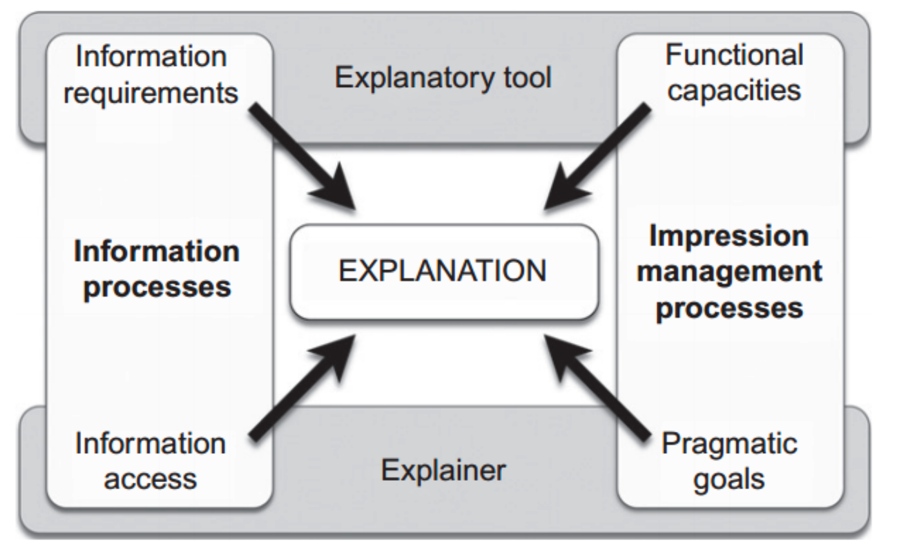

Some notes on papers / books surrounding psychology, especially evolutionary psychology and the psychology of explanation. These are notes on the authors' points and not an endorsement of their views.

{:toc}

# explanations

## psychology of xai ([miller, 2006](https://www.sciencedirect.com/science/article/abs/pii/S0004370218305988))

- people employ certain biases (kahneman, 2011) and social expectations (hilton, 1990) when they generate and evaluate explanation
- 4 properties
  - **Explanations are contrastive** — they are sought in response to particular counter- factual cases -- people do not ask why event P happened, but rather why event P happened instead of some event Q
  - **Explanation are selected (in a biased manner)** — people use cognitive biases to expect and give specific causes rather than all the possible real causes
  - **Probabilities probably don’t matter** — while truth and likelihood are important in explanation and probabilities really do matter, referring to probabilities or statistical relationships in explanation is not as effective as referring to causes
  - Explanations are social — they are a transfer of knowledge, presented as part of a conversation or interaction, and are thus presented relative to the explainer’s beliefs about the explainee’s beliefs.
- philosophical foundations
  - "To explain an event is to provide some information about its causal history..."
  - 2 types of causal definitions: dependence (e.g. probabilistic model) or transference (physical causation)
  - 2 types of (perceived) causes: internal (due to an actor) vs external (due to situation / environment)
- explanation is an answer to a *why-question*
- *abductive reasoning* - deriving a hypothesis to explain observed phenomenon
  - "inference to the best explanation" (harman)
  - contrasts with *inductive reasoning* - accepting a hypothesis via scientific experiments
- contrasts - lots of possible contrasts given a question, often communicated using tone
- overton gives 5 categories and 4 relations that define building blocks for any scientific explanation
- social attribution - big emphasis on intentionality
  - folk psychology does not describe how we think; it describes how we think we think
  - while people attribute less intentionality to aggregate groups than to individuals, they attribute more intention- ality to jointly acting groups than to individuals (o'laughlin & malle)
  - side-effect effect = knobe effect - asymmetry of responses of side effects in harm/help scenarios - moral character of consequences influences how non-moral aspects (e.g. intentionality) are judged
    - cause could be the same as "morally or institutionally responsible"
- cognitive processes used in explanation
  - 
  - *causal connection* - process people use to identify the causes of events
    - explaining (which forces people to think more systematically about the abduction process) is good for fostering generalisations, but this comes at a cost of over-generalisation (williams et al.)
    - “Identifying something as an instance of a kind and explaining some of its properties in terms of its being the kind of thing it is are not two distinct activities, but a single cognitive activity.” (prasada)
    - people tend to focus more on abnormal causes and also differ based on their perspective (kahneman & tversky)
  - *explanation selection* - process people use to select a small subset of identified causes as the explanation
    - contrastive, abnormality, intentionality, functionality, necessity, sufficienty, robustness, responsibility, blame
  - *explanation evaluation* - processes an explainee uses to evaluate the quality of an explanation
    -  probability, simplicity, generalizability, and coherence with prior beliefs.
- explanation is social - often is conversational
  - Grice’s maxims of conversation: quality, quantity, relation, and manner
    - only say what you believe; only say as much as is necessary; only say what is relevant; and say it in a nice way

## [The structure and function of explanations](https://www.sciencedirect.com/science/article/abs/pii/S1364661306002117) (lombrozo 2006)

- explanation structures
  - accommodate novel info in the context of prior beliefs
  - do so in a way that fosters generalization
- background
  - explanations answer *why* questions
  - cognitive science has embraced explanation with regard to concepts and prior knowledge
  - explanations affect: (1) prob. assigned to causal claims, (2) how properties are generalized, (3) learning
- predominant concepts
  - causation
  - pattern subsumption - this knowledge constrains what causes are probable/relevant
- function of explanations: predict/control the future, constraint for generalization
  1. causal inference - depends on prior beliefs + statistical evidence
    - explanations constrain causal inference based on prior beliefs
    - e.g. "if provided with evidence that cars of a particular color and size have better gas mileage, children and adults will disregard the confounding factor of color to conclude that car size causes the mileage difference"
    - people often offer explanations over evidence, especially when evidence is sparse
    - generating explanations for why a claim might be true provides a way to assess the probability of that claim in light of prior beliefs
    - "when generated from true beliefs, explanations provide an invaluable source of constraint; when generated from false beliefs, explanations can perpetuate inaccuracy."
  2. generalization of properties
    - basics of generalization
      - similarity: property is more likely to generalize to a new case if new case is similar
      - diversity: for generalizing to a broader category, property is more likely to generalize with more diverse evidence
    - explanations can override these basics
  3. generalization of knowledge systems
    - self-explanation aids learning
    - "Explaining to oneself thus facilitates generalization to transfer problems by isolating 
    - relevant senses of similarity, helping learners to overcome ‘the frailties of induction’"
- differences between explanation and causal reasoning
  
  - "some beliefs are privileged at the expense of others" - relevance determines which causal factors matter
  - "prior knowledge might not be deployed through other means" - e.g. "explaining why a claim might be true or false changes the perceived probability of that claim"
  - "properties of explanations, such as their generality or simplicity, can influence probabilistic judgements"

## Causal Explanation (lombrozo & vasilyeva 2017)

- explanations appeal to causes (although not all explanations are causal e.g. mathematics)
- causal inference here not the same as the way it is used in statistics

### causal *inference* w/ explanations

- "inference to the best explanation" - believe hypothesis that *best explains* the data
  - this is not just bayesian inference (a common assumption)
    - rather, it includes explanatory considerations such as simplicity, scope, and explanatory power
    - these things may improve short-term accuracy and make things easier to communicate/remember/use
    - it is possible that these things could be captured by a hierarchical bayesian model with appropriate priors / likelihoods
  - simplicity (lombrozo 2007) - explanation simplicity trades off w/ statistical likeliness
    - (lombrozo 2012) adults more likely to choose likeliness and all more like to choose likeliness for tasks with less apparent causal explanations
    - (pacer & lombrozo, 2017) explanation includes *node simplicity* = number of causes (nodes in graphical model) + *root simplicity* = number of unexplained causes (roots in graphical model)
      - people seem to only be sensitive to node simplicity
  - explanatory scope - how many things does this explanation imply (even if the others aren't tested)
    - e.g. does a diagnosis predict additional effects not yet tested? people prefer diagnoses with narrower scope (khemlani, sussman, and oppenheimer 2011)
  - explanatory power - people's explanations better predict their estimates of posterior probability than do objective probabilites on their own (douven & schupbach, 2015a, 2015b)
  - other considerations, such as coherence, completeness, manifest scope

### causal *discovery* w/ explanations

- causal discovery = causal model learning
- engaging in explanation influences causal model learning
  - being prompted to explain can promote understanding
  - makes them more likely to find underlying causal models
  - (walker et al. 2016) - children asked to explain more attune to both evidence and prior beliefs
  - also sometimes reinforces people's prior beliefs (right or wrong)
  - explaining “involved the integration of new information into existing knowl­edge” (Chi, De Leeuw, Chiu, and LaVancher, 1994)
- reasons why explanation alters causal learning
  - **attention** - explanation doesn't just boost attention - leads to specific benefits / deficits
  - **motivation** - explaining plays a motivational role  (e.g. gopnik 2000 "Explanation as orgasm")
    - i.e. people seeking good explanations motivates causal understanding
  - explanation favors finding hypotheses with "lovely" causes
  - however, some studies find that children prompted to explain outperform controls even when they don't generate the right explanation

### causal *responsibility* w/ explanations

- **causal responsibility** = to which cause(s) do we attribute a given effect?
  - ex. "why did she slip?" - either "she is clumsy!" or "the staircase is slippery!"
- classic ANOVA model (Kelley 1967) says ppl analyze covariation between factors such as person, stimulus, and situation but more seems to be involved
- different questions have different "contrast class" (van Fraasesen, 1980, philosophy) - why did *she* slip? vs why did she slip *on the stairs*?
  - different questions shift things to causal relevance and not just probability

## explanation taxonomy

- Aristotle’s 4 "causes" or modes of explanation

  | cause                                | description                                           | example                                          |
  | :----------------------------------- | ----------------------------------------------------- | ------------------------------------------------ |
  | **efficient**                        | proximal mechanisms of change                         | a carpenter is an efficient cause of a bookshelf |
  | **final** (functional, teleological) | the end, function or goal                             | holding books is a final cause of a bookshelf    |
  | **formal**                           | the form or properties that make something what it is | having shelves is a formal cause of a bookshelf  |
  | **material**                         | the substance of which something is constituted       | wood is a material cause of a bookshelf          |

- final causes
  - e.g. camouflage causes zebra stripes
  - real cause is a preceding intution
  - experiments suggest final causes are only accepted well when there is some causal link
    - e.g. adults who believe in God are more likely to accept scientifically unwarranted teleological explanations
- another taxonomy: inherent vs. extrinsic explanations (cimpian & salomon, 2014)
- formal explanations
  - pretty limited to category membership
  - e.g. Zach diagnoses ail­ ments because he is a doctor
  - these can be seen as **constitutive** (not causal): e.g. has four legs bc dog, but not is red bc is barn (even though most barns are read)
  - “existence of a whole presupposes the existence of its parts, and thus the existence of a part is rendered intelligible by identifying the whole of which it is a part” (prasada & dillingham 2009)
- people who gave different explanations (e.g. functional vs material) also generalized differently to different categories (lombrozo 09)
- two types of relationships - when bouth are present people opt for dependence
  - **dependence** = counterfactually - if cause didn't occur, effect wouldn't have occurred
  - **transference** = physical connection, e.g. continuous mechanism / conserved physical quantity

## causal mechanisms

- **mechanism** - spells out the intermediate steps between some cause and some effect
  - sometimes these are seen as explanations
- alternative define mechanisms as complex systems that involve a (typically hierarchi­cal) structure and arrangement of parts and processes, such as that exhibited by a watch, a cell, or a socioeconomic system
  - interlevel relationships are *constitutive*, not causal (e.g. saying molecules rub against one another - this *is* heat (contintutive) but people often misconstrue this is causal)
  - explanations can accomodate both types of relationships

## misc explanation work

- Evaluating computational models of explanation using human judgments (pacer, williams, chen, lombrozo, & griffiths, 2013) [[PDF](http://cocosci.princeton.edu/tom/papers/FormalExplanationModelUAI2013.pdf)]
  - overton 2012 finds that explanations used something general (ex. model) to explain something specific (ex. data)
  - subsequent analysis overton 2012 finds "inference to the best explanation" - use specific instances (ex. data) to draw general inferences
  - waskan et al 2014 - must be actually intelligible
  - lombrozo 2011 - explanations are intrinsically valuable, but also play an important instrumental role in the discovery and confirmation of intuitive theories, which in turn support prediction and intervention
  - explanations should be understood in terms of their role in generating understanding (Achinstein 1983; Wilkenfeld 2014), supporting future judgments (Craik 1943; Heider 1958; Quine & Ullian 1970), or **motivating the construction of causal theories (Gopnik 2000)**
  - explanations play a role in generalizing from known to novel cases (Rehder 2006; Sloman 1994; Lombrozo & Gwynne 2014)
  - sometimes impedes learning about properties that are idiosyncratic
  - explanatory errors and “illusions” can help us identify when and why engaging in explanation is so often beneficial
  - functional approach: why do we want explanations?
    - the best explanation for persuasion or efficient storage of information, for example, may not be the one that best supports future prediction.
  - evidence (=the explanandum) provides for some hypothesis (=the explanans).
- given causal thing what is best explanation
  - most relevant explanation model or explnatory tree model
  - human explanatory judgments track something more like evidence, information, or relevance, and not simply the prior or posterior probability of the explanans
- desiderata
  - **simplicity**
    - if simplicity does inform explanatory preferences, it is trumped or made moot by probability
    - count simplicity vs root simplicity (root is often preferred)
  - **fruitfulness**
    - generally explanations with broader scope are better except for causal stuff
- explanations + learning
  
  - explanation magnifies our prior beliefs
- "negative program" - empirical results disprove philosophical intuitions

# the invisible gorilla

- We think we experience much more of our physical world than we do
- We generally only see what we’re looking for
- Our memory is very fake
- We have a belief in shortcuts to expand our brain’s abilities
  - ex. Lumosity

# the moral animal

**Why We Are, the Way We Are: The New Science of Evolutionary Psychology** - Robert Wright, 1965. Notes in this section are not an endorsement of the author's views.

## sex, romance, and love

### darwin comes of age
- *Emile Durkheim* - father of modern sociology
- *Wilson* - initial book sociobiology was vehemently opposed
	- reactive against connotations of *social darwinism*
		- social darwinism is linked to eugenics
- genes affect human nature in two ways
	1. existence of guilt
	2. developmental program to calibrate guilt

### male and female
- have to consider environment of evolutionary adaptation (EEA)
- many studies on !Kung San of the Kalahari desert in Africa
- throughout nature, females are more coy while males are more promiscuous
	- this is true of every known human society
	- Samoa example was thought to be different, but this study was refuted
	- true with turkeys (who can be seduced by a wooden female turkey head)
- difference is due to amount of male parental investment
- apes
	- ex. gorilla alpha male claims all the women
	- ex. gibbons are monogamous - live in family units separate from others
		- sing duets

### gender differences in evolution

- ideas that humans are a *pair-bonding species*
	- humans require high male parental investment (MPI)
	- vulnerable offspring
	- more education from two parents
- genetically speaking, for males, worst thing is raising a child that isn't theres
	- experiments suggest they are most angry at sexual infidelity
	- historically, sometimes killed children that weren't theirs
	- quantity of sperm depends heavily on the amount of time a male's mate has been out of his sight lately
- genetically speaking, for females, worst thing is being abandoned
	
	- experiments suggest females are relatively more angry at emotional infidelity
	- however, can still be genetically useful for a female to be unfaithful
		1. can extract gifts for sex - "resource extraction"
		2. they don't advertise their ovulation - "seeds of confusion"
	
- *madonna-whore dichotomy* - a psychological phenomenon which groups females into 2 categories: marriage / fling

  - perhaps example of *frequency-dependent selection*

  - ex. blugill sunfish 
    1. normal males make nests and guard eggs
    2. drifter males sneak around and fertilize others' eggs
    - nature strikes a balance between both
  - in actuality, should be able to guage situation and switch between different behaviors
  - *self-esteem* might be biological marker that helps with this

- males are more likely to gain from leaving a marriage
	
	- females only have ~25 fertile years

### the marriage market
- polygamy, initially, seems to benefit males
	- one male can get more females
- why monogamy
	1. *ecologically imposed* - if people are struggling to survive, a woman shouldn't share a man with another
		- they won't have enough resources
	2. *socially imposed* - in economic unequal societies (like today)
		- these societies are the ones that have dowry
		- imagine 1000 men and 1000 women -> polygyny actually hurts the men
		- therefore, monogamy likely evolved to stop the dangers of men without wives
- current divorce rates are high, hurting all alike
- Charles Darwin focused on wealth, Emma focused on looks, they were married happily

## social cement

### families
- altruism makes sense for kin - wasps, ants
	- part of kin selection theory by Hamilton
	- some ants are sterile and only defend nests
- genes try to propagate *themselves* not individuals or groups
- $r$ - represents *degree of relatedness*
	- brother = 1/2
	- aunt = 1/4
	- cousin = 1/8
	- for some organisms, like slime mold, r=1
	- higher average r leads to more altruism
- children look after themselves first, then siblings
	- parents need to teach them to share
	- children are biologically inclined to listen to their parents when young
- biological evidence: wealthy people focus on boy children, poor on girls
	- measure in how many years after first child for next child
	- makes sense since male's reproductive potential is more affected by societal status
	- this same trend should show up for siblings (poor children are nicer to girl siblings)
- parents grieve most of children around adolescent age
	- this maps perfectly the reproductive potential of !Kung people

### darwin and the savages
- evolution: kin-selection -> reciprocal altruism (tit for tat) -> higher morals
- against group selection - even if it helped a group, it would start to decay within the group

### friends
- helping others is not zero-sum
	- lets you catch big game, spread information
- late 1970s Axelrod devises competition for prisoner's dillema programs
	- *TIT for TAT* programs wins - do what person did last
	- very simple for early ancestors to implement
	- designed for *individuals* not *groups*
- TIT for TAT doesn't work unless lots of people do it
	- kin selection gave it a boost
	- not sure about aunts, uncles, etc.
	- people try to maintain appearances of dignity
- once reciprocal altruism is entrenched, can have "good for the group" type genes

### darwin's conscience
- moral guidance is made to be guided by peers / parents
- lying can be useful
	- lying can be genetically made exciting to teach its usefulness
- modern society generally has more lying
	- this is to be expected as groups get larger and have more immigration and emigration

## social strife

### darwin's delay
- darwin studies barnacles for a while, probably because he was afraid to unveil his iconoclastic theory

### social status
- hierarchy exists almost everywhere
- even societies that have shared resources didn't share social status, females, etc.
- group-selection for hierarchy doesn't make sense - individual fitness in anarchy is fine
- 2 theories
	1. *pecking order*
		- if you leave hens, after some combat they settle into a pecking order
		- hen A pecks B with impunity, B pecks C, so on in order to settle disputes for resources
		- they all respect this
		- genes endowing a chicken with this selective fear should flourish
	2. *John Maynard Smith's* evolutionary *steady state*
		- hawk-dove analysis of birds
		- both strategies make sense in proportions
- males genetically tend to be most ambitious, seek social status
	- Sharifian emperor of Morocco credited with 888 children
- hierarchy comes after reciprocal altruism
	- status assistance could be main purpose of friendship
- *Machiavellianism* is "the employment of cunning and duplicity in statecraft or in general conduct"
- what we call cultural values are expedients to social success

### deception and self-deception
- it is more important to give the appearance of altruism than actually be altruistic
- some of our motives are hidden from us not incidentally but by design, so that we can credibly act as if they aren't what they are
- low *self-esteem* - way to reconcile people to subordinate status
- *galvanic skin response* (GSR) - rises if people hear their own voice
	- people somtimes can't consciously identify their own voice even when GSR can
	- they recognize it more when they have more confidence
- *glumness*
	1. self-esteem deflator
	2. negative reinforcement
	3. course changer
- *split-brain* patients make up reasons
	- one hemisphere gives them command walk
	- when asked why walking, they make something up
- NYT quote: "In a week's time, both sides have constructed deeply emotional stories explaining their roles, one-sided accounts that are offered with impassioned conviction, although in many respects they do not stand up, in either case, under careful scrutiny."

### darwin's triumph
- people were willing to profess incorrect opinions about the relative length of two lines if placed in a room with other people who professed them

## morals of the story

### darwinian (and freudian) cynicism
- Freud
	1. id - animal
	2. ego - interprets id to superego
	3. superego

### evolutionary ethics
- John Mill's *utilitarianism* is a good starting point
- morality best preserves non-zero sumness

### blaming the victim
- "genetic determinism" pops up in court cases (cases like insanity)
	- notion of free will is shrinking
- less retributive of justice - more emphasis on deterrence, improving utilitarianism
- rage of juries may wane as they come to believe that male philandering is "natural"

### darwin gets religion
- doctrines thus far likely have "harmony" with human nature
- we are designed to believe that next rung on ladder will bring bliss, but in reality it will evaporate shortly after we get there
- why religion
	1. power to religion makers
	2. mutual benefits for leaders and people
	3. we came to empathize with all people
### general tips
1. distinguish between behavior and mental organ governing it
2. remember that mental organ, not behavior, is what was actually designed by natural selection
3. these organs may no longer ba daptive
4. human mind is incredibly complex

# The Righteous Mind: Why Good People Are Divided by Politics and Religion

**jonathan haidt, 2012**

- questions
	- eating dead dog
	- ripping up american flag
	- sex with chicken
	- incest
- *parochial* - having a limited or narrow outlook or scope; of or relating to a church parish

## intuitions come first, strategic reasoning second
- elephant and rider metaphor

### where does morality come from
1. **nativist** - morality is innate
2. **empiricist** - morality is from childhood learning
3. **rationalist** - morality is self-constructed by children on the basis of their experience with harm
	- kids know harm is wrong because they hate to be harmed and learn its is wrong to harm others
	- came to reject this answer
- new study
	- moral domain *varies by culture*
		- rich, westerners tend to differentiate between social constructions and moral harms while others don't
		- westerners are *individualistic* - harm and fairness
		- other cultures are *sociocentric*
	- disgust and disrepect drive reasoning - moral reasoning is posthoc fabrication
- in fact, morality is probably some combination of 1 & 2

### intuitive dog and rational tail
1. Plato - reason (mind) is master of emotions
2. Hume - reason is the servant of passions
3. Jefferson - reason and sentiment are indpeendent co-rulers
- Haidt believes in 2
- Antonio Damasio writes Descartes' error where patients are missing ventromedial prefrontal cortex (vmPFC)
	- they couldn't have emotion
	- where difficult to reason without emotion - too many choices
- *intuitionism* - calls  reasoning *rider* and intution *elephant*
	- rider developed to help elephant
	- *social intuitionism* - other people can alter intuitions
### elephants rule
- brain can make snap judgements in 1/10 second
	- can predict 2/3 outcomes of senate / house elections based on attractiveness in this time
- intuitions come first, strategic reasoning second
- smells etc can influence our moral judgements

### vote for me (and here's why)
- conscious reasoning immediately justifies intuitive response
- self-esteem doesn't make evolutionary sense, since being in groups was what mattered
	- rather, self-esteem measure's one's fitness as a mate / group member
- experimental evidence for confirmation bias
- moral/political matters - we are often *groupish* rather than selfish

## there's more to morality than harm and fairness
- be suspicious of moral monomists

### beyond WEIRD mentality	
- WEIRD - western, educated, industrialized, rich, democratic - outliars, but often used
- Schweder's three ethics
	1. *autonomy* - individual rights
	2. *community* - group relationships
	3. *divinity* - purity
- there is more to morality than harm and fairness

### taste buds of the righteous mind / 7 - the moral foundations of politics
- *deontology* - rule-based ethics
- moral psychology should be empirical - how the mind works, not how it ought to work
- Moral Foundations Theory
	1. care
		- evolved to care for young
	2. fairness
		- punish cheaters
		- finding altruistic partner
	3. liberty
	4. loyalty
		- want people that are good team players
	5. authority
		- allows us to thrive in hierarchical settings
	6. sanctity
		- starts with omnivore's dillema
		- survive pathogens

### the conservative advantage
- Durkheim - basic unit is family, not individual
- liberals only really value first three moral foundations

## morality binds and blinds

### why are we so groupish
- group selection is controversial
- here are 3 exhibits defending it
	1. major transitions produce superorganisms
	2. shared intentionality generates moral matrices
		- chimpanzees have no shared intentionality
	3. genes and cultures coevolve
	4. evolution can be fast

### the hive switch
- two candidates for hive switch
	1. oxytocin genes
	2. mirror neurons
- hive switch doesn't seem to be for everyone, but rather just for one's group

### religion is a team sport	
- descriptive definitions - describe what people think are moral
- normative definitions - describe what is truly right
	- utilitarianism
	- deontology
- belief in supernatural - could be accidental as by-product of hypersensitive agency detection device
- religion can effectively surpress free-rider problem

### disagreeing more constructively
- people are predisposed to ideologies
- then there is serious confirmation bias
- liberals and conservatives are both necessary to balance each other out
- *Manichaeism* - polarization, believing one side only
- imagine world with no countries, religion -> would probably be chaos

# homo deus

## old problems: famine, war, plague

- famine, war, plague are less common now -- what will take their place?
  - if these + ecological equilibrium are solved, do we need more?
- plague
  - black death in 1330s - killed between 75-200 mil
  - smallpox plague in 1500s along with other diseases from Europe tothe Americas
  - spanish flu 1918 infectedabout 500 mil (1/3 of world population)
    - 50-100 mil died
  - covid19 (as of jan 2021)
    - ~1/2 mil dead
  - since 1980s, >30 mil AIDS death
  - "in the arms race between doctors and germs, doctors run faster"
- war kills many fewer people these days
  - mutually assured destruction
  - made things like information / knoweldge more important (e.g. can't loot tech)
  - Anton Chekhov famously said that a gun appearing in the first act of a play will inevitably be fired in the third ("chekhov's law")
    - nowadays in real world, may note be the case
  - terrorism generally works more by evoking outrage

## new goals: immortality, happiness and divinity

- immortality
  - ex. Ray Kurzweil at Google trying to "solve death"
  - in 20th century, life expectancy went from forty to seventy
  - no clear line separates healing from upgrading
- happiness
  - epicurus - happiness is goal of life
  - bentham/mill - happiness is pleasure - pain
  - suicide rates are ~25x higher in developed nations
  - 2 levels
    - psychological level: happiness depends on expectations rather than objective conditions
    - biological level: both our expectations and our happiness are determined by our biochemistry
  - new drugs are constantly being developed and societal standards around them shift
- divinity
  - biological engineering - rewriting genetic code
  - cyborg engineering - adding thinkgs like bionic hands, artificial eyes
  - engineering of non-organic beings - AIs
  - many of the the powers classical gods had are now possible through engineering
- Knowledge that does not change behaviour is useless. But knowledge that changes behaviour quickly loses its relevance
- the study of history aims above all to make us aware of possibilities we don’t normally consider. Historians study the past not in order to repeat it, but in order to be liberated from it.
  - ex. capitalism, feminism, civil rights
  - ex. lawns
  - ppl thought living without pharoahs was inconceivable

## PART I -- *Homo sapiens* Conquers the World

- emotions are algorithms imbued by genes
- religions sprung up w agriculture justifying animal cruelty
- the founding idea of humanist religions such as liberalism, communism and Nazism is that *Homo sapiens* has some unique and sacred essence that is the source of all meaning and authority in the universe
- no clear distinction between human and animals
  - evolution implies there is no eternal soul
- literal meaning of the word ‘individual’ is ‘something that cannot be divided’
- what happens in the mind that doesn't happen in the brain?
- possible that the sensations of consciousness / emotion are an unnecessary byproduct
- clever hans (math horse)
- *Homo sapiens* is the only species on earth capable of co-operating flexibly in large numbers
- individuals favor fairness (ex. ultimatum game) but societies tolerate inequality
- things can have subjective, objective, or intersubjective meaning (e.g. we agree money has value so it does)

## PART II *Homo Sapiens* Gives Meaning to the World

- **Religion** is *anything* that confers superhuman legitimacy on human social structures. It legitimises human norms and values by arguing that they reflect superhuman laws
  - in theory, both science and religion are interested above all in the truth, and are destined to clash
    - in reality, neither cares much about the truth and thus they can coexist
  - religion is interested above all in order. It aims to create and maintain the social structure. Science is interested above all in in power.
    - engineers could still build a hi-tech Noah's Ark for the upper caste, while leaving billions of others to drown
- we have no scientific definition or measurement of happiness
- not only do we possess far more power than ever before, but against all expectations, God's death did not lead to social collapse
  - central religious revolution of modernity was not losing faith in God; rather, it was gaining faith in humanity
- at least in the West, God has become an abstract idea that some accept and others reject, but it makes little difference either way
  - modern people have differing ideas about extramarital affairs, but no matter what their position is, they tend to justify it in the name of human feelings rather than in the name of holy scriptures and divine commandments
- my current political views, my likes and dislikes, and my hobbies and ambitions do not relfect my authentic self. Rather, they reflect my upbringing and social surrounding
- liberal humanism, socalist humanism, evolutionary humanism
- "under liberalism, everyone is free to starve"

- papal infallibility (in which Pope can never err in matters of faith) became Catholic dogma only in 1870
- before marx, people defined and divided themselves according to their views about God, not production methods

## PART III *Homo Sapiens* Loses Control

- can people choose their desires in the first place?
  - ask yourself why do you think a particular though
- do we value experiences or memories: ex. pick between dream vacation w/ no memories or decent vacation
- liberal habitats such as democratic elections will become obsolete, bc Google can represent even my own political opinions better than myself
- once AI agents evolve from oracles to agents, they can speak directly with each other (e.g. to schedule meetings etc.)
- defenders of human individuality stand guard against the tyranny of the collective without realising it is now threatened from the opposite direction - losing meaning in a deluge of biological/electronic personalization
- **dataism** says that the universe consists of data flows, and the value of any phenomenon or entity is determined by its contribution to data processing
  - dataism worships data
- "what will happen to scoeity, politics and daily life when non-conscious but highly intelligent algorithms know us better than we know ourselves?"

# Predictably Irrational

**by Dan Ariely, 2008**

- **arbitrary coherence** - market prices themselves that influence consumers' willingness to pay. What this means is that demand is not, in fact, a completely separate force from supply.
- Choices are always relatives
	- Adding a comparable worse option makes the comparable option seem better
	- Supply and demand doesn’t always work
		- The price for black pearls was completely made up
		- People often stay anchored to the prices they first see
- Social norms compete with market norms
	- Fining parents who pick up their children late
- High price of ownership
	- Students who won tickets in a lottery would sell them for much more than buy them
	- Pepsi wins blind taste tests, coke wins shown ones
- [“dollar auction”](http://www.smbc-comics.com/index.php?id=3594)

# maybe you should talk to someone

**by Lori Gottlieb, 2019**

- happiness is statistically abnormal
- “There’s something likable in everyone”
- surfing the internet etc. are just ways to distract ourselves
- *presenting problem* - the issue that sends a person into therapy
- “avoidant”
- Will you spot the insecurities that I’m so skillful at hiding?
- high-functioning = verbal, motivated, open, and responsible
- “the therapeutic *act,* not the therapeutic word.”
- In idiot compassion, you avoid rocking the boat to spare people’s feelings, even though the boat needs rocking and your compassion ends up being more harmful than your honesty
- creativity - the ability to grasp the essence of one thing and the essence of some very different thing and smash them together to create some entirely new thing
- Your feelings don’t have to mesh with what you think they should be
- There is a continuing decision to be made as to whether to evade pain, or to tolerate it and therefore modify it
- [personality disorders](https://en.wikipedia.org/wiki/Personality_disorder)
  - Cluster A (odd, bizarre, eccentric):
    - Paranoid PD, Schizoid PD, Schizotypal PD
  - Cluster B (dramatic, erratic):
    - Antisocial PD, Borderline PD, Histrionic PD, Narcissistic PD
  - Cluster C (anxious, fearful):
    - Avoidant PD, Dependent PD, **Obsessive-Compulsive PD**
- When I see couples in therapy, often one or the other will complain, not “You don’t love me” but “You don’t understand me.”
- there’s a difference between a criticism and a complaint: the former contains judgment while the latter contains a request
- Follow your envy—it shows you what you want.
- most of us aren’t aware of how we actually spend our time or what we really do all day until we break it down hour by hour and say it out loud
- In projection, a patient attributes his beliefs to another person; in projective identification, he sends them into another person
- Did the patient feel understood?
- conversion disorder = a person’s anxiety is “converted” into neurologic conditions such as paralysis, balance issues, incontinence, blindness, deafness, tremors, or seizures
- alexithymia = doesn’t know what their feeling or don’t have the words to express it
- Sometimes people can’t identify their feelings because they were talked out of them as children
- Almost every woman I see apologizes for her feelings, especially her tears. I remember apologizing in Wendell’s office too. Perhaps men apologize preemptively, by holding their tears back.
- “Modern man thinks he loses something—time—when he does not do things quickly; yet he does not know what to do with the time he gains except kill it.”
- “Avoidance is a simple way of coping by not having to cope.”
- Reacting vs. responding = reflexive vs. chosen
- what would we therapists do without the word wonder to broach a sensitive topic?
- Are you sorry for what you’ve done or are you simply trying to placate the other person who believes you should be sorry for the thing you feel completely justified in having done?
- Her inner critic serves her: I don’t have to take any action because I’m worthless
- You can’t get through your pain by diminishing it
- privacy (spaces in people’s psyches that everyone needs in healthy relationships) and secrecy (which stems from shame and tends to be corrosive)
- In the best goodbyes, there’s always the feeling that there’s something more to say

# attached (amir levine & rachel heller)

- 3 main attachment styles
  - secure - comfortable with intimacy
  - anxious - crave intimacy, preoccupied / worried
  - avoidant - equate initimacy with loss in independence, minimize closeness
- standard preach: "your happiness is something that should come from within and should not be dependent on your lover or mate. Your well-being is not their responsibility and theirs is not yours."
- science
  - in prehistoric times, closeness with a partner had evolutionary benefits (secure)
    - in dangerous environment, less attached an quickly moving on is useful (avoidant)
    - in separate harsh environment, being intensely persistent and hypervigilant also makes sense (anxious)
  - studies
    - connection between infant and caretaker was as essential for child's survival as food/water
    - fmri study - fmri hypothalamus fear response was much lower when partner was holding hand
    - strange situation test - babies happily explore new room with mother there, otherwise get upset and scared
    - being around good/partner in marriage can lower/raise blood pressure(baker)
    - people with anxious attachment style noticed emotion changes in synthetic faces faster
- most people are only as needy as their unmet needs

# polarization (ezra klein)

Central thesis is that all politics is *identity politics* (i.e. based on group membership) rather than based on ideology. The separation of parties and people's groups (+media consumption) are a positive-feedback cycle which reinforces further polarization.

- Most people who voted chose the same party in 2016 that they’d chosen in 2012.
  white voters without college educations swung sharply toward Trump, and their overrepresentation in electorally key states won him the election. - true even after pandemic
  - Everything had happened, and politically nothing had mattered. Opinions about Trump had barely budged.
  - “When someone shows you who they are, believe them.”
- core argument of this book is that everyone engaged in American politics is engaged in identity politics.
- As political institutions and actors become more polarized, they further polarize the public. This sets off a feedback cycle: to appeal to a yet more polarized public, institutions must polarize further; when faced with yet more polarized institutions, the public polarizes further, and so on.
  - We don’t just use politics for our own ends. Politics uses us for its own ends.
  - Systems thinking, “is about understanding how accidents can happen when no parts are broken, or no parts are seen as broken.”
- history
  - But then race became an area of disagreement. Democrats didn’t just want to redistribute from rich northern whites to poor southern whites. They also wanted to redistribute from richer whites to poorer blacks. Furthermore, beginning in 1948, with President Harry Truman’s military desegregation orders, the Democratic Party became a vehicle for civil rights, betraying its fundamental compact with the South.
  - the American political system was most calm and least polarized when America itself seemed to be on the verge of cracking apart.
- Polarization is not extremism, but it is sorting
	- When polarization is driven by allegiance to political parties, it can be moderating.
	- “negative partisanship”: partisan behavior driven not by positive feelings toward the party you support but negative feelings toward the party you oppose.
- psychology
	- Evolutionarily, the power is in the mix of outlooks, not in one outlook—that’s why this psychological diversity has survived.
	- people preferred to give their group less so long as it meant the gap between what they got and what the out-group got was bigger.
	- To Hate Like This Is to Be Happy Forever.
		- “The living and dying through one’s allegiance to either Duke or Carolina is no less real for being enacted through play and fandom,”
	- “anywhere in the world where people describe being lonely, they will also—throughout their sleep—experience more of something called ‘micro-awakenings.’
	- Partisanship can now be thought of as a mega-identity, with all the psychological and behavioral magnifications that implies.
	- people with a lot of crosscutting identities tended to be more tolerant of outsiders than people with highly aligned identities.
	- One reason policy is not the driver of political disagreement is most people don’t have very strong views about policy.
	- when awarding a college scholarship—a task that should be completely nonpolitical—Republicans and Democrats cared more about the political party of the student than the student’s GPA.
	belief that many of our most bitter political battles, and most of our worst political thinking, are mere misunderstandings. The cause of these misunderstandings? Too little information—be
	- Being better at math didn’t just fail to help partisans converge on the right answer. It actually drove them further apart.
	- “the cost to her of making a mistake on the science is zero,” but “the cost of being out of synch with her peers potentially catastrophic,” making it “individually rational” to put group dynamics first when thinking about issues like climate change.
- demographics
  - A useful rule of thumb is that political power runs a decade behind demographics, with older, whiter, more Christian voters turning out at higher rates.
  - But cultural power runs a decade or more ahead of demography,
  - “In the past five years, white liberals have moved so far to the left on questions of race and racism that they are now, on these issues, to the left of even the typical black voter,” writes
  Interlude
- media
  - almost no one is forced to follow politics.
  - Netflix’s CEO Reed Hastings famously said his biggest competitor is sleep.
  - For much of American history, most newspapers were explicitly partisan, often including “Democrat” or “Republican” in the name
  - transition to a news industry that prized independence from party and ideology was driven by technological advances that changed the business model of newspapers.
  - The explosion of choice and competition carried by digital news upended this calculation again.
    To be interested in politics is to choose a side.
  - Ahler and Sood observe that the intensity of partisan feeling is increasing as the parties become more demographically different from each other, but the level of animosity seems to far outpace the level of difference.
  - The more interested in politics people were, the more political media they consumed, the more mistaken they were about the other party (the
  - “What if instead of telling people the things they need to know, we tell them what they want to know?” (Anchorman 2)
  - politically, it’s much easier to organize people against something than it is to unite them in an affirmative vision.
  - identity, once adopted, is harder to change than an opinion. An identity that binds you into a community you care about is costly and painful to abandon,
  - “The defining characteristic of our moment is that parties are weak while partisanship is strong,”
    share of Americans who can name their governor has been declining, even as the share that can name the vice president has held steady.
  - as we give more to national candidates and less to local candidates, that creates incentives for candidates to nationalize themselves, focusing on the polarizing issues that energize donors in every zip code rather than the local issues that specifically matter in their states and districts.
    parties, and particularly the Republican Party, are losing control of whom they nominate. But once a party nominates someone—once it nominates anyone—that person is guaranteed the support of both the party’s elites and its voters.
  - “vast majority of the stable democracies” in the world were parliamentary regimes, where whoever wins legislative power also wins executive power.
  - But a system like this can also encourage crisis—crises where, in other countries, “the armed forces were often tempted to intervene as a mediating power.”10 This is why there are no long-standing presidential democracies save for the United States.
  - The system works not through formal mechanisms that ensure the settlement of intractable disputes but through informal norms of compromise,
  - We became disgusted with the ways that local politics played out nationally.
  - This asymmetry between the parties, which journalists and scholars often brush aside or whitewash in a quest for “balance,” constitutes a huge obstacle to effective governance.
- party differences
  - Democrats have an immune system of diversity and democracy.
  - as of January 2019, conservatives still lead, 35–26. Three-quarters of Republicans identify as conservative, while only half of Democrats call themselves liberals—and for Democrats, that’s a historic high point.
  - Democrats have lost two of the last five presidential elections due to the electoral college—the only times that’s happened in American history
  - By a margin of 57–37, Republicans wanted their party to become more conservative; by a margin of 54–41, Democrats wanted their party to become more moderate
- solutions: bombproofing, democratizing, and balancing.
  - bombproofing: where congressional inaction can do great damage, we should ask ourselves whether the upside of congressional deliberation truly outweighs the risk of unnecessary disaster.
    - A quick survey of Europe, where multiparty democracy is common and plenty of countries are undergoing their own political crises, is enough to curb expectations.
  - balancing: rather than balacing things between states, balance between parties
    - Supreme Court so it has fifteen justices: each party gets to appoint five, and then the ten partisan justices must unanimously appoint the remaining five.
  - democratizing
    - we give too much attention to national politics, which we can do very little to change, and too little attention to state and local politics,
    - For all our problems, we have been a worse and uglier country at almost every other point in our history.
    - The Varieties of Democracy Project, which has been surveying experts on the state of global democracies since 1900, gave the US political system a 48 on a 1 to 100 scale in 1945 and a 59 in 1965. It was only after the civil rights movement that America began scoring in the ’70s and ’80s, marking it as a largely successful democracy.

# freud

- Id – set of instinctual trends
  - "contrary impulses exist side by side, without cancelling each other out. ... There is nothing in the id that could be compared with negation ... nothing in the id which corresponds to the idea of time."
- Ego – organized and realistic
- Super-ego – analyzes and moralizes – mediates between id and ego
- "The goal of therapy is to turn neurotic misery into everyday unhappiness" (attributed to freud)

# misc

- [Feeling Blah During the Pandemic? It's Called Languishing - The New York Times](https://www.nytimes.com/2021/04/19/well/mind/covid-mental-health-languishing.html?action=click&algo=identity&block=editors_picks_recirc&fellback=false&imp_id=508025631&impression_id=e587de31-ac2b-11eb-b303-61e8deb00e32&index=1&pgtype=Article&pool=editors-picks-ls&region=ccolumn&req_id=656302536&surface=home-featured&variant=holdout_home-featured&action=click&module=editorContent&pgtype=Article&region=CompanionColumn&contentCollection=Trending)