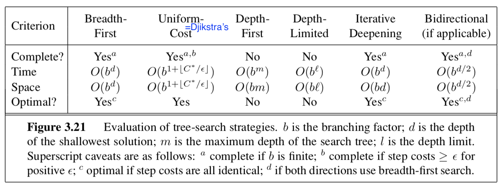

* TOC
{:toc}
From "Artificial Intelligence" Russel & Norvig 3rd Edition

---

# Uninformed Search - R&N 3.1-3.4

## problem-solving agents

- *goal* - 1st step
  - *problem* formulation - deciding what action and states to consider given a goal
- *uninformed* - given no info about problem besides definition
  - an agent with several immediate options of unknown value can decide what to do first by examining future actions that lead to states of known value
- 5 components
  1. initial state
  2. actions at each state
  3. transition model
  4. goal states
  5. path cost function

## problems

- toy problems
  1. vacuum world
  2. 8-puzzle (type of sliding-block puzzle)
  3. 8-queens problem
  4. Knuth conjecture
- real-world problems
  1. route-finding
  2. TSP (and othe touring problems)
  3. VLSI layout
  4. robot navigation
  5. automatic assembly sequencing

## searching for solutions

- start at a node and make a search tree
  - *frontier* = *open list* = set of all leaf nodes available for expansion at any given point
  - *search strategy* determines which state to expand next
- want to avoid redundant paths
  1. TREE-SEARCH - continuously expand the frontier
  2. GRAPH-SEARCH - tree search but also keep track of previously visited states in *explored set* = *closed set* and don't revisit

## infrastructure

- *node* - data structure that contains parent, state, path-cost, action
- metrics
  - *complete* - terminates in finite steps
  - *optimal* - finds best solution
  - time/space complexity
    - theoretical CS: $\vert V\vert +\vert E\vert $
    - b - *branching factor* - max number of branches of any node
    - d - *depth* - number of steps from the root
    - m - *max length* of any path in the search space
  - *search cost* - just time/memory
  - *total cost* - search cost + *path cost*

## uninformed search = blind search

- 
- bfs
- *uniform-cost search* - always expand node with lowest path cost g(n)
  - frontier is priority queue ordered by g
- dfs
  - *backtracking search* - dfs but only one successor is generated at a time; each partially expanded node remembers which succesor to generate next
    - only O(m) memory instead of O(bm)
  - *depth-limited search*
    - *diameter of state space* - longest possible distance to goal from any start
  - *iterative deepening dfs* - like bfs explores entire depth before moving on
    - *iterative lengthening search* - instead of depth limit has path-cost limit
- *bidirectional search* - search from start and goal and see if frontiers intersect
  - just because they intersect doesn't mean it was the shortest path
  - can be difficult to search backward from goal (ex. N-queens)

# A* Search and Heuristics - R&N 3.5-3.6

## informed search

- *informed search* - use path costs $g(n)$ and problem-specific heuristic $h(n)$
  - has *evaluation function* *f* incorporating path cost *g* and heuristic *h*
  - *heuristic* h = estimated cost of cheapest path from state at node n to a goal state
- *best-first* - choose nodes with best f
  - *greedy best-first search* - let f = h: keep expanding node closest to goal
  - when f=g, reduces to uniform-cost search
- $A^*$ search
  - $f(n) = g(n) + h(n)$ represents the estimated cost of the cheapest solution through n
  - $A^*$ (with tree search) is optimal and complete if h(n) is *admissible*
    - $h(n)$ never overestimates the cost to reach the goal 
  - $A^*$ (with graph search) is optimal and complete if h(n) is *consistent* (stronger than admissible) = *monotonicity*
    - $h(n) \leq cost(n \to n') + h(n')$
    - can draw contours of f (because nondecreasing)
  - $A^*$ is also *optimally efficient* (guaranteed to expand fewest nodes) for any given consisten heuristic because any algorithm that that expands fewer nodes runs the risk of missing the optimal solution
    - for a heuristic, *absolute error* $\delta := h^*-h$ and *relative error* $\epsilon := \delta / h^*$
      - here $h^*$ is actual cost of root to goal
    - bad when lots of solutions with small absolute error because it must try them all
    - bad because it must store all nodes in memory
- memory-bounded heuristic search
  - *iterative-deepening* $A^*$ - iterative deepening with cutoff f-cost
  - *recursive best-first search* - like standard best-first search but with linear space
    - each node keeps f_limit variable which is best alternative path available from any ancestor
    - as it unwinds, each node is replaced with *backed-up value* - best f-value of its children
      - decides whether it's worth reexpanding subtree later
      - often flips between different good paths (h is usually less optimistic for nodes close to the goal)
  - $SMA^*$ - simplified memory-bounded A* - best-first until memory is full then forgot worst leaf node and add new leaf
    - store forgotten leaf node info in its parent
    - on hard problems, too much time switching between nodes
- agents can also learn to search with *metalevel learning*

## heuristic functions

- *effective branching factor* $b^*$ - if total nodes generated by A* is N and solution depth is d, then b* is branching factor for uniform tree of depth d for N+1 nodes: $$N+1 = 1+b^* +(b^*)^2 + ... + (b^*)^d$$
  - want $b^*$ close to 1
- generally want bigger heuristic because everything with $f(n) < C^*$ will be expanded
  - $h_1$ dominates $h_2$ if $h_1(n) \geq h_2(n) \: \forall \: n$
- *relaxed problem* - removes constraints and adds edges to the graph
  - solution to original problem still solves relaxed problem
  - cost of optimal solution to a relaxed problem is an admissible heuristic for the original problem 
    - also is consistent
- when there are several good heuristics, pick $h(n) = \max[h_1(n), ..., h_m(n)]$ for each node
- *pattern database* - heuristic stores exact solution cost for every possible subproblem instance
  - *disjoint pattern database* - break into independent possible subproblems
- can learn heuristic by solving lots of problems using useful features
  - aren't necessarily admissible / consistent

# Local Search - R&N 4.1-4.2
- *local search* looks for solution not path ~ like optimization
  - maintains only *current node* and its neighbors

## discrete space

- *hill-climbing* = *greedy local search* 
  - also stochastic hill climbing and random-restart hill climbing
- *simulated annealing* - pick random move
  - if move better, then accept
  - otherwise accept with some probability p'roportional to how bad it is and accept less as time goes on
- *local beam search* - pick k starts, then choose the best k states from their neighbors
  - *stochastic beam search* - pick best k with prob proportional to how good they are
- *genetic algorithms* - population of k individuals
  - each scored by *fitness function*
  - pairs are selected for *reproduction* using *crossover point*
  - each location subject to random *mutation*
  - *schema* - substring in which some of the positions can be left unspecified (ex. $246****$)
    - want schema to be good representation because chunks tend to be passed on together

## continuous space

- hill-climbing / simulated annealing still work
  - could just discretize neighborhood of each state
- use gradient
  - if possible, solve $\nabla f  = 0$
  - otherwise SGD $x = x + \alpha \nabla f(x)$
    - can estimate gradient by evaluating response to small increments
- *line search* - repeatedly double $\alpha$ until f starts to increase again
- *Newton-Raphson* method
  - finds roots of func using 1st derive: $x_\text{root} = x - g(x) / g'(x)$
  - apply this on 1st deriv to get minimum
    - $x = x - H_f^{-1} (x) \nabla f(x)$ where H is the Hessian of 2nd derivs

# Constraint satisfaction problems - R&N 6.1-6.5

- CSP
  1. set of variables $X_1, ..., X_n$
  2. set of domains $D_1, ..., D_n$
  3. set of constraints $C$ specifying allowable values
- each state is an *assignment* of variables
  - *consistent* - doesn't violate constraints
  - *complete* - every variable is assigned
- *constraint graph* - nodes are variables and links connect any 2 variables that participate in a constraint
  - *unary constraint* - restricts value of single variable
  - *binary constraint*
  - *global constraint* - arbitrary number of variables (doesn't have to be all)
- converting graphs to only binary constraints
  - every finite-domain constraint can be reduced to set of binary constraints w/ enough auxiliary variables
  - *dual graph* transformation - create a new graph with one variable for each constraint in the original graph and one binary constraint for each pair of original constraints that share variables
- also can have *preference constraints* instead of *absolute constraints*

## inference (prunes search space before backtracking)

- *node consistency* - prune domains violating unary constraints
- *arc consistency* - satisfy binary constraints (every node is made arc-consistent with all other nodes)
  - uses AC-3 algorithm
    - set of all arcs = binary constraints
    - pick one and apply it
      - if things changed, re-add all the neighboring arcs to the set
    - $O(cd^3)$ where $d = \vert domain\vert $, c = # arcs
  - variable can be *generalized arc consistent*
- *path consistency* - consider constraints on triplets - PC-2 algorithm
  - extends to *k-consistency* (although path consistency assumes binary constraint networks)
  - *strongly k-consistent* - also (k-1) consistent, (k-2) consistent, ... 1-consistent
    - implies $O(k^2d)$
    - establishing k-consistency time/space is exponential in k
- global constraints can have more efficient algorithms
  - ex. assign different colors to everything
  - *resource constraint* = *atmost constraint* - sum of variable must not exceed some limit
    - *bounds propagation* - make sure variables can be allotted to solve resource constraint

## backtracking

- CSPs are *commutative* - order of choosing states doesn't matter
- *backtracking search* - depth-first search that chooses values for one variable at a time and backtracks when no legal values left
  1. variable and value ordering
    - *minimum-remaining-values* heuristic - assign variable with fewest choices
    - *degree* heuristic - pick variable involved in largest number of constraints on other unassigned variables
    - *least-constraining-value* heuristic - prefers value that rules out fewest choices for nieghboring variables
  2. interleaving search and inference
    - *forward checking* - when we assign a variable in search, check arc-consistency on its neighbors
    - *maintaining arc consistency (MAC)* - when we assign a variable, call AC-3, intializing with arcs to neighbors
  3. intelligent backtracking - looking backward
    - keep track of *conflict set* for each node (list of variable assignments that deleted things from its domain)
    - *backjumping*  - backtracks to most recent assignment in conflict set
      - too simple - forward checking makes this redundant
    - *conflict-directed backjumping* 
      - let $X_j$ be current variable and $conf(X_j)$ be conflict set. If every possible value for $X_j$ fails, backjump to the most recent variable $X_i$ in $conf(X_j)$ and set $conf(X_i) = conf(X_i) \cup conf(X_j) - X_i$
    - *constraint learning* - findining minimum set of variables/values from conflict set that causes the problem = *no-good*

## local search for csps

- start with some assignment to variables
- *min-conflicts* heuristic - change variable to minimize conflicts
  - can escape plateaus with *tabu search* - keep small list of visited states
  - could use *constraint weighting*

## structure of problems

- connected components of constraint graph are independent subproblems
- *tree* - any 2 variables are connected by only one path
  - *directed arc consistency* - ordered variables $X_i$, every $X_i$ is consistent with each $X_j$ for j>i
    - tree with n nodes can be made directed arc-consisten in $O(n)$ steps - $O(nd^2)$
- two ways to reduce constraint graphs to trees
  1. assign variables so remaining variables form a tree
    - assigned variables called *cycle cutset* with size c
    - $O[d^c \cdot (n-c) d^2]$
    - finding smallest cutset is hard, but can use approximation called *cutset conditioning*
  2. *tree decomposition* - view each subproblem as a mega-variable
    - *tree width* w - size of largest subproblem - 1
    - solvable in $O(n d^{w+1})$
- also can look at structure in variable values
  - ex. *value symmetry* - can assign different colorings
    - use *symmetry-breaking constraint* - assign colors in alphabetical order