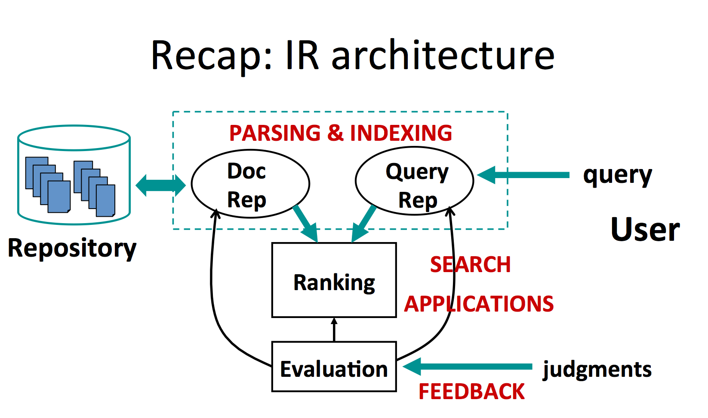

{:toc}

# introduction

- building blocks of search engines
  - search (user initiates)
  - reccomendations - proactive search engine (program initiates e.g. pandora, netflix)
  - information retrieval - activity of obtaining info relevant to an information need from a collection of resources
  - information overload - too much information to process
  - memex - device which stores records so it can be consulted with exceeding speed and flexibility (search engine)
- IR pieces
    1. Indexed corpus (static)
        - crawler and indexer - gathers the info constantly, takes the whole internet as input and outputs some representation of the document
            - web crawler - automatic program that systematically browses web
        - document analyzer - knows which section has what
            -takes in the metadata and outputs the index (condensed), manage content to provide efficient access of web documents
    2. User
        - query parser - parses the search terms into managed system representation
    3. Ranking
        - ranking model
            -takes in the query representation and the indices, sorts according to relevance, outputs the results
        - also need nice display
        - query logs - record user's search history
        - user modeling - assess user's satisfaction
- steps 
    1. repository -> document representation
    2. query -> query representation
    3. ranking is performed between the 2 representations and given to the user
    4. evaluation - by users
- information retrieval:
    1. reccomendation
    2. question answering
    3. text mining
    4. online advertisement

# related fields

*they are all getting closer, database approximate search and information extraction converts unstructed data to structured:*

database systems        | information retrieval

- |
structured data         | unstructured data
semantics are well-defined |  semantics are subjective
structured query languages (ex. SQL) | simple keyword queries
exact retrieval         | relevance-drive retrieval
emphasis on efficiency  | emphasis on effectiveness

- natural language processing - currently the bottleneck
  - deep understainding of language
  - cognitive approaches vs. statistical
  - small scale problems vs. large
- developing areas
  - currently mobile search is big - needs to use less data, everything needs to be more summarized
  - interactive retrieval - like a human being, should collaborate
- core concepts
  - *information need* - desire to locate and obtain info to satisfy a need
  - *query* - a designed representation of user's need
  - *document* - representation of info that could satisfy need
  - *relevance* - relatedness between documents and need, this is vague
    - multiple perspectives: topical, semantic, temporal, spatial (ex. gas stations shouldn't be behind you)
- Yahoo used to have system where you browsed based on structure (browsing), but didn't have queries (querying)
  - better when user doesn't know keywords, just wants to explore
  - push mode - systems push relevant info to users without a query
  - pull mode - users pull out info using keywords

# databases
- overview
  - notes from [here](https://www.oracle.com/database/what-is-database/)
  - a database is an organized collection of structured information, or data
  - typically modeled in rows and columns in a series of tables
  - SQL is a programming language used by nearly all [relational databases](https://www.oracle.com/database/what-is-database/#relational) to query, manipulate, and define data, and to provide access control
  - types

    - **Relational databases.** Relational databases became dominant in the 1980s. Items in a relational database are organized as a set of tables with columns and rows. Relational database technology provides the most efficient and flexible way to access structured information.
    - **NoSQL databases.** A [NoSQL](https://www.oracle.com/database/nosql-cloud.html), or nonrelational database, allows unstructured and semistructured data to be stored and manipulated (in contrast to a relational database, which defines how all data inserted into the database must be composed). NoSQL databases grew popular as web applications became more common and more complex. Example: **MongoDB**
    - **Object-oriented databases.** Information in an object-oriented database is represented in the form of objects, as in object-oriented programming.
    - **Graph databases.** A graph database stores data in terms of entities and the relationships between entities.
    - **OLTP databases.** An OLTP database is a speedy, analytical database designed for large numbers of transactions performed by multiple users.
  - related concepts

    - **Distributed databases.** A distributed database consists of two or more files located in different sites. The database may be stored on multiple computers, located in the same physical location, or scattered over different networks.
    - **Data warehouses.** A central repository for data, a data warehouse is a type of database specifically designed for fast query and analysis.
  - examples

    - MySQL - simplest
- sql
  - the major commands:   `SELECT`, `UPDATE`, `DELETE`, `INSERT`, `WHERE`
  - SQL keywords are NOT case sensitive (i.e. can write `select`)
- mongodb
  - Indexes are how MongoDB makes queries fast, and they're B-trees mapping field values to the locations of the documents containing them.
    - There's always an index on `_id`. Beyond that you create indexes deliberately
