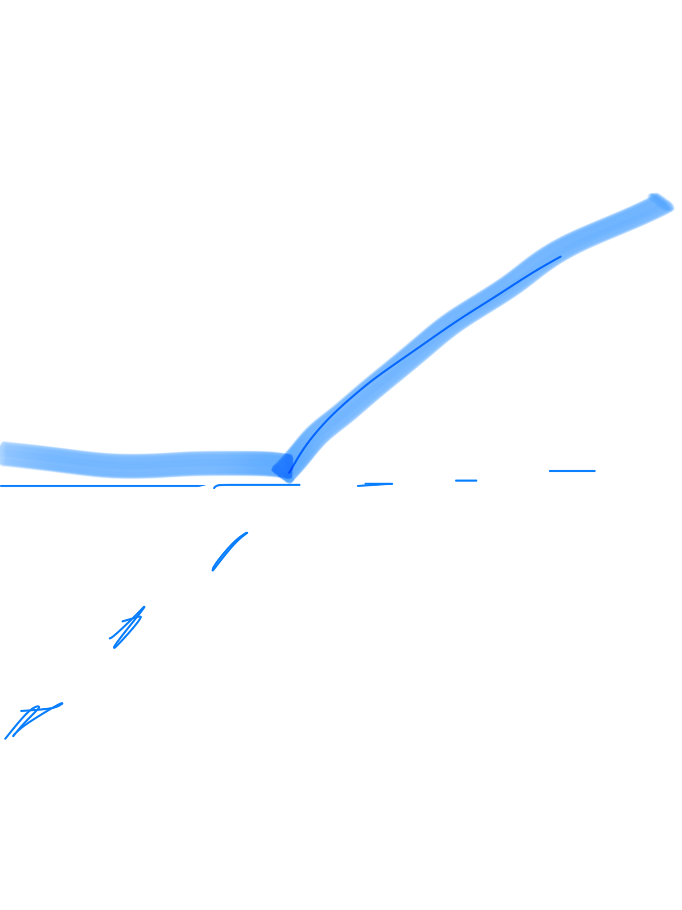
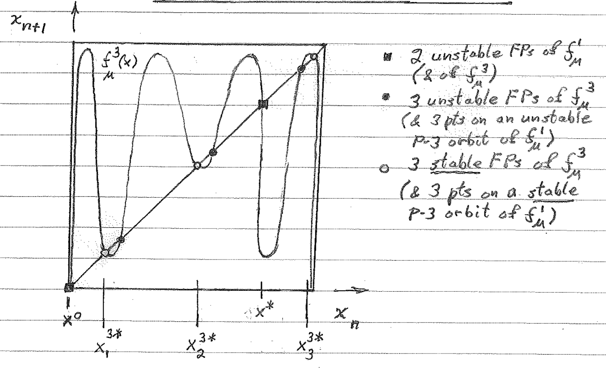

* TOC
{:toc}

---

# Normal forms of Hopf bifurcations
- pitchfork: $$\dot{x} = \lambda x - x^3$$ 
- subcritical pitchfork: $\dot{x} = \lambda x + x^3$ 
- saddle node (turning point): $\dot{x} = \lambda - x^2$ 
- transcritical: $\dot{x} = \lambda x - x^2$ 

# important figs
- period-doubling (flip bifurcation) $f = \mu x (1-x) (f = \mu sin (\pi x) $ is similiar) 
- inverse tangent bifurcation - unstable and stable P-3 orbits coalesce, move slightly off bisector and becomes chaotic 
- pendulum 
- energy surface - trajectories run around the surface, not down it 
- Conservative systems: 6.5
	- study Hamiltonian p. 187-188
- Pendulum: 6.7
- dynamics - study of things that evolve with time
- chaos - deterministic, aperiodic, sensitive, long-term prediction impossible
1. phase space - has coordinates $x_1,...,x_n$
2. phase portrait - variable x-axis, derivative y-axis
3. bifurcation diagram - parameter x-axis, steady state y-axis
	- draw separate graphs for these
- first check - look for fixed points
- for 1-D, if f' $<$ 0 then stable
- stable f.p. = all possible ICs in a.s.b.f.n. result in trajectories that remain in a.s.b.f.n. for all time
- asymptotically stable f.p. - stable and approaches f.p. as $t\ra\infty$
- hyperbolic f.p. - eigenvals aren't strictly imaginary
- bifurcation point of f.p. - point where num solutions change or phase portraits change significantly
- globally stable - stable from any ICs
- autonomous = f is a function of x, not t
- we can always make a system autonomous by having $x_n$ = t, so $\dot{x_n}$ = 1
- dimension = number of 1st order ODEs, dimension of phase-space
- existence and uniqueness thm: if $\dot{x}$ and $\dot{x}'$ are continuous, then there is some unique solution
- linearization - used to find stability of f.p.s
- $$
\dot{x} = f(x) &\\
\text{define }\delta x = (x-\bar{x}) \\
\dot{\delta x} = \frac{d}{dt}(x-\bar{x}) = \dot{x} = f(x) = f(\bar{x}+\delta x) \\
\dot{\delta x} =\cancelto{0}{f(\bar{x})} + \delta x f'(\bar{x}) + \cancelto{\text{0 by HGT iff f'!=0}}{O(x^2)} \\
\dot{\delta x} = \delta x f'(\bar{x}) \to \text{ now solve FOLDE} \\
$$

- solving Hopf: use polar to get $\dot{\rho}, \dot{\theta}$
- multiply one thing by cos, one by sin, then add

- $ \rho = \sqrt{x_1^2 + x_2^2} \\
\theta = tan^{-1}(\frac{x_2}{x_1})$
- Hysterisis curve - S-shaped curve of fixed branches - ruler getting larger - snap bifurcation - both axes are parameters

# Systems of Linear ODEs
- solutions are of the form $\underbar{x}(t) = \underbar{C}_1e^{\alpha_1 t} + \underbar{C}_2e^{\alpha_2 t}$
- Eigenspaces: $E^S$ (stable), $E^U$ (unstable), $E^C$ (center - real part) - plot eigenvectors
- how to solve these systems?
	- solve eigenvectors
- positive real part - goes out
- negative real part - goes in
- bifurcation requires 0 as eigenvalue
- has imaginary component: spiral / focus
- purely imaginary - center = stable, but not a.s.
- finite velocity = $\frac{dRe(\alpha)}{d\lambda}$
- change coordinates to polar
- for $\lambda \geq 0$, solution is a stable L.C. (from either direction spirals into a circular orbit)
- attracting - any trajectory that starts within $\delta$ of $\bar{\underbar{x}}$ evolves to $\bar{\underbar{x}}$ as t $\to \infty$ (it doesn't have to remain within $\delta$ at all times
- stable (Lyapanov stable) - any trajectory that starts within $\delta$ remains within $\varepsilon$ for all time ($\varepsilon$ is chosen first)
- asymptotically stable - attracting and stable
- hyperbolic f.p. - iff all eigenvals of the linearization of the nds about the f.p. have nonzero real parts \\

# Discrete Nonlinear Dynamical Systems
- functional iteration: $x_{n+m} = f^m(x_n)$ (apply f m times)
- fixed point: $f(x^*)=x^*$
- f.p. stable if $\|\frac{df}{dx}(x^*)\|<1$, unstable if $>$ 1
- check n-orbit by checking nth derivative: $\frac{df^n}{dx}(x_i^*) = \prod_{i=1}^{n-1} \frac{df}{dx}(x_i^*)$
- period-doubling bifurcations
- self-stability - orbit for which the stability-determining derivative is zero.  This means that the max of the map and the point at which the max occurs are in the orbit.
- type I intermittency - exhibited by inverse tangent bifurcation
- Feigenbaum sequence - period-doubling path to chaos, keep increasing parameter until period is chaotic

\begin{center}
\begin{tabular}{ \| m{4cm} \| m{4cm} \| } 
\hline
\multicolumn{2}{\|c\|}{3D Attractors} \\
 \hline
Type of Attractor & Sign of Exponents \\ 
\hline
Fixed Point & (-, -, -)\\ 
Limit Cycle & (0, -, -) \\ 
Torus & (0, 0, -) \\
Strange Attractor & (+, 0, -) \\
\hline
\end{tabular}
\end{center}

- homoclinic orbit - connects unstable manifold of saddle point to its own stable manifold
	- e.g. trajectory that starts and ends at the same fixed point
- manifolds are denoted by a W (ex. $W^S$ is the stable manifold)
- heteroclinic orbit - connects unstable manifold of fp to stable manifold of another fp \\

# Conservative Systems
- $F(x) = -\frac{dV}{dx}$ (by defn.)
- $m\ddot{x}+\frac{dV}{dx}=0$, multiply by $\dot{x} \to \frac{d}{dt}[\frac{1}{2}m\dot{x}^2+V(x)]=0$
- so total energy $E=\frac{1}{2}m\dot{x}^2+V(x)$
- motion of pendulum: $\frac{d^2\theta}{dt^2}+\frac{g}{L}sin\theta=0$
- nondimensionalize with $\omega=\sqrt{g/L}, \tau=\omega t \to \ddot{\theta}+sin\theta =0$
- can multiply this by $\dot{\theta}$
- $\omega$-limit $t \to \infty$
- $\alpha$-limit  $t \to -\infty$
- libration - small orbit surrounding center
- system: $\dot{\theta}=\nu$, $\dot{\nu} = -sin\theta$

## Hamiltonian Dynamical System
- $\dot{\underbar{x}}=\frac{\partial H}{\partial y}(\underbar{x},\underbar{y})$
, $\dot{\underbar{y}}=-\frac{\partial H}{\partial x}(\underbar{x},\underbar{y})$ for some function H called the Hamiltonian
- we can only have centers (minima in the potential) and saddle points (maxima)
- separatrix - orbit that separates trapped and passing orbits
- Poincare Benderson Thm - can't have chaos in a 2D system

# Ref
- $\frac{\partial}{\partial x}(f_1 * f_2 * f_3) = \frac{\partial f_1}{\partial x} f_2 f_3 + \frac{\partial f_2}{\partial x} f_1 f_3 + \frac{\partial f_3}{\partial x} f_1 f_2$
- $e^{\mu it} = cos(\mu t)+ isin(\mu t)$
- $x = A e^{(\lambda + i)t} + B e^{(\lambda - i)t} \implies x = (A' sin(t) + B' cos(t)) e^{\lambda t} $
If we have $\dot{x_1},\dot{x_2}$ then we can get $x_2(x_1) with \frac{dx_1}{dx_2} = \frac{\dot{x_1}}{\dot{x_2}}$