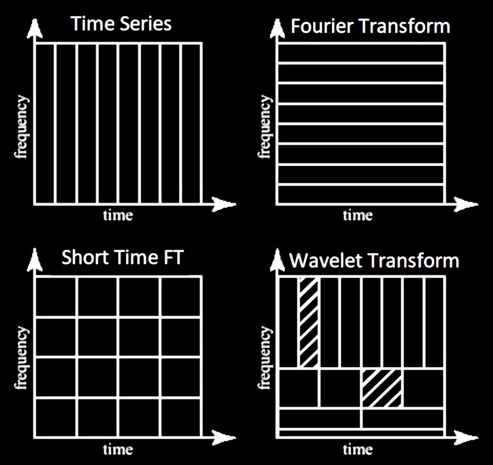
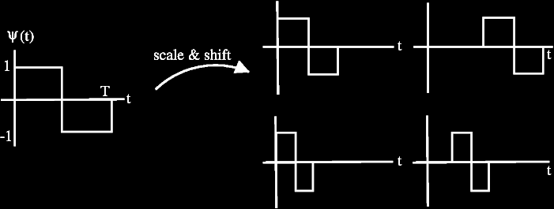
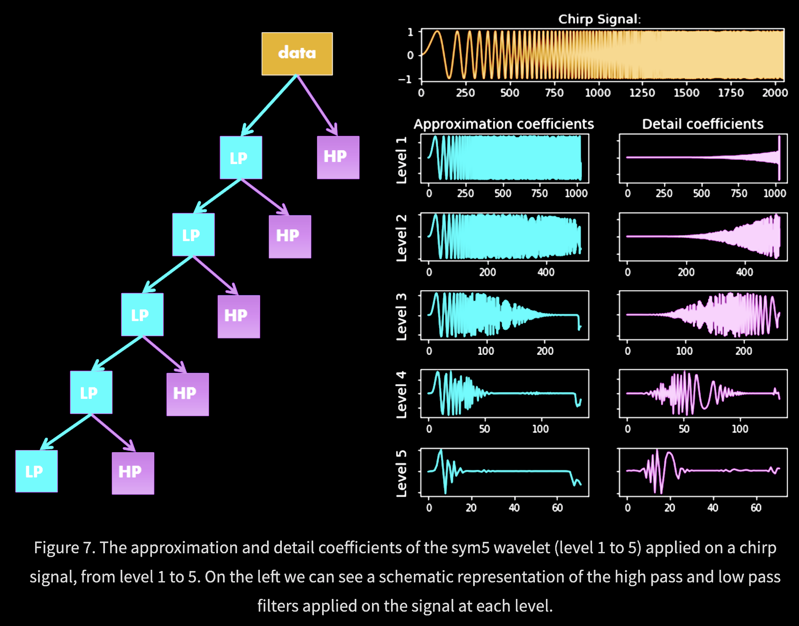
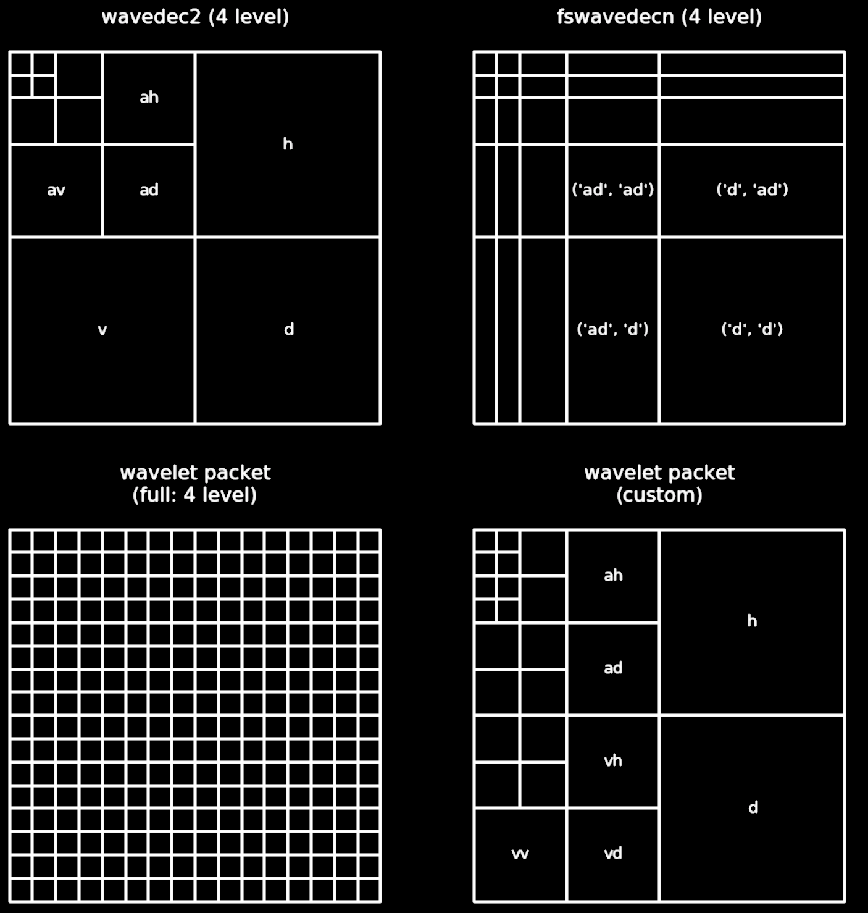

* TOC
{:toc}

# basics

- dirac-delta infinity at one point, zero everywhere else
- 

# intro

- signal can be *continuous* or *discrete* based on its domain (not values)
- *analog signal* - continuous in time
  - *sampling* - the process of taking individual values of a continuous-time signal
  - *sampling rate* $f_s$ - the number of samples taken per second (Hz)
  - *sampling period* - time interval between samples
- *digital signal* - discrete in time and value
- ”If a function x(t) contains no frequencies higher than B hertz, it is completely determined by giving its ordinates at a series of points spaced 1 2B seconds apart” –Shannon
- signals are usually studied in
  - time-domain (with respect to time)
  - frequency-domain (with respect to frequency) - use Fourier transform
  - time-frequency representation (TFR) - use short-time Fourier transform (STFT) or wavelets
- harmonic analysis - studies relationship between time and frequency domain
- common filters
  - low-pass filter - pass only low frequencies
  - high-pass filter - pass only high frequencies
  - band-pass filter - pass only frequencies within a specified range
  - band-stop filter - pass only frequences outside a specified range
- **power spectrum** - how much of the signal is at a frequency $\omega$? - square of the magnitude of the coefficients of the Fourier coefficients for $\omega$

# fourier analysis

- [good tutorial](http://www.thefouriertransform.com/)
- Fourier analysis - study of way general functions can be represented by Fourier series
- Fourier series - periodic function composed of harmonically related sinusoids, combined by a weighted summation
  - one period of the summation can approximate an arbitrary function in that interval
- (continuous) Fourier transform $\hat f$: time (x) -> frequency (u)
    - $\hat{f}(u) = \int_{-\infty}^{\infty} f(x)\ e^{-2\pi i x u}\,dx$
    - $f(x) = \int_{-\infty}^{\infty} \hat f(u)\ e^{2\pi i x u} \,du$
    - 2-dimensional (good [ref](http://www.robots.ox.ac.uk/~az/lectures/ia/lect2.pdf))
        - $F(u, v) = \int_{-\infty}^{\infty} \int_{-\infty}^{\infty} f(x, y) e^{-i 2 \pi (ux + vy)}\,dx\, dy$
        - inverse: $f(x,y) = \int_{-\infty}^{\infty} \int_{-\infty}^{\infty} F(u, v) e^{i 2 \pi (ux + vy)}\,du\, dv$
        - for each basis, magnitude of vector [u, v] is frequency and direction gives orientation
- Fourier transform of Gaussian is Gaussian
- discrete-time Fourier transform - values are still continuous
  - $X_{2\pi}(\omega) = \sum_{n=-\infty}^{\infty} x_n \,e^{-i \omega n}$
    - $\omega$ is frequency
- **discrete Fourier transform**  (DFT or the analysis equation) - this is by far the most common
    - $\begin{align}X_k &= \sum_{n=0}^{N-1} x_n e^{-2\pi i k n / N}\\&=\sum_{n=0}^{N-1} x_n \left[ \cos(2\pi k \frac n N ) - i \sin(2 \pi k \frac n N )\right]\end{align}$
    - larger k is higher freq.
    - **inverse transform**: $x_n = \frac{1}{N} \sum_{k=0}^{N-1} X_k\cdot e^{i 2 \pi k n / N}$
    - $x_0, x_1, ... x_{N-1}$ is a sequence of N complex numbers (i.e. time domain) and we transform to another sequence of complex numbers $X_0, X_1, ..., X_{N-1}$
        - we write $\mathbf X = \mathcal F (\mathbf x)$ 
        - vectors $u_k = \left[\left. e^{ \frac{i 2\pi}{N} kn} \;\right|\; n=0,1,\ldots,N-1 \right]^\mathsf{T}$
          form an *orthogonal basis* over the set of *N*-dimensional complex vectors
    - interpreting units
      - a frequency of 1/N would correspond to a period of N
        - use $2\pi/N$ so that it goes through one cycle with period of N
      - the n=0 parts correspond to a constant
      - all other frequencies are integer multiples of the first fundamental frequency
      - finding coefs: basically want to use the correlation between the signal and the basis element (this is what the summation and muliptlying does)
- can be quickly computed using the **Fast Fourier Transform** in $O(n \log n)$ instead of $O(n^2)$
- **inverse discrete Fourier Transform** (IDFT) 
- *windowed fourier transform* - chop signal into sections and analyze each section separately

# wavelet analysis

- [wavelets for kids](http://www.gtwavelet.bme.gatech.edu/wp/kidsA.pdf) - good reference
- [overview](https://www.eecis.udel.edu/~amer/CISC651/IEEEwavelet.pdf), [matlab wavelets](https://www.mathworks.com/help/wavelet/ug/wavelet-families-additional-discussion.html), [python wavelets](http://wavelets.pybytes.com/)
- different based on choice of wavelet

- wavelet has both time and freq information
- 2 differences with Fourer
  - replace sinusoid $\phi(x) = e^{i 2 \pi k x/N}$ with wavelet
  - coefficients must be indexed by more than just frequency (also position, scale, and/or orientation)

## using wavelets

- **$\phi(x)$ = mother wavelet** (or analyzing wavelet)
  - now form translations and dilations of the mother wavelet $\phi(\frac{x-b}{a})$
    - it is convenient to set $a=2^{-j}, b = k \cdot 2^{-j}$, where k and j are integers
- website to [explore different wavelets](http://wavelets.pybytes.com/)
  - ex. **Haar wavelet** (step function on [0, 1]
    - 
    - define translations and dilations $\phi_{jk}(x) = \text{const} \cdot \phi(2^j x - k)$
      - j, k are still integers
      - this is still orthogonal
  - ex. **Gabor==Morlet wavelet**: $\phi_\sigma(x) = c \cdot \underbrace{e^{-\frac 1 2 x^2}}_{\text{gaussian window}} \underbrace{(e^{i\sigma x} - \kappa_\sigma)}_{\text{frequency}}$
  - ex. **Daubechies wavelet**
  - ex. **coiflet**
  - ex. scattering transform
  - ex. Mallat's MRA - stretch/scale wavelets in a smart way to tile space
- [how are wavelets implemented?]() (figs taken from blog)
  - note: Continuous Wavelet Transform, (CWT), and the Discrete Wavelet Transform (DWT), **are both, point-by-point, digital, transformations that are easily implemented on a computer**
    - DWT restricts the value of the scale and translation of the wavelets (e.g. scale must increase in powers of 2 and translation must be integer)
  - 
  - The **approximation coefficients** represent the output of the low pass filter (averaging filter) of the DWT.
  - The **detail coefficients** represent the output of the high pass filter (difference filter) of the DWT
  - [pywt 2d](https://pywavelets.readthedocs.io/en/latest/ref/2d-decompositions-overview.html) can decompose in different ways
    - 

## wavelet analysis

- orthogonal wavelet basis: $\phi_{(s,l)} (x) = 2^{-s/2} \phi (2^{-s} x-l)$
- *scaling function* $W(x) = \sum_{k=-1}^{N-2} (-1)^k c_{k+1} \phi (2x+k)$ where $\sum_{k=0,N-1} c_k=2, \: \sum_{k=0}^{N-1} c_k c_{k+2l} = 2 \delta_{l,0}$
- one pattern of coefficients is smoothing and another brings out detail = called *quadrature mirror filter pair*
- there is also a fast discrete wavelet transform (Mallat)
- wavelet packet transform - basis of *wavelet packets* = linear combinations of wavelets
- *basis of adapted waveform* - best basis function for a given signal representation
- *Marr wavelet* - developed for vision
- differential operator and capable of being tuned to act at any desired scale

## more general wavelets

- [generalized daubechet wavelet families](http://bigwww.epfl.ch/publications/vonesch0702.pdf)
- [generalized coiflets](https://pdfs.semanticscholar.org/46e3/4016b8c4b187118e83392242c2165a6db3db.pdf)
- [Wavelet families of increasing order in arbitrary dimensions](https://ieeexplore.ieee.org/abstract/document/826784)
- [Parametrizing smooth compactly supported wavelets](https://www.ams.org/journals/tran/1993-338-02/S0002-9947-1993-1107031-8/)
  - just for daubuchet