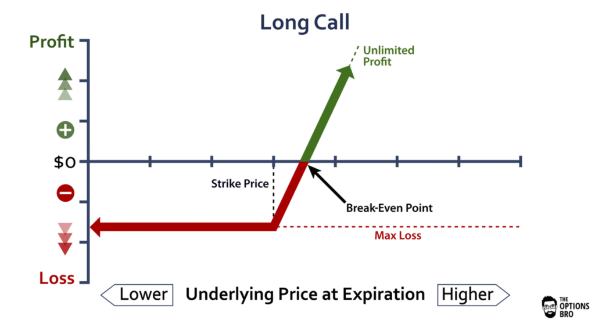
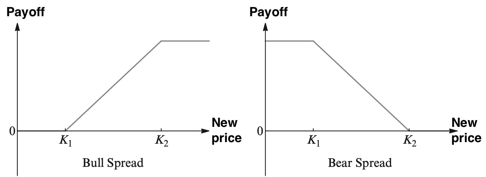

{:toc}

# stock basics

- stock basics
  - stocks prices fluctuate
  - stocks can pay dividends quarterly
    - common stocks may or may not pay dividends
    - preferred stocks typically pay fixed dividends
- stock-market basics
  - ETF = exchange-traded fund - tracks a specific index / sector of the market
  - bear market - stock prices are falling
  - bull market - stock prices are rising
  - S & P averages 7% / year

# individual events

- [The GameStop Game Never Stops - Bloomberg](https://www.bloomberg.com/opinion/articles/2021-01-25/the-game-never-stops)
  - 3 explanations: stock fundamentals, short squeeze + gamma trap make feedback loop, meme
  - **focal point** (or **Schelling point**) is a solution that people tend to choose by default in the absence of communication
  - there is a mass of retail buyers who like to all buy the same stock, and Musk’s tweet gave them a [Schelling point](https://en.wikipedia.org/wiki/Focal_point_(game_theory)) to coordinate around
  - SEC shut down Hertz selling shares after bankruptcy (stocks would become worthless)

# ml in stock market

- [Uncertainty-Aware Lookahead Factor Models for Quantitative Investing](https://arxiv.org/abs/2007.04082) (chauhan, alberg, & lipton 2020)
  - *fundamentals* - publicly traded companies report these periodically, e.g. revenue, earnings, debt, among others
    - fundamentals forecasting - use LSTM to forecast fundamentals
      - use model uncertainty to avert risk (scale the earnings forecast in inverse proportion to the modeled earnings variance)
      - main fundamental to forecast is *EBIT*, but also forecast others for multi-task benefit
      - given past januaries, predict next january
  - *factors* - functions of the reported data that correlate with stock market performance
    - stock selection part - given future fundamentals, can select stocks better than human-selected factors
  - *value investing* - base investment on long-term fundamentals
    - in this case, rank all stocks acording to factor and invest equal amounts into top 50, re-balancing monthly
  - final improvement: compound annualized return of 17.7% vs 14.0% (standard factor model), CV on held-out stocks, test on held-out time period
    - previous works have been limited to few stocks / short time periods
  - uncertainty
    - data uncertainty (aleatoric): DNN predicts mean + var as separate outputs
      - both are used to calculate loss
    - model uncertainty (epistemic): use MC dropout w/ 10 reps

# quant finance

**based on book by mazzoni**

## basic background

* *Wiener*-process = *Brownian* motion: $W_t$
  * $W_0=0$
  * $W_t$ has independent increments (i.e. is Markov process)
  * $W_t - W_s \sim N(0, t-s)$ for $0 \leq s < t$
  * this implies $f(w)=\frac{1}{\sqrt{2 \pi(t-s)}} e^{-\frac{1}{2} \frac{w^{2}}{t-s}}$
* can use fourier analysis to easily compute things about sums of random variables

## utility theory: see notes in [decisions](https://csinva.io/notes/ai/decisions.html)

- economic theory assumes agents maximix their personal utility, aims to provide framework for rational behavior

## architecture of financial markets

- *arrow-debreu* problem (1954): maximize expected utility under wealth constraint
  - must assume utility function
  - lets us derive marginal rate of substitution MRS: tradeoff in utility between consumption today and consumption in the future
- *portfolio selection problem*
  - payoff matrix $X$ is a $N x P$ matrix, with $P$ securities, each which takes on $N$ possible values and we ewant to find a vector $\theta \in \mathbb R^P$ that maximizes payoff subject to constraint

## markowitz portfolio theory

- everything is embedded in Gaussian distributions
  - assume in short term that different returns are independent (then their sums are normal)
- focuses on mean and variance of return distr. of risky assets over intermediate / long-term horizons

## capital asset pricing model (CAPM) + arbitrage pricing theory (APT)

- CAPM - used to determine theoretical rate of return of an asset
  - $E\left(R_{i}\right)=R_{f}+\beta_{i}\left(E\left(R_{m}\right)-R_{f}\right)
    $
    - $E\left(R_{i}\right)$ is the expected return on the capital asset
    - $R_{f}$ is the risk-free rate of interest such as interest arising from government bonds
    - $\beta_{i}$ is the sensitivity of the expected excess asset returns to the expected excess market returns, or also $\beta_{i}=\frac{\operatorname{Cov}\left(R_{i}, R_{m}\right)}{\operatorname{Var}\left(R_{m}\right)}=\rho_{i, m} \frac{\sigma_{i}}{\sigma_{m}}$
      - $\rho_{i, m}$ denotes the correlation coefficient between the investment $i$ and the market $m$
      - $\sigma_{i}$ is the standard deviation for the investment $i$
      - $\sigma_{m}$ is the standard deviation for the market $m$.
    - $E\left(R_{m}\right)$ is the expected return of the market
    - overly simple
  
- APT - expected return is a linear function of various factors 
	- $ \mathbb{E}\left(r_{j}\right)=r_{f}+\lambda_{j 1} R P_{1}+\lambda_{j 2} R P_{2}+\cdots+\lambda_{j n} R P_{n}$
	  - $R P_{n}$ is the risk premium of the factor,
    - $r_{f}$ is the risk-free rate,
    - $ r_{j}=a_{j}+\lambda_{j 1} f_{1}+\lambda_{j 2} f_{2}+\cdots+\lambda_{j n} f_{n}+\epsilon_{j}$
      where
      $a_{j}$ is a constant for asset $j$
      $ f_{n}$ is a systematic factor
      $\lambda_{j n}$ is the sensitivity of the $j$ th asset to factor $n,$ also called factor loading,
    - and $\epsilon_{j}$ is the risky asset's idiosyncratic random shock with mean zero.I diosyncratic shocks are assumed to be uncorrelated across assets and uncorrelated with the factors.
  
  - **Arbitrage** = practice of taking positive expected return from overvalued or undervalued securities in the inefficient market without any incremental risk and zero additional investments.

## portfolio performance and management

- measure of portfolio performance
  - **Sharpe ratio** $S_a = \frac{\mathbb E [R_a - R_b]}{\sigma_a}$: performance compared to a risk-free asset, adjusted for risk
    - $R_a$ is asset return
    - $R_b$ is risk-free benchmark return (e.g. U.S. Treasury security)
    - $\sigma_a$ is the stddev of the excess return
- management
  - what proportion should be invested in risky part of portfolio?
  - Kelly criterion - very good formula for bet sizing in long-term

## financial economics

- explains how markets and prices of risky investments evolve

## behavioral finance

- deviates from utility theory by factoring in psychological considerations and  deviations from rationality

## forwards, futures, and options

- derivatives are contracts whose value depends on the value of other securities, commodities, rates, or derivatives
- **forwards** - over-the-counter, settlement is at expiry or shortly after
- **futures** - standardized contract traded in an organized markets
  - need to account for change in price over time (e.g. interest)
- **options**
  - gives you option to buy a stock, but bounds losses
  - call is analog of long (normal buying)
  - put is analog of short
  - 
- compound positions
  - 
  - 
  - **protective put buying** - limits dowside risk of a security/portfolio
  - **covered call writing** - 

### binomial (CRR) model

- Cox-Ross-Rubeinstein model (CRR)
  - simplification of brevious black-scholes model (1973)
- numerical method for valuation of options
- simulates discrete-time model of the varying price over time

### black-scholes theory

- PDE for evolution of derivatives
- can derive closed-form

### volatility (deterministic / stochastic)

## processes with jumps

## basic fixed-income instruments

- fixed-income instruments don't have the option to have a risk-free asset as san alternative (e.g. putting money in a bank)

### plain fixed-income derivatives

## term structure models

## LIBOR market model

# private equity

*[Private Equity](https://www.investopedia.com/terms/p/privateequity.asp#:~:text=Private%20equity%20is%20an%20alternative,the%20delisting%20of%20public%20equity.) is an alternative investment class of capital for things not on public exchange (e.g. private companies, or buyouts of public companies). Can be nicer for entrepeneurs*  

- private equity firms make money by charging management and performance fees from investors in a fund
  - like a hedge fund, managing partners take basic fees + profit percentage
  - differs in that private equity invests directly in companies or buys a controlling interest (usually more long-term, lower risk)
- types
  - **venture capital** is a type of private equity
  - leveraged buyouts - most popular  - buy company to improve it then resell it (to individual or in IPO)
  - distressed funding - money given to struggling company to turn it around