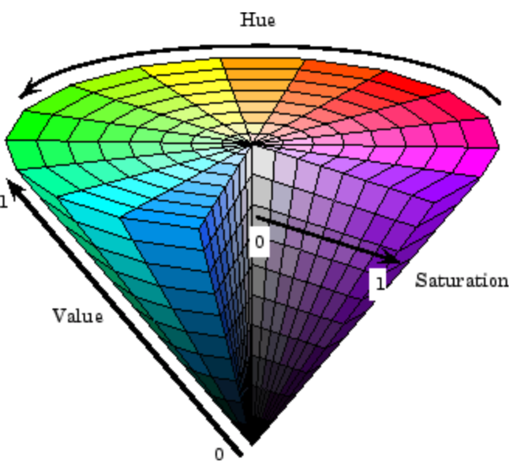
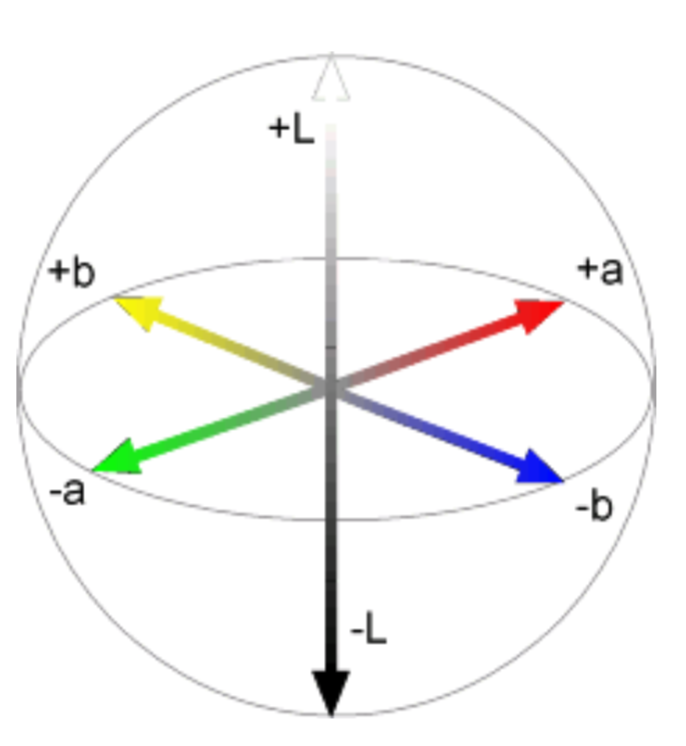

* TOC
{:toc}

# introduction

- vision doesn't exist in isolation - movement
- three R's: recognition, reconstruction, reorganization
- depth
  - *binocular steropsis* - we have 2 eyes with binocular disparity - this could give us depth, but we can see depth with one eye
  - optical flow is a basic cue for all animals (equivalent to having 2 cameras)
  - triangulation - if you have 2 cameras point must be at the intersection of 2 lines

# fundamentals of image formation

## projections

- image I(x,y) projects scene(X, Y, Z)
  - lower case for image, upper case for scene
  - 
    - box with pinhole=*center of projection*, which lets light go through
    - Z axis points out of box, X and Y aligned w/ image plane (x, y)
  - $x = \frac{-fX}{Z}$ (f is a fixed dist. not a function)
  - $y = \frac{-fY}{Z}$
- perspective projection - maps 3d points to 2d points through holes
  - 
  - perspective projection works for spherical imaging surface
    - what's important is 1-1 mapping between rays and pixels
  - natural measure of image size is visual angle
- orthographic projection - appproximation to perspective when object is relatively far
  - define constant $s = f/Z_0$
  - transform $x = sX, y = sY$

## phenomena from perspective projection

- parallel lines converge to vanishing point (each family has its own vanishing point)
  - pf: point on a ray $[x, y, z] = [A_x, A_y, A_z] + \lambda [D_x, D_y, D_z]$
  - $x = \frac{fX}{Z} = \frac{f \cdot (A_x+\lambda D_X)}{A_2 + \lambda D_2}$
  - $\lambda \to \infty \implies \frac{f \cdot \lambda D_x}{\lambda D_z} = \frac{f \cdot D_x}{D_z}$
  - $\implies$ vanishing point coordinates are $fD_x / D_z , f D_y / D_z$
  - not true when $D_z = 0$
  - all vanishing points lie on horizon
- nearer objects are lower in the image
  - let ground plane be $Y = -h$ (where h is your height)
  - point on ground plane $y = -fh / Z$
    - smaller z $\implies$ more negative y
- nearer objects look bigger
  - scaling factor is $1/Z$
- *foreshortening* - objects slanted w.r.t line of sight become smaller w/ scaling factor cos $\sigma$ ~ $\sigma$ is angle between line of sight and the surface normal

# transformations

- *pose* - position and orientation of object w.r.t. the camera (6 numbers - 3 translation, 3 rotation)

- *shape* - relative distances of points on the object

  - nonrigid objects can change shape

- parameters

  |      | isometry  | affine    | projective |
  | ---- | --------- | --------- | ---------- |
  | 2d   | 1 + 2 = 3 | 4 + 2 = 6 | 8          |
  | 3d   | 3 + 3 = 6 | 9+3 = 12  | 15         |

- invariants

  | euclidean | affine       |
  | --------- | ------------ |
  | length    | parallelism  |
  | angles    | midpoints    |
  | area      | intersection |

- **orthogonal transformations** $\psi(a) = Aa$ where A orthogonal

  - definition: preserves inner products $\forall a,b \: a \cdot b =a^T A^TA b$
    - $\implies A^TA = I \implies A^T = A^{-1}$
    - $\implies det(A) = \pm 1$
      - 2D
        - really only 1 parameter $ \theta$ (also for the +t)
        - $A = \begin{bmatrix}cos \theta & - sin \theta \\ sin \theta & cos \theta \end{bmatrix}$ - rotation, det = +1
        - $A = \begin{bmatrix}cos \theta & sin \theta \\ sin \theta & - cos \theta \end{bmatrix}$ - reflection, det = -1
      - 3D
        - really only 3 parameters
        - ex. $A = \begin{bmatrix}cos \theta & - sin \theta  & 0 \\ sin \theta & cos \theta & 0 \\ 0 & 0 & 1\end{bmatrix}$ - rotation, det rotate about z-axis (like before)

- **euclidean transformations** = *isometries* = *rigid body transform*: $\psi(a) = Aa + t$ were A is an orthogonal matrix

  - preserves distances between pairs of points: $||\psi(a) - \psi(b)|| = ||a-b||$
    - ex. translation $\psi(a) = a+t$
  - $\implies$ orthogonal transformation preserves norms
  - $\implies$ orthogonal transformation are isometries
  - composition of 2 isometries is an isometry - they are a group

- **affine transformation**: $\psi(a) = Aa + t$ where A nonsingular

  - affine transformations are also a a group
  - 2D - 6 parameters
  - examples
    - rotation
    - anisotropic scaling - ex. $\begin{bmatrix}2 & 0 \\ 0 & 1 \end{bmatrix}$
    - shear

  - tangent: three medians (vertex - midpoint of other side) of a triangle intersect

    - pf: can convert any triangle to another triangle via affine transform
      - can convert to equilateral triangle where it's obvious they intersect

- **projective transformation** = homography: $\psi(a) = Aa + t$ where A is in homogenous coordinates

  - **homogenous coordinates** - instead of using n coordinates for n-dim space, we use n + 1 coordinates
    - want to be able to use infinity - added coordinate helps us represent infinity
    - $[x_1, x_2] = \lambda [x_1, x_2]  \quad \forall \lambda \neq 0$ - each points is like a line through origin in n + 1 dimensional space
    - even though we added a coordinate, didn't add a dimension
    - standardize - make third coordinate 1 (then top 2 coordinates are euclidean coordinates)
      - when third coordinate is 0, other points are infinity
      - all coordinates 0 disallowed
    - line $a_1 x_1 + a_2x_2 + a_3 x_3 = 0$
  - perspective maps parallel lines to lines that intersect
  - incidence of points on lines
    - when does a point $[x_1, x_2, x_3]$ lie on a line $[a_1, a_2, a_3]$ (homogenous coordinates)
    - when $\mathbf{x} \cdot \mathbf{a} = 0$
  - where do lines $\mathbf{a}, \mathbf{b}$ intersect?
    - cross product gives intersection (any 2 lines intersect)
    - $[x, y] \to [x_1, x_2, x_3]$ with $x = x_1/x_3, y=x_2/x_3$
  - representing affine transformations
    - multiply by a matrix, but bottom row of affine transformation is [0, 0, 1]
    - $\begin{bmatrix}X'\\Y'\\W'\end{bmatrix} = \begin{bmatrix}a_{11} & a_{12}  & t_x\\ a_{21} & a_{22} & t_y \\ 0 & 0 & 1\end{bmatrix} = \begin{bmatrix}X\\Y\\1\end{bmatrix}$
      - derivs are same as for normal affine transformations
  - representing **perspective projection**
    - $\begin{bmatrix}1 & 0& 0 & 0\\ 0 & 1 & 0 & 0 \\ 0 & 0 & 1/f & 0 \end{bmatrix} \begin{bmatrix}X\\Y\\Z \\ 1\end{bmatrix} = \begin{bmatrix}X\\Y\\Z/f\end{bmatrix} = \begin{bmatrix}fX/Z\\fY/Z\\1\end{bmatrix}$

## rotation

- **rotation** - orthogonal transformations with det = +1 
  - 2D: $\begin{bmatrix}cos \theta & - sin \theta \\ sin \theta & cos \theta \end{bmatrix}$
  - 3D: $ \begin{bmatrix}cos \theta & - sin \theta  & 0 \\ sin \theta & cos \theta & 0 \\ 0 & 0 & 1\end{bmatrix}$ (rotate around z-axis)
- lots of ways to specify angles
  - axis plus amount of rotation - we will use this
  - euler angles
  - quaternions (generalize complex numbers)
- rotation matrix $ \iff $  axis (unit vector) and angle of rotation
  - skew symmetric $B^T = -B$
  - can replace cross product with matrix multiplication with a special matrix
- **Roderigues formula** - converts: $R = e^{\phi \hat{s}} = I + sin [\phi] \: \hat{s} + (1 - cos \phi) \hat{s}^2$
  - $\dot{q(t)} = \hat{w} q(t)$
  - $\implies q(t) = e^{\hat{w}t}q(0)$
  - where $e^{\hat{w}t} = I + \hat{w} t + (\hat{w}t)^2 / w! + ...

# dynamic perspective

- simplifying assumption - world doesn't move, camera moves
  - lets us always use projection relationship $x, y = -Xf/Z, -Yf/Z$
- **optical flow** - movement in the image plane
  - square of points moves out as you get closer
    - as you move towards something, the center doesn't change
    - things closer to you change faster
  - if you move left / right points move in opposite direction
    - rotations also appear to move opposite to way you turn your head
- equations
  - optical flow at $(u, v) = (\Delta x / \Delta t,  \Delta y/ \Delta t)$ in time $\Delta t$
    - function in image space (produces vector field)
  - $\dot{X} = -t -\omega \times X$
- conclusions
  - translational component of flow fields is more important - tells us $Z(x, y)$ and translation $t$

# radiometry

- *irradiance* - how much light (photons) are captured in some time interval
  - E = radiant power / unit area ($W/m^2$)
- *radiance* - power in given direction / unit area / unit solid angle
  - L = directional quantity (measured perpendicular to direction of travel)
- $E \propto L$ in direction of the camera
- outgoing radiance of a patch has 3 factors
  - incoming radiance from light source
  - angle between light / camera
  - reflectance properties of patch
- 2 special cases
  - *specular surfaces* - outgoing radiance direction obeys angle of incidence
  - *lambertian surfaces* - outgoing radiance same in all directions
  - often model reflectance as a combination of Lambertian term and specular term
- also illuminated by reflections of other objects (ray tracing / radiosity)
- *shape-from-shading* (SFS) goes from irradiance -> geometry, reflectances, illumination

# image processing

- image is a function from $R^2 \to R$
- f(x,y) = reflectance(x,y) * illumination(x,y)
- need to map high dynamic range (HDR) to 0-255 by ignoring lots of values
  - do this with long exposure
  - *point processing* does this transformation independent of position x, y
- can enhance photos with different functions
  - negative - inverts
  - log - can bring out details if range was too large
  - contrast stretching - stretch the value within a certain range (high contrast has wide histogram of values)
- sampling
  - sample and write function's value at many points
  - reconstruction - make samples back into continuous function
  - ex. audio -> digital -> audio
  - undersampling loses information
  - 
  - 
  - **aliasing** - signals traveling in disguise as other frequencies
  - antialiasing
    - can sample more often
    - make signal less wiggly by removing high frequencies first
- filtering
  - *lowpass filter* - removes high frequencies
  - *linear filtering* - can be modeled by convolution
  - *cross correlation* - what cnns do, dot product between kernel and neighborhood
    - *sobel* filter is edge detector
  - *gaussian filter* - blur, better than just box blur
    - rule of thumb - set filter width to about 6 $\sigma$
    - removes "high-frequency" components
  - **convolution** - cross-correlation where filter is flipped horizontally and vertically
    - commutative and associative
    - **convolution theorem**: $F[g*h] = F[g]F[h]$ where F is Fourier, * is convolution
      - convolution in spatial domain = multiplication in frequency domain
- resizing
  - Gaussian (lowpass) then subsample to avoid aliasing
  - image pyramid - called pyramid because you can subsample after you blur each time
    - whole pyramid isn't much bigger than original image
    - *collapse* pyramid - keep upsampling and adding
    - good for template matchin, search over translations
- sharpening - add back the high frequencies you remove by blurring (laplacin pyramid): 

# frequencies and colors

- contrast sensitivity determines on frequency (also color)
  - 
- fourier transform - low vs high freqs
- eye
  - *iris* - colored annulus w/ radial muscles
  - *pupil* - hole (apurture) whose size controlled by iris
  - *retina*: 
- colors are what is reflected
- cones (short = blue, medium = green, long = red)
- *metamer* - 2 different but indistinguishable spectra
- color spaces
  - rgb
  - hsv (hue, saturation, value): 
  - lab: 
- *color constancy* - ability to perceive invariant color despite ecological variations
- camera white balancing (when entire photo is too yellow or something)
  - manual - choose color-neutral object and normalize
  - automatic (AWB)
    - grey world - force average color to grey
    - white world - force brightest object to white

# edges, templates, & texture

- **edge** - place of rapid change in the image intensity function
- solns

  - smooth first, then take gradient
  - gradient first then smooth gives same results (linear operations are interchangeable)
- *derivative thoerem of convolution* - differentiation can also be though of as convolution

  - can convolve with deriv of gaussian
  - can give orientation of edges
- always tradeoff between smoothing (denoising) and good edge localization (not getting blurry edges)
- canny edge detector

  1. filter image w/ deriv. of Gaussian
  2. find magnitude + orientation of gradient
  3. **non-maximum suppression** - does thinning, check if pixel is local maxima
      - anything that's not a local maximum is set to 0
      - on line direction, require a weighted average to interpolate between points (bilinear interpolation = average on edges, then average those points)
  4. **hysteresis thresholding** - high threshold to start edge curves then low threshold to continue them
- filter review
  - smoothing
    - no negative values
    - should sum to 1 (constant response on constant)
  - derivative
    - must have negative values
    - should sum to 0 (0 response on constant)
      - intuitive to have positive sum to +1, negative sum to -1
- matching with filters (increasing accuracy, but slower)
  - **think about how to compute these w/ convolution**
  - ex. zero-mean filter subtract mean of patch from patch (otherwise might just match brightest regions)
  - ex. SSD - L2 norm with filter
    - doesn't deal well with intensities
  - ex. normalized cross-correlation
- recognition
  - instance - "find me this particular chair"
    - simple template matching can work
  - category - "find me all chairs"
- *texture* - non-countable stuff
  - related to material, but different
- texture analysis - compare 2 things, see if they're made of same stuff
  - pioneered by bela julesz
  - random dot stereograms - eyes can find subtle differences in randomness if fed to different eyes
  - human vision sensititve to some difference types, but not others

# biological vision

## psychophysics

- julesz search experiment
  - "pop-out" effect of certain shapes (e.g. triangles but not others)
  - axiom 1: human vision has 2 modes
    - preattentive vision - parallel, instantaneous (~100-200 ms)
      - large visual field, no scrutiny
      - surprisingly large amount of what we do
      - ex. sensitive to size/width, orientation changes
    - attentive vision - serial search with small focal attention in 50ms steps
  - axiom 2: textons are the fundamental elements in preattentive vision
    - same texton is invariant in preattentive vision 
    - ex. elongated blobs (rectangles, ellipses, line segments w/ orientation/width/length)
    - ex. terminators - ends of line segments
    - crossing of line segments
- julesz conjecture (not quite true) - textures can't be spontaneously discriminated if they have same first-order + second-order statistics
  - ex. density
- humans can saccade to correct place in object detection really fast (150 ms - Kirchner & Thorpe, 2006)
  - still in preattentive regime
  - can also do object detection after seeing image for only 40 ms

## neurophysiology

- on-center off-surround - looks like Laplacian of a Gaussian
  - horizontal cell "like convolution"
- LGN does quick processing
- hubel & wiesel - single-cell recording from visual cortex in v1
- 3 v1 cell classes
  - *simple cells* - sensitive to oriented lines
    - oriented Gaussian derivatives
    - some were end-stopped
  - *complex cells* - simple cells with some shift invariance (oriented lines but with shifts)
    - could do this with maxpool on simple cells
  - *hypercomplex cells* (less common) - complex cell, but only lines of certain length
- *retinotopy* - radiation stain on retina maintained radiation image
- *hypercolumn* - cells of different orientations, scales grouped close together for a location

## texture synthesis

- easy to classify textures based on v1 gabor-like features
- can make histogram of filter response histograms
- heeger & bergen siggraph 95 - given texture, want to make more of that texture
  - start with noise
  - match histograms of noise with each of your filter repsonses
  - combine them back together to make an image
  - repeat this iteratively, and you it looks nice
- simoncelli + portilla 98- also match 2nd order statistics (match filters pairwise)
  - much harder, but works better
- texton histogram matching  - classify images
  - use "computational version of textons" - histograms of joint responses
    - like bag of words but with "visual words"
    - won't get patches with exact same distribution, so need to extract good "words"
    - define words as k-means of features from 10x10 patches 
      - feautures could be raw pixels
      - gabor representation ~10 dimensional vector
      - SIFT features: histogram set of oriented filters within each box of grid
      - HOG features
      - usually cluster over a bunch of images
      - invariance - ex. blur signal
  - each image patch -> a k-means cluster so image -> histogram
  - then just do nearest neighbor on this histogram (chi-squared test is good metric)
- object recognition is really texture recognition
- all methods follow these steps
  - compute low-level features
  - aggregate features - k-means, pool histogram
  - use as visual representation
- why these filters - sparse coding (data driven find filters)
- we still don't know past v1...
- neurocognition (fukushima 1980) - unsupervised
- convolutional neural nets (lecun et al) - supervised

# cnns

- *object recognition* - visual similarity via labels
- classification
  - linear boundary -> nearest neighbors
- neural nets
  - don't need feature extraction step
  - high capacity (like NN)
  - still very fast test time
  - good at high dimensional noisy inputs (vision + audio)

- pooling - kind of robust to exact locations
  - a lot like blurring / downsampling
  - everyone now uses maxpooling
- history: lenet 1998 
- alexnet 2012
  - used norm layers (still common?)
- resnet 2015
  - 152 layers
  - 3x3s with skip layers
- like nonparametric - number of params is close to number of data points
- networks representations learn a lot
  - zeiler-fergus - supercategories are learned to be separated, even though only given single class lavels
  - nearest neighbors in embedding spaces learn things like pose
  - can be used for transfer learning
- fancy architectures - not just a classifier
  - siamese nets
    - ex. want to compare two things (ex. surveillance) - check if 2 people are the same (even w/ sunglasses)
    - ex. connect pictures to amazon pictures
      - embed things and make loss function distance between real pics and amazon pics + make different things farther up to some margin
    - ex. searching across categories
  - multi-modal
    - ex. could look at repr. between image and caption
  - semi-supervised
    - context as supervision - from word predict neighbors
    - predict neighboring patch from 8 patches in image
  - multi-task
    - many tasks / many losses at once - everything will get better at once
  - differentiable programming - any nets that form a DAG
    - if there are cycles (RNN), unroll it
  - fully convolutional
    - works on different sizes 
    - this lets us have things per pixel, not per image (ex. semantic segmentation, colorization)
    - usually use skip connections

# binocular steropsis

- **disparity** - difference in image between eyes
  - this signals depth (0 disparity at infinity)
  - measured in pixels or angle in degrees
- imagine cyclopean eye between 2 eyes
- 2-camera configurations
  - **single point of fixation** (common in eyes)
    - fixation point looks same in both eyes
    - *vergence* movement - look at close / far point on same line
    - *version* movement - change direction of gaze
      - forms Vieth-Muller circle - points lie on same circle with eyes
        - anything on the circle has zero disparity
      - relationship between disparity $2 \delta \theta $ and depth $2\delta$
        - disparity = $b \delta z / z^2$
  - **optical axes parallel** (common in robots)
  - **general case** (ex. reconstruct from lots of photos)
    - more difficult - don't know coordinates / rotations of different cameras
    - estimate rotation matrix R, t
- active stereopsis vs. active stereopsis
  - active - sends things out and measures
  - ex. kinect - measure / triangulate
    - worse outside
    - error gets worse quadratically with distance
  - ex. lidar - time of light

# essential matrix

- corresponds to general case above

# solving for stereo correspondence

- basic stereo matching algorithm
- given point in one image, find point in 2nd image
- half-occlusion - can't see from one eye
- full-occlusion - can't see from either eye

## optical flow

- *aperture problem*
- ​