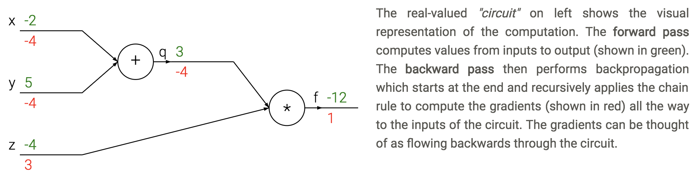

{:toc}

This note covers miscellaneous deep learning, with an emphasis on different architectures + empirical tricks.

See also notes in [📌 unsupervised learning](https://csinva.io/notes/ml/unsupervised.html), [📌 disentanglement](https://csinva.io/notes/research_ovws/ovw_disentanglement.html), [📌 nlp](https://csinva.io/notes/ml/nlp.html)

# basics

- basic perceptron update rule
    - if output is 0, label is 1: increase active weights
    - if output is 1, label is 0: decrease active weights
- *perceptron convergence thm* - if data is linearly separable, perceptron learning algorithm wiil converge
- transfer / activation functions
    - sigmoid(z) = $\frac{1}{1+e^{-z}}$
    - Binary step
    - TanH (preferred to sigmoid)
    - Rectifier = ReLU
         - Leaky ReLU - still has some negative slope when <0
         - rectifying in electronics converts analog -> digital
    - rare to mix and match neuron types
- *deep* - more than 1 hidden layer
- regression loss = $\frac{1}{2}(y-\hat{y})^2$
- classification loss = $-y \log (\hat{y}) - (1-y) \log(1-\hat{y})$ 
    - can't use SSE because not convex here
- multiclass classification loss $=-\sum_j y_j \ln \hat{y}_j$
- **backpropagation** - application of *reverse mode automatic differentiation* to neural networks's loss
  - apply the chain rule from the end of the program back towards the beginning
    - $\frac{dL}{d \theta_i} = \frac{dL}{dz} \frac{\partial z}{\partial \theta_i}$
    - sum $\frac{dL}{dz}$ if neuron has multiple outputs z
    - L is output
  - $\frac{\partial z}{\partial \theta_i}$ is actually a Jacobian (deriv each $z_i$ wrt each $\theta_i$ - these are vectors)
    - each gate usually has some sparsity structure so you don't compute whole Jacobian
- pipeline
  - initialize weights, and final derivative ($\frac{dL}{dL}=1$)
  - for each batch
    - run network forward to compute outputs at each step
    - compute gradients at each gate with backprop
    - update weights with SGD
- 

# training

- *vanishing gradients problem* - neurons in earlier layers learn more slowly than in later layers
  - happens with sigmoids
  - dead ReLus
- *exploding gradients problem* - gradients are significantly larger in earlier layers than later layers
  - RNNs
- *batch normalization* - whiten inputs to all neurons (zero mean, variance of 1)
  - do this for each input to the next layer
- *dropout* - randomly zero outputs of p fraction of the neurons during training
  - like learning large ensemble of models that share weights
  - 2 ways to compensate (pick one)
    1. at test time multiply all neurons' outputs by p
    2. during training divide all neurons' outputs by p
- *softmax* - takes vector z and returns vector of the same length
  - makes it so output sums to 1 (like probabilities of classes)
- **tricks to squeeze out performance**
  - ensemble models
  - (stochastic) weight averaging can help a lot
  - test-time augmentation
     - this could just be averaging over dropout resamples as well
  - gradient checkpointing ([2016 paper](https://arxiv.org/pdf/1604.06174.pdf))
    - 10x larger DNNs into memory with 20% increase in comp. time
    - save gradients for a carefully chosen layer to let you easily recompute

# CNNs
- kernel here means filter
- convolution G- takes a windowed average of an image F with a filter H where the filter is flipped horizontally and vertically before being applied
- G = H $\ast$ F
    - if we do a filter with just a 1 in the middle, we get the exact same image
    - you can basically always pad with zeros as long as you keep 1 in middle
    - can use these to detect edges with small convolutions
    - can do Guassian filters
- 1st-layer convolution typically sum over all color channels
- 1x1 conv - still convolves over channels
- pooling - usually max - doesn't pool over depth
  - people trying to move away from this - larger strides in conversation layers
  - stacking small layers is generally better
- most of memory impact is usually from activations from each layer kept around for backdrop
- visualizations
    - layer activations (maybe average over channels)
    - visualize the weights (maybe average over channels)v
    - feed a bunch of images and keep track of which activate a neuron most
    - t-SNE embedding of images
    - occluding
- weight matrices have special structure (Toeplitz or block Toeplitz)
- input layer is usually centered (subtract mean over training set)
- usually crop to fixed size (square input)
- receptive field - input region
- stride m - compute only every mth pixel
- downsampling
    - max pooling - backprop error back to neuron w/ max value
    - average pooling - backprop splits error equally among input neurons
- data augmentation - random rotations, flips, shifts, recolorings
- siamese networks - extract features twice with same net then put layer on top
    - ex. find how similar to representations are
- famous cnns
	- LeNet (1998)
		- first, used on MNIST
	- AlexNet (2012)
		- landmark (5 conv layers, some pooling/dropout)
	- ZFNet (2013)
		- fine tuning and deconvnet
	- VGGNet (2014)
		- 19 layers, all 3x3 conv layers and 2x2 maxpooling
  - GoogLeNet (2015)
	  - lots of parallel elements (called *Inception module*)
	- Msft ResNet (2015)
        - very deep - 152 layers
            - connections straight from initial layers to end
          - only learn "residual" from top to bottom
	- Region Based CNNs (R-CNN - 2013, Fast R-CNN - 2015, Faster R-CNN - 2015)
		- object detection
	- Karpathy Generating image descriptions (2014)
		- RNN+CNN
	- Spatial transformer networks (2015)
		- transformations within the network
	- Segnet (2015)
		- encoder-decoder network
	- Unet (2015)
		- Ronneberger - applies to biomedical segmentation
	- Pixelnet (2017)
        - predicts pixel-level for different tasks with the same architecture
        - convolutional layers then 3 FC layers which use outputs from all convolutional layrs together
	- Squeezenet
	- Yolonet
	- Wavenet
	- Densenet
	- NASNET
	- [Efficientnet (2019)](https://arxiv.org/pdf/1905.11946.pdf)

# RNNs

- feedforward NNs have no memory so we introduce recurrent NNs
- able to have memory
- truncated - limit number of times you unfold
- $state_{new} = f(state_{old},input_t)$
- ex. $h_t = tanh(W h_{t-1}+W_2 x_t)$
- train with backpropagation through time (unfold through time)
  - truncated backprop through time - only run every k time steps
- error gradients vanish exponentially quickly with time lag
- **LSTMS**
  - have gates for forgetting, input, output
  - easy to let hidden state flow through time, unchanged
  - gate $\sigma$ - pointwise multiplication
    - multiply by 0 - let nothing through
    - multiply by 1 - let everything through
  - forget gate - conditionally discard previously remembered info
  - input gate - conditionally remember new info
  - output gate - conditionally output a relevant part of memory
  - GRUs - similar, merge input / forget units into a single update unit

# transformers

- transformers [original paper](https://arxiv.org/pdf/1706.03762.pdf)
  - [spatial transformers](https://papers.nips.cc/paper/5854-spatial-transformer-networks.pdf )
- http://colah.github.io/posts/2014-03-NN-Manifolds-Topology/
- [A Survey of Transformers](https://arxiv.org/abs/2106.04554)
  - vanilla transformer: multihead attention, add + norm, position-wise ffn, add + norm
    - decoder blocks use cross-attention with inputs from embedding blocks
  - masked self-attention = causal attention = autoregressive attention

## really big models

- [PaLM: Scaling Language Modeling with Pathways](https://arxiv.org/abs/2204.02311) (2022)
  - 540 Billion
  - pathways hardware center allows for fast/efficient training
  - discontinuous improvements - at some point large model improves
  - prompt engineering: "Explain yourself" - lets it explain jokes
- [dall-e 2](https://openai.com/dall-e-2/) (2022)
  - clip is foundation as generative model
    - generates text + image embeddings
    - "prior network" maps text embedding to image embedding
  - adds diffusion model

# graph neural networks

- [Theoretical Foundations of Graph Neural Networks](https://www.youtube.com/watch?v=uF53xsT7mjc)
  - inputs are graphs
  - e.g. molecule input to classification
    - one big study: [a deep learning appraoch to antibiotic discovery](https://www.sciencedirect.com/science/article/pii/S0092867420301021) (stokes et al. 2020) - using GNN classification of antibiotic resistance, came up with 100 candidate antibiotics and were able to test them
  - e.g. traffic maps - nodes are intersections
  - invariances in CNNs: translational, neighbor pixels relate a lot more
  - simplest setup: no edges, each node $i$ has a feature vector $x_i$ (really a set not a graph)
    - X is a matrix where each row is a feature vector
    - note that permuting rows of X shouldn't change anything
    - **permutation invariant**: $f(PX) = f(X)$ for all permutation matrices $P$
      - e.g. $\mathbf{P}_{(2,4,1,3)} \mathbf{X}=\left[\begin{array}{llll}0 & 1 & 0 & 0 \\ 0 & 0 & 0 & 1 \\ 1 & 0 & 0 & 0 \\ 0 & 0 & 1 & 0\end{array}\right]\left[\begin{array}{lll}- & \mathbf{x}_{1} & - \\ - & \mathbf{x}_{2} & - \\ - & \mathbf{x}_{3} & - \\ - & \mathbf{x}_{4} & -\end{array}\right]=\left[\begin{array}{lll}- & \mathbf{x}_{2} & - \\ - & \mathbf{x}_{4} & - \\ - & \mathbf{x}_{1} & - \\ - & \mathbf{x}_{3} & -\end{array}\right]$
      - ex. *Deep Sets* model (zaheer et al. '17): $f(X) = \phi \left (\sum_k \psi(x_i) \right)$
    - **permutation equivariant**: $f(PX) = P f(X)$ - useful for when we want answers at the node level
  - graph: augment set of nodes with edges between them (store as an adjacency matrix)
    - permuting permutation matrix to A requires operating on both rows and cols: $PAP^T$
    - permutation invariance: $ f\left(\mathbf{P X}, \mathbf{P A P}^{\top}\right)=f(\mathbf{X}, \mathbf{A})$
    - permutation equivariance: $f\left(\mathbf{P X}, \mathbf{P A P}^{\top}\right)=\mathbf{P} f(\mathbf{X}, \mathbf{A})$
    - can now write an equivariant function that extracts features not only of X, but also its neighbors: $g(x_b, X_{\mathcal N_b})$
      - tasks: node classification, graph classification, link (edge) prediction)
    - 3 flavors of GNN layers for extracting features from nodes / neighbors: simplest to most complex
      - message-passing actually passes vectors to be sent across edges
      - 
  - previous approaches map on to gnns well
    - GNNs explicitly construct local features, much like previous works
      - local objectives: features of nodes i and j should predict existence of edge $(i, j)$
      - random-walk objectives: features should be similar if i and j co-occur on a short random walk (e.g. deepwalk, node2vec, line)
    - similarities to NLP if we think of words as nodes and sentences as walks
      - we can think of transformers as fully-connect graph networks with attentional form of GNN layers
        - one big difference: positional embeddings often used, making the input not clearly a graph
          - these postitional embeddings often take the form of sin/cos - very similar to DFT eigenvectors of a graph
    - spectral gnns 
      - operate on graph laplacian matrix $L = D - A$ where $D$ is degree matrix and $A$ is adjacency matrix - more mathematically convenient
    - probabilistic modeling - e.g. assome markov random field and try to learn parameters
      - this connects well to a message-passing GNN
- GNN limitations
  - ex. can we tell whether 2 graphs are isomorphic - often no?
  - can make GNNs more powerful by adding positional features, etc.
  - can also embed sugraphs together
  - continuous case is more difficult
- geometric deep learning: invariances and equivariances can be applied generally to get a large calss of architectures between convolutions and graphs

# misc architectural components

- **coordconv** - break translation equivariance by passing in i, j coords as extra filters
- **deconvolution** = transposed convolution = fractionally-strided convolution - like upsampling
- **attention** = vector of importance weights
  - to predict or infer one element, such as a pixel in an image or a word in a sentence, we estimate using the attention vector how strongly it is correlated with (or “*attends to*” other elements and take the sum of their values weighted by the attention vector as the approximation of the target

# misc

- [Deep Learning Interviews: Hundreds of fully solved job interview questions from a wide range of key topics in AI](https://arxiv.org/abs/2201.00650)
- adaptive pooling can help deal with different sizes
- [NeRF: Representing Scenes as Neural Radiance Fields for View Synthesis](https://arxiv.org/abs/2003.08934)
  - given multiple views, generate depth map + continuous volumetric repr.
  - dnn is overfit to only one scene
  - inputs: a position and viewing direction
  - output: for that position, density (is there smth at this location) + color (if there is smth at this location)
  - then, given new location / angle, send a ray through for each pixel and see color when it hits smth
  - [Implicit Neural Representations with Periodic Activation Functions](https://vsitzmann.github.io/siren/)
    - similar paper
- architecture search: learning to learn
- *optimal brain damage* - starts with fully connected and weeds out connections (Lecun)
- *tiling* - train networks on the error of previous networks