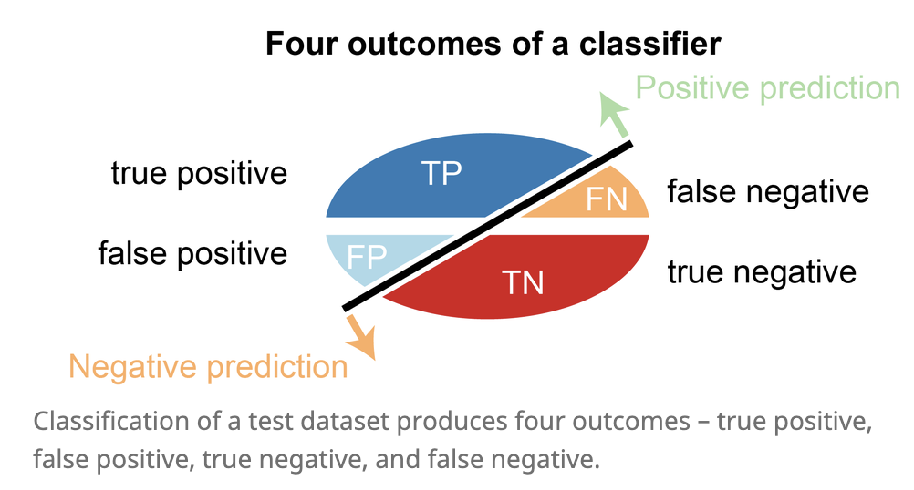

{:toc}

# losses

- define a loss function $\mathcal{L}$
  - 0-1 loss: $\vert C-f(X)\vert$  - hard to minimize (combinatorial)
  - $L_2$ loss: $[C-f(X)[^2$
- *risk* = $E_{(x,y)\sim D}[\mathcal L(f(X), y) ]$
- optimal classifiers
  - Bayes classifier minimizes 0-1 loss: $\hat{f}(X)=C_i$ if $P(C_i\vert X)=max_f P(f\vert X)$
  - KNN minimizes $L_2$ loss: $\hat{f}(X)=E(Y\vert X)$ 
- classification cost functions
  1. misclassification error - not differentiable
  2. Gini index: $\sum_{i != j} p_i q_j$
  3. cross-entropy: $-\sum_x p(x)\: \log \: \hat p(x) $, where $p(x)$ are usually labels and $\hat p(x)$ are softmax outputs
     1. only penalizes target class (others penalized implicitly because of softmax)
     2. for binary, $- (p \log \hat p + (1-p) \log (1-\hat p)$

# measures

*goodness of fit* - how well does the learned distribution represent the real distribution?

- accuracy-based
  - accuracy = (TP + TN) / (P + N)
    - correct classifications / total number of test cases
  - balanced accuracy = 1/2 (TP / P + TN / N)
- denominator is total pos/neg
  - **recall** = **sensitivity** =  **true-positive rate** = TP / P = TP / (TP + FN)
    - what fraction of the real positives do we return?
  - **specificity** = true negative rate = TN / N = TN / (TN + FP)
    - what fraction of the real negatives do we return?
  - **false positive rate** = FP / N $= 1 - \text{specificity}$
    - what fraction of the predicted negatives are wrong?
- fraction is total predictions
  - **precision** = **positive predictive value** = TP / (TP + FP)
    - what fraction of the prediction positives are true positives?

  - **negative predictive value** = TN / (FN + TN)
    - what fraction of predicted negatives are true negatives?
- **F-score** is harmonic mean of precision and recall: 2 * (prec * rec) / (prec + rec)
- [NRI](https://en.wikipedia.org/wiki/Net_reclassification_improvement) (controversial): compares 2 model's binary predictions
- curves - easiest is often to just plot TP vs TN or FP vs FN

  - roc curve: true-positive rate (recall) vs. false-positive rate
    - perfect is recall = 1, false positive rate = 0
  - precision-recall curve
  - summarizing curves
    - AUC: area under (either one) of these curves - usually roc
- **concordance** = inter-rate reliability
   - exact concordance - percentage where cohort is in total agreement (i.e. accuracy)
   - Cohen's kappa coefficient - 0 is uncorrelated, 1 is perfect, negative is inverse correlation
      - $\kappa \equiv \frac{p_{o}-p_{e}}{1-p_{e}}=1-\frac{1-p_{o}}{1-p_{e}}$
      - $p_o$ is relative observed agreement and $p_e$ is chance expected agreement
   - weighted kappa coefficient - used when ordering for predicted labels (being off by more is given bigger weight)

# comparing two things

- odds: $p : \text{not }p$
- odds ratio is a ratio of odds

# cv

- *cross validation* - don't have enough data for a test set
  - properties
    - not good when n < complexity of predictor
      - because summands are correlated
    - assume data units are exchangeable
    - can sometimes use this to pick k for k-means
    - data is reused
  - types
    1. k-fold - split data into N pieces
      - N-1 pieces for fit model, 1 for test
      - cycle through all N cases
      - average the values we get for testing
    2. leave one out (LOOCV)
      - train on all the data and only test on one
      - then cycle through everything
    3. random split - shuffle and repeat
    4. *one-way CV* = *prequential analysis* - keep testing on next data point, updating model
    5. ESCV - penalize variance between folds
- *regularization path* of a regression - plot each coeff v. $\lambda$
  
  - tells you which features get pushed to 0 and when
- for OLS (and maybe other linear models), [can compute leave-one-out CV without training separate models](https://robjhyndman.com/hyndsight/crossvalidation/)

# stability
1. computational stability
  - randomness in the algorithm
  - perturbations to models
2. generalization stability
  - perturbations to data
  - sampling methods
    1. *bootstrap* - take a sample
      - repeatedly sample from observed sample w/ replacement
      - bootstrap samples has same size as observed sample
    2. *subsampling*
      - sample without replacement
    3. *jackknife resampling*
      - subsample containing all but one of the points

# other considerations

- computational cost
- interpretability
- model-selection criteria
  - *adjusted $R^2_p$* - penalty 
  - *Mallow's $C_p$*
  - *$AIC_p$*
  - *$BIC_p$*
  - PRESS