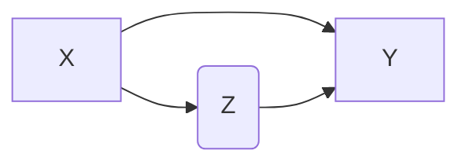

* TOC
{:toc}
# overview

- 3 types: supervised, unsupervised, reinforcement
- 4 problems: regression, classification, density estimation / clustering, dim. reduction
- models: generative, discriminative

# feature selection

## filtering

- ranks features or feature subsets independently of the predictor
- univariate methods (consider one variable at a time)
  - ex. T-test of y for each variable
  - ex. pearson correlation coefficient - this can only capture linear dependencies
  - mutual information - covers all dependencies
- multivariate methods
  - features subset selection
  - need a scoring function
  - need a strategy to search the space
  - sometimes used as preprocessing for other methods

## wrapper

- uses a predictor to assess features of feature subsets
- learner is considered a black-box - use train, validate, test set
- forward selection - start with nothing and keep adding
- backward elimination - start with all and keep removing
- others: Beam search - keep k best path at teach step, GSFS, PTA(l,r), floating search - SFS then SBS

## embedding

- uses a predictor to build a model with a subset of features that are internally selected
- ex. lasso, ridge regression

# unsupervised learning

- labels are not given
- intra-cluster distances are minimized, inter-cluster distances are maximized
- distance measures
  - symmetric D(A,B)=D(B,A)
  - self-similarity D(A,A)=0
  - positivity separation D(A,B)=0 iff A=B
  - triangular inequality D(A,B) <= D(A,C)+D(B,C)
  - ex. Minkowski Metrics $d(x,y)=\sqrt[r]{\sum \vert x_i-y_i\vert ^r}$
    - r=1 Manhattan distance
    - r=1 when y is binary -> Hamming distance
    - r=2 Euclidean
    - r=$\infty$ "sup" distance
- correlation coefficient - unit independent
- edit distance

## hierarchical

- two approaches:
    1. bottom-up agglomerative clustering - starts with each object in separate cluster then joins
    2. top-down divisive - starts with 1 cluster then separates
- ex. starting with each item in its own cluster, find best pair to merge into a new cluster
    - repeatedly do this to make a tree (dendrogram)
- distances between clusters defined by *linkage function*
  - single-link - closest members (long, skinny clusters)
  - complete-link - furthest members  (tight clusters)
  - average - most widely used
- ex. MST - keep linking shortest link
- *ultrametric distance* - tighter than triangle inequality
    - $d(x, y) \leq max[d(x,z), d(y,z)]$

## partitional

- partition n objects into a set of K clusters (must be specified)
- globally optimal: exhaustively enumerate all partitions
- minimize sum of squared distances from cluster centroid
- evaluation w/ labels - purity - ratio between dominant class in cluster and size of cluster
- k-means++ - better at not getting stuck in local minima
  - randomly move centers apart
- Complexity: $O(n^2p)$ for first iteration and then can only get worse

# clustering & conditional mixtures - J. 10

- *latent vars* - values not specified in the observed data

## clustering

- *K-Means*
  - start with random centers
  - assign everything to nearest center: $O(\|\text{clusters}\|*np) $
  - recompute centers $O(np)$ and repeat until nothing changes
  - partition amounts to Voronoi diagram
  - can be viewed as minimizing *distortion measure* $J=\sum_n \sum_i z_n^i ||x_n - \mu_i||^2$
  - ***EM algo for this***
- *GMMs*
  - $p(x|\theta) = \underset{i}{\Sigma} \pi_i \mathcal{N}(x|\mu_i, \Sigma_i)$
    - $l(\theta|x) = \sum_n log \: p(x_n|\theta) \\ = \sum_n log \sum_i \pi_i \mathcal{N}(x_n|\mu_i, \Sigma_i)$
    - hard to maximize bcause log acts on a sum
  - continue deriving new mean and variance at each step
  - "soft" version of K-means - update means as weighted sums of data instead of just normal mean
  - sometimes initialize K-means w/ GMMs

## conditional mixture models - regression/classification

- ex. 
- latent variable Z has multinomial distr.
  - *mixing proportions*: $P(Z^i=1|x, \xi) = \frac{e^{\xi_i^Tx}}{\sum_je^{\xi_j^Tx}}$
  - *mixture components*: $p(y|Z^i=1, x, \theta_i)$ ~ different choices
  - ex. mixture of linear regressions
    - $p(y|Z^i=1, x, \theta_i) = \mathcal{N}(y|\beta_i^Tx, \sigma_i^2)$
  - mixtures of logistic regressions
    - $p(y|Z^i=1, x, \theta_i) = \mu(\theta_i^Tx)^y\cdot[1-\mu(\theta_i^Tx)]^{1-y}$ where $\mu$ is the logistic function
- ***EM algorithm for this***
- also, nonlinear optimization for this