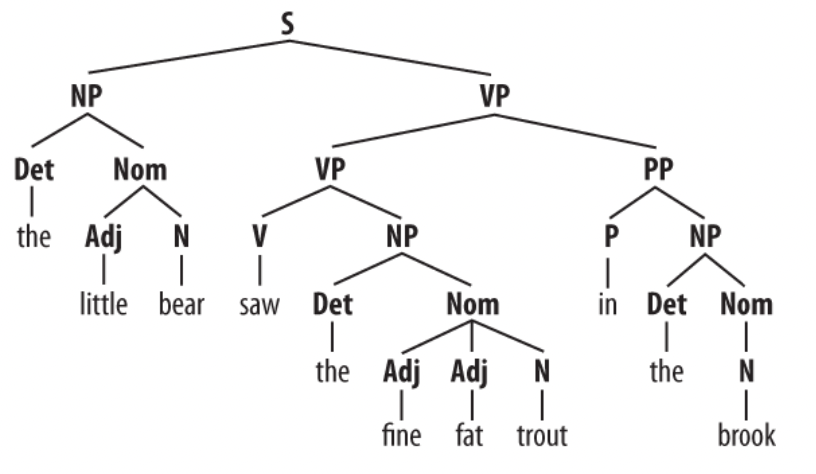
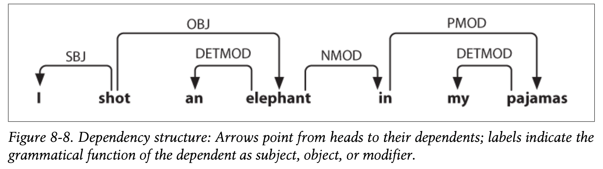

{:toc}

Some notes on natural language processing, focused on modern improvements based on deep learning.

# nlp basics

*basics come from book "Speech and Language Processing"*

- **language models** - assign probabilities to sequences of words
  - ex. **n-gram model** - assigns probs to short sequences of words, known as n-grams
    - for full sentence, use markov assumption
  - eval: **perplexity (PP)** - inverse probability of the test set, normalized by the number of words (want to minimize it)
    - $PP(W_{test}) = P(w_1, ..., w_N)^{-1/N}$
    - can think of this as the weighted average branching factor of a language
    - should only be compared across models w/ same vocab
  - vocabulary
    - sometimes closed, otherwise have unkown words, which we assign its own symbol
    - can fix training vocab, or just choose the top words and have the rest be unkown
- **topic models (e.g. LDA)** - apply unsupervised learning on large sets of text to learn sets of associated words
- **embeddings** - vectors for representing words
  - ex. **tf-idf** - defined as counts of nearby words (big + sparse)
    - TF * IDF = [ (Number of times term t appears in a document) / (Total number of terms in the document) ] * log(Total number of documents / Number of documents with term t in it).
    - pointwise mutual info - instead of counts, consider whether 2 words co-occur more than we would have expected by chance
  - ex. **word2vec** - short, dense vectors
    - intuition: train classifier on binary prediction: is word $w$ likely to show up near this word? (algorithm also called skip-gram)
      - the weights are the embeddings
    - also **GloVe**, which is based on ratios of word co-occurrence probs
- some tasks
  - tokenization
  - pos tagging
  - named entity recognition
    - nested entity recognition - not just names (but also Jacob's brother type entity)
  - sentiment classification
  - language modeling (i.e. text generation)
  - machine translation
  - hardest: coreference resolution
  - question answering
  - [natural language inference](https://www.aclweb.org/anthology/P19-1334.pdf) - does one sentence entail another?
- most popular datasets
  - (by far) WSJ
  - then twitter
  - then Wikipedia
- [eli5](https://eli5.readthedocs.io/en/latest/libraries/sklearn.html#library-scikit-learn) has nice text highlighting for interp

## grammars

*notes/figures from [nltk book ch 8/9](https://www.nltk.org/book/)*

- language -  set of all grammatical sentences
- grammar - formal notation that can be used for “generating” the members of this set
- phrases
  - noun phrases
  - adjective phrase

- structures
  - **constituent structure** - words combine with other words to form units which are substitutable
    - e.g.  the fact that we can substitute *He* for *The little bear* indicates that the latter sequence is a unit

  - coordinate structure: if $v_{1}$ and $v_{2}$ are both phrases of grammatical category $X$, then $v_{1}$ and $v_{2}$ is also a phrase of category $X$

- **context-free grammar** - set  of grammar rules that define a gramm
  - e.g. $S \to NP\; VP$
  - rules can be probabilities (so we search for the most probable parse tree, rather than returning all)

- phrase tree
  - 
  - $\begin{array}{lll}\text { Symbol } & \text { Meaning } & \text { Example } \\ \text { S } & \text { sentence } & \text { the man walked } \\ \text { NP } & \text { noun phrase } & \text { a dog } \\ \text { VP } & \text { verb phrase } & \text { saw a park } \\ \text { PP } & \text { prepositional phrase } & \text { with a telescope } \\ \text { Det } & \text { determiner } & \text { the } \\ \text { N }& \text { noun } & \text { dog } \\ \text { V } & \text { verb } & \text { walked } \\ \text{ P} & \text { preposition } & \text { in }\end{array}$
  - note: chunking yields a similar partition of a sequence rather than a tree

- algorithms
  - top-down parsing (e.g. recursive descent parsing) - starts from $S$ , and keep expanding the grammar rules until finding a match
    - RecursiveDescentParser is unable to handle **left-recursive** productions of the form X -> X Y

  - bottom-up parsing - can be faster; find sequences that correspond to the righthand side of a grammar rule and replace them with the left
    - ex. shift-reduce parser

  - backtracking ensures we find a parse if one exists (and can find multiple if we choose)

- **dependency grammar** focuses on how words relate to other words
  - relation between *head* (usually tensed verb) and its *dependents* (rest of the words)
  - 
  - this can also be displayed as a tree
    - 
    
  - a dependency graph is **projective** if, when all the words are written in order, the edges can be drawn above the words without crossing
    - equivalent to saying that a word and all its descendants (dependents and dependents of its dependents, etc.) form a contiguous sequence of words within the sentence
    - above graph is projective
  
  - **valencies** - sometimes certain things in a class are allowed buothers are not
    - e.g. "Buster was frightened" ✅ but "Buster saw frightened" :x:
    - need subcategories of things (e.g. intransitive verb vs transitive verb vs dative verb) to know what symbols are allowed in rules
    - verbs specifically have **complements** associated with them -- unlike **modifiers** (like the word "really"), complemetes are not optional and usually not selected in the same way by the head
  
- **feature-based grammars** - add things to word representations (e.g. plurality) and use these in the grammar rules

# dl for nlp

- some recent topics based on [this blog](http://jalammar.github.io/)
- rnns
  - when training rnn, accumulate gradients over sequence and then update all at once
  - **stacked rnns** have outputs of rnns feed into another rnn
  - bidirectional rnn - one rnn left to right and another right to left (can concatenate, add, etc.)
- standard seq2seq
  - encoder reads input and outputs context vector (the hidden state)
  - decoder (rnn) takes this context vector and generates a sequence
- misc papers
  - [Deal or No Deal? End-to-End Learning for Negotiation Dialogues](https://arxiv.org/abs/1706.05125) (2017) - controversial FB paper where agents "make up their own language"

# interpretable nlp

- word2vec - 2 papers
  - [initial word2vec](https://arxiv.org/abs/1301.3781) (mikolov et al. 2013) - simplifies neural language models for efficient training of word embeddings
    - maximizing the probabilities of words being predicted by their context words (with a DNN)
    - continuous bag-of-words (CBOW) - predict current word from window (order doesn't matter)
    - skipgram - use current word to predict surrounding window -- nearby context words weighted more heavily

  - [Distributed Representations of Words and Phrases and their Compositionality](https://arxiv.org/abs/1310.4546) (mikolov et al. 2013) - word2vec improvements
    - identify key ngrams and give them their own vecs

- [Neural Bag-of-Ngrams](https://ojs.aaai.org/index.php/AAAI/article/view/10954) (li et al. 2017) - learn ngram repr. via deep version of skip-gram
- [fasttext](https://www.ijcai.org/Proceedings/16/Papers/401.pdf) (jin et al. 2016)
- [Improving N-gram Language Models with Pre-trained Deep Transformer](https://arxiv.org/abs/1911.10235) (wang et al. 2019) - use transformer to generate synthetic data for n-gram model
- [(DirtyCat): Encoding High-Cardinality String Categorical Variables](https://ieeexplore.ieee.org/abstract/document/9086128) (cerda & varoquax, 2020) - use embedding model to improve string categorical variables

# huggingface tutorial

Broadly, models can be grouped into three categories:

- GPT-like (also called *auto-regressive* Transformer models)
- BERT-like (also called *auto-encoding* Transformer models)
- BART/T5-like (also called *sequence-to-sequence* Transformer models)
- [Tokenizers - Hugging Face Course](https://huggingface.co/course/chapter2/4?fw=pt)
  - word-based
    - punctuation splitting
    - need to do stemming (e.g. "dog" and "dogs")
    - unknown token [UNK] for anything not seen - to reduce the amount of this, can get character-based tokens
    - vocab tends to be too bug
  - **subword-based** - break apart meaningful subparts of words, most popular (2022)
    - many more (e.g. byte-level BPE, used in GPT-2)
  - character-based - very little prior, generally sequences are too long
- [Handling multiple sequences - Hugging Face Course](https://huggingface.co/course/chapter2/5?fw=pt)
  - pad sequences to have the same length (need to modify attention masks to ignore the padded values)