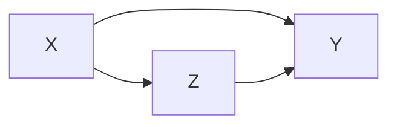

{:toc}

# clustering

- labels are not given
- intra-cluster distances are minimized, inter-cluster distances are maximized
- distance measures
  - symmetric D(A,B)=D(B,A)
  - self-similarity D(A,A)=0
  - positivity separation D(A,B)=0 iff A=B
  - triangular inequality D(A,B) <$\leq$ D(A,C)+D(B,C)
  - ex. Minkowski Metrics $d(x,y)=\sqrt[r]{\sum \vert x_i-y_i\vert ^r}$
    - r=1 Manhattan distance
    - r=1 when y is binary -> Hamming distance
    - r=2 Euclidean
    - r=$\infty$ "sup" distance
- correlation coefficient - unit independent
- edit distance

## hierarchical

- two approaches:
    1. bottom-up agglomerative clustering - starts with each object in separate cluster then joins
    2. top-down divisive - starts with 1 cluster then separates
- ex. starting with each item in its own cluster, find best pair to merge into a new cluster
    - repeatedly do this to make a tree (dendrogram)
- distances between clusters defined by *linkage function*
  - single-link - closest members (long, skinny clusters)
  - complete-link - furthest members  (tight clusters)
  - average - most widely used
- ex. MST - keep linking shortest link
- *ultrametric distance* - tighter than triangle inequality
    - $d(x, y) \leq \max[d(x,z), d(y,z)]$

## partitional

- partition n objects into a set of K clusters (must be specified)
- globally optimal: exhaustively enumerate all partitions
- minimize sum of squared distances from cluster centroid
- evaluation w/ labels - purity - ratio between dominant class in cluster and size of cluster
- k-means++ - better at not getting stuck in local minima
  - randomly move centers apart
- Complexity: $O(n^2p)$ for first iteration and then can only get worse

## statistical clustering (j 10)

- *latent vars* - values not specified in the observed data
- 
  

- *K-Means*
  - start with random centers
  - E: assign everything to nearest center: $O(\|\text{clusters}\|*np) $
  - M: recompute centers $O(np)$ and repeat until nothing changes
  - partition amounts to Voronoi diagram
  - can be viewed as minimizing *distortion measure* $J=\sum_n \sum_i z_n^i ||x_n - \mu_i||^2$
- *GMMs*: $p(x|\theta) = \underset{i}{\Sigma} \pi_i \mathcal{N}(x|\mu_i, \Sigma_i)$

  - $l(\theta|x) = \sum_n \log \: p(x_n|\theta) \\ = \sum_n \log \sum_i \pi_i \mathcal{N}(x_n|\mu_i, \Sigma_i)$
  - hard to maximize bcause log acts on a sum

  - "soft" version of K-means - update means as weighted sums of data instead of just normal mean
  - sometimes initialize K-means w/ GMMs

## conditional mixture models - regression/classification (j 10)



- ex. 
- latent variable Z has multinomial distr.
  - *mixing proportions*: $P(Z^i=1|x, \xi)$
    - ex. $ \frac{e^{\xi_i^Tx}}{\sum_je^{\xi_j^Tx}}$
  - *mixture components*: $p(y|Z^i=1, x, \theta_i)$ ~ different choices
  - ex. mixture of linear regressions
    - $p(y| x, \theta) = \sum_i \underbrace{\pi_i (x, \xi)}_{\text{mixing prop.}} \cdot \underbrace{\mathcal{N}(y|\beta_i^Tx, \sigma_i^2)}_{\text{mixture comp.}}$
  - ex. mixtures of logistic regressions
    - $p(y|x, \theta_i) = \underbrace{\pi_i (x, \xi)}_{\text{mixing prop.}} \cdot \underbrace{\mu(\theta_i^Tx)^y\cdot[1-\mu(\theta_i^Tx)]^{1-y}}_{\text{mixture comp.}}$ where $\mu$ is the logistic function
- also, nonlinear optimization for this (including EM)

# dim reduction

In general there is some tension between preserving global properties (e.g. PCA) and local peroperties (e.g. nearest neighborhoods)

| Method              | Analysis objective | Temporal smoothing | Explicit noise model | Notes |
|---------------------|--------------------|--------------------|----------------------|---------------------|
| PCA                 | Covariance         | No                 | No                   | orthogonality |
| FA                  | Covariance         | No                 | Yes                  | like PCA, but with errors (not biased by variance) |
| LDS/GPFA            | Dynamics           | Yes                | Yes                  |  |
| NLDS                | Dynamics           | Yes                | Yes                  |  |
| LDA                 | Classification     | No                 | No                   |  |
| Demixed             | Regression         | No                 | Yes/No               |  |
| Isomap/LLE          | Manifold discovery | No                 | No                   |  |
| T-SNE               | ....               | ....               | ...                  |  |
| UMAP                | ...                | ...                | ...                  |  |

- NMF - $\min_{D \geq 0, A \geq 0} \|\|X-DA\|\|_F^2$
  - SEQNMF
- LDA/QDA - finds basis that separates classes
  - reduced to axes which separate classes (perpendicular to the boundaries)
- K-means - can be viewed as a linear decomposition

## spectral clustering

- *spectral* clustering - does dim reduction on eigenvalues (spectrum) of similarity matrix before clustering in few dims
  - uses adjacency matrix
  - basically like PCA then k-means
  - performs better with regularization - add small constant to the adjacency matrix

## pca

- want new set of axes (linearly combine original axes) in the direction of greatest variability
    - this is best for visualization, reduction, classification, noise reduction
    - assume $X$ (nxp) has zero mean

- derivation: 

    - minimize variance of X projection onto a unit vector v
      - $\frac{1}{n} \sum (x_i^Tv)^2 = \frac{1}{n}v^TX^TXv$ subject to $v^T v=1$
      - $\implies v^T(X^TXv-\lambda v)=0$: solution is achieved when $v$ is eigenvector corresponding to largest eigenvalue
    - like minimizing perpendicular distance between data points and subspace onto which we project

- SVD: let $U D V^T = SVD(Cov(X))$

    - $\text{Cov}(X) = \frac{1}{n}X^TX$, where X has been demeaned

- equivalently, eigenvalue decomposition of covariance matrix $\Sigma = X^TX$
  - each eigenvalue represents prop. of explained variance: $\sum \lambda_i = tr(\Sigma) = \sum Var(X_i)$

  - *screeplot*  - eigenvalues in decreasing order, look for num dims with kink
    - don't automatically center/normalize, especially for positive data

- SVD is easier to solve than eigenvalue decomposition, can also solve other ways
  1. multidimensional scaling (MDS)
    - based on eigenvalue decomposition
  2. adaptive PCA
    - extract components sequentially, starting with highest variance so you don't have to extract them all	

- good PCA code: http://cs231n.github.io/neural-networks-2/
```python
X -= np.mean(X, axis = 0) # zero-center data (nxd)
cov = (X.T @ X) / X.shape[0] # get cov. matrix (dxd)
U, D, V = np.linalg.svd(cov) # compute svd, (all dxd)
Xrot_reduced = X @ U[:, :2] # project onto first 2 dimensions (n x 2)
```
- nonlinear pca
    - usually uses an auto-associative neural network

## topic modeling

- similar, try to discover topics in a model (which maybe can be linearly combined to produce the original document)

- ex. LDA - generative model: posits that each document is a mixture of a **small number of topics** and that **each word's presence is attributable to one of the document's topics**

## sparse coding = sparse dictionary learning

$$\underset {\mathbf{D}} \min \underset t \sum \underset {\mathbf{a^{(t)}}} \min ||\mathbf{x^{(t)}} - \mathbf{Da^{(t)}}||_2^2 + \lambda ||\mathbf{a^{(t)}}||_1$$

- D is like autoencoder output weight matrix
- $a$ is more complicated - requires solving inner minimization problem
- outer loop is not quite lasso - weights are not what is penalized
- impose norm $D$ not too big
- algorithms
  - thresholding (simplest) - do $D^Ty$ and then threshold this
  - basis pursuit - change $l_0$ to $l_1$
    - this will work under certain conditions (with theoretical guarantees)
  - matching purusuit - greedy, find support one at a time, then look for the next one

## ica

- overview
  - remove correlations and higher order dependence
  - all components are equally important
  - like PCA, but instead of the dot product between components being 0, the mutual info between components is 0
  - goals
    - minimize statistical dependence between components
    - maximize information transferred in a network of non-linear units
    - uses information theoretic unsupervised learning rules for neural networks
  - problem - doesn't rank features for us
- goal: want to decompose $X$ into $z$, where we assume $X = Az$
  - assumptions
    - independence: $P(z) = \prod_i P(z_i)$
    - non-gaussianity of $z$
  - 2 ways to get $z$ that matches these assumptions
    1. maximize non-gaussianity of $z$ - use kurtosis, negentropy
    2. minimize mutual info between components of $z$ - use KL, max entropy
       1. often equivalent
  - identifiability: $z$ is identifiable up to a permutation and scaling of sources when
    - at most one of the sources $z_k$ is gaussian
    - $A$ is full-rank
- ICA learns components which are completely independent, whereas PCA learns orthogonal components
- **non-linear ica**: $X \approx f(z)$, where assumptions on $z$ are the same, but $f$ can be nonlinear
  - to obtain identifiability, we need to restrict $f$ and/or constrain the distr of the sources $z$
- bell & sejnowski 1995 original formulation (slightly different)
  - entropy maximization - try to find a nonlinear function $g(x)$ which lets you map that distr $f(x)$ to uniform
    - then, that function $g(x)$ is the cdf of $f(x)$
  - in ICA, we do this for higher dims - want to map distr of $x_1, ..., x_p$ to $y_1, ..., y_p$ where distr over $y_i$'s is uniform (implying that they are independent)
    - additionally we want the map to be information preserving
  - mathematically: $\underset{W} \max I(x; y) = \underset{W} \max H(y)$ since $H(y|x)$ is zero (there is no randomness)
    - assume $y = \sigma (W x)$ where $\sigma$ is elementwise
    - (then S = WX, $W=A^{-1}$)
    - requires certain assumptions so that $p(y)$ is still a distr: $p(y) = p(x) / |J|$ where J is Jacobian
  - learn W via gradient ascent $\Delta W \propto \partial / \partial W (\log |J|)$
    - there is now something faster called fast ICA
- topographic ICA (make nearby coefficient like each other)
- interestingly, some types of self-supervised learning perform ICA assuming certain data structure (e.g. time-contrastive learning (hyvarinen et al. 2016))

## topological

- **multidimensional scaling (MDS)**
  - given a a distance matrix, MDS tries to recover low-dim coordinates s.t. distances are preserved
  - minimizes goodness-of-fit measure called *stress* = $\sqrt{\sum (d_{ij} - \hat{d}_{ij})^2 / \sum d_{ij}^2}$
  - visualize in low dims the similarity between individial points in high-dim dataset
  - classical MDS assumes Euclidean distances and uses eigenvalues
    - constructing configuration of n points using distances between n objects
    - uses distance matrix
      - $d_{rr} = 0$
      - $d_{rs} \geq 0$
    - solns are invariant to translation, rotation, relfection
    - solutions types
      1. non-metric methods - use rank orders of distances
         - invariant to uniform expansion / contraction
      2. metric methods - use values
    - D is *Euclidean* if there exists points s.t. D gives interpoint Euclidean distances
      - define B = HAH
        - D Euclidean iff B is psd
- **t-sne** preserves pairwise neighbors
  - [t-sne tutorial](https://distill.pub/2016/misread-tsne/)
  - t-sne tries to match pairwise distances between the original data and the latent space data: 
  - original data
    - distances are converted to probabilities by assuming points are means of Gaussians, then normalizing over all pairs
      - variance of each Gaussian is scaled depending on the desired perplexity
  - latent data
    - distances are calculated using some kernel function
      - t-SNE uses heavy-tailed Student's t-distr kernel (van der Maaten & Hinton, 2008)
      - SNE use Gausian kernel (Hinton & Roweis, 2003)
    - kernels have some parameters that can be picked or learned
    - **perplexity** - how to balance between local/global aspects of data
  - optimization - for optimization purposes, this can be decomposed into attractive/repulsive forces 
- **umap**: Uniform Manifold Approximation and Projection for Dimension Reduction
	- [umap tutorial](https://umap-learn.readthedocs.io/en/latest/how_umap_works.html) 
- **pacmap**
  - 

## misc
- Sparse Component Analysis ([zimnik...cunningham, paninski, churchland, & glaser, 2024](https://www.biorxiv.org/content/10.1101/2024.02.05.578988v1.full.pdf))
  - $\arg \min _{U, V}\left(\|W(X-X U V)\|_F^2+\lambda_{\text {sparse }}\|X U\|_1+\lambda_{\text {orth }}\left\|V V^{\top}-I\right\|_F^2\right)$
    - where $U$ is encoding matrix and $V$ is decoding, the final loss term is imposing orthogonality of the columns of V

- [NNK-Means: Dictionary Learning using Non-Negative Kernel regression](https://arxiv.org/abs/2110.08212) (shekkizhar & ortega, 2021)
  - data summarization - represent large datasets by a small set of elements (e.g. k-means)
  - here, use dictionary learning instead of k-means to summarize data
    - each dictionary element is a sparse combination of inputs
    - use non-negative kernel regesion (NNK) to measure distances when designing the dictionary ([shekkizar & ortega, 2020](https://ieeexplore.ieee.org/abstract/document/9054425/))


# generative models

- overview: https://blog.openai.com/generative-models/
- notes for [deep unsupervised learning](https://sites.google.com/view/berkeley-cs294-158-sp20/home)
- MLE equivalent to minimizing KL for density estimation:
  - $\min_\theta KL(p|| p_\theta) =\\ \min_\theta-H(p) + \mathbb E_{x\sim p}[-\log p_\theta(x)] \\ \max_\theta E_p[\log p_\theta(x)]$

## autoregressive models

- model input based on input
  - $p(x_1)$ is a histogram (learned prior)
  - $p(x_2|x_1)$ is a distr. ouptut by a neural net (output is logits, followed by softmax)
  - all conditional distrs. can be given by neural net
- can model using an RNN: e.g. char-rnn (karpathy, 2015): $\log p(x) - \sum_i \log p(x_i | x_{1:i-1})$, where each $x_i$ is a character
- can also use masks
  - masked autoencoder for distr. estimation - mask some weights so that autoencoder output is a factorized distr.
    - pick an odering for the pixels to be conditioned on
  - ex. 1d masked convolution on wavenet (use past points to predict future points)
  - ex. pixelcnn - use masking for pixels to the topleft
  - ex. gated pixelcnn - fixes issue with blindspot
  - ex. pixelcnn++ - nearby pixel values are likely to cooccur
  - ex. pixelSNAIL - uses attention and can get wider receptive field
  - **attention:**$A(q, K, V) = \sum_i \frac{\exp(q \cdot k_i)}{\sum_j \exp (q \cdot k_j)} v_i$
    - masked attention can be more flexible than masked convolution
  - can do super resolution, hierarchical autoregressive model
- problems
  - slow - have to sample each pixel (can speed up by caching activations)
    - can also speed up by assuming some pixels conditionally independent
- hard to get a latent reprsentation
  - can use **Fisher score** $\nabla_\theta \log p_\theta (x)$


### flow models

- good intro to implementing invertible neural networks: https://hci.iwr.uni-heidelberg.de/vislearn/inverse-problems-invertible-neural-networks/
  - input / output dimension need to have same dimension
  - we can get around this by padding one of the dimensions with noise variables (and we might want to penalize these slightly during training)
- [normalizing flows](https://arxiv.org/pdf/1908.09257.pdf)
- ultimate goal: a likelihood-based model with
  - fast sampling
  - fast inference (evaluating the likelihood)
  - fast training
  - good samples
  - good compression
- transform some $p(x)$ to some $p(z)$
  - $x \to z = f_\theta (x)$, where $z \sim p_Z(z)$
  - $p_\theta (x) dx = p(z)dz$
  - $p_\theta(x) = p(f_\theta(x))|\frac {\partial f_\theta (x)}{\partial x}|$
- autoregressive flows
  - map $x\to z$ invertible
    - $x \to z$ is same as log-likelihood computation
    - $z\to x$ is like sampling
  - end up being as deep as the number of variables
- realnvp (dinh et al. 2017) - can couple layers to preserve invertibility but still be tractable
  - downsample things and have different latents at different spatial scales
- other flows
  - flow++
  - glow
  - FFJORD - continuous time flows
- discrete data can be harder to model
  - **dequantization** - add noise (uniform) to discrete data


## vaes

- [intuitively understanding vae](https://towardsdatascience.com/intuitively-understanding-variational-autoencoders-1bfe67eb5daf)
- [VAE tutorial](https://jaan.io/what-is-variational-autoencoder-vae-tutorial/)
  - minimize $\mathbb E_{q_\phi(z|x)}[\log p_\theta(x|z)- D_{KL}(q_\phi(z|x)\:||\:p(z))]$
    - want latent $z$ to be standard normal - keeps the space smooth
  - hard to directly calculate $p(z|x)$, since it includes $p(x)$, so we approximate it with the variational posterior $q_\phi (z|x)$, which we assume to be Gaussian
  - goal: $\text{argmin}_\phi KL(q_\phi(z|x) \:|| \:p(z|x))$
    - still don't have acess to $p(x)$, so rewrite $\log p(x) = ELBO(\phi) + KL(q_\phi(z|x) \: || \: p(z|x))$
    - instead of minimizing $KL$, we can just maximize the $ELBO=\mathbb E_q [\log p(x, z)] - \mathbb E_q[\log q_\phi (z|x)]$
  - **mean-field variational inference** - each point has its own params (e.g. different encoder DNN) vs **amortized inference** - same encoder for all points
- [pyro explanation](https://pyro.ai/examples/vae.html)
  - want large evidence $\log p_\theta (\mathbf x)$ (means model is a good fit to the data)
  - want good fit to the posterior $q_\phi(z|x)$
- just an autoencoder where the middle hidden layer is supposed to be unit gaussian
  - add a kl loss to measure how well it matches a unit gaussian
    - for calculation purposes, encoder actually produces means / vars of gaussians in hidden layer rather than the continuous values....
  - this kl loss is not too complicated...https://web.stanford.edu/class/cs294a/sparseAutoencoder.pdf
- generally less sharp than GANs
  - uses mse loss instead of gan loss...
  - intuition: vaes put mass between modes while GANs push mass towards modes
- constraint forces the encoder to be very efficient, creating information-rich latent variables. This improves generalization, so latent variables that we either randomly generated, or we got from encoding non-training images, will produce a nicer result when decoded.


## gans

- evaluating gans
  - don't have explicit objective like likelihood anymore
  - kernel density = parzen-window density based on samples yields likelihood
  - inception score $IS(\mathbf x) = \exp(\underbrace{H(\mathbf y)}_{\text{want to generate diversity of classes}} - \underbrace{H(\mathbf y|\mathbf x)}_{\text{each image should be distinctly recognizable}})$
  - **FID** - Frechet inception score works directly on embedded features from inception v3 model
    - embed population of images and calculate mean + variance in embedding space
    - measure distance between these means / variances for real/synthetic images using Frechet distance = Wasseterstein-2 distance

- infogan
  - 

- problems
  - mode collapse - pick just one mode in the distr.

- train network to be loss function

- original gan paper (2014)

- *generative adversarial network*

- goal: want G to generate distribution that follows data
  - ex. generate good images

- two models
  - *G* - generative
  - *D* - discriminative

- G generates adversarial sample x for D
  - G has prior z
  - D gives probability p that x comes from data, not G
    - like a binary classifier: 1 if from data, 0 from G
  - *adversarial sample* - from G, but tricks D to predicting 1

- training goals
  - G wants D(G(z)) = 1
  - D wants D(G(z)) = 0
    - D(x) = 1
  - converge when D(G(z)) = 1/2
  - G loss function: $G = \text{argmin}_G \log(1-D(G(Z))$
  - overall $\min_g \max_D$ log(1-D(G(Z))

- training algorithm
  - in the beginning, since G is bad, only train  my minimizing G loss function

- **projecting into gan latent space (=gan inversion)**

  - 2 general approaches
    1. learn an encoder to go image -> latent space
       - [In-Domain GAN Inversion for Real Image Editing](https://arxiv.org/pdf/2004.00049.pdf) (zhu et al. 2020) 
       - learn encoder to project image into latent space, with regularizer to make sure it follows the right distr.

  2. optimize latent code wrt image directly
     1. can also learn an encoder to initialize this optimization
    3. some work designing GANs that are intrinsically invertible
    4. stylegan-specific - some works which exploit layer-wise noises
       1. stylegan2 paper: optimize w along with noise maps - need to make sure noise maps don't include signal

## diffusion / energy-based models

- first describe a procedure for gradually turning data into noise
- then train a DNN to invert this procedure step-by-step
  - single model handles many different noise levels with shared parameters
- [blog post](https://benanne.github.io/2022/01/31/diffusion.html)
- seminal paper: [Generative Modeling by Estimating Gradients of the Data Distribution](https://arxiv.org/abs/1907.05600) (song & ermon, 2019)
  - really started earlier: [Deep Unsupervised Learning using Nonequilibrium Thermodynamics](https://arxiv.org/abs/1503.03585) (sohl-dickstein, ..., ganguli, 2015)

- [Improved Denoising Diffusion Probabilistic Models](https://arxiv.org/abs/2102.0 9672) (2021)
  - can make this class-conditionnal by incorporating classifier into the model which inverts the noise
  - [Diffusion Models Beat GANs on Image Synthesis](https://arxiv.org/abs/2105.05233) (2021)


# self/semi-supervised

## self-supervised

- blog: https://dawn.cs.stanford.edu/2017/07/16/weak-supervision/
  - training data is hard to get
- related paper: https://www.biorxiv.org/content/early/2018/06/16/339630

 

- basics: predict some part of the input (e.g. present from past, bottom from top, etc.)
  - ex. denoising autoencoder
  - ex. in-painting (can use adversarial loss)
  - ex. colorization, split-brain autoencoder
    - colorization in video given first frame (helps learn tracking)
  - ex. relative patch prediction
  - ex. orientation prediction
  - ex. nlp
    - word2vec
    - bert - predict blank word
- contrastive predictive coding - translates generative modeling into classification
  - *contrastive loss* = *InfoNCE loss* uses cross-entropy loss to measure how well the model can classify the “future” representation among a set of unrelated “negative” samples
  - negative samples may be from other batches or other parts of the input
- momentum contrast - queue of previous embeddings are "keys"
  - match new embedding (query) against keys and use contrastive loss
  - similar idea as memory bank
- [Unsupervised Visual Representation Learning by Context Prediction](https://www.cv-foundation.org/openaccess/content_iccv_2015/html/Doersch_Unsupervised_Visual_Representation_ICCV_2015_paper.html) (efros 15)
  - predict relative location of different patches
- SimCLR ([Chen et al, 2020](https://arxiv.org/abs/2002.05709))
  - maximize agreement for different points after some augmentation (contrastive loss)


## semi-supervised

- make the classifier more confident
  - entropy minimization - try to minimize the entropy of output predictions (like making confident predictions labels)
  - pseudo labeling - just take argmax pred as if it were the label
- label consistency with data augmentation
- [Billion-scale semi-supervised learning for image classification](https://arxiv.org/pdf/1905.00546.pdf) (FAIR, 19)
  - unsupervised learning + model distillation succeeds on imagenet
- ensembling
  - temporal ensembling - ensemble multiple models at different training epochs
  - mean teachers - learn from exponential moving average of students
- unsupervised data augmentation - augment and ensure prediction is the same
- distribution alignment - ex. cyclegan - enforce  cycle consistency = dual learning = back translation
  - simpler is marginal matching

## compression

- simplest - fixed-length code
- variable-length code
  - could append stop char to each codeword
  - general prefix-free code = binary tries
    - codeword is path from froot to leaf
    - 
  - huffman code - higher prob = shorter
- **arithmetic coding**
  - motivation: coding one symbol at a time incurs penalty of +1 per symbol - more efficient to encode groups of things
  - can be improved with good autoregressive model

## contrastive learning

- I-Con: A Unifying Framework for Representation Learning ([alshammari...freeman, hamilton, 2025](https://arxiv.org/abs/2504.16929))
  - 
- [What makes for good views for contrastive learning](https://arxiv.org/abs/2005.10243) (tian et al. 2020)
  - how to select views (e.g. transformations we want to be invariant to)?
  - reduce the mutual information (MI) between views while keeping task-relevant information intact
- [Supervised Contrastive Learning](https://arxiv.org/abs/2004.11362) (khosla et al. 2020)
- [Data-Efficient Image Recognition with Contrastive Predictive Coding](https://arxiv.org/pdf/1905.09272.pdf)
  - pre-training with CPC on ImageNet improves accuracy
- [Automatically Discovering and Learning New Visual Categories with Ranking Statistics](https://arxiv.org/pdf/2002.05714.pdf)