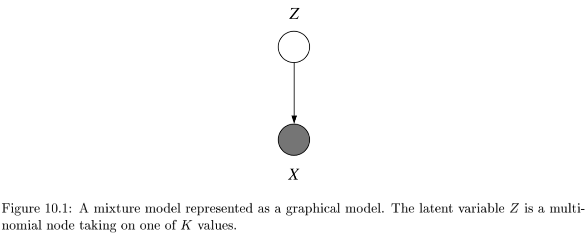
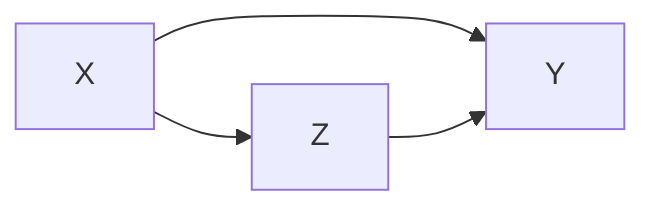

* TOC
{:toc}

# overview

- labels are not given
- intra-cluster distances are minimized, inter-cluster distances are maximized
- distance measures
  - symmetric D(A,B)=D(B,A)
  - self-similarity D(A,A)=0
  - positivity separation D(A,B)=0 iff A=B
  - triangular inequality D(A,B) <= D(A,C)+D(B,C)
  - ex. Minkowski Metrics $d(x,y)=\sqrt[r]{\sum \vert x_i-y_i\vert ^r}$
    - r=1 Manhattan distance
    - r=1 when y is binary -> Hamming distance
    - r=2 Euclidean
    - r=$\infty$ "sup" distance
- correlation coefficient - unit independent
- edit distance

# hierarchical

- two approaches:
    1. bottom-up agglomerative clustering - starts with each object in separate cluster then joins
    2. top-down divisive - starts with 1 cluster then separates
- ex. starting with each item in its own cluster, find best pair to merge into a new cluster
    - repeatedly do this to make a tree (dendrogram)
- distances between clusters defined by *linkage function*
  - single-link - closest members (long, skinny clusters)
  - complete-link - furthest members  (tight clusters)
  - average - most widely used
- ex. MST - keep linking shortest link
- *ultrametric distance* - tighter than triangle inequality
    - $d(x, y) \leq \max[d(x,z), d(y,z)]$

# partitional

- partition n objects into a set of K clusters (must be specified)
- globally optimal: exhaustively enumerate all partitions
- minimize sum of squared distances from cluster centroid
- evaluation w/ labels - purity - ratio between dominant class in cluster and size of cluster
- k-means++ - better at not getting stuck in local minima
  - randomly move centers apart
- Complexity: $O(n^2p)$ for first iteration and then can only get worse

# clustering (j 10)

- *latent vars* - values not specified in the observed data
- 
  

- *K-Means*
  - start with random centers
  - E: assign everything to nearest center: $O(\|\text{clusters}\|*np) $
  - M: recompute centers $O(np)$ and repeat until nothing changes
  - partition amounts to Voronoi diagram
  - can be viewed as minimizing *distortion measure* $J=\sum_n \sum_i z_n^i ||x_n - \mu_i||^2$
- *GMMs*: $p(x|\theta) = \underset{i}{\Sigma} \pi_i \mathcal{N}(x|\mu_i, \Sigma_i)$

  - $l(\theta|x) = \sum_n \log \: p(x_n|\theta) \\ = \sum_n \log \sum_i \pi_i \mathcal{N}(x_n|\mu_i, \Sigma_i)$
  - hard to maximize bcause log acts on a sum

  - "soft" version of K-means - update means as weighted sums of data instead of just normal mean
  - sometimes initialize K-means w/ GMMs

## conditional mixture models - regression/classification (j 10)

- ex. 
- latent variable Z has multinomial distr.
  - *mixing proportions*: $P(Z^i=1|x, \xi)$
    - ex. $ \frac{e^{\xi_i^Tx}}{\sum_je^{\xi_j^Tx}}$
  - *mixture components*: $p(y|Z^i=1, x, \theta_i)$ ~ different choices
  - ex. mixture of linear regressions
    - $p(y| x, \theta) = \sum_i \underbrace{\pi_i (x, \xi)}_{\text{mixing prop.}} \cdot \underbrace{\mathcal{N}(y|\beta_i^Tx, \sigma_i^2)}_{\text{mixture comp.}}$
  - ex. mixtures of logistic regressions
    - $p(y|x, \theta_i) = \underbrace{\pi_i (x, \xi)}_{\text{mixing prop.}} \cdot \underbrace{\mu(\theta_i^Tx)^y\cdot[1-\mu(\theta_i^Tx)]^{1-y}}_{\text{mixture comp.}}$ where $\mu$ is the logistic function
- also, nonlinear optimization for this (including EM)

## spectral clustering

- use the spectrum (eigenvalues) of the similarity matrix (ie.e kernal matrix) of the data to perform dim. reduction before clustering in fewer dimensions

# generative models

- overview: https://blog.openai.com/generative-models/

## vaes

- just an autoencoder where the middle hidden layer is supposed to be unit gaussian
  - add a kl loss to measure how well it maches a unit gaussian
    - for calculation purposes, encoder actually produces means / vars of gaussians in hidden layer rather than the continuous values....
  - this kl loss is not too complicated...https://web.stanford.edu/class/cs294a/sparseAutoencoder.pdf
- generally less sharp than GANs
  - uses mse loss instead of gan loss...
  - intuition: vaes put mass between modes while GANs push mass towards modes
- constraint forces the encoder to be very efficient, creating information-rich latent variables. This improves generalization, so latent variables that we either randomly generated, or we got from encoding non-training images, will produce a nicer result when decoded.

## gans

- train network to be loss function

## autoregressive models

- model input based on input