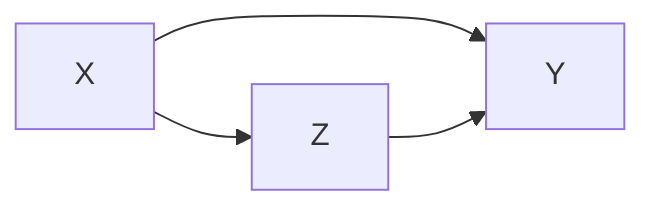

* TOC
{:toc}
# clustering

- labels are not given
- intra-cluster distances are minimized, inter-cluster distances are maximized
- distance measures
  - symmetric D(A,B)=D(B,A)
  - self-similarity D(A,A)=0
  - positivity separation D(A,B)=0 iff A=B
  - triangular inequality D(A,B) <= D(A,C)+D(B,C)
  - ex. Minkowski Metrics $d(x,y)=\sqrt[r]{\sum \vert x_i-y_i\vert ^r}$
    - r=1 Manhattan distance
    - r=1 when y is binary -> Hamming distance
    - r=2 Euclidean
    - r=$\infty$ "sup" distance
- correlation coefficient - unit independent
- edit distance

## hierarchical

- two approaches:
    1. bottom-up agglomerative clustering - starts with each object in separate cluster then joins
    2. top-down divisive - starts with 1 cluster then separates
- ex. starting with each item in its own cluster, find best pair to merge into a new cluster
    - repeatedly do this to make a tree (dendrogram)
- distances between clusters defined by *linkage function*
  - single-link - closest members (long, skinny clusters)
  - complete-link - furthest members  (tight clusters)
  - average - most widely used
- ex. MST - keep linking shortest link
- *ultrametric distance* - tighter than triangle inequality
    - $d(x, y) \leq \max[d(x,z), d(y,z)]$

## partitional

- partition n objects into a set of K clusters (must be specified)
- globally optimal: exhaustively enumerate all partitions
- minimize sum of squared distances from cluster centroid
- evaluation w/ labels - purity - ratio between dominant class in cluster and size of cluster
- k-means++ - better at not getting stuck in local minima
  - randomly move centers apart
- Complexity: $O(n^2p)$ for first iteration and then can only get worse

## statistical clustering (j 10)

- *latent vars* - values not specified in the observed data
- 
  

- *K-Means*
  - start with random centers
  - E: assign everything to nearest center: $O(\|\text{clusters}\|*np) $
  - M: recompute centers $O(np)$ and repeat until nothing changes
  - partition amounts to Voronoi diagram
  - can be viewed as minimizing *distortion measure* $J=\sum_n \sum_i z_n^i ||x_n - \mu_i||^2$
- *GMMs*: $p(x|\theta) = \underset{i}{\Sigma} \pi_i \mathcal{N}(x|\mu_i, \Sigma_i)$

  - $l(\theta|x) = \sum_n \log \: p(x_n|\theta) \\ = \sum_n \log \sum_i \pi_i \mathcal{N}(x_n|\mu_i, \Sigma_i)$
  - hard to maximize bcause log acts on a sum

  - "soft" version of K-means - update means as weighted sums of data instead of just normal mean
  - sometimes initialize K-means w/ GMMs

## conditional mixture models - regression/classification (j 10)



- ex. 
- latent variable Z has multinomial distr.
  - *mixing proportions*: $P(Z^i=1|x, \xi)$
    - ex. $ \frac{e^{\xi_i^Tx}}{\sum_je^{\xi_j^Tx}}$
  - *mixture components*: $p(y|Z^i=1, x, \theta_i)$ ~ different choices
  - ex. mixture of linear regressions
    - $p(y| x, \theta) = \sum_i \underbrace{\pi_i (x, \xi)}_{\text{mixing prop.}} \cdot \underbrace{\mathcal{N}(y|\beta_i^Tx, \sigma_i^2)}_{\text{mixture comp.}}$
  - ex. mixtures of logistic regressions
    - $p(y|x, \theta_i) = \underbrace{\pi_i (x, \xi)}_{\text{mixing prop.}} \cdot \underbrace{\mu(\theta_i^Tx)^y\cdot[1-\mu(\theta_i^Tx)]^{1-y}}_{\text{mixture comp.}}$ where $\mu$ is the logistic function
- also, nonlinear optimization for this (including EM)

## spectral clustering

- use the spectrum (eigenvalues) of the similarity matrix (ie.e kernal matrix) of the data to perform dim. reduction before clustering in fewer dimensions


# dim reduction

| Method              | Analysis objective | Temporal smoothing | Explicit noise model |
|---------------------|--------------------|--------------------|----------------------|
| PCA                 | Covariance         | No                 | No                   |
| FA                  | Covariance         | No                 | Yes                  |
| LDS/GPFA            | Dynamics           | Yes                | Yes                  |
| NLDS                | Dynamics           | Yes                | Yes                  |
| LDA                 | Classification     | No                 | No                   |
| Demixed             | Regression         | No                 | Yes/No               |
| Isomap/LLE          | Manifold discovery | No                 | No                   |
| T-SNE               | ....               | ....               | ...                  |
| UMAP                | ...                | ...                | ...                  |
| NMF                 | ...                | ...                | ...                  |
| SVCCA?              |                    |                    |                      |
| diffusion embedding |                    |                    |                      |
| ICA                 |                    |                    |                      |
| K-means             |                    |                    |                      |
| Autoencoders        |                    |                    |
| VAEs        |                    |                    |

## linear decompositions: learn D s.t. $X=DA$

- PCA - orthogonality
  - compress data, remove correlations
- FA (factor analysis) - like PCA but with errors, not biased by variance
- NMF - $min_{D \geq 0, A \geq 0} \|\|X-DA\|\|_F^2$
  - SEQNMF
- ICA
  - remove correlations and higher order dependence
  - all components are equally important
  - like PCA, but instead of the dot product between components being 0, the mutual info between components is 0
  - goals
    - minimizes statistical dependence between its components
    - maximize information transferred in a network of non-linear units
    - uses information theoretic unsupervised learning rules for neural networks
  - problem - doesn't rank features for us
- LDA/QDA - finds basis that separates classes
  - reduced to axes which separate classes (perpendicular to the boundaries)
- K-means - can be viewed as a linear decomposition
- dynamics
  - LDS/GPFA
  - NLDS
- *spectral* clustering - does dim reduction on eigenvalues (spectrum) of similarity matrix before clustering in few dims
  - uses adjacency matrix
  - basically like PCA then k-means
  - performs better with regularization - add small constant to the adjacency matrix

### more on pca
- want new set of axes (linearly combine original axes) in the direction of greatest variability
    - this is best for visualization, reduction, classification, noise reduction
    - assume $X$ (nxp) has zero mean

- derivation: 

    - minimize variance of X projection onto a unit vector v
      - $\frac{1}{n} \sum (x_i^Tv)^2 = \frac{1}{n}v^TX^TXv$ subject to $v^T v=1$
      - $\implies v^T(X^TXv-\lambda v)=0$: solution is achieved when $v$ is eigenvector corresponding to largest eigenvalue
    - like minimizing perpendicular distance between data points and subspace onto which we project

- SVD: let $U D V^T = SVD(Cov(X))$

    - $Cov(X) = \frac{1}{n}X^TX$, where X has been demeaned

- equivalently, eigenvalue decomposition of covariance matrix $\Sigma = X^TX$
  - each eigenvalue represents prop. of explained variance: $\sum \lambda_i = tr(\Sigma) = \sum Var(X_i)$

  - *screeplot*  - eigenvalues in decreasing order, look for num dims with kink
    - don't automatically center/normalize, especially for positive data

- SVD is easier to solve than eigenvalue decomposition, can also solve other ways
  1. multidimensional scaling (MDS)
    - based on eigenvalue decomposition
  2. adaptive PCA
    - extract components sequentially, starting with highest variance so you don't have to extract them all	

- good PCA code: http://cs231n.github.io/neural-networks-2/
```python
X -= np.mean(X, axis = 0) # zero-center data (nxd)
cov = np.dot(X.T, X) / X.shape[0] # get cov. matrix (dxd)
U, D, V = np.linalg.svd(cov) # compute svd, (all dxd)
Xrot_reduced = np.dot(X, U[:, :2]) # project onto first 2 dimensions (n x 2)
```
- nonlinear pca
    - usually uses an auto-associative neural network

## dictionary learning (not really dim reduction)

goal: $X \approx W D $, during training simultaneously learn $W$ (coefficients) and $D$ (dictionary and at test time use $D$ and learn $w$

- **nmf**: $W, D \geq 0$ elementwise
- **sparse coding**: want W to be sparse, D to not be too large
  - impose norm D not too big
- topic modeling - similar, try to discover topics in a model (which maybe can be linearly combined to produce the original document)
  - ex. LDA - generative model: posits that each document is a mixture of a **small number of topics** and that **each word's presence is attributable to one of the document's topics**

## toplogical

- **multidimensional scaling (MDS)**
  - given a a distance matrix, MDS tries to recover low-dim coordinates s.t. distances are preserved
  - minimizes goodness-of-fit measure called *stress* = $\sqrt{\sum (d_{ij} - \hat{d}_{ij})^2 / \sum d_{ij}^2}$
  - visualize in low dims the similarity between individial points in high-dim dataset
  - classical MDS assumes Euclidean distances and uses eigenvalues
    - constructing configuration of n points using distances between n objects
    - uses distance matrix
      - $d_{rr} = 0$
      - $d_{rs} \geq 0$
    - solns are invariant to translation, rotation, relfection
    - solutions types
      1. non-metric methods - use rank orders of distances
         - invariant to uniform expansion / contraction
      2. metric methods - use values
    - D is *Euclidean* if there exists points s.t. D gives interpoint Euclidean distances
      - define B = HAH
        - D Euclidean iff B is psd
- t-sne preserves pairwise neighbors
  - [t-sne tutorial](https://distill.pub/2016/misread-tsne/)
- UMAP: Uniform Manifold Approximation and Projection for Dimension Reduction

# generative models

- overview: https://blog.openai.com/generative-models/

## vaes

- [VAE tutorial](https://jaan.io/what-is-variational-autoencoder-vae-tutorial/)
- [beta-vae](https://openreview.net/references/pdf?id=Sy2fzU9gl) - adjustable hyperparameter $\beta$ that balances latent channel capacity and independence constraints with reconstruction accuracy.
- just an autoencoder where the middle hidden layer is supposed to be unit gaussian
  - add a kl loss to measure how well it maches a unit gaussian
    - for calculation purposes, encoder actually produces means / vars of gaussians in hidden layer rather than the continuous values....
  - this kl loss is not too complicated...https://web.stanford.edu/class/cs294a/sparseAutoencoder.pdf
- generally less sharp than GANs
  - uses mse loss instead of gan loss...
  - intuition: vaes put mass between modes while GANs push mass towards modes
- constraint forces the encoder to be very efficient, creating information-rich latent variables. This improves generalization, so latent variables that we either randomly generated, or we got from encoding non-training images, will produce a nicer result when decoded.

## gans

- train network to be loss function

## autoregressive models

- model input based on input