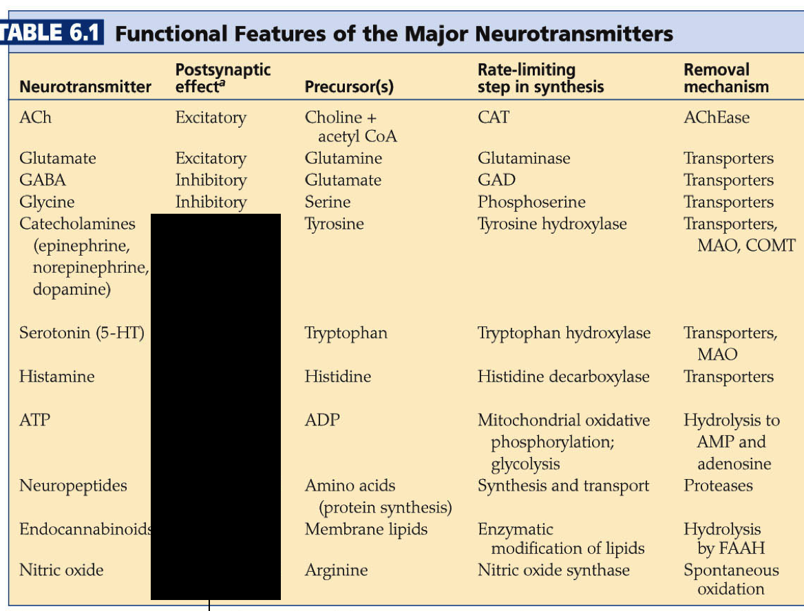
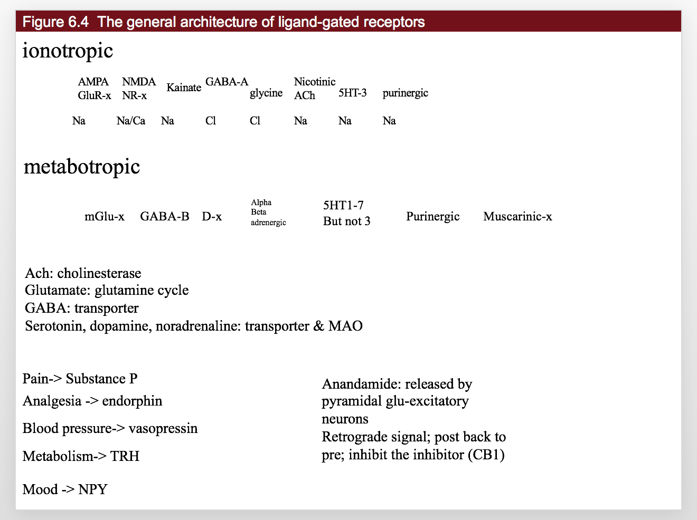
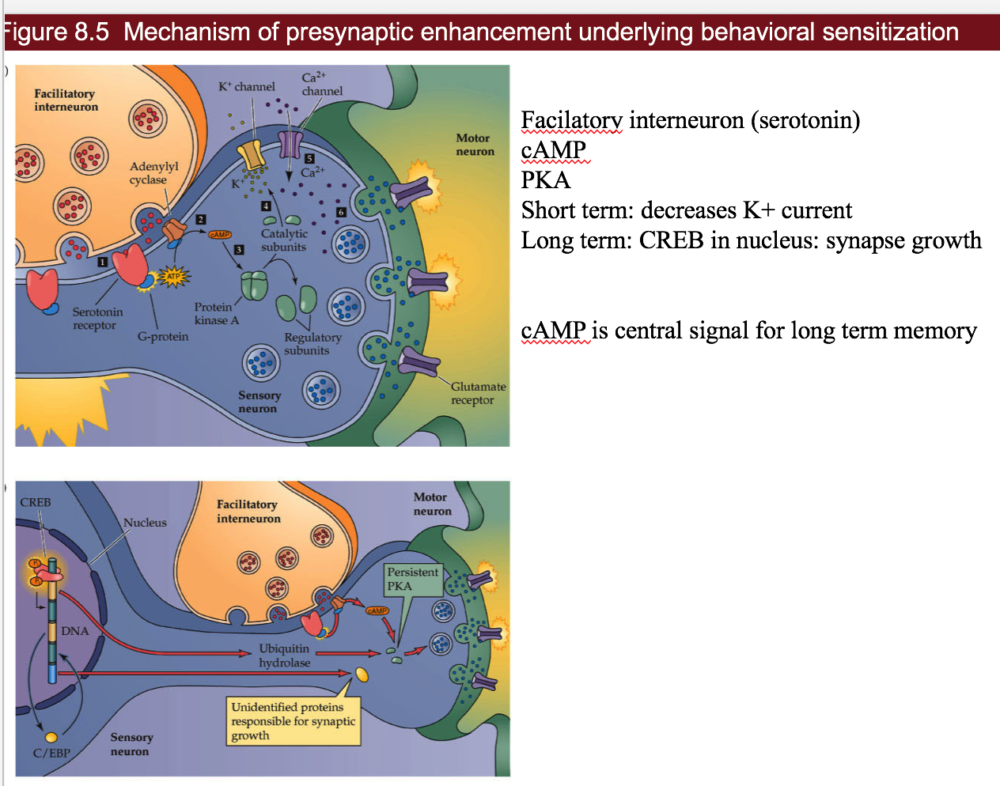

* TOC
{:toc}

# delineations

- 3 things
  - cortex
  - limbic system
    - **thalamus** (has pulvinar), **basal ganglia**, hypothalamus, hippocampus, amygdala, ...
    - glands / hormones
  - brain stem
    - midbrain (has superior colliculus), pons, medulla
- cerebellum?? (has 60% of neurons)

# numbers

- human brain
  - 86 bil total
  - 16 bil in cortex - largest of anything (proportionally)
  - 15 tril synapses
  - 1 glial cell : 1 neuron
  - cooking allowed us to meet the energy requirements for this

# whole brain

- *Cerebrum* - The cerebrum is the largest portion of the brain, and contains tools which are responsible for most of the brain's function. It is divided into four sections: 
  - the temporal lobe
  - the occipital lobe
  - parietal lobe
  - frontal lobe.
  - The cerebrum is divided into a right and left hemisphere which are connected by axons that relay messages from one to the other. This matter is made of nerve cells which carry signals between the organ and the nerve cells which run through the body.
- *Frontal Lobe* - This lobe controls a several elements including creative thought, problem solving, intellect, judgment, behavior, attention, abstract thinking, physical reactions, muscle movements, coordinated movements, smell and personality.
- *Parietal Lobe* - this lobe focuses on comprehension. Visual functions, language, reading, internal stimuli, tactile sensation and sensory comprehension will be monitored here.
  - *Sensory Cortex* - The sensory cortex, located in the front portion of the parietal lobe, receives information relayed from the spinal cord regarding the position of various body parts and how they are moving. This middle area of the brain can also be used to relay information from the sense of touch, including pain or pressure which is affecting different portions of the body.
  - *Motor Cortex* - This helps the brain monitor and control movement throughout the body. It is located in the top, middle portion of the brain.
- Temporal Lobe: The temporal lobe controls visual and auditory memories. It includes areas that help manage some speech and hearing capabilities, behavioral elements, and language. It is located in the cerebral hemisphere.
  - Wernicke's Area- This portion of the temporal lobe is formed around the auditory cortex. While scientists have a limited understanding of the function of this area, it is known that it helps the body formulate or understand speech.
- Occipital Lobe: The optical lobe is located in the cerebral hemisphere in the back of the head. It helps to control vision.
  - Broca's Area- This area of the brain controls the facial neurons as well as the understanding of speech and language. It is located in the triangular and opercular section of the inferior frontal gyrus.
- Cerebellum
  - This is commonly referred to as "the little brain," and is considered to be older than the cerebrum on the evolutionary scale. The cerebellum controls essential body functions such as balance, posture and coordination, allowing humans to move properly and maintain their structure.
  - 60% of neurons

## thalamocortical system

- cortex has layers that are connected in columns through 5 layers
  - cotex has different types based on distributions of cells through layers (Brodmann map 1909 has 50ish areas)
- thalamus has lots of connections - gates what goes into cortex

## limbic system

- The limbic system contains glands which help relay emotions. Many hormonal responses that the body generates are initiated in this area. The limbic system includes the amygdala, hippocampus, hypothalamus and thalamus.
- Amygdala:The amygdala helps the body respond to emotions, memories and fear. It is a large portion of the telencephalon, located within the temporal lobe which can be seen from the surface of the brain. This visible bulge is known as the uncus.
- Hippocampus: This portion of the brain is used for learning memory, specifically converting temporary memories into permanent memories which can be stored within the brain. The hippocampus also helps people analyze and remember spatial relationships, allowing for accurate movements. This portion of the brain is located in the cerebral hemisphere.
- Hypothalamus:The hypothalamus region of the brain controls mood, thirst, hunger and temperature. It also contains glands which control the hormonal processes throughout the body.
- Thalamus:The Thalamus is located in the center of the brain. It helps to control the attention span, sensing pain and monitors input that moves in and out of the brain to keep track of the sensations the body is feeling.

## brain stem

- All basic life functions originate in the brain stem, including heartbeat, blood pressure and breathing. In humans, this area contains the medulla, midbrain and pons. This is commonly referred to as the simplest part of the brain, as most creatures on the evolutionary scale have some form of brain creation that resembles the brain stem. The brain stem consists of midbrain, pons and medulla.
- Midbrain:The midbrain, also known as the mesencephalon is made up of the tegmentum and tectum. These parts of the brain help regulate body movement, vision and hearing. The anterior portion of the midbrain contains the cerebral peduncle which contains the axons that transfer messages from the cerebral cortex down the brain stem, which allows voluntary motor function to take place.
- Pons: This portion of the metencephalon is located in the hindbrain, and links to the cerebellum to help with posture and movement. It interprets information that is used in sensory analysis or motor control. The pons also creates the level of consciousness necessary for sleep.
- Medulla: The medulla or medulla oblongata is an essential portion of the brain stem which maintains vital body functions such as the heart rate and breathing.

# 1 - introduction
- 
## genomics

- male Drosophila uses body position and environment to add rhythmic notes to song
  - female uses this to gauge male's brain
- *neural circuits* make up *neural systems*
- neural systems serve 3 general functions
  1. sensory systems
  2. motor systems
  3. associational systems - link the other two, higher order functions
- *gene* has coding DNA (*exons*) and regulatory DNA (*introns*)
- model organisms
  - cat - visual cortex
  - squid and sea slug had really large neurons
  - 4 species: worm C. elegans, Drosophila, zebrafish Danio rerio, mouse Mus musculus
    - complete genome is available for them
    - can try *homologous recombination* - splicing in new genes
- human genome has ~20k genes, ~14k expressed in brain, ~6k expressed only in brain
- single-gene mutations can cause diseases like microcephaly
- simulate brain as a computer
  - passive cabling equation
  - theoretical neuroscience
  - blue brain project
  - human brain project

## cellular components
- *neuron doctrine* by Ramon y Cajal / Sherrington replaces Golgi's *reticular theory*
  - Cajal uses Golgi's salt-staining method to show neurons are distinct
  - Sherrington finds synapses
  - there are rare *gap junctions* between neurons (where there are *electrical synapses*)
1. neurons
  - number of inputs reflects *convergence*
  - number of targets reflects *divergence*
  - *local circuit neurons* = *interneurons* - short axons
  - *projection neurons* - long axons
2. glial cells - support and regeneration
  - outnumber neurons 3:1
  - they are stem cells - can generate new glia
  - maintaining ion gradients, modulating nerve signals, modulating synaptic action, scaffolding, aiding recovery
  1. *astrocytes* - in CNS, maintain chemical environment, retain stem cell properties
  2. *oligodendrocytes* - in CNS, lay down myelin - in PNS, *Schwann cells* do this
  3. *microglial* cells - remove debris
  - glial stem cells - make more glia and sometimes neurons

## cellular diversity

- ~10^11 neurons, more glia
- histology - microscopic analysis of cells
- stains
  - Golgi stain - randomly stains only some neurons
  - Nissl stain - only stains cell bodies
  - Myelin stain - only stains myelin

## neural circuits

- *neuropil* - bundle of dendrites/axons/glia - where synaptic connectivity occurs
- *afferent* neuron - carries info toward the brain
- *efferent* neuron - carries info away
- *myotatic reflex* example - knee-jerk

## organization of the human nervous system
1. sensory systems
2. motor systems

3. *CNS*
  - brain
  - spinal cord
4. *PNS*
  - sensory neurons 
  - *somatic* motor division - connect CNS to skeletal muscles
  - *autonomic* or *visceral* motor division - innervate muscles / glands
    - *autonomic ganglia* - peripheral motor neurons that take inputs from brainstem / spinal cord
    - *enteric system* - small ganglia / neurons in gut that influence gastric motility and secretion
    - *sympathetic* division - ganglia lie near the vertebral column and sent their axons to a variety of targets
    - *parasympathetic* division - ganglia are found near organs they innervate
- groupings
  - *ganglia* - accumulations of cell bodies / supporting cells
  - *nerve* - bundles of axons in PNS
  - *tract* - bundles of CNS axons
    - if they cross the brain midline called *commisures*
  - *nuclei* - local accumulations of similar neurons
  - *cortex* - sheet-like arrays of neurons
  - *gray matter* - has more cell bodies
  - *white matter* - has more axons

## neural systems
1. unity of function - divide things into different systems - ex. visual
2. representation of information - ex. vision can be *topographic map*, taste can be *computational map*
3. subdivision into subsystems - ex. vision has color, form, motion, all in parallel

## structural analysis
- often-used *lesion studies*
- *anterograde* - source to termination
- vs *retrograde* - terminus to source

## functional analysis of neural systems
1. *electrophysiological recording* - uses electrodes, neuron-level
  - can determine *receptive field* - region in sensory space where a specific stimulus elicits a spike
2. *functional brain imaging* - noninvasive, records local activity
  - computerized tomography (CT), magnetic resonance imaging (MRI), diffusion tensor imaging (DTI), PET, SPECT, fMRI, MEG, MSI

## analyzing complex behavior
- *cognitive neuroscience* - understanding higher-order functions
- *neuroethology* - complex behaviors of animals

# 2 - electrical signals of nerve cells
- *microelectrode* - fine glass tubing filled with good conductor
- all cells have a voltage difference across them
  - assume resting potential - we'll use -58 mV
  - *depolarized* - less negative - we'll use +58 mV
- potentials
  1. *receptor potential* - (small) due to the activation of sensory neurons by external stimuli
    - at terminal of dendrite
    - *graded* - depends on how strong the input is
  2. *synaptic potential* - (small) caused by activation of synapse
    - at middle of dendrite
  3. *action potential* - cause by the other 2
    - at the axon
- *active transporters* create differences in concentrations of specific ions - battery
- cells can be depolarized by adding too much K+ outside
- *ion channels* - make membranes selectively permeable - wires
- ions
  - outside: high Na, Cl; low K
  - generally 10:1 ratio between inside, outside
  - inside of cell has a bunch of negative proteins to balance chlorine
  - ions want to spread out because of entropy (then they factor in charge difference)
- $V_{ion} = 58/z * log(X_{out} / X_{in}) $
  - calculate for each ion, if able to move
  - z is charge on ion
  - for potassium: 58/1 * log(.1) = -58mV
  - Cl Nernst potential is actually -70 mV (even though we assumed -58 before)
  - Cl works as an inhibitor - ex. alcohol lets chloride in
  - whichever ion leaks, this determines the membrane potential
- hodgkin-huxley
  - large squid escape neurons
  - adding K+ outside depolarizes the cell
  - adding Na+ outside raises height of spike

# 3 - voltage-dependent membranes
- voltage clamp - one electrode outside, one inside
  - measured with reference to outside (usually more negative inside)
  - keeps voltage constant
  - current clamp - keeps current constant
- current clamp - just measures the voltage without interfering
- patch-clamp - suction part of cell into pipette
- passive properties
  - current injection: $V_t = V_{\infty} (1-e^{-t/ \tau})$
  - voltage decay: $V_t = V_{\infty} e^{-t / \tau}$
- block Na+ current with tetrodotoxin
- block K+ current with tetraethyl-ammonium
- *refractory period* is because Na needs to stop being inactivated
  - Na+ is *transient*, K+ is not
- *myelin* insulates sections - less ion loss
  - called *saltatory conduction*
  - faster and more efficient
  - concentrates action potential to nodes
  - without myelin, 10 m/s with myelin, 100 m/s
  - deals with JAM receptor system
  - umyelinated can be ok
    - might want to regenerate
    - don't care about speed
  - PNS
    - Schwann cells
    - loss - Guillan-barre syndrome
  - CNS
    - oligodendrocytes
    - loss - multiple sclerosis (MS)

# 4 - ion channel transporters
- patch electrode - pull a piece of membrane out 
  1. cell-attached - don't break membrane
  2. whole-cell - break membrane
  3. inside-out - inside of membrane is outside electrode
    4. outside-out - outside of membrane is outside electrode	- this method is always preferred
    - tetrodotoxin binds to outside of cell membrane
- some channels are delayed
- self-inactivating = *transient* - channels turn off by themselves

  - take 10-20 ms
- voltage-gated channels

  - Na+, K+, Ca, Cl
- frog Xenopus Ooctyes ion channels are studied
- TRP channels gated by mechanical / heat
- 4 K+ channels
  1. delayed rectifier
  2. fast acting - shapes AP, used for hearing
  3. late phase - slow ending, makes AP fire again
  4. inward rectifier - open at resting potential - establishes membrane potential
- mitten model - protein rotates around
- human genes: 10 Na, 10 Ca, 100K, ~5 Cl

  - there are more types of potassium channels
- channel-opathies - diseases can be caused by altered ion channels
- ion transporters
  - ATPase Pumps
    - *Na+/K+ pump*
    - Ca pump
  - ion exchangers
  - Na+/K+ pump exchanges 3Na for 2K ions
    - 1/3 of body's energy
    - 2/3 of neuron's energy
    - brains use 20% of body's energy
    - Ouabain blocks this
  - SERT - Na transporter
    - co-transporter
- ligand-gated channels
  - respond to a chemical
  - usually allow Na, K, Cl to flow in and out

# 5 - synapses
## synapse types
1. electrical synapses
  - gap junction channels
  - ions flow through gap junction channels
  - presynaptic and postsynaptic cell are almost the same
  - delay is fast (.1 ms)
  - gap junction proteins have been showing up in diseases
  - simple organisms have these
2. chemical synapses
  - *bouton* - end of presynaptic dendrite
  - *spines* - start of postsynaptic dendrite
  - voltage-gated Ca comes in and causes vesicles to fuse with presynaptic membrane
  - neurotransmitter released
  - bind to ligand-gated channels which let ions flow through
    - if Cl flows into postsynaptic cell - inhibition
  - pumps get rid of neurotransmitters quickly

## neurotransmitter types
- released when Ca comes in due to depolarization
1. peptides
  - ex. oxytocin
  - require long Ca exposure
  - loaded into vesicles up by the cell body - can take days to get to bouton
  - neurotransmitter diffuses away - doesn't always have specific target
  - can spread to all neurons in the area (ex. substance P)
2. small & fast
  - glutamate, Ach, GABA
  - loaded into vesicles in bouton
  - presynaptic cell takes these back up

## discovery
- neurotransmitter lifecycle
  - synthesis -> receptors -> function -> removal
  - important that they are removed
  - 60 s to recycle
- Loewi's experiment showed that neurotransmitters can flow through solution to synchronize heart

## synaptic transmission
- *minis* = *MEPP* - not big enough to fire the neuron
  - you can treat a muscle as a post-synaptic junction
  - chatter from single vesicle release
  - *quantal basis of neurotransmitter release* - 1,2,3,etc because vesicles release as all-or-none
  - synapses / vesicles are all about the same size across different species
    - receptors receive these neurotransmitters differently
- each vesicle is covered with proteins
  - *SNAPs* on plasma membrane
  - *SNAREs* on vesicle
    - ex. *synaptobrevin*
    - botulinum toxin, tetanus toxin - block synaptobrevin - clip other proteins
    - render a vesicle inactive
  - they recognize each other and lock for *priming* - ready to release when Ca+ enters
- need to endocytose membrane to make more vesicles
  - endocytosis includes *clathrin* which curves the membrane
- can measure single ligand-gated channel by clamping it alone

# 6 - neurotransmitters
## receptors
- ionotropic

  | Name   | AMPA GluR-x 	| NMDA NR-x 	| Kainate	| GABA-A 	| glycine 	| Nicotinic Ach 	| 5HT-3     	| P2x purinergic 	|
  |--------|-------------	|-----------	|---------	|--------	|---------	|---------------	|-----------	|----------------	|
  | Abbrev | AMPA        	| NMDA      	| Kainate 	| GABA   	| Glycine 	| nACh          	| Serotonin 	| Purines        	|
  | Ion    | Na          	| Na/Ca     	| Na      	| Cl     	| Cl      	| Na            	| Na        	| Na             	|
- metabotropic

  | Name     | mGlu-x    	| GABA-B 	| D-x                 	| Alpha, beta, adrenergic 	| H-x                 	| 5HT1-7           	| Purinergic A or P 	| Ach Muscarinic-x 	|
  |----------|-----------	|--------	|---------------------	|-------------------------	|---------------------	|------------------	|-------------------	|------------------	|
  | Abbrev   | Glutamate 	| GABA_B 	| Dopamine            	| NE,Epi                  	| Histamine           	| Serotonin        	| Purines           	| Muscarinic       	|
  | Function |           	|        	| cocaine, ADHD drugs 	| antianxiety             	| unkown, probs sleep 	| 3 is ionotropic! 	|                   	| mushroom drugs   	|
- 
- 
## excitatory
1. *Acetylcholine* - excites muscle cells
  - receptors: nAch
  - Acetylcholinesterase breaks down Ach after it is released
  - neurotoxins (ex. Serin) break down Acetylcholinesterase so Ach stays and muscles stay on (nerve gases)
  - Myasthinia is when you develop antibodies against your own nAch receptors
  - you have trouble controlling your eyes
2. *Glutamate* - excites pyramidal cells
  - VGLUT pumps Glutamate into vesicles
  - EATT transports extracellular Glutamate into presynaptic terminal / nearby Glial cells
    - Glial cells convert glutamate to glutamine (inactivates) and glutamine is taken up by the presynaptic terminal
    - glutamate overload if you overload the inactivating pumps in the glial cells
  - glutamate receptors
    - AMPA - fast Na only
    - NMDA - slow, Na and Ca and also requires depolarization

## inhibitory
3. ,4. *GABA*/*glycine*
  - have simple transporters that move released GABA into presynaptic terminal / Glia
  - Ionotropic GABA receptors - depressants; shut down nervous system
    - can bind steroids like estrogen - different effects in men / women
    - alcohol binds to this, shuts things down
- immature neurons have high intracellular Cl - people don't know why

## neuromodulators
- lifecycle molecules
  - synthesis: L-Dopa, trytophan
  - reuptake: DAT, NET, SerT
  - breakdown: MAO
  - vesicular transport: VMAT
5. *catecholamines*
  - pathway: DOPA -> Dopamine -> Norepinephrine -> Epinephrine
  - dopamine - forming of memories
    - produced by substantia nigra
    - loss of these neurons -> Parkinson's
  - norepinephrine 
    - produced by locus coeruleus
6. *serotonin* = 5HT - happiness
  - Tryptophan -> serotonin
  - serotonin produced by Raphe nuclei
  - affected by LSD
7. *histamine* - not well-known
  - antihistamines can make you hallucinate
8. *atp* - sensitivity to pain
9. *neuropeptides* - slow
   - substance P - pain
   - alpha-endorphin - analgesia (block pain) 
     - vasopressin - blood pressure 
   - thyrotropin releasing hormone (TRH) - metabolism 
   - neuropeptide Y - mood/aggression 
10. *enndocannabinoids* - weed
  - ex. anandamide  - binds to CB1 (cannabanoid 1 receptor)
  - retrograde signal - post back to pre - inhibit the inhibitor
  - this increases the signal
11. *nitric oxide* - gas
   - binds to guanylyl cyclase

# 7 - molecular signaling
## localization
- chemical signaling mechanisms
  1. *synaptic* - local
    - ex. Ach
  2. *paracrine* - medium distance, neurotransmitter sprinkled and nearby targets take it up
    - ex. serotonin
  3. *endocrine* - get into your blood stream - body-wide signaling
    - ex. vasopressin
- amplification = enzyme
  - signal that activates enzyme amplifies signal
- cell-signaling molecules
  1. *cell-impermeant* molecules
    - need transmembrane receptors
    - ex. glutamate
  2. *cell-permeant* molecules (steroids)
    - can have intracellular receptors
  3. *signaling* molecules
    - adhesion molecules - like a lock and key - binds neurons together
- *spine* has small neck - hard for proteins to go through it
  - keeps information local
  - large raft of signaling molecules keeps info local

## celllular receptors
1. **ionotropic** - channel-linked receptors
  - neurotransmitter binds to a channel that opens
  - ex. Glu ionotropic receptor
  - signal is sodium coming in
2. *enzyme-linked* receptors
  - ex. TrkA NGF receptor - Tyrosine kinase
  - once it binds, it becomes an enzyme
3. **metabotropic** - G-protein-coupled receptors
  - ex. Glue metabotropic receptor
  - activate G-protein that then does something
  - these require energy for G-proteins
  1. Heterotrimeric G-proteins
    - G-protein has 3 subunits: - 
    1. Gs - binds norepinephrine
      - + cAMP
    2. Gq - binds glutamate
      - + DAG (diaglycerol) & IP3
    3. Gi - binds dopamine
      - inhibits cAMP
  2. Monomeric G-proteins
    - G-protein has just one subunit
    - ex. Ras
4. *intracellular* receptors
  - ex. estrogen receptors
  - activates intracellular transcription factors

## second messengers
- Ca must be pumped out of neuron or
- Ca can be stored into internal stores in ER
- Adenylyl cyclase turns ATP into cAMP -> PKA
- Guanylyl cyclase turns GTP into cGMP -> PKG
  - would use inside-out patch to study these
- Phospholipase C -> PKC -> IP3 lets Ca out of ER (usually kills cell)

## protein control
- kinases (on switch) add phosphate to protein and makes them active
  - PKA - cAMP binds then catalytic domain can bind
    - non-covalent so can diffuse into nucleus
  - CAM kinase
    - covalent
  - protein kinase C
     - covalent - very local to membrane
- phosphatases (off switch) remove phosphates

## long-term alteration
- long-term alteration requires epigenetic changes (change transcription factors)
- transcription factor *CREB* requires three things at once
  1. Ca comes in and binds Cam kinase
  2. activate Protein kinase A - this can stay in nucleus for a while
    - how much to make
  3. MAP kinase, ras
    - on/off switch
  - when all of these things come in at once - convergence signaling - CREB will make actin, AMPA receptors
  - 
- *TrkA* binds NGF (Nerve growth factor) - peptide and has 3 pathways:
  1. PI 3 kinase
  2. ras
  3. Phospholipase C
  - this displays divergence signaling
- cerebellar synapses 
  - mGlu inhibits AMPA with negative feedback
  - lets out Ca which depresses AMPA receptor
- signal scaling - tyrosine hydroxylase makes dopamine
  - more Ca in bouton activates more hydroxylase -> makes more dopamine
  - Ca comes in whenever fires
  - *use it or lose it*

  # 8 - synaptic plasticity
## short-term
- measured by firing neuron before muscle and recording response
  1. synaptic facilitation - frequency-dependent plasticity - fire faster, get bigger EPSPS
    - Ca comes in and persists during next pulse
    - ms time scale
  2. synaptic depression - transmitters are depleted
    - s time scale
  3. synaptic potentiation/augmentation - changes in presynaptic proteins
    - min time scale
- experiments
  - *habituation* - decrease vesicles on sensory neuron after too much stimuli
  - *sensitization* - associate two stimuli together: 
- mechanism
  - sensory neuron -> serotinergic neuromodulatary interneuon -> motor neuron
  - interneuron releases serotonin 
  - cAMP produced in sensory neuron
    -  long term - CREB in nucleus - synapse growth
    -  central signal for LTM
    -  activates PKA
  - short term - decreases K+ current
- sensory neuron doesn't learn, neuromuscular junction gets stronger
- mutant genes associated with cAMP identified
  - phosphodiesterase - if you remove this, too much cAMP
  - adenylate cyclase

## long-term
- HM lost his memory w/out hippocampus
  - site of LTP
  - at night memories are moved from hippocampus (flash drive) to cortex (long-term hard drive)
- Schaffer collateral pathway is one pathway in hippocampus (also perforant pathway, mossy fiber)
  - pre-stimulate with tetanus
  - later when stimulated EPSP is bigger
  - usually 20 ms between firing - LTP when multiple firing in less time
- Schaffer mechanism - NMDA receptor key to this
  - both AMPA and NMDA exist
  - NMDA -> Ca -> CAM kinase -> LTP
  - Mg blocks NMDA unless already depolarized
  - requires good timing!
- silent synapses 
  - short-term - more AMPA receptors, long-term new synapses
  - all synapses born with only NMDA
  - protein synthesis needed for LTP (mostly making more AMPA)
  - unclear how synapse decides whether to strengthen / make more synapses
- LTD - long-term depression is opposite of LTP - long-term potentiation
  - low levels of Ca lead to AMPA being endocytosed
  - mGlu -> PKC -> starts LTD
- epilepsy - neurons fire together and wire together