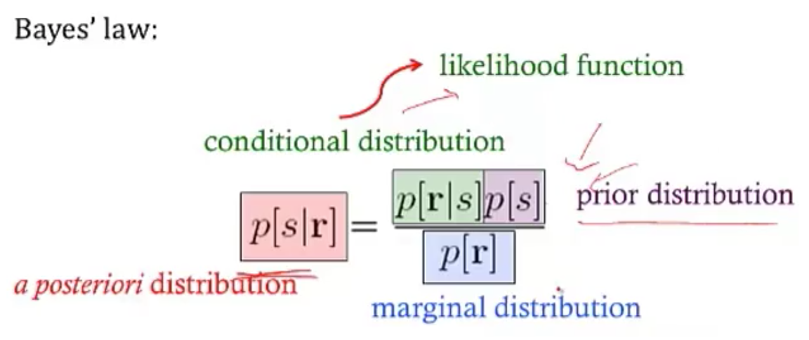

{:toc}

# introduction

## overview

- does biology have a cutoff level (likecutoffs in computers below which fluctuations don't matter)
- core principles underlying these two questions
  - how do brains work?
  - how do you build an intelligent machine?
- lacking: insight from neuro that can help build machine
- scales: cortex, column, neuron, synapses
- physics: theory and practice are much closer
- are there principles?
  - "god is a hacker" - francis crick
  - theorists are lazy - ramon y cajal
  - things seemed like mush but became more clear - horace barlow
  - principles of neural design book
- felleman & van essen 1991
  - ascending layers (e.g. v1-> v2): goes from superficial to deep layers
  - descending layers (e.g. v2 -> v1): deep layers to superficial
- **solari & stoner 2011 "cognitive consilience"** - layers thicknesses change in different parts of the brain
  - motor cortex has much smaller input (layer 4), since it is mostly output

## historical ai

- people: turing, von neumman, marvin minsky, mccarthy...
- ai: birth at 1956 conference
  - vision: marvin minsky thought it would be a summer project
- lighthill debate 1973 - was ai worth funding?
- intelligence tends to be developed by young children...
- cortex grew very rapidly

## historical cybernetics/nns

- people: norbert weiner, mcculloch & pitts, rosenblatt
- neuro
  - hubel & weisel (1962, 1965) simple, complex, hypercomplex cells
  - neocognitron fukushima 1980
  - david marr: theory, representation, implementation

## types of models

- three types
  1. *descriptive* brain model - encode / decode external stimuli
  2. *mechanistic* brian cell / network model - simulate the behavior of a single neuron / network
  3. *interpretive* (or normative) brain model - why do brain circuits operate how they do

- *receptive field* - the things that make a neuron fire
- retina has on-center / off-surround cells - stimulated by points
- then, V1 has differently shaped receptive fields
- *efficient coding hypothesis* - learns different combinations (e.g. lines) that can efficiently represent images
  
  1. sparse coding (Olshausen and Field 1996)
  2. ICA (Bell and Sejnowski 1997)
  3. Predictive Coding (Rao and Ballard 1999)
  - brain is trying to learn faithful and efficient representations of an animal's natural environment
    - same goes for auditory cortex

# biophysical models

## modeling neurons

- 
- nernst battery
  1. osmosis (for each ion)
  2. electrostatic forces (for each ion)
  - together these yield Nernst potential $E = \frac{k_B T}{zq} ln \frac{[in]}{[out]}$
    - T is temp
    - q is ionic charge
    - z is num charges
  - part of voltage is accounted for by nernst battery $V_{rest}$
  - yields $\tau \frac{dV}{dt} = -V + V_\infty$ where $\tau=R_mC_m=r_mc_m$
  - equivalently, $\tau_m \frac{dV}{dt} = -((V-E_L) - g_s(t)(V-E_s) r_m) + I_e R_m $
- 

## simplified model neurons

- *integrate-and-fire* neuron
  - passive membrane (neuron charges)
  - when V = V$_{thresh}$, a spike is fired
  - then V = V$_{reset}$
  - doesn't have good modeling near threshold
  - can include threshold by saying
    - when V = V$_{max}$, a spike is fired
    - then V = V$_{reset}$
- modeling multiple variables
  - also model a K current
  - can capture things like resonance
- *theta neuron* (Ermentrout and Kopell)
  - 
  - often used for periodically firing neurons (it fires spontaneously)

## a forest of dendrites

- cable theory - Kelvin
- voltage V is a function of both x and t
- 
- separate into sections that don't depend on x
  - coupling conductances link the sections (based on area of compartments / branching)
- Rall model for dendrites
  - if branches obey a certain branching ratio, can replace each pair of branches with a single cable segment with equivalent surface area and electrotonic length
    - $d_1^{3/2} = d_{11}^{3/2} + d_{12}^{3/2}$
- dendritic computation (London and Hausser 2005)
  - hippocampus - when inputs arrive at soma, similiar shape no matter where they come in = *synaptic scaling*
  - where inputs enter influences how they sum
  - dendrites can generate spikes (usually calcium) / backpropagating spikes
- ex. *Jeffress model*  - sound localized based on timing difference between ears
- ex. direction selectivity in retinal ganglion cells - if events arive at dendrite far -> close, all get to soma at same time and add

## circuit-modeling basics

- membrane has capacitance $C_m$
- force for diffusion, force for drift
- can write down diffeq for this, which yields an equilibrium
- $\tau = RC$
  - bigger $\tau$ is slower
  - to increase capacitance
    - could have larger diameter
    - $C_m \propto D$
  - axial resistance $R_A \propto 1/D^2$ (not same as membrane lerk), thus bigger axons actually charge faster

## action potentials

- channel/receptor types
  - ionotropic: $G_{ion}$ = f(molecules outside)
    - something binds and opens channel
  - metabotropic: $G_{ion}$ = f(molecules inside)
    - doesn't directly open a channel: indirect
  - others
    - photoreceptor
    - hair cell
  - voltage-gated (active - provide gain; might not require active ATP, other channels are all passive)

## physics of computation

- based on carver mead: drift and diffusion are at the heart of everything
- different things realted by the **Boltzmann distr.** (ex. distr of air molecules vs elevation. Subject to gravity and diffusion upwards since they're colliding)
  - nernst potential
  - current-voltage relation of voltage-gated channels
  - current-voltage relation of MOS transistor
- these things are all like transistor: energy barrier that must be overcome
- neuromorphic examples
  - differential pair sigmoid yields sigmoid-like function
    - can compute tanh function really simply to simulate
  - silicon retina
    - lateral inhibition exists (gap junctions in horizontal cells)
    - mead & mahowald 1989 - analog VLSI retina (center-surround receptive field is very low energy)
- computation requires energy (otherwise signals would dissipate)
  - von neumann architecture: CPU - bus (data / address) - Memory
    - moore's law ending (in terms of cost, clock speed, etc.)
      - ex. errors increase as device size decreases (and can't tolerate any errors)
  - neuromorphic computing
    - brain ~ 20 Watts
    - exploit intrinsic transistor physics (need extremely small amounts of current)
    - exploit electronics laws kirchoff's law, ohm's law
    - new materials (ex. memristor - 3d crossbar array)
    - can't just do biological mimicry - need to understand the principles

## spiking neurons

- passive membrane model was leaky integrator
- voltage-gaed channels were more complicated
- can be though of as leaky integrate-and-fire neuron (LIF)
  - this charges up and then fires a spike, has refractory period, then starts charging up again
- rate coding hypothesis - signal conveyed is the rate of spiking (bruno thinks this is usually too simple)
  - spiking irregulariy is largely due to noise and doesn't convey information
  - some neurons (e.g. neurons in LIP) might actually just convey a rate
- linear-nonlinear-poisson model (LNP) - sometimes called GLM (generalized linear model)
  - based on observation that variance in firing rate $\propto$ mean firing rate
    - plotting mean vs variance = 1 $\implies$ Poisson output
  - these led people to model firing rates as Poisson $\frac {\lambda^n e^{-\lambda}} {n!}$
  - bruno doesn't really believe the firing is random (just an effect of other things we can't measure)
  - ex. fly H1 neuron 1997
    - constant stimulus looks very Poisson
    - moving stimulus looks very Bernoulli
- spike timing hypothesis
  - spiece timing can be very precise in response to time-varying signals (mainen & sejnowski 1995; bair & koch 1996)
  - often see precise timing
- encoding: stimulus $\to$ spikes
- decoding: spikes $\to$ representation
- encoding + decoding are related through the joint distr. over simulus and repsonse (see Bialek spikes book)
  - nonlinear encoding function can yield linear decoding
  - able to directly decode spikes using a kernel to reproduce signal (seems to say you need spikes - rates would not be good enough)
    - some reactions happen too fast to average spikes (e.g. 30 ms)
  - estimating information rate: bits (usually better than snr - can calculate between them) - usually 2-3 bits/spike

# neural coding

## neural encoding

### defining neural code

- extracellular
  - fMRI
    - averaged over space
    - slow, requires seconds
  - EEG
    - noisy
    - averaged, but faster
  - multielectrode array
    - record from several individual neurons at once
  - calcium imaging
    - cells have calcium indicator that fluoresce when calcium enters a cell
- intracellular - can use patch electrodes
- raster plot
  - replay a movie many times and record from retinal ganglion cells during movie
- *encoding*: P(response \| stimulus)
  - *tuning curve* - neuron's response (ex. firing rate) as a function of stimulus
  - orientation / color selective cells are distributed in organized fashion
  - some neurons fire to a concept, like "Pamela Anderson"
  - retina (simple) -> V1 (orientations) -> V4 (combinations) -> ?
  - also massive feedback
- *decoding*: P(stimulus \| response)

### simple encoding

- want P(response \| stimulus)
  - response := firing rate r(t)
  - stimulus := s
- simple linear model

  - r(t) = c * s(t)
- *weighted linear model* - takes into account previous states weighted by f
  1. *temporal filtering*
    - r(t) = $f_0 \cdot s_0 + ... + f_t \cdot s_t =  \sum s_{t-k} f_k$ where f weights stimulus over time
    - could also make this an integral, yielding a convolution:
    - r(t) = $\int_{-\infty}^t d\tau \: s(t-\tau) f(\tau)$
    - a linear system can be thought of as a system that searches for portions of the signal that resemble its filter f
    - leaky integrator - sums its inputs with f decaying exponentially into the past
    - flaws
      - no negative firing rates
      - no extremely high firing rates
      - can add a nonlinear function g of the linear sum can fix this
        - r(t) = $g(\int_{-\infty}^t d\tau \: s(t-\tau) f(\tau))$
  2. *spatial filtering*
    - r(x,y) = $\sum_{x',y'} s_{x-x',y-y'} f_{x',y'}$ where f again is spatial weights that represent the spatial field
    - could also write this as a convolution
    - for a retinal center surround cell, f is positive for small $\Delta x$ and then negative for large $\Delta x$
      - can be calculated as a narrow, large positive Gaussian + spread out negative Gaussian
  - can combine above to make *spatiotemporal filtering*
    - filtering = convolution = projection

### feature selection

- P(response\|stimulus) is very hard to get
  - stimulus can be high-dimensional (e.g. video)
  - stimulus can take on many values
  - need to keep track of stimulus over time
  - solution: sample P(response\|s) to many stimuli to characterize what in input triggers responses
- find vector *f* that captures features that lead to spike
  - dimensionality reduction - ex. discretize 
  - value at each time $t_i$ is new dimension
  - commonly use Gaussian white noise
  - time step sets cutoff of highest frequency present
  - *prior distribution* - distribution of stimulus
    - multivariate Gaussian - Gaussian in any dimension, or any linear combination of dimensions
  - look at where spike-triggering points are and calculate *spike-triggered average* *f* of features that led to spike
    - use this f as filter
- determining the nonlinear input/output function *g*
  - replace stimulus in P(spike\|stimulus) with P(spike\|$s_1$), where s1 is our filtered stimulus
    - use bayes rule $g=P(spike\|s_1)=\frac{P(s_1\|spike)P(spike)}{P(s_1)}$
    - if $P(s_1\|spike) \approx P(s_1)$ then response doesn't seem to have to do with stimulus
- incorporating many features *$f_1,...,f_n$*
  - here, each $f_i$ is a vector of weights
  - $r(t) = g(f_1\cdot s,f_2 \cdot s,...,f_n \cdot s)$
  - could use *PCA* - discovers low-dimensional structure in high-dimensional data
  - each f represents a feature (maybe a curve over time) that fires the neuron

### variability

- hidden assumptions about time-varying firing rate and single spikes

  - smooth function RFT can miss some stimuli
- statistics of stimulus can effect P(spike\|stimulus)

  - Gaussian white noise is nice because no way to filter it to get structure
- identifying good filter
  - want $P(s_f\|spike)$ to differ from $P(s_f)$ where $s_f$ is calculated via the filter
  - instead of PCA, could look for f that directly maximizes this difference (Sharpee & Bialek, 2004)
  - *Kullback-Leibler divergence* - calculates difference between 2 distributions
    - $D_{KL}(P(s),Q(s)) = \int ds P(s) log_2 P(s) / Q(s)$
  - maximizing KL divergence is equivalent to maximizing mutual info between spike and stimulus
    - this is because we are looking for most informative feature
    - this technique doesn't require that our stimulus is white noise, so can use natural stimuli
    - maximization isn't guaranteed to uniquely converge
- modeling the noise
  - need to go from r(t) -> spike times
  - divide time T into n bins with p = probability of firing per bin
  - over some chunk T, number of spikes follows binomial distribution (n, p)
    - mean = np
    - var = np(1-p)
  - if n gets very large, binomial approximates Poisson
    - $\lambda$ = spikes in some set time
      - mean = $\lambda$
      - var = $\lambda$
    1. can test if distr is Poisson with *Fano factor*=mean/var=1
      2. interspike intervals have exponential distribution	- if fires a lot, this can be bad assumption (due to refractory period)
- generalized linear model adds explicit spike-generation / post-spike filter (Pillow et al. 2008)
  - 
  - post-spike filter models refractory period
  - *Paninski* showed that using exponential nonlinearity allows this to be optimized
  - could add in firing of other neurons
  - *time-rescaling theorem* - tests how well we have captured influences on spiking (Brown et al 2001)
    - scaled ISIs ($t_{i-1}-t_i$) r(t) should be exponential

## neural decoding

### neural decoding and signal detection

- decoding: P(stimulus \| response) - ex. you hear noise and want to tell what it is
  - here r = response = firing rate
- monkey is trained to move eyes in same direction as dot pattern (Britten et al. 92)
  - when dots all move in same direction (100% coherence), easy
    - neuron recorded in MT - tracks dots
    - count firing rate when monkey tracks in right direction
    - count firing rate when  monkey tracks in wrong direction
    - as coherence decreases, these firing rates blur
  - need to get P(+ or - \| r)
    - can set a threshold on r by maximizing likelihood
      - P(r\|+) and P(r\|-) are likelihoods
    - *Neyman-Pearson lemma* - likelihood ratio test is the most efficient statistic, in that is has the most power for a given size
      - $\frac{p(r\|+)}{p(r\|-)} > 1?$
- accumulated evidence - we can accumulate evidence over time by multiplying these probabilities
  - instead we take sum the logs, and compare to 0
  - $\sum_i ln \frac{p(r_i\|+)}{p(r_i\|-)} > 0?$
  - once we hit some threshold for this sum, we can make a decision + or -
- experimental evidence (Kiani, Hanks, & Shadlen, Nat. Neurosci 2006)
  - monkey is making decision about whether dots are moving left/right
  - neuron firing rates increase over time, representing integrated evidence
  - neuron always seems to stop at same firing rate
- priors - ex. tiger is much less likely then breeze
  - scale P(+\|r) by prior P(+)
  - neuroscience ex. photoreceptor cells P(noise\|r) is much larger than P(signal\|r)
    - therefore threshold on r is high to minimize total mistakes
- cost of acting/not acting
  - loss for predicting + when it is -: $L_- \cdot P[+\|r]$
  - loss for predicting - when it is +: $L_+ \cdot P[-\|r]$
  - cut your losses: answer + when average Loss$_+$ < Loss$_-$
    - i.e. $L_+ \cdot P[-\|r]$ < $L_- \cdot P[+\|r]$
  - rewriting with Baye's rule yields new test:
    - $\frac{p(r\|+)}{p(r\|-)}> L_+ \cdot P[-] / L_- \cdot P[+]$
    - here the loss term replaces the 1 in the Neyman-Pearson lemma

### population coding and bayesian estimation

- *population vector* - sums vectors for cells that point in different directions weighted by their firing rates
  - ex. cricket cercal cells sense wind in different directions
  - since neuron can't have negative firing rate, need overcomplete basis so that can record wind in both directions along an axis
  - can do the same thing for direction of arm movement in a neural prosthesis
  - not general - some neurons aren't tuned, are noisier
  - not *optimal* - making use of all information in the stimulus/response distributions
- *bayesian inference*
  - $p(s\|r) = \frac{p(r\|s)p(s)}{p( r)}$
  - 
  - maximum likelihood: s* which maximizes p(r\|s)
  - MAP = maximum $a\:posteriori$: s* which mazimizes p(s\|r)
- simple continuous stimulus example
  - setup
    - s - orientation of an edge
    - each neuron's average firing rate=tuning curve $f_a(s)$ is Gaussian (in s)
    - let $r_a$ be number of spikes for neuron a
    - assume receptive fields of neurons span s: $\sum r_a (s)$ is const
    - 
  - solving
    - maximizing log-likelihood with respect to s			- take derivative and set to 0
      - soln $s^* = \frac{\sum r_a s_a / \sigma_a^2}{\sum r_a / \sigma_a^2}$
      - if all the $\sigma$ are same, $s^* = \frac{\sum r_a s_a}{\sum r_a}$
        - this is the population vector
    - maximum *a posteriori*
      - $ln \: p(s\|r) = ln \: P(r\|s) + ln \: p(s) = ln \: P(r )$
      - $s^* = \frac{T \sum r_a s_a / \sigma^2_a + s_{prior} / \sigma^2_{prior}}{T \sum r_a / \sigma^2_a + 1/\sigma^2_{prior}}$
      - this takes into account the prior
        - narrow prior makes it matter more
    - doesn't incorporate correlations in the population

### stimulus reconstruction

- decoding s -> $s^*$
- want an estimator $s_{Bayes}=s_B$ given some response r
  - error function $L(s,s_{B})=(s-s_{B})^2$
  - minimize $\int ds \: L(s,s_{B}) \: p(s\|r)$ by taking derivative with respect to $s_B$
  - $s_B = \int ds \: p(s\|r) \: s$ - the conditional mean (spike-triggered average)
- add in spike-triggered average at each spike
  - if spike-triggered average looks exponential, can never have smooth downwards stimulus
  - could use 2 neurons (like in H1) and replay the second with negative sign
- LGN neurons can reconstruct a video, but with noise
- recreated 1 sec long movies - (*Jack Gallant* - Nishimoto et al. 2011, Current Biology)
  1. voxel-based encoding model samples ton of prior clips and predicts signal
    - get p(r\|s)
    - pick best p(r\|s) by comparing predicted signal to actual signal
    - input is filtered to extract certain features
    - filtered again to account for slow timescale of BOLD signal
  2. decoding
    - maximize p(s\|r) by maximizing p(r\|s) p(s), and assume p(s) uniform
    - 30 signals that have highest match to predicted signal are averaged 
    - yields pretty good pictures

## information theory

### information and entropy

- surprise for seeing a spike h(p) = $-log_2 (p)$
- entropy = average information
- code might not align spikes with what we are encoding
- how much of the variability in r is encoding s
  - define q as en error
    - $P(r_+\|s=+)=1-q$
    - $P(r_-\|s=+)=q$
    - similar for when s=-
  - total entropy: $H(R ) = - P(r_+) log P(r_+) - P(r_-)log P(r_-)$
  - noise entropy: $H(R\|S=+) = -q log q - (1-q) log (1-q)$
  - mutual info I(S;R) = $H(R ) - H(R\|S) $ = total entropy - average noise entropy
    - = $D_{KL} (P(R,S), P(R )P(S))$
- *grandma's famous mutual info recipe*
  - for each s
    - P(R\|s) - take one stimulus and repeat many times (or run for a long time)
    - H(R\|s) - noise entropy
  - $H(R\|S)=\sum_s P(s) H(R\|s)$
  - $H(R ) $ calculated using $P(R ) = \sum_s P(s) P(R\|s)$

### information in spike trains

1. information in spike patterns
  - divide pattern into time bins of 0 (no spike) and 1 (spike)
  - binary words w with letter size $\Delta t$, length T (Reinagel & Reid 2000)
    - can create histogram of each word
    - can calculate entropy of word 
  - look at distribution of words for just one stimulus
    - distribution should be narrower
  - calculate $H_{noise}$ - average over time with random stimuli and calculate entropy
    - varied parameters of word: length of bin (dt) and length of word (T)
    - there's some limit to dt at which information stops increasing
      - this represents temporal resolution at which jitter doesn't stop response from identifying info about the stimulus
    - corrections for finite sample size (Panzeri, Nemenman,...)
2. information in single spikes - how much info does single spike tell us about stimulus
  - don't have to know encoding, mutual info doesn't care
  1. calculate entropy for random stimulus
    - $p=\bar{r} \Delta t$ where $\bar{r}$ is the mean firing rate
  2. calculate entropy for specific stimulus
  - let $P(r=1\|s) = r(t) \Delta t$
  - let $P(r=0\|s) = 1 - r(t) \Delta t$
  - get r(t) by having simulus on for long time
  - *ergodicity* - a time average is equivalent to averging over the s ensemble
  - 
  - info per spike $I(r,s) = \frac{1}{T} \int_0^T dt \frac{r(t)}{\bar{r}} log \frac{r(t)}{\bar{r}}$
    - timing precision reduces r(t)
    - low mean spike rate -> high info per spike
  - ex. rat runs through place field and only fires when it's in place field
    - spikes can be sharper, more / less frequent

### coding principles

- natural stimuli
  - huge dynamic range - variations over many orders of magnitude (ex. brightness)
  - power law scaling - structure at many scales (ex. far away things)
- *efficient coding* - in order to have maximum entropy output, a good encoder should match its outputs to the distribution of its inputs
  - want to use each of our "symbols" (ex. different firing rates) equally often
  - should assign equal areas of input stimulus PDF to each symbol
- adaptataion to stimulus statistics
  - 
  - feature adaptation (Atick and Redlich)
    - spatial filtering properties in retina / LGN change with varying light levels
    - at low light levels surround becomes weaker
- coding sechemes
  1. redundancy reduction
    - population code $P(R_1,R_2)$
    - entropy $H(R_1,R_2) \leq H(R_1) + H(R_2)$ - being independent would maximize entropy
  2. correlations can be good
    - error correction and robust coding
    - correlations can help discrimination
    - retina neurons are redundant (Berry, Chichilnisky)
  3. more recently, sparse coding
    - penalize weights of basis functions
    - instead, we get localized features
- we ignored the behavioral feedback loop

# computing with networks

## modeling connections between neurons

- model effects of synapse by using synaptic conductance $g_s$ with reversal potential $E_s$
  - $g_s = g_{s,max} \cdot P_{rel} \cdot P_s$
    - $P_{rel}$ - probability of release given an input spike
    - $P_s$ - probability of postsynaptic channel opening = fraction of channels opened
- basic synapse model
  - assume $P_{rel}=1$
  - model $P_s$ with kinetic model
    - open based on $\alpha_s$
    - close based on $\beta_s$
    - yields $\frac{dP_s}{dt} = \alpha_s (1-P_s) - \beta_s P_s$
  - 3 synapse types
    1. AMPA - well-fit by exponential
    2. GAMA - fit by "alpha" function - has some delay
    3. NMDA - fit by "alpha" function - has some delay
- linear filter model of a synapse
  - pick filter (ex. K(t) ~ exponential)
  - $g_s = g_{s,max} \sum K(t-t_i)$
- network of integrate-and-fire neurons
  - if 2 neurons inhibit each other, get *synchrony* (fire at the same time

## intro to network models

- comparing spiking models to firing-rate models
  - advantages
    - spike timing
    - spike correlations / synchrony between neurons
  - disadvantages
    - computationally expensive
  - uses linear filter model of a synapse
- developing a firing-rate model
  - replace spike train $\rho_1(t) \to u_1(t)$
    - can't make this replacement when there are correlations / synchrony?
  - input current $I_s$: $\tau_s \frac{dI_s}{dt}=-I_s + \mathbf{w} \cdot \mathbf{u}$
    - works only if we let K be exponential
  - output firing rate: $\tau_r \frac{d\nu}{dt} = -\nu + F(I_s(t))$
  - if synapses are fast ($\tau_s << \tau_r$)
    - $\tau_r \frac{d\nu}{dt} = -\nu + F(\mathbf{w} \cdot \mathbf{u}))$
  - if synapses are slow ($\tau_r << \tau_s$)
    - $\nu = F(I_s(t))$
  - if static inputs (input doesn't change) - this is like artificial neural network, where F is sigmoid
    - $\nu_{\infty} = F(\mathbf{w} \cdot \mathbf{u})$
    - could make these all vectors to extend to multiple output neurons
- recurrent networks 
  - $\tau \frac{d\mathbf{v}}{dt} = -\mathbf{v} + F(W\mathbf{u} + M \mathbf{v})$
    - $-\mathbf{v}$ is decay
    - $W\mathbf{u}$ is input
    - $M \mathbf{v}$ is feedback
  - with constant input, $v_{\infty} = W \mathbf{u}$
  - ex. edge detectors
  - V1 neurons are basically computing derivatives

## recurrent networks

- linear recurrent network: $\tau \frac{d\mathbf{v}}{dt} = -\mathbf{v} + W\mathbf{u} + M \mathbf{v}$
  - let $\mathbf{h} = W\mathbf{u}$
  - want to investiage different M
- can solve eq for $\mathbf{v}$ using eigenvectors
  - suppose M (NxN) is symmetric (connections are equal in both directions)
    - $\to$ M has N orthogonal eigenvectors / eigenvalues
    - let $e_i$ be the orthonormal eigenvectors
  - output vector $\mathbf{v}(t) = \sum c_i (t) \mathbf{e_i}$
  - allows us to get a closed-form solution for $c_i(t)$
  - eigenvalues determine network stability
    - if any $\lambda_i > 1, \mathbf{v}(t)$ explodes $\implies$ network is unstable
      - otherwise stable and converges to steady-state value
    - $\mathbf{v}_\infty = \sum \frac{h\cdot e_i}{1-\lambda_i} e_i$
    - amplification of input projection by a factor of $\frac{1}{1-\lambda_i}$
- ex. each output neuron codes for an angle between -180 to 180
  - define M as cosine function of relative angle
  - excitation nearby, inhibition further away
- memory in linear recurrent networks
  - suppose $\lambda_1=1$ and all other $\lambda_i < 1$
  - then $\tau \frac{dc_1}{dt} = h \cdot e_1$ - keeps memory of input
  - ex. memory of eye position in medial vestibular nucleus (Seung et al. 2000)
    - integrator neuron maintains persistent activity
- nonlinear recurrent networks: $\tau \frac{d\mathbf{v}}{dt} = -\mathbf{v} + F(\mathbf{h}+ M \mathbf{v})$
  - ex. rectification linearity F(x) = max(0,x)
    - ensures that firing rates never go below
  - can have eigenvalues > 1 but stable due to rectification
  - can perform selective "attention"
    - network performs "winner-takes-all" input selection
  - *gain modulation* - adding constant amount to input h multiplies the output
  - also maintains memory
- non-symmetric recurrent networks
  - ex. excitatory and inhibitory neurons
  - linear stability analysis - find fixed points and take partial derivatives
    - use eigenvalues to determine dynamics of the nonlinear network near a fixed point

### hopfield nets

- hopfield nets can store / retrieve memories
- fully connected (no input/output) - activations are what matter
  - can memorize patterns - starting with noisy patterns can converge to these patterns
- marr-pogio stereo algorithm
- hopfield three-way connections
  - $E = - \sum_{i, j, k} T_{i, j, k} V_i V_j V_k$ (self connections set to 0)
    - update to $V_i$ is now bilinear
- [hopfield nets are all you need](https://arxiv.org/abs/2008.02217)
  - keys: each input has a key vector which "represents info about this input" (e.g. this is a noun)
  - queries: each input has a query vector which "asks for other inputs that would be useful context" (e.g. what adjectives describe this word)
    - in self-attention these queries also come from the input whereas in just regular attention they come from somewhere else (e.g. the output of a translation task)
  - transformer finds similarity between each key with each query then takes softmax - this provides weights for each of the inputs, as context for the original input
    - in transformer, these weights are used to weight the values but in hopfield nets we would take a weighted sum of the keys and feed it back as the input
  - as we update becomes more skewed towards the things that match the most

# learning

## supervised learning

- net talk was major breakthrough (words -> audio) Sejnowski & Rosenberg 1987
- people looked for world-centric receptive fields (so neurons responded to things not relative to retina but relative to body) but didn't find them
  - however, they did find gain fields: (Zipser & Anderson, 1987)
    - gain changes based on what retina is pointing at
  - trained nn to go from pixels to head-centered coordinate frame
    - yielded gain fields
  - pouget et al. were able to find that this helped having 2 pop vectors: one for retina, one for eye, then add to account for it
- support vector networks (vapnik et al.) - svms early inspired from nns
- dendritic nonlinearities (hausser & mel 03)
- example to think about neurons due this: $u = w_1 x_1 + w_2x_2 + w_{12}x_1x_2$
  - $y=\sigma(u)$
  - somestimes called sigma-pi unit since it's a sum of products
  - exponential number of params...**could be fixed w/ kernel trick?**
    - could also incorporate geometry constraint...

## unsupervised learning

- born w/ extremely strong priors on weights in different areas
- barlow 1961, attneave 1954: efficient coding hypothesis = redundancy reduction hypothesis
  - representation: compression / usefulness
  - easier to store prior probabilities (because inputs are independent)
  - relich 93: redundancy reduction for unsupervised learning (text ex. learns words from text w/out spaces)

### hebbian learning and pca

- pca can also be thought of as a tool for decorrelation (in pc dimension, tends to be less correlated)
- hebbian learning = fire together, wire together: $\Delta w_{ab} \propto <a, b>$ note: $<a, b>$ is correlation of a and b (average over time)
- linear hebbian learning (perceptron with linear output)
- $\dot{w}_i \propto <y, x_i> \propto \sum_j w_j <x_j, x_i>$ since weights change relatively slowly
  - synapse couldn't do this, would grow too large
- oja's rule (hebbian learning w/ weight decay so ws don't get too big)
  - points to correct direction
- sanger's rule: for multiple neurons, fit residuals of other neurons
- competitive learning rule: winner take all
  - population nonlinearity is a max
  - gets stuck in local minima (basically k-means)
- pca only really good when data is gaussian
  - interesting problems are non-gaussian, non-linear, non-convex
- pca: yields checkerboards that get increasingly complex (because images are smooth, can describe with smaller checkerboards)
  - this is what jpeg does
  - very similar to discrete cosine transform (DCT)
  - very hard for neurons to get receptive fields that look like this
- retina: does whitening (yields center-surround receptive fields)
  - easier to build
  - gets more even outputs
  - only has ~1.5 million fibers

## synaptic plasticity, hebb's rule, and statistical learning

- if 2 spikes keep firing at same time, get LTP - long-term potentiation
  - if input fires, but not B then could get LTD - long-term depression
- *Hebb rule* $\tau_w \frac{d\mathbf{w}}{dt} = \mathbf{x}v$
  - $\mathbf{x}$ - input
  - $v$ - output
  - translates to $\mathbf{w}_{i+1}=\mathbf{w}_i + \epsilon \cdot \mathbf{x}v$
  - average effect of the rule is to change based on correlation matrix $\mathbf{x}^T\mathbf{x}$
- *covariance rule*: $\tau_w \frac{d\mathbf{w}}{dt} = \mathbf{x}(v-E[v])$
  - includes LTD as well as LTP
- *Oja's rule*: $\tau_w \frac{d\mathbf{w}}{dt} = \mathbf{x}v- \alpha v^2 \mathbf{w}$ where $\alpha>0$
- stability
  - Hebb rule - derivative of w is always positive $\implies$ w grows without bound
  - covariance rule - derivative of w is still always positive $\implies$ w grows without bound
    - could add constraint that $\|\|w\|\|=1$ and normalize w after every step
  - Oja's rule - $\|\|w\|\| = 1/\sqrt{alpha}$, so stable
- solving *Hebb rule* $\tau_w \frac{d\mathbf{w}}{dt} = Q w$ where Q represents correlation matrix
  - write w(t) in terms of eigenvectors of Q
  - lets us solve for $\mathbf{w}(t)=\sum_i c_i(0)exp(\lambda_i t / \tau_w) \mathbf{e}_i$
  - when t is large, largest eigenvalue dominates
- hebbian learning implements PCA
  - hebbian learning learns w aligned with principal eigenvector of input correlation matrix
  - this is same as PCA

## intro to unsupervised learning

- 
  - most active neuron is the one whose w is closest to x
- *competitive learning*
  - updating weights given a new input
    1. pick a cluster (corresponds to most active neuron)
    2. set weight vector for that cluster to running average of all inputs in that cluster
      - $\Delta w = \epsilon \cdot (\mathbf{x} - \mathbf{w})$
  - related to *self-organizing maps* = kohonen maps
    - in self-organizing maps also update other neurons in the neighborhood of the winner
    - update winner closer
    - update neighbors to also be closer
    - ex. V1 has orientation preference maps that do this

## sparse coding and predictive coding

- eigenface - Turk and Pentland 1991
  - eigenvectors of the input covariance matrix are good features
  - can represent images using sum of eigenvectors (orthonormal basis)
- suppose you use only first M principal eigenvectors
  - then there is some noise
  - can use this for compression
  - not good for local components of an image (e.g. parts of face, local edges)
- if you assume Gausian noise, maximizing likelihood = minimizing squared error
- generative model
  - images X
  - causes 
  - likelihood P(X=x\|C=c)
    - Gaussian
    - proportional to $exp(x-Gc)$
  - want posterior P(C\|X)
  - prior p(C )
    - assume priors causes are independent
    - want sparse distribution
      - has heavy tail (super-Gaussian distribution)
    - then P(C ) = $k \cdot \prod exp(g(C_i))$
  - can implement sparse coding in a recurrent neural network
  - Olshausen & Field, 1996 - learns receptive fields in V1
- sparse coding is a special case of *predicive coding*
  - 
  - there is usually a feedback connection for every feedforward connection (Rao & Ballard, 1999)

## sparse, distributed coding

- $$\underset {\mathbf{D}} \min \underset t \sum \underset {\mathbf{h^{(t)}}} \min ||\mathbf{x^{(t)}} - \mathbf{Dh^{(t)}}||_2^2 + \lambda ||\mathbf{h^{(t)}}||_1$$
  - D is like autoencoder output weight matrix
  - h is more complicated - requires solving inner minimization problem
  - outer loop is not quite lasso - weights are not what is penalized
- barlow 1972: want to represent stimulus with minimum active neurons
  - neurons farther in cortex are more silent
  - v1 is highly overcomplete (dimensionality expansion)
- codes: dense -> sparse, distributed $n \choose k$ -> local (grandmother cells)
  - energy argument - bruno doesn't think it's a big deal (could just not have a brain)
- PCA: autoencoder when you enforce weights to be orthonormal
  - retina must output encoded inputs as spikes, lower dimension -> uses whitening
- cortex
  - sparse coding different kind of autencoder bottleneck (imposes sparsity)
- using bottlenecks in autoencoders forces you to find structure in data
- v1 simple-cell receptive fields are localized, oriented, and bandpass
- higher-order image statistics
  - phase alignment
  - orientation (requires at least 3 points stats (like orientation)
  - motion
- how to learn sparse repr?
  - foldiak 1990 forming sparse reprs by local anti-hebbian learning
  - driven by inputs and gets lateral inhibition and sum threshold
  - neurons drift towards some firing rate naturally (adjust threshold naturally)
- use higher-order statistics
  - projection pursuit (field 1994) - maximize non-gaussianity of projections
    - CLT says random projections should look gaussian
    - gabor-filter response histogram over natural images look non-Gaussian (sparse) - peaked at 0
  - doesn't work for graded signals
- sparse coding for graded signals: olshausen & field, 1996
  - $\underset{Image}{I(x, y)} = \sum_i a_i \phi_i (x, y) + \epsilon (x,y)$
  - loss function $\frac{1}{2} |I - \phi a|^2 + \lambda \sum_i C(a_i)$
  - can think about difference between $L_1$ and $L_2$ as having preferred directions (for the same length of vector) - prefer directions which some zeros
  - in terms of optimization, smooth near zero
  - there is a network implementation
  - $a_i$are calculated by solvin optimization for each image, $\phi$ is learned more slowly
  - **can you get $a_i$ closed form soln?** 
- wavelets invented in 1980s/1990s for sparsity + compression
- these tuning curves match those of real v1 neurons
- applications
  - for time, have spatiotemporal basis where local wavelet moves
  - sparse coding of natural sounds
    - audition like a movie with two pixels (each ear sounds independent)
    - converges to gamma tone functions, which is what auditory fibers look like
  - sparse coding to neural recordings - finds spikes in neurons
    - learns that different layers activate together, different frequencies come out
    - found place cell bases for LFP in hippocampus
  - nonnegative matrix factorization - like sparse coding but enforces nonnegative 
  - can explicitly enforce nonnegativity
- LCA algorithm lets us implement sparse coding in biologically plausible local manner
- explaining away - neural responses at the population should be decodable (shouldn't be ambiguous)
- good project: understanding properties of sparse coding bases
- SNR = $VAR(I) / VAR(|I- \phi A|)$
- can run on data after whitening
  - graph is of power vs frequency (images go down as $1/f$), need to weighten with f
  - don't whiten highest frequencies (because really just noise)
    - need to do this softly - roughly what the retina does
  - as a result higher spatial frequency activations have less variance
- whitening effect on sparse coding
  - if you don't whiten, have some directions that have much more variance
- projects
  - applying to different types of data (ex. auditory)
- adding more bases as time goes on
- combining convolution w/ sparse coding?
- people didn't see sparsity for a while because they were using very specific stimuli and specific neurons
  - now people with less biased sampling are finding more sparsity
  - in cortex anasthesia tends to lower firing rates, but opposite in hippocampus

## self-organizing maps

- homunculus - 3d map corresponds to map in cortex (sensory + motor)
- visual cortex
  - visual cortex mostly devoted to center
  - different neurons in same regions sensitive to different orientations (changing smoothly)
  - orientation constant along column
  - orientation maps not found in mice (but in cats, monkeys)
  - direction selective cells as well
- maps are plastic - cortex devoted to particular tasks expands (not passive, needs to be active)
  - kids therapy with tone-tracking video games at higher and higher frequencies

# ml analogies

## Brain theories
- Computational Theory of Mind
- Classical associationism
- Connectionism
  -Situated cognition
  -Memory-prediction framework
  -Fractal Theory: https://www.youtube.com/watch?v=axaH4HFzA24
  -Brain sheets are made of cortical columns (about .3mm diameter, 1000 neurons / column)
  -Have ~6 layers

## brain as a computer
-	Brain as a Computer – Analog VLSI and Neural Systems by Mead (VLSI – very large scale integration)
  -Brain Computer Analogy
  -Process info
  -Signals represented by potential
  -Signals are amplified = gain
  -Power supply
  -Knowledge is not stored in knowledge of the parts, but in their connections
  -Based on electrically charged entities interacting with energy barriers
  -http://en.wikipedia.org/wiki/Computational_theory_of_mind
  -http://scienceblogs.com/developingintelligence/2007/03/27/why-the-brain-is-not-like-a-co/
  -Brain’ storage capacity is about 2.5 petabytes (Scientific American, 2005)
  -Electronics
  -Voltage can be thought of as water in a reservoir at a height
  -It can flow down, but the water will never reach above the initial voltage
  -A capacitor is like a tank that collects the water under the reservoir
  -The capacitance is the cross-sectional area of the tank
  -Capacitance – electrical charge required to raise the potential by 1 volt
  -Conductance = 1/ resistance = mho, siemens
  -We could also say the word is a computer with individuals being the processors – with all the wasted thoughts we have – the solution is probably to identify global problems and channel people’s focus towards working on them
  -Brain chip: http://www.research.ibm.com/articles/brain-chip.shtml
  -Differences: What Can AI Get from Neuroscience? 
  -Brains are not digital
  -Brains don’t have a CPU
  -Memories are not separable from processing
  -Asynchronous and continuous
  -Details of brain substrate matter
  -Feedback and Circular Causality
  -Asking questions
  -Brains has lots of sensors
  -Lots of cellular diversity
  -NI uses lots of parallelism
  -Delays are part of the computation

## Brain v. Deep Learning

-	http://timdettmers.com/
  -	problems with brain simulations:
    -	Not possible to test specific scientific hypotheses (compare this to the large hadron collider project with its perfectly defined hypotheses)
    -	Does not simulate real brain processing (no firing connections, no biological interactions)
    -	Does not give any insight into the functionality of brain processing (the meaning of the simulated activity is not assessed)
  -	Neuron information processing parts
    -	Dendritic spikes are like first layer of conv net
    -	Neurons will typically have a genome that is different from the original genome that you were assigned to at birth. Neurons may have additional or fewer chromosomes and have sequences of information removed or added from certain chromosomes.
    -	http://timdettmers.com/2015/03/26/convolution-deep-learning/
    -	The adult brain has 86 billion neurons, about 10 trillion synapse, and about 300 billion dendrites (tree-like structures with synapses on them

# probabilistic models + inference

  
Wiener filter

  has Gaussian prior + likelihood

- gaussians are everywhere because of CLT, max entropy (subject to power constraint)

  - for gaussian function, $d/dx f(x) = -x f(x)$

## boltzmann machines

- hinton & sejnowski 1983
- starts with a hopfield net (states $s_i$ weights $\lambda_{ij}$) where states are $\pm 1$
- define energy function $E(\mathbf{s}) = - \sum_{ij} \lambda_{ij} s_i s_j$
- assume Boltzmann distr $P(s) = \frac{1}{z} \exp (- \beta \phi(s))$
- learning rule is basically expectation over data - expectation over model
  - could use wake-sleep algorithm
  - during day, calculate expectation over data via Hebbian learning (in Hopfield net this would store minima)
  - during night, would run anti-hebbian by doing random walk over network (in Hopfield net this would remove spurious local minima)
- learn via gibbs sampling (prob for one node conditioned on others is sigmoid)
- can add hidden units to allow for learning higher-order interactions (not just pairwise)
  - restricted boltzmann machine: no connections between "visible" units and no connections between "hidden units"
  - computationally easier (sampling is independent) but less rich
- stacked rbm: hinton & salakhutdinov (hinton argues this is first paper to launch deep learning)
  - don't train layers jointly
  - learn weights with rbms as encoder
  - then decoder is just transpose of weights
  - finally, run fine-tuning on autoencoder
  - able to separate units in hidden layer
  - **cool - didn't actually need decoder**
- in rbm
  - when measuring true distr, don't see hidden vals
    - instead observe visible units and conditionally sample over hidden units
    - $P(h|v) = \prod_i P(h_i | v)$ ~ easy to sample from
  - when measuring sampled distr., just sample $P(h|v)$ then sample $P(v|h)$
- ising model - only visible units
  - basically just replicates pairwise statistics (kind of like pca)
    - pairwise statistics basically say "when I'm on, are my neighbors on?"
  - need 3-point statistics to learn a line
- generating textures
  - learn the distribution of pixels in 3x3 patches
  - then maximize this distribution - can yield textures
- reducing the dimensionality of data with neural networks

