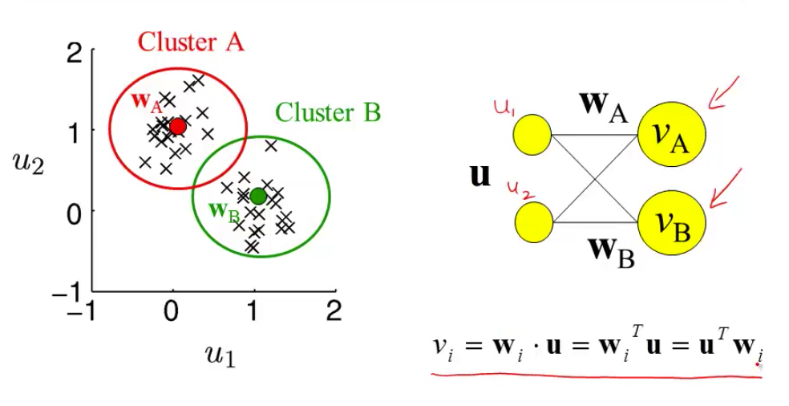
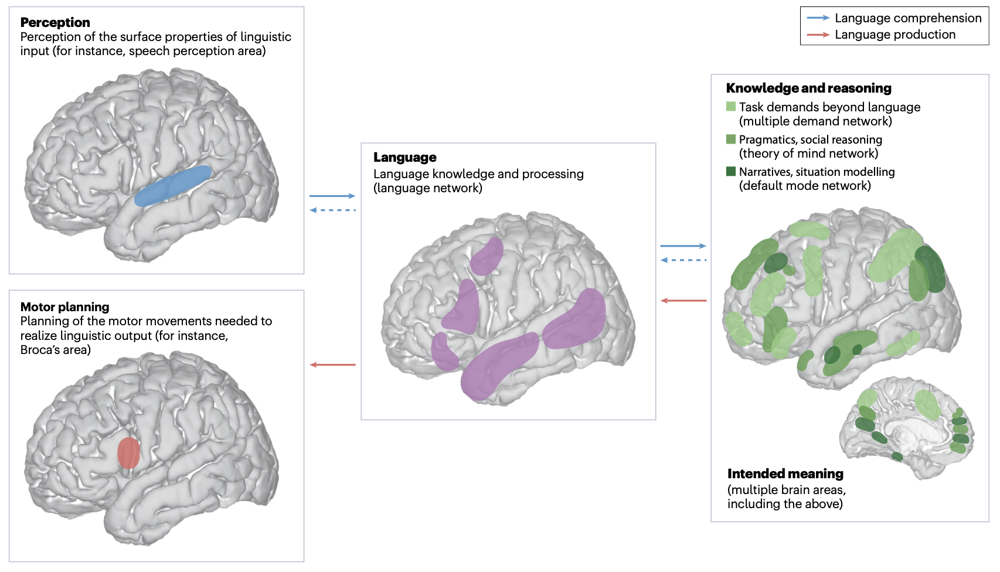
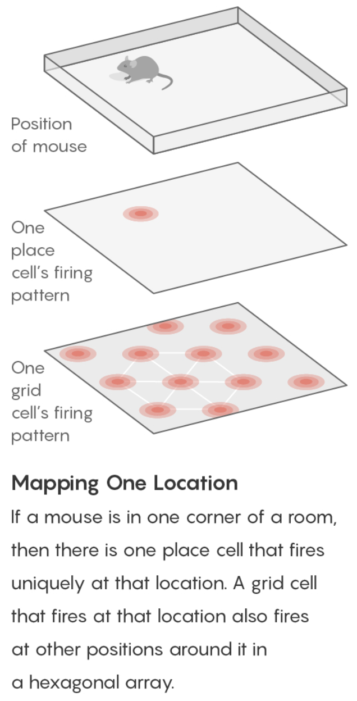

{:toc}

# introduction

## overview

- lacking: insight from neuro that can help build machine
- scales: cortex, column, neuron, synapses
- physics: theory and practice are much closer
- are there principles?
  - "god is a hacker" - francis crick
  - theorists are lazy - ramon y cajal
  - things seemed like mush but became more clear - horace barlow

## history

- ai

  - people: turing, von neumman, marvin minsky, mccarthy...
  - ai: birth at 1956 conference
    - vision: marvin minsky thought it would be a summer project

  - lighthill debate 1973 - was ai worth funding?
  - intelligence tends to be developed by young children
  - cortex grew very rapidly

- cybernetics / artficial neuro nets

  - people: norbert weiner, mcculloch & pitts, rosenblatt

  - neuro
    - hubel & weisel (1962, 1965) simple, complex, hypercomplex cells
    - neocognitron fukushima (1980)
    - david marr: theory, representation, implementation
    - felleman & van essen (1991)
      - ascending layers (e.g. v1-> v2): goes from superficial to deep layers
      - descending layers (e.g. v2 -> v1): deep layers to superficial
    - solari & stoner (2011) "cognitive consilience" - layers thicknesses change in different parts of the brain
      - motor cortex has much smaller input (layer 4), since it is mostly output

## types of models

- three types
  1. *descriptive* brain model - encode / decode external stimuli
  2. *mechanistic* brian cell / network model - simulate the behavior of a single neuron / network
  3. *interpretive* (or normative) brain model - why do brain circuits operate how they do

- *receptive field* - the things that make a neuron fire

  - retina has on-center / off-surround cells - stimulated by points
  - then, V1 has differently shaped receptive fields

- *efficient coding hypothesis* - brain learns different combinations (e.g. lines) that can efficiently represent images

  1. sparse coding (Olshausen and Field, 1996)
  2. ICA (Bell and Sejnowski, 1997)
  3. predictive coding (Rao and Ballard, 1999)
  - brain is trying to learn faithful and efficient representations of an animal's natural environment

# biophysical models

## modeling neurons

- membrane can be treated as a simple circuit, with a capacitor and resistor

- nernst battery
  1. osmosis (for each ion)
  2. electrostatic forces (for each ion)
  - together these yield Nernst potential $E = \frac{k_B T}{zq} ln \frac{[in]}{[out]}$
    - T is temp
    - q is ionic charge
    - z is num charges
  - part of voltage is accounted for by nernst battery $V_{rest}$
  - yields $\tau \frac{dV}{dt} = -V + V_\infty$ where $\tau=R_mC_m=r_mc_m$
  - equivalently, $\tau_m \frac{dV}{dt} = -((V-E_L) - g_s(t)(V-E_s) r_m) + I_e R_m $
  
- 

## simplified model neurons

- *integrate-and-fire* neuron
  - passive membrane (neuron charges)
  - when $V = V_{thresh}$, a spike is fired
  - then $V = V_{reset}$
  - approximation is poor near threshold
  - can include threshold by saying
    - when $V = V_{max}$, a spike is fired
    - then $V = V_{reset}$
- modeling multiple variables
  - also model a K current
  - can capture things like resonance
- *theta neuron* (Ermentrout and Kopell)
  - 
  - often used for periodically firing neurons (it fires spontaneously)

## modeling dendrites / axons

- cable theory - Kelvin
- voltage V is a function of both x and t
- 
- separate into sections that don't depend on x
  - coupling conductances link the sections (based on area of compartments / branching)
- Rall model for dendrites
  - if branches obey a certain branching ratio, can replace each pair of branches with a single cable segment with equivalent surface area and electrotonic length
    - $d_1^{3/2} = d_{11}^{3/2} + d_{12}^{3/2}$
- dendritic computation (London and Hausser 2005)
  - hippocampus - when inputs arrive at soma, similiar shape no matter where they come in = *synaptic scaling*
  - where inputs enter influences how they sum
  - dendrites can generate spikes (usually calcium) / backpropagating spikes
- ex. *Jeffress model*  - sound localized based on timing difference between ears
- ex. direction selectivity in retinal ganglion cells - if events arive at dendrite far -> close, all get to soma at same time and add

## circuit-modeling basics

- membrane has capacitance $C_m$
- force for diffusion, force for drift
- can write down diffeq for this, which yields an equilibrium
- $\tau = RC$
  - bigger $\tau$ is slower
  - to increase capacitance
    - could have larger diameter $C_m \propto D$
  - axial resistance $R_A \propto 1/D^2$ (not same as membrane leak), thus bigger axons actually charge faster

## action potentials

- channel/receptor types
  - ionotropic: $G_{ion}$ = f(molecules outside)
    - something binds and opens channel
  - metabotropic: $G_{ion}$ = f(molecules inside)
    - doesn't directly open a channel: indirect
  - others
    - photoreceptor
    - hair cell
  - voltage-gated (active - provide gain; might not require active ATP, other channels are all passive)

## physics of computation

- drift and diffusion are at the heart of everything (based on carver mead)
- Boltzmann distr. models many things (ex. distr of air molecules vs elevation. Subject to gravity and diffusion upwards since they're colliding)
  - nernst potential
  - current-voltage relation of voltage-gated channels
  - current-voltage relation of MOS transistor
- these things are all like a transistor: energy barrier that must be overcome

## spiking neurons

- passive membrane model was leaky integrator
- voltage-gaed channels were more complicated
- can be though of as leaky integrate-and-fire neuron (LIF)
  - this charges up and then fires a spike, has refractory period, then starts charging up again
- rate coding hypothesis - signal conveyed is the rate of spiking (some folks think is too simple)
  - spiking irregularly is largely due to noise and doesn't convey information
  - some neurons (e.g. neurons in LIP) might actually just convey a rate
- linear-nonlinear-poisson model (LNP) - sometimes called GLM (generalized linear model)
  - based on observation that variance in firing rate $\propto$ mean firing rate
    - plotting mean vs variance = 1 $\implies$ Poisson output
  - these led people to model firing rates as Poisson $\frac {\lambda^n e^{-\lambda}} {n!}$
  - bruno doesn't really believe the firing is random (just an effect of other things we can't measure)
  - ex. fly H1 neuron 1997
    - constant stimulus looks very Poisson
    - moving stimulus looks very Bernoulli
- spike timing hypothesis
  - spike timing can be very precise in response to time-varying signals (mainen & sejnowski 1995; bair & koch 1996)
  - often see precise timing
- encoding: stimulus $\to$ spikes
- decoding: spikes $\to$ representation
- encoding + decoding are related through the joint distr. over simulus and repsonse (see Bialek spikes book)
  - nonlinear encoding function can yield linear decoding
  - able to directly decode spikes using a kernel to reproduce signal (seems to say you need spikes - rates would not be good enough)
    - some reactions happen too fast to average spikes (e.g. 30 ms)
  - estimating information rate: bits (usually better than snr - can calculate between them) - usually 2-3 bits/spike

# neural coding

## neural encoding

**defining neural code**

- *encoding*: P(response \| stimulus)
  - *tuning curve* - neuron's response (ex. firing rate) as a function of stimulus
  - orientation / color selective cells are distributed in organized fashion
  - some neurons fire to a concept, like "Pamela Anderson"
  - retina (simple) -> V1 (orientations) -> V4 (combinations) -> ?
  - also massive feedback
- *decoding*: P(stimulus \| response)

**simple encoding**

- want P(response \| stimulus)
  - response := firing rate r(t)
  - stimulus := s
- simple linear model

  - r(t) = c * s(t)
- *weighted linear model* - takes into account previous states weighted by f
  
  1. *temporal filtering*
    - r(t) = $f_0 \cdot s_0 + ... + f_t \cdot s_t =  \sum s_{t-k} f_k$ where f weights stimulus over time
    - could also make this an integral, yielding a convolution:
    - r(t) = $\int_{-\infty}^t d\tau \: s(t-\tau) f(\tau)$
    - a linear system can be thought of as a system that searches for portions of the signal that resemble its filter f
    - leaky integrator - sums its inputs with f decaying exponentially into the past
    - flaws
      - no negative firing rates
      - no extremely high firing rates
      - can add a nonlinear function g of the linear sum can fix this
        - r(t) = $g(\int_{-\infty}^t d\tau \: s(t-\tau) f(\tau))$
  2. *spatial filtering*
    - r(x,y) = $\sum_{x',y'} s_{x-x',y-y'} f_{x',y'}$ where f again is spatial weights that represent the spatial field
    - could also write this as a convolution
    - for a retinal center surround cell, f is positive for small $\Delta x$ and then negative for large $\Delta x$
      - can be calculated as a narrow, large positive Gaussian + spread out negative Gaussian
  - can combine above to make *spatiotemporal filtering*
    - filtering = convolution = projection

**feature selection**

- P(response\|stimulus) is very hard to get
  - stimulus can be high-dimensional (e.g. video)
  - stimulus can take on many values
  - need to keep track of stimulus over time
  - solution: sample P(response\|s) to many stimuli to characterize what in input triggers responses
- find vector *f* that captures features that lead to spike
  - dimensionality reduction - ex. discretize 
  - value at each time $t_i$ is new dimension
  - commonly use Gaussian white noise
  - time step sets cutoff of highest frequency present
  - *prior distribution* - distribution of stimulus
    - multivariate Gaussian - Gaussian in any dimension, or any linear combination of dimensions
  - look at where spike-triggering points are and calculate *spike-triggered average* *f* of features that led to spike
    - use this f as filter
- determining the nonlinear input/output function *g*
  - replace stimulus in P(spike\|stimulus) with P(spike\|$s_1$), where s1 is our filtered stimulus
    - use bayes rule $g=P(spike\|s_1)=\frac{P(s_1\|spike)P(spike)}{P(s_1)}$
    - if $P(s_1\|spike) \approx P(s_1)$ then response doesn't seem to have to do with stimulus
- incorporating many features *$f_1,...,f_n$*
  - here, each $f_i$ is a vector of weights
  - $r(t) = g(f_1\cdot s,f_2 \cdot s,...,f_n \cdot s)$
  - could use *PCA* - discovers low-dimensional structure in high-dimensional data
  - each f represents a feature (maybe a curve over time) that fires the neuron

**variability**

- hidden assumptions about time-varying firing rate and single spikes

  - smooth function RFT can miss some stimuli
  
- statistics of stimulus can effect P(spike\|stimulus)

  - Gaussian white noise is nice because no way to filter it to get structure
  
- identifying good filter
  - want $P(s_f\|spike)$ to differ from $P(s_f)$ where $s_f$ is calculated via the filter
  - instead of PCA, could look for f that directly maximizes this difference (Sharpee & Bialek, 2004)
  - *Kullback-Leibler divergence* - calculates difference between 2 distributions
    - $D_{KL}(P(s),Q(s)) = \int ds P(s) log_2 P(s) / Q(s)$
  - maximizing KL divergence is equivalent to maximizing mutual info between spike and stimulus
    - this is because we are looking for most informative feature
    - this technique doesn't require that our stimulus is white noise, so can use natural stimuli
    - maximization isn't guaranteed to uniquely converge
  
- modeling the noise
  - need to go from r(t) -> spike times
  
  - divide time T into n bins with p = probability of firing per bin
  
  - over some chunk T, number of spikes follows binomial distribution (n, p)
    
  - if n gets very large, binomial approximates Poisson
    - $\lambda$ = spikes in some set time (mean = $\lambda$, var = $\lambda$)
    1. can test if distr is Poisson with *Fano factor*=mean/var=1
      2. interspike intervals have exponential distribution	- if fires a lot, this can be bad assumption (due to refractory period)
  
- generalized linear model adds explicit spike-generation / post-spike filter (Pillow et al. 2008)
  
  - $P(\text{spike at }t)\sim\exp((f_1*s + h_1*r)) $
  - post-spike filter models refractory period
  - *Paninski* showed that using exponential nonlinearity allows this to be optimized
  - could add in firing of other neurons
  - *time-rescaling theorem* - tests how well we have captured influences on spiking (Brown et al 2001)
    - scaled ISIs ($t_{i-1}-t_i$) r(t) should be exponential
  

## neural decoding

**neural decoding and signal detection**

- decoding: P(stimulus \| response) - ex. you hear noise and want to tell what it is
  - here $r$ = response = firing rate
- monkey is trained to move eyes in same direction as dot pattern (Britten et al. 92)
  - when dots all move in same direction (100% coherence), easy
    - neuron recorded in MT - tracks dots
    - count firing rate when monkey tracks in right direction
    - count firing rate when  monkey tracks in wrong direction
    - as coherence decreases, these firing rates blur
  - need to get P(+ or - \| r)
    - can set a threshold on r by maximizing likelihood
      - P(r\|+) and P(r\|-) are likelihoods
    - *Neyman-Pearson lemma* - likelihood ratio test is the most efficient statistic, in that is has the most power for a given size
      - $\frac{p(r\|+)}{p(r\|-)} > 1?$
- accumulated evidence - we can accumulate evidence over time by multiplying these probabilities
  - instead we take sum the logs, and compare to 0
  - $\sum_i ln \frac{p(r_i\|+)}{p(r_i\|-)} > 0?$
  - once we hit some threshold for this sum, we can make a decision + or -
- experimental evidence (Kiani, Hanks, & Shadlen, Nat. Neurosci 2006)
  - monkey is making decision about whether dots are moving left/right
  - neuron firing rates increase over time, representing integrated evidence
  - neuron always seems to stop at same firing rate
- priors - ex. tiger is much less likely then breeze
  - scale P(+\|r) by prior P(+)
  - neuroscience ex. photoreceptor cells P(noise\|r) is much larger than P(signal\|r)
    - therefore threshold on r is high to minimize total mistakes
- cost of acting/not acting
  - loss for predicting + when it is -: $L_- \cdot P[+\|r]$
  - loss for predicting - when it is +: $L_+ \cdot P[-\|r]$
  - cut your losses: answer + when average Loss$_+$ < Loss$_-$
    - i.e. $L_+ \cdot P[-\|r]$ < $L_- \cdot P[+\|r]$
  - rewriting with Baye's rule yields new test:
    - $\frac{p(r\|+)}{p(r\|-)}> L_+ \cdot P[-] / L_- \cdot P[+]$
    - here the loss term replaces the 1 in the Neyman-Pearson lemma

**population coding and bayesian estimation**

- *population vector* - sums vectors for cells that point in different directions weighted by their firing rates
  - ex. cricket cercal cells sense wind in different directions
  - since neuron can't have negative firing rate, need overcomplete basis so that can record wind in both directions along an axis
  - can do the same thing for direction of arm movement in a neural prosthesis
  - not general - some neurons aren't tuned, are noisier
  - not *optimal* - making use of all information in the stimulus/response distributions
- *bayesian inference*
  - $p(s\|r) = \frac{p(r\|s)p(s)}{p( r)}$
  - maximum likelihood: s* which maximizes p(r\|s)
  - MAP = maximum a posteriori: s* which mazimizes p(s\|r)
- simple continuous stimulus example
  - setup
    - s - orientation of an edge
    - each neuron's average firing rate=tuning curve $f_a(s)$ is Gaussian (in s)
    - let $r_a$ be number of spikes for neuron a
    - assume receptive fields of neurons span s: $\sum r_a (s)$ is const
    - 
  - solving
    - maximizing log-likelihood with respect to s			-
    - take derivative and set to 0
      - soln $s^* = \frac{\sum r_a s_a / \sigma_a^2}{\sum r_a / \sigma_a^2}$
      - if all the $\sigma$ are same, $s^* = \frac{\sum r_a s_a}{\sum r_a}$
        - this is the population vector
    - maximum *a posteriori*
      - $ln \: p(s\|r) = ln \: P(r\|s) + ln \: p(s) = ln \: P(r )$
      - $s^* = \frac{T \sum r_a s_a / \sigma^2_a + s_{prior} / \sigma^2_{prior}}{T \sum r_a / \sigma^2_a + 1/\sigma^2_{prior}}$
      - this takes into account the prior
        - narrow prior makes it matter more
    - doesn't incorporate correlations in the population

**stimulus reconstruction**

- decoding s -> $s^*$
- want an estimator $s_{Bayes}=s_B$ given some response r
  - error function $L(s,s_{B})=(s-s_{B})^2$
  - minimize $\int ds \: L(s,s_{B}) \: p(s\|r)$ by taking derivative with respect to $s_B$
  - $s_B = \int ds \: p(s\|r) \: s$ - the conditional mean (spike-triggered average)
- add in spike-triggered average at each spike
  - if spike-triggered average looks exponential, can never have smooth downwards stimulus
  - could use 2 neurons (like in H1) and replay the second with negative sign
- LGN neurons can reconstruct a video, but with noise
- recreated 1 sec long movies - (*Jack Gallant* - Nishimoto et al. 2011, Current Biology)
  1. voxel-based encoding model samples ton of prior clips and predicts signal
    - get p(r\|s)
    - pick best p(r\|s) by comparing predicted signal to actual signal
    - input is filtered to extract certain features
    - filtered again to account for slow timescale of BOLD signal
  2. decoding
    - maximize p(s\|r) by maximizing p(r\|s) p(s), and assume p(s) uniform
    - 30 signals that have highest match to predicted signal are averaged 
    - yields pretty good pictures

## information theory

**information and entropy**

- surprise for seeing a spike h(p) = $-log_2 (p)$
- entropy = average information
- code might not align spikes with what we are encoding
- how much of the variability in r is encoding s
  - define q as en error
    - $P(r_+\|s=+)=1-q$
    - $P(r_-\|s=+)=q$
    - similar for when s=-
  - total entropy: $H(R ) = - P(r_+) log P(r_+) - P(r_-)log P(r_-)$
  - noise entropy: $H(R\|S=+) = -q log q - (1-q) log (1-q)$
  - mutual info I(S;R) = $H(R ) - H(R\|S) $ = total entropy - average noise entropy
    - = $D_{KL} (P(R,S), P(R )P(S))$
- *grandma's famous mutual info recipe*
  - for each s
    - P(R\|s) - take one stimulus and repeat many times (or run for a long time)
    - H(R\|s) - noise entropy
  - $H(R\|S)=\sum_s P(s) H(R\|s)$
  - $H(R ) $ calculated using $P(R ) = \sum_s P(s) P(R\|s)$

**info in spike trains**

1. information in spike patterns
  - divide pattern into time bins of 0 (no spike) and 1 (spike)
  - binary words w with letter size $\Delta t$, length T (Reinagel & Reid 2000)
    - can create histogram of each word
    - can calculate entropy of word 
  - look at distribution of words for just one stimulus
    - distribution should be narrower
  - calculate $H_{noise}$ - average over time with random stimuli and calculate entropy
    - varied parameters of word: length of bin (dt) and length of word (T)
    - there's some limit to dt at which information stops increasing
      - this represents temporal resolution at which jitter doesn't stop response from identifying info about the stimulus
    - corrections for finite sample size (Panzeri, Nemenman,...)
  
2. information in single spikes - how much info does single spike tell us about stimulus
  - don't have to know encoding, mutual info doesn't care
  1. calculate entropy for random stimulus
    - $p=\bar{r} \Delta t$ where $\bar{r}$ is the mean firing rate
  2. calculate entropy for specific stimulus
  - let $P(r=1\|s) = r(t) \Delta t$
  - let $P(r=0\|s) = 1 - r(t) \Delta t$
  - get r(t) by having simulus on for long time
  - *ergodicity* - a time average is equivalent to averging over the s ensemble
  - info per spike $I(r,s) = \frac{1}{T} \int_0^T dt \frac{r(t)}{\bar{r}} log \frac{r(t)}{\bar{r}}$
    - timing precision reduces r(t)
    - low mean spike rate -> high info per spike
  - ex. rat runs through place field and only fires when it's in place field
    - spikes can be sharper, more / less frequent

**coding principles**

- natural stimuli
  - huge dynamic range - variations over many orders of magnitude (ex. brightness)
  - power law scaling - structure at many scales (ex. far away things)
- *efficient coding* - in order to have maximum entropy output, a good encoder should match its outputs to the distribution of its inputs
  - want to use each of our "symbols" (ex. different firing rates) equally often
  - should assign equal areas of input stimulus PDF to each symbol
- adaptation to stimulus statistics
  - 
  - feature adaptation (Atick and Redlich)
    - spatial filtering properties in retina / LGN change with varying light levels
    - at low light levels surround becomes weaker
- coding sechemes
  1. redundancy reduction
    - population code $P(R_1,R_2)$
    - entropy $H(R_1,R_2) \leq H(R_1) + H(R_2)$ - being independent would maximize entropy
  2. correlations can be good
    - error correction and robust coding
    - correlations can help discrimination
    - retina neurons are redundant (Berry, Chichilnisky)
  3. more recently, sparse coding
    - penalize weights of basis functions
    - instead, we get localized features
- we ignored the behavioral feedback loop

# computing with networks

## modeling connections between neurons

- model effects of synapse by using synaptic conductance $g_s$ with reversal potential $E_s$
  - $g_s = g_{s,max} \cdot P_{rel} \cdot P_s$
    - $P_{rel}$ - probability of release given an input spike
    - $P_s$ - probability of postsynaptic channel opening = fraction of channels opened
- basic synapse model
  - assume $P_{rel}=1$
  - model $P_s$ with kinetic model
    - open based on $\alpha_s$
    - close based on $\beta_s$
    - yields $\frac{dP_s}{dt} = \alpha_s (1-P_s) - \beta_s P_s$
  - 3 synapse types
    1. AMPA - well-fit by exponential
    2. GAMA - fit by "alpha" function - has some delay
    3. NMDA - fit by "alpha" function - has some delay
- linear filter model of a synapse
  - pick filter (ex. K(t) ~ exponential)
  - $g_s = g_{s,max} \sum K(t-t_i)$
- network of integrate-and-fire neurons
  - if 2 neurons inhibit each other, get *synchrony* (fire at the same time

## intro to network models

- comparing spiking models to firing-rate models
  - advantages
    - spike timing
    - spike correlations / synchrony between neurons
  - disadvantages
    - computationally expensive
  - uses linear filter model of a synapse
- developing a firing-rate model
  - replace spike train $\rho_1(t) \to u_1(t)$
    - can't make this replacement when there are correlations / synchrony?
  - input current $I_s$: $\tau_s \frac{dI_s}{dt}=-I_s + \mathbf{w} \cdot \mathbf{u}$
    - works only if we let K be exponential
  - output firing rate: $\tau_r \frac{d\nu}{dt} = -\nu + F(I_s(t))$
  - if synapses are fast ($\tau_s << \tau_r$)
    - $\tau_r \frac{d\nu}{dt} = -\nu + F(\mathbf{w} \cdot \mathbf{u}))$
  - if synapses are slow ($\tau_r << \tau_s$)
    - $\nu = F(I_s(t))$
  - if static inputs (input doesn't change) - this is like artificial neural network, where F is sigmoid
    - $\nu_{\infty} = F(\mathbf{w} \cdot \mathbf{u})$
    - could make these all vectors to extend to multiple output neurons
- recurrent networks 
  - $\tau \frac{d\mathbf{v}}{dt} = -\mathbf{v} + F(W\mathbf{u} + M \mathbf{v})$
    - $-\mathbf{v}$ is decay
    - $W\mathbf{u}$ is input
    - $M \mathbf{v}$ is feedback
  - with constant input, $v_{\infty} = W \mathbf{u}$
  - ex. edge detectors
  - V1 neurons are basically computing derivatives

## recurrent networks

- linear recurrent network: $\tau \frac{d\mathbf{v}}{dt} = -\mathbf{v} + W\mathbf{u} + M \mathbf{v}$
  - let $\mathbf{h} = W\mathbf{u}$
  - want to investigate different M
- can solve for $\mathbf{v}$ using eigenvectors
  - suppose M (NxN) is symmetric (connections are equal in both directions)
    - $\to$ M has N orthogonal eigenvectors / eigenvalues
    - let $e_i$ be the orthonormal eigenvectors
  - output vector $\mathbf{v}(t) = \sum c_i (t) \mathbf{e_i}$
  - allows us to get a closed-form solution for $c_i(t)$
  - eigenvalues determine network stability
    - if any $\lambda_i > 1, \mathbf{v}(t)$ explodes $\implies$ network is unstable
      - otherwise stable and converges to steady-state value
    - $\mathbf{v}_\infty = \sum \frac{h\cdot e_i}{1-\lambda_i} e_i$
    - amplification of input projection by a factor of $\frac{1}{1-\lambda_i}$
- ex. each output neuron codes for an angle between -180 to 180
  - define M as cosine function of relative angle
  - excitation nearby, inhibition further away
- memory in linear recurrent networks
  - suppose $\lambda_1=1$ and all other $\lambda_i < 1$
  - then $\tau \frac{dc_1}{dt} = h \cdot e_1$ - keeps memory of input
  - ex. memory of eye position in medial vestibular nucleus (Seung et al. 2000)
    - integrator neuron maintains persistent activity
- nonlinear recurrent networks: $\tau \frac{d\mathbf{v}}{dt} = -\mathbf{v} + F(\mathbf{h}+ M \mathbf{v})$
  - ex. ReLu F(x) = max(0,x)
    - ensures that firing rates never go below
  - can have eigenvalues > 1 but stable due to rectification
  - can perform selective "attention"
    - network performs "winner-takes-all" input selection
  - *gain modulation* - adding constant amount to input h multiplies the output
  - also maintains memory
- non-symmetric recurrent networks
  - ex. excitatory and inhibitory neurons
  - linear stability analysis - find fixed points and take partial derivatives
    - use eigenvalues to determine dynamics of the nonlinear network near a fixed point

## hopfield nets

- hopfield nets can store / retrieve memories
  - marr-pogio stereo algorithm
- binary Hopfield networks were introduced as associative memories that can store and retrieve patterns (Hopfield, 1982)
  - network with dimension $d$ can store $d$ uncorrelated patterns, but fewer correlated patterns
  - in contrast to the storage capacity, the number of energy minima (spurious states, stable states) of Hopfield networks is exponential in $d$​ (Tanaka & Edwards, 1980; Bruck & Roychowdhury, 1990; Wainrib & Touboul, 2013)
  - energy function only has pairwise connections
  - fully connected (no input/output) - activations are what matter
    - can memorize patterns - starting with noisy patterns can converge to these patterns
- hopfield three-way connections
  - $E = - \sum_{i, j, k} T_{i, j, k} V_i V_j V_k$ (self connections set to 0)
    - update to $V_i$​ is now bilinear
- modern hopfield network = dense associative memory (DAM) model
  - use an energy function with interaction functions of the form $F (x) = x^n$ and achieve storage capacity $\propto d^{n-1}$ (Krotov & Hopfield, 2016; 2018)

# learning

## supervised learning

- net talk was major breakthrough (words -> audio) Sejnowski & Rosenberg 1987
- people looked for world-centric receptive fields (so neurons responded to things not relative to retina but relative to body) but didn't find them
  - however, they did find gain fields: (Zipser & Anderson, 1987)
    - gain changes based on what retina is pointing at
  - trained nn to go from pixels to head-centered coordinate frame
    - yielded gain fields
  - pouget et al. were able to find that this helped having 2 pop vectors: one for retina, one for eye, then add to account for it
- support vector networks (vapnik et al.) - svms early inspired from NNs
- dendritic nonlinearities (hausser & mel, 2003)
  - example to think about neurons do this: $u = w_1 x_1 + w_2x_2 + w_{12}x_1x_2$
  - $y=\sigma(u)$
  - somestimes called sigma-pi unit since it's a sum of products
  - exponential number of params...**could be fixed w/ kernel trick?**
    - could also incorporate geometry constraint

## unsupervised learning

- born w/ extremely strong priors on weights in different areas
- barlow 1961, attneave 1954: efficient coding hypothesis = redundancy reduction hypothesis
  - representation: compression / usefulness
  - easier to store prior probabilities (because inputs are independent)
  - relich 93: redundancy reduction for unsupervised learning (text ex. learns words from text w/out spaces)

### hebbian learning and pca

- pca can also be thought of as a tool for decorrelation (pc coefs tend to be less correlated)
- hebbian learning = fire together, wire together: $\Delta w_{ab} \propto <a, b>$ note: $<a, b>$ is correlation of a and b (average over time)
- linear hebbian learning (perceptron with linear output)
- $\dot{w}_i \propto <y, x_i> \propto \sum_j w_j <x_j, x_i>$ since weights change relatively slowly
  - synapse couldn't do this, would grow too large
- oja's rule (hebbian learning w/ weight decay so ws don't get too big)
  - points to correct direction
- sanger's rule: for multiple neurons, fit residuals of other neurons
- competitive learning rule: winner take all
  - population nonlinearity is a max
  - gets stuck in local minima (basically k-means)
- pca only really good when data is gaussian
  - interesting problems are non-gaussian, non-linear, non-convex
- pca: yields checkerboards that get increasingly complex (because images are smooth, can describe with smaller checkerboards)
  - this is what jpeg does
  - very similar to discrete cosine transform (DCT)
  - very hard for neurons to get receptive fields that look like this
- retina: does whitening (yields center-surround receptive fields)
  - easier to build
  - gets more even outputs
  - only has ~1.5 million fibers
- 
  - most active neuron is the one whose w is closest to x
- *competitive learning*
  - updating weights given a new input
    1. pick a cluster (corresponds to most active neuron)
    2. set weight vector for that cluster to running average of all inputs in that cluster
      - $\Delta w = \epsilon \cdot (\mathbf{x} - \mathbf{w})$

## synaptic plasticity, hebb's rule, and statistical learning

- if 2 spikes keep firing at same time, get LTP - long-term potentiation
  - if input fires, but not B then could get LTD - long-term depression
- *Hebb rule* $\tau_w \frac{d\mathbf{w}}{dt} = \mathbf{x}v$
  - $\mathbf{x}$ - input
  - $v$ - output
  - translates to $\mathbf{w}_{i+1}=\mathbf{w}_i + \epsilon \cdot \mathbf{x}v$
  - average effect of the rule is to change based on correlation matrix $\mathbf{x}^T\mathbf{x}$
- *covariance rule*: $\tau_w \frac{d\mathbf{w}}{dt} = \mathbf{x}(v-E[v])$
  - includes LTD as well as LTP
- *Oja's rule*: $\tau_w \frac{d\mathbf{w}}{dt} = \mathbf{x}v- \alpha v^2 \mathbf{w}$ where $\alpha>0$
- stability
  - Hebb rule - derivative of w is always positive $\implies$ w grows without bound
  - covariance rule - derivative of w is still always positive $\implies$ w grows without bound
    - could add constraint that $\|\|w\|\|=1$ and normalize w after every step
  - Oja's rule - $\|\|w\|\| = 1/\sqrt{\alpha}$, so stable
- solving *Hebb rule* $\tau_w \frac{d\mathbf{w}}{dt} = Q w$ where Q represents correlation matrix
  - write w(t) in terms of eigenvectors of Q
  - lets us solve for $\mathbf{w}(t)=\sum_i c_i(0)\exp(\lambda_i t / \tau_w) \mathbf{e}_i$
  - when t is large, largest eigenvalue dominates
- hebbian learning implements PCA
  - hebbian learning learns w aligned with principal eigenvector of input correlation matrix
  - this is same as PCA

## tensor product representation (TPR)

- tensor product representation = TPR
  - Tensor product variable binding and the representation of symbolic structures in connectionist systems ([paul smolensky, 1990](https://www.sciencedirect.com/science/article/abs/pii/000437029090007M?via%3Dihub)) - activation patterns are "symbols" and internal structure allows them to be processed like symbols
  - **filler** - one vector that embeds the content of the constituent
  - **role** - second vector that embeds the structural role it fills
  - TPR is built by summing the outer product between roles and fillers:
  - 
    - can optionally flatten the final TPR as is done in [mccoy...smolensky, 2019](https://arxiv.org/pdf/1812.08718.pdf) if we want to compare it to a vector or an embedding
  - TPR of a structure is the sum of the TPR of its constituents
    - tensor product operation allows constituents to be uniquely identified, even after the sum (if roles are linearly independent)
- [TPR intro blog post](https://csinva.io/blog/misc/24_tensor_product_repr)
- [TPR slides](https://www.mit.edu/~jda/teaching/6.884/slides/oct_02.pdf)
- RNNs Implicitly Implement Tensor Product Representations ([mccoy...smolensky, 2019](https://arxiv.org/pdf/1812.08718.pdf))
  - introduce TP Decomposition Networks (TPDNs), which use TPRs to approximate existing vector representations
    - assumes a particular hypothesis for the relevant set of roles (e.g., sequence indexes or structural positions in a parse tree)
  - TPDNs can successfully approximate linear and tree-based RNN autoencoder representations
  - evaluate TPDN based on how well the decoder applied to the TPDN representation produces the same output as the original RNN
- Discovering the Compositional Structure of Vector Representations with Role Learning Networks ([soulos, mccoy, linzen, & smolensky, 2019](https://arxiv.org/pdf/1910.09113.pdf)) - extend DISCOVER to learned roles with an LSTM
  - role vector is regularized to be one-hot
- Concepts and Compositionality: In Search of the Brain's Language of Thought ([frankland & greene, 2020](https://www.annualreviews.org/doi/10.1146/annurev-psych-122216-011829))
    - Fodor’s classic language of thought hypothesis: our minds employ an amodal, language-like system for combining and recombining simple concepts to form more complex thoughts
    - combinatorial processes engage a common set of brain regions, typically housed throughout the brain’s default mode network (DMN)

## sparse coding and predictive coding

- eigenface - Turk and Pentland 1991
  - eigenvectors of the input covariance matrix are good features
  - can represent images using sum of eigenvectors (orthonormal basis)
- suppose you use only first M principal eigenvectors
  - then there is some noise
  - can use this for compression
  - not good for local components of an image (e.g. parts of face, local edges)
- if you assume Gausian noise, maximizing likelihood = minimizing squared error
- generative model
  - images X
  - causes 
  - likelihood $P(X=x\|C=c)$
    - Gaussian
    - proportional to $\exp(x-Gc)$
  - want posterior $P(C\|X)$
  - prior $p(C)$
    - assume priors causes are independent
    - want sparse distribution
      - has heavy tail (super-Gaussian distribution)
    - then P(C ) = $k\prod \exp(g(C_i))$
  - can implement sparse coding in a recurrent neural network
  - Olshausen & Field, 1996 - learns receptive fields in V1
- sparse coding is a special case of *predictive coding*
  - 
  - there is usually a feedback connection for every feedforward connection (Rao & Ballard, 1999)
- recurrent sparse reconstruction ([shi...joshi, darrell, wang, 2022](https://arxiv.org/pdf/2204.10962.pdf)) - sparse reconstruction (of a single image) learns a layer that does better than self-attention

## sparse, distributed coding

- $$\underset {\mathbf{D}} \min \underset t \sum \underset {\mathbf{h^{(t)}}} \min ||\mathbf{x^{(t)}} - \mathbf{Dh^{(t)}}||_2^2 + \lambda ||\mathbf{h^{(t)}}||_1$$
  - $D$ is like autoencoder output weight matrix
  - h is more complicated - requires solving inner minimization problem
  - outer loop is not quite lasso - weights are not what is penalized
- barlow 1972: want to represent stimulus with minimum active neurons
  - neurons farther in cortex are more silent
  - v1 is highly overcomplete (dimensionality expansion)
- codes: dense -> sparse, distributed $n \choose k$ -> local (grandmother cells)
  - energy argument - bruno doesn't think it's a big deal (could just not have a brain)
- PCA: autoencoder when you enforce weights to be orthonormal
  - retina must output encoded inputs as spikes, lower dimension -> uses whitening
- cortex
  - sparse coding different kind of autencoder bottleneck (imposes sparsity)
- using bottlenecks in autoencoders forces you to find structure in data
- v1 simple-cell receptive fields are localized, oriented, and bandpass
- higher-order image statistics
  - phase alignment
  - orientation (requires at least 3 points stats (like orientation)
  - motion
- how to learn sparse repr?
  - foldiak 1990 forming sparse reprs by local anti-hebbian learning
  - driven by inputs and gets lateral inhibition and sum threshold
  - neurons drift towards some firing rate naturally (adjust threshold naturally)
- use higher-order statistics
  - projection pursuit (field 1994) - maximize non-gaussianity of projections
    - CLT says random projections should look gaussian
    - gabor-filter response histogram over natural images look non-Gaussian (sparse) - peaked at 0
  - doesn't work for graded signals
- sparse coding for graded signals: olshausen & field, 1996
  - $\underset{Image}{I(x, y)} = \sum_i a_i \phi_i (x, y) + \epsilon (x,y)$
  - loss function $\frac{1}{2} |I - \phi a|^2 + \lambda \sum_i C(a_i)$
  - can think about difference between $L_1$ and $L_2$ as having preferred directions (for the same length of vector) - prefer directions which some zeros
  - in terms of optimization, smooth near zero
  - there is a network implementation
  - $a_i$are calculated by solving optimization for each image, $\phi$ is learned more slowly
  - **can you get $a_i$ closed form soln?** 
- wavelets invented in 1980s/1990s for sparsity + compression
- these tuning curves match those of real v1 neurons
- applications
  - for time, have spatiotemporal basis where local wavelet moves
  - sparse coding of natural sounds
    - audition like a movie with two pixels (each ear sounds independent)
    - converges to gamma tone functions, which is what auditory fibers look like
  - sparse coding to neural recordings - finds spikes in neurons
    - learns that different layers activate together, different frequencies come out
    - found place cell bases for LFP in hippocampus
  - nonnegative matrix factorization - like sparse coding but enforces nonnegative 
  - can explicitly enforce nonnegativity
- LCA algorithm lets us implement sparse coding in biologically plausible local manner
- explaining away - neural responses at the population should be decodable (shouldn't be ambiguous)
- good project: understanding properties of sparse coding bases
- SNR = $VAR(I) / VAR(|I- \phi A|)$
- can run on data after whitening
  - graph is of power vs frequency (images go down as $1/f$), need to weighten with f
  - don't whiten highest frequencies (because really just noise)
    - need to do this softly - roughly what the retina does
  - as a result higher spatial frequency activations have less variance
- whitening effect on sparse coding
  - if you don't whiten, have some directions that have much more variance
- projects
  - applying to different types of data (ex. auditory)
- adding more bases as time goes on
- combining convolution w/ sparse coding?
- people didn't see sparsity for a while because they were using very specific stimuli and specific neurons
  - now people with less biased sampling are finding more sparsity
  - in cortex anasthesia tends to lower firing rates, but opposite in hippocampus

## self-organizing maps = kohonen maps

- homunculus - 3d map corresponds to map in cortex (sensory + motor)
- related to *self-organizing maps* = kohonen maps
  - in self-organizing maps, update other neurons in the neighborhood of the winner
  - update winner closer
  - update neighbors to also be closer
  - ex. V1 has orientation preference maps that do this
- visual cortex
  - visual cortex mostly devoted to center
  - different neurons in same regions sensitive to different orientations (changing smoothly)
  - orientation constant along column
  - orientation maps not found in mice (but in cats, monkeys)
  - direction selective cells as well
- maps are plastic - cortex devoted to particular tasks expands (not passive, needs to be active)
  - kids therapy with tone-tracking video games at higher and higher frequencies

# probabilistic models + inference

- Wiener filter: has Gaussian prior + likelihood
- gaussians are everywhere because of CLT, max entropy (subject to power constraint)

  - for gaussian function, $d/dx f(x) = -x f(x)$

## boltzmann machines

- hinton & sejnowski 1983
- starts with a hopfield net (states $s_i$ weights $\lambda_{ij}$) where states are $\pm 1$
- define energy function $E(\mathbf{s}) = - \sum_{ij} \lambda_{ij} s_i s_j$
- assume Boltzmann distr $P(s) = \frac{1}{z} \exp (- \beta \phi(s))$
- learning rule is basically expectation over data - expectation over model
  - could use wake-sleep algorithm
  - during day, calculate expectation over data via Hebbian learning (in Hopfield net this would store minima)
  - during night, would run anti-hebbian by doing random walk over network (in Hopfield net this would remove spurious local minima)
- learn via gibbs sampling (prob for one node conditioned on others is sigmoid)
- can add hidden units to allow for learning higher-order interactions (not just pairwise)
  - restricted boltzmann machine: no connections between "visible" units and no connections between "hidden units"
  - computationally easier (sampling is independent) but less rich
- stacked rbm: hinton & salakhutdinov (hinton argues this is first paper to launch deep learning)
  - don't train layers jointly
  - learn weights with rbms as encoder
  - then decoder is just transpose of weights
  - finally, run fine-tuning on autoencoder
  - able to separate units in hidden layer
  - **cool - didn't actually need decoder**
- in rbm
  - when measuring true distr, don't see hidden vals
    - instead observe visible units and conditionally sample over hidden units
    - $P(h|v) = \prod_i P(h_i | v)$ ~ easy to sample from
  - when measuring sampled distr., just sample $P(h|v)$ then sample $P(v|h)$
- ising model - only visible units
  - basically just replicates pairwise statistics (kind of like pca)
    - pairwise statistics basically say "when I'm on, are my neighbors on?"
  - need 3-point statistics to learn a line
- generating textures
  - learn the distribution of pixels in 3x3 patches
  - then maximize this distribution - can yield textures
- reducing the dimensionality of data with neural networks

# data-driven neuroscience

- [list of comparisons](https://docs.google.com/document/d/1qil2ylAnw6XrHPymYjKKYNDJn2qZQYA_Qg2_ijl-MaQ/edit)

- https://medium.com/the-spike/a-neural-data-science-how-and-why-d7e3969086f2

## data types

|              | EEG      | ECoG              | Local Field potential (LFP) -> microelectrode array | single-unit | calcium imaging | fMRI     |
| ------------ | -------- | ----------------- | --------------------------------------------------- | ----------- | --------------- | -------- |
| scale        | high     | high              | low                                                 | tiny        | low             | high     |
| spatial res  | very low | low               | mid-low                                             | x           | low             | mid-low  |
| temporal res | mid-high | high              | high                                                | super high  | high            | very low |
| invasiveness | non      | yes (under skull) | very                                                | very        | non             | non      |

- static data gold standard is electron microscopy

  - alternatively, can do connectomics from light microscopy + adaptive optics ([takavoli...jain, danzil, 2025](https://www.nature.com/articles/s41586-025-08985-1))

- [ovw of advancements in neuroengineering](https://medium.com/neurotechx/timeline-of-global-highlights-in-neuroengineering-2005-2018-75e4637b9e38)

- **pro big-data**

  Artificial neural networks can compute in several different ways. There is some evidence in the visual system that neurons in higher layers of visual areas can, to some extent, be predicted linearly by higher layers of deep networks (yamins2014performance)

  - when comparing energy-efficiency, must normalize network performance by energy / number of computations / parameters

  **anti big-data**

  - could neuroscientist  understand microprocessor ([jonas & kording, 2017](https://journals.plos.org/ploscompbiol/article?id=10.1371/journal.pcbi.1005268))
  - System Identification of Neural Systems: If We Got It Right, Would We Know? ([han, poggio, & cheung, 2023](https://proceedings.mlr.press/v202/han23d)) - could functional similarity be a reliable predictor of architectural similarity?
  - Can a biologist fix a radio?—Or, what I learned while studying apoptosis ([lazebnik, 2002](https://www.cell.com/fulltext/S1535-6108(02)00133-2))
  - no canonical microcircuit

- cellular
  - extracellular microeelectrodes
  - intracellular microelectrode
  - **neuropixels**

- optical
  - calcium imaging / fluorescence imaging
  - whole-brain light sheet imaging
  - voltage-sensitive dyes / voltage imaging
  - **adaptive optics**
  - - fNIRSlike fMRI but cheaper, allows more immobility, slightly worse spatial res
  - **oct** - noninvasive - can look at retina (maybe find biomarkers of alzheimer's)
  - fiber photometry - optical fiber implanted delivers excitation light

- high-level
  - EEG/ECoG
  - MEG
  - fMRI/PET
    - MRI with [millisecond temporal precision](https://www.biorxiv.org/content/10.1101/2021.05.21.444581v2)
    - molecular fmri (bartelle)
  - MRS
  - event-related optical signal = near-infrared spectroscopy

- implantable
  - neural dust

## interventions

- optogenetic stimulation
- tms
  - genetically-targeted tms: https://www.ncbi.nlm.nih.gov/pmc/articles/PMC4846560/
- [ect - Electroconvulsive Therapy](https://www.psychiatry.org/patients-families/ect#:~:text=Learn%20about%20Electroconvulsive%2C%20therapy,the%20patient%20is%20under%20anesthesia.)  (sometimes also called electroshock therapy)
  - Identifying Recipients of Electroconvulsive Therapy: Data From Privately Insured Americans ([wilkinon...roenheck, 2018](https://www.ncbi.nlm.nih.gov/pmc/articles/PMC6248332/)) - 100k ppl per year
  - can differ in its application in three ways
    - electrode placement
      - used to be bilateral, now unilateral is more popular
    - electrical waveform of the stimulus
      - used to be sinusoid, now brief pulse is more popular (has gotten briefer over time)
    - treatment frequency
  - public perception is largely negative (owing in large part to its portrayal in *One flew over the Cuckoo's nest*)
  - research
    - How Does Electroconvulsive Therapy Work? Theories on its Mechanism ([bolwig, 2011](https://journals.sagepub.com/doi/10.1177/070674371105600104))
      - generalized seizures
      - normalization of neuroendocrine dysfunction in melancholic depression
      - increased hippocampal neurogenesis and synaptogenesis
    - Electroconvulsive therapy: How modern techniques improve patient outcomes ([tirmizi, 2012)](https://www.ncbi.nlm.nih.gov/pmc/articles/PMC4193538/pdf/nihms497537.pdf)
    - The neurobiological effects of electroconvulsive therapy studied through magnetic resonance – what have we learnt and where do we go? ([ousdal et al. 2022](https://www.ncbi.nlm.nih.gov/pmc/articles/PMC8630079/pdf/nihms-1710166.pdf))
    - Clinical EEG slowing induced by electroconvulsive therapy is better described by increased frontal aperiodic activity ([mith...soltani, 2023](https://www.nature.com/articles/s41398-023-02634-9))
- local microstimulation with invasive electrodes

## datasets

### language

- fMRI
  - A natural language fMRI dataset for voxelwise encoding models ([lebel, … huth, 2022](https://www.biorxiv.org/content/10.1101/2022.09.22.509104v1.abstract?%3Fcollection=))
    - 8 participants listening to ~6 hours each of the moth radio hour
    - 3 of the particpants have ~20 hours (~95 stories, 33k timepoints)
  - Narratives Dataset ([Nastase et al. 2019](http://fcon_1000.projects.nitrc.org/indi/retro/Narratives.html)) - more subjects, less data per subject
    - 345 subjects, 891 functional scans, and 27 diverse stories of varying duration totaling ~4.6 hours of unique stimuli (~43,000 words) and total collection time is ~6.4 days
  - Preprocessed short datasets used in [AlKhamissi et al. 2025](https://arxiv.org/pdf/2503.01830) and available through [brain-score-language](https://github.com/brain-score/language/tree/main?tab=readme-ov-file)
  - [Schoffelen et al. 2019](https://www.nature.com/articles/s41597-019-0020-y): 100 subjects recorded with fMRI and MEG, listening to de-contextualised sentences and word lists, no repeated session
  - [Huth et al. 2016](https://www.nature.com/articles/nature17637) released data from [one subject](https://github.com/HuthLab/speechmodeltutorial)
  - Visual and linguistic semantic representations are aligned at the border of human visual cortex ([popham, huth et al. 2021](https://www.nature.com/articles/s41593-021-00921-6#data-availability)) - compared semantic maps obtained from two functional magnetic resonance imaging experiments in the same participants: one that used silent movies as stimuli and another that used narrative stories ([data link](https://berkeley.app.box.com/s/l95gie5xtv56zocsgugmb7fs12nujpog))
- MEG datasets
  - MEG-MASC ([gwilliams...king, 2023](https://www.nature.com/articles/s41597-023-02752-5)) - 27 English-speaking subjects MEG, each ~2 hours of story listening, punctuated by random word lists and comprehension questions in the MEG scanner. Usually each subject listened to four distinct fictional stories twice
  - WU-Minn human connectome project ([van Essen et al. 2013](https://www.nature.com/articles/s41597-022-01382-7)) - 72 subjects recorded with fMRI and MEG as part of the Human Connectome Project, listening to 10 minutes of short stories, no repeated session
  - [Armeni et al. 2022](https://www.nature.com/articles/s41597-022-01382-7): 3 subjects recorded with MEG, listening to 10 hours of Sherlock Holmes, no repeated session
- EEG
  - [Brennan & Hale, 2019](https://journals.plos.org/plosone/article?id=10.1371/journal.pone.0207741): 33 subjects recorded with EEG, listening to 12 min of a book chapter, no repeated session
  - [Broderick et al. 2018](https://www.cell.com/current-biology/pdf/S0960-9822(18)30146-5.pdf): 9–33 subjects recorded with EEG, conducting different speech tasks, no repeated sessions
- ECoG
  - The “Podcast” ECoG dataset for modeling neural activity during
    natural language comprehension ([zada...hasson, 2025](https://www.biorxiv.org/content/10.1101/2025.02.14.638352v1.full.pdf)) - 9 subjects listening to the same story
    - 30-min story (1330 total electrodes, ~5000 spoken words (non-unique)) has female interviewer/voiceover and a male speaker, occasionally background music
    - contextual word embeddings from GPT-2 XL (middle layer) accounted for most of the variance across nearly all the electrodes tested
  - Brain Treebank: Large-scale intracranial recordings from naturalistic language stimuli ([wang...barbu, 2024](https://arxiv.org/pdf/2411.08343))
    - Some works on this dataset
      - BrainBERT: Self-supervised representation learning for intracranial recordings ([wang…barbu, 2023](https://arxiv.org/abs/2302.14367))
      - Revealing Vision-Language Integration in the Brain with Multimodal Networks ([subramaniam…barbu, 2024](https://arxiv.org/abs/2406.14481))
      - Population Transformer: Learning Population-Level Representations of Neural Activity ([chau…barbu, 2024](https://pmc.ncbi.nlm.nih.gov/articles/PMC11177958/))
- single-cell

  - Semantic encoding during language comprehension at single-cell resolution ([jamali...fedorenko, williams, 2024](https://www.nature.com/articles/s41586-024-07643-2)) - extremely small dataset released: mostly sentences

- cross-modality (language-adjacent)
  - language
    - A synchronized multimodal neuroimaging dataset to study brain language processing ([wang...zong, 2023](https://openneuro.org/datasets/ds004078/versions/1.2.1))
    - CineBrain: A Large-Scale Multi-Modal Brain Dataset During Naturalistic Audiovisual Narrative Processing ([gao…fu, 2025](https://arxiv.org/abs/2503.06940)) -  6 hours of simultaneous EEG and fMRI while watching big bang theory
  - language-adjacent
    - NeuroBOLT data ([li...chang, 2024](https://arxiv.org/abs/2410.05341); code [link](https://drive.google.com/file/d/1s9LzdBx1afGYiGbpi3p-oFh-CnYLyYqM/view?usp=sharing))
    - An open-access dataset of naturalistic viewing using simultaneous EEG-fMRI ([telesford...franco, 2023](https://www.nature.com/articles/s41597-023-02458-8))

### misc

- [non-human primate optogenetics datasets](https://osf.io/mknfu/)
- [vision dsets](https://www.visualdata.io/)
  - MRNet: knee MRI diagnosis
  - [natural scenes dataset (NSD)](https://naturalscenesdataset.org/) - vision fMRI
    - NSD-Imagery: A benchmark dataset for extending fMRI vision decoding methods to mental imagery ([kneeland...kay, naselaris, 2025](https://arxiv.org/abs/2506.06898)) - participants memorized a handful of image stimuli and were asked to imagine a particular one
- [datalad lots of stuff](http://datalad.org/datasets.html)
- calcium imaging records in mice

  - Recordings of ten thousand neurons in visual cortex during spontaneous behaviors ([stringer et al. 2018](https://figshare.com/articles/dataset/Recordings_of_ten_thousand_neurons_in_visual_cortex_during_spontaneous_behaviors/6163622)) - 10k neuron responses to 2800 images
- neuropixels probes
  - [10k neurons visual coding](https://portal.brain-map.org/explore/circuits/visual-coding-neuropixels) from allen institute
  - this probe has also been used in [macaques](https://www.cell.com/neuron/pdf/S0896-6273(19)30428-3.pdf)
- [allen institute calcium imaging](http://observatory.brain-map.org/visualcoding)
  - An experiment is the unique combination of one mouse, one imaging depth (e.g. 175 um from surface of cortex), and one visual area (e.g. “Anterolateral visual area” or “VISal”)
- predicting running, facial cues
  - dimensionality reduction
    - enforcing bottleneck in the deep model
    - how else to do dim reduction?
- overview: http://www.scholarpedia.org/article/Encyclopedia_of_computational_neuroscience
- keeping up to date: https://sanjayankur31.github.io/planet-neuroscience/
- *lots of good data*: http://home.earthlink.net/~perlewitz/index.html
- connectome

  - fly brain: http://temca2data.org/
- *models*
  - senseLab: https://senselab.med.yale.edu/
    - modelDB - has NEURON code
  - model databases: http://www.cnsorg.org/model-database 
  - comp neuro databases: http://home.earthlink.net/~perlewitz/database.html
- *raw misc data*
  - crcns data: http://crcns.org/
    - visual cortex data (gallant)
    - hippocampus spike trains
  - allen brain atlas: http://www.brain-map.org/
    - includes calcium-imaging dataset: http://help.brain-map.org/display/observatory/Data+-+Visual+Coding
  - wikipedia page: https://en.wikipedia.org/wiki/List_of_neuroscience_databases
- *human fMRI datasets*: https://docs.google.com/document/d/1bRqfcJOV7U4f-aa3h8yPBjYQoLXYLLgeY6_af_N2CTM/edit
- Kay et al 2008 has data on responses to images
- *calcium imaging* for spike sorting: http://spikefinder.codeneuro.org/

  - spikes: http://www2.le.ac.uk/departments/engineering/research/bioengineering/neuroengineering-lab/software
- More datasets available at [openneuro](https://openneuro.org/search/modality/mri) and visual cortex data on [crcns](https://crcns.org/data-sets/vc)

**misc ideas**

- could a neuroscientist understand a deep neural network? - use neural tracing to build up wiring diagram / function
- prediction-driven dimensionality reduction
- deep heuristic for model-building
- joint prediction of different input/output relationships
- joint prediction of neurons from other areas

## eeg

- directly model time series
  - BENDR: using transformers and a contrastive self-supervised learning task to learn from massive amounts of EEG data ([kostas...rudzicz, 2021](https://arxiv.org/abs/2101.12037))
  - Neuro-GPT: Developing A Foundation Model for EEG ([cui...leahy, 2023](https://arxiv.org/abs/2311.03764))
- model frequency bands
  - EEG foundation model: Learning Topology-Agnostic EEG Representations with Geometry-Aware Modeling ([yi...dongsheng li, 2023](https://openreview.net/pdf?id=hiOUySN0ub))
- Strong Prediction: Language Model Surprisal Explains Multiple N400 Effects  ([michaelov...coulson, 2024](https://direct.mit.edu/nol/article/5/1/107/115605/Strong-Prediction-Language-Model-Surprisal))
- datasets
  - DEAP: A Database for Emotion Analysis ;Using Physiological Signals ([koelstra...ebrahimi, 2012](https://ieeexplore.ieee.org/abstract/document/5871728)) - 32-channel system
  - SEED: Investigating Critical Frequency Bands and Channels for EEG-Based Emotion Recognition with Deep Neural Networks ([zheng & lu, 2015](https://ieeexplore.ieee.org/abstract/document/7104132)) - 64-channel system
  - HBN-EEG dataset ([shirazi...makeig, 2024](https://www.biorxiv.org/content/10.1101/2024.10.03.615261v2)) - EEG recordings from over 3,000 participants across six distinct cognitive tasks

## cross-subject modeling

- Aligning Brains into a Shared Space Improves their Alignment to Large Language Models ([bhattacharjee, zaida..., hasson, goldstein, nastase, 2024](https://www.biorxiv.org/content/10.1101/2024.06.04.597448v1))
- while a coarse alignment exists across individual brains ([Nastase et al., 2019](https://academic.oup.com/scan/article/14/6/667/5489905); [2021](https://www.nature.com/articles/s41597-021-01033-3)), the finer cortical topographies for language representation exhibit significant idiosyncrasies among individuals ([Fedorenko et al., 2010](https://journals.physiology.org/doi/full/10.1152/jn.00032.2010); [Nieto-Castañón & Fedorenko, 2012](https://www.sciencedirect.com/science/article/abs/pii/S1053811912006817); [Braga et al., 2020](https://journals.physiology.org/doi/full/10.1152/jn.00753.2019); [Lipkin et al., 2022](https://www.nature.com/articles/s41597-022-01645-3))
- hyperalignment techniques have been developed in fMRI research to aggregate information across subjects into a unified information space while overcoming the misalignment of functional topographies across subjects ([Haxby et al., 2011](https://www.cell.com/neuron/fulltext/S0896-6273(15)00933-2); shared response model [Chen et al., 2015](https://proceedings.neurips.cc/paper/2015/hash/b3967a0e938dc2a6340e258630febd5a-Abstract.html); [Guntupalli...Haxby, 2016](https://academic.oup.com/cercor/article/26/6/2919/1754308); [Haxby et al., 2020](https://elifesciences.org/articles/56601); [Feilong et al., 2023](https://direct.mit.edu/imag/article/doi/10.1162/imag_a_00032/117980))
- shared response model [Chen et al., 2015](https://proceedings.neurips.cc/paper/2015/hash/b3967a0e938dc2a6340e258630febd5a-Abstract.html) - learns orthonormal, linear subject-specific transformations that map from each subject’s response  space to a shared space based on a subset of training data, then uses these learned transformations to map a subset of test data into the shared space

# fMRI

## language

- Mapping Brains with Language Models: A Survey ([Karamolegkou et al. 2023](https://arxiv.org/abs/2306.05126))
- The language network as a natural kind within the broader landscape of the human brain ([fedorenko, ivanova, & regev, 2024](https://www.researchgate.net/publication/379785120_The_language_network_as_a_natural_kind_within_the_broader_landscape_of_the_human_brain))
  - language processing involves converting linguistic stimuli (audio, vision) -> linguistic forms (words, word sequences) -> meaning and then back
  - averaging over individuals is often infeasible - instead, localizers (which show particular contrasts to subjects) can help identify functional regions
    - most popular localizer uses contrasts between sentences and pronounceable non-word sequences (New Method for fMRI Investigations of Language: Defining ROIs Functionally in Individual Subjects; [fedorenko...kanwisher, 2010](https://journals.physiology.org/doi/full/10.1152/jn.00032.2010))
  - language network is generally left-localized and in lateral frontal areas & lateral temporal areas
    - 
  - language areas engage during both comprehension and production; are input and output modality-independent
  - damage to left-hemisphere frontal/temporal brain areas leads to aphasia (deficits in language comprehension and production)
- Language is widely distributed throughout the brain ([drijvers, small, & skipper, 2025](https://www.nature.com/articles/s41583-024-00903-0)) - respond that rather than a "language network", the ‘language network’ could more simply be conceived of as a collection of hierarchically organized auditory association cortices communicating with functional connectivity hubs that coordinate a whole-brain distribution of contextually determined and, thus, highly variable ‘peripheral’ regions
- Semantic encoding during language comprehension at single-cell resolution ([jamali...fedorenko, williams, 2024](https://www.nature.com/articles/s41586-024-07643-2))
- interpreting brain encoding models
  - [Brains and algorithms partially converge in natural language processing](https://www.nature.com/articles/s42003-022-03036-1#Sec9) (caucheteux & king, 2022)
    - best brain-mapping are obtained from the middle layers of DL models
    - whether an algorithm maps onto the brain primarily depends on its ability to predict words context
    - average ROIs across many subjects
    - test "compositionality" of features
  - [Tracking the online construction of linguistic meaning through negation](https://www.biorxiv.org/content/10.1101/2022.10.14.512299.abstract) (zuanazzi, ..., remi-king, poeppel, 2022)
  - [Blackbox meets blackbox: Representational Similarity and Stability Analysis of Neural Language Models and Brains](https://arxiv.org/abs/1906.01539) (abnar, … zuidema, emnlp workshop, 2019) - use RSA to compare representations from language models with fMRI data from Wehbe et al. 2014
  - Evidence of a predictive coding hierarchy in the human brain listening to speech ([caucheteux, gramfot, & king, 2023](https://www.nature.com/articles/s41562-022-01516-2))
- encoding models

  - Seminal language-semantics fMRI study ([huth…gallant, 2016](https://www.nature.com/articles/nature17637)) - build mapping of semantic concepts across cortex using word vecs
    - Crafting Interpretable Embeddings for Language Neuroscience by Asking LLMs Questions ([benara et al. 2024](https://openreview.net/pdf?id=mxMvWwyBWe))
    - A generative framework to bridge data-driven models and scientific theories in language neuroscience ([antonello et al. 2024](https://arxiv.org/abs/2410.00812))
    - Explanations of Deep Language Models Explain Language
      Representations in the Brain ([rahimi...daliri, 2025](https://arxiv.org/pdf/2502.14671)) - build features using attribution methods and find some small perf. improvements in early language areas
  - Deep language algorithms predict semantic comprehension from brain activity )([caucheteux, gramfort, & king, facebook, 2022](https://www.nature.com/articles/s41598-022-20460-9)) - predicts fMRI with gpt-2 on the narratives dataset
    - GPT‐2 representations predict fMRI response + extent to which subjects understand corresponding narratives
    - compared different encoding features: phoneme, word, gpt-2 layers, gpt-2 attention sizes
    - brain mapping finding: auditory cortices integrate information over short time windows, and the fronto-parietal areas combine supra-lexical information over long time windows
    - gpt2 models predict brain responses well ([caucheteux & king, 2021](https://www.biorxiv.org/content/10.1101/2020.07.03.186288v2.abstract))
    - Disentangling syntax and semantics in the brain with deep networks ([caucheteux, gramfort, & king, 2021](https://proceedings.mlr.press/v139/caucheteux21a.html)) - identify which brain networks are involved in syntax, semantics, compositionality
  - Incorporating Context into Language Encoding Models for fMRI ([jain & huth, 2018](https://proceedings.neurips.cc/paper/2018/hash/f471223d1a1614b58a7dc45c9d01df19-Abstract.html)) - LSTMs improve encoding model
    - The neural architecture of language: Integrative modeling converges on predictive processing ([schrimpf, .., tenenbaum, fedorenko, 2021](https://www.pnas.org/doi/abs/10.1073/pnas.2105646118)) - transformers better predict brain responses to natural language (and larger transformers predict better)
    - Predictive Coding or Just Feature Discovery? An Alternative Account of Why Language Models Fit Brain Data ([antonello & huth, 2022](https://direct.mit.edu/nol/article/doi/10.1162/nol_a_00087/113632/Predictive-Coding-or-Just-Feature-Discovery-An) )
      - LLM brain encoding performance correlates not only with their perplexity, but also generality (skill at many different tasks) and translation performance
    - Prediction with RNN beats ngram models on individual-sentence fMRI prediction ([anderson…lalor, 2021](https://www.jneurosci.org/content/41/18/4100))
    - Interpret transformer-based models and find top predictions in specific regions, like left middle temporal gyrus (LMTG) and left occipital complex (LOC) ([sun et al. 2021](https://ieeexplore.ieee.org/document/9223750/))
    - Lexical-Semantic Content, Not Syntactic Structure, Is the Main Contributor to ANN-Brain Similarity of fMRI Responses in the Language Network  ([kauf...andreas, fedorenko, 2024](https://direct.mit.edu/nol/article/5/1/7/116784/Lexical-Semantic-Content-Not-Syntactic-Structure)) - lexical semantic sentence content, not syntax, drive alignment.
    - Artificial Neural Network Language Models Predict Human Brain Responses to Language Even After a Developmentally Realistic Amount of Training  ([hosseini...fedorenko, 2024](https://direct.mit.edu/nol/article/5/1/43/119156/Artificial-Neural-Network-Language-Models-Predict)) - models trained on a developmentally plausible amount of data (100M tokens) already align closely with human benchmarks
    - Improving semantic understanding in speech language models via brain-tuning ([moussa...toneva, 2024](https://arxiv.org/abs/2410.09230))
- changing experimental design
  - Semantic representations during language comprehension are affected by context (i.e. how langauge is presented) ([deniz...gallant, 2021](https://www.biorxiv.org/content/10.1101/2021.12.15.472839v1.full.pdf)) - stimuli with more context (stories, sentences) evoke better responses than stimuli with little context (Semantic Blocks, Single Words)
  - Combining computational controls with natural text reveals new aspects of meaning composition ([toneva, mitchell, & wehbe, 2022](https://www.biorxiv.org/content/biorxiv/early/2022/08/09/2020.09.28.316935.full.pdf)) - study word interactions by using encoding vector emb(phrase) - emb(word1) - emb(word2)...
  - Driving and suppressing the human language network using large language models ([tuckute, ..., shrimpf, kay, & fedorenko, 2023](https://www.ncbi.nlm.nih.gov/pmc/articles/PMC10120732/))
    - use encoding models to sort thousands of sentences and then show them
      - alternatively, use gradient-based modifications to transform a random sentence to elicit larger responses, but this works worse
    - surprisal and well- formedness of linguistic input are key determinants of response strength in the language network
- multilingual stuff
  - Bilingual language processing relies on shared semantic representations that are modulated by each language ([chen...klein, gallant, deniz, 2024](https://www.biorxiv.org/content/10.1101/2024.06.24.600505v1)) - shared semantic representations are modulated by each language
  - An investigation across 45 languages and 12 language families reveals a universal language network ([malik-moraleda...fedorenko, 2022](https://www.nature.com/articles/s41593-022-01114-5#data-availability))
  - Multilingual Computational Models Reveal Shared Brain Responses to 21 Languages ([gregor de varda, malik-moraleda...tuckute, fedorenko, 2025](https://www.biorxiv.org/content/10.1101/2025.02.01.636044v1))
  - Constructed languages are processed by the same brain mechanisms as natural languages ([malik-moraleda...fedorenko, 2023](https://www.biorxiv.org/content/10.1101/2023.07.28.550667v2))

## semantic decoding / bmi

- duality between encoding and decoding (e.g. for probing smth like syntax in LLM)
  - esp. when things are localized like in fMRI
  - Interpreting encoding and decoding models ([kriegerskorte & douglas, 2019](https://arxiv.org/pdf/1812.00278.pdf))
  - Encoding and decoding in fMRI ([naselaris, kay, nishimoto, & gallant, 2011](https://www.sciencedirect.com/science/article/abs/pii/S1053811910010657))
  - Causal interpretation rules for encoding and decoding models in neuroimaging ([weichwald…grosse-wentrup, 2015](https://www.sciencedirect.com/science/article/abs/pii/S105381191500052X))
    - experimental setup can be **stimulus-based**, if the experimental conditions precede the measured brain states (e.g. podcast listening) or **response-based** (e.g. prediction of the laterality of a movement from pre-movement brain state features)
    - for stimulus-based experiments, encoding model is the causal direction
- language
  - Semantic reconstruction of continuous language from non-invasive brain recordings ([tang, lebel, jain, & huth, 2023](https://www.nature.com/articles/s41593-023-01304-9)) - reconstruct continuous natural language from fMRI, including to imagined speech
  - Brain-to-Text Decoding: A Non-invasive Approach via Typing ([levy...king, 2025](https://scontent.fphl1-1.fna.fbcdn.net/v/t39.2365-6/475464888_600710912891423_9108680259802499048_n.pdf?_nc_cat=102&ccb=1-7&_nc_sid=3c67a6&_nc_ohc=EryvneL7DMcQ7kNvgFI6M7D&_nc_oc=Adi15_Ln_aPZ_nUY7RyiXzmEzdKu0opFDIwv3J7P55siQ-yn-FUdKQ6_H6PZBKiwBiY&_nc_zt=14&_nc_ht=scontent.fphl1-1.fna&_nc_gid=A441zcs56M0HTpo4ZEEWBSk&oh=00_AYAZ7fX4RhYWqMu2aMria3GoOB6uMNIiIciUQzU0vXy3Tw&oe=67AC0C96)) - decode characters typed from MEG/EEG
  - From Thought to Action: How a Hierarchy of Neural Dynamics Supports Language Production ([zhang, levy, ...king, 2025](https://ai.meta.com/research/publications/from-thought-to-action-how-a-hierarchy-of-neural-dynamics-supports-language-production/)) - when decoding during typing, first decode phrase, then word, then syllable, then letter
  - Decoding speech from non-invasive brain recordings ([defossez, caucheteux, ..., remi-king, 2022](https://arxiv.org/abs/2208.12266))

- vision
  - Decoding the Semantic Content of Natural Movies from Human Brain Activity ([huth...gallant, 2016](https://www.frontiersin.org/journals/systems-neuroscience/articles/10.3389/fnsys.2016.00081/full)) - direct decoding of concepts from movies using hierarchical logistic regression
    - interpreting weights from a decoding model can be tricky, even if if a concept is reflected in the voxel, it may not be uniquely reflected in the voxel and therefore assigned low weight

  - Reconstructing Visual Experiences from Brain Activity Evoked by Natural Movies ([nishimoto, …, gallant, 2011](https://www.sciencedirect.com/science/article/pii/S0960982211009377))
  - Brain Decoding: Toward Real Time Reconstruction of Visual Perception ([Benchetrit...king, 2023](https://ai.meta.com/static-resource/image-decoding)) - use MEG to do visual reconstruction
  - Seeing Beyond the Brain: Conditional Diffusion Model with Sparse Masked Modeling for Vision Decoding ([chen et al. 2022](https://arxiv.org/pdf/2211.06956.pdf))
  - Aligning brain functions boosts the decoding of visual semantics in novel subjects ([thual...king, 2023](https://arxiv.org/abs/2312.06467)) - align across subjects before doing decoding
  - A variational autoencoder provides novel, data-driven features that explain functional brain representations in a naturalistic navigation task ([cho, zhang, & gallant, 2023](https://jov.arvojournals.org/article.aspx?articleid=2792546))
  - What's the Opposite of a Face? Finding Shared Decodable Concepts and their Negations in the Brain ([efird...fyshe, 2024](https://arxiv.org/abs/2405.17663)) - build clustering shared across subjects in CLIP space
  - When compared to vision, brain activity patterns measured during mental imagery have much lower signal-to-noise ratios (SNR) ([roy...kay, naselaris, 2023](https://jov.arvojournals.org/article.aspx?articleid=2792335)), vary along fewer signal dimensions ([roy...kay, naselaris, 2024](https://2024.ccneuro.org/pdf/415_Paper_authored_tiasha_ccn2024_withauthors.pdf)), and encode imagined stimuli with expanded receptive fields and lower spatial frequency preferences, especially in early visual cortex ([breedlove...naselaris, 2020](https://www.cell.com/current-biology/fulltext/S0960-9822(20)30494-2?dgcid=raven_jbs_etoc_email))
- bmi
  - Accelerated learning of a noninvasive human brain-computer interface via manifold geometry ([busch...turk-brown, 2025](https://www.biorxiv.org/content/10.1101/2025.03.29.646109v1)) - train subjects to control avatar navigation through fMRI, then perturb environment and evaluate decoder

## theories of explanation

- The generalizability crisis ([yarkoni, 2020](https://mzettersten.github.io/assets/pdf/ManyBabies_BBS_commentary.pdf)) - there is widespread difficulty in converting informal verbal hypotheses into quantitative models
- Formalising the role of behaviour in neuroscience ([piantadosi & gallistel, 2024](https://onlinelibrary.wiley.com/doi/10.1111/ejn.16372)) - can build isomorphisms between behavior and mathematical theories of representations
- [NeuroSynth website](https://www.neurosynth.org/analyses/terms/)
  - Large-scale automated synthesis of human functional neuroimaging data ([yarkoni, poldrack, nichols, van essen, & wager, 2011](https://www.ncbi.nlm.nih.gov/pmc/articles/PMC3146590/pdf/nihms-300972.pdf)) 
  - NeuroQuery, comprehensive meta-analysis of human brain mapping ([dockes, poldrack, ..., yarkonig, suchanek, thirion, & varoquax](https://elifesciences.org/articles/53385)) [[website](https://neuroquery.org/query?text=checkerboard)]
    - train on keywords to directly predict weights for each query-expanded keyword and the produce linearly combined brainmap

## speech / ECoG

- A streaming brain-to-voice neuroprosthesis to restore naturalistic communication ([littlejohn...chang, anumanchipalli, 2025](https://www.nature.com/articles/s41593-025-01905-6)) - nearly realtime ECoG decoding of text production
  
- Improving semantic understanding in speech language models via brain-tuning ([moussa, klakow, & toneva, 2024](https://arxiv.org/abs/2410.09230))
  - BrainWavLM: Fine-tuning Speech Representations with Brain Responses to Language ([vattikonda, vaidya, antonello, & huth, 2025](https://arxiv.org/abs/2502.08866))

- see hasson lab + google overview blog post [here](https://research.google/blog/deciphering-language-processing-in-the-human-brain-through-llm-representations/)
  - A unified acoustic-to-speech-to-language embedding space captures the neural basis of natural language processing in everyday conversations ([goldstein...hasson, 2025](https://www.nature.com/articles/s41562-025-02105-9))
    - predict ECoG during both comprehension & production using speech embeddings & text embeddings - shows which areas are involved when between language and motor stuff
  
  - A shared model-based linguistic space for transmitting our thoughts from brain to brain in natural conversations ([zada…hasson, 2024](https://www.cell.com/neuron/fulltext/S0896-6273(24)00460-4))
    - previous inter-subject correlation analyses directly map between speaker’s brain activity & listener’s brain activity during communication
    - this work adds a semantic feature space to predict speaker/listener activity & partitions predicting the other person’s brain activity from these
  
  - Shared computational principles for language processing in humans and deep language models ([goldstein...hasson, 2022](https://www.nature.com/articles/s41593-022-01026-4)) - predict ECoG responses to podcasts from DL embeddings
  

# brain foundation models

- Brain Foundation Models: A Survey on Advancements in Neural Signal Processing and Brain Discovery ([zhou, liu...wen, 2025](https://arxiv.org/pdf/2503.00580))
- Brain-JEPA: Brain Dynamics Foundation Model with Gradient Positioning and Spatiotemporal Masking ([dong...zhou, 2024](https://proceedings.neurips.cc/paper_files/paper/2024/hash/9c3828adf1500f5de3c56f6550dfe43c-Abstract-Conference.html)) - fMRI modeling that uses positional embedding matrix based on brain gradient positioning + temporal encoding matrix using sine/cosine for temporal positioning
- Brant: Foundation Model for Intracranial Neural Signal ([zhang...li, 2023](https://proceedings.neurips.cc/paper_files/paper/2023/hash/535915d26859036410b0533804cee788-Abstract-Conference.html)) - predict iEEG with learnable position encoding
- LaBraM: Large Brain Model for Learning Generic Representations with Tremendous EEG Data in BCI ([jiang, zhou, lu, 2024](https://arxiv.org/abs/2405.18765)) - predict EEG with learnable temporal & spatial encoding matrix

# advanced topics

## high-dimensional (hyperdimensional) computing

*computing with random high-dim vectors (also known as vector-symbolic architectures)*

Good overview website: https://www.hd-computing.com

- [ovw talk](https://www.youtube.com/watch?v=82syi1BH_YY) (kanerva, 2022)
  - has slide with related references
- [A comparison of vector symbolic architectures](https://link.springer.com/article/10.1007/s10462-021-10110-3) (schlegel et al. 2021)

**motivation**

- high-level overview
  - draw inspiration from circuits not single neurons
  - the brain's circuits are high-dimensional
  - elements are stochastic not deterministic
  - no 2 brains are alike yet they exhibit the same behavior
- basic question of comp neuro: what kind of computing can explain behavior produced by spike trains?
  - recognizing ppl by how they look, sound, or behave
  - learning from examples
  - remembering things going back to childhood
  - communicating with language

**operations**

- ex. vectors $A$, $B$ both $\in \{ +1, -1\}^{10,000}$ (also extends to real / complex vectors)
- 3 operations
  1. **addition**: A + B = (0, 0, 2, 0, 2,-2, 0,  ....)
    - alternatively, could take mean
  1. **multiplication**: A * B =  (-1, -1, -1, 1, 1, -1, 1, ...) - this is **XOR**
    - want this to be invertible, distribute over addition, preserve distance, and be dissimilar to the vectors being multiplied
    - number of ones after multiplication is the distance between the two original vectors
    - can represent a dissimilar set vector by using multiplication
  1. **permutation**: shuffles values (like bit-shift)
    - ex. rotate (bit shift with wrapping around)
    - multiply by rotation matrix (where each row and col contain exactly one 1)
    - can think of permutation as a list of numbers 1, 2, ..., n in permuted order
    - many properties similar to multiplication
    - random permutation randomizes
- secondary operations
  - weighting by a scalar
  - similarity = dot product (sometimes normalized)
    - A $\cdot$ A = 10k
    - A $\cdot$ A = 0 (orthogonal)
    - in high-dim spaces, almost all pairs of vectors are dissimilar A $\cdot$ B = 0
    - goal: similar meanings should have large similarity
  - normalization
    - for binary vectors, just take the sign
    - for non-binary vectors, scalar weight
  - fractional binding - can bind different amounts rather than binary similar / dissimilar

**data structures**

the operations above allow for encoding many normal data structures into a single vector

1. **set** - can be represented with a sum (since the sum is similar to all the vectors)
  - can find a stored set using any element
  - if we don't store the sum, can probe with the sum and keep subtracting the vectors we find
1. **multiset** = bag (stores set with frequency counts) - can store things with order by adding them multiple times, but hard to actually retrieve frequencies
1. **sequence** - could have each element be an address pointing to the next element
  - problem - hard to represent sequences that share a subsequence (could have pointers which skip over the subsquence)
  - soln: index elements based on permuted sums
    - can look up an element based on previous element or previous string of elements
  - could do some kind of weighting also
1. **pairs** - could just multiply (XOR), but then get some weird things, e.g. A * A = **0**
  - instead, permute then multiply
  - can use these to index (address, value) pairs and make more complex data structures
1. **named tuples** - have smth like (name: x, date: m, age: y)  and store as holistic vector $H = N*X + D *  M + A * Y$
  - individual attribute value can be retrieved using vector for individual key
  - representation substituting is a little trickier....
    - we blur what is a value and what is a variable
    - can do this for a pair or for a named tuple with new values
      - this doesn't always work

**examples**

- ex. semantic word vectors
  - goal: get good semantic vectors for words
    - baseline (e.g. latent-semantic analysis LSA): make matrix of word counts, where each row is a word, and each column is a document
    - add counts to each column -- row vector becomes semantic vector
  - HD computing alternative: each row is a word, but each document is assigned a few ~10 columns at random
    - the number of columns doesn't scale with the number of documents
    - can also do this randomness for the rows (so the number of rows < the number of words)
    - can still get semantic vector for a row/column by adding together the rows/columns which are activated by that row/column
- ex. semantic word vectors 2 (like word2vec)
  - each word in vocab is given 2 vectors
    - random-indexing vector - fixed random from the beginning
    - semantic vector - starts at 0
  - as we traverse sequence, for each word, add random-indexing vector from words right before/after it to its semantic vector
    - can also permute them before adding to preserve word order (e.g. permutations as a means to encode order in word space ([kanerva, 2008](https://www.diva-portal.org/smash/record.jsf?pid=diva2:1042478)))
      - can instead use placeholder vector to help bring in word order (e.g. BEAGLE - [Jones & Mewhort, 2007](https://cseweb.ucsd.edu//~gary/PAPER-SUGGESTIONS/jones-mewhort-psych-rev-2007.pdf))
- ex. learning rules by example
  - particular instance of a rule is a rule (e.g mother-son-baby $\to$ grandmother)
    - as we get more examples and average them, the rule gets better
    - doesn't always work (especially when things collapse to identity rule)
- ex. what is the dollar of mexico? ([kanerva, 2010](https://redwood.berkeley.edu/wp-content/uploads/2020/05/kanerva2010what.pdf))
  - initialize US = (NAME * USA) + (MONEY * DOLLAR)
  - initialize MEXICO = (NAME * MEXICO) + (MONEY * PESO)
  - query: "Dollar of Mexico"? = DOLLAR * US * MEXICO = PESO
- ex. [text classification](https://iis-people.ee.ethz.ch/~arahimi/papers/DATE16_HD.pdf) (najafabadi et al. 2016)
- ex. language classification - "Language Recognition using Random Indexing" ([joshi et al. 2015](https://arxiv.org/abs/1412.7026))
  - scalable, easily use any-order ngrams
  - data
    - train: given million bytes of text per language (in the same alphabet)
    - test: new sentences for each language

  - training: compute a 10k profile vector for each language and for each test sentence
    - could encode each letter with a seed vector which is 10k
    - instead encode trigrams with **rotate and multiply**
      - 1st letter vec rotated by 2 * 2nd letter vec rotated by 1 * 3rd letter vec
      - ex. THE = r(r(T)) * r(H) * r(E)
      - approximately orthogonal to all the letter vectors and all the other possible trigram vectors...

    - profile = sum of all trigram vectors (taken sliding)
      - ex. banana = ban + ana + nan + ana
      - profile is like a histogram of trigrams

  - testing
    - compare each test sentence to profiles via dot product
    - clusters similar languages
    - can query the letter most likely to follow "TH"
      - form query vector $Q = r(r(T)) * r(H)$
      - query by using multiply $X = Q$ * english-profile-vec
      - find closest letter vecs to $X$: yields "e"

**details**

- frequent "stopwords" should be ignored
- mathematical background
  - randomly chosen vecs are dissimilar
  - sum vector is similar to its argument vectors
  - product vector and permuted vector are dissimilar to their argument vectors
  - multiplication distibutes over addition
  - permutation distributes over both additions and multiplication
  - multiplication and permutations are invertible
  - addition is approximately invertible
- comparison to DNNs
  - both do statistical learning from data
  - data can be noisy
  - both use high-dim vecs although DNNs get bad with him dims (e.g. 100k)
  - new codewords are made from existing ones
  - HD memory is a separate func
  - HD algos are transparent, incremental (on-line), scalable
    - somewhat closer to the brain...cerebellum anatomy seems to better match HD
  - HD: holistic (distributed repr.) is robust

**HD papers**

[HDComputing Github Repos](https://github.com/HyperdimensionalComputing/collection) (see [torchhd](https://github.com/hyperdimensional-computing/torchhd))

- [HD computing overview paper](https://link.springer.com/content/pdf/10.1007/s12559-009-9009-8.pdf) (Kanerva, 2009)
  - in these high dimensions, most points are close to equidistant from one another (L1 distance), and are approximately orthogonal (dot product is 0)
  - memory
    - *heteroassociative* - can return stored *X* based on its address *A*
    - *autoassociative* - can return stored *X* based on a noisy version of *X* (since it is a point attractor), maybe with some iteration
      - this adds robustness to the memory
      - this also removes the need for addresses altogether
- Classification and Recall With Binary Hyperdimensional Computing: Tradeoffs in Choice of Density and Mapping Characteristics ([kleyko et al. 2018](https://ieeexplore.ieee.org/abstract/document/8331890?casa_token=FbderL4T3RgAAAAA:LfP2kRSJwhY5z4OHMqvNDrxmSpyIMLzGs80vGj_IdBXVhVVDwZg1tfIeD2nj0S5N7T2YsRrOcg))
  - note: for sparse vectors, might need some threshold before computing mean (otherwise will have too many zeros)

- Neural Statistician ([Edwards & Storkey, 2016](https://arxiv.org/abs/1606.02185)) summarises a dataset by averaging over their embeddings
- kanerva machine ([yu...lillicrap, 2018](https://arxiv.org/pdf/1804.01756.pdf))
  - like a VAE where the prior is derived from an adaptive memory store
- theory of sequence indexing and working memory in RNNs
  - trying to make key-value pairs
  - VSA as a structured approach for understanding neural networks
  - reservoir computing = state-dependent network = echos-state network = liquid state machine - try to represen sequential temporal data - builds representations on the fly
- different names
  - Tony plate: [holographic reduced representation](https://ieeexplore.ieee.org/abstract/document/377968?casa_token=L3jgIZw7e5QAAAAA:m7VbqpNlZkL3kPU1faJe6XDVIxi5N55iToDKMndnknmBFFP7Boi2HZMI2ODCkzX0oXbanAqsZBg) (1995)
    - related to TPR by paul smolensky
  - ross gayler: multiply-add-permute arch
  - gayler & levi: vector-symbolic arch
  - gallant & okaywe: matrix binding with additive terms
  - fourier holographic reduced reprsentations (FHRR; Plate)
  - ...many more names
- connecting to DNNs
  - Attention Approximates Sparse Distributed Memory https://arxiv.org/pdf/2111.05498.pdf
  - The Kanerva Machine: A Generative Distributed Memory ([wu...lillicrap, 2018](https://arxiv.org/abs/1804.01756))

## dynamic routing between capsules

- hinton 1981 - reference frames require structured representations
  - mapping units vote for different orientations, sizes, positions based on basic units
  - mapping units **gate the activity** from other types of units - weight is dependent on if mapping is activated
  - top-down activations give info back to mapping units
  - this is a hopfield net with three-way connections (between input units, output units, mapping units)
  - reference frame is a key part of how we see - need to vote for transformations
- olshausen, anderson, & van essen 1993 - dynamic routing circuits
  - ran simulations of such things (hinton said it was hard to get simulations to work)
  - learn things in object-based reference frames
  - inputs -> outputs has weight matrix gated by control
- zeiler & fergus 2013 - visualizing things at intermediate layers - deconv (by dynamic routing)
  - save indexes of max pooling (these would be the control neurons)
  - when you do deconv, assign max value to these indexes
- arathom 02 - map-seeking circuits
- tenenbaum & freeman 2000 - bilinear models
  - trying to separate content + style
- hinton et al 2011 - transforming autoencoders - trained neural net to learn to shift imge
- sabour et al 2017 - dynamic routing between capsules
  - units output a vector (represents info about reference frame)
  - matrix transforms reference frames between units
  - recurrent control units settle on some transformation to identify reference frame
- notes from this [blog post](https://towardsdatascience.com/capsule-neural-networks-part-2-what-is-a-capsule-846d5418929f)
  - problems with cnns
    - pooling loses info
    - don't account for spatial relations between image parts
    - can't transfer info to new viewpoints
  - **capsule** - vector specifying the features of an object (e.g. position, size, orientation, hue texture) and its likelihood
    - ex. an "eye" capsule could specify the probability it exists, its position, and its size
    - magnitude (i.e. length) of vector represents probability it exists (e.g. there is an eye)
    - direction of vector represents the instantiation parameters (e.g. position, size)
  - hierarchy
    - capsules in later layers are functions of the capsules in lower layers, and since capsule has extra properties can ask questions like "are both eyes similarly sized?"
      - equivariance = we can ensure our net is invariant to viewpoints by checking for all similar rotations/transformations in the same amount/direction
    - active capsules at one level make predictions for the instantiation parameters of higher-level capsules
      - when multiple predictions agree, a higher-level capsule is activated
  - steps in a capsule (e.g. one that recognizes faces)
    - receives an input vector (e.g. representing eye)
    - apply affine transformation - encodes spatial relationships (e.g. between eye and where the face should be)
    - applying weighted sum by the C weights, learned by the routing algorithm
      - these weights are learned to group similar outputs to make higher-level capsules
    - vectors are squashed so their magnitudes are between 0 and 1
    - outputs a vector

## hierarchical temporal memory (htm, numenta)

- binary synapses and learns by modeling the growth of new synapses and the decay of unused synapses
- separates aspects of brains and neurons that are essential for intelligence from those that depend on brain implementation
- terminology changed from HTM to Thousand Brains Theory

### necortical structure

- evolution yields physical/logical hierarchy of brain regions
- neocortex is like a flat sheet
- neocortex regions are similar and do similar computation
  - Mountcastle 1978: vision regions are vision becase they receive visual input
  - number of regions / connectivity seems to be genetic
- before necortex, brain regions were homogenous: spinal cord, brain stem, basal ganglia, ...
- 

### principles

- common algorithms accross neocortex
- hierarchy
- **sparse distributed representations (SDR)** - vectors with thousands of bits, mostly 0s
  - bits of representation encode semantic properties
  - ex. k-winner-take-all layer (needs boosting term to favor units that are activated less frequently so that a few neurons don't take all the info)
- inputs
  - data from the senses
  - copy of the motor commands
    - "sensory-motor" integration - perception is stable while the eyes move
- patterns are constantly changing
- necortex tries to control old brain regions which control muscles
- **learning**: region accepts stream of sensory data + motor commands
  - learns of changes in inputs
  - ouputs motor commands
  - only knows how its output changes its input
  - must learn how to control behavior via *associative linking*
- sensory encoders - takes input and turnes it into an SDR
  - engineered systems can use non-human senses
- behavior needs to be incorporated fully
- temporal memory - is a memory of sequences
  - everything the neocortex does is based on memory and recall of sequences of patterns
- on-line learning
  - prediction is compared to what actually happens and forms the basis of learning
  - minimize the error of predictions
- performance works better on chips like FPGAs compared to GPUs

### papers

- A thousand brains: toward biologically constrained AI ([hole & ahmad, 2021](https://link.springer.com/article/10.1007/s42452-021-04715-0))
- A Theory of How Columns in the Neocortex Enable Learning the Structure of the World ([hawkins et al. 2017](https://www.frontiersin.org/articles/10.3389/fncir.2017.00081/full))
  - single column - integrate touches over time - represent objects properly
  - multiple columns - integrate spatial inputs - make things fast
    - like different sensory patches (e.g. different fingers or different rods on the retina) are all simultaneously voting
  - network model that learns the structure of objects through movement
  - object recognition
    - over time individual columns integrate changing inputs to recognize complete objects
    - through existing lateral connections
  - within each column, neocortex is calculating a location representation
    - locations relative to each other = **allocentric**
  - much more motion involved
- "Why Neurons Have Thousands of Synapses, A Theory of Sequence Memory in Neocortex"
  - learning and recalling sequences of patterns
  - neuron with lots of synapses can learn transitions of patterns
  - network of these can form robust memory
- How Can We Be So Dense? The Benefits of Using Highly Sparse Representations ([ahmda & scheinkman, 2019](https://arxiv.org/abs/1903.11257))
  - high-dim sparse representations are more robust
  - info content of sparse vectors increases with dimensionality, without introducing additional non-zeros

## forgetting
- Continual Lifelong Learning with Neural Networks: A Review ([parisi...kanan, wermter, 2019](https://arxiv.org/pdf/1802.07569.pdf))
  - main issues is *catastrophic forgetting* / *stability-plasticity dilemma*
  - 
  - 2 types of plasticity
    - Hebbian plasticity (Hebb 1949) for positive feedback instability
    - compensatory homeostatic plasticity which stabilizes neural activity
  - approaches: regularization, dynamic architectures (e.g. add more nodes after each task), memory replay

## maximal exciting inputs

- single-neuron (macaque)
  - Neural population control via deep image synthesis ([bashivan, kar, & dicarlo, 2019](https://www.science.org/doi/abs/10.1126/science.aav9436))

  - A biologically-inspired hierarchical convolutional energy model predicts V4 responses to natural videos ([oliver, winter, dupre la tour, eickenberg, & gallant, 2024](https://www.biorxiv.org/content/10.1101/2024.12.16.628781v1))

  - Energy Guided Diffusion for Generating Neurally Exciting Images ([pierzchlewicz, ..., tolias, sinz, 2023](https://www.biorxiv.org/content/10.1101/2023.05.18.541176v1))

  - Evolving images for visual neurons using a deep generative network reveals coding principles and neuronal preferences ([ponce...livingstone, 2019](https://www.sciencedirect.com/science/article/pii/S0092867419303915))

  - The DeepTune framework for modeling and characterizing neurons in visual cortex area V4 ([abbasi-asl, ..., yu, 2018](https://www.biorxiv.org/content/10.1101/465534v1.abstract))

  - Compact deep neural network models of visual cortex ([cowley, stan, pillow, & smith, 2023](https://www.biorxiv.org/content/10.1101/2023.11.22.568315v1.abstract))

- differentiating stimuli
    - Model metamers reveal divergent invariances between biological and artificial neural networks ([feather...madry, mcdermott, 2024](https://www.nature.com/articles/s41593-023-01442-0)) - studies that have used carefully designed stimuli have revealed that ANNs do not always align with humans
    - Universality of representation in biological and artificial neural networks ([hosseini...fedorenko, 2024](https://www.biorxiv.org/content/10.1101/2024.12.26.629294v1.full.pdf)) - developed a method to identify stimuli that systematically vary the degree of inter-model representation agreement between ANNs and brains

- XDream: Finding preferred stimuli for visual neurons using generative networks and gradient-free optimization ([2020](https://journals.plos.org/ploscompbiol/article?id=10.1371/journal.pcbi.1007973))
- CORNN: Convex optimization of recurrent neural networks for rapid inference of neural dynamics ([dinc...tanaka, 2023](https://arxiv.org/abs/2311.10200)) - mouse population control
- real-time mouse v1
  - Inception in visual cortex: in vivo-silico loops reveal most exciting images ([2018](https://www.biorxiv.org/content/10.1101/506956.abstract))
- Adept: Adaptive stimulus selection for optimizing neural population responses ([cowley...byron yu, 2017](https://papers.nips.cc/paper/6738-adaptive-stimulus-selection-for-optimizing-neural-population-responses.pdf))
  - select next image using kernel regression from CNN embeddings
  - pick next stimulus in closed-loop ("adaptive sampling" = "optimal experimental design") for macaque v4
- From response to stimulus: adaptive sampling in sensory physiology ([2007](https://www.sciencedirect.com/science/article/pii/S095943880700092X))
- find the smallest number of stimuli needed to fit parameters of a model that predicts the recorded neuron’s activity from the
    stimulus
- maximizing firing rates via genetic algorithms
- maximizing firing rate via gradient ascent
- [Adaptive stimulus optimization for sensory systems neuroscience](https://www.frontiersin.org/articles/10.3389/fncir.2013.00101/full)
  - 2 general approaches: gradient-based approaches + genetic algorithms
  - can put constraints on stimulus space
  - stimulus adaptation
  - might want iso-response surfaces
  - maximally informative stimulus ensembles (Machens, 2002)
  - model-fitting: pick to maximize info-gain w/ model params
  - using fixed stimulus sets like white noise may be deeply problematic for efforts to identify non-linear hierarchical network models due to continuous parameter confounding (DiMattina and Zhang, 2010) 
  - use for model selection
- Brain Diffusion for Visual Exploration: Cortical Discovery using Large Scale Generative Models ([luo...wehbe, tarr, 2023](https://arxiv.org/abs/2306.03089))

## population coding

- Linking neural population formatting to function ([ruff...cohen, 2025](https://www.biorxiv.org/content/10.1101/2025.01.03.631242v1.full.pdf)) - the function of a brain area is more related to how different types of information are combined (formatted) than merely whether that information is present
- Towards the neural population doctrine (saxena...cunningham, 2019)
  - correlated trial-to-trial variability
    - Ni et al. showed that the correlated variability in V4 neurons during attention and learning — processes that have inherently different timescales — robustly decreases
    - ‘choice’ decoder built on neural activity in the first PC performs as well as one built on the full dataset, suggesting that the relationship of neural variability to behavior lies in a relatively small subspace of the state space.
  - decoding
    - more neurons only helps if neuron doesn't lie in span of previous neurons
  - encoding
    - can train dnn goal-driven or train dnn on the neural responses directly
  - testing
    - important to be able to test population structure directly
- *population vector coding* - ex. neurons coded for direction sum to get final direction
- reduces uncertainty
- *correlation coding* - correlations betweeen spikes carries extra info
- *independent-spike coding* - each spike is independent of other spikes within the spike train
- *position coding* - want to represent a position
  - for grid cells, very efficient
- *sparse coding*
- hard when noise between neurons is correlated
- measures of information
- eda
  - plot neuron responses
  - calc neuron covariances

## interesting misc papers

- berardino 17 eigendistortions
  - **Fisher info matrix** under certain assumptions = $Jacob^TJacob$ (pixels x pixels) where *Jacob* is the Jacobian matrix for the function f action on the pixels x
  - most and least noticeable distortion directions corresponding to the eigenvectors of the Fisher info matrix
- gao_19_v1_repr
  - don't learn from images - v1 repr should come from motion like it does in the real world
  - repr
    - vector of local content
    - matrix of local displacement
  - why is this repr nice?
    - separate reps of static image content and change due to motion
    - disentangled rotations
  - learning
    - predict next image given current image + displacement field
    - predict next image vector given current frame vectors + displacement
- friston_10_free_energy
  - 

## navigation

- cognitive maps (tolman 1940s) - idea that rats in mazes learn spatial maps
- **place cells** (o'keefe 1971) - in the hippocampus - fire to indicate one's current location
  - remap to new locations
- **grid cells** (moser & moser 2005) - in the entorhinal cotex (provides inputs to the hippocampus) - not particular locations but rather hexagonal coordinate system
  - grid cells fire if the mouse is in any location at the vertex (or center) of one of the hexagons
- 
- there are grid cells with larger/smaller hexagons, different orientations, different offsets
- can look for grid cells signature in fmri: https://www.nature.com/articles/nature08704
- other places with grid cell-like behavior
- eye movement task
- some evidence for grid cells in cortex
  - Constantinescu, A., O'Reilly, J., Behrens, T. (2016) Organizing Conceptual Knowledge in Humans with a Gridlike Code. Science
  - Doeller, C. F., Barry, C., \& Burgess, N. (2010). Evidence for grid cells in a human memory network. Nature

- some evidence for "time cells" like place cells for time
- sound frequency task https://www.nature.com/articles/nature21692
- 2d "bird space" [task](https://science.sciencemag.org/content/352/6292/1464.full?ijkey=sXaWNaNjkIcik&keytype=ref&siteid=sci)

## neuromorphic computing

- neuromorphic examples
  - differential pair sigmoid yields sigmoid-like function
    - can compute $tanh$ function really simply to simulate
  - silicon retina
    - lateral inhibition exists (gap junctions in horizontal cells)
    - analog VLSI retina: center-surround receptive field is very low energy
    - mead & mahowald 1989
- computation requires energy (otherwise signals would dissipate)
  - von neumann architecture: CPU - bus (data / address) - Memory
  - moore's law ending (in terms of cost, clock speed, etc.)
    - ex. errors increase as device size decreases (and can't tolerate any errors)
  - neuromorphic computing
    - brain ~ 20 Watts
    - exploit intrinsic transistor physics (need extremely small amounts of current)
    - exploit electronics laws kirchoff's law, ohm's law
    - new materials (ex. memristor - 3d crossbar array)
    - can't just do biological mimicry - need to understand the principles

## locality sensitive hashing

- locality-sensitive hashing is a [fuzzy hashing](https://en.wikipedia.org/wiki/Fuzzy_hashing) technique that hashes similar input items into the same "buckets" with high probability
  - hash collisions are maximized, rather than minimized as they are in dictionaries
  - finding embeddings via DNNs is a sepcial case of this (e.g. might call it "semantic hashing")
- [random projections in the brain](https://www.biorxiv.org/content/biorxiv/early/2017/08/25/180471.full.pdf)….doing locality sensitive hashing (basically nearest neighbors)

# neuro-inspired ai (niAI)

## neuro-dl reviews

- Blog post ([xcorr, 2023](https://xcorr.net/2023/01/01/2022-in-review-neuroai-comes-of-age/))

- Neuroscience-Inspired Artificial Intelligence ([hassabis et al. 2017](https://www.cell.com/neuron/pdf/S0896-6273(17)30509-3.pdf))

- Catalyzing next-generation Artificial Intelligence through NeuroAI ([zador, ...bengio, dicarlo, lecun, ...sejnowski, tsao, 2022](https://arxiv.org/abs/2210.08340))

- Computational language modeling and the promise of in silico experimentation ([jain, vo, wehbe, & huth, 2023](https://direct.mit.edu/nol/article/doi/10.1162/nol_a_00101/114613/Computational-language-modeling-and-the-promise-of)) - 4 experimental design examples

  - compare concrete & abstract words ([binder et al. 2005](https://direct.mit.edu/jocn/article-abstract/17/6/905/4017/Distinct-Brain-Systems-for-Processing-Concrete-and))
  - contrast-based study of composition in 2-word phrase ([Bemis & Pylkkanen, 2011](https://www.jneurosci.org/content/31/8/2801.short))
  - checks for effects between group and individual ([lerner et al. 2011](https://www.jneurosci.org/content/31/8/2906))
  - forgetting behavior using controlled manipulations ([chien & honey, 2020](https://www.sciencedirect.com/science/article/pii/S0896627320301367))

- Dissociating language and thought in large language models ([mahowald, ..., tenebaum, fedorenko, 2023](https://arxiv.org/abs/2301.06627))

  - 2 competences

    1. formal linguistic competence - knowledge of rules and patterns of a given language

    2. functional linguistic competence - cognitive abilities required for language understanding and use in the real world, e.g. formal reasoning, world knowledge, situation modeling, communicative intent
       - much of world knowledge is implied: people are much more likely to communicate new or unusual information rather than commonly known facts

    - language and thought are robustly dissociable in the brain
      - aphasia studies: despite the nearly complete loss of linguistic abilities, some individuals with severe aphasia have intact non-linguistic cognitive abilities: they can play chess, compose music, solve arithmetic problems and logic puzzles, ...
      - fMRI studies: the language network is extremely selective for language processing: it responds robustly and reliably when people listen to, read, or generate sentences , but not when they perform arithmetic tasks, engage in logical reasoning, understand computer programs, listen to music, ...
  - [Merrill et al. [2022]](https://arxiv.org/abs/2209.12407) - semantic information is in-principle learnable from language data
  - [Piantadosi and Hill [2022]](https://arxiv.org/abs/2208.02957) - an argument that models can genuinely learn meaning

  - Structured, flexible, and robust: benchmarking and improving large language models towards more human-like behavior in out-of-distribution reasoning tasks ([collins...tenebaum, 2022](http://arxiv.org/abs/2205.05718))

    - as situation gets more OOD, LLM gets worse compared to human, e.g. `Get your sofa onto the roof of your house, without using a pulley, a ladder, a crane...`

  - recommendations

    - modularity, curated data / diverse objectives, new benchmarks

- Neurocompositional computing: From the Central Paradox of Cognition to a new generation of AI systems ([smolensky, ..., gao, 2022](https://ojs.aaai.org/index.php/aimagazine/article/view/18599))

- A Path Towards Autonomous Machine Intelligence ([lecun 2022](https://openreview.net/pdf?id=BZ5a1r-kVsf))

- [Towards NeuroAI: Introducing Neuronal Diversity into Artificial Neural Networks](https://www.semanticscholar.org/paper/Towards-NeuroAI%3A-Introducing-Neuronal-Diversity-Fan-Li/c0aae24f2e250c7d4b5aab608622dbb933f43a4d) (2023)

- A rubric for human-like agents andNeuroAI ([momennejad, 2022](https://royalsocietypublishing.org/doi/epdf/10.1098/rstb.2021.0446)): 3 axes - human-like behavior, neural plausibility, & engineering

- [Designing Ecosystems of Intelligence from First Principles](https://www.semanticscholar.org/paper/Designing-Ecosystems-of-Intelligence-from-First-Friston-Ramstead/98fcb39694d628788b555932f96134280f6a008e) (friston et al. 2022)

- [NeuroAI - A strategic opportunity for Norway and Europe](https://www.semanticscholar.org/paper/NeuroAI-A-strategic-opportunity-for-Norway-and-Nichele-Sæbø/b5e7bacfdd6d080fce402a27b36757f6246eef4d) (2022)

- [Perceptual Inference, Learning, and Attention in a Multisensory World](https://www.annualreviews.org/doi/abs/10.1146/annurev-neuro-100120-085519) (nopponey, 2021)

- [Engineering a Less Artificial Intelligence](https://www.sciencedirect.com/science/article/pii/S0896627319307408) (sinz…tolias, 2019) - overview of ideas to make DNNs more brain-like

## credit assignment

- Backpropagation and the brain ([lillicrap...hinton, 2020](https://www.nature.com/articles/s41583-020-0277-3))
- Inferring neural activity before plasticity as a foundation for learning beyond backpropagation ([song...bogacz, 2024](https://www.nature.com/articles/s41593-023-01514-1)) - use energy minimization before updating weights to help decide which weights to update

## biological constraints for DNNs

- Aligning DNN with brain responses

  - haven’t found anything like this for NLP
  - Aligning Model and Macaque Inferior Temporal Cortex Representations Improves Model-to-Human Behavioral Alignment and Adversarial Robustness ([dapello, kar, shrimpf…cox, dicarlo, 2022](https://www.biorxiv.org/content/10.1101/2022.07.01.498495v1.abstract)) - finetune CNN embedding to match monkey brain (IT electrode recordings) before making classifications
  - [Towards robust vision by multi-task learning on monkey visual cortex](https://proceedings.neurips.cc/paper/2021/hash/06a9d51e04213572ef0720dd27a84792-Abstract.html) (safarani…sinz, 2021) - simultaneously predict monkey v1 (electrode data) and imagenet
  - [Improved object recognition using neural networks trained to mimic the brain’s statistical properties - ScienceDirect](https://www.sciencedirect.com/science/article/pii/S0893608020302549?casa_token=UBMLt-J8JvgAAAAA:kWdL43r-oYZUUn4Mh41Z2XrMk7FU2WNJKXAvAdWmUjxKCgmTflUfV1tugLFLvQuUX9231x-6) (federer et al. 2020) - simultaneously train CNN to classify objects + have similar reprs to monkey electrode data
  - [Learning from brains how to regularize machines](https://proceedings.neurips.cc/paper/2019/hash/70117ee3c0b15a2950f1e82a215e812b-Abstract.html) (li …, tolias 2019) - regularize intermediate representations using mouse v1 data (optical imaging) for image classification
  - A Neurobiological Evaluation Metric for Neural Network Model Search ([blanchard, …, bashivan, scheirer, 2019](https://openaccess.thecvf.com/content_CVPR_2019/html/Blanchard_A_Neurobiological_Evaluation_Metric_for_Neural_Network_Model_Search_CVPR_2019_paper.html)) - compare fMRI kernel matrix to DNN kernel matrix - find that the closer it is, the better a network is (and use this metric to perform early stopping)
  - aligning with experimental/psychological data
    - [How Well Do Unsupervised Learning Algorithms Model Human Real-time and Life-long Learning? | OpenReview](https://openreview.net/forum?id=c0l2YolqD2T) (zhuang...dicarlo, yamins, 2022)
- Biologically-inspired DNNs (not data-driven)
  - Relating transformers to models and neural representations of the hippocampal formation ([whittington, warren, & behrens, 2022](https://arxiv.org/abs/2112.04035))
    - transformers, when equipped with recurrent position encodings, replicate the pre- cisely tuned spatial representations of the hippocampal formation; most notably place and grid cells
  - Emergence of foveal image sampling from learning to attend in visual scenes ([cheung, weiss, & olshausen, 2017](https://arxiv.org/abs/1611.09430)) - using neural attention model, learn a retinal sampling lattice
      - can figure out what parts of the input the model focuses on
  - [Simulating a Primary Visual Cortex at the Front of CNNs Improves Robustness to Image Perturbations](https://proceedings.neurips.cc/paper/2020/hash/98b17f068d5d9b7668e19fb8ae470841-Abstract.html) (dapello…cox, dicarlo, 2020) - biologically inspired early neural-network layers (gabors etc.) improve robustness of CNNs
      - [Brain-Like Object Recognition with High-Performing Shallow Recurrent ANNs](https://proceedings.neurips.cc/paper/2019/hash/7813d1590d28a7dd372ad54b5d29d033-Abstract.html) (kubilius, schrimpt, kar, …, yamins, dicarlo, 2019)
      - [Combining Different V1 Brain Model Variants to Improve Robustness to Image Corruptions in CNNs](https://arxiv.org/abs/2110.10645) (baidya, dapello, dicarlo, & marques, 2021)
  - [Surround Modulation: A Bio-inspired Connectivity Structure for Convolutional Neural Networks](https://proceedings.neurips.cc/paper/2019/hash/c535e3a7f97daf1c4b1eb03cc8e31623-Abstract.html) (hasani, …, aghajan, 2019) - add inhibitory lateral connections in CNNs
  - [Biologically inspired protection of deep networks from adversarial attacks](https://arxiv.org/abs/1703.09202) (nayebi & ganguli, 2017) - change training to get highly nonlinear, saturated neural nets
  - [Biological constraints on neural network models of cognitive function](https://www.nature.com/articles/s41583-021-00473-5) (pulvermuller, …, wennekers, 2021) - review on biological constraints
  - [Disentangling with Biological Constraints: A Theory of Functional Cell Types](https://arxiv.org/abs/2210.01768)
  

## overview

**explaining concepts from neuroscience to inform deep learning**

The brain currently outperforms deep learning in a number of different ways: efficiency, parallel computation, not forgetting, robustness. Thus, in these areas and others, the brain can offer high-level inspiration as well as more detailed algorithmic ideas on how to solve complex problems.

We begin with some history and perspective before further exploring these concepts at 3 levels: (1) the neuron level, (2) the network level, and (3) high-level concepts.

**brief history**

The history of deep learning is intimately linked with neuroscience. In vision, the idea of hierarchical processing dates back to Hubel and Weisel <dt-cite key="hubel1962receptive"></dt-cite> and the modern idea of convolutional neural networks dates back to the necognitron<dt-cite key="fukushima1982neocognitron"></dt-cite>.

Ranges from neurally-inspired -> biologically plausible

Computational neuroscientists often discuss understanding computation at Marr's 3 levels of understanding: (1) computational, (2) algorithmic, and (3) mechanistic<dt-cite key="marr1976understanding"></dt-cite>. The first two levels are most crucial to understanding here, while the third may yield insights for the field of neuromorphic computing <dt-cite key="schuman2017survey"></dt-cite>.

**cautionary notes**

There are dangers in deep learning researchers constraining themselves to biologically plausible algorithms. First, the underlying hardware of the brain and modern von Neumman-based architectures is drastically different and one should not assume that the same algorithms will work on both systems. Several examples, such as backpropagation, were derived by deviating from the mindset of mimicking biology.

Second, the brain does not solve probleDangers for going too far.... One wouldn't want to draw inspiration from the retina to put a hole in the camera.

</img>
Gallery of brain failures. Example, inside-out retina, V1 at back...

**neuron-level**

The fundamental unit of the brain is the neuron, which takes inputs from other neurons and then provides an output.

Individual neurons perform varying computations. Some neurons have been show to linearly sum their inputs <dt-cite key="singh2017consensus"></dt-cite>

 - neurons are complicated (perceptron -> ... -> detailed comparmental model)

For more information, see a very good review on modeling individual neurons<dt-cite key="herz2006modeling"></dt-cite>.

 - converting to spikes introduces noise <dt-cite key="carandini2004amplification"></dt-cite>- perhaps just price of long-distance communication

**network-level**

 Artificial neural networks can compute in several different ways. There is some evidence in the visual system that neurons in higher layers of visual areas can, to some extent, be predicted linearly by higher layers of deep networks<dt-cite key="yamins2014performance"></dt-cite>. However, this certainly isn't true in general. Key factors

 For the simplest intuition, here we provide an example of a canonical circuit for computing the maximum of a number of elements: the winner-take-all circuit.

 Other network structures, such as that of the hippocampus are surely useful as well.

 Questions at this level bear on population coding, or how groups of neurons jointly represent information.

**engram** - unit of [cognitive](https://en.wikipedia.org/wiki/Cognition) information imprinted in a physical substance, theorized to be the means by which [memories](https://en.wikipedia.org/wiki/Memory) are stored

**high-level concepts**

 Key concepts differentiate the learning process. Online,

- learning
- high-level
  - attention
  - memory
  - robustness
  - recurrence
  - topology
  - glial cells
- inspirations
  - canonical cortical microcircuits
  - nested loop architectures
  - avoiding catostrophic forgetting through synaptic complexity
  - learning asymmetric recurrent generative models
- spiking networks ([bindsnet](https://github.com/Hananel-Hazan/bindsnet))

- Computational Theory of Mind
  - Classical associationism
  - Connectionism
  - Situated cognition
  - Memory-prediction framework
  - Fractal Theory: https://www.youtube.com/watch?v=axaH4HFzA24
  - Brain sheets are made of cortical columns (about .3mm diameter, 1000 neurons / column)
    - Have ~6 layers
- Brain as a Computer – Analog VLSI and Neural Systems by Mead (VLSI – very large scale integration)
- Process info
- Signals represented by potential
  - Signals are amplified = gain
  - Power supply
  - Knowledge is not stored in knowledge of the parts, but in their connections
  - Based on electrically charged entities interacting with energy barriers
  - http://en.wikipedia.org/wiki/Computational_theory_of_mind
  - http://scienceblogs.com/developingintelligence/2007/03/27/why-the-brain-is-not-like-a-co/
  - Brain’ storage capacity is about 2.5 petabytes (Scientific American, 2005)
  - Electronics
  - Voltage can be thought of as water in a reservoir at a height
  - It can flow down, but the water will never reach above the initial voltage
  - A capacitor is like a tank that collects the water under the reservoir
  - The capacitance is the cross-sectional area of the tank
  - Capacitance – electrical charge required to raise the potential by 1 volt
  - Conductance = 1/ resistance = mho, siemens
  - We could also say the word is a computer with individuals being the processors – with all the wasted thoughts we have – the solution is probably to identify global problems and channel people’s focus towards working on them
  - Brain chip: http://www.research.ibm.com/articles/brain-chip.shtml
  - Brains are not digital
  - Brains don’t have a CPU
  - Memories are not separable from processing
  - Asynchronous and continuous
  - Details of brain substrate matter
  - Feedback and Circular Causality
  - Asking questions
  - Brains has lots of sensors
  - Lots of cellular diversity
  - NI uses lots of parallelism
  - Delays are part of the computation
- http://timdettmers.com/
  -	problems with brain simulations
    -	Not possible to test specific scientific hypotheses (compare this to the large hadron collider project with its perfectly defined hypotheses)
    -	Does not simulate real brain processing (no firing connections, no biological interactions)
    -	Does not give any insight into the functionality of brain processing (the meaning of the simulated activity is not assessed)
  -	Neuron information processing parts
    -	Dendritic spikes are like first layer of conv net
    -	Neurons will typically have a genome that is different from the original genome that you were assigned to at birth. Neurons may have additional or fewer chromosomes and have sequences of information removed or added from certain chromosomes.
    -	http://timdettmers.com/2015/03/26/convolution-deep-learning/
    -	The adult brain has 86 billion neurons, about 10 trillion synapse, and about 300 billion dendrites (tree-like structures with synapses on them