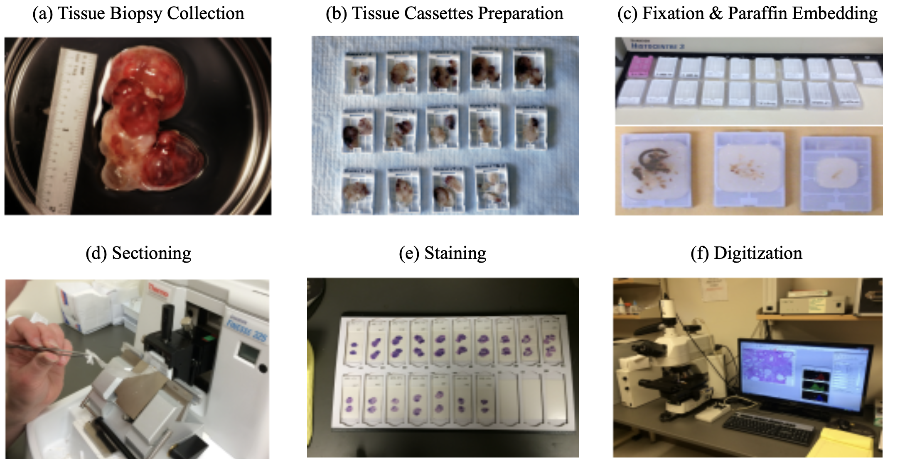
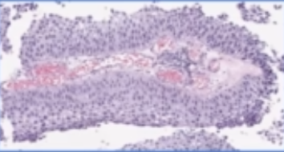
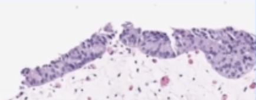
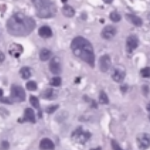

{:toc}

- ECT - shock therapy given to brain when patient is struggling with severe mental illness (~100k patients in the US / year)

# alzheimer's

- 
- overview
	- age-associated - tons of people get it
	- doesn't kill you, secondary complications like pneumonia will kill you
	- rate is going up
	- very expensive to treat
- *declarative* memories are affected by Alzheimer's
	- these are memories that you know
- first 2 areas to go in Alzheimer's
	1. *hippocampus*
		- patient HM had no hippocampus
			- no *anterograde* memory - learning new things
		- hippocampus stores 1 day of info
			- offloading occurs during sleep (REM sleep) to prefrontal cortex, temporal lobe, V4
			- dreaming - might see images as you are offloading
	2. *basal forebrain* - spread synapses all over cortex
		- uses *Ach*
		- ignition key for entire cortex
- alzheimer's characteristics only found in autopsy
	- *amyloid plaques*
		- maybe *A-beta* causes it
		- A-beta comes from *APP*
		- *A-beta42* binds to itself 
			- prion (starts making more of itself)
			- this cycle could be exacerbated by injury
			- clumps and attracts immune system which kills local important cells
				- this could cause Alzheimer's
			- rare genetic mutations in A-beta increase probability you get Alzheimer's
			- anti-inflammation may be too late
			- can take drugs that increase Ach functions - ex. cholinergic agonists, cholinesterase inhibitors
	- *tangles*
		- tangles made of protein called *Tau*
	- most people think these are just dead cells resulting from Alzheimer's but some think they cause it

# parkinson's

- loss of substantia nigra pars compacta dopaminergic neurons
	- when you get down to 20% what you were born with
	- dopaminergic neurons form *melanin* = dark color
	- hits to head can give inflammation
- know what they need to do - don't have enough dopamine to act
- treat with L Dopa -> something like dopamine -> take out globus pallidus
- *Lewy bodies* are clumps of *alpha synuclein* - appear at dopaminergic synapses
	- clumps like A-beta42
	- associated with early-onset Parkinson's (rare) associated with genetic mutations
- *bradykinesia* - slowness of movement
- age can give parksinson's
- no evidence that toxins can induce parkinsons
- *PTP/ pesticides* can induce Parkinson's in test animals
- 1/500 people

# pathology

## basics

- **pathologists** work with tissue samples either visually or chemically
   - *anatomic* pathology relies on the microscope whereas *clinical* pathology does not
- pathologists convert from tissue image into written report
- when case is challenging, may require a second opinion (v rare)
- steps (process takes 9-12 hrs): 
   - tissue is surgically removed
      - more tissue collected is generally better (gives more context)
      - this procedure is called a *biopsy*
      - much is written down at this step (e.g. race, gender, locations in organ, different tumors in an organ) that can't be seen in slide alone
   - fixation: keeps the tissue stable (preserves dna also) - basicallly just soak in formalin
   - dissection: remove the relevant part of the tissue
   - tissue processor - removes water in tissue and substitute with wax (parafin) - hardens it and makes it easy to cut into thin strips
   - microtone - cuts very thin slices of the tissue (2-3 microns)
   - staining
      - **H & E** - hematoxylin and eosin stain - most popular (~80%) - colors the cells in a specific way, bc cells are usually pretty transparent
         - hematoxylin stains nucleic acids blue
         - eosin stains proteins / cytoplasm pink/red
      - **immunohistochemistry (IHC)** - tries to identify cell lineage: 10-15%
         - identifies targets
         - use antibodies tagged with chromophores to tag tissues
      - gram stain - highlights bacteria
      - giemsa - microorganisms
      - others...for muscle, fungi
   - viewing
      - usually analog - put slide on something that can move / rotate
      - whole-slide image (WSI) - resulting entire slide
         - tissue microarray (TMA) - smaller, fits many samples onto the same slide
      - with paige: put slide through digital scanner (only 5% or so of slides are currently digital)
   - later on, board meets to decide on treatment (based on pathology report)
      - usually some discussion betweeon original imaging (pre-biopsy) and pathologist's interpretation
   - resection - after initial diagnosis, often entire tumor is removed (**resection**)
- how can ai help?
	- can help identify small things in large images
	- can help with conflict resolution
- after (successful) neoadjuvant chemotherapy, problem becomes more difficult
   - very few remaining cancer cells
   - cancer/non-cancer cells become harder to distinguish (esp. for prostate)
   - tumor bed is patchily filled with cancer cells - need to better clarify presence of cancer

## papers

- [Deep Learning Models for Digital Pathology](https://arxiv.org/abs/1910.12329) (BenTaieb & Hamarneh, 2019)
   - note: alternative to histopathology are more expensive / slower (e.g. molecular profiling)
   - to promote consistency and objective inter-observer agreement, most pathologists are trained to follow simple algorithmic decision rules that sufficiently stratify patients into reproducible groups based on tumor type and aggressiveness
   - magnification usually given in microns per pixel
   - WSI files are much larger than other digital images (e.g. for radiology)
   - DNNs can be used for many tasks: beyond just classification, there are subtasks (e.g. count histological primitives, like nuclei) and preprocessing tasks (e.g. stain normalization)
   - challenge: multi-magnification + **high dimensions** (i.e. millions of pixels)
      - people usually extract smaller patches and train on these
         - this loses larger context
         - one soln: pyramid representation: extract patches at different magnification levels
         - one soln: stacked CNN - train fully-conv net, then remove linear layer, freeze, and train another fully-conv net on the activations (so it now has larger receptive field)
         - one soln: use 2D LSTM to aggregate patch reprs.
      - challenge: annotations only at the entire-slide level, but must figure out how to train individual patches
         - e.g. use aggregation techniques on patches - extract patch-wise features then do smth simple, like random forest
         - e.g. treat as weak labels or do multiple-instance learning
            - could just give slide-level label to all patches then vote
      - can use transfer learning from related domains with more labels
   - challenge: class imbalance
      - can use boosting approach to increase the likelihood of sampling patches that were originally incorrectly classified by the model
   - challenge: need to integrate in other info, such as genomics
   - when predicting histological primitives, often predict pixel-wise probability maps, then look for local maxima
      - can also integrated domain-knowledge features
      - can also have 2 paths, one making bounding-box proposals and another predicting the probability of a class
      - alternatively, can formulate as a regression task, where pixelwise prediction tells distance to nearest centroid of object
      - could also just directly predict the count
   - can also predict survival analysis 
- [Clinical-grade computational pathology using weakly supervised deep learning on whole slide images](https://www.nature.com/articles/s41591-019-0508-1) (campanella et al. 2019)
   - use slide-level diagnosis as "weak supervision" for all contained patches
   - 1st step: train patch-level CNNs using MIL
      - if label is 0, then all patches should be 0
      - if label is 1, then only pass gradients to the top-k predicted patches
   - 2nd step: use RNN (or another net) to combine info across *S* most suspicious tiles
- [Human-interpretable image features derived from densely mapped cancer pathology slides predict diverse molecular phenotypes](https://www.nature.com/articles/s41467-021-21896-9) (diao et al. 21)
- [An artificial intelligence algorithm for prostate cancer diagnosis in whole slide images of core needle biopsies: a blinded clinical validation and deployment study](https://www.thelancet.com/journals/landig/article/PIIS2589-7500(20)30159-X/fulltext) (pantanowitz et al. 2020 - ibex)
   - 549 train, 2501 internal test slides, 1627 external validation
   - predict cancer prob., gleason score 7-10, gleason pattern 5, perneural invasion, cancer percentage
   - algorithm
      - GB classifies background / non-background / blurry using hand-extracted features for each tile
      - each tile gets predicted probability for 18 pre-defined classes (e.g. GP 3)
         - ensemble of 3 CNNs that operate at different magnifications
      - aggregation: 18-probability heatmaps are combined to calculate slide-level scores
         - ex (for predicting cancer): sum the cancer-related channels in the heatmap , apply 2x2 local averaging, then take max

## datasets

- [ARCH](https://warwick.ac.uk/fac/cross_fac/tia/data/arch) - multiple instance captioning dataset to facilitate dense supervision of CP tasks

# cancer

## overview

- **tumor** = neoplasm - a mass formation from an uncontrolled growth of cells
   - benign tumor - typically stays confined to the organ where it is present and does not cause functional damage
   - malignant tumor = cancer - comprises organ function and can spread to other organs (**metastasis**)
- relation network based aggregator on patches
- lymphatic system drains fluids (non-blood) from organs into *lymph nodes*
   - cancer often mestastasize through these
- **staging** - describes where cancer is located and where it has spread
   - **clinical staging** - based on non-tissue things
   - **pathological staging** - elements of staging pTNM
      - size / depth of *tumor* "T"
      - number of lymph *nodes* / how many had cancer "N"
      - number of *metastatic* foci in non-lymph node organ "M"
      - these are combined to determine the cancer stage (0-4)
- **prognosis** - chance of recovery

### treatments

- chemo
   - traditional chemotherapy disrupts cell replication
      - hair loss and gastrointestinal symptoms occur bc these cells also rapidly replicate
   - *adjuvant* chemotherapy - after cancer is removed, most common
   - *neoadjuvant* chemo - after biopsy, but before resection (when very hard to remove)
- targeted therapies
   - ex. address genetic aberration found in cancer cells
   - immunotherapy - enhance body's immune response to cancer cells (so body will attack these cells on its own)
      - want the antigens on the tumor to be as different as possible (so they will be characterized as foreign)
      - to measure this, can conduct total mutational burden (TMB) or miscrosatellite instability (MSI) test
         - genetic tests - hard to do by looking at glass slide
      - some tumors express receptors (e.g. CTLA4, PD1) that shut off immune cells - some drugs try to block these receptors

## prostate cancer

- tests
   - feel with finger
   - antigen test - blood test
   - ultrasound - probe inserted
   - biopsy - needle inserted to take out tissue
- grading
   - stages (they have subdivisions, e.g. IIA, IIB, IIC)
      - I - early, slow-growing
      - II - small, but risky
      - III - likely to spread
      - IV - has spread beyond the prostate
      - recurrent - has come back after treatment
   - in addition to stages 0-4, prostate cancer is also given **Gleason score**
      - look at 2 biggest cancer regions and identifies them as a **Gleason pattern** from 3 (best) to 5 (worst)
      - this results in a sum (e.g. 5+4, 3+4) - note 3+4 is not same as 4+3
- treatments
   - prostatectomy - remove the prostate
   - radiation therapy - kills specifically cancer cells
   - radiative seed implants - implated into prostate to kill cancer cells
   - cryotherapy - kill prostate cancer cells by freezing them
   - hormone therapy - block hormone which grows prostate cancer cells
   - chemotherapy
- human benchmarks

   - [Interobserver Variation in Prostate Cancer Gleason Scoring: Are There Implications for the Design of Clinical Trials and Treatment Strategies?](https://www.clinicaloncologyonline.net/article/S0936-6555(97)80005-2/pdf)
      - 71 patients, 213 scored observations, 3 pathologists
      - weighted pairwise kappas: 0.16, 0.29, 0.23
      - (unweighted): 0.15, 0.29, 0.24
   - [Interobserver reproducibility of Gleason grading of prostatic carcinoma: General pathologists](https://www.sciencedirect.com/science/article/abs/pii/S0046817701974568)
      - 38 biopsies, 41 pathologists
      - consensus grade groups: [2-4, 5-6, 7, 8-10]
      - overall kappa: 0.435
   - [Interobserver variability in Gleason histological grading of prostate cancer](https://pubmed.ncbi.nlm.nih.gov/27416104/)
      - 407 slides, 2 pathologists
      - primary gleason: k=0.34
      - secondary gleason: k=0.37
      - sum: k=0.43
- ai papers
   - [Learning Whole-Slide Segmentation from Inexact and Incomplete Labels using Tissue Graphs](https://arxiv.org/abs/2103.03129) (anklin et al. 2021)
      - SegGini, a weakly supervised segmentation method using graphs
         - constructs a tissue-graph for WSI (node is tissue region)
         - weakly-supervised segmentation via node classification
      - data
         - [UZH dataset](https://www.nature.com/articles/sdata201714) - 5 five TMAs with 886 spots (each 3100×3100 pixels) with complete pixel-level annotations and inexact image-level gradess
         - [SICAPv2 dataset](https://www.sciencedirect.com/science/article/abs/pii/S016926072031470X) - 155 WSIs and 18,783 tiles of size 512×512 with complete pixel annotations

## bladder cancer

- tests
   - urinalysis - look for things like blood in urine
   - urine cytology - use microscope to look for cancer cells in urine
   - urine tests for specific tumor parkers
   - cystoscopy - invasive lens takes image of bladder
   - tests lead to a biopsy
   
- grading
   - invasiveness: can be non-invasive, invasive (grows into deeper layers of bladder)
      - superficial = non-muscle invasive - hasn't grown into main muscle layer of bladder
   - grade: again asigned stages 0 - IV based on TNM
      - low-grade = well-differentiated
      - high-grade (worse) = poorly differentiated, undifferentiated
   
- human benchmark
   - [The reliability of staging and grading of bladder tumours. Impact of misinformation on the pathologist's diagnosis](https://pubmed.ncbi.nlm.nih.gov/8290915/) (olsen et al. 1993)
      - 4 consultant pathologists
      - 40 biopsy specimens of bladder tumours staging invasion
         - grading using Bergkvist classification
      - kappa < 0.50
   
- ai papers
   - [Bladder cancer in the time of machine learning: Intelligent tools for diagnosis and management](https://journals.sagepub.com/doi/abs/10.1177/0391560320987169) (2021)
      - bladder cancel ranks tenth in worldwide absolute cancer incidence
   - non-pathology
      - [Integrating Diagnosis Rules into Deep Neural Networks for Bladder Cancer Staging](https://dl.acm.org/doi/abs/10.1145/3340531.3412122) - bladder cancer staging from MR images
      - [Deep Learning Approach for Assessment of Bladder Cancer Treatment Response](https://www.ncbi.nlm.nih.gov/pmc/articles/PMC6403041/) - bladder cancer treatment assessment from CT scans
   - cystoscopy - few DNN papers here
   - pathology
      - [Urinary Bladder Tumor Grade Diagnosis Using Online Trained Neural Networks](https://link.springer.com/chapter/10.1007/978-3-540-45224-9_29) (2003)
         - 92 patients with BC
         - 90%, 94.9%, and 97.3%, for Grade I, II, and III respectively
         - builds on [Neural network-based segmentation and classification system for automated grading of histologic sections of bladder carcinoma](https://europepmc.org/article/med/12508689) (2002)
      - [Deep Learning Predicts Molecular Subtype of Muscle-invasive Bladder Cancer from Conventional Histopathological Slides](https://pubmed.ncbi.nlm.nih.gov/32354610/) (woerl et al. 2020) - predict *molecular subtype* using histopathology images in Cancer Genome Atlas Urothelial Bladder Carcinoma dataset
   
- bladder basics

   - muscles in bladder contract and force urine out

      - *urethelium* - inner layer that is able to stretch (has many layers) - this is where cancer originates

         - in situ - cancer only here
         - invasive - goes into the muscle
            - if it goes into the urine, can easily test (also usually triggers blood in the urine)
      - biopsy usually looks mostly at urethelium and vessels right next to it (will not go all the way to the muscle, as this could puncture the bladder)
      
         - very targeted (unlike prostate biopsy), slide will come with some tag like "in area with redness" from scopy
            - 4 possibilities
               - big mass - should see cancer
               - inflammation - could be cancer or many other things (e.g. atypia vs carcinoma)
         - get many parts / sites of biopsies

**H & E slide**

- shape:

| papillary                                   | flat                                          | can also have a combo |
| ------------------------------------------- | --------------------------------------------- | --------------------- |
|  |  |                       |

- grade: 

| low                                                     | high                                                      |
| ------------------------------------------------------- | --------------------------------------------------------- |
|  |  |

- when shape is flat, grade often can't be determined reliably
   - lots of names for uncertain (e.g. upump - uncertain malignant potential, or atypia)
- much easier to decide shape than grade
- once you find high grade, look for invasiveness (and deeper layers are worse)