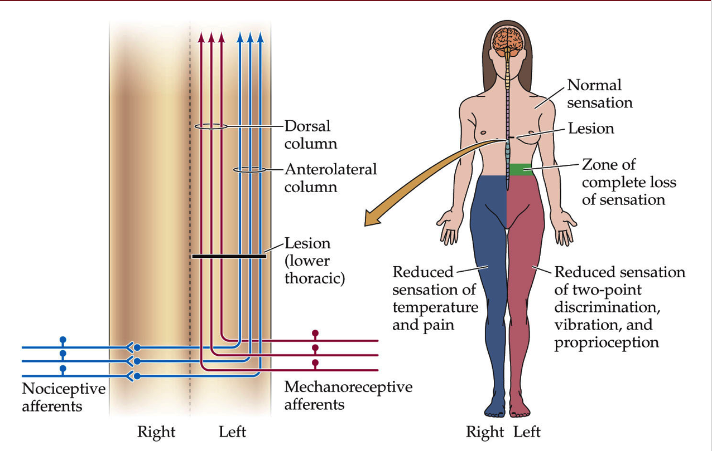
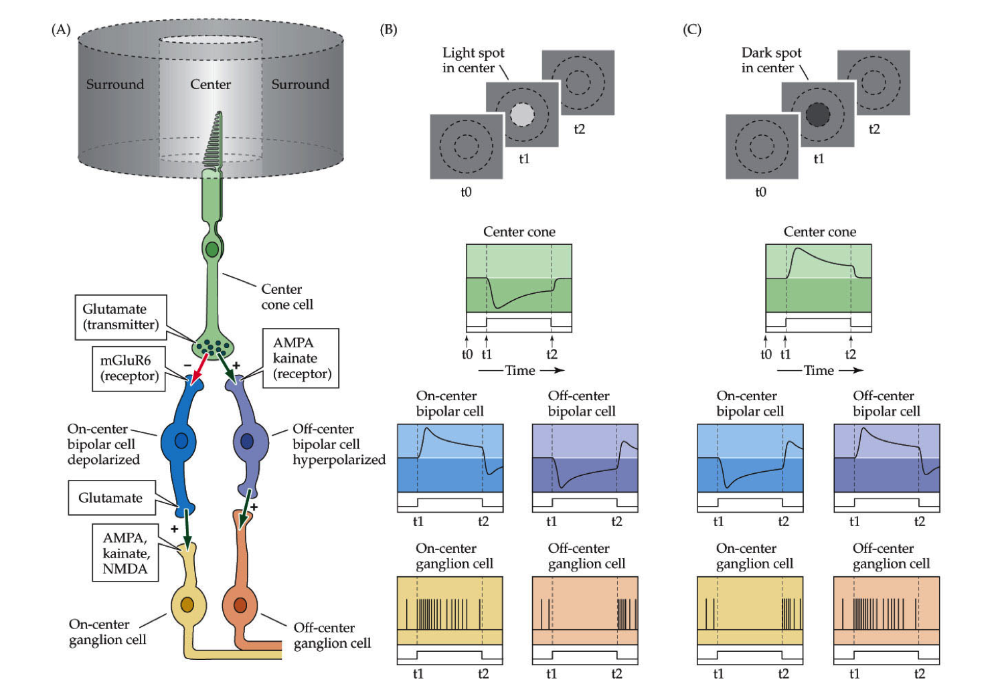
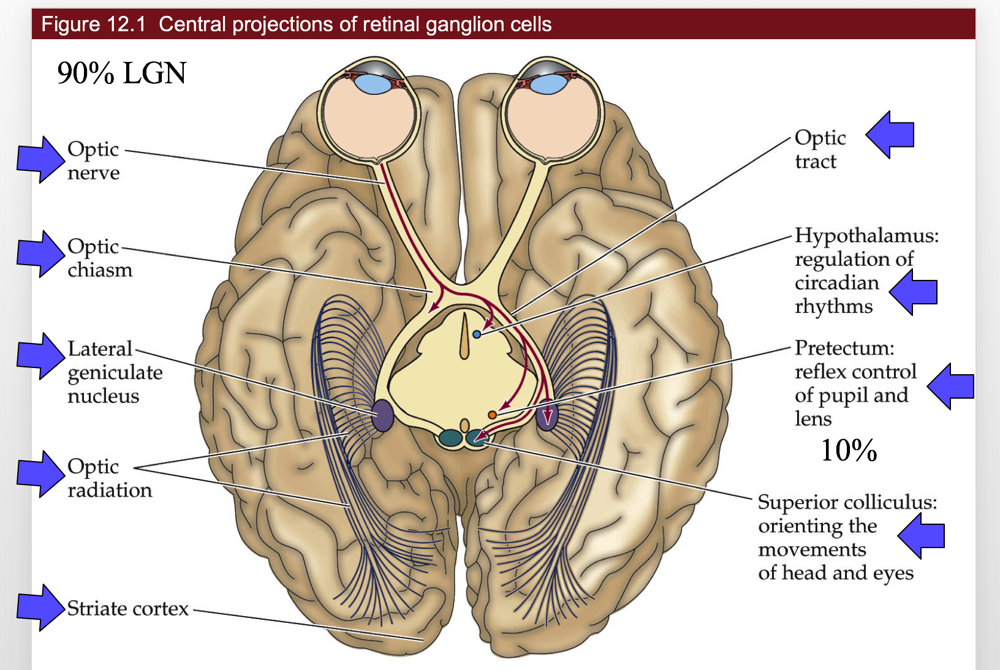
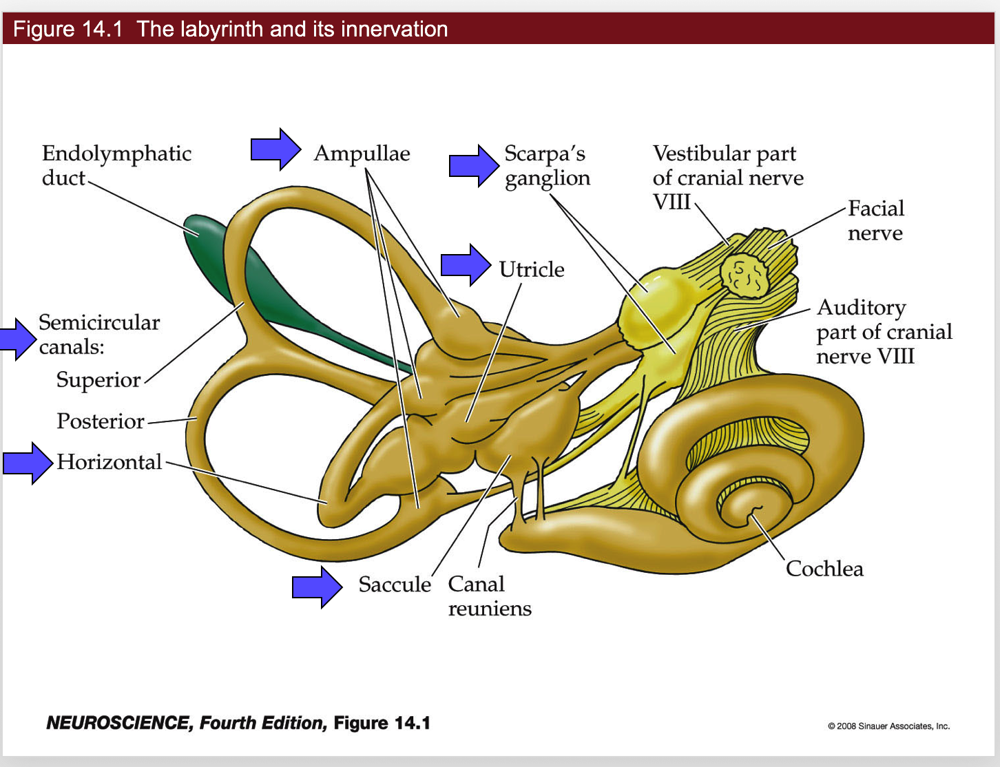
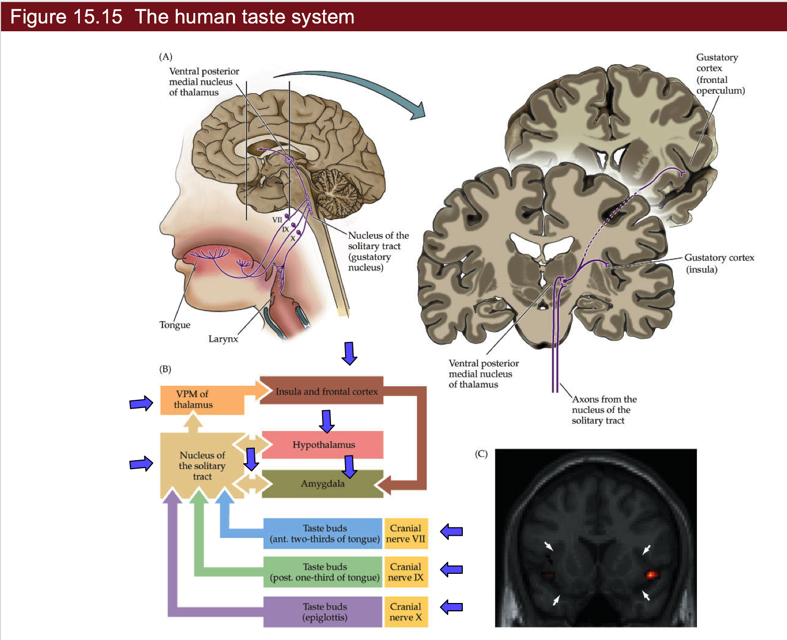

{:toc}

# 9- somatosensory
## cheat sheet
- vocab
	- *nerve* - bundle of axons
	- *tract* - bundle of axons in CNS
	- *nucleus* - bundle of neurons related to some function
	- *midline* - center of nervous system
		- brain tends to be lateralized - one side is given control
		- ex. speak almost exclusively from left side of brain
- information processing
	1. feedback (gain) 
		- almost always with glutamatergic  / GABA
	2. feedforward - anticipation
		- estimate things before they happen
		- adjust your behavior in advance of the world (ex. lean before you hit a table)
	3. center-surround inhibition (spatial gain)
		- if you touch yourself, brain enhances sensitivity of one point by suppressing information from around it

## sensory system overview
- we have dorsal root ganglia (DRG) on spinal cord
	- axon goes to CNS
	- dendrites go everywhere
	- *pseudounipolar* - born polar but become uni-polar
		- dendrite goes straight into axon with cell body off to the side
	- do very little processing
- *dorsal horn* - top layer that controls sensory information
- in the brain stem, these are called cranial ganglia
	- special one is trigeminal ganglia (sensory receptors for face)
- oxytocin important clinically
- Trp channels - connected mechanically into membrane
- *dermatomes*
	- map of sensory parts to brain
	- segments of spinal cord correspond to stripes across your body
	- brain to feet: cervical, thoracic, lumbar, sacral
- *shingles* - virus where you get stripes of sores - single DRG
	- pops out the skin on the dendrite of one DRG
- peripheral damage won't give you stripes of pain
- feeling resolution - depends on density of neurons innervating skin
	- more neurons - small receptive fields
	- two-point discrimination test - poke you at different points and see if you can tell if the points are different
	- higher discrimination is better
	- *discrimination* is different that *sensitivity* (like how it hurts when wounded)

## 4 neuron classes
- they have certain structures that tune them into certain kinds of vibrations
	1. *Proprioception*
		1. muscle spindles - on every neuron - fastest
			- measures stretch on every muscles
			- lets you know where your arm is
		2. Golgi tendon organ
			- measures tension on tendon
			- safety switches - numb your body if you're over-stressing something (make you let go of hanging on cliff)
	2. Ia II - *touch neurons*
		- superficial - most sensitive
			1. Merkel: hi-res, slow adapt
			2. Meissner: hi-res, fast adapt
		- deeper - sense vibrations, pressure
			3. Ruffini: low-res, slow adapt
			4. Pacinian: low-res, fast adapt
		- these are in order of depth
		- diabetes - tissue loss and pain / numbness are lost
	3. Adelta - fast pain
	4. C fibers - pain, temperature, itch
		- very slow, stay on
		- no myelination
	-  Pruritus - newly discovered set of sensory neurons
		- between pain/touch - itch neurons
		- new in mice: massage neurons
			- can only fire by stimulating in certain pattern
			- goes to emotion center not knowledge - pleasure
- speed proportional to diameter, myelination
- adaptation 
	- some adapt slowly (you keep feeling something)
	- some adapt quickly (stop feeling)
		- if you move finger slightly, start firing again when changed
		- better if you feel cockroach that starts moving

## pathways
- upper-body
	- *S1 cortex* - primary somatic sensory cortex - this is the knowledge of where was touched
	- *VPL* - everything accumulates here in the thalamus then goes to 
	- *Cuneate nucleus* - everything goes into this
- lower-body (trunk down)
	- everything in the lower body goes to *Gracile nucleus* - in brain stem
- special case - sensory for face
	- *trigeminal ganglion* connects into *vpm* (thalamus) then goes into *S1 cortex*
- proprioceptive pathways
	- starts in lower body
		- axons split - half go up to *Clark's nucleus*
			- half go back into muscles
		- Clark's nucleus goes straight into cerebellum
	- starts in upper body - goes straight into cerebellum
	- thus cerebellum have map of where / how tense muscles are

## representation
- cortex - this is where understanding is
	- dedicates area based on how many neurons coming in
		- lips / hands have more area
	- S1 - primary somatosensory cortex
		- most body parts
		- neurons from functionally distinct columns
		- cortex assigns space based on how much info comes in
			- after amputation and time, map grows into lost space
			- map is different when different stimuli are given to fingers
	- S2 - secondary somatosensory cortex
		- processes and codes information from S1
		- throat, tongue, teeth, jaw, gum

## pathway
- mechanosensory
	1. DRG
	2. Cuneate, Gracile
	3. VPL
	4. S1
- face mechanosensory
	1. trigeminal ganglion
	2. principal nucleus of trigeminal complex
	3. vpm
	4. S1
- proprioception
	- lower body	
		1. muscle spindles split
		2. half go to motor neurons
		3. other half go to Clark's nucleus
		4. clark's nucleus -> cerebellum
	- upper body - straight to the cerebellum

# 10 - nociception
## review
- chronic pain is very import clinically
- cortex - lets you know if you are sensing something
	1. *loss-of-function lesion* - piece of cortex is lost - lose awareness
		- can come from stroke, migraine-aura
	2. *gain-of-function lesion* = excitatory lesion - like epilepsy
		- cortex comes on when it shouldn't
		- increased awareness
		- can come from stroke / migraine
- "sixth sense" - measuring stretch of all your muscles in cerebellum
- *nociception* = pain
	- has *nociceptors* - neurons that do nociception
	- *thermoceptors* - neurons that sense temperature
- two classes of linking receptors
	1. Adelta fibers - fast pain
	2. C fibers - slow and chronic
- Trp channels - mechanically or thermally gated
	- let Na+ in
	- trpV heat - binds capsaicin
		- in the class of vanilloids
		- birds not capsaicin sensitive
	- trpM cold - binds menthol
		- adapts in minutes - stop feeling cold after a while
- synapses of nociceptors go to dorsal horn of drg
	- nociceptor goes contralateral (must cross midline) - if you cut left side of spinal chord, lose - mechanoception (ipsilateral) from left and nociception (contralateral) from right
	- mechanoreceptors, by contrast, send axon up the spinal cord
	- dorsal horn has laminal structure (has layers)
1. know where pain is
	- somatosensory cortex
2. care about pain
	- *insular cortex* - emotional part of brain
		- whether or not you care about pain
		- pairs up with other senses
- can have both loss-of-function and gain-of-function lesions in both places
- referred pain map - map that refers to a specific problem (ex. esophagus)
- *visceral pain* - don't know where the pain is
- *hyperalgesia* - increased pain sensitivity
	- pain sensing neurons are hyperactive because of inflammation
	- pain sensing neuron releases substance P into Mast cell or neutrophil which releases histamine which strengthens receptor
	- prostaglandins activate nococeptors
- *allodynia* - when mechanosensation hurts - not understood
- turning off pain - add serotonin
	1. exercise
	2. lack of serotonin ~ mood disorders
	- central sensitization: allodynia
- these mechanisms work through *introception*
	- senses chemical imbalances
- phantom limbs and phantom pain - if you lose a limb and still feel pain
- *mechanoreceptors inhibit nociceptors*

## pathway
- nociception
    - 
	- same as mechanosensory except goes all the way to thalamus
		- doesn't stop in brainstem
	- crosses the midline after first synapse
- visceral pain
	- axons mainline straight up, go through vpl, go straight to insular cortex

# 11 - vision (eye)

- most of visual system is to read faces
- eye
	- aqueous humor
	- posterior chamber
	- lens
	- ciliary muscles
	- retina
	- fovea
	- optic disk
	- optic nerve and retinal vessels
- to see far, stretch lens = *accomodation*
- retina - rods and cones are at back
	- cones - color
	- retinal ganglion cells sends down signal
- 12 days to turnover whole photoreceptor disks into PE (pigment epithelium)
	- PE is what the rods / cones are in
	- PE contains optic disks containing rhodopsin protein that is sensitive to light that break off of rods / cones
- light leads to inhibition
- melanopsin - receptor for blue light

## circuits
- accomodation - stretching lens uncrosses lines
- function photoreceptor
	- usually cGMP is letting in Na/Ca
		- Ca provides negative feedback here
	- when light hits, retinal inside rohodopsin activates phosphodiesterase - breaks down cGMP so channel closes and they aren't let in
- light on middle
	- depolarizes cone
	- excites oncenter
	- inhibits offcenter
	- these adjust quickly
- horizontal cells - takes positive input from photoreceptor and inhibits it back
	- inhibits horizontal cells else around it - creates contrast
	- have these for each color

## pathway
- 
1. rods / cones
(2). horizontal cells - regulate gain control, how fast adapts, contrast adaptation
3. bipolar cells
(4). amacrine cells - processing of movements
5. retinal ganglion cells
6. go into thalamus then to cortex
(6). small amount go into brain stem and control mood / circadian rhythms

# 12 - central visual system
- cortex is a pizza box
- has columns
- autophagy - process by which cells eat parts of themselves
	- nobel 2016
- cones - color
- 12 day cycle for processing optic disks
- photoreceptors have cyclic G-activated channel
	- light shuts down photoreceptors
	- cell decreases in activity
- very roughly - each cone connects to cone bipolar cell
	- this gets represented by one column in the cortex
- 15-30 rods connect to 1 rod bipolar cells
- cortex has 6 layers
	- each has tons of neurons, mostly pyramidal neurons
	- column is a section through the 6 layers - all does about the same thing
	- orientation columns responds to specific x,y
		- has subregions that respond to specific orientations
- ocular dominance column - both eyes for same coordinate go to same spot
	- dominated by one eye
- distance
	- far cells
	- tuned cells
	- near cells
- *V4* in temporal lobe - object recognition

## pathways
- 
- overall
	1. V1
	2. V2
	3. V4 or MT
- central projections
	- retinal ganglions
	- all go through optic stuff
	
# 13 - auditory system
- ear parts
	- outer
	- middle
		- tympanic membrane
	- inner
		- cochlea - senses the sound
		- oval window
		- round window - not understood
- conductive hearing loss - in the outer/middle ear
- sensorineural hearing loss - in the cochlea
	- can't be fixed with hearing aids
- humans
	- 2-5kHz ~= human speech (can sometimes hear more)
	- 30-100x boost for tympanic membrane
		- this differs between people
	- 200x focus onto oval window
- cochlea
	- 4 layers
		- inner hair cells - what you hear with
		- outer hair cells - generate sound
			- generates noise at every frequency except one you want to hear
	- otoacoustical emmision - low buzz that is produced
	- tenitis - ringing in the ears
		- can be internal
		- can be peripheral - generated by otoacoustical emmision
	- high frequencies right next to cochlea
	- low frequencies on distal tip
	- human high frequency cells die with age
- hair cells
	- bundle of cilia
	- have an orientation
	- kinocilium is the tallest
	- tall ones are in the back
	- dying hair cells - can't be replaced
		1. ​
		2. loud sounds
		3. certain antibiotics
- auditory pathwayz
	- *MSO - medial superior olive* - decides where the sounds is coming from
		- takes input from right / left ear, decides which came in first
	- medial geniculate complex of the thalamus
- brain shape
	- folds are pretty random
	- phrenology - shape of skull was based on brain
		- thought it could determine personality
		- false
		- Hsechl's Gyrus folding pattern is not random
			- argument that if you have one, you are more musical
- any sounds is made up of a bunch of frequencies

## circuits
- K depolarizes hair cells, lets in Ca, releases vesicles

# 14 - vestibular system
- very related to cochlea
	- same hair cells
- differences
    - 
	1. vestibular system doesn't use cortex (you don't think about it)
		- goes right into spinal chord
	2. controls eye movements
		- one of the fastest circuits in the brain
	- clinically important
		- you have to be able to have your balance
1. each column is computational unit of the cortex
2. ocular dominance column
	- one for each eye
- labyrinth and its innervation
	- semicircular canals
		- can only measure one axis of rotation
		- remember *horizontal canal* - measures turning head left to right
			- this measures acceleration
			- like a hoola hoop filled with glitter
			- has ampulla at one place in the hoop
			- cupula - sits over the ampulla's hair cells
			- if the "glitter" hits the cupula, it will bend the hair cells
			- if you keep spinning, fluid starts moving and you stop detecting movement
				- this means the canals adapt mechanically
			- if you stop spinning, fluid keeps moving and system thinks you're spinning the other way
			- right horizontal canal activated by turn to the right
				- same for left
	- scarpa's ganglion - has hair cells inside
		- sends axons into vestibular nuclei
	- lots of fluid (high in K+)
	- macula - place where all the hair cells are
		- Ampullae - at base of canals
			- hair cells all in the same direction
		- utricle and saccule - measure head tilt
			- hair cells in multiple orientations
			- these contain otoconia
				- these are little crystals that move with gravity
				- measure acceleration and tilt
- tilts do not adapt - they keep firing while you're leaned back
	- they basically report tilt / position at all times
- tiplink - connect cilia together for hair cells
	- when they move, tiplink move, pull on ion channels
	- motor on connected hair cell moves up and down to generate correct amount of tension
		- motor uses myosin and actin
		- harming these proteins can cause deafness
- both eyes must always be looking in the same direction
	- also must be sitting over image for a while
- *ipsilateral* - same side
- contralateral - different side
- vestibular ocular reflex VOR - turn your head to the right, eyes move left
	- doesn't require cortex
	- only have to learn excitatory
	
# 15 - chemical senses

- cAMP is used by GPCR