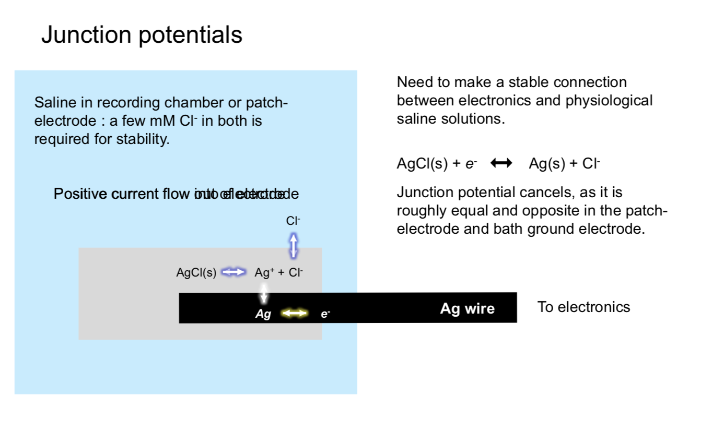
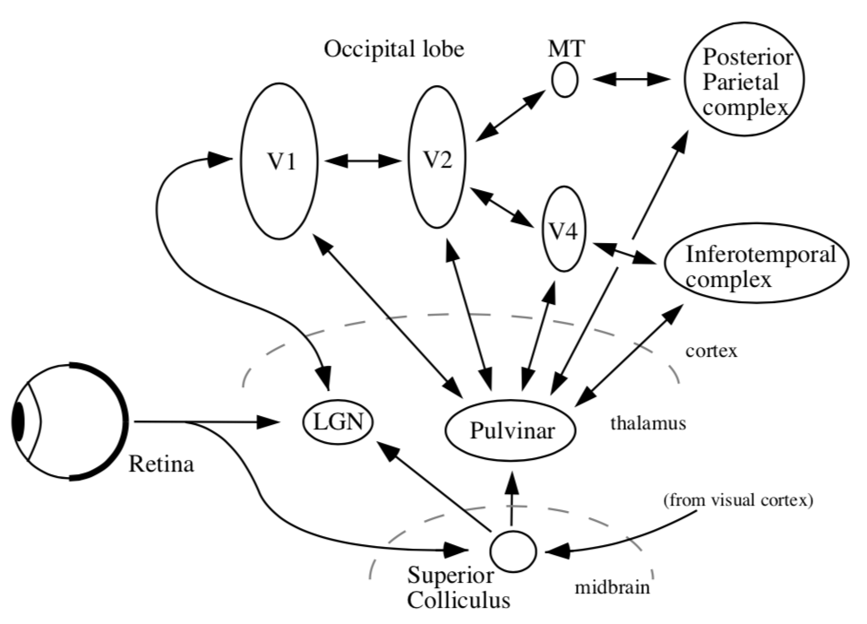

{:toc}

# neural signals

- ion channel properties
  - gating energy - how is the channel activated
  - ionic selectivity - which ions pass through
- high ap velocity when these are high
  - channel density
  - channel kinetics
  - axon diameter
  - axon surface resistance
  - $\lambda = \sqrt{\frac{r_m}{r_a}}$
- synapse types
  - electrical
  - chemical
- postsynaptic receptors
  - ionotropic receptors - directly gated
  - metabotropic receptors - indirectly gated through 2nd messengers
- If ion reversal potential is 0 (ex. $E_{Cl}$ sometimes) then shunting = divisive inhibition

# electrophysiology

- EEG - whole brain
- ERG (electroretinogram) - whole retina
- single cell
  - sharp micro-electrode - has problems
    - high resistance
    - poor seal with membrane
    - mechanically unstable
  - patch recording - uses suction to overcome powers
    - Flaw: bad for studying second-messenger systems because inside of electrode / cell fuse
    - different types (whole cell, outside-out, inside-out)
- clamp 
  - 
  - 
  - 
- types
  - whole-cell
  - cell-attached
  - inside-out
  - outside-out
  - whole cell perforated - generally better, but difficult
- recording types
  - current-clamp - record potential
  - voltage clamp - record current - most common
  - conductance-clamp - complicated
- IV curve - measured with voltage clamp
  - V - voltage clamped at
  - I - maximal current evoked by clamping at this voltage
- 

# recording + imaging

## electrode arrays

- multi-electrode array recording (MEA)
  - well-suited for retina
  - can now get several thousand electrodes
  - put retina onto MEA to record ganglion cells
  - waves of activity spread accross retina during development - probably important for wiring retina
  - patch ~ 500µm accross
- spike sorting
  - cluster spikes from different neurons based on amplitude, wave shape, refractory period violations
- spatiotemporal white noise stimulu - sequence of stimulus frames with randomly assigned pixel intensities (Bernoulli or Gaussian)
- *spike-triggered average stimulus* - averagin frames that correspond to spikes - yields receptive field
  - requires finding timing (too short and spike won't fire, too long and won't repeatedly fire)
- retinal cell ganglion classification
  - cluster by STA timecourse and autocorrelation pca
  - after clustering, receptive fields of any cluster don't overlap too much
- cell mosaics - ganglion cells tile entire retina
- ganglion cell receptive field instead of one blob is several small blobs (the cone array)
  - each blob corresponds to one cone cell
- cones: red, green, blue cones are random
  - ganglion midget cells contain color information - make red-green connections
  - this is found in STA
  - connects to broad set of cells, not just closest

## imaging - voltage

- **voltage-sensitive dyes** - would be great
  - could provide spatially localized, non invasive recordings
  - doesn't exists - usually toxic and inefficient (small fluorescence change / voltage change)
    - APs short and small area limiting number of photons
    - subthreshold PSPs (postsynaptic potentials) only have small voltage change
  - electrochromic - fast, low-sensitivity
  - quenching/FRET - slow, high capacitance
  - photo-induced electron transfer - fast, high sensitivity, low capacitance
    - currently being developed by evan miller at berkeley in chemistry
    - problem - lights up all the cells - trying to target a cell with genetics
- **calcium imaging** 
  - calcium influxes into cell through a variety of mechanisms
  - calcium indicators
    - original: aequorin - bioluminescent protein from jellyfish
    - calcium indicator - calcium binds to fluorophore and changes its shape, which changes its fluorescence
    - fret-based - calcium brings together two proteins
    - now most common: GCaMPs
  - two-photon imaging in the retina
    - infrared stimulus to drive laser (can't use light, would stimulate retina)
    - T. Euler has been leader in this field
      - can simultaneously attach electrode and measure single spikes while calcium imaging
    - Ca signal slower than electrical signal - can lose some things
    - lots of functional types of retinal ganglions cells (>32?)
      - respond to different stimuli
      - different morphology

# rod and cone photoreceptor function

- retina - large metabolic rate
  - at the back of the eye, fairly regular array
  - ~1.2 mil optic nerve fibers
- 
- pigment absorbs stray photons to reduce noise
- cones
  - ~6 mil cones
  - low sensitivity
  - fast responses
  - don't saturate
  - selective for the direction of light rays
- rods
  - ~120 mil 
  - high sensitivity to light
  - slow responses
  - saturate
- 
- *photo-transduction* - converts photons into voltage-changes
- terminals
  - cone *pedicle*
  - rod *spherule*
  - glutamate release modulated by voltage + Ca

# horizontal cells - outer retinal signaling and lateral inhibition

- on-center - responds to white small circle
- off-center - responds to black small circle
- horizontal cells - if you make circle to big, these inhibit the photoreceptors
- adjust for mean by shifting calcium with hc surround antagonism (5 possible biphysical mechanisms)
  - extracellular pH
  - ephaptic mechanism
- natural scenes contain strong spatial correlations
  - *predictive coding* - use surrounding regions to predict the center value
  - subtract predicted value from actually measured value
  - send nothing if you could have predicted, otherwise info you send is *interesting*

# signaling pathways through the retina - amacrine cells and inner retinal processing of visual information

- bipolar cells begin parallel signalling in the visual system
- amacrine cells - generally modulate bipolar cells / ganglion cells
  - very structurally diverse: *glycinergic* = narrow-field, *GABAergic* = wide-field
- way more cones than ganglion cells
- ganglion cells have object motion sensitivity
  - generated by lateral inhibition
- *starburst amacrine cells* - generate directional signals in the retina

# retinal ganglion cells

- takes inputs from bipolar cells

## primate retina

- primate retina has 2 major types of ganglion cells
  1. midget ganglion cells  (~75%) - majority, high spatial acuity
     1. parvocellular pathway
  2. parasol ganglion cells (~15%) - high temporal resolution
     1. magnocellular pathway
  3. little known about most other types of ganglion cells
- we don't have aliasing because visual system filters out the high frequencies
- color
  - red-green keeps center surround
  - blue-yellow doesn't
- direction-selective ganglion cells
  - activated when the image moves on the retina
  - specific allele can get rid of these (affects GABAergic starburst amacrine cells)
  - different dendrites represent different directions (inputs are pretty symmetrical)

# non-neuronal retina stuff

## retinal glia

- glia greek for "glue"
- 3 types 
- Muller cells
  - from multiplotent retinal progenitor cells (same that make neurons)
    - in fish, with damage muller cells can become neurons (forced in mammals)
  - abundant, tile the retina
  - functions
    - mechanical support
    - energy storage
    - clearing waste products
    - neurotransmitter recycling (ex. glutamate-glutamine cycling)
    - metabolism
    - K+ homeostasis (uptake and redistribution)
  - disease - *gliosis* - upregulation of intermediate filaments common in many retinal diseases
- astrocytes
  - originate from brain, enter via optic nerve
  - look star shaped
  - functions: lots of neurovascular
    - cell bodies don't move, but processes constantly move
  - disease - become reactive in many retinal diseases
- microglia
  - myeloid origin
  - concentrated in synaptic layers
  - immune cells - phagocytosis
  - disease - activation occurs with / before retinal cell death
  - microglial depletion alters retinal synapses $\implies$ microglia maintain synapses (wang et al. 2016 j neurosci)
  - microglia are highly motile and respond dynamically to stimuli (e.g. neurotransmitters)
  - microglia respond dynamically to injury

## retinal pigment epithelium (rpe)

- monolayer of pigmented, hexagonally-shaped epithelium cells
- surround outer segments of photoreceptors
- cells have tight junctions
- functions
  - main: light absorption
  - epithelial transport - require water + photoreceptor cycling + oxygen
    - photo-oxidation causes damage - photoreceptor tip constantly being phagocytosed, base regenerated - completely renewed in 11 days
  - visual cycle - recycling retinoids
    - number of diseases involve this
  - others: phagocytosis, secretion, glia

## retinal blood supply

- retina has highest metabolic demand of any tissue

- vasculature - eye is only place we can noninvasively view vasculature

  - often diagnose stuff like hypertension / diabetes fom eye

- 2 major blood supplies (non-overlapping)

  1. outer retinal blood supply (past RPE) = posterior ciliary arteries
     1. outer 1/3
     2. bruch's membrane
     3. choroid - helps provide nutrients, cool retina
  2. inner retinal blood supply  = central retinal artery
     1. inner 2/3
     2. no inner capillaries in *foveal avascular zone* - area near fovea (these would block light)

- *blood-retinal barriers (BRB)*

  - outer BRB - tight junctions between RPE cells
    - *fenestrated* - leaky
  - inner BRB - tight junctions between *capillary endothelial cells* 
    - *non-fenestrated*

- autoregulation of retinal blood supply

  - outer - under sympathetic control
  - inner - autoregulated by neuronal demands (neurovascular coupling)

# retinal diseases

- these are the 3 retinal diseases deepmind is studying

## age-related macular degeneration

- degenerates outer retina  (photoreceptors/RPE/choroid) in **macula** = central 5-6 mm of retina (contains fovea, which is central 1.5mm)
- leading cause of vision loss in >50 yo
- big spot missing in center of visual field
- 2 types
  - dry = non-exudative = non-neovascular
  - wet = exudative = neovascular
- usually get dry then wet (worse)
- *OCT* = optical coherence tomography
  - visualizes cross-sectional retina view with infrared

### dry

- **drusen** - show up as yellow spots on fundus image
- **lipofuscin** - undigested material from photoreceptor turniover accumulates in the RPE (and some in Bruch's membrane)
- drusen - leads to degeneration of photoreceptors
  - inflammation - activates immune cells
  - probably death of RPE leads to death of photoreceptors

### wet

- bleeding
- treatments
  - 1980s - burn small holes to reduce oxygen demand
  - 1990s - photodynamic therapy - kind of like cauterizing wound
  - 2000s - anti-vascular endothelial gworth factor (VEGF) therapies
    - stops more leaky vessels from growing
    - must be injected into eye every 1-2 months (maybe longer over time)
    - can recover a decent amount
    - can be very expensive ~10k / dose

## diabetic retinopathy

- leaky blood vessels - often diagnose diabetes through retinopathy
- diabetes types
  - type 1 - autoimmune reaction destroys pancreating $\beta$ cells that produces **insulin**: hyperglycemia + hypoglycemia
  - type 2  - reduced insulin sensitivity: mainly hyperglycemia
    - need insulin injection
- diabetic retinopathy types
  - proliferative
    - very bad
  - non-proliferative
    - *microangiopathy* - mainly affects capillaries
    - patients probably won't notice this unless its in the macula - this is why diagnosis w/ ml could be useful
- neuronal changes seem to precede vascular changes
- treatment - *intravitreal injections of anti-VEGF treatments*

## glaucoma

- optic neuropathy with ganglion cell death and visual field loss
- people say "pressure in the eye" - but this is just a risk factor
- lose your periphery slowly
- *optic nerve*
  - 1-2.2 million ganglion cell axons
  - ~40% of total afferent input to the brain/
- *cup* - region where there are no axons

# experimental methods

- 7 dimensions
	- spatial res.
	- temporal res.
	- depth - how deep in can you image
	- toxicity - does it damage the cells
	- spatial field - how big a region can you see
	- temporal duration (how long it can stay in)
	- invasiveness

## single cell

- fluorescence imaging
  - gfp - protein, gets spine-level precision
  - calcium imaging - not a protein, but still does fluorescence
- microelectrode recording
  - extracellular recording
    - can measure local field potentials - sum of local currents (most of the volume is in the dendrites - not a great proxy for spikes)
    - can go deep
    - spikes are less ambiguous than in calcium imaging
  - intracellular recording
    - can measure membrane potential much more precisely
  - strengths
    - great temporal resolution
  - weaknesses
    - invasive
    - single neurons has potential biases
      - 80 neurons are not representative
      - more likely to record from excitatory, bigger neurons
      - unnatural stimuli

## alteration

- optogenetic probes
  - light-sensitive opsins are genetically modified - when light shines on it, does something (depolarize, hyperpolarize, alter intracellular signaling)
  - delivery
    - viral infection
    - transgenic animals
    - electroporation
- transcranial magnetic stimulation
  - coil sits on head, induces current
  - pulse is brief - 1 ms
  - functional effects are long - milliseconds, minutes, days...
  - uses
    - enhance neural function
    - probe excitability
    - explore functional anatomy
    - "virtual lesions" - but lingers, ...
- local microstimulation with invasive electrodes possible

## measure electromagnetic signals

- EEG (electroencephalography)

  - recorded on scalp (only gets synchronous activity)

  - can analyze frequencies (higher frequencies like gamma are attenuated)

    - | delta      | theta | alpha | beta  | gamma |
      | ---------- | ----- | ----- | ----- | ----- |
      | 0.5-4 (Hz) | 4-8   | 8-13  | 13-30 | 30-50 |

  - can analyze event-related potentials (when the signals peak)

  - ECOG = electrocorticography - put electrodes on brain (for patients)

- MEG (magenetoencephalography)

  - measure magnetic fields generated by active neurons
  - fMRI type setup
  - higher spatial resolution
  - signal is not really distorted by skull (magnetic field goes through better)

## dyes

- voltage-sensitive dyes
  - leaks over everything - can't select for single neurons / spikes
  - looks at large spatial field, but can't resolve single cells
  - dyes are toxic to neurons over time

## blood

- intrinsic signal optical imaging
  - shine in light and see what's reflected - oxygenated is more reddish, deoxygenated more bluish
  - have to expose surface of brain (but can do pre-surgical imaging in humans)
  - spatial res limited by capillaries (100 micrometers)
  - temporal res - slow because neurovascular coupling is slow
- fMRI
  - applied magnetic field - very large, homogenous magnetic field
  - pulse of energy in radiofrequency range excite protons
  - protons emit energy at resonance frequency proportional to local magnetic field strength (this called *nuclear magnetic resonance*)
  - magnetic field gradients allow for spatial localization of MR signal in 3d
  - rate of energy decay in brain depends on local biochemistry + **oxygenated hemoglobin**
  - *BOLD* = blood oxygenation level-dependent signal
    - blood oxygenation has linear relationship with decay
  - pipeline
    - activity -> more oxygen use + cerebral blood flow -> magnetic field distortions -> MRI signal intensity
      - activity make oxygen go down real quick then blood flow over compensates, then saturates 
      - can't separate excitatory / inhibitory
    - LFP predicts BOLD well (only slightly better than MUA)
      - all are really pretty well correlated
  - fMRI analysis
    - block design - usually have block of nothing between stimuli blocks
      - activation statistics - compare activation between conditions
    - event-related design - all trials analyzed over time

## PET

- PET
  - fMRI type setup
  - radioactive thing (positron) put into brain
  - as it decays, can triangulate things
  - cells with most FDG (a tracer) are using the most glucose
  - now used for studying neurotransmitter maps
  - good for studying specific radiolabeled tracers
  - relatively poor spatial res (1 cm), temporal res is minutes
  - minor risk

## mapping visual cortex

- cortical flat mapping
  - gray matter has ~ 100,000 somas / mm^3, ~3km axon /mm^3
  - folds in cortical topology make some things much farther than they seem
  - most stuff is white matter
  - sulci - negative curvature (indent)
  - gyri - postive curvature (outdent)
  - some sulci are common among all people (landmarks)
- columns are organized into "pinwheels" - columns in a circle prefer different orientations in spinning pattern
- weaknesses
  - expensive
  - poor temporal / spatial resolution
- topographic mapping
  - pimary visual cortex - visual maps seem to be replicated
- history
  - gun people - between franco-prussian war, russo-japanese war
    - sir joseph whitworth
    - alfred drupp
    - william ellis metford
    - faster bullets would leave, cauterize wound, more local cuts
    - tatsuji inouye - studied soldiers after gunshot wounds (1909) - learned map of retina in the back of the brain
  - mapping
    - each visual areas has some retinotopic mapping
    - moving points
    -  
      - periodic mapping stimuli - rotating wedge / other things (fig left) $\implies$ between visual areas (e.g. v1 + v2) mirror image tiling of locations (borders between regions are like mirrors)
      - eccentricity mapping (fig right) - rings spread out evenly - no mirrors
    - cortical magnification - way more v1 for central locations
      - more than proportion of retina dedicated to v1
      - somehow this is offset to give us our normal perception
    - population receptive field mapping
      - predefine each fMRI voxel will respond to Gaussian
      - over time show stimulus
      - optimization model finds best point point for each voxel
      - more efficient than periodic mapping...

### magnetic resonance spectroscopy (mrs)

- just like NMR - put in something like water
- gives chemical composition of a region of brain
  - slow, low resolution
- basically pick something (like GABA) and just look at where that is
  - certain molecules appear the same though....

### event-related optical signal

- =near-infrared spectroscopy - changes blood-oxygentation

- active neural tissue scatters infrared light

  - infrared imaging shows which neurons are active
  - some issues....blond haired people can't do it
  - great temporal res, poor spatial res

- bunch of sources / detectors on a helmet

- suitable for a lot of patients that can't do fMRI (children, patients, ...)

  - people can walk around

# info processing in the visual system

- vision is ill-posed problem
- light reflection depends on multiple things
  - light source
  - material
  - angle
  - atmospheric properties
- lens sorts EM waves by direction
  - also lets you get in more light compared to pinhole camera
- brain must use priors to create repr. of world
- ex. image of a cow - data on retina is messy but you perceive something better
- ex. mooney faces - can create stories from images after shading
- ex. brown and orange are same hue, but different brightness
  - 3d shadow helps make this better
- *color constancy* - see same colors under different lighting conditions
- very large individual differences in ratios of l, m, s cones
- eyes develop very suddenly around cambrian explosion ~500 mya
  - eyes takes ~500k years (very fast) - nilsson & pelger 1994
- fish have evolved spherical lens several times independently
  - can understand lenses if we understand optics
  - can understand brain if we understand principles...
- compound eyes (ex. fly) repeat dots each get slightly shifted version of world
  - collects lots of light - operates at very high speed (e.g. fly h1 neuron bialek 2001)
- sand wasp can find its nest based on pattern of stuff that surrounds its nest
- jumping spider has interesting visual system

# dynamic range of rods + cones

- spontaneous isomerizations determine lower limit of light detection
- rods
  - saturate
- cones
  - turn on then off
- lateral inhibition - improves contrast
- horizontal cells
  - HI (type B)
    - dendrites contact rods, M/L cones
    - connected via gap junctions
  - HII (type A)
    - dendrites contact S, M/L cones
  - 
- bipolar cells
  - rod v. cone
  - on v. off
  - midget v. diffuse
- amacrine cells
  - link bipolar cells to ganglion cells

# whitening and tiling

- **redundancy reduction** (horace barlow 1961) - pixels are correlated, want to compress info
  - second-order statistics (auto-correlation function) - pixel correlation vs. spatial separation of pixels
  - power spectrum of natural images - average power over angles
    - power goes down for higher spatial frequencies (white noise would be flat)
    - seems to go down as ~1/freq universally
  - optic nerve should send unpredictable signals ~look like white noise, decorrelated
    - shouldn't be able to predict one nerve from the others
    - this is because nerves + spikes are expensive
    - multiply by filter = frequency to get filter that is flat (whitening - atick & redlich 1992)
      - this is a lowpass filter
      - this filter looks like center-surround 2D filter (looks like edges)
    - wasn't feasible to do this experiment (measuring optic nerve) until recently but has been shown to be true
  - people have characterized spatiotemporal power spectrum of natural scenes
    - ex. dan et al. 1996 - LGN neurons whiten time-varying natural images but not white noise
- **efficient coding model** (karklin + simoncelli 2012)
  - why need on and off type - duplicates each cone
    - hypothesis: RGCs send spikes which are discretized (not continuous like all the signals within retina)
    - differences need to be able to send positive/negative rates - this requires having 2 cells
    - alternatively could have a baseline and send more or less but baseline signal is wasteful because usually send 0
      - still don't send 0 as 0 firing rate because too slow to send a 0
  - try to maximize information out of firing rates - penalty on firing rates 
    - simulation with some neurons on natural images
    - yields on-center / off-center neurons
  - optic nerve has pretty equal firing rates - don't get pca type solns
- tiling  - ratio varies with eccentricity (higher cone:ganglion ratio in periphery)
  - bipolar:ganglion is 1:1 in fovea
  - dendritic field diameter increases linearly with eccentricity
  - cones also increase 
  - RGCs limit peripheral vision not cones
  - picture here!!! smoothing and subsampling by RGCs
  - scale-invariant sampling lattice - same amount of RGCs regardless of how far smth is
    - but more photoreceptors per ganglion cell (**maybe higher signal to noise ratio**)
    - ex. with letters getting bigger in surround

# visual pathways

## visual pathways

- 
- organization
  - thalamus + cortex always work together = thalamocortical system
  - midbrain - reptilian, old
  - all sensory must pass through thalamus to get to cortex
  - vision must pass through LGN (also stuff goes back to pulvinar)
  - different RGCs that do different things have different dendritic field diameters
- 6 main targets
  - LGN (thalamus)
    - has 6 layers
  - superior colliculus (midbrain)
    - eye movements - sensory map on top of motor map - can make eyes move to a location
      - map centered at eye location
    - thought to be reflexive
    - without LGN, get blindsight - can catch a ball, dodge things, ...
  - suprachiasmatic nucleus
    - circadian rhythm
    - gets input from special photosensitive RGCs that are big + slow
  - accessory optic system
  - pretectum - pupillary light reflex
  - pregeniculate

## lgn

- has six layers
- parvocellular are upper 4 layers
  - subdivided by on/off, left/right
  - inputs from midget cells
- magnocellular are bottom 2 layers
  - inputs from parasol cells
- losing magno seems to lose spatial frequency, control different temporal frequencies, parvo gives you color
- **important** - different spatial/temporal frequencies - differentiate from the beginning
  - 

## color

- L, M, S cones (red, green, blue)
- have learned more from psychophysics than from neural recording
- psychophysics: adapt to one axis of color
  - people habituate to directions based on changes of cones (ex. adapting to S cone doesn't affect L & M cones)
- color oponnency in LGN (derrington et al. 1984) - 2 types of color cells in LGN
- cone response distributions
  - L and M correlate a lot
  - L and S correlate a little
  - pca goes to luminance, $\alpha$, $\beta$
    - luminance dominates
- color really takes only ~10% more space than black-and-white
  - decompose into luminance image and 2 color difference images
  - non-luminance image requires less bits (can be blurred, less bits)

## eye movements

1. saccades - old, human vision is fundamentally dynamic
   1. head also moves while eye moves and they help counteract each other
   2. when in bite bar, saccadic movements are bigger
2. fixational eye movements
   1. new paper - motion helps you see by sampling cone array
      1. could also be that image fades on retina (ex. troxler fading)
   2. michael land did lots of cool things

# v1 (primary)

- pathways
  - right part of eyes go to right brain (sees left visual field)
  - corpus collosum connects left/right brains but nothing else
    - when you lose it, like there are 2 people within person
    - very difficult stitching problem...
  - left and right lgn, superior colliculus, ...
  - regions defined by having a topographic map
    - for later areas, histological differences, connectivity, physiological properties
      - connections are all bidirectional
- retinotopy
  - v1 has map of retina that's flattened (proportional to ganglion cells)
  - probably no "fixed up" image of the world somewhere
  - could understand perception in terms of action
- LGN wires don't interact with each other too much
  - some inhibitory interneurons
- cortex 
  - ~2mm thick
  - layer 1 - mostly axons
  - layer 2/3 - association layer
    - lots of neurons connect to each other
  - layer 4 - input layer
    - further subdivided (parvo goes to one, magno to another)
  - layer 5 - output layer (usually to motor)
- comes back tho LGN (adam sillito)
  - unclear what it does - experiments with cooling cortex don't yield too many profound changes
- neurons from different eyes go to different regions of layer 4 (and then mix in layer 2/3)
  - **ocular dominance columns** (only within layer 4) - one eye has bands, other eye has other bands
  - **hypercolumn** - put 2 eyes together
    - lots of metabolic blobs tiles this
    - contains lots of neurons with different orientation selectivities
    - monkey has ~1k hypercolumns in V1
    - contains 100k neurons
    - 14 x 14 pixel array (coming in from thalamus)
    - 1 mm^2 of cortex contains 100k neurons
- v1 is highly overcomplete - way more neurons than needed
- electrophysiology
  - electrode pics up microvolts
- v1 properties not in LGN
  - orientation selectivity
  - direction selectivity
  - simple cells sum LGN inputs
- retina and other things are wired up before birth
- standard model of V1
  - neurons have oriented receptive fields (inhibited by bars around bar) with some temporal component
  - response normalization, based on neighboring neurons
  - pointwise non-linearity
- bruno doesn't really believe this leads to perception
  - neurons are highly nonlinear
  - recurrent circuits of neurons are even more nonlinear
  - there is no general method for characterizing nonlinear systems
- good model
  - should be in the structure of layers
  - why do we need so many neurons
- problems
  - biased sampling - single units, ignore inhibitory, only find neurons that fire for what you want
  - biased stimuli - bars/spots/etc.
  - biased theories - data-driven vs. theory
  - interdependence and context of scene
  - ecological deviance
- power spectrum
  - horizontal spatial frequency of 0 - vertical grating
  - fft function assumes image at boundary is tiled - artifacts giving artificial edges (spatial frequencies of 0)
    - could attenuate function at edges to fix this

# extrastriate cortex

- striate cortex - v1 (has some kind of stripe - not striatum)
- extrastriate cortex - everything else
- all areas have one part on each hemisphere
- orientation columns - columns have similar orientation preferences
  - doesn't have to do with ocular dominance columns
  - laterally within layers get all orientations in very small area
  - repeated - one orientation will be represented lots of times
  - different columns represent different xy coordinates
- overview
  - dorsal stream - where
    - mt (middle temporal area)
    - spatial visual pathway - positional relationships
    - vision for action pathway
  - ventral stream - what
    - v4
    - object recognition pathway
    - high resolution and form
- 10x more feedback, no strict motor areas, but lots of visuomotor areas
- V2 / V3 aren't clearly in either stream

## dorsal stream

- adaptation - like psychophysicist's electrode
- area MT (middle temporal of macaque, although farther back in human)
  - has preferred motion orientation columns
- visual area STS (superior temporal sulcus) responds to biological motion
  - ex. 12 dots look like people
- parietal cortex also important for spatial attention
- biomotionlab is cool

## ventral stream

- V1 -> V4 -> IT ->LGN
- we're constantly adjusting for changes in illumination
- v4
  - v4 seems to correspond to perceived colors not wavelengths
  - damage to v4 stops you from seeing in color
  - selectivity of v4 responses
  - mixed magno and parvo inputs (ferrera et al. 1994)
- IT
  - single column thing...
    - jennifer aniston cell
    - hand
    - Halle Berry cell
  - columnar architecture in IT also though....
    - pseudo semantic columnar architecture (ex. facial perspective)
- face perception orientation can be discriminated by newborn baby (meltzoff)
  - can also imitate faces
  - babies have trouble resolving high frequencies
- areas
  - FFA - face selective, fusiform face area
    - might not be faces, could be expertise
  - PPA - places, parahippocampal place area (surrounds hippocampus)
  - things are assymetric in unclear ways (although they contain representations of different visual fields)

# sparse coding

- **THIS ISN"T REALLY SPARSE CODING MOVE ELSEWHERE**: power spectrum falls off with frequency as $1/f^2$(amplitude falls as 1/f)
  - want to decorrelate - multiply by frequency that's $f^2$
  - you can't do this for very high frequencies otherwise you amplify noise
  - in spatial domain, looks like center surround
  	 similar to finding edges	
- v1 has map of space, magnified at fovea
- want to explain how center-surround ganglion cells -> elongated orientation selective receptive fields
- representation - complete repr. with minimum number of possible neurons
  - deeper in cortex - cells become more silent
- codes: insert pic!!!!
  - dense -> sparse -> local (grandmother) codes
- sparse coding has questionable empirical evidence
  - lgn fibers around 20 spikes / sec
  - layer 4 fires ~ 1 spike /sec
  - we don't know this at other layers
- sparseness seems pretty constant as you go deeper (Rust & DiCarlo)
  - tradeoff between complexity and invariance
- V1 simple cells are oriented, localized, bandpass
- projection pursuit (Field 1994) - project distr. onto low dim: you should get gaussian
  - want to find axes that maximize non-gaussianity
- project idea
  - look at sparsity in different layers
  - ***sparse coding is v1 + retina!!! basis transformation***

# object recognition

- gabor function - convolve Gaussian with sinusoids of different frequency
  - from dennis gabor
  - in gabor transform, each basis function has same number of wobbles (self-similar)
- at top of visual system goes to entorhinal cortex then to hippocampus
- map sizes
  - V2 little bigger than V1
  - they fold over so that map of V1 goes 1-1 with map of V2
- neocognitron is unsupervised
- comments:
  - "vision is about more than object recognition so deep nets don't work"
  - turing test for vision
- *affordance* = prior
- not like deep net which is a top box
  - lots of outputs from intermediate areas
- perception as inference
  - generative model we're trying to fit data too
  - bayes rules: $P(E|D) \propto P(D|E) \cdot P(E)$ where E is environment and D is data about environment
  - lee + mumford, 2003 - hierarchical bayesian inference in visual cortex
    - each area makes guesses and higher areas send back corrections
    - mumford - fields medalist
    - in real life, we are constantly guessing and trying to resolve ambiguities

# top-down modulation

- attention is most-studied (refers to some different things)
  - *endogenous attention* - voluntary, slow, effortful, interruptible
  - *exogenous attention* - involuntary, fast effortless, disruptive
- attention is about more than where the eye is pointing
- *change blindness* - blind to things you're not attending to
  - invisible gorrila, door study
- *covert attention* - posner cueing task

## endogenous

- better studied because it's hard to disentangle stimulus vs. attention in exogenous case
- v4 very filtered by attention (ex. reynolds + chelazzi 04)
- also effects of attention in area v1 (ex. pick a side to attend to while fixating in center)
- IPS1 seem to have maps of attended stimuli (but ignore other stimuli)
- frontal eye fields - microstimulation forces eye movement
  - can stimulate enough to attend, but not to saccade

## exogenous

- inhibition of return - if we have attended a region, less like we return to that region

## visual search

- having more similar objects makes it difficult
- feature-integration theory - different visual features are coded in parallel in separate feature maps (orientation, size, color)
  - *conjunction search* - conjunction of features (ex. red circle) takes longer
- plenty of other areas
  - ADD, alzheimers, intermodal attention, applied attention, attentional tracking, neurochemistry of attention, feature- and object-based attention...
  - ex. driving - people in car will stop talking in serious situations unlike on phone
- **predictive coding** - unpredicted response evokes larger response
  - fits with bayesian method - only need large response when you don't predict what's going to happen
  - in this way, prediction is opposite to attention

# visual neuropsychology

- blindsight - damage to V1; aren't aware of visual stimuli but can do tasks in forced-choice paradigms
  - retina goes through some things (ex. pulvinar) that aren't V1 to get to higher order areas (ex. MT)
- dorsal pathway
  - MT monkey lesions in monkeys impair motion perception but not contrast detection
    - damage to MT causes motion blindness - life is a set of snapshots
- ventral pathway
  - damage to V4 causes loss of color perception, can't even imagine colors
  - patient DF (well-known) - can only do vision for perception + action, couldn't describe it = *visual agnosia* - perception as an object is impaired
  - lots of different kinds
  - *prosopagnosia* - can't recognize faces - FFA, PPA (up to 1%)
- spatial neglect - failure to acknowledge objects in field contralateral to the lesion
  - sometimes group things and only look at right sides of groups
  - very weird - has strange reference frames
  - functionally very similar to having blindness on one side

# visual cortical development + plasticity

- development things
  - neurons of right types generated in appropriate places
  - migrate to final positions
  - differentiate into final forms
  - axons must follow right paths
  - neurons must refine synaptic connections
  - brain must remain flexible
- neurons ride up glial fibers until it stops - cortical layers develop inside-first (tracked)
- axon projections - some axons have to travel very far to connect (ex. LGN -> V1)
  - follows chemical signal (even if it starts somewhere diff ends same place) - roger sperry 1943
- 3 stages in development of retina-lgn-v1 pathways
  1. experience-independent development - can occur prenatally
     - ex. segregation in eye-specific layers
     - retinal waves - spontaneous activity go accross the entire retina
  2. critical period of refinement of connections within and between cortical columns
     - extremeley sensitive to abnormal experience
     - competition to decide who connects where
  3. maturation and plasticity in adult life

# adult plasticity

- these are due to "fatigue" of stimulated neurons
  - color adaptation - afterim aimages + complementary colors
  - slight tilt aftereffect as well
- problems with fatigue hypothesis
  - doesn't account for long-lasting adaptation effect (ex. McCulloch effect lasts very long time)
  - don't see optic flow adaptation in driving, even though we see this in the lab
- there is a clear critical period for plasticity, although auditory / somatosensory don't
- braille reading in blind subject activates "visual cortex" area
  - unclear it there is a critical period for this
- perceptual learning - can learn new visual tasks
  - very sensitive to eye, etc.
- trying to reat amblyopia
  - very unclear how much perceptual learning generalizes

# alzheimer's

- manifests in the eye
- two biomarkers - can find with PET or MRI
  - amyloid $A\beta$ plaque  proteins
  - pTau proteins
- bunch of things in retina
  - ex. RGC loss, NFL atrophy, blood flow rate, inflammation...all exist in other 
  - main thing - look for AB plaques with stains - requires someone is dead
- goal: diagnose alzheimer's via noninvasive retinal imaging + visual function assessment
  - imaging: modified spectralis HRA + OCT should look at biomarkers (+ other things ex. look at retinal structure deficits)