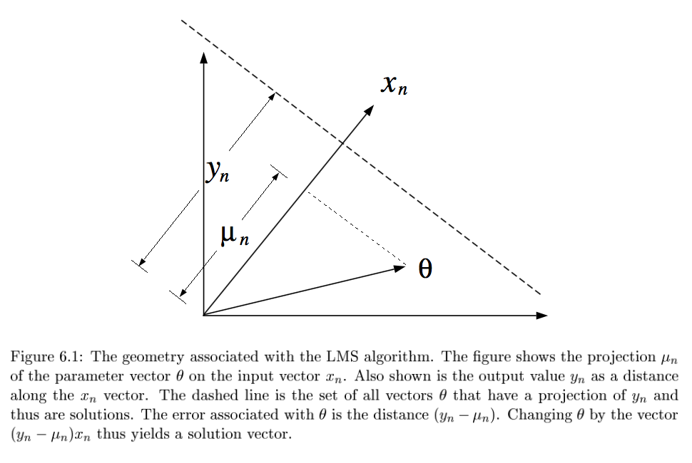
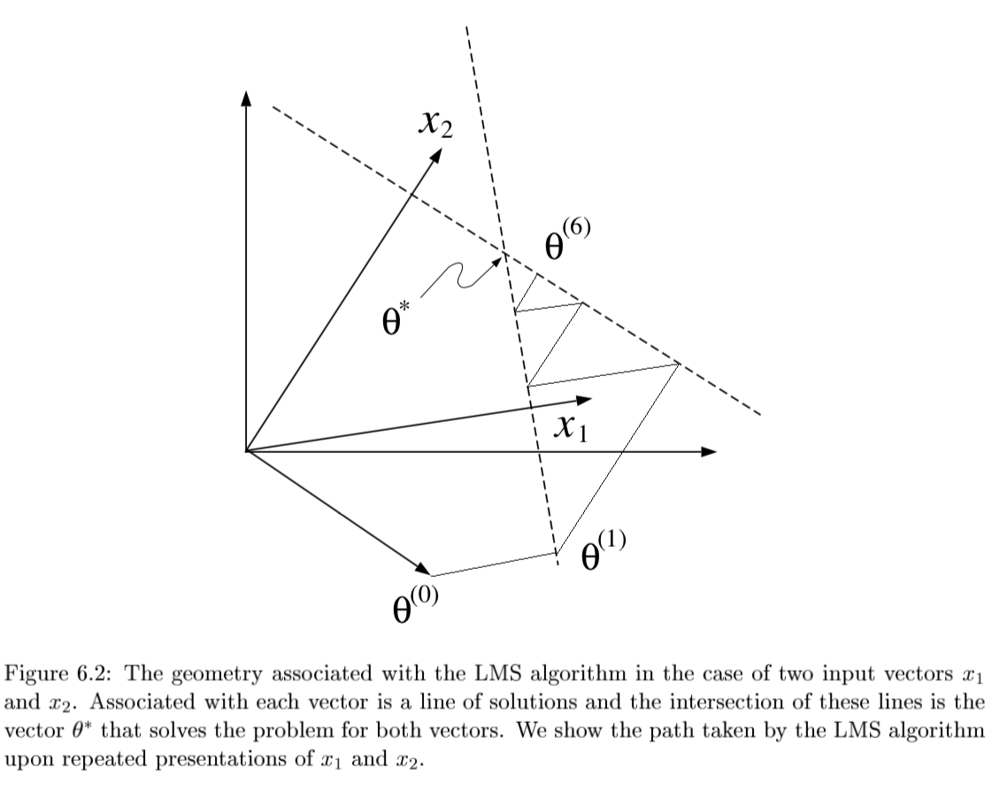
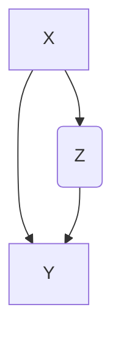

[TOC]

# Statistical concepts - J. 5

- prob theory: given model $\theta$, infer data $X$
- statistics: given data $X$, infer model $\theta$
- 2 statistical schools of thought: *Bayesian* and *frequentist*
  1. Bayesian: $P(\theta \| x) = \frac{p(x\|\theta) p(\theta)}{p(x)}$
    - assumes $\theta$ is a RV, find its distr.
    - requires a prior probability $p(\theta)$= *statistician's uncertainty*
       - *posterior* $p(\theta|x)$ is what you don't observe
    - $\hat{\theta}_{Bayes} = \int \theta \: p(\theta\|x) d\theta$ ~ mean of the posterior
    - $\hat{\theta}_{MAP} = \underset{\theta}{argmax} \: p(\theta\|x) = \underset{\theta}{argmax} \: p(x\|\theta) p(\theta)  \\\ = \underset{\theta}{argmax} \: [ log \: p(x\|\theta) + log \: p(\theta) ]$
       - like *penalized likelihood*
    - however bayesian's don't like using these parameter estimates too much - prefer to consider the whole distributions
  2. frequentist - use estimators (ex. MLE)
    - ignores prior - only use priors when they correspond to objective frequencies of observing values
    - $\hat{\theta}_{MLE} = argmax_\theta \: p(x\|\theta)$

## 3 problems

1. *density estimation* - given samples of X, estimate P(X)
  - ex. univariate Gaussian density estimation
    - frequentist
      - derive MLE for mean and variance
    - bayesian
      - assume distr. for $\mu$ ~ ex. $p(\mu) \sim N(\mu_0, \tau^2)$
      - derive MAP for mean and variance (assuming some prior)
    - can use plate to show repeated element
  - ex. discrete, multinomial prob. distr.
    - derive MLE
      - $P(x|\theta) \sim $multionomial distr.
    - derive MAP
      - want to be able to plug in posterior as prior recursively
      - this requires a *Dirichlet prior* to multiply the multinomial
        - Dirichlet: $p(\theta) = C(\alpha) \theta_1^{\alpha_1 - 1}\cdot \cdot \cdot \theta_M^{\alpha_M-1}$
        - ex. *mixture models* - $p(x\|\theta)=\sum_k \alpha_k f_k (x\|\theta_k)$
  - ex. mixture models
    - here $f_k$ represent densities (*mixture components*)
    - $\alpha_k$ are weights (*mixing proportions*)
    - can do inference on this - given x, figure out which cluster it fits into better
    - learning requires EM
    - can be used nonparametrically - *mixture seive*
      - however, means are allowed to vary
  - ex. *nonparametric density estimation*
    - ex. *kernel density estimator* - stacking up mass
    - each point contributes a kernel function $k(x,x_n, \lambda)$
      - $x_n$ is location, $\lambda$ is smoothing
    - $\hat{p}(x) = \frac{1}{N}\sum_n k(x,x_n,\lambda)$
    - nonparametric models sometimes called *infinite-dimensional*
2. *regression* - want p(y\|x)
  - *conditional mixture model* - variable z can be used to pick out regions of input space where different regression functions are used
    - $p(y_n\|x_n,\theta) = \sum_k p(z_n^k=1\|x_n,\theta) \cdot p(y_n\|z_n^k = 1, x_n, \theta)$
  - *nonparametric regression* 
    - ex. *kernel regression* $\hat{f}(x) = \frac{\sum_{i=1}^N k(x, x_i) \cdot y_i}{\sum_{m=1}^N k(x, x_j)}$
3. *classification*
  - ex. Gaussian class-conditional densities
    - posterior probability is *logistic function*
  - *clustering* - use mixture models

## model selection / averaging
- bayesian
  - for model m, want to maximize $p(m\|x) = \frac{p(x\|m) p(m)}{p(x)}$
    - usually, just take $m$ that maximizes $p(m\|x)$
    - *model averaging*: $p(x_{new}|x) = \int \int p(x_{new}|\theta, m) p(\theta|x, m) p(m|x) d\theta dm$
    - otherwise integrate over $\theta, m$ - *model averaging*
- frequentist
  - can't use MLE - will always prefer more complex models
  - use some criteria such as KL-divergence, AIC, cross-validation

# Linear regression - J. 6

- *LMS* = *least mean squares* (p-dimensional geometries)
  - 
  - $y_n = \theta^T x_n + \epsilon_n$
  - $\theta^{(t+1)}=\theta^{(t)} + \alpha (y_n - \theta^{(t)T} x_n) x_n$
    - converges if $0 < \alpha < 2/||x_n||^2$
    - 
    - 
  - if N=p and all $x^{(i)}$ are lin. indepedent, then there exists exact solution $\theta$

- solving requires finding *orthogonal projection of y on column space of X* (n-dimensional geometries)
  - 
  1. 3 Pfs
     1. geometry - $y-X\theta^*$ must be orthogonal to columns of X: $X^T(y-X\theta)=0$
     2. minimize least square cost function and differentiate
     3. show HY projects Y onto col(X)
  - either of these approaches yield the *normal eqns*: $X^TX \theta^* = X^Ty$

- SGD
  - SGD converges to normal eqn

- ***convergence analysis***: requires $0 < \rho < 2/\lambda_{max} [X^TX]$

  - algebraic analysis: expand $\theta^(t+1)$ and take $t \to \infty$
  - geometric convergence analysis: consider contours of loss function

- weighted least squares: $J(\theta)=\frac{1}{2}\sum_n w_n (y_n - \theta^T x_n)^2$
  - yields $X^T WX \theta^* = X^T Wy$

- probabilistic interpretation
  - $p(y\|x, \theta) = \frac{1}{(2\pi\sigma^2)^{N/2}} exp \left( \frac{-1}{2\sigma^2} \sum_{n=1}^N (y_n - \theta^T x_n)^2 \right)$
  - $l(\theta; x,y) = - \frac{1}{2\sigma^2} \sum_{n=1}^N (y_n - \theta^T x_n)^2$
    - log-likelihood is equivalent to least-squares cost function

# linear classification - J. 7

- *decision theory* - models don't require finding p(y\|x)
- regression doesn't work with classification
  - even in binary case, outliers can skew fit
- linear model $\implies$ boundaries are hyperplanes
- generative models: 
  1. Gaussian class-conditional densities
     1. binary case: posterior probability $p(Y=1|x, \theta)$ is a sigmoid $\frac{1}{1+e^{-z}}$ where $z = \beta^Tx+\gamma$
        1. multiclass extends to *softmax function*: $\frac{e^{\beta_k^Tx}}{\sum_i e^{\beta_i^Tx}}$
     2. only a linear classifier when covariance matrices are the same
        1. otherwise a quadratic classifier
     3. LDA / QDA?
     4. MLE for estimates are pretty intuitive
  2. naive Bayes classifier
     1. assumes multinomial Y
     2. with very clever tricks, can produce $P(Y^i=1|x, \eta)$ again as a softmax
  3. exponential family
     1. includes Gaussian, binomial, Poisson, gamma, Dirichlet
     2. $p(x|\eta) = \text{exp}[\eta^Tx - a(\eta)] h(x)$
     3. for classification, anything from exponential family will result in posterior probability that is logistic function of a linear function of x
- discriminative models: 
  1. logistic regression: $p(Y=1|x, \theta) = logistic(\theta^Tx)$
     1. assume Y ~ $Bernoulli(\mu_n)$ with $\mu_n=logistic(\theta^Tx$)
     2. can solve this online with GD of ***likelihood***
     3. better to solve with iteratively reweighted least squares
  2. multiway logistic classification
     1. Assume $P(Y^k=1|x, \theta) = \frac{e^{\beta_k^Tx}}{\sum_i e^{\beta_i^Tx}}$, just as arises from class-conditional exponential family distributions
  3. probit (binary) regression
     1. $p(Y=1|x, \theta) = \phi(\theta^Tx)$ where $\phi$ is the Gaussian CDF
     2. pretty similar to logistic
  4. noise-OR (binary) model
     1. consider $Y = X_1 \lor X_2 \lor … X_m$ where each has a probability of failing
        1. define $\theta$ to be the failure probabilities
     2. $p(Y=1|x, \theta) = 1-e^{-\theta^Tx}$
  5. other (binary) exponential models
     1. $p(Y=1|x, \theta) = 1-e^{-\theta^Tx}$ but x doesn't have to be binary
     2. *complementary log-log model*: $p(Y=1|x, \theta) = 1-\text{exp}[e^{-\theta^Tx}]$

# Clustering, k-means, mixture of Gaussians - J. 10

- *latent vars* - values not specified in the observed data

## unconditional mixture models - density estimation (clustering) 

- *K-Means*
  - start with random centers
  - assign everything to nearest center: $O(\|\text{clusters}\|*np) $
  - recompute centers $O(np)$ and repeat until nothing changes
  - partition amounts to Voronoi diagram
  - can be viewed as minimizing *distortion measure* $J=\sum_n \sum_i z_n^i ||x_n - \mu_i||^2$
  - ***EM algo for this***
- *GMMs*
  - $p(x|\theta) = \underset{i}{\Sigma} \pi_i \mathcal{N}(x|\mu_i, \Sigma_i)$
    - $l(\theta|x) = \sum_n log \: p(x_n|\theta) \\ = \sum_n log \sum_i \pi_i \mathcal{N}(x_n|\mu_i, \Sigma_i)$
    - hard to maximize bcause log acts on a sum
  - continue deriving new mean and variance at each step
  - "soft" version of K-means - update means as weighted sums of data instead of just normal mean
  - sometimes initialize K-means w/ GMMs

## conditional mixture models - regression/classification

- latent variable Z has multinomial distr.
  - ex. $P(Z^i=1|x, \xi) = \frac{e^{\xi_i^Tx}}{\sum_je^{\xi_j^Tx}}$
- mixture of linear regressions
- mixtures of logistic regressions

# EM -- J. 11

- hill-climbing on log-likelihood achieved indirectly by coordinate ascent in the auxilary function
- model with observed variable X and hidden variable Z
  1. *expectation step* - values of unobserved latent variables are "filled in"
    - calculates prob of latent variables given observed variables and current param values
  2. *maximization step* - parameters are adjusted based on filled-in variables
- quantities
  - want to maximize *complete log-likelihood* $l_c (\theta; x, z) = log \: p(x,z\|\theta)$ but done't know z
  - know *incomplete log-likelihood* $l(\theta; x) = log \: p(x\|\theta) = log \sum_z p(x,z\|\theta)$
  - *expected complete log-likelihood* $<l_c(\theta; x,z)>_q = \sum_z q(z\|x,\theta) log \: p(x,z\|\theta)$
    - q is the averaging distr.
  - *auxilary function* $L(q, \theta) = \sum_z q(z\|x) log \frac{p(x,z\|\theta)}{q(z\|x)}$ - lower bound for the log likelihood
- steps
  - E: $q^(t+1) = \underset{q}{argmax} L(q,\theta^{(t)})$
    - maximized with $q = p(z\|x, \theta^{(t)})$
  - M: $\theta^{(t+1)} = \underset{\theta}{argmax} L(q^{(t+1)}, \theta)$
    - equivalent to maximizing expected complete log-likelihood
- simpliefied in terms of KL divergence
  - E: $q^{(t+1)} (z\|x) = \underset{q}{argmin} D(q\|\|\theta^{(t)})$
  - M: $\theta^{(t+1)} = \underset{\theta}{argmin} D(q^{(t+1)} \|\| \theta)$

# Decision trees -- R&N 18.3; HTF 9.2.1-9.2.3

- *inductive bias*
  - prefer small trees
  - prefeer tres with high IG near root
- good for certain types of problems
  - instances are attribute-value pairs
  - target function has discrete output values
  - disjunctive descriptions may be required
  - training data may have errors
  - training data may have missing attributes
- greedy - use statistical test to figure out which attribute is best
  - split on this attribute then repeat
- classification cost functions
  1. misclassification error - not differentiable
  2. Gini index $\sum_{i != i'} p_i p_{i'}$
  3. cross-entropy: $- \sum_i p_i log p_i $
- growing algorithm
  1. *information gain* - decrease in entropy
     - weight resulting branches by their probs
     - bias towards attributes with many values
     - use *GainRatio* = Gain/SplitInformation
       - can incorporate *SplitInformation* - discourages selection of attributes with many uniformly distributed values
       - sometimes SplitInformation is very low (when almost all attributes are in one category)
         - might want to filter using Gain then use GainRatio
  2. regression tree
     - must decide when to stop splitting and start applying linear regression
     - must *minimize SSE* 
- can get stuck in local optima
- avoid overfitting 
  - don't grow too deep
  - early stopping doesn't see combinations of useful attributes
  - overfit then prune - proven more succesful
    - *reduced-error pruning* - prune only if doesn't decrease error on validation set
    - *$\chi^2$ pruning* - test if each split is statistically significant with $\chi^2$ test
    - *rule post-pruning* = *cost-complexity pruning*
      1. Infer the decision tree from the training set, growing the tree until the training data is fit as well as possible and allowing overfitting to occur.
      2. Convert the learned tree into an equivalent set of rules by creating one rule for each path from the root node to a leaf node.
         - these rules are easier to work with, have no structure
      3. Prune (generalize) each rule by removing any preconditions that result in improving its estimated accuracy.
      4. Sort the pruned rules by their estimated accuracy, and consider them in this sequence when classifying subsequent instances.
- incorporating continuous-valued attributes
  - have to pick threshold to split on
    - candidate thresholds: separate examples that differ in their target classificaiton
      - just evaluate them all
- missing values
  - could just fill in most common value
  - also could assign values probabilistically
- differing costs
  - can bias the tree to favor low-cost attributes
    - ex. divide gain by the cost of the attribute
- high variance - instability - small changes in training set will result in changes of tree model
- lots of trees
  - *bootstrap* - a method of sampling
  - *bagging* = bootstrap aggregation - an ensemble method
    - training multiple models by randomly drawing new training data
    - bootstrap with replacement can keep the sampling size the same as the original size
  - voting
    - consensus: take the majority vote
    - average: take average of distribution of votes
      - reduces variance, better for improving more variable (unstable) models
  - random forest - uses decorrelated trees
    - for each split of each tree, pick only m of the p possible dimensions
    - when m=p, we are just doing bagging
      lowering m reduces correlations between the trees
    - reducing correlation of the trees reduces variance