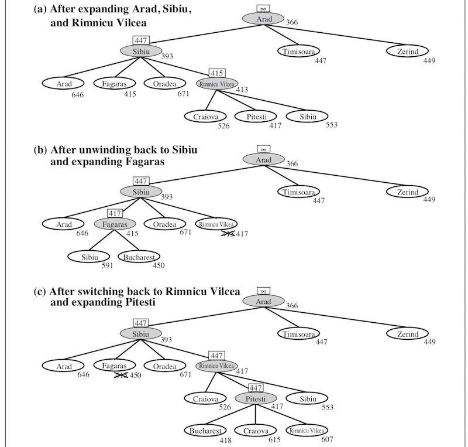
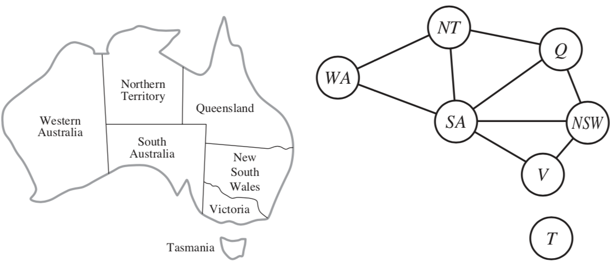

### ai

**chandan**

*based on R&N*

[TOC]

# decision trees / random forests

## decision tree intuition

## training

- greedy - use metric to pick attribute
  - split on this attribute then repeat
  - high variance

## information gain

maximize: entropy(parent) - [weighted average] * entropy(children)

## comparing split functions

- info gain often picks attributes with many values (can divide by split information)
- gini impurity - very similar but faster to compute
- misclassification rate - doesn't always pick best splits 
  - ex. real distr. ~ (40-40)
  - (30-10, 10-30), (20-40, 20-0)

## stopping

- depth
- metric
- node proportion
- pruning
  - *reduced-error pruning* - prune based on test set err.
  - *$\chi^2$ pruning* - test splits with $\chi^2$ test
  - *rule post-pruning* = *cost-complexity pruning*

## random forests

- multiple classifiers
- *bagging* = *bootstrap aggregating*: each classifier uses subset of datapoints
- *feature randomization*: each split uses subset of features

## random forest voting

- consensus
- average
- *adaboost*

## regression tree

- stop splitting at some point and apply linear regression

## other values

- missing values - fill in with most common val / probabilistically
- continuous values - split on thresholds

# uninformed search

## the setup

1. initial state: $s_0$
2. actions at each state: go($s_1$), go($s_2$)
3. transition model: result($s_0$, go($s_1$)) = $s_1$
4. goal states: $s_\text{goal}$
5. path cost function: cost($s_0$, a, $s_1$)

## how to search

- TREE-SEARCH - continuously expand the frontier
  - *frontier*  = set of all leaf nodes available to expand
- GRAPH-SEARCH - also keep set of visited states

## metrics

- *optimal* - finds best solution
- *complete* - terminates in finite steps
- *time, space complexity*
  - *search cost* - just time/memory
- *total cost* - search cost + *path cost*

##  summary

# A* & Heuristics

## informed search

- *informed search* - use $g(n)$ and $h(n)$
  - *g(n)*:  cost from start to n
  - *heuristic h(n)*: cost from n to goal
- *best-first* - choose nodes with best f
  - f=g: uniform-cost search
  - f=h: greedy best-first search
- $A^*$: $f(n) = g(n) + h(n)$

## admissible

- *admissible*: $h(n)$ never overestimates
- $\implies A^*$ (with tree search) is optimal and complete

## consistent

- *consistent*: $h(n) \leq cost(n \to n') + h(n')$
  - monotonic
- $\implies A^*$ (with graph search) is optimal and complete 

## optimally efficient

- *consistent* $\implies$ *optimally efficient* (guaranteed to expand fewest nodes) 
  - never re-open a node
- weaknesses
  - must store all nodes in memory

## memory-bounded heuristic search

- *iterative-deepening* $A^*$ - cutoff f-cost
- *recursive best-first search*
  - each selected node backs up best f alternative
  - if exceeding this, rewind
  - when rewinding, replace nodes with with best child f
- $SMA^*$ - simplified memory-bounded
  -  when memory full, collapse worst leaf

##  recursive best-first

## heuristic functions

- want big h(n) because we expand everything with $f(n) < C^*$
  - $h_1$ dominates $h_2$ if $h_1(n) \geq h_2(n) \: \forall \: n$
  - combining heuristics: pick $h(n) = max[h_1(n), ..., h_m(n)]$

- *relaxed problem* yields admissible heuristics

  - ex. 8-tile solver

# local search

## definitions

- *local search* looks for solution not path ~ like optimization
- maintains only *current node* and its neighbors

## discrete space

- *hill-climbing* = *greedy local search* 
  - stochastic hill climbing
  - random-restart hill climbing
- *simulated annealing* - pick random move
  - if better accept
  - else accept with probability $\exp(\Delta f / T_t)$
- *local beam search* - pick k starts, then choose the best k states from their neighbors
  - *stochastic beam search* - pick best k with prob proportional to how good they are

## *genetic algorithms*

*schema* - representation

## continuous space

- could just discretize neighborhood of each state

- SGD: *line search* - double $\alpha$ until f increases
- *Newton-Raphson* method: $x = x - H_f^{-1} (x) \nabla f(x)$

# constraint satisfaction problems

## definitions

- variables, domains, constraints
- goal: *assignment* of variables
  - *consistent* - doesn't violate constraints
  - *complete* - every variable is assigned

## example

## local search for csps
- start with some assignment to variables
- *min-conflicts* heuristic - change variable to minimize conflicts
  - can escape plateaus with *tabu search* - keep small list of visited states
  - could use *constraint weighting*

## constraint graph

## inference

- **constraint propagation** uses constraints to prune domains of variables
- finite-domain constraint $\equiv$  set of binary constraints w/ auxiliary variables
  - ex. *dual graph transformation*: constraint $\to$ variable, shared variables $\to$ edges

## basic constraint propagation

- *node consistency* - unary constraints
- *arc consistency* - satisfy binary constraints (AC-3 algorithm)
  - for each arc, apply it
    - if things changed, re-add all the neighboring arcs to the set
  - $O(cd^3)$ where $d = \vert domain\vert $, c = num arcs

## advanced constraint propagation

- *path consistency* - consider constraints on triplets - PC-2 algorithm
  - extends to *k-consistency*
  - *strongly k-consistent* - also (k-1), ..., 1-consistent
    - $\implies O(k^2d)$ to solve
- global constraints

## backtracking
- depth-first search that backtracks when no legal values left
  - variable and value ordering
  - interleaving search and inference
  - intelligent backtracking - looking backward

## variable and value ordering

- *commutative*
- heuristics
  - *minimum-remaining-values*
  - *degree* - pick variable involved in most constraints
  - *least-constraining-value*

## interleaving search and interference

- *forward checking* - after assigning, check arc-consistency on neighbors
- *maintaining arc consistency (MAC)* - after sasigning, arc consistency initialized on neighbors

## intelligent backtracking

- *conflict set* for each node (list of variable assignments that deleted things from its domain)
- *backjumping*  - backtracks to most recent assignment in conflict set
- *conflict-directed backjumping* 
  - let $X_j$ be current variable and $conf(X_j)$ be conflict set. If every possible value for $X_j$ fails, backjump to the most recent variable $X_i$ in $conf(X_j)$ and set $conf(X_i) = conf(X_i) \cup conf(X_j) - X_i$
- *constraint learning* - finding min set of assigments from conflict set that causes problem

## structure of problems
- connected components of constraint graph are independent subproblems
- *tree* - any 2 variables are connected by only one path
  - *directed arc consistency* - ordered variables $X_i$, every $X_i$ is consistent with each $X_j$ for j>i
    - tree with n nodes can be made directed arc-consisten in $O(n)$ steps - $O(nd^2)$

## making trees

1. assign variables so remaining variables form a tree
  - assigned variables called *cycle cutset* with size c
  - $O[d^c \cdot (n-c) d^2]$
  - finding smallest cutset is hard, but can use approximation called *cutset conditioning*
2. *tree decomposition* - view each subproblem as a mega-variable
  - *tree width* w - size of largest subproblem - 1
  - solvable in $O(n d^{w+1})$

