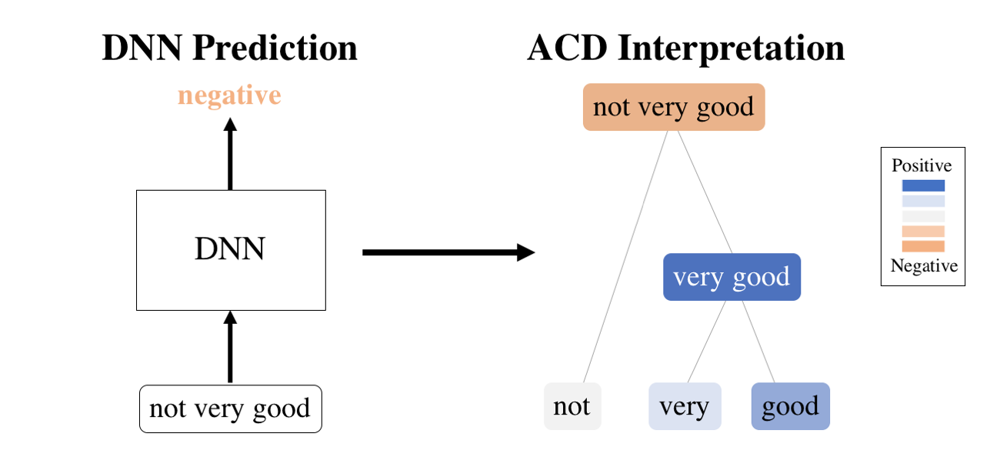

<h1> towards interpretable ml for neuroscience </h1>

<h3> chandan singh </h3> 

*advised by bin yu*

## requirements

- can have outside faculty 
- can only have one faculty that is remote
- at least 2 eecs (0% counts e.g. bin)
- chair must be eecs
  - chair has to bring form back to division
- prepare ~45 mins of info
- total 2-3 hrs (2 hrs min) - do this

## overview

1. [interpretable ml: what's the problem](#/1)
2. [prediction-level interpretation methods](#/2)
3. [scientific applications](#/3)
4. [towards dnn theory](#/4)
5. [what's next: delving deeper into neuro](#/5)

## collaborators

- prof. bin yu
  - jamie murdoch
  - raaz dwivedi
  - christopher lu
  - karl kumbier
  - summer devlin
  - reza abbasi-asl
- prof. jack gallant
  - michael eickenberg
  - michael oliver
- prof. gang-yu liu
  - jiali (lillian) zhang

# interpretable ml: why?

with *jamie murdoch, karl kumbier, reza abbasi-asl, & bin yu*

## ml is powerful

- strong predictive performance
- part of the power is the surge in big data (e.g. calcium imaging)
- often perceived as black-box: need interpretability

## defining interpretability

- often defined poorly
- 

## interpretable ml framework


# explaining **single** dnn predictions

*with jamie murdoch & bin yu*



## previous work

- gradient-based methods (e.g. LRP)
- perturbation-based (e.g. LIME)
- CD (for LSTMS)

## cd for cnns

<!---->

## equations

- $\beta$ = relevant, $\gamma$ = irrelevant, $i$ = layer index
- linear/conv: ```$$\begin{align} \beta_i &= W\beta_{i-1} + \frac{|W\beta_{i-1}|}{|W\beta_{i-1}| + |W\gamma_{i-1}|} \cdot b \\  \gamma_i &= W\gamma_{i-1} + \frac{|W\gamma_{i-1}|}{|W\beta_{i-1}| + |W\gamma_{i-1}|} \cdot b\end{align}$$```
- maxpool: ```$\begin{align} 
  ​    max\_idxs &= \underset{idxs}{\text{argmax}} \: \left[ \text{maxpool}(\beta_{i-1} + \gamma_{i-1}; idxs) \right] \\
  ​    \beta_i &=  \beta_{i-1}[max\_idxs] \\ 
  ​    \gamma_i &=  \gamma_{i-1}[max\_idxs]
  \end{align}$```
- relu: ```$\begin{align} 
  ​    \beta_{i} &=  \text{ReLU}(\beta_{i-1}) \\ 
  ​    \gamma_{i} &=  \text{ReLU}(\beta_{i-1} + \gamma_{i-1}) - \text{ReLU}(\beta_{i-1})
  \end{align}$```

## <hierarchical text example>


## vision example


## quantitative results


# getting random forest importance scores

*with jamie murdoch, summer devlin, & bin yu*

explain a **single prediction** by a random forest in terms of the **input**

## previous work

- permutation tests
- iRF

## xor: a simple failure case


# a neuroscience application

*with michael eickenberg, michael oliver, reza abbasi-asl, jack gallant, & bin yu*

## previous work: deeptune

- deeptune analysis

## big-data neuroscience

- lots of challenges with understanding the brain
- needs interpretability

## intersection of different approaches

- theory
- data-driven experiments
- fine-tuned experiments

# describing textures from nanoscience

*with lillian zhang, chris lu, bin yu, & gang-yu liu*

## providing descriptions of nanomaterials

- 

# towards dnn theory 1: adam vs sgd

*with raaz dwivedi, bin yu, martin wainwright*

## learned weights are different


# towards dnn theory 2: scattering transform

*with christopher lu, bin yu*

*building on previous work by yuansi chen, reza abbasi-asl*

## scattering transform


# what's next: delving deeper into neuro

*with yu wang, ed boyden*

## connectomics: unsupervised image segmentation


