{:toc}

See related papers in the [📌 llm basics](https://csinva.io/notes/ai/llms.html) and [📌 llm research](https://csinva.io/notes/research_ovws/ovw_llms.html) pages.

**Embedding models** take in unstructured input (here, often text) and transform it into a vector representation that is usually used for search. Key considerations include: fast inference for embedding a new input, small/quantized embeddings for efficient storage, indexability for fast search with retrieval algorithms.

# overviews

- detailed overview of info retrieval ([bruch, 2024](https://arxiv.org/abs/2401.09350.pdf))
- introductory [blog post](https://osanseviero.github.io/hackerllama/blog/posts/sentence_embeddings/) on embeddings

# embedding model distinctions

- leading models as of summer 2026: google (gemini embedding), voyage (voyage series, open-source voyage-4-nano), alibaba (qwen embedding, GTE), cohere, openai (relatively outdated), BAAI (BGE), Jina (bought by elastic), NVIDIA (NV-Embed), Microsoft (E5), nomic (nomic-embed)
- embedding approaches: 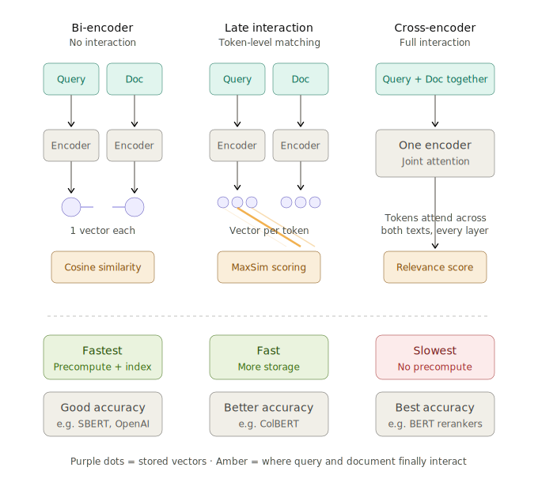
- 3 levels of interaction

  1. bi-encoder: separately encode query & doc into a single vec

  2. late-interaction encoder: separately encode but keep a vector per token & learn some params on how to compute similarity between them

     - e.g. ColBERT ([khattab & zaharia, 2020](https://arxiv.org/abs/2004.12832)) uses maxsim to compare, which keeps the vector for each token and then for each token in the query, finds the candidate token it matches best (highest cosine similarity), then averages those best-match scores across all query tokens

     - Your Embedding Model is SMARTer Than You Think ([zhang...lee, 2026](https://arxiv.org/abs/2605.24938)) - use the maxsim score (along with the original last-token score) to do late interaction without requiring post-training

  3. cross-encoder: encode query and doc together

# best practices for training

- basic training pipeline

  1. standard self-supervised pre-training, e.g. BERT or off-the-shelf model like Qwen

  2. weak unsupervised pre-training, e.g. weakly related text pairs, such as QA pairs from forums like StackExchange and Quora

  3. high-quality contrastive finetuning on curated paired data, e.g. QA from web searches
- after retrieving results, a reranker model that takes in both the inputs and the query can be used to quickly improve performance
- key tricks to improve performance
  - training-time
    - instruction/task conditioning: prompt or prefixes like *search query*, *search document*, *classification*, *clustering* before embedding so model knows how to customize the embedding
    - synthetic data from LLMs: generate tuples of (task, query, positive, hard negative) for contrastive training, especially crafting good hard negatives
    - distillation from more compute-intensive model: e.g. cross-encoder to bi-encoder or post-reranker to before reranker
    - quantization-aware training
    - MoE training
    - sparse representation learning (e.g. UHD-BERT ([jang...seo, 2021](https://arxiv.org/abs/2104.07198)))
    - joint learning with index
    - prior work: query expansion, term dependency model (e.g. tf-idf), topic model, translation model
    - matryoshka representation learning - apply the contrastive loss simultaneously at dims 256, 512, 1024, 2048, etc so users can truncate to tradeoff acc for storage/speed
    - tailoring to specialized domains (e.g. medical, finance)
    - sharing embedding spaces across different models ([like in voyage-4](https://blog.voyageai.com/2026/01/15/voyage-4/)) so different sizes can be used for embedding/querying
    - minor tricks: model souping / checkpoint merging on different task mixtures, loss balancing across tasks, curriculum over data quality stages, long-context extensions
  - document embedding-time
    - contextualized chunking - generate chunk embeddings for multiple chunks in one forward pass so they have context (could even aggregate context across chunks)
  - query inference-time
    - query expansion & reweighting
    - hybrid retrieval, combining with BM-25
    - reranking with a cross-encoder for topk results

# top-performing models

- baseline simple models
  - BM25 - uses TF-IDF based on word counts and document frequences
  -  Simple but Tough-to-Beat Baseline for Sentence Embeddings ([arora, liang & ma, 2017](https://openreview.net/forum?id=SyK00v5xx))
    - average word embeddings in a sentence, downweighting words by their frequency
    - to remove the "common background direction", compute the top pca component from many sentence embeddings then remove that direction
- early models just trained with bi-encoders, e.g. SBERT=Sentence BERT ([reimers & gurevych, 2019](https://arxiv.org/abs/1908.10084)), SimCSE ([gao, yao & chen, 2021](https://arxiv.org/abs/2104.08821))
  - PromptBERT ([jiang...furu wei...zhang, 2022](https://arxiv.org/abs/2201.04337)):  `This sentence: “ [text] ” means [MASK]` then use the embedding of the mask token - this prevents how all raw embeddings have similar cosine similarities
    - Scaling Sentence Embeddings with LLMs ([jiang, ..., zhuang, 2023](https://arxiv.org/abs/2307.16645)): `This sentence: “ [text] ” means in one word:` then use the embedding of the final token
- next era of models started using contrastive pre-training, e.g. E5 ([wang...wei, 2022](https://arxiv.org/abs/2212.03533)), GTE ([li...zhang, 2023](https://arxiv.org/abs/2308.03281)), and BGE ([github](https://github.com/FlagOpen/FlagEmbedding))
  - this era included instruction-conditioned embeddings, e.g. Instructor ([su, ..., smith, zettlemoyer, yu, 2022](https://instructor-embedding.github.io))
  - synthetic data became important here, e.g. Promptagator ([dai…wei chang, 2022](https://arxiv.org/abs/2209.11755)) and Gecko ([lee...naim, 2024](https://arxiv.org/abs/2403.20327))
  - Nomic Embed ([nussbaum, morris, duderstadt, & mulyar, 2024](https://static.nomic.ai/reports/2024_Nomic_Embed_Text_Technical_Report.pdf)), ([blog post](https://blog.nomic.ai/posts/nomic-embed-text-v1))
  - Jina Embeddings 2 ([gunther...xiao, 2024](https://arxiv.org/abs/2310.19923)) - achieves long context (8192 tokens)
- next, models initialized using a pre-trained LLM, e.g. E5-mistral-instruct ([wang...wei, 2023](https://arxiv.org/abs/2401.00368)), SGPT ([muennighoff, 2022](https://arxiv.org/abs/2202.08904))
  - during post-training, remove attention masking so stuff is bidirectional, e.g. NV-Embed ([lee...ping, 2024](https://arxiv.org/abs/2405.17428)), LLM2Vec ([behnamghader...reddy, 2024](https://arxiv.org/abs/2404.05961))
- multimodal embeddings
  - image-text starts with CLIP ([OpenAI, 2021](https://arxiv.org/abs/2103.00020)), open-source replications like OpenCLIP ([LAION/Stability, 2022](https://arxiv.org/abs/2212.07143)), and improvements like MetaCLIP ([Meta, 2023](https://arxiv.org/abs/2309.16671)) and EVA-CLIP ([BAAI, 2023](https://arxiv.org/abs/2303.15389))
  - can have many modality embeddings aligned through images ImageBind ([Meta, 2023](https://arxiv.org/abs/2305.05665)) or through text LanguageBind ([PKU, 2023](https://arxiv.org/abs/2310.01852))
  - more modern multimodal embeddings are built by post-training existing large multimodal models, e.g. E5-V ([BUAA/Microsoft, 2024](https://arxiv.org/abs/2407.12580)), VLM2Vec ([Salesforce/Waterloo, 2024](https://arxiv.org/abs/2410.05160)) , GME ([Alibaba, 2024](https://arxiv.org/abs/2412.16855)), voyage-multimodal-3 ([Voyage AI, 2024](https://blog.voyageai.com/2024/11/12/voyage-multimodal-3/)), , jina-embeddings-v4 ([Jina AI, 2025](https://arxiv.org/abs/2506.18902)), Gemini Embedding ([Google DeepMind, 2025](https://arxiv.org/abs/2503.07891)), Cohere Embed v4 ([Cohere, 2025](https://docs.cohere.com/docs/cohere-embed))
  - video - usually samples frames and embeds them rather than explicit temporal modeling
- query inference-time expansions
  - doc2query ([noguiera, … cho, 2019](https://arxiv.org/abs/1904.08375)) – train passage to query model on MS MARCO then retrieve with BM-25
  - InPars ([bonifacio…nogueira, 2022](https://dl.acm.org/doi/abs/10.1145/3477495.3531863)) – generate questions with GPT-3; retrieve with BM25
  - HyDE ([gao…callan, 2022](https://arxiv.org/abs/2212.10496.pdf)) - at inference time, generate synthetic doc from query + instruction & find match for that doc
- rerankers
  - 3 common versions: pointwise (score each document independently), pairwise (learn "A beats B"), listwise (optimize the ordering of the whole list, targeting metrics like NDCG directly)
  - early models like ms-marco-MiniLM were cross-encoders, people later found that prompting an LLM did well but was expensive, so these were distilled
  - newer models like Rank1 use reasoning for reranking
- contextualized chunking
  - voyage does this via explicitly training a model to output separate vectors for each chunk
  - jina does this via [late chunking](https://jina.ai/news/late-chunking-in-long-context-embedding-models/) (embed whole doc, get embeddings for a chunk by mean pooling over its tokens)
  - Contextual retreival ([Anthropic blog post, 2024](https://www.anthropic.com/news/contextual-retrieval)) - prepends an LLM-generated summary to every chunk before embedding
  - more researchy
    - RAPTOR ([sarthi...manning, 2024](https://arxiv.org/abs/2401.18059)) - build hierarchical index by embedding, clustering, summarizing, and embedding the summaries
    - Contextual Document Embeddings ([morris & rush, 2024](https://arxiv.org/abs/2410.02525)) - embed docs conditioned on other docs (requires training to do this well)

- foundations of vector retrieval book ([bruch, 2024](https://arxiv.org/abs/2401.09350.pdf))
- papers with a little trick
  - training-time
    - GritLM ([meunninghoff...kiela, 2024](https://arxiv.org/abs/2402.09906)) - train a single model that, given different instructions, can produce either generations or embeddings
    - Matryoshka Representation Learning ([kusupati...kakade, jain, & farhadi, 2022](https://arxiv.org/abs/2205.13147)) - in training given an embedding of full dimensionality M (e.g. 2048), learn N different distance functions for each prefix of the embedding (e.g. l2_norm(embedding[:32]), l2_norm(embedding[:64]), l2_norm(embedding[:128]), etc). 
      - Beyond Matryoshka: Revisiting Sparse Coding for Adaptive Representation ([wen...you, 2025](https://arxiv.org/abs/2503.01776)) - instead learn sparse mask on top of original embedding
      - AGRAME: Any-Granularity Ranking with Multi-Vector Embeddings ([reddy...potdar, 2024](https://arxiv.org/abs/2405.15028)) - rank at varying levels of granularity while maintaining encoding at a single (coarser) level
    - EvoEmbedding: Evolvable Representations for Long-Context Retrieval and Agentic Memory ([nie, fu, feng & shan, 2026](https://arxiv.org/abs/2606.21649)) - maintains a continuously updated latent memory as it sequentially processes inputs, and uses it alongside the raw content to jointly generate embeddings
    - DREAM: Dense Retrieval Embeddings via Autoregressive Modeling ([tang & yang, 2026](https://arxiv.org/abs/2606.24667)) - instead of contrastive learning, use retriever to replace attention scores for particular heads in next-token prediction task
  - query inference-time
    - EchoEmbeddings: Repetition Improves LM Embeddings ([springer, kotha, fried, neubig, & raghunathan, 2024](https://arxiv.org/abs/2402.15449.pdf))
      - Feed a prompt such as “Rewrite the sentence: x, rewritten sentence: x” to the LM and pool the contextualized embeddings of the 2nd occurence of x

# datasets / benchmarks

- **[MTEB leaderboard](https://huggingface.co/spaces/mteb/leaderboard)** - most common (but potentially overfitted) benchmark
  - [MMTEB](https://arxiv.org/abs/2502.13595) - multilingual version
  - mutimodal
    - MMEB ([huang...meng, 2026](https://arxiv.org/abs/2604.23321))
    - MIEB: Massive Image Embedding Benchmark ([xiao...muennighoff, 2025](https://arxiv.org/abs/2504.10471))
    - ViDoRe Benchmark V2 ([macé, loison & faysse, 2025](https://arxiv.org/abs/2505.17166))
  - PTEB paper ([frank & afli, 2025](https://arxiv.org/abs/2510.06730)) finds that paraphrasing MTEB test sets substantially lowers scores (suggesting overfitting)
  - SAGE: A Realistic Benchmark for Semantic Understanding ([goel, lee & ramchandran, 2025](https://arxiv.org/abs/2509.21310)) - evaluates retreival robustness under adversarial and noisy conditions
  - AIR-Bench: Automated Heterogeneous Information Retrieval Benchmark ([chen...liu, 2024](https://arxiv.org/abs/2412.13102)) - refreshable llm-generated eval data
  - Older: [BEIR benchmark](https://arxiv.org/abs/2104.08663) (part of MTEB)
- newer retrieval benchmarks
  - [RTEB](https://huggingface.co/blog/rteb) - retrieval only benchmark of 48 datasets, with 28 private datasets and 26 code-retrieval datasets; newer and hopes to avoid MMTEB overfitting
  - OBLIQ-Bench: Exposing Overlooked Bottlenecks in Modern Retrievers with Latent and Implicit Queries ([tchuindjo, shah & khattab, 2026](https://arxiv.org/abs/2605.06235))
  - EnterpriseRAG-Bench: A RAG Benchmark for Company Internal Knowledge ([sun...butler, 2026](https://arxiv.org/abs/2605.05253))
  - BERRI: Task-aware Retrieval with Instructions ([asai...riedel, hajishirzi, & yih, 2023](https://aclanthology.org/2023.findings-acl.225/)) - dataset for instruction-informed retrieval
    - FollowIR ([weller...soldaini, 2024](https://arxiv.org/abs/2403.15246))
- agentic search
  - BrowseComp-Plus ([chen...lin, 2025](https://arxiv.org/abs/2508.06600)) - evaluates deep research when searching a fixed corpus
    - extends BrowseComp ([wei...glaese, 2025](https://arxiv.org/abs/2504.12516)) - uses web search to evaluate QA
  - InfoDeepSeek: Benchmarking Agentic Information Seeking for RAG ([xi...yu, 2025](https://arxiv.org/abs/2505.15872))
- Long context datasets
  - [LoCo Benchmark](https://hazyresearch.stanford.edu/blog/2024-01-11-m2-bert-retrieval)
  - [Jina Long Context Benchmark](https://arxiv.org/abs/2310.19923.pdf)

- Misc minor
  - [TREC-RAG](https://trec-rag.github.io/) dataset
  - Instructor eval: Billboard, Prompt retrieval
- Training datasets
  - Nomic 235M curated text pairs (mostly filtered from [here](https://huggingface.co/datasets/sentence-transformers/embedding-training-data))
    - Followed by supervised contrastive fine-tuning on datasets like MSMarco, NQ, NLI, HotpotQA, Fever, WikiAnswers, etc.

  - MEDI (from Instructor paper): combines 300 datasets from Super-NaturalInstructions with 30 datasets from existing collections designed for embedding training

# agentic search

*Agentic search - agent actively plans, executes, and iterates on searches to answer a query, rather than just running a single keyword lookup and handing back results*

- FastContext: Training Efficient Repository Explorer for Coding Agents ([zhang...fu, 2026](https://arxiv.org/abs/2606.14066)) - exploration models from 4B-30B
- Search-R1: Training LLMs to Reason and Leverage Search Engines with RL ([jin...han, 2025](https://arxiv.org/abs/2503.09516))
- Beyond Semantic Similarity: Rethinking Retrieval for Agentic Search via Direct Corpus Interaction ([li...zhang, 2026](https://arxiv.org/abs/2605.05242)) - agent searches the raw corpus directly using **`grep`, `find`, `bash`, shell pipelines** rather than embedding models
- Chroma Context-1: Training a Self-Editing Search Agent ([bashir, hong, jiang, & shi, 2026](https://www.trychroma.com/research/context-1))
- MemReranker: Reasoning-Aware Reranking for Agent Memory Retrieval ([li...li, 2026](https://arxiv.org/abs/2605.06132))
- Superintelligent Retrieval Agent: The Next Frontier of Information Retrieval ([yang, ma, chen & shrivastava, 2026](https://arxiv.org/abs/2605.06647))
  - asks which terms are likely to separate the desired evidence from corpus-level confusers
  - doc side: LLM enriches each document offline with missing search vocabulary
  - query side: predicts evidence vocabulary omitted by the query &  document-frequency statistics as a tool call to filter proposed terms that are absent, overly common, or unlikely to create retrieval margin
  - final retrieval step is weighted BM25 call combining the original query with the validated expansion
- GrepSeek: Training Search Agents for Direct Corpus Interaction ([salemi...zamani, 2026](https://arxiv.org/abs/2605.29307v1)) - trains a compact search agent to find, filter, and compose evidence
  from large text corpora
  - Is Grep All You Need? How Agent Harnesses Reshape Agentic Search ([sen...subbiah, 2026](https://arxiv.org/abs/2605.15184)) - grep generally outperforms vector retrieval in agentic RAG workflows, but overall accuracy depends heavily on agent harness

- MemEx: A Programmable Scratchpad for LLM Agents ([databricks research team, 2026](https://www.databricks.com/blog/memex-programmable-scratchpad-llm-agents)) - improves token efficiency with a wrapper layer over tools, that stores objects in python rather than text every time

-  ([ref](https://jbarrow.ai/2026-06-12-searching-fast-and-slow/))

# searching embeddings (approximate nearest neighbor)

- locality-sensitive hashing (outdated) is a [fuzzy hashing](https://en.wikipedia.org/wiki/Fuzzy_hashing) technique that hashes similar input items into the same "buckets" with high probability
  - idea is to project vector along random dimensions to create buckets, and then match those buckets before searching the rest
  - issue is that the number of dimensions needed to get good performance can quickly grow, obviating the benefit
  - hash collisions are maximized, rather than minimized as they are in dictionaries
  - finding embeddings via DNNs is a special case of this (e.g. might call it "semantic hashing")

  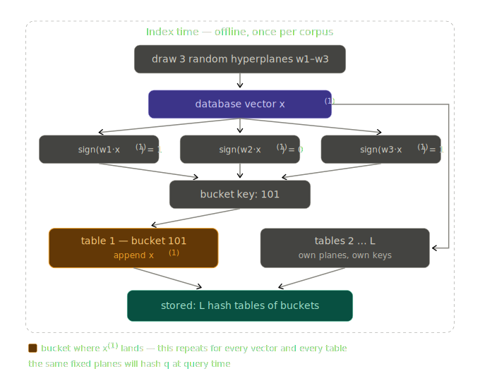
  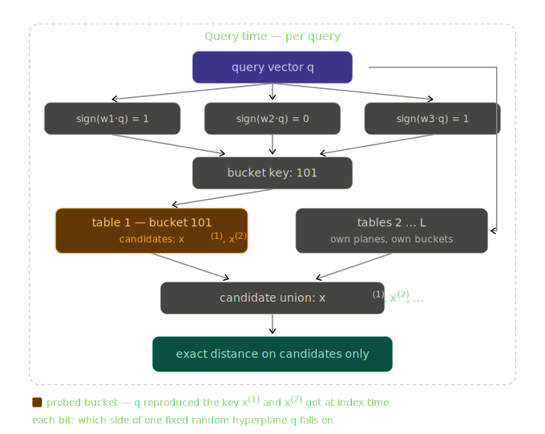

- k-d (k-dimensional) tree
  - balanced binary tree over data with arbitrary dimensions, where each node splits one dim
  - at inference time, go to leaf and then search all neighbors of the leaf by going back up it
  - [annoy](https://github.com/spotify/annoy) optimized this to instead use a forest of random trees and to do data-driven splitting (take 2 random points and split on the direction between them) rather than the median of a single dim

  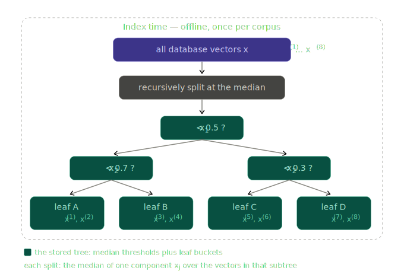
  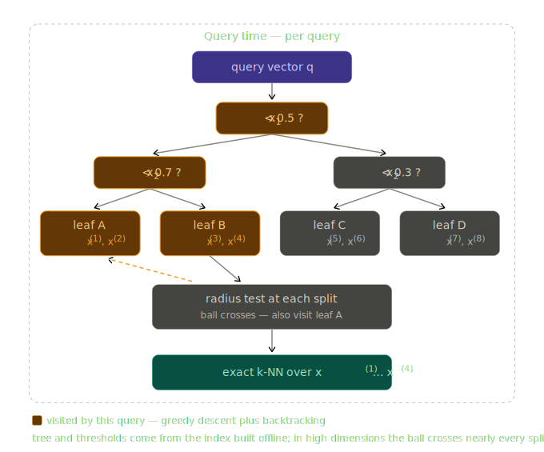

- inverted file (IVF) - k-means the embeddings into clusters, then at inference first search the cluster centers before searching within the top clusters
  - to improve performance, add neighbors into mutiple clusters

  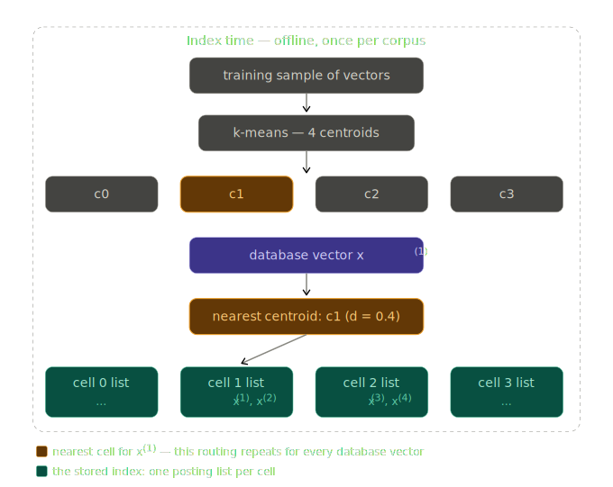
  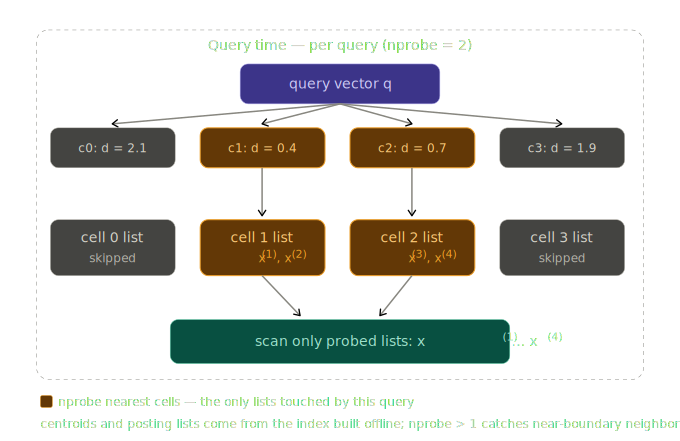

- product quantization ([jegou et al. 2011](https://ieeexplore.ieee.org/document/5432202)) - this speeds up the vector comparison time (different from everything else)
  - separate vector into subvectors (e.g. first half, second half), run k-means for each subvector, then replace the subvector with the index of its closest center mean
  - at inference time, split the query into the same subvectors, and pre-compute the squared distance to each of the center means for each subvector
	  - then, for each vector, rather than doing the dot-product, just look up the pre-computed distances for each subvector (add them together to get the squared distance for the whole vector)
	- note: splitting vectors and clustering struggles if there are lots of correlations between different subvector parts, one fix for this is [Optimized PQ](https://www.microsoft.com/en-us/research/wp-content/uploads/2013/11/pami13opq.pdf) (OPQ), which learns a rotation to apply before splitting so the variance is balanced and decorrelated across subspaces

  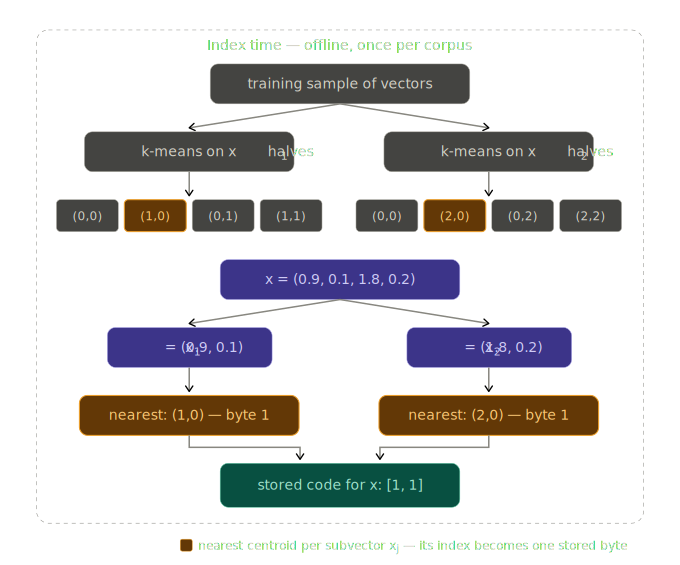
  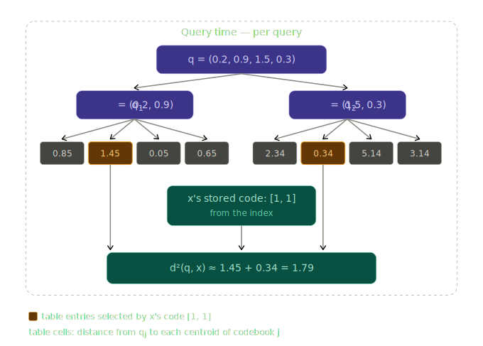

- HNSW ([malkov & yashunin, 2016](https://arxiv.org/abs/1603.09320)) - Hierarchical Navigable Small World graphs (most popular modern system including Lucene, pgvector, Qdrant, Weaviate, Milvus, Pinecone's early stack for medium-large scale <10M vectors)
  - idea is to build a proximity graph over the vectors, and answer queries with greedy best-first traversal - start somewhere, repeatedly hop to the neighbor closest to the query, and search its neighbors
    - hierarchy: does search at a higher layer, then drops to neighbors in lower layer which are more refined
    - edge-selection at insert time
      - note: naive graph of neighbors doesn't work because it's very hard to find a new nieghbor if you search in the wrong place; instead NSW inserts points in random order and connects each to its M nearest *at insertion time* (this leaves long-range edges from the early added nodes)
  - supports incremental inserts (although build and insert are both expensive)
    - delete is a pain
    - requires a lot of RAM (rather than disk access)

  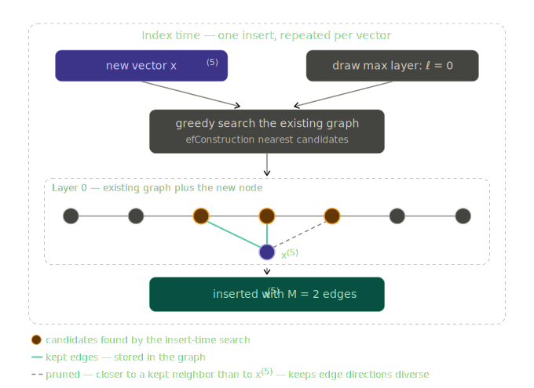
  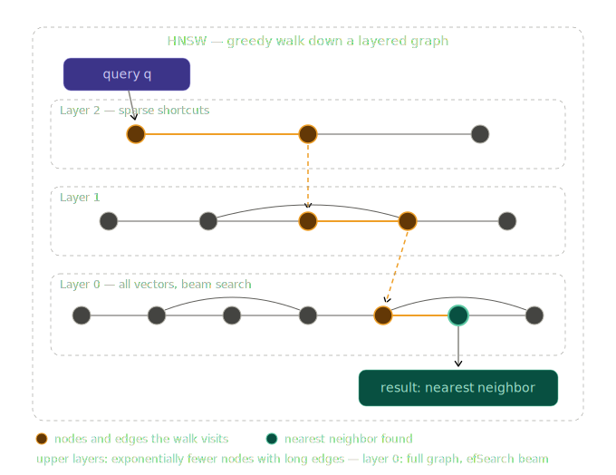

- moving more stuff to disk instead of RAM (default for very large scale, 100M+ vectors)
  - DiskANN ([subramanya...harsha vardhan simhadri, 2019; CMU, UT Austin, & MSR](https://suhasjs.github.io/files/diskann_neurips19.pdf)) - store the full-precision vectors and graph on SSD, keep only PQ-compressed vectors in RAM
    - introduce Vamana graph construction algorithm to produces fewer, longer-range hops in the graph to minimize SSD round-trips
  - SPANN ([chen...wang, 2021](https://arxiv.org/abs/2111.08566)) - same thing but for IVF cluster approach rather than PQ

  
    <b>DiskANN</b> 
    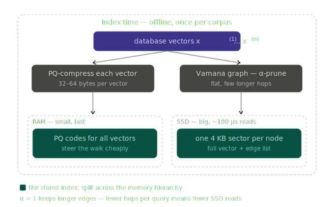
  
  
    <b>SPANN</b> 
    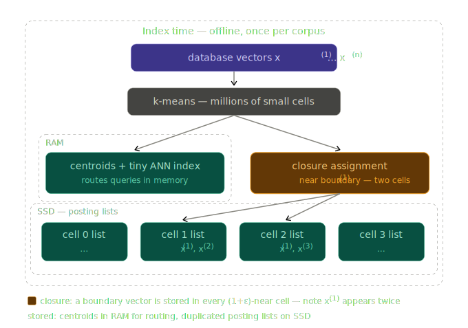
  

- other considerations
  - modern libraries often deal carefully with quantization and GPU usability
  - building compressions/graphs that are filter-aware, e.g. user issues queries like "nearest neighbors WHERE tenant=X AND date>Y." should not break the search
- libraries:

| Library                                                     | What it is                                                   | Methods it connects to                                       |
| ----------------------------------------------------------- | ------------------------------------------------------------ | ------------------------------------------------------------ |
| [Faiss](https://github.com/facebookresearch/faiss) (Meta)   | The field's reference library, CPU and GPU. Nearly every classical index type, composable (e.g. IVF coarse layer + PQ codes + rescoring). | Brute force, IVF, PQ/OPQ, IVF-PQ (asymmetric distance computation), HNSW, scalar/binary quantization |
| [hnswlib](https://github.com/nmslib/hnswlib) (Malkov)       | The canonical lightweight HNSW implementation by the paper's author; embedded inside many engines. Sibling research library: [nmslib](https://github.com/nmslib/nmslib) (original NSW). | HNSW exactly — M, efConstruction, efSearch, diversity pruning |
| [ScaNN](https://github.com/google-research/scann) (Google)  | Partitioning plus anisotropic quantization — the PQ loss reshaped to penalize ranking-relevant error. | IVF + PQ with a smarter estimator ("train the index for the metric") |
| [DiskANN](https://github.com/microsoft/DiskANN) (Microsoft) | Vamana graphs served from SSD; Fresh (streaming) and Filtered variants. | DiskANN — α-prune build, PQ-steered beam search, packed SSD sector reads |
| [SPTAG](https://github.com/microsoft/SPTAG) (Microsoft)     | Tree-plus-graph library; home of the SPANN design used in Bing-scale search. | SPANN — in-RAM centroid routing, closure assignment for boundary vectors |
| [Annoy](https://github.com/spotify/annoy) (Spotify)         | Random-projection tree forest; mmap-friendly, immutable, simple. Largely legacy now but still deployed. | The tree lineage — the KD-tree's randomized, ensembled descendant |
| [FALCONN](https://github.com/FALCONN-LIB/FALCONN)           | Research-grade LSH (cross-polytope and hyperplane families) with multi-probe. | LSH, with the modern hash families and fewer tables          |
| [cuVS](https://github.com/rapidsai/cuvs) (NVIDIA)           | GPU-native ANN: CAGRA graph build and search, GPU IVF-PQ; build speedups that change reindexing economics. | Graph traversal + IVF-PQ, rebuilt for massive parallelism    |

| Engine                                                       | What it is                                                   | Methods it connects to                                       |
| ------------------------------------------------------------ | ------------------------------------------------------------ | ------------------------------------------------------------ |
| [Lucene](https://lucene.apache.org/) (→ Elasticsearch, OpenSearch, MongoDB Atlas) | Segment-based search engine whose vector support underlies Elasticsearch, OpenSearch, and Atlas Vector Search; immutable segments sidestep graph deletes. | HNSW per segment + int8/binary quantization with exact rescoring |
| [pgvector](https://github.com/pgvector/pgvector)             | Postgres extension; vectors as a column type with SQL filtering and joins. | HNSW, IVF (IVFFlat), and exact brute-force scans             |
| [Milvus](https://github.com/milvus-io/milvus)                | Distributed vector database; its Knowhere engine wraps multiple index families behind one API. | Nearly everything: Faiss indexes, HNSW, DiskANN, GPU variants |
| [Qdrant](https://github.com/qdrant/qdrant)                   | Rust vector database emphasizing payload filtering and compression. | HNSW + scalar/binary quantization; filter-aware traversal    |
| [Weaviate](https://github.com/weaviate/weaviate)             | Go vector database with hybrid (BM25 + vector) search built in. | Custom HNSW with PQ/binary compression and rescoring         |

*Notes: popularity and internals shift quickly — verify against [ann-benchmarks.com](https://ann-benchmarks.com/) before depending on any of these. The engines section contains no new algorithms: each is HNSW-or-IVF plus quantization plus the operational layer (filtering, replication, segments, hybrid search).*

# explainable embeddings

- QA-Emb: Crafting Interpretable Embeddings by Asking LLMs Questions ([benara...gao, 2024](https://arxiv.org/abs/2405.16714)) - use yes/no questions to extract embeddings from text
  - A General Framework for Producing Interpretable Semantic Text Embeddings ([sun...yu, 2024](https://arxiv.org/abs/2410.03435)) - extend QA-Emb to systematically generate highly discriminative, low cognitive load yes/no questions
  - PromptReps: Prompting LLMs to Generate Dense and Sparse Representations for Zero-Shot Document Retrieval ([zhuang...zuccon, 2024](https://arxiv.org/abs/2404.18424))
  - InBedder: Answer is All You Need: Instruction-following Text Embedding via Answering the Question ([peng...jingbo shang, 2024](https://arxiv.org/abs/2402.09642.pdf))
    - embeddings consist of answers to questions
    - answer models are finetuned on QA datasets
    - questions are given ahead of time
  - Meta-Task Prompting Elicits Embedding from LLMs ([lei...yates, 2024](https://arxiv.org/abs/2402.18458.pdf)) - ask a few pre-canned templates e.g. "Categorize into one of these categories ___" and look at logits for the outputs as an embedding
  - Learning Interpretable Style Embeddings via Prompting LLMs ([patel, rao, kothary, mckeown, & callison-burch, 2023](https://arxiv.org/abs/2305.12696))
  - CHiLL: Zero-shot Custom Interpretable Feature Extraction from Clinical Notes with LLMs ([mcinerney...wallace, 2023](https://arxiv.org/abs/2302.12343))
    - extract interpretable feature (e.g. "Does this patient have a chronic illness?") and use in a linear model (use Flan-T5)
    - example features: 10 ICD codes + (1) Does the patient have a chronic illness? (2) Is the condition life-threatening?
  - Concept Induction: Analyzing Unstructured Text with High-Level Concepts Using LLooM ([lam...bernstein, 2024](https://arxiv.org/abs/2404.12259))
  - Explain via Any Concept: Concept Bottleneck Model with Open Vocabulary Concepts ([tan, zhou, & chen, 2024](https://arxiv.org/abs/2408.02265))
  - BC-LLM: Bayesian Concept Bottleneck Models with LLM Priors ([feng...tan, 2024](https://arxiv.org/abs/2410.15555))
    - Learning Interpretable Concept-Based Models with Human Feedback ([lage & doshi-velez, 2020](https://arxiv.org/abs/2012.02898))
    - Interpretable-by-Design Text Understanding with Iteratively Generated Concept Bottleneck ([ludan...callison-burch, 2023](https://arxiv.org/abs/2310.19660))
    - Programmatic Representation Learning with LMs ([poesia & sampaio, 2025](https://arxiv.org/abs/2510.14825)) - build decision trees on llm-extracted features
  - HypotheSAEs ([movva...pierson, 2025](https://arxiv.org/abs/2502.04382))
  - Evaluating scientific theories as predictive models in language neuroscience ([singh...huth, 2025](https://www.biorxiv.org/content/10.1101/2025.08.12.669958v1))
    - Bridging Brains and Concepts: Interpretable Visual Decoding from fMRI with Semantic Bottlenecks ([cammarota, ferrante & toschi, 2025](https://openreview.net/forum?id=K6ijewH34E))
    - Disentangling Superpositions: Interpretable Brain Encoding Model with Sparse Concept Atoms ([zeng & gallant, 2025](https://openreview.net/forum?id=3aNvX9TQTo))
      - apply sparse coding to word embeddings (e.g. eng1000) before fitting linear encoding models to mitigate feature correlations
        - normalize word embeddings before fitting so that highly frequent words (which are closer to the origin) do not end up with the same dictionary codes simply because of their frequency
      - Interpreting Brain Responses to Language with Sparse Features from LMs ([lepori, kay & tuckute, 2026](https://arxiv.org/abs/2606.06857))
- Box Embeddings: An open-source library for representation learning using geometric structures ([chheda...mccallum, 2021](https://arxiv.org/abs/2109.04997)) - allow for learning non-symmetric relations (e.g. entailment)
  - Bridging Continuous and Discrete Spaces: Interpretable Sentence Representation Learning via Compositional Operations ([huang...yu, 2023](https://arxiv.org/abs/2305.14599)) - learn interpretable compositional operations, which helps with similarities for compositional tasks
- Dense Retrievers Know More Than They Can Express ([mixedbread ai blog post, 2026](https://www.mixedbread.com/blog/latent-terms)) - use SAE followed by BM25 on SAE embeddings
- multimodal
  - SPLICE: Interpreting CLIP with Sparse Linear Concept Embeddings ([bhalla…lakkaraju, 2024](https://arxiv.org/abs/2402.10376))
    - given CLIP, build an embedding concept dictionary by taking text embeddings of a bunch of individual semantic words
    - given a new image, get its image embedding and then decompose it into a sparse, nonnegative combination of the concept dictionary (this makes it interpretable)
  - Sparse CLIP: Co-Optimizing Interpretability and Performance in Contrastive Learning ([qin...scherer, 2026](https://arxiv.org/abs/2601.20075)) - post-train CLIP to use sparse features
- Computer-vision focused
  - Axiomatic Explanations for Visual Search, Retrieval, and Similarity Learning ([hamilton, lundberg…freeman, 2021](https://arxiv.org/abs/2103.00370)) - add in “second-order” methods that look at similarities between different image features in the 2 images being compared
  - Why do These Match? Explaining the Behavior of Image Similarity Models ([plummer…saenko, forsyth, 2020](https://www.ecva.net/papers/eccv_2020/papers_ECCV/papers/123560630.pdf)) - generate saliency map + with an attribute based on the salient region
  - Towards Visually Explaining Similarity Models ([zheng…wu, 2020](https://arxiv.org/abs/2008.06035)) - similarity of cnn embeddings
- Interpretable entity representations through large-scale typing ([onoe & durrett, 2020](https://arxiv.org/abs/2005.00147)) - embedding is interpretable predictions for different entities
- Explaining similarity with different outputs
  - Analogies and Feature Attributions for Model Agnostic Explanation of Similarity Learners ([ramamurthy…tariq, 2022](https://arxiv.org/abs/2202.01153.pdf)) - returned explanation is an analogy (pair from the training set) rather than a saliency map
  - Sim2Word: Explaining Similarity with Representative Attribute Words via Counterfactual Explanations ([chen…cao, 2023](https://dl.acm.org/doi/full/10.1145/3563039)) - give both saliency map + counterfactual explanation

# retrieval augmented generation (RAG)

- RAG perspective paper ([asai, zhong, chen, koh, zettlemoyer, hajishirzi, & yih, 2024](https://arxiv.org/abs/2403.03187.pdf))

  - |                            | Granularity | Incorporation | Frequency                  | Training                 | Data order              |
    | :------------------------- | :---------- | :------------ | :------------------------- | :----------------------- | :---------------------- |
    | DrQA                       | Chunks      | Input         | One-time                   | Independent              | $O\left(10^9\right)$    |
    | REALM, RAG, ATLAS          | Chunks      | Input         | One-time                   | Joint                    | $O\left(10^9\right)$    |
    | RALM, REPLUG               | Chunks      | Input         | Every $k$ tokens, One-time | Independent*             | $O\left(10^9\right)$    |
    | Active-Retriever, Self-RAG | Chunks      | Input         | Adaptive                   | Independent*, Sequential | $O\left(10^9\right)$    |
    | RETRO, InstructRetro       | Chunks      | Intermediate  | Every $k$ tokens           | Sequential               | $O\left(10^{12}\right)$ |
    | kNN LM, TRIME              | Tokens      | Output        | Every token                | Independent*, Joint      | $O\left(10^9\right)$    |
    | NPM, Copy Generator        | Phrases     | Output        | Every phrase               | Joint                    | $O\left(10^9\right)$    |
    | SPALM, Adaptive kNN        | Tokens      | Output        | Adaptive                   | Independent*, Joint      | $O\left(10^9\right)$    |

  - RAGGED: Towards Informed Design of Retrieval Augmented Generation Systems ([hsia...neubig, 2024](https://arxiv.org/abs/2403.09040.pdf)) - gives benchmark of multi-hop QA questions for evaluating RAG systems holistically

  - https://pageindex.ai/ - popular system that replaces vector-based rag with table-of-contents based search for docs that are already well organized

  - Seven Failure Points When Engineering a Retrieval Augmented Generation System ([barnet...abdelrazek, 2024](https://arxiv.org/abs/2401.05856))

- dynamic systems

  - Active RAG ([jiang...neubig, 2023](https://arxiv.org/abs/2305.06983)) -  propose FLARE, which iteratively uses a prediction of the upcoming sentence to anticipate future content, which is then utilized as a query to retrieve relevant documents to regenerate the sentence if it contains low-confidence tokens
  - Self-RAG: Learning to Retrieve, Generate, and Critique through Self-Reflection ([asai...hajishirzi, 2023](https://arxiv.org/abs/2310.11511)) -  train an LM that adaptively retrieves passages on-demand, and generates and reflects on retrieved passages and its own generations using special tokens, called reflection token
  - Infer–Retrieve–Rank: In-Context Learning for Extreme Multi-Label Classification ([D’Oosterlinck, ..., potts, 2024](https://arxiv.org/abs/2401.12178.pdf))
    - Infer: an LM processes the input document and guesses a set of applicable terms 
    - Retrieve: a retriever relates each predicted term to the actual label space
    - Rank: Finally, an LM is used to rerank retrieved labels
  - Adaptive-RAG: Learning to Adapt Retrieval-Augmented LLMs through Question Complexity ([jeong...park, 2024](https://arxiv.org/abs/2403.14403)) - dynamically selects the most suitable retrieval-augmented strategy based on the predicted complexity level of input query
  - From Local to Global: A Graph RAG Approach to Query-Focused Summarization ([edge...larson, 2024](https://arxiv.org/abs/2404.16130)) - build and summarize a graph of documents to be used at query time for summarizing docs
- Original papers
  - RAG for Knowledge-Intensive NLP Tasks ([lewis, perez, ...kiela, 2020](https://arxiv.org/abs/2005.11401)) - introduce idea of end-to-end RAG
  - k-nearest neighbors LM ([khandelwal…zettlemoyer, lewis, 2020](https://arxiv.org/abs/1911.00172))
  - REALM ([guu, ..., chang, 2020](https://arxiv.org/abs/2002.08909)) - retrieves document chunks from corpus and adds them to context, for open-domain QA
  - early systems
    - DrQA ([chen, weston, bordes 2017](https://arxiv.org/abs/1704.00051))
    - ORQA ([lee...toutanova, 2019](https://arxiv.org/abs/1906.00300))
- retrieval-augmented in-context learning (put retrieved info into context, or something very similar)
  - RETRO ([deepmind, 2022](https://arxiv.org/abs/2112.04426)) - nearest neighbors to model's input are retrieved, encoded, and conditioned on with chunked cross-attention 
  - Decomposed prompting ([khot et al., 2022](https://arxiv.org/abs/2210.02406.pdf)) - decompose tasks via prompting which are delegated to a shared library of prompting-based LLMs dedicated to these sub-tasks
  - retrieval-in-context approach ([shi, min et al. 2023](https://arxiv.org/abs/2301.12652); [ram…shoham, 2023](https://arxiv.org/abs/2302.00083)) - retrieve docs and preprend to the context
  - LLM-Augmenter ([peng, galley...gao, 2023](https://arxiv.org/abs/2302.12813)) -  (1) consolidates evidence from external knowledge for the LLM to generate responses grounded in evidence, and (2) revising LLM’s (candidate) responses using automated feedback
  - DRAGON: Diverse Augmentation Towards Generalizable Dense Retrieval [(Lin et al 2023)](https://arxiv.org/abs/2302.07452) 
  - Knowledgeable Prompt-tuning ([Hu et al. 2021](https://arxiv.org/abs/2108.02035)) - add knowledge-base info into the prompt search
  - Atlas: Few-shot Learning with Retrieval Augmented LMs ([meta, 2022](https://arxiv.org/abs/2208.03299))
  - GRIT: Generative Representational Instruction Tuning ([muennighoff et al 2024](https://arxiv.org/abs/2402.09906)) - train same model for  text generation and retrieval tasks
  - Fine-grained Hallucination Detection and Editing for LMs ([mishra, ..., hajishirzi, 2024](https://arxiv.org/abs/2401.06855)) - train a retrieval-augmented LM to correct fine-grained hallucinations
  - RAG can even outperform LMs fine-tuned on the downstream domain data on QA ([Ovadia et al., 2023](https://arxiv.org/abs/2312.05934); [Gupta et al., 2024](https://arxiv.org/abs/2401.08406))
- Different ideas
  - Transformer Memory as a Differentiable Search Index ([Tay at al 2022](https://arxiv.org/abs/2202.06991)) - Same model learns to encode documents and find closest search index (rather than retrieving with maximal inner product search)
    - Self-Retrieval: Building an Information Retrieval System with One LLM ([tang...li, 2024](https://arxiv.org/abs/2403.00801.pdf)) - LLM learns to generate retrieved document from query
  - xRAG: Extreme Context Compression for RAG with One Token ([cheng...furu wei...zhao, 2024](https://arxiv.org/abs/2405.13792))

- interpretable RAG

  - PlugMem: A Task-Agnostic Plugin Memory Module for LLM Agents ([ke yang, ..., galley, wang, gao, han, & zhai, 2026](https://empathyang.github.io/files/PlugMem.pdf)) - optimize performance vs num tokens in memory
  - T-Retriever: Tree-based Hierarchical Retrieval Augmented Generation for Textual Graphs ([wei...chen, 2026](https://arxiv.org/abs/2601.04945))

# universal representations

- Universal Sparse Autoencoders: Interpretable Cross-Model Concept Alignment ([thasarathan…derpanis, 2025](https://arxiv.org/abs/2502.03714))
  - Sparse Crosscoders for Cross-Layer Features and Model Diffing ([anthropic blog post, 2024](https://transformer-circuits.pub/2024/crosscoders/index.html)) - learn SAE across different layers of same model
  - Quantifying Feature Space Universality Across LLMs via Sparse Autoencoders ([lan…barez, 2025](https://arxiv.org/abs/2410.06981))
- From Tokens to Thoughts: How LLMs and Humans Trade Compression for Meaning ([shani, jurafsky, lecun, & shwartz-ziv, 2025](https://arxiv.org/abs/2505.17117))
  - LLM-derived clusters significantly align with human-defined conceptual categories but only modest alignment with human-perceived fine-grained semantic distinctions
  - LLMs demonstrate markedly superior information-theoretic efficiency in their conceptual representations compared to human conceptual structures

- The Platonic Representation Hypothesis ([huh, cheung, wang, & isola, 2024](https://arxiv.org/abs/2405.07987))
  - vec2vec ([jha, zhang, shmatikov, & morris, 2025](https://arxiv.org/abs/2505.12540)) - use cyclegan-style approach to translate embeddings from one space to another (without paired samples)
  - The Universal Weight Subspace Hypothesis ([kaushik...yuille, 2025](https://www.arxiv.org/abs/2512.05117))
  - Anatomy of a ML Ecosystem: 2 Million Models on Hugging Face ([laufer, oderinwale & kleinberg, 2025](https://arxiv.org/abs/2508.06811))
  - Canonicalizing Multimodal Contrastive Representation Learning ([gupta...garg, 2026](https://arxiv.org/abs/2602.17584))
- Rosetta Neurons: Mining the Common Units in a Model Zoo ([dravid, ..., efros, shocher, 2023](https://openaccess.thecvf.com/content/ICCV2023/html/Dravid_Rosetta_Neurons_Mining_the_Common_Units_in_a_Model_Zoo_ICCV_2023_paper.html))
  - Multimodal Neurons in Pretrained Text-Only Transformers ([schwettmann...torralba, 2023](https://arxiv.org/abs/2308.01544.pdf))
  - Interpreting CLIP's Image Representation via Text-Based Decomposition ([gandelsman, efros, & steinhardt, 2023](https://arxiv.org/abs/2310.05916))
  - Universal Neurons in GPT2 LMs ([gurnee...nanda, & bertsimas, 2024](https://arxiv.org/abs/2401.12181)) - study the universality of neurons across GPT2 models trained from different initial random seeds
- Text-To-Concept (and Back) via Cross-Model Alignment ([moayeri...feizi, 2023](https://arxiv.org/abs/2305.06386)) - given a new image encoder, if we want to align it to a text encoder, we can just learn a linear transformation from image embeddings to CLIP image embeddings and use the CLIP text encoder

# embedding inversions

- Generative Embedding Inversion Attack to Recover the Whole Sentence ([li...song, 2023](https://arxiv.org/abs/2305.03010)) - train projection to LM jointly to reconstruct input

  - Information Leakage from Embedding in LLMs ([wan...wang, 2024](https://arxiv.org/abs/2405.11916))
    - base embed inversion - directly pass hidden states to the LM head for generation
    - hotmap embed inversion - find input which yields embedding with greatest cosine similarity
    - embed parrot - learn a linear mapping to embedding states that is then 

- vec2text ([morris et al. 2023](https://arxiv.org/abs/2310.06816)) - invert embeddings to text without using gradients
  - logit2prompt ([morris, ..., rush, 2024](https://arxiv.org/abs/2311.13647)) - recover prompt from output logits
  - output2prompt ([zhang, morris, & shmatikov, 2024](https://arxiv.org/abs/2405.15012)) - recover prompt from long text outputs (by building a model of the sparse encodings of the outputs)
  - ZSInvert: universal zero-shot embedding inversion ([zhang, morris, & shmatikov, 2025](https://arxiv.org/abs/2504.00147)) - beam search but keep prefixes that have best similarity with given embedding & train text-to-text correction model that helps refine hypotheses
    - builds on adversarial decoding ([zhang, zhang, & shmatikov, 2024](https://arxiv.org/abs/2410.02163)) - use beam search with multiple scorers besides just perplexity (e.g. for defense evasion)
- On the Theoretical Limitations of Embedding-Based Retrieval ([weller, boratko, naim & lee, 2025](https://arxiv.org/abs/2508.21038))

# external memory enhancements for LLMs

- The AI Hippocampus: How Far are We From Human Memory? ([jia...zhu, 2026](https://arxiv.org/abs/2601.09113))
    - delineate implicit memory (neocortex, learned weights), explicit memory (hippocampus, episodic memory/RAG), agentic memory (PFC, state and scratchpad)

- Memex(RL): Scaling Long-Horizon LLM Agents via Indexed Experience Memory ([wang...wei, 2026](https://arxiv.org/abs/2603.04257))

- Engram: Conditional Memory via Scalable Lookup: A New Axis of Sparsity for LLMs ([cheng...liang; deepseek, 2026](https://arxiv.org/abs/2601.07372))
    - STEM: Scaling Transformers with Embedding Modules ([sadhukhan...chen, 2026](https://arxiv.org/abs/2601.10639))

- MeMo: Memory as a Model ([quek...solar-lezama, 2026](https://arxiv.org/abs/2605.15156)) - train a model to learn a corpus (replacing retrieval piece in RAG), and then use it along with a frozen LLM to retrieve knowledge
- memorizing transformers ([wu...szegedy, 2022](https://arxiv.org/abs/2203.08913)) - knn-based learned indexing + retrieval at training time
  - at test time, you just need to index the entire context and the model will be able to use it
  - kNN Prompting: Learning Beyond the Context with Nearest Neighbor Inference ([xu...zhang, 2023](https://openreview.net/forum?id=fe2S7736sNS)) - instead of verbalizer, use nearest-neighbor (nice results for dbpedia)
  - kNN-Prompt: Nearest Neighbor Zero-Shot Inference ([shi...zettlemoyer, 2022](https://arxiv.org/abs/2205.13792.pdf))
- Memory Networks ([weston, chopra, & bordes, 2014](https://arxiv.org/abs/1410.3916)) - external KB that can be read / written to (stores plain text)
    - End-To-End Memory Networks ([sukhbaatar, szlam, weston, & fergus, 2015](https://proceedings.neurips.cc/paper_files/paper/2015/hash/8fb21ee7a2207526da55a679f0332de2-Abstract.html)) - trained with less supervision for memory reading/writing
- SILO LMs: Isolating Legal Risk In a Nonparametric Datastore ([min…smith, zettlemoyer, 2023](https://arxiv.org/abs/2308.04430.pdf))
  - Use a parametric LM on open data then one of 2 nonparametric datastores: kNN LM or retrieval in-context
- A Soft and Fast Pattern Matcher for Billion-Scale Corpus Searches ([deguchi...yokoi, 2025](https://openreview.net/pdf?id=Q6PAnqYVpo))
- Hybrid computing using a neural network with dynamic external memory ([graves…hassabis, 2016](https://www.nature.com/articles/nature20101)) [see [blog post](https://jaspock.github.io/funicular/dnc.html)]
    - differentiable neural computer (DNC) - neural network that can read from and write to an external memory matrix
    - stores external memory matrix
        - reads from memory via multiplying by a vector (e.g. one-hot vector would yield single element)
    - extends Neural turing machines ([graves, wayne, & danihelka, 2014](https://arxiv.org/abs/1410.5401))
- Hopfield Networks is All You Need ([ramsaeur...hochreiter, 2020](https://arxiv.org/abs/2008.02217))
    - keys: each input has a key vector which "represents info about this input" (e.g. this is a noun)
    - queries: each input has a query vector which "asks for other inputs that would be useful context" (e.g. what adjectives describe this word)
      - in self-attention these queries also come from the input whereas in just regular attention they come from somewhere else (e.g. the output of a translation task)
    - transformer finds similarity between each key with each query then takes softmax - this provides weights for each of the inputs, as context for the original input
      - in transformer, these weights are used to weight the values but in hopfield nets we would take a weighted sum of the keys and feed it back as the input
    - as we update becomes more skewed towards the things that match the most
- pre-transformers
    - Improving Neural LMs with a Continuous Cache ([grave...usunier, 2016](https://arxiv.org/abs/1612.04426)) - cache previous embeddings as memory from a document to contextualize an LSTM
