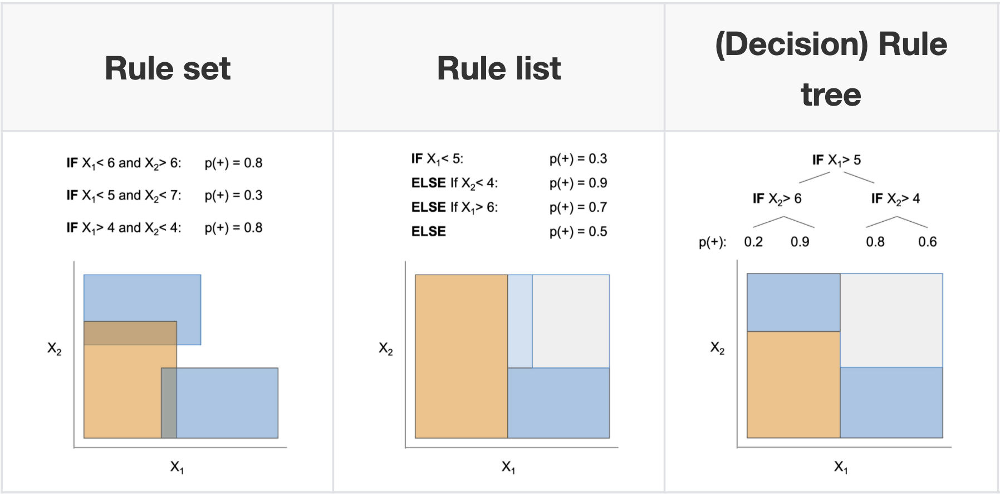
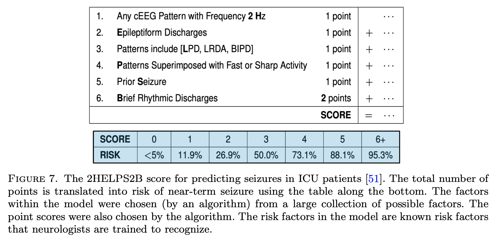
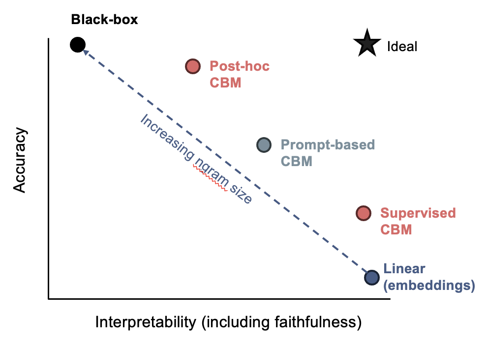
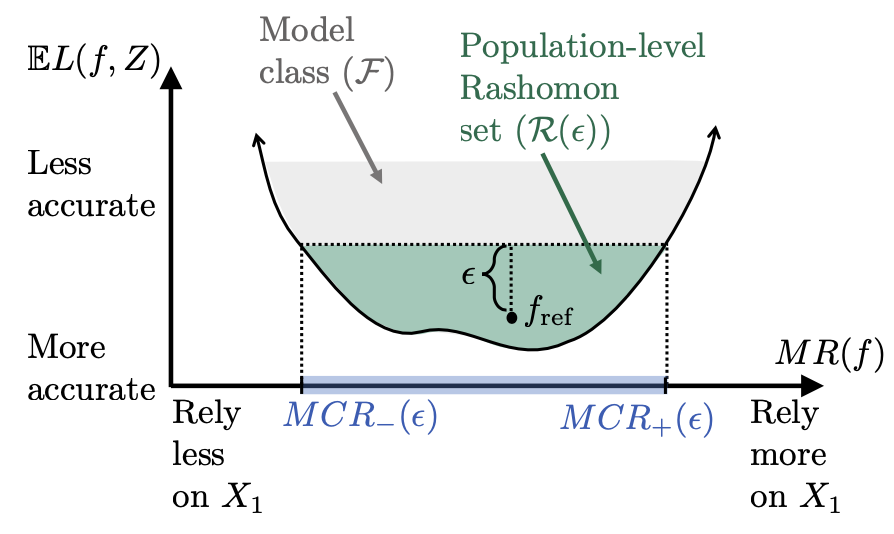

**Some interesting papers on interpretable machine learning, largely organized based on this [interpretable ml review](https://arxiv.org/abs/1901.04592) (murdoch et al. 2019) and notes from this [interpretable ml book](https://christophm.github.io/interpretable-ml-book/) (molnar 2019). For interpretability specific to transformers, see [here](https://csinva.io/notes/research_ovws/ovw_transformers.html)**.

{:toc}

The definition of interpretability I like most is that given in [murdoch et al. 2019](https://arxiv.org/abs/1901.04592), which states that  interpretability needs to be grounded in order to be useful. Specifically, interpretability is only defined with respect to a specific audience + problem and an interpretation should be evaluated in terms of how well it benefits that context. 

  
Useful overview figures from the papers below

	

	
	
	
	

- Feature (variable) importance measurement review (VIM) ([wei et al. 2015](https://www.sciencedirect.com/science/article/pii/S0951832015001672))
  - often-termed sensitivity, contribution, or impact
  - some of these can be applied to data directly w/out model (e.g. correlation coefficient, rank correlation coefficient, moment-independent VIMs)
- Towards a Generic Framework for Black-box Explanation Methods ([henin & metayer 2019](https://hal.inria.fr/hal-02131174v2/document))
  - sampling - selection of inputs to submit to the system to be explained
  - generation - analysis of links between selected inputs and corresponding outputs to generate explanations
    1. *proxy* - approximates model (ex. rule list, linear model)
    2. *explanation generation* - explains the proxy (ex. just give most important 2 features in rule list proxy, ex. LIME gives coefficients of linear model, Shap: sums of elements)
  - interaction (with the user)
  - this is a super useful way to think about explanations (especially local), but doesn't work for SHAP / CD which are more about how much a variable contributes rather than a local approximation
- Interpretable Machine Learning: Fundamental Principles and 10 Grand Challenges ([rudin et al. '21](https://arxiv.org/abs/2103.11251)) - emphasizes building glass-box models
- Stop Explaining Black Box Machine Learning Models for High Stakes Decisions and Use Interpretable Models Instead ([rudin, 2019](https://arxiv.org/abs/1811.10154))

# evaluating interpretability

Evaluating interpretability is often fraught (largely because it rarely makes sense to talk about interpretability outside of a specific context, so ML conference papers instead evaluate whatever proxy makes their method look good). The best possible evaluation of interpretability requires benchmarking it with respect to the relevant audience in a context. For example, if an interpretation claims to help understand radiology models, it should be tested based on how well it helps radiologists when actually making diagnoses. The papers here try to find more generic alternative ways to evaluate interp methods (or just define desiderata to do so).

- Towards A Rigorous Science of Interpretable Machine Learning ([doshi-velez & kim 2017](https://arxiv.org/pdf/1702.08608.pdf))
  
  - |                                  | Humans         | Tasks        |
    | :------------------------------- | :------------- | :----------- |
    | Application-grounded Evaluation  | Real  Humans   | Real Tasks   |
    | Human-grounded Evaluation        | Real Humans    | Simple Tasks |
    | Functionally-grounded Evaluation | No Real Humans | Proxy Tasks  |
  
- Feature importance

  - Benchmarking Attribution Methods with Relative Feature Importance ([yang & kim 2019](https://arxiv.org/abs/1907.09701)) - train a classifier, add random stuff (like dogs) to the image, classifier should assign them little importance

    Visualizing the Impact of Feature Attribution Baselines ([sturmfels, lundberg, & lee, 2020](https://distill.pub/2020/attribution-baselines/))

    - top-k-ablation: should identify top pixels, ablate them, and want it to actually decrease
    - center-of-mass ablation: also could identify center of mass of saliency map and blur a box around it (to avoid destroying feature correlations in the model)
    - should we be true-to-the-model or true-to-the-data?

  - Evaluating Feature Importance Estimates ([hooker et al. 2019](https://arxiv.org/abs/1806.10758))

    - remove-and-retrain test accuracy decrease

  - Do Explanations Reflect Decisions? A Machine-centric Strategy to Quantify the Performance of Explainability Algorithms ([lin et al. 2019](https://arxiv.org/abs/1910.07387))

- Misc

  - Quantifying Interpretability of Arbitrary Machine Learning Models Through Functional Decomposition ([molnar 2019](https://arxiv.org/pdf/1904.03867.pdf))
  - Evaluating Explanation Without Ground Truth in Interpretable Machine Learning ([yang et al. 2019](https://arxiv.org/pdf/1907.06831.pdf))
    - predictability (does the knowledge in the explanation generalize well)
    - fidelity (does explanation reflect the target system well)
    - persuasibility (does human satisfy or comprehend explanation well)

## human-centric

- Interpreting Interpretability: Understanding Data Scientists’ Use of Interpretability Tools for Machine Learning ([kaur, ..., caruana, wallach, vaughan, 2020](https://dl.acm.org/doi/pdf/10.1145/3313831.3376219))
  - used contextual inquiry + survey of data scientists (SHAP & InterpretML GAMs)
  - results indicate that data scientists over-trust and misuse interpretability tools 
  - few of our participants were able to accurately describe the visualizations output by these tools

- An Evaluation of the Human-Interpretability of Explanation ([lage...been kim, gershman, doshi-velez 2019](https://arxiv.org/pdf/1902.00006.pdf)) - controlled human experiments as a few key aspects (explanation length, number of concepts, repeated terms) are varied
- Manipulating and Measuring Model Interpretability ([sangdeh ... vaughan, wallach 2019](https://arxiv.org/abs/1802.07810))
  - participants who were shown a clear model with a small number of features were better able to simulate the model’s predictions
  - no improvements in the degree to which participants followed the model’s predictions when it was beneficial to do so.
  - increased transparency hampered people’s ability to detect when the model makes a sizable mistake and correct for it, seemingly due to information overload
- On Evaluating Explanation Utility for Human-AI Decision-Making in NLP ([chaleshtori, ghoshal, marasovic, 2023](https://openreview.net/pdf?id=8BR8EaWNTZ)) - different human evaluations of NLP explanations have succeeded in different ways (meta-analysis)
- Evaluating the Utility of Model Explanations for Model Development ([im, andreas, & zhao, 2023](https://arxiv.org/abs/2312.06032))

## interpretation weaknesses & sanity checks

- Sanity Checks for Saliency Maps ([adebayo et al. 2018](https://papers.nips.cc/paper/8160-sanity-checks-for-saliency-maps.pdf))- test what happens when randomizing model parameters - attributions should be different for trained vs random model, but they aren't for many attribution methods
- Rethinking the Role of Gradient-based Attribution Methods for Model Interpretability ([srinivas & fleuret, 2021](https://openreview.net/forum?id=dYeAHXnpWJ4))
  - logits can be arbitrarily shifted without affecting preds / gradient-based explanations
  - gradient-based explanations then, don't necessarily capture info about $p_\theta(y|x)$

- Interpretation of Neural Networks is Fragile ([ghorbani et al. 2018](https://arxiv.org/abs/1710.10547))
  - minor perturbations to inputs can drastically change DNN interpretations
  - 

    
Intuition figure

    
	
    

    

- How can we fool LIME and SHAP? Adversarial Attacks on Post hoc Explanation Methods ([slack, ..., singh, lakkaraju, 2020](https://arxiv.org/abs/1911.02508))
  - we can build classifiers which use important features (such as race) but explanations will not reflect that
  - basically classifier is different on X which is OOD (and used by LIME and SHAP)
  
- Fooling Neural Network Interpretations via Adversarial Model Manipulation ([heo, joo, & moon 2019](https://arxiv.org/abs/1902.02041)) - can change model weights so that it keeps predictive accuracy but changes its interpretation
  - motivation: could falsely look like a model is "fair" because it places little saliency on sensitive attributes
    - output of model can still be checked regardless
  - fooled interpretation generalizes to entire validation set
  - can force the new saliency to be whatever we like
    - passive fooling - highlighting uninformative pixels of the image
    - active fooling - highlighting a completely different object, the firetruck
  - **model does not actually change that much** - predictions when manipulating pixels in order of saliency remains similar, very different from random (fig 4)
  
- Counterfactual Explanations Can Be Manipulated ([slack,...,singh, 2021](https://arxiv.org/abs/2106.02666)) - minor changes in the training objective can drastically change counterfactual explanations

- Do Input Gradients Highlight Discriminative Features? ([shah et a. 2021](https://arxiv.org/abs/2102.12781)) - input gradients often don't highlight relevant features (they work better for adv. robust models)

  - prove/demonstrate this in synthetic dataset where $x=ye_i$ for standard basis vector $e_i$, $y=\{\pm 1\}$

# intrinsic interpretability (i.e. how can we fit a simpler model) = transparent models

For an implementation of many of these models, see the python [imodels package](https://github.com/csinva/imodels).

## decision rules overview

*📌 see also notes on [logic](https://csinva.io/notes/ai/logic.html)*

- 2 basic concepts for a rule
  - coverage = support
  - accuracy = confidence = consistency
    - measures for rules: precision, info gain, correlation, m-estimate, Laplace estimate
- these algorithms often don't natively supportregression, but you can get regression by cutting the outcome into intervals
- why might these be useful?
  - The Magical Mystery Four: How is Working Memory Capacity Limited, and Why? ([cowan, 2010](https://www.ncbi.nlm.nih.gov/pmc/articles/PMC2864034/) ) - a central memory store is limited to 3 to 5 meaningful items in young adults
  - [Feldman (2000)](https://pubmed.ncbi.nlm.nih.gov/11034211/): humans can understand logical rules with boolean complexity of up to 5–9, depending on their ability, where the boolean complexity is the length of the shortest Boolean formula logically equivalent to the concept, usually expressed in terms of the number of literals
  
- connections
  - every decision list is a (one-sided) decision tree
  - every decision tree can be expressed as an equivalent decision list (by listing each path to a leaf as a decision rule)
  - leaves of a decision tree (or a decision list) form a decision set
- recent work directly optimizes the performance metric (e.g., accuracy) with soft or hard sparsity constraints on the tree size, where sparsity is measured by the number of leaves in the tree using:
  1. mathematical programming, including mixed integer programming (MIP) / SAT solvers
  2. stochastic search through the space of trees
  3. customized dynamic programming algorithms that incorporate branch-and-bound techniques for reducing the size of the search space

### rule sets

*Rule sets commonly look like a series of independent if-then rules. Unlike trees / lists, these rules can be overlapping and might not cover the whole space. Final predictions can be made via majority vote, using most accurate rule, or averaging predictions. Sometimes also called rule ensembles.*

- popular ways to learn rule sets
  - [SLIPPER](http://citeseerx.ist.psu.edu/viewdoc/download?doi=10.1.1.33.1184&rep=rep1&type=pdf) (cohen, & singer, 1999) - repeatedly boosting a simple, greedy rule-builder
  - [Lightweight Rule Induction](http://citeseerx.ist.psu.edu/viewdoc/summary?doi=10.1.1.34.4619) (weiss & indurkhya, 2000) - specify number + size of rules and classify via majority vote
  - [Maximum Likelihood Rule Ensembles](https://dl.acm.org/doi/pdf/10.1145/1390156.1390185?casa_token=Lj3Ypp6bLzoAAAAA:t4p9YRPHEXJEL723ygEW5BJ9qft8EeU5934vPJFf1GrF1GWm1kctIePQGeaRiKHJa6ybpqtTqGg1Ig) (Dembczyński et al. 2008) - MLRules - rule is base estimator in ensemble - build by greedily maximizing log-likelihood
- [rulefit](https://projecteuclid.org/euclid.aoas/1223908046) (friedman & popescu, 2008) - extract rules from many decision trees, then fit sparse linear model on them
  - [A statistical approach to rule learning](https://dl.acm.org/doi/abs/10.1145/1143844.1143943?casa_token=74Cp4L015WQAAAAA:V8gYM4NMkiqRTmuGxtsnnTVZFaXl-eSzmLWFt78aVfoukuuZ-Y4-H-p3e-bF7EhA23uxKJ_oqLNq) (ruckert & kramer, 2006) - unsupervised objective to mine rules with large maring and low variance before fitting linear model
  - [Generalized Linear Rule Models](http://proceedings.mlr.press/v97/wei19a.html) (wei et al. 2019) - use column generation (CG) to intelligently search space of rules
    - re-fit GLM as rules are generated, reweighting + discarding
      - with large number of columns, can be intractable even to enumerate rules - CG avoids this by fitting a subset and using it to construct most promising next column
    - also propose a non-CG algorithm using only 1st-degree rules
    - note: from every pair of complementary singleton rules (e.g., $X_j \leq1$, $X_j > 1$), they remove one member as otherwise the pair together is collinear
  - [Multivariate Adaptive Regression Splines (MARS)](https://www.jstor.org/stable/2241837?casa_token=15XQTGF9ItgAAAAA%3A3dmi0WboPsb0TMDj6d0yefz1YUWUrQmKzh21NvMgpyQ_gbuveUibjIQY2Gq6J8C9-9HJ70QZns9x2MfB70dEGlll5RIgZ_VS3qPhRbbBMsrLwuD8H-0wmQ&seq=1#metadata_info_tab_contents) (friedman, 1991) - sequentially learn weighted linear sum of ReLus (or products of ReLus)
    - do backward deletion procedure at the end
    - [MARS via LASSO](https://arxiv.org/pdf/2111.11694.pdf) (ki, fang, & guntuboyina, 2021)
  - [Hardy-Krause denoising](https://arxiv.org/abs/1903.01395) (fang, guntuboyina, & sen, 2020) - builds additive models of piecewise constant functions along with interactions and then does LASSO on them
- more recent global versions of learning rule sets
  - [interpretable decision set](https://dl.acm.org/citation.cfm?id=2939874) (lakkaraju et al. 2016) - set of if then rules
    - short, accurate, and non-overlapping rules that cover the whole feature space and pay attention to small but important classes
  - [A Bayesian Framework for Learning Rule Sets for Interpretable Classification](http://www.jmlr.org/papers/volume18/16-003/16-003.pdf) (wang et al. 2017) - rules are a bunch of clauses OR'd together (e.g. if (X1>0 AND X2<1) OR (X2<1 AND X3>1) OR ... then Y=1)
    - they call this method "Bayesian Rule Sets"
    - [Or's of And's for Interpretable Classification, with Application to Context-Aware Recommender Systems](https://arxiv.org/abs/1504.07614) (wang et al. 2015) - BOA - Bayesian Or's of And's
  - [Vanishing boosted weights: A consistent algorithm to learn interpretable rules](https://www.sciencedirect.com/science/article/abs/pii/S0167865521003081) (sokolovska et al. 2021) - simple efficient fine-tuning procedure for decision stumps
- when learning sequentially, often useful to prune at each step (Furnkranz, 1997)
- Multi-value Rule Sets for Interpretable Classification with Feature-Efficient Representations ([wang, 2018](https://proceedings.neurips.cc/paper/2018/file/32bbf7b2bc4ed14eb1e9c2580056a989-Paper.pdf))
  - measure how long it takes for people to calculate predictions from different rule-based models

### rule lists

- oneR algorithm - select feature that carries most information about the outcome and then split multiple times on that feature
- sequential covering - keep trying to cover more points sequentially
- pre-mining frequent patterns (want them to apply to a large amount of data and not have too many conditions)
  - FP-Growth algorithm (borgelt 2005) is fast
  - Aprior + Eclat do the same thing, but with different speeds
  - [random intersection trees](https://arxiv.org/pdf/1303.6223.pdf)
- [interpretable classifiers using rules and bayesian analysis](https://projecteuclid.org/download/pdfview_1/euclid.aoas/1446488742) (letham et al. 2015)
  - start by pre-mining frequent patterns rules
    - current approach does not allow for negation (e.g. not diabetes) and must split continuous variables into categorical somehow (e.g. quartiles)
    - mines things that frequently occur together, but doesn't look at outcomes in this step - okay (since this is all about finding rules with high support)
  - learn rules w/ prior for short rule conditions and short lists
    - start w/ random list 
    - sample new lists by adding/removing/moving a rule
    - at the end, return the list that had the highest probability
  - [scalable bayesian rule lists](https://dl.acm.org/citation.cfm?id=3306086) (yang et al. 2017) - faster algorithm for computing
    - doesn't return entire posterior
  - [learning certifiably optimal rules lists](https://dl.acm.org/citation.cfm?id=3098047) (angelino et al. 2017) - even faster optimization for categorical feature space
    - can get upper / lower bounds for loss = risk + $\lambda$ * listLength
    - doesn't return entire posterior
- [Expert-augmented machine learning](https://arxiv.org/abs/1903.09731) (gennatas et al. 2019)
  - make rule lists, then compare the outcomes for each rule with what clinicians think should be outcome for each rule
  - look at rules with biggest disagreement and engineer/improve rules or penalize unreliable rules
- [Fast and frugal heuristics: The adaptive toolbox.](https://psycnet.apa.org/record/1999-04366-001) (gigerenzer et al. 1999) - makes rule lists that can split on either node of the tree each time

### trees

*Trees suffer from the fact that they have to cover the entire decision space and often we end up with replicated subtrees.*

- history
  
  - automatic interaction detection (AID) regression trees (Morgan & Sonquist, 1963)
  - THeta Automatic Interaction Detection (THAID) classification trees (Messenger & Mandell, 1972)
  - Chi-squared Automatic Interaction Detector (CHAID) (Kass, 1980)
  - CART: Classification And Regression Trees  ([Breiman et al. 1984](https://www.taylorfrancis.com/books/mono/10.1201/9781315139470/classification-regression-trees-leo-breiman-jerome-friedman-richard-olshen-charles-stone)) - splits on GINI
  - ID3 (Quinlan, 1986)
  - C4.5 (Quinlan, 1993) - splits on binary entropy instead of GINI
  
- optimal trees
  
  - motivation
    - cost-complexity pruning ([breiman et al. 1984](https://www.taylorfrancis.com/books/mono/10.1201/9781315139470/classification-regression-trees-leo-breiman-jerome-friedman-richard-olshen-charles-stone) ch 3) - greedily prune while minimizing loss function of loss + $\lambda \cdot (\text{numLeaves})$
    - replicated subtree problem ([Bagallo & Haussler, 1990](https://link.springer.com/content/pdf/10.1007/BF00115895.pdf)) - they propose iterative algorithms to try to overcome it
  - GOSDT: Generalized and Scalable Optimal Sparse Decision Trees ([lin...rudin, seltzer, 2020](https://arxiv.org/abs/2006.08690))
    - optimize for $\min L(X, y) + \lambda \cdot (\text{numLeaves})$ 
    - full decision tree optimization is NP-hard ([Laurent & Rivest, 1976](https://people.csail.mit.edu/rivest/HyafilRivest-ConstructingOptimalBinaryDecisionTreesIsNPComplete.pdf))
    - can optimize many different losses (e.g. accuracy, AUC)
    - speedups: use dynamic programming, prune the search-space with bounds
      - How Smart Guessing Strategies Can Yield Massive Scalability Improvements for Sparse Decision Tree Optimization ([mctavish...rudin, seltzer, 2021](https://arxiv.org/abs/2112.00798))
      - hash trees with bit-vectors that represent similar trees using shared subtrees
        - tree is a *set* of *leaves*
      - derive many bounds
        - e.g. if know best loss so far, know shouldn't add too many leaves since each adds $\lambda$ to the total loss
        - e.g. similar-support bound - if two features are similar, then bounds for splitting on the first can be used to obtain bounds for the second
    - OSDT: optimal sparse decision trees ([hu et al. 2019](https://arxiv.org/abs/1904.12847)) - previous paper, slower
      - bounds: Upper Bound on Number of Leaves, Leaf Permutation Bound
    - Fast Optimization of Weighted Sparse Decision Trees for use in Optimal Treatment Regimes and Optimal Policy Design ([behrouz...rudin, & seltzer, 2022](https://www.ncbi.nlm.nih.gov/pmc/articles/PMC10039433/)) - extend method to work with weights on samples
  - OCT: optimal classification trees methodology paper ([bertsimas & dunn, 2017](https://link.springer.com/content/pdf/10.1007%2Fs10994-017-5633-9.pdf)) - solve optimal tree with expensive, mixed-integer optimization - realistically, usually too slow
    - $\begin{array}{cl}
      \min & \overbrace{R_{x y}(T)}^{\text{misclassification err}}+\alpha|T| \\
      \text { s.t. } & N_{x}(l) \geq N_{\min } \quad \forall l \in \text { leaves }(T)
      \end{array}$
    - $|T|$ is the number of branch nodes in tree $T$
    - $N_x(l)$ is the number of training points contained in leaf node $l$
    - optimal classification trees on PECARN TBI ([bertsimas et al. 2019](https://jamanetwork.com/journals/jamapediatrics/article-abstract/2733157))
  - Learning Optimal Fair Classification Trees ([jo et al. 2022](https://arxiv.org/pdf/2201.09932.pdf))
  - Better Short than Greedy: Interpretable Models through Optimal Rule Boosting ([boley, ..., webb, 2021](https://epubs.siam.org/doi/pdf/10.1137/1.9781611976700.40)) - find optimal tree **ensemble** (only works for very small data)
  
- connections with boosting
  - Fast Interpretable Greedy-Tree Sums (FIGS) ([tan et al. 2022](https://arxiv.org/abs/2201.11931)) - extend cart to learn concise tree ensembles 🌳 ➡️ 🌱+🌱
    - very nice results for generalization + disentanglement
  - AdaTree - learn Adaboost stumps then rewrite as a tree ([grossmann, 2004](https://ieeexplore.ieee.org/abstract/document/1384899/)) 🌱+🌱 ➡️ 🌳
    - note: easy to rewrite boosted stumps as tree (just repeat each stump for each node at a given depth) 
  - MediBoost - again, learn boosted stumps then rewrite as a tree ([valdes...solberg 2016](https://www.nature.com/articles/srep37854.pdf)) 🌱+🌱 ➡️ 🌳 but with 2 tweaks:
    - shrinkage: use membership function that accelerates convergence to a decision (basically shrinkage during boosting)
    - prune the tree in a manner that does not affect the tree’s predictions
      - prunes branches that are impossible to reach by tracking the valid domain for every attribute (during training)
      - post-prune the tree bottom-up by recursively eliminating the parent nodes of leaves with identical predictions
  - AddTree = additive tree - learn single tree, but rather than only current node's data to decide the next split, also allow the remaining data to also influence this split, although with a potentially differing weight ([luna, ..., friedman, solberg, valdes, 2019](https://www.pnas.org/content/116/40/19887))
    - the weight is chosen as a hyperparameter
  - Additive groves ([sorokina, carauna, & riedewald 2007](https://link.springer.com/chapter/10.1007/978-3-540-74958-5_31)) - additive model of a few deep trees (gradually increase number and size of trees)
  - Random Planted Forest: a directly interpretable tree ensemble ([hiabu, mammen, & meyer, 2023](https://arxiv.org/abs/2012.14563)) - propose a planted tree very similar to FIGS, but use it in a randomized ensemble that restricts the number of interactions in a tree (similar to GAMs)

- bayesian trees
  - Bayesian Treed Models ([chipman et al. 2001](http://www-stat.wharton.upenn.edu/~edgeorge/Research_papers/treed-models.pdf)) - impose priors on tree parameters
    - treed models - fit a model (e.g. linear regression) in leaf nodes
    - tree structure e.g. depth, splitting criteria
    - values in terminal nodes coditioned on tree structure
    - residual noise's standard deviation
    - Stochastic gradient boosting ([friedman 2002](https://www.sciencedirect.com/science/article/abs/pii/S0167947301000652)) - boosting where at iteration a subsample of the training data is used
  - BART: Bayesian additive regression trees ([chipman et al. 2008](https://arxiv.org/abs/0806.3286)) - learns an ensemble of tree models using MCMC on a distr. imbued with a prior (not interpretable)
    - pre-specify number of trees in ensemble
    - MCMC step: add split, remove split, switch split
    - cycles through the trees one at a time

- tree regularization

  - Hierarchical Shrinkage: improving accuracy and interpretability of tree-based methods ([agarwal et al. 2021](https://arxiv.org/abs/2202.00858)) - post-hoc shrinkage improves trees
  - Hierarchical priors for Bayesian CART shrinkage ([chipman & mcculloch, 2000](https://link.springer.com/article/10.1023/A:1008980332240))
  - Connecting Interpretability and Robustness in Decision Trees through Separation ([moshkovitz et al. 2021](https://arxiv.org/abs/2102.07048))
    - [Efficient Training of Robust Decision Trees Against Adversarial Examples](https://arxiv.org/abs/2012.10438)
  - [Robust Decision Trees Against Adversarial Examples](https://arxiv.org/abs/1902.10660) (chen, ..., hsieh, 2019)
    - optimize tree performance under worst-case input-feature perturbation

- trees for density estimation

  - in density estimation, we seek a tree $\hat{f}(\mathbf{x})$ approximating the underlying density function $f(\mathbf{x})$
  - ideal loss function to minimize is $\mathcal{R}=\int(\hat{f}(\mathbf{x})-f(\mathbf{x}))^2 \mathrm{~d} \mathbf{x}$
  - instead, we minimize approximation for a node t: $\mathcal{R}(t) = \frac{1}{n} \frac{n_t}{Vol_t}$
    - $n$ is total points in dataset
    - $n_t$ is points in node $t$
    - $Vol_t$ is volume of the subset of the data that meets the criteria leading to that node (e.g. given 2 splits on different features, it would be area of a square bounded on one side by the split and the other side by the max

  - Density Estimation Trees ([ram & gray, 2011](https://mlpack.org/papers/det.pdf))
  - Sparse Density Trees and Lists: An Interpretable Alternative to High-Dimensional Histograms ([goh, semenova, & rudin, 2024](https://pubsonline.informs.org/doi/pdf/10.1287/ijds.2021.0001))
  - On the price of explainability for some clustering problems ([laber et al. 2021](https://arxiv.org/abs/2101.01576)) - trees for clustering
  - Interpretable clustering: an optimization approach ([bertsimas…wilberg, 2020](https://link.springer.com/article/10.1007/s10994-020-05896-2))

- open problems: ensemble methods, improvements in splitting criteria, missing variables, longitudinal data, survival curves
  
- misc
  
  - On the Power of Decision Trees in Auto-Regressive Language Modeling ([gan, galanti, poggio, malach, 2024](https://arxiv.org/pdf/2409.19150))
    - get token word embeddings
    - compute exp. weighted avg of embeddings (upweights most recent tokens)
    - predicts next embedding with XGBoost (regression loss) then finds closest token
  - counterfactuals
    - [Counterfactual Explanations for Oblique Decision Trees: Exact, Efficient Algorithms](https://arxiv.org/abs/2103.01096) (2021)
    - [Optimal Counterfactual Explanations in Tree Ensembles](https://arxiv.org/abs/2106.06631)
    - [Desiderata for Interpretability: Explaining Decision Tree Predictions with Counterfactuals](https://ojs.aaai.org//index.php/AAAI/article/view/5154)
  - [Human knowledge models: Learning applied knowledge from the data](https://journals.plos.org/plosone/article?id=10.1371/journal.pone.0275814) (dudyrev...pianykh, 2022) - very concise logic model
  - extremely randomized trees ([geurts ernst, & wehenkel, 2006](https://link.springer.com/article/10.1007/s10994-006-6226-1)) - randomness goes further than Random Forest - randomly select not only the feature but also the split thresholds (and select the best out of some random set)
  - Constraint Enforcement on Decision Trees: A Survey ([nanfack...brenay, 2022](https://dl.acm.org/doi/pdf/10.1145/3506734))
    - 3 classes of constraints
      1. feature-level: monotonicity, attribute costs, hierarchy/interaction, fairness, privacy
      2. structure-level - e.g. minimize #nodes
      3. instance-level - must (cannot) link, robust predictions
  
- Analysis of Boolean functions ([wiki](https://en.wikipedia.org/wiki/Analysis_of_Boolean_functions))

  - Every real-valued function $f:\{-1,1\}^n \rightarrow \mathbb{R}$ has a unique expansion as a multilinear polynomial:
    $$
    f(x)=\sum_{S \subseteq[n]} \hat{f}(S) \chi_S(x), \quad \overbrace{\chi_S(x)=\prod_{i \in S} x_i}^{\text{Interactions}}
    $$

### decision diagrams

*Also called decision graphs / decision streams*

- Algorithms for learning diagrams usually postprocess a given tree (and taking an MDL perspective)
- Decision diagrams for model compression
  - [Simplifying decision trees: A survey](https://www.cambridge.org/core/journals/knowledge-engineering-review/article/abs/simplifying-decision-trees-a-survey/CEE7A6994E66E821DB4A12DD83DC3810) (breslow & aha, 1997)
  - [Large Random Forests: Optimisation for Rapid Evaluation](https://arxiv.org/abs/1912.10934) (gossen & steffen, 2019)
- [Optimal Decision Diagrams for Classification](https://arxiv.org/pdf/2205.14500.pdf) (florio...vidal 2022) - decision diagrams are like trees but paths can rejoin
- Extracting rules from neural networks as decision diagrams [(Chorowski, J., J.M. Zurada. 2011](https://pubmed.ncbi.nlm.nih.gov/21335310/))
- [Decision Jungles: Compact and Rich Models for Classification](https://proceedings.neurips.cc/paper/2013/hash/69adc1e107f7f7d035d7baf04342e1ca-Abstract.html) (shotton et al. 2013) - ensembles of decision diagrams
- [Decision Stream: Cultivating Deep Decision Trees](https://ieeexplore.ieee.org/abstract/document/8372043) (ignatov & ignatov, 2017)
  - merge nodes from different branches based on their similarity that is estimated with two-sample test statistics
  - nothing to do with deep learning

- misc
  - [Optimizing Binary Decision Diagrams for Interpretable Machine Learning Classification](https://ieeexplore.ieee.org/abstract/document/9474083) (cabodi et al. 2021)
  - proposing a SAT-based model for computing a decision tree as the smallest Reduced Ordered Binary Decision Diagram
  - exploring heuristic approaches for deriving sub-optimal (i.e., not minimal) ROBDDs, in order to improve the scalability of the proposed technique.
  - [Optimizing Binary Decision Diagrams with MaxSAT for classification](https://arxiv.org/abs/2203.11386) (hu et al. 2022)
  - Deep Differentiable Logic Gate Networks ([peterson, ..., deussen, 2022](https://arxiv.org/pdf/2210.08277.pdf))

## linear (+algebraic) models

### gams (generalized additive models)

- gam takes form $g(\mu) = b + f_0(x_0) + f_1(x_1) + f_2(x_2) + ...$
  - usually assume some basis for the shape functions $f$, like splines, polynomials, or tree sums (and we select how many either manually or with some complexity penalty)
  - *backfitting* - traditional way to fit - each $f_i$ is fitted sequentially to the residuals of the previously fitted $f_0,...,f_{i-1}$ ([hastie & tibshirani, 1989](https://www.jstor.org/stable/2241560?seq=1#metadata_info_tab_contents))
    - once all are fit, discard each shape function and re-fit to the residuals of all others one at a time
  - (cyclic) *boosting* - fit all $f$ simultaneously, e.g. one tree for each $f_i$ on each iteration
  - interpretability depends on (1) transparency of $f_i$ and (2) number of terms
  - can also add in interaction terms (e.g. $f_i(x_1, x_2)$), but need a way to rank which interactions to add (see notes on interactions)
- Explainable boosting machine: tree-based shape functions trained with cyclical boosting
  - Intelligible models for classification and regression ([lou, caruana, & gehrke, 2012](https://dl.acm.org/doi/abs/10.1145/2339530.2339556)) - find that gradient boosting with shallow trees outperforms other models for $f_i$
  - $GA^2M$ ([lou, caruana, gehrke, & hooker, 2013](https://dl.acm.org/doi/abs/10.1145/2487575.2487579)) - select interactions using algorithm called FAST
  - Pneumonia risk ([caruana, lou, gehrke, koch, sturm, & elhadad, 2015](https://www.microsoft.com/en-us/research/wp-content/uploads/2017/06/KDD2015FinalDraftIntelligibleModels4HealthCare_igt143e-caruanaA.pdf)) - application of GA2M finds interesting patterns (e.g. asthma decreases pneumonia risk)
  - InterpretML: A Unified Framework for Machine Learning Interpretability ([nori...caruana 2019](https://arxiv.org/abs/1909.09223)) - software package mostly for EBM
  - Adding differential privacy to EBM ([nori, caruana et al. 2021](https://arxiv.org/abs/2106.09680))
- Neural Additive Models: Interpretable Machine Learning with Neural Nets ([agarwal, ..., caruana, & hinton, 2021](https://arxiv.org/abs/2004.13912)) - shape functions are a DNN (also use ExU activation instead of ReLU to model sharp bumps)
  - no interaction terms
  - NODE-GAM: Neural Generalized Additive Model for Interpretable Deep Learning ([chang, caruana, & goldenberg, 2021](https://arxiv.org/abs/2106.01613))
    - $NODE-GA^2M$: include interaction terms by initializing with all interaction terms and backprop decides which are kept
    - uses neural oblivious trees rather than standard DNN
    - idea dates back to [Generalized Additive Neural Networks](https://dl.acm.org/doi/pdf/10.1145/312129.312228) (potts, 1999)
  - [Sparse Neural Additive Model: Interpretable Deep Learning with Feature Selection via Group Sparsity](https://arxiv.org/abs/2202.12482)
  - [Creating Powerful and Interpretable Models with Regression Networks](https://arxiv.org/abs/2107.14417) (2021) - generalizes neural GAM to include interaction terms
    - train first-order functions
    - fix them and predict residuals with next order (and repeat for as many orders as desired)
- Spline-based models
  - Fast Stable Direct Fitting and Smoothness Selection for Generalized Additive Models ([wood, 2008](https://academic.oup.com/jrsssb/article/70/3/495/7109556))
- Other models
  - Additive Models with Trend Filtering ([sadhanala & tibshirani, 2018](https://arxiv.org/abs/1702.05037)) - piecewise polynomial components with total variation regularization
  - Fused Lasso Additive Model ([petersen, weitten & simon, 2014](https://www.tandfonline.com/doi/abs/10.1080/10618600.2015.1073155)) - shape functions are piecewise constant with a small number of knots
- Ensembling
  - Ensemble classification based on generalized additive models ([bock...poel, 2009](https://ideas.repec.org/p/rug/rugwps/09-625.html)) - use sample bagging, feature bagging, and combine both to find improved performance (use spline-based GAMs)
  - Efficiently Training Intelligible Models for Global Explanations ([lou...dong, 2020](http://yinlou.github.io/papers/lou-cikm20.pdf)) - use subsample bagging (bags select from a subset of samples) and speed up fitting by sharing computation between bags that share points
- misc improvements
  - Axiomatic Interpretability for Multiclass Additive Models ([zhang, tan, ... caruana, 2019](https://dl.acm.org/doi/abs/10.1145/3292500.3330898)) - extend GAM to multiclass and improve visualizations in that setting
  - [Sparse Partially Linear Additive Models](https://www.tandfonline.com/doi/full/10.1080/10618600.2015.1089775) (lou, bien, caruana & gehrke, 2015) - some terms are linear and some use $f_i(x_i)$
  - [Neural Basis Models for Interpretability](https://arxiv.org/abs/2205.14120) (2022)
  - [Scalable Interpretability via Polynomials](https://arxiv.org/abs/2205.14108) (2022)
  - How Interpretable and Trustworthy are GAMs? ([chang, tan, lengerich, goldenberg, & caruana, 2021](https://arxiv.org/abs/2006.06466)) - different GAM algorithms provide different interpretations, tree-based GAMs appear best
    - feature-sparse GAMs may perform worse on some data subsets
    - overly smooth GAMs may fail to identify sharp jumps that may be errors in data
    - bias-variance decomposition of different GAM algorithms (based on multiple refits and predictions) shows that some have less bias whereas others less variance

### supersparse models

- four main types of approaches to building scoring systems
  1. exact solutions using optimization techniques (often use MIP)
  2. approximation algorithms using linear programming (use L1 penalty instead of L0)
     1. can also try sampling
  3. more sophisticated rounding techniques - e.g. random, constrain sum, round each coef sequentially
  4. computeraided exploration techniques
- Supersparse linear integer models for optimized medical scoring systems ([ustun & rudin 2016](https://link.springer.com/content/pdf/10.1007/s10994-015-5528-6.pdf))
  - 2helps2b: seizure prediction from EEG ([struck, ustun...rudin, westover](https://www.ncbi.nlm.nih.gov/pubmed/29052706))
  - 
  - note: scoring systems map points to a risk probability
- An Interpretable Model with Globally Consistent Explanations for Credit Risk ([chen et al. 2018](https://arxiv.org/abs/1811.12615)) - a 2-layer linear additive model
- Fast Sparse Classification for Generalized Linear and Additive Models ([liu, ..., seltzer, rudin, 2022](https://arxiv.org/abs/2202.11389))
- Naive Feature Selection: Sparsity in Naive Bayes ([askari...el ghaoui, 2020](http://proceedings.mlr.press/v108/askari20a.html)) - sparse naive bayes feature selection is on par with lasso but much faster
- GroupFasterRisk: Fast and Interpretable Mortality Risk Scores for Critical Care Patients ([zhu...rudin, 2023](https://arxiv.org/pdf/2311.13015.pdf)) - builds linear integer model over bins of features. Group sparsity penalty penalizes number of unique features, whereas a secondary penalty controls the number of bins used per feature

### symbolic regression

Symbolic regression learns a symbolic expression for a function (e.g. a mathematical formula) given priors on what kinds of symbols (e.g. `addition` versus `sin`) are more "difficult" [see also notes on LLM-in-the-loop symbolic regression]

- Interpretable Scientific Discovery with Symbolic Regression: A Review ([makke & chawla, 2022](https://arxiv.org/abs/2211.10873))
- Genetic algorithms
  - Search for tree that represents expression: maximize acc + minimize number of nodes in the tree (e.g. PySR package, [cranmer 2023](https://arxiv.org/abs/2305.01582))
  - Discovering Symbolic Models from Deep Learning with Inductive Biases ([cranmer...ho, 2020](https://arxiv.org/abs/2006.11287)) - rather than learning entire function class at once, learn compositions (so second function takes first function as input), which allows functions to gradually become much more complex
  - Symbolic-Regression Boosting ([sipper & moore, 2022](https://arxiv.org/abs/2206.12082))
  
- Post-hoc distillation
  - Demystifying Black-box Models with Symbolic Metamodels ([alaa, van der schaar, 2019](https://papers.nips.cc/paper/9308-demystifying-black-box-models-with-symbolic-metamodels.pdf)) - distill black-box model with Meijer G-functions (rather than pre-specifying some forms, as is done with symbolic regression)
    - Symbolic Metamodels for Interpreting Black-boxes Using Primitive Functions ([abroshan...khalili, 2023](https://arxiv.org/abs/2302.04791)) - use GP approach
    - Neural Symbolic Regression using Control Variables ([chu...shao, 2023](https://arxiv.org/abs/2306.04718))
  - Discovering Symbolic Models from Deep Learning with Inductive Biases ([cranmer...ho, 2020](https://arxiv.org/abs/2006.11287)) - focused on GNNs
  - Providing Post-Hoc Symbolic Explanations for Sequential Decision-Making Problems with Black Box Simulators ([sreedharan et al. 2020](https://arxiv.org/abs/2002.01080))
- neural networks
  - 2-step symbolic regr: first generate equation skeleton, then optimize constants with GD
    - Neural Symbolic Regression that Scales ([biggio et al. 2021](https://arxiv.org/abs/2106.06427)) - use large pretraining set
    - SymbolicGPT ([valipour...ghodsi, 2021](https://arxiv.org/abs/2106.14131)) - similar but use point cloud rather than attention
    - Deep symbolic regression ([petersen...kim, 2021](https://arxiv.org/pdf/1912.04871.pdf)) - RL-based
  - End-to-End symbolic regression (still use final refinement step)
    - AI Feynman: A physics-inspired method for symbolic regression ([udresku & tegmark, 2020](https://www.science.org/doi/10.1126/sciadv.aay2631)) - use a loop with many if-then checks to decompose the equations
    - End-to-end symbolic regression with transformers ([kamienny...charton, 2022](https://arxiv.org/abs/2204.10532))
    - SymFormer ([vastl...babuska, 2022](https://arxiv.org/abs/2205.15764))
    - Deep Generative Symbolic Regression ([holt...van der schaar, 2023](https://openreview.net/forum?id=o7koEEMA1bR)) - use RL
  - Building and Evaluating Interpretable Models using Symbolic Regression and Generalized Additive Models ([sharif, 2017](https://openreview.net/pdf?id=BkgyvQzmW))
- Logic Regression ([ruczinski, kooperberg & leblanc, 2012](https://amstat.tandfonline.com/doi/abs/10.1198/1061860032238?casa_token=WVNXGYsNPLsAAAAA:eCjYgsRw_WZ6g0GPG9x3CMyHyEV9kwcXvWCC1S0TTbLc7SDBiiyHiKLNtYsuC6WYOpto7xAi6tQ5eQ#.YJB3bGZKjzc)) - given binary input variables, automatically construct interaction terms and linear model (fit using simulated annealing)
- Model Learning with Personalized Interpretability Estimation ([virgolin...wahde, 2021](https://arxiv.org/abs/2104.06060)) - use HITL to decide which symbolic functions are most interpretable

## interpretable neural nets

- Adaptive wavelet distillation from neural networks through interpretations ([Ha et al. 2021](https://arxiv.org/abs/2107.09145)) - distill flexible wavelet using gradient-based interpretation scores from a neural net
- PINN: Physics-informed neural networks: A deep learning framework for solving forward and inverse problems involving nonlinear partial differential equations ([raissi et al. 2019](https://www.sciencedirect.com/science/article/pii/S0021999118307125)) - solve PDEs by constraining neural net to predict specific parameters / derivatives
- Two Instances of Interpretable Neural Network for Universal Approximations ([tjoa & cuntai, 2021](https://arxiv.org/abs/2112.15026)) - each neuron responds to a training point
- B-Cos Networks: Alignment Is All We Need for Interpretability ([bohle...schiele, 2022](https://openaccess.thecvf.com/content/CVPR2022/html/Bohle_B-Cos_Networks_Alignment_Is_All_We_Need_for_Interpretability_CVPR_2022_paper.html)) - promotes weight-input alignment during training

### concepts

*📌 see also notes on LLMs*

- CBM: Concept Bottleneck Models ([koh et al. 2020](https://arxiv.org/pdf/2007.04612.pdf)) - predict intermediate concepts before making final prediction
- Post-hoc CBM ([yuksekgonul...zou, 2022](https://arxiv.org/abs/2205.15480)) - automatically project embeddings to concepts and train linear model on those
  - Visual Classification via Description from Large Language Models ([menon & vondrick, 2022](https://arxiv.org/abs/2210.07183)) - LLM lists relevant classes, and predict using VLM embedding similarities to those claseses
  - Label-Free CBM ([oikarinen...lily weng, 2023](https://arxiv.org/abs/2304.06129)) - extend to learn to match text concepts extracted with embeddings of any vision model
  - uses CLIP-Dissect method ([oikarinen & lily weng, 2023](https://arxiv.org/abs/2204.10965))
  
- CBMs with LLMs / VLMs
  - Crafting Interpretable Embeddings by Asking LLMs Questions ([benara...gao, 2024](https://arxiv.org/pdf/2405.16714)) - use LLM to generate and answer questions corresponding to concepts, then use LASSO to select relevant questions
  - BC-LLM: Bayesian Concept Bottleneck Models with LLM Priors ([feng...tan, 2024](https://arxiv.org/abs/2410.15555)) - use LLM to generate questions from extracted keywords, then iterate on fitting predictive models and searching for new concepts with a Bayesian approach
  - LaBO: Language in a Bottle: Language Model Guided Concept Bottlenecks for Interpretable Image Classification ([yang...yatskar, 2022](https://arxiv.org/pdf/2211.11158.pdf)) - generate prompt-based features using GPT-3 (e.g. "brown head with white stripes") and use CLIP to check for the presence of those features, all before learning simple linear model
    - Knowledge-enhanced Bottlenecks (KnoBo) - A Textbook Remedy for Domain Shifts: Knowledge Priors for Medical Image Analysis ([yang...yatskar, 2024](https://yueyang1996.github.io/papers/knobo.pdf)) - CBMs that incorporate knowledge priors that constrain it to reason with clinically relevant factors found in medical textbooks or PubMed
  - CB-LLM: Crafting Large Language Models for Enhanced Interpretability ([sun...lily weng, 2024](https://lilywenglab.github.io/WengLab_2024_CBLLM.pdf))
    - compute embedding similarity of concepts and input, and train layer to predict each of these similarity scores as concept bottleneck
      - before training bottleneck, use ChatGPT to help correct any concept scores that seem incorrect
    - Human evaluation: agreement of concept scores and contribution of concept to output
    - Concept Bottleneck Large Language Models ([sun, oikarinen, ustun, & lily weng, 2024](https://arxiv.org/abs/2412.07992)) - this updated version of the paper also has results for language modeling
  - Towards Achieving Concept Completeness for Unsupervised Textual Concept Bottleneck Models ([bhan…lesot, 2025](https://arxiv.org/abs/2502.11100)) - distill embeddings from a trained model
- Refining CBMs
  - Tree-Based Leakage Inspection and Control in Concept Bottleneck Models ([ragkousis & parbhoo, 2024](https://arxiv.org/abs/2410.06352)) - investigate where soft version of a feature outperforms hard version of the feature
  - Stochastic Concept Bottleneck Models ([vandenhirtz...vogt, 2024](https://arxiv.org/pdf/2406.19272)) - model covariance between concepts
  - Coarse-to-Fine Concept Bottleneck Models ([panousis...marcos, 2024](https://arxiv.org/pdf/2310.02116))
- MoIE: Route, Interpret, Repeat ([ghosh, ..., batmangehelich, 2023](https://arxiv.org/abs/2302.10289#)) - mixture of different interpretable models, with black-box routing
- SASC ([singh, ..., gao, 2023](https://arxiv.org/abs/2305.09863)) - learn factors from BERT using dictionary learning, assign each factor a natural-language explanation, then build a sparse linear model of these factors
- Towards Robust Interpretability with Self-Explaining Neural Networks ([alvarez-melis & jaakkola 2018](https://arxiv.org/pdf/1806.07538.pdf)) - use regularization to ensure model is aligned with concepts

### localization

- WILDCAT: Weakly Supervised Learning of Deep ConvNets for Image Classification, Pointwise Localization and Segmentation ([durand et al. 2017](https://openaccess.thecvf.com/content_cvpr_2017/html/Durand_WILDCAT_Weakly_Supervised_CVPR_2017_paper.html)) - constrains architecture: after extracting conv features, replace linear layers with special pooling layers, which helps with spatial localization
  - - each class gets a pooling map
    - prediction for a class is based on top-k spatial regions for a class
    - finally, can combine the predictions for each class
- BagNet: Approximating CNNs with Bag-of-local-Features models works surprisingly well on ImageNet ([brendel & bethge, 2019](https://arxiv.org/abs/1904.00760) - CNN is restricted to look at very local features only and still does well (and produces an inbuilt saliency measure)
  - Models are generally biased to learn shapes not texture ([geirhos...brendel, 2019](https://openreview.net/pdf?id=Bygh9j09KX))

### example-based = case-based (e.g. prototypes, nearest neighbor)

- ProtoPNet: This looks like that ([chen, ..., rudin, 2018](https://arxiv.org/abs/1806.10574); 2nd prototypes paper) - learn convolutional prototypes that are smaller than the original input size
  - use L2 distance in repr space to measure distance between patches and prototypes
  - loss function
    - require the filters to be identical to the latent representation of some training image patch
    - cluster image patches of a particular class around the prototypes of the same class, while separating image patches of different classes
  - maxpool class prototypes so spatial location doesn't matter
    - also get heatmap of where prototype was activated (only max really matters)
  - train in 3 steps
    - train everything: classification + clustering around intraclass prototypes + separation between interclass prototypes (last layer fixed to 1s / -0.5s)
    - project prototypes to data patches
    - learn last (linear) layer
  - ProtoNets ([li, ..., rudin, 2017](https://arxiv.org/pdf/1710.04806.pdf); 1st prototypes paper)
    - uses encoder/decoder setup
    - encourage every prototype to be similar to at least one encoded input
    - results: learned prototypes in fact look like digits & correct class prototypes go to correct classes
    - loss: classification + reconstruction + distance to a training point
  - Concept Whitening for Interpretable Image Recognition ([chen, bei, & rudin, 2020](https://arxiv.org/pdf/2002.01650.pdf)) - force network to separate "concepts" (like in TCAV) along different axes
- This Looks Like That, Because ... Explaining Prototypes for Interpretable Image Recognition ([nauta...seifert 2020](https://arxiv.org/abs/2011.02863)) - add textual quantitative information about visual characteristics deemed important by the classification model e.g. colour hue, shape, texture, contrast and saturation
  - Neural Prototype Trees for Interpretable Fine-Grained Image Recognition ([nauta...seifert 2021](https://openaccess.thecvf.com/content/CVPR2021/html/Nauta_Neural_Prototype_Trees_for_Interpretable_Fine-Grained_Image_Recognition_CVPR_2021_paper.html)) - build decision trees on top of prototypes - performance is slightly poor until they use ensembles
- Concept transformers ([rigotti... scotton, 2022](https://openreview.net/pdf?id=kAa9eDS0RdO)) - use human-given concepts and explain predictions as a function of these concepts
- applications to medical imaging
  - IAIA-BL: A Case-based Interpretable Deep Learning Model for Classification of Mass Lesions in Digital Mammography ([barnet...rudin, 2021](https://arxiv.org/abs/2103.12308)) - improve algorithm specifically for mammography

  - XProtoNet: Diagnosis in Chest Radiography With Global and Local Explanations ([eunji kim...yoon, 2021](https://openaccess.thecvf.com/content/CVPR2021/html/Kim_XProtoNet_Diagnosis_in_Chest_Radiography_With_Global_and_Local_Explanations_CVPR_2021_paper.html)) - alter ProtoPNet to use dynamically sized patches for prototype matching rather than fixed-size patches
  - PIP-NET ([nauta...seifert, 2023](https://arxiv.org/pdf/2307.10404.pdf)) - applying prototypes to medical image classification
  - ProtoMIL: Multiple Instance Learning with Prototypical Parts for Fine-Grained Interpretability ([Rymarczyk et al. 2021](https://arxiv.org/abs/2108.10612))

- AutoProtoNet: Interpretability for Prototypical Networks ([sandoval-segura & lawson, 2022](https://arxiv.org/abs/2204.00929))
  - builds interpretability into Prototypical Networks by training an embedding space suitable for reconstructing inputs
  - also devise a prototype refinement method, which allows a human to debug inadequate classification parameters
- TesNet: Interpretable Image Recognition by Constructing Transparent Embedding Space ([wang et al. 2021](https://openaccess.thecvf.com/content/ICCV2021/html/Wang_Interpretable_Image_Recognition_by_Constructing_Transparent_Embedding_Space_ICCV_2021_paper.html)) - alter ProtoPNet to get "orthogonal" basis concepts
- ProtoPShare: Prototype Sharing for Interpretable Image Classification and Similarity Discovery ([Rymarczyk et al. 2020](https://arxiv.org/abs/2011.14340)),- share some prototypes between classes with data-dependent merge pruning

  - merge "similar" prototypes, where similarity is measured as dist of all training patches in repr. space
  - Interpretable Image Classification with Differentiable Prototypes Assignment ([rmyarczyk et al. 2021](https://arxiv.org/abs/2112.02902))
- These *do not* Look Like Those: An Interpretable Deep Learning Model for Image Recognition ([singh & yow, 2021](https://ieeexplore.ieee.org/abstract/document/9373404)) - all weights for prototypes are either 1 or -1
- Towards Explainable Deep Neural Networks ([angelov & soares 2019](https://arxiv.org/abs/1912.02523)) - more complex version of using prototypes
- Self-Interpretable Model with Transformation Equivariant Interpretation ([wang & wang, 2021](https://arxiv.org/abs/2111.04927))
  - generate data-dependent prototypes for each class and formulate the prediction as the inner product between each prototype and the extracted features
    - interpretation is hadamard product of prototype and extracted features (prediction is sum of this product)
  - interpretations can be easily visualized by upsampling from the prototype space to the input data space
  - regularization
    - reconstruction regularizer - regularizes the interpretations to be meaningful and comprehensible
      - for each image, enforce each prototype to be similar to its corresponding class's latent repr.
    - transformation regularizer - constrains the interpretations to be transformation equivariant
  - *self-consistency score* quantifies the robustness of interpretation by measuring the consistency of interpretations to geometric transformations
- ProtoAttend: Attention-Based Prototypical Learning ([arik & pfister, 2020](https://www.jmlr.org/papers/volume21/20-042/20-042.pdf)) - unlike ProtoPNet, each prediction is made as a weighted combination of similar input samples (like nearest-neighbor)
- Explaining Latent Representations with a Corpus of Examples ([crabbe, ..., van der schaar 2021](https://arxiv.org/pdf/2110.15355.pdf)) - for an individual prediction,
  1. Which corpus examples explain the prediction issued for a given test example?
  2. What features of these corpus examples are relevant for the model to relate them to the test example?
- [Interpreting Deep Neural Networks through Prototype Factorization](https://ieeexplore.ieee.org/abstract/document/9346401) - posthoc convert DNN into having different factors
- ProtoPFormer: Concentrating on Prototypical Parts in Vision Transformers for Interpretable Image Recognition ([xue et al. 2022](https://arxiv.org/abs/2208.10431))
- Learning Optimally Sparse Support Vector Machines ([cotter, shalev-shwartz, & srebro, 2013](http://proceedings.mlr.press/v28/cotter13.pdf)) - minimize number of support vectors 
  - Counterfactual Explanations for Support Vector Machine Models ([salazar et al. 2022](https://arxiv.org/abs/2212.07432))

### connecting dnns and rules

- TAO: Alternating optimization of decision trees, with application to learning sparse oblique trees ([carreira-perpinan, tavallali, 2018](https://proceedings.neurips.cc/paper/2018/hash/185c29dc24325934ee377cfda20e414c-Abstract.html))
  - Minimize loss function with sparsity of features at each node + predictive performance
  - Algorithm: update each node one at a time while keeping all others fixed (finds a local optimum of loss)
  - Fast for 2 reasons
    - separability - nodes which aren't on same path from root-to-leaf can be optimized separately
    - reduced problem - for any given node, *we only solve a binary classification* where the labels are the predictions that a point would be given if it were sent left/right
      - in this work, solve binary classification by approximating it with sparse logistic regression
  - TAO trees with boosting performs well + works for regression ([zharmagambetov and carreira-perpinan, 2020](https://faculty.ucmerced.edu/mcarreira-perpinan/papers/icml20.pdf))
  - TAO trees with bagging performs well ([carreira-perpiñán & zharmagambetov, 2020](http://graduatestudents.ucmerced.edu/azharmagambetov/files/papers/fods20.pdf))
  - Learning a Tree of Neural Nets ([zharmagambetov and carreira-perpinan, 2020](https://ieeexplore.ieee.org/abstract/document/9413718)) - use neural net rather than binary classification at each node
  - Also use TAO trained on neural net features do speed-up/improve the network

- incorporating prior knowledge
  - DeepCTRL: Controlling Neural Networks with Rule Representations ([seo...pfister, 21](https://arxiv.org/abs/2106.07804))
    - one encoder for rules, one for data
      - both are concatenated with stochastic parameter $\alpha$ (which also weights the loss)
      - at test-time, can select $\alpha$ to vary contribution of rule part (e.g. if rule doesn't apply to a certain point)
    - training
      - normalize losses initially to ensure they are on the same scale
      - some rules can be made differentiable in a straightforward way: $r(x, \hat y) \leq \tau \to \max (r(x, \hat y ) - \tau, 0)$, but can't do this for everything e.g. decision tree rules
      - rule-based loss is defined by looking at predictions for perturbations of the input
    - evaluate the `verification ratio`= fraction of samples that satisfy the rule
    - see also Lagrangian Duality for Constrained Deep Learning ([fioretto et al. 2020](https://arxiv.org/abs/2001.09394))
  - RRL: A Scalable Classifier for Interpretable Rule-Based Representation Learning ([wang et al. 2020](https://openreview.net/forum?id=UwOMufsTqCy))
    - Rule-based Representation Learner (RRL) - automatically learns interpretable non-fuzzy rules for data representation
    - project RRL it to a continuous space and propose a novel training method, called Gradient Grafting, that can directly optimize the discrete model using gradient descent
  - Harnessing Deep Neural Networks with Logic Rules ([hu, ..., xing, 2020](https://arxiv.org/pdf/1603.06318.pdf)) - iterative distillation method that transfers the structured information of logic rules into the weights of neural networks
- soft decision trees
  - Neural Random Forests ([biau et al. 2018](https://link.springer.com/article/10.1007/s13171-018-0133-y)) - convert RF to DNN
    - first layer learns a node for each split
    - second layer learns a node for each leaf (by only connecting to nodes on leaves in the path)
    - finally map each leaf to a value
    - relax + retrain
    - Gradient Boosted Decision Tree Neural Network ([saberian...raimond, 2019](https://arxiv.org/abs/1910.09340)) - build DNN based on decision tree ensemble - basically the same but with gradient-boosted trees
  - Distilling a DNN Into a Soft Decision Tree ([frosst & hinton 2017](https://arxiv.org/pdf/1711.09784.pdf)) - distills DNN into DNN-like tree which uses sigmoid neuron to decide which path to follow
    - training on distilled DNN predictions outperforms training on original labels
    - to make the decision closer to a hard cut, can multiply by a large scalar before applying sigmoid
    - parameters updated with backprop
    - regularization to ensure that all paths are taken equally likely
  - these papers are basically learning trees via backprop, where splits are "smoothed" during training
    - [End-to-End Learning of Decision Trees and Forests](https://link.springer.com/article/10.1007/s11263-019-01237-6); [SDTR: Soft Decision Tree Regressor for Tabular Data](https://ieeexplore.ieee.org/document/9393908)
    - Deep Neural Decision Forests ([2015](https://www.cv-foundation.org/openaccess/content_iccv_2015/papers/Kontschieder_Deep_Neural_Decision_ICCV_2015_paper.pdf))
      - dnn learns small intermediate representation, which outputs all possible splits in a tree
      - these splits are forced into a tree-structure and optimized via SGD
        - neurons use sigmoid function
  - Neural Decision Trees ([balestriero, 2017](https://arxiv.org/abs/1702.07360)) - treat each neural net like a node in a tree
  - Differentiable Pattern Set Mining ([fischer & vreeken, 2021](http://eda.mmci.uni-saarland.de/pubs/2021/binaps-fischer,vreeken.pdf))
    - use neural autoencoder with binary activations + binarizing weights
    - optimizing a data-sparsity aware reconstruction loss, continuous versions of the weights are learned in small, noisy steps
- Extracting rules from (recurrent) DNNs
  - [set of methods](https://github.com/mateoespinosa/remix) for extracting rules from DNNN
  - Automatic Rule Extraction from Long Short Term Memory Networks ([murdoch & szlam, 2017](https://arxiv.org/abs/1702.02540)) - extract out phrases using feature importance
  - A Comparative Study of Rule Extraction for Recurrent Neural Networks ([wang et al. 2018](https://arxiv.org/abs/1801.05420)) - create automata based on interpretable states to track RNNs
  - Efficient Decompositional Rule Extraction for Deep Neural Networks ([zarlenga...jamnik, 2021](https://arxiv.org/abs/2111.12628))
- Learning Binary Decision Trees by Argmin Differentiation ([zantedeschi et al. 2021](https://arxiv.org/abs/2010.04627))
  - argmin differentiation - solving an optimization problem as a differentiable module within a parent problem tackled with gradient-based optimization methods
  - relax hard splits into soft ones and learn via gradient descent
- Optimizing for Interpretability in DNNs with Tree Regularization ([wu...doshi-velez, 2021](https://www.jair.org/index.php/jair/article/view/12558)) - regularize DNN prediction function towards tree (potentially only for some region)
  - [Beyond Sparsity: Tree Regularization of Deep Models for Interpretability](https://arxiv.org/pdf/1711.06178.pdf) - regularize so that deep model can be closely modeled by tree w/ few nodes
- Adaptive Neural Trees ([tanno et al. 2019](http://proceedings.mlr.press/v97/tanno19a.html?utm_campaign=piqcy&utm_medium=email&utm_source=Revue%20newsletter)) - adaptive neural tree mechanism with trainable nodes, edges, and leaves
- mixture of experts (MOE) / hierarchical MOE
- Oblique Decision Trees from Derivatives of ReLU Networks ([lee & jaakkola, 2020](https://arxiv.org/abs/1909.13488))
  - locally constant networks (which are derivatives of relu networks) are equivalent to trees
  - they perform well and can use DNN tools e.g. Dropconnect on them
  - note: deriv wrt to input can be high-dim
    - they define locally constant network LCN scalar prediction as derivative wrt every parameter transposed with the activations of every corresponding neuron
    - approximately locally constant network ALCN: replace Relu $\max(0, x)$ with softplus $1+\exp(x)$
    - ensemble these with boosting to improve performance
  - would be interesting to see if this works for GAMs

## constrained models (e.g. monotonicity)

- different constraints in [tensorflow lattice](https://www.tensorflow.org/lattice/overview)
  - e.g. monoticity, convexity, unimodality (unique peak), pairwise trust (model has higher slope for one feature when another feature is in particular value range)
  - e.g. regularizers = laplacian (flatter), hessian (linear), wrinkle (smoother), torsion (independence between feature contributions)
  - lattice regression ([garcia & gupta, 2009](http://citeseerx.ist.psu.edu/viewdoc/download?doi=10.1.1.215.849&rep=rep1&type=pdf)) - learn keypoints of look-up table and at inference time interpolate the table
    - to learn, view as kernel method and then learn linear function in the kernel space

  - Monotonic Calibrated Interpolated Look-Up Tables ([gupta et al. 2016](https://www.jmlr.org/papers/volume17/15-243/15-243.pdf))
    - speed up $D$-dimensional interpolation to $O(D \log D)$
    - follow-up work: Deep Lattice Networks and Partial Monotonic Functions ([you...gupta, 2017](https://proceedings.neurips.cc//paper/2017/file/464d828b85b0bed98e80ade0a5c43b0f-Paper.pdf)) - use many layers
- neural nets
  - Sparse Epistatic Regularization of Deep Neural Networks for Inferring Fitness Functions ([aghazadeh et al. 2020](https://www.biorxiv.org/content/10.1101/2020.11.24.396994v1)) - directly regularize interactions / high-order freqs in DNNs
  - [MonoNet: Towards Interpretable Models by Learning Monotonic Features](https://arxiv.org/abs/1909.13611) - enforce output to be a monotonic function of individual features
- monotonicity constraints in histogram-based gradient boosting ([see sklearn](https://scikit-learn.org/stable/modules/ensemble.html#histogram-based-gradient-boosting))
- Capsules: How to represent part-whole hierarchies in a neural network ([hinton, 2021](https://arxiv.org/abs/2102.12627))
  - The idea is simply to use islands of identical vectors to represent the nodes in the parse tree (parse tree would be things like wheel-> cabin -> car)
  - each patch / pixel gets representations at different levels (e.g. texture, parrt of wheel, part of cabin, etc.)
    - each repr. is a vector - vector for high-level stuff (e.g. car) will agree for different pixels but low level (e.g. wheel) will differ
    - during training, each layer at each location gets information from nearby levels
      - hinton assumes weights are shared between locations (maybe don't need to be)
      - also attention mechanism across other locations in same layer
    - each location also takes in its positional location (x, y)
    - could have the lowest-level repr start w/ a convnet
  - iCaps: An Interpretable Classifier via Disentangled Capsule Networks ([jung et al. 2020](https://arxiv.org/abs/2008.08756))
    - the class capsule also includes classification-irrelevant information
      - uses a novel class-supervised disentanglement algorithm
    - entities represented by the class capsule overlap
      - adds additional regularizer

## misc models

- [The Convolutional Tsetlin Machine](https://arxiv.org/pdf/1905.09688.pdf) - uses easy-to-interpret conjunctive clauses
  - [The Tsetlin Machine](https://arxiv.org/pdf/1804.01508.pdf)
- [Tensor networks](https://www.perimeterinstitute.ca/research/research-initiatives/tensor-networks-initiative) - like DNN that only takes boolean inputs and deals with interactions explicitly
  - widely used in physics

### bayesian models

- e.g. naive bayes
- [Making Bayesian Predictive Models Interpretable: A Decision Theoretic Approach](https://arxiv.org/abs/1910.09358)

### programs

- **program synthesis** - automatically find a program in an underlying programming language that satisfies some user intent
  - **ex. program induction** - given a dataset consisting of input/output pairs, generate a (simple?) program that produces the same pairs
- Programs as Black-Box Explanations ([singh et al. 2016](https://arxiv.org/pdf/1611.07579.pdf))
- [probabilistic programming](https://en.wikipedia.org/wiki/Probabilistic_programming) - specify graphical models via a programming language

# posthoc interpretability (i.e. how can we interpret a fitted model)

Note that in this section we also include *dataset interpretations* that work directly on data (rather than first fitting a model)

## model-agnostic

- Feature Removal Is a Unifying Principle for Model Explanation Methods ([cover, lundberg, & lee, 2020](https://arxiv.org/abs/2011.03623)) - many different methods, e.g. SHAP, LIME, meaningful perturbations, permutation tests, RISE can be viewed through feature removal
- LIME: local surrogate ([ribeiro et al. 2016](https://arxiv.org/abs/1602.04938)) - fit a simple model locally to on point and interpret that
   - select data perturbations and get new predictions
     - for tabular data, this is just varying the values around the prediction
     - for images, this is turning superpixels on/off
     - superpixels determined in unsupervised way
   - weight the new samples based on their proximity
   - train a kernel-weighted, interpretable model on these points
   - LEMNA - like lime but uses lasso + small changes
- anchors: ([ribeiro et al. 2018](https://www.aaai.org/ocs/index.php/AAAI/AAAI18/paper/view/16982/15850)) - find biggest square region of input space that contains input and preserves same output (with high precision)
   - does this search via iterative rules
- [Sufficient input subsets](https://arxiv.org/pdf/1810.03805.pdf) - seek the smallest subsets of features which produce the prediction
   - other features are masked or imputed
- [local-gradient](http://www.jmlr.org/papers/v11/baehrens10a.html) (bahrens et al. 2010) - direction of highest slope towards a particular class / other class
- [golden eye](https://idp.springer.com/authorize/casa?redirect_uri=https://link.springer.com/article/10.1007/s10618-014-0368-8&casa_token=AhKnW6Xx4L0AAAAA:-SEMsMjDX3_rU5gyGx6plcmF5A_ufXvsWJHzjCUIGWHGW0fqOe50yhWKYOK6UIPDHQaUwEkE3RK17XOByzo) (henelius et al. 2014) - randomize different groups of features and search for groups which interact
- **[shapley value](http://papers.nips.cc/paper/7062-a-unified-approach-to-interpreting-model-predicti)** - average marginal contribution of a feature value across all possible sets of feature values
  - "how much does prediction change on average when this feature is added?"
  - tells us the difference between the actual prediction and the average prediction
  - estimating: all possible sets of feature values have to be evaluated with and without the j-th feature
    - this includes sets of different sizes
    - to evaluate, take expectation over all the other variables, fixing this variables value
  - shapley sampling value - sample instead of exactly computing
    - quantitative input influence is similar to this...
  - satisfies 3 properties
      - local accuracy - basically, explanation scores sum to original prediction
      - missingness - features with $x'_i=0$ have 0 impact
      - consistency - if a model changes so that some simplified input’s contribution increases or stays the same regardless of the other inputs, that input’s attribution should not decrease.
  - interpretation: Given the current set of feature values, the contribution of a feature value to the difference between the actual prediction and the mean prediction is the estimated Shapley value
  - recalculate via sampling other features in expectation
  - propagating shapley values ([chen, lundberg, & lee 2019](https://arxiv.org/pdf/1911.11888.pdf)) - can work with stacks of different models
  - averaging these across dataset can be misleading ([okeson et al. 2021](https://aokeson.github.io/files/global_feature_attributions.pdf))
  - Understanding Global Feature Contributions Through Additive Importance Measures ([covert, lundberg, & lee 2020](https://arxiv.org/abs/2004.00668))
  	- SAGE score looks at reduction in predictive accuracy due to subsets of features
- [probes](https://nlp.stanford.edu/~johnhew/interpreting-probes.html) - check if a representation (e.g. BERT embeddings) learned a certain property (e.g. POS tagging) by seeing if we can predict this property (maybe linearly) directly from the representation
    - problem: if the post-hoc probe is a complex model (e.g. MLP), it can accurately predict a property even if that property isn't really contained in the representation
    - potential solution: benchmark against control tasks, where we construct a new random task to predict given a representation, and see how well the post-hoc probe can do on that task
- [Explaining individual predictions when features are dependent: More accurate approximations to Shapley values](https://arxiv.org/abs/1903.10464) (aas et al. 2019) - tries to more accurately compute conditional expectation
- [Feature relevance quantification in explainable AI: A causal problem](https://arxiv.org/abs/1910.13413) (janzing et al. 2019) - argues we should just use unconditional expectation
- [quantitative input influence](https://ieeexplore.ieee.org/abstract/document/7546525) - similar to shap but more general
- permutation importance - increase in the prediction error after we permuted the feature's values
  - $\mathbb E[Y] - \mathbb E[Y\vert X_{\sim i}]$
  - If features are correlated, the permutation feature importance can be biased by unrealistic data
  instances (PDP problem)
  - not the same as model variance
  - Adding a correlated feature can decrease the importance of the associated feature
- [L2X: information-theoretical local approximation](https://arxiv.org/pdf/1802.07814.pdf) (chen et al. 2018) - locally assign feature importance based on mutual information with function
- [Learning Explainable Models Using Attribution Priors + Expected Gradients](https://arxiv.org/abs/1906.10670) - like doing integrated gradients in many directions (e.g. by using other points in the training batch as the baseline)
    - can use this prior to help improve performance
- [Interpreting Black Box Models via Hypothesis Testing](https://arxiv.org/abs/1904.00045)

### variable importances (VIs)

- variable importance definitions
  1. a quantitative indicator that quantifies the change of model output value w.r.t. the change or permutation of one or a set of input variables
  2. an indicator that quantifies the contribution of the uncertainties of one or a set of input variables to the uncertainty of model output variable
  3. an indicator that quantifies the strength of dependence between the model output variable and one or a set of input variables. 
- difference-based - deriv=based methods, local importance measure, morris' screening method
    - **LIM** (local importance measure) - like LIME
      - can normalize weights by values of x, y, or ratios of their standard deviations
      - can also decompose variance to get the covariances between different variables
      - can approximate derivative via adjoint method or smth else
    - **morris' screening method**
      - take a grid of local derivs and look at the mean / std of these derivs
      - can't distinguish between nonlinearity / interaction
    - using the squared derivative allows for a close connection w/ sobol's total effect index
      - can extend this to taking derivs wrt different combinations of variables
- parametric regression
  - correlation coefficient, linear reg coeffeicients
  - **partial correlation coefficient** (PCC) - wipe out correlations due to other variables
    - do a linear regression using the other variables (on both X and Y) and then look only at the residuals
  - rank regression coefficient - better at capturing nonlinearity
  - could also do polynomial regression
  - more techniques (e.g. relative importance analysis RIA)
    - nonparametric regression
      - use something like LOESS, GAM, projection pursuit
      - rank variables by doing greedy search (add one var at a time) and seeing which explains the most variance
- hypothesis test
  - **grid-based hypothesis tests**: splitting the sample space (X, Y) into grids and then testing whether the patterns of sample distributions across different grid cells are random
    - ex. see if means vary
    - ex. look at entropy reduction
  - other hypothesis tests include the squared rank difference, 2D kolmogorov-smirnov test, and distance-based tests
- variance-based VI(sobol's indices)
  - **ANOVA decomposition** - decompose model into conditional expectations $Y = g_0 + \sum_i g_i (X_i) + \sum_i \sum_{j > i} g_{ij} (X_i, X_j) + \dots + g_{1,2,..., p}$
    - $g_0 = \mathbf E (Y)\\ g_i = \mathbf E(Y \vert X_i) - g_0 \\ g_{ij} = \mathbf E (Y \vert X_i, X_j) - g_i - g_j - g_0\\...$
    - take variances of these terms
    - if there are correlations between variables some of these terms can misbehave
    - note: $V(Y) = \sum_i V (g_i) + \sum_i \sum_{j > i} V(g_{ij}) + ... V(g_{1,2,...,p})$ - variances are orthogonal and all sum to total variance
    - [anova decomposition basics](https://statweb.stanford.edu/~owen/mc/A-anova.pdf) - factor function into means, first-order terms, and interaction terms
  - $S_i$: **Sobol’s main effect** index: $=V(g_i)=V(E(Y \vert X_i))=V(Y)-E(V(Y \vert X_i))$
    - small value indicates $X_i$ is non-influential
    - usually used to select important variables
  - $S_{Ti}$: **Sobol's total effect** index - include all terms (even interactions) involving a variable
  - equivalently, $V(Y) - V(E[Y \vert X_{\sim i}])$
    - usually used to screen unimportant variables
      - it is common to normalize these indices by the total variance $V(Y)$
    - three methods for computation - Fourier amplitude sensitivity test, meta-model, MCMC
    - when features are correlated, these can be strange (often inflating the main effects)
      - can consider $X_i^{\text{Correlated}} = E(X_i \vert X_{\sim i})$ and $X_i^{\text{Uncorrelated}} = X_i - X_i^{\text{Correlated}}$
  - this can help us understand the contributions that come from different features, as well as the correlations between features (e.g. $S_i^{\text{Uncorrelated}} = V(E[Y \vert X_i^{\text{Uncorrelated}}])/V(Y)$
    - [sobol indices connected to shapley value](https://epubs.siam.org/doi/pdf/10.1137/130936233)
      - $SHAP_i = \underset{S, i \in S}{\sum} V(g_S) / \vert S \vert$
  - efficiently compute SHAP values directly from data ([williamson & feng, 2020 icml](http://proceedings.mlr.press/v119/williamson20a/williamson20a.pdf))
- moment-independent VI
  - want more than just the variance ot the output variables
  - e.g. **delta index** = average dist. between $f_Y(y)$ and $f_{Y \vert X_i}(y)$ when $X_i$ is fixed over its full distr.
    - $\delta_i = \frac 1 2 \mathbb E \int \vert f_Y(y) - f_{Y\vert X_i} (y) \vert dy = \frac 1 2 \int \int \vert f_{Y, X_i}(y, x_i) - f_Y(y) f_{X_i}(x_i) \vert dy \,dx_i$
    - moment-independent because it depends on the density, not just any moment (like measure of dependence between $y$ and $X_i$
  - can also look at KL, max dist..
- graphic VI - like curves
  - e.g. scatter plot, meta-model plot, regional VIMs, parametric VIMs
  - CSM - relative change of model ouput mean when range of $X_i$ is reduced to any subregion
  - CSV - same thing for variance
- Sparse and Faithful Explanations Without Sparse Models ([sun...wang, rudin, 2024](https://arxiv.org/pdf/2402.09702.pdf)) - introduce sparse explanation value (SEV) - that measure the decision sparsity of a model (defined using movements over a hypercube)
- [A Simple and Effective Model-Based Variable Importance Measure](https://arxiv.org/pdf/1805.04755.pdf)
    - measures the feature importance (defined as the variance of the 1D partial dependence function) of one feature conditional on different, fixed points of the other feature. When the variance is high, then the features interact with each other, if it is zero, they don’t interact
- Learning to Explain: Generating Stable Explanations Fast ([situ et al. 2021](https://aclanthology.org/2021.acl-long.415/)) - train a model on "teacher" importance scores (e.g. SHAP) and then use it to quickly predict importance scores on new examples
- Guarantee Regions for Local Explanations ([havasi...doshi-velez, 2024](https://arxiv.org/abs/2402.12737v1)) - use anchor points to find regions for which local interp methods reliably fit the full model

### importance curves

- **pdp plots** - marginals (force value of plotted var to be what you want it to be)
   - separate into **ice plots** - marginals for instance
     - average of ice plots = pdp plot
     - sometimes these are centered, sometimes look at derivative
   - both pdp ice suffer from many points possibly not being real
   - [totalvis: A Principal Components Approach to Visualizing Total Effects in Black Box Models](https://link.springer.com/article/10.1007/s42979-021-00560-5) - visualize pdp plots along PC directions
- possible solution: **Marginal plots M-plots** (bad name - uses conditional, not marginal)
  - only use points conditioned on certain variable
  - problem: this bakes things in (e.g. if two features are correlated and only one important, will say both are important)
- **ALE-plots** - take points conditioned on value of interest, then look at differences in predictions around a window
  - this gives pure effect of that var and not the others
  - needs an order (i.e. might not work for caterogical)
  - doesn't give you individual curves
  - recommended very highly by the book...
  - they integrate as you go...
- summary: To summarize how each type of plot (PDP, M, ALE) calculates the effect of a feature at a certain grid value v:
   - Partial Dependence Plots: “Let me show you what the model predicts on average when each data instance has the value v for that feature. I ignore whether the value v makes sense for all data instances.” 
- M-Plots: “Let me show you what the model predicts on average for data instances that have values close to v for that feature. The effect could be due to that feature, but also due to correlated features.” 
  - ALE plots: “Let me show you how the model predictions change in a small “window” of the feature around v for data instances in that window.” 

## tree ensembles

- MDI = **mean decrease impurity** = Gini importance
- MDA = mean decrease accuracy = **permutation tests**: (breiman, 20010
  - conditional variable importance for random forests ([strobl et al. 2008](https://bmcbioinformatics.biomedcentral.com/articles/10.1186/1471-2105-9-307))
    - propose permuting conditioned on the values of variables not being permuted
      - to find region in which to permute, define the grid within which the values of $X_j$ are permuted for each tree by means of the partition of the feature space induced by that tree
    - many scores (such as MDI, MDA) measure marginal importance, not conditional importance
      - as a result, correlated variables get importances which are too high
- Extracting Optimal Explanations for Ensemble Trees via Logical Reasoning ([zhang et al. '21](https://arxiv.org/abs/2103.02191)) - OptExplain: extracts global explanation of tree ensembles using logical reasoning, sampling, + optimization
- treeshap ([lundberg, erion & lee, 2019](https://arxiv.org/abs/1802.03888)): prediction-level
  - individual feature attribution: want to decompose prediction into sum of attributions for each feature
    - each thing can depend on all features
  - Saabas method: basic thing for tree
    - you get a pred at end
    - count up change in value at each split for each variable
  - three properties
    - local acc - decomposition is exact
    - missingness - features that are already missing are attributed no importance
      - for missing feature, just (weighted) average nodes from each split
    - consistency - if F(X) relies more on a certain feature j, $F_j(x)$ should 
      - however Sabaas method doesn't change $F_j(X)$ for $F'(x) = F(x) + x_j$
  - these 3 things iply we want shap values
  - average increase in func value when selecting i (given all subsets of other features)
  - for binary features with totally random splits, same as Saabas
  - **can cluster based on explanation similarity** (fig 4)
    - can quantitatively evaluate based on clustering of explanations
  - their fig 8 - qualitatively can see how different features alter outpu
  - gini importance is like weighting all of the orderings
- Explainable AI for Trees: From Local Explanations to Global Understanding ([lundberg et al. 2019](https://arxiv.org/abs/1905.04610))
  - shap-interaction scores - distribute among pairwise interactions + local effects
  - plot lots of local interactions together - helps detect trends
  - propose doing shap directly on loss function (identify how features contribute to loss instead of prediction)
  - can run supervised clustering (where SHAP score is the label) to get meaningful clusters
    - alternatively, could do smth like CCA on the model output
- understanding variable importances in forests of randomized trees ([louppe et al. 2013](http://papers.nips.cc/paper/4928-understanding-variable-importances-in-forests-of-randomized-tre)) = consider fully randomized trees (all categorical, randomly pick feature at each depth, split on all possibilities)
- Optimizable Counterfactual Explanations for Tree Ensembles ([lucic et al. 2019](https://arxiv.org/pdf/1911.12199v1.pdf))

## neural networks (dnns)

### dnn visualization

- [good summary on distill](https://distill.pub/2017/feature-visualization/)
- **visualize intermediate features**
    1. visualize filters by layer
      - doesn't really work past layer 1
    2. *decoded filter* - rafegas & vanrell 2016
      - project filter weights into the image space
      - pooling layers make this harder
    3. *deep visualization* - yosinski 15
    4. Understanding Deep Image Representations by Inverting Them ([mahendran & vedaldi 2014](https://arxiv.org/abs/1412.0035) ) - generate image given representation
    5. [pruning for identifying critical data routing paths](https://openaccess.thecvf.com/content_cvpr_2018/html/Wang_Interpret_Neural_Networks_CVPR_2018_paper.html) - prune net (while preserving prediction) to identify neurons which result in critical paths
- penalizing activations
    - [interpretable cnns](http://openaccess.thecvf.com/content_cvpr_2018/CameraReady/0490.pdf) (zhang et al. 2018) - penalize activations to make filters slightly more intepretable
      - could also just use specific filters for specific classes...
    - teaching compositionality to cnns - mask features by objects
- approaches based on maximal activation
	-	images that maximally activate a feature 
		- [deconv nets](https://arxiv.org/pdf/1311.2901.pdf) - Zeiler & Fergus (2014) use deconvnets (zeiler et al. 2011) to map features back to pixel space
			- given one image, get the activations (e.g. maxpool indices) and use these to get back to pixel space
			- everything else does not depend on the original image
			- might want to use optimization to generate image that makes optimal feature instead of picking from training set
     	 - before this, erhan et al. did this for unsupervised features
     	 - dosovitskiy et al 16 - train generative deconv net to create images from neuron activations
     	 - aubry & russel 15 do similar thing
		- [deep dream](https://research.googleblog.com/2015/06/inceptionism-going-deeper-into-neural.html) - reconstruct image from feature map
         - could use natural image prior
         - could train deconvolutional NN
         - also called *deep neuronal tuning* - GD to find image that optimally excites filters
    - *neuron feature* - weighted average version of a set of maximum activation images that capture essential properties - rafegas_17
      - can also define *color selectivity index* - angle between first PC of color distribution of NF and intensity axis of opponent color space
      - *class selectivity index* - derived from classes of images that make NF
    - saliency maps for each image / class
      - simonyan et al 2014
    - [Diagnostic Visualization for Deep Neural Networks Using Stochastic Gradient Langevin Dynamics](https://arxiv.org/pdf/1812.04604.pdf) - sample deep dream images generated by gan
- [Zoom In: An Introduction to Circuits](https://distill.pub/2020/circuits/zoom-in/) (olah et al. 2020)
    - study of inceptionV1 (GoogLeNet)
    - some interesting neuron clusters: curve detectors, high-low freq detectors (useful for finding background)
- [an overview of early vision](https://distill.pub/2020/circuits/early-vision/#group_conv2d1_complex_gabor) (olah et al. 2020)
    - many groups
        - conv2d0: gabor, color-contrast, other
        - conv2d1: low-freq, gabor-like, color contrast, multicolor, complex gabor, color, hatch, other
        - conv2d2: color contrast, line, shifted line, textures, other, color center-surround, tiny curves, etc.
- [curve-detectors](https://distill.pub/2020/circuits/curve-detectors/#visualizing-attribution) (cammarata et al. 2020)
- [curve-circuits](https://distill.pub/2020/circuits/curve-circuits/) (cammarata et al. 2021)
    - engineering curve circuit from scratch
    - 
- [posthoc prototypes](https://openreview.net/forum?id=r1xyx3R9tQ)
    - **counterfactual explanations** - like adversarial, counterfactual explanation describes smallest change to feature vals that changes the prediction to a predefined output
      - maybe change fewest number of variables not their values
      - counterfactual should be reasonable (have likely feature values)
      - human-friendly
      - usually multiple possible counterfactuals (Rashomon effect)
      - can use optimization to generate counterfactual
      - **anchors** - opposite of counterfactuals, once we have these other things won't change the prediction
    - prototypes (assumed to be data instances)
      - prototype = data instance that is representative of lots of points
      - criticism = data instances that is not well represented by the set of prototypes
      - examples: k-medoids or MMD-critic
        - selects prototypes that minimize the discrepancy between the data + prototype distributions
- [Architecture Disentanglement for Deep Neural Networks](https://arxiv.org/abs/2003.13268) (hu et al. 2021) - "NAD learns to disentangle a pre-trained DNN into sub-architectures according to independent tasks"
- [Explaining Deep Learning Models with Constrained Adversarial Examples](https://arxiv.org/abs/1906.10671)
- [Understanding Deep Architectures by Visual Summaries](http://bmvc2018.org/papers/0794.pdf)
- [Semantics for Global and Local Interpretation of Deep Neural Networks](https://arxiv.org/abs/1910.09085)
- [Iterative augmentation of visual evidence for weakly-supervised lesion localization in deep interpretability frameworks](https://arxiv.org/abs/1910.07373)
- FIDO: [explaining image classifiers by counterfactual generation](https://arxiv.org/pdf/1807.08024.pdf)  - generate changes (e.g. with GAN in-filling) and see if pred actually changes
    - can search for smallest sufficient region and smallest destructive region

### dnn concept-based explanations

- TCAV: concept activation vectors ([kim et al. 2018](https://arxiv.org/abs/1711.11279))
    - Given: a user-defined set of examples for a concept (e.g., ‘striped’), and random examples, labeled training-data examples for the studied class (zebras), trained DNN
        - CAV - vector orthogonal to the linear classification boundary in activation space
        - TCAV uses the derivative of the CAV direction wrt input
    - automated concept activation vectors ([ghorbani, ..., zhou, kim, 2019](https://arxiv.org/abs/1902.03129)) - Given a set of concept discovery images, each image is segmented with different resolutions to find concepts that are captured best at different sizes. (b) After removing duplicate segments, each segment is resized tothe original input size resulting in a pool of resized segments of the discovery images. (c) Resized segments are mapped to a model’s activation space at a bottleneck layer. To discover the concepts associated with the target class, clustering with outlier removal is performed. (d) The output of our method is a set of discovered concepts for each class, sorted by their importance in prediction
    - Discover and Cure: Concept-aware Mitigation of Spurious Correlation ([wu...zou, 2023](https://www.semanticscholar.org/reader/6f0d9e2aa3f40aee571c7e35958598d4f82cdab5))
- Concept Gradient: Concept-based Interpretation Without Linear Assumption ([bai...ravikumar..hsieh, 2022](https://arxiv.org/pdf/2208.14966.pdf))
- [On Completeness-aware Concept-Based Explanations in Deep Neural Networks](https://arxiv.org/abs/1910.07969)
- [Interpretable Basis Decomposition for Visual Explanation](https://openaccess.thecvf.com/content_ECCV_2018/html/Antonio_Torralba_Interpretable_Basis_Decomposition_ECCV_2018_paper.html) (zhou et al. 2018) - decompose activations of the input image into semantically interpretable components pre-trained from a large concept corpus

### dnn causal-motivated attribution

- Explaining The Behavior Of Black-Box Prediction Algorithms With Causal Learning ([sani et al. 2021](https://arxiv.org/abs/2006.02482)) - specify some interpretable features and learn a causal graph of how the classifier uses these features 
  - **partial ancestral graph (PAG)** ([zhang 08](https://www.jmlr.org/papers/volume9/zhang08a/zhang08a.pdf)) is a graphical representation which includes
    - directed edges (X $\to$ Y means X is a causal ancestor of Y)
    - bidirected edges (X $\leftrightarrow$ Y means X and Y are both caused by some unmeasured common factor(s), e.g., X ← U → Y )
    - partially directed edges (X $\circ \to$ Y or X $\circ-\circ$ Y ) where the circle marks indicate ambiguity about whether the endpoints are arrows or tails
    - PAGs may also include additional edge types to represent selection bias
  - given a model's predictions $\hat Y$ and some potential causes $Z$, learn a PAGE among them all
    - assume $\hat Y$ is a causal non-ancestor of $Z$ (there is no directed path from $\hat Y$ into any element of $Z$)
    - search for a PAG and not DAG bc $Z$ might not include all possibly relevant variables
- Neural Network Attributions: A Causal Perspective ([Chattopadhyay et al. 2019](http://proceedings.mlr.press/v97/chattopadhyay19a.html))
  - the neural network architecture is viewed as a Structural Causal Model, and a methodology to compute the causal effect of each feature on the output is presented
- CXPlain: Causal Explanations for Model Interpretation under Uncertainty ([schwab & karlen, 2019](https://arxiv.org/abs/1910.12336))
  - model-agnostic - efficiently query model to figure out which inputs are most important
  - pixel-level attributions
- Amnesic Probing: Behavioral Explanation with Amnesic Counterfactuals ([elezar...goldberg, 2020](https://arxiv.org/abs/2006.00995))
  - instead of simple probing, generate counterfactuals in representations and see how final prediction changes
    - remove a property (e.g. part of speech) from the repr. at a layer using Iterative Nullspace Projection (INLP) ([Ravfogel et al., 2020](https://arxiv.org/abs/2004.07667))
      - iteratively tries to predict the property linearly, then removes these directions
- Bayesian Interpolants as Explanations for Neural Inferences ([mcmillan 20](https://arxiv.org/abs/2004.04198))
  - if $A \implies B$, *interpolant* $I$ satisfies $A\implies I$, $I \implies B$ and $I$ expressed only using variables common to $A$ and $B$
    - here, $A$ is model input, $B$ is prediction, $I$ is activation of some hidden layer
  - *Bayesian interpolant* show $P(A|B) \geq \alpha^2$ when $P(I|A) \geq \alpha$ and $P(B|I) \geq \alpha$
- Towards Axiomatic, Hierarchical, and Symbolic Explanation for Deep Models ([ren...zhang, 2021](https://arxiv.org/abs/2111.06206)) - summarize DNN predictions as a DAG
  - DAG can be further summarized into set of AND nodes followed by OR nodes

### dnn feature importance

- saliency maps
    1. occluding parts of the image
      - sweep over image and remove patches
      - which patch removals had highest impact on change in class?
    2. text usually uses attention maps
      - ex. karpathy et al LSTMs
      - ex. lei et al. - most relevant sentences in sentiment prediction
    3. class-activation map (CAM) ([zhou et al. 2016](https://openaccess.thecvf.com/content_cvpr_2016/html/Zhou_Learning_Deep_Features_CVPR_2016_paper.html))
       1. sum the activations across channels (weighted by their weight for a particular class)
       2. weirdness: drop negative activations (can be okay if using relu), normalize to 0-1 range
          1. CALM ([kim et al. 2021](https://arxiv.org/pdf/2106.07861.pdf)) - fix issues with normalization before by introducing a latent variable on the activations
    4. RISE ([petsiuk et al. 2018](https://arxiv.org/pdf/1806.07421.pdf)) - randomized input sampling
       1. randomly mask the images, get prediction
       2. saliency map = sum of masks weighted by the produced predictions
    5. Quantifying Attention Flow in Transformers ([abnar & zuidema](https://arxiv.org/abs/2005.00928)) - solves the problem where the attention of the previous layer is  combined nonlinearly with the attention of the next layer by introducing **attention rollout** - combining attention maps and assuming linearity
    
- gradient-based methods - visualize what in image would change class label
  - gradient * input
  - integrated gradients ([sundararajan et al. 2017](http://proceedings.mlr.press/v70/sundararajan17a/sundararajan17a.pdf)) - just sum up the gradients from some baseline to the image times the differ  (in 1d, this is just $\int_{x'=baseline}^{x'=x} (x-x') \cdot (f(x) - f(x'))$
    - in higher dimensions, such as images, we pick the path to integrate by starting at some baseline (e.g. all zero) and then get gradients as we interpolate between the zero image and the real image
    - if we picture 2 features, we can see that integrating the gradients will not just yield $f(x) - f(baseline)$, because each time we evaluate the gradient we change both features
    - [explanation distill article](https://distill.pub/2020/attribution-baselines/) 
      - ex. any pixels which are same in original image and modified image will be given 0 importance
      - lots of different possible choices for baseline (e.g. random Gaussian image, blurred image, random image from the training set)
      - multiplying by $x-x'$ is strange, instead can multiply by distr. weight for $x'$
        - could also average over distributions of baseline (this yields **expected gradients**)
      - when we do a Gaussian distr., this is very similar to smoothgrad
  - lrp
  - taylor decomposition
  - deeplift
  - smoothgrad - average gradients around local perturbations of a point
  - guided backpropagation - springenberg et al
  - lets you better create maximally specific image
  - selvaraju 17 - *grad-CAM*
    - [grad-cam++](https://arxiv.org/abs/1710.11063)
  - competitive gradients ([gupta & arora 2019](https://arxiv.org/pdf/1905.12152.pdf))
    - Label  "wins" a pixel if either (a) its map assigns that pixel a positive score higher than the scores assigned by every other label ora negative score lower than the scores assigned by every other label. 
    - final saliency map consists of scores assigned by the chosen label to each pixel it won, with the map containing a score 0 for any pixel it did not win.
    - can be applied to any method which satisfies completeness (sum of pixel scores is exactly the logit value)
  
  - [Learning how to explain neural networks: PatternNet and PatternAttribution](https://arxiv.org/abs/1705.05598) - still gradient-based

### dnn language models / transformers

- attention is not explanation ([jain & wallace, 2019](https://arxiv.org/abs/1902.10186))
  - attention is not **not** explanation ([wiegreffe & pinter, 2019](https://arxiv.org/abs/1908.04626))
  - [Staying True to Your Word: (How) Can Attention Become Explanation?](https://arxiv.org/abs/2005.09379)

- influence = pred with a word - pred with a word masked
- attention corresponds to this kind of influence
- deceptive attention - we can successfully train a model to make similar predictions but have different attention
- An Empirical Examination of Local Composition in Language Models ([liu & neubig, 2022](https://arxiv.org/pdf/2210.03575.pdf))
  - predict phrase embedding given embeddings of children
  - phrase embedding accuracy isn't correlated with actual semantic compositionality

## interactions

### model-agnostic interactions

How interactions are defined and summarized is a very difficult thing to specify. For example, interactions can change based on monotonic transformations of features (e.g. $y= a \cdot b$, $\log y = \log a + \log b$). Nevertheless, when one has a specific question it can make sense to pursue finding and understanding interactions.

- basic methods
  - occlusion = context-dependent = "break-down" , more faithful: score is contribution of variable of interest given all other variables (e.g. permutation test - randomize var of interest from right distr.)
  - context-free = "build-up", less faithful: score is contribution of only variable of interest ignoring other variables
- *H-statistic*: 0 for no interaction, 1 for complete interaction
  - how much of the variance of the output of the joint partial dependence is explained by the interaction instead of the individuals
  - $$H^2_{jk} = \underbrace{\sum_i [\overbrace{PD(x_j^{(i)}, x_k^{(i)})}^{\text{interaction}} \overbrace{- PD(x_j^{(i)}) - PD(x_k^{(i)})}^{\text{individual}}]^2}_{\text{sum over data points}} \: / \: \underbrace{\sum_i [PD(x_j^{(i)}, x_k^{(i)})}_{\text{normalization}}]^2$$
  - alternatively, using ANOVA decomp: $H_{jk}^2 = \sum_i g_{ij}^2 / \sum_i (\mathbb E [Y \vert X_i, X_j])^2$
  - same assumptions as PDP: features need to be independent
- alternatives
  - variable interaction networks ([hooker 2004](http://citeseerx.ist.psu.edu/viewdoc/download?doi=10.1.1.91.7500&rep=rep1&type=pdf)) - decompose pred into main effects + feature interactions
  - PDP-based feature interaction (greenwell et al. 2018)
- feature-screening ([li, feng ruan, 2020](https://arxiv.org/abs/2011.12215))
  - want to find beta which is positive when a variable is important
  - idea: maximize difference between (distances for interclass) and (distances for intraclass)
  - using an L1 distance yields better gradients than an L2 distance
- ANOVA - factorial method to detect feature interactions based on differences among group means in a dataset
  - Purifying Interaction Effects with the Functional ANOVA: An Efficient Algorithm for Recovering Identifiable Additive Models ([lengerich, tan, ..., hooker, caruana, 2020](http://proceedings.mlr.press/v108/lengerich20a.html))
    - *pure interaction effects* - variance in the outcome which cannot be represented by any subset of features
      - has an equivalence with the Functional ANOVA decomposition
- Automatic Interaction Detection (AID) - detects interactions by subdividing data into disjoint exhaustive subsets to model an outcome based on categorical features
- Faith-Shap: The Faithful Shapley Shapley Interaction Index ([tsai, yeh, & ravikumar, 2019](https://arxiv.org/abs/2203.00870#:~:text=Shapley%20values%2C%20which%20were%20originally,black%2Dbox%20machine%20learning%20models.))
  - SHAP axioms for interactions no longer specify a unique interaction index
  - here, adopt the viewpoint of Shapley values as coefficients of the most faithful linear approximation to the pseudo-Boolean coalition game value function (and learn with LASSO)
  - Shapley Taylor Interaction Index (STI) ([dhamdhere...sundararajan, 2019](https://arxiv.org/abs/1902.05622)) - extends shap to all interactions
- Sparse Epistatic Regularization of Deep Neural Networks for Inferring Fitness Functions ([aghazadeh ... listgarten, ramchandran, 2020](https://www.biorxiv.org/content/10.1101/2020.11.24.396994v1)) - penalize DNNs spectral representation to limit learning noisy high-order interactions
  - SPEX: Scaling Feature Interaction Explanations for LLMs ([kang, butler, agarwal...ramachandran, yu, 2025](https://arxiv.org/pdf/2502.13870#page=1.00)) - efficient search over binary interactions, applied to inputs of LLMs / VLMs
- gradient-based methods (originally Friedman and Popescu, 2008 then later used with many models such as logit)
  - test if partial derivatives for some subset (e.g. $x_1, ..., x_p$) are nonzero $$\mathbb{E}_{\mathbf{x}}\left[\frac{\partial^p f(\mathbf{x})}{\partial x_{i_{1}} \partial x_{i_{2}} \ldots \partial x_{i_p}}\right]^{2}>0$$
  - doesn't work well for piecewise functions (e.g. Relu) and computationally expensive
- include interactions explicitly then run lasso (e.g. bien et al. 2013)
- might first limit interaction search using frequent itemsets (📌 see notes on rules)

### tree-based interactions

- iterative random forest ([basu et al. 2018](https://www.pnas.org/content/115/8/1943))
  - interaction scoring - find interactions as features which co-occur on paths (using RIT algorithm)
    - signed iterative Random Forests ([kumbier et al. 2018](https://arxiv.org/abs/1810.07287)) 
  - repeated refitting
    - fit RF and get MDI importances
    - iteratively refit RF, weighting probability of feature being selected by its previous MDI
- detecting interactions with additive groves ([sorokina, caruana, riedewald, & fink, 2008](https://www.ccs.neu.edu/home/mirek/papers/2008-ICML-Interactions.pdf)) - use random forest with and without an interaction (forcibly removed) to detect feature interactions - very slow
- GUIDE: Regression trees with unbiased variable selection and interaction detection ([loh, 2002](https://www.jstor.org/stable/24306967?casa_token=c5imnuT3UTcAAAAA%3ARq78kxZpxxwcqL4DyuMwb5PHsQmDgQcsEnOlTwzvvS7xRCJGrcr-ABWR9XDuoP_d3D2puv7HwzEBZCibKyytW4iwuYFXIaBGEnrY4gKT90E3aavH0w)) - tests pairwise interactions based on the $\chi^2$ test
- FAST ([lou, caruana, gehrke, & hooker, 2013](https://dl.acm.org/doi/abs/10.1145/2487575.2487579)) - given model of marginal curves, test adding a pairwise interaction using a restricted tree that makes exacttly one split on each of the two interacting features
- SBART: Bayesian regression tree ensembles that adapt to smoothness and sparsity ([linero & yang, 2018](https://rss.onlinelibrary.wiley.com/doi/full/10.1111/rssb.12293?casa_token=Pj1jdf_Cdy0AAAAA%3AWLdBFv0Y9oC5i8CUfAFDWuXR9WCww4Vne9pQazuUhIq7cFiaUZhUe8g3NlzydWch1WHtMtcSa95Q66lqGw)) - adapts BART to sparsity
- DP-Forests: bayesian decision tree ensembles for interaction detection ([du & linero, 2018](https://arxiv.org/abs/1809.08524))
  - Bayesian tree ensembles (e.g. BART) generally detect too many (high-order) interactions
  - Dirichlet-process forests (DP-Forests) emphasize low-order interactions
    - create groups of trees which each use non-overlapping features
    - hopefully, each group learns a single low-order interaction
    - dirichlet process prior is used to pick the number of groups
      - $\alpha$ parameter for Dirichlet process describes how strongly to enforce this grouping
  - interaction definition: $x_{j}$ and $x_{k}$ are interact if $f_{0}(x)$ cannot be written as $f_{0}(x)=f_{0 \backslash j}(x)+f_{0 \backslash k}(x)$ where $f_{0 \backslash j}$ and $f_{0 \backslash k}$ do not depend on $x_{j}$ and $x_{k}$ respectively

### dnn interactions

- ACD: hierarchical interpretations for neural network predictions ([singh et al. 2019](https://arxiv.org/abs/1806.05337))
  - contextual decomposition ([murdoch et al. 2018](https://arxiv.org/abs/1801.05453))
  - [Towards Hierarchical Importance Attribution: Explaining Compositional Semantics for Neural Sequence Models](https://openreview.net/forum?id=BkxRRkSKwr)
  - Compositional Explanations for Image Classifiers ([chockler et al. 21](https://arxiv.org/abs/2103.03622)) - use perturbation-based interpretations to greedily search for pixels which increase prediction the most (simpler version of ACD)
- Interpretable Artificial Intelligence through the Lens of Feature Interaction ([tsang et al. 2021](https://arxiv.org/abs/2103.03103))
  - `feature interaction`= any non-additive effect between multiple features on an outcome (i.e. cannot be decomposed into a sum of subfunctions of individual variables)
  - Detecting Statistical Interactions from Neural Network Weights ([tsang et al. 2018](https://arxiv.org/abs/1705.04977)) - interacting inputs must follow strongly weighted connections to a common hidden unit before the final output
    - Neural interaction transparency (NIT) ([tsang et al. 2017](https://dl.acm.org/citation.cfm?id=3327482))
- Explaining Explanations: Axiomatic Feature Interactions for Deep Networks ([janizek et al. 2020](https://arxiv.org/abs/2002.04138)) - integrated hessians - makes the distinction between main & interaction effects unclear
- Learning Global Pairwise Interactions with Bayesian Neural Networks ([cui et al. 2020](https://arxiv.org/abs/1901.08361)) - Bayesian Group Expected Hessian (GEH) - train bayesian neural net and analyze hessian to understand interactions
- Feature Interactions Reveal Linguistic Structure in Language Models ([jumelet & zuidema, 2023](https://arxiv.org/pdf/2306.12181.pdf)) - evaluate ability to find interactions using synthetic data / models

### linear interactions

- often use "hierarchy" or "heredity" constraint - means interaction term is only added when both main effects are also included
- hierarchical group lasso ([lim & hastie, 2015](https://pubmed.ncbi.nlm.nih.gov/26759522/)) - learns pairwise interactions in a linear model using a hierarchy constraint
- VANISH: Variable Selection Using Adaptive Nonlinear Interaction Structures in High Dimensions ([radchenko & james, 2012](https://www.tandfonline.com/doi/abs/10.1198/jasa.2010.tm10130?casa_token=HhKY3HXj0fYAAAAA:vTRgqAqWy3DZ9r9vXEinQOZbWuctLPA3J9bACTbrnKIkUPV19yqaDV5zr9dD6IiTrYXsj6HT_kDYNN8)) - learns pairwise interactions via basis function expansions
  - uses hierarchiy constraint
- Coefficient tree regression: fast, accurate and interpretable predictive modeling ([surer, apley, & malthouse, 2021](https://link-springer-com.libproxy.berkeley.edu/article/10.1007/s10994-021-06091-7)) - iteratively group linear terms with similar coefficients into a bigger term

## finding influential examples

- influential instances - want to find important data points
- deletion diagnostics - delete a point and see how much it changed
- influence funcs ([koh & liang, 2017](https://arxiv.org/abs/1703.04730)): use **Hessian** ($\in \mathbb{R}^{\theta   \times \theta}$) to estimate the effect of upweighting a point
  - influence functions = inifinitesimal approach - upweight one point by infinitesimally small weight and see how much estimate changes (e.g. calculate first derivative)
  - influential instance - when data point removed, has a strong effect on the model (not necessarily same as an outlier)
  - requires access to gradient (e.g. nn, logistic regression)
  - take single step with Newton's method after upweighting loss
  - measure change in parameters by removing one point
  - measure change in loss at one point by removing a different point (by multiplying above by chain rule)
  - measure change in parameters by modifying one point
- Representer Point Selection for Explaining Deep Neural Networks ([yeh, ... , ravikumar, 2018](https://arxiv.org/abs/1811.09720))
  - **representer values** - decompose pre-activation single prediction of a DNN into linear combinations of training points - weights are the representer values
    - much faster than influence funcs & gives signed values
    
  - a **representer theorem** is any of several related results stating that a minimizer $f^*$ of a regularized [empirical risk functional](https://en.wikipedia.org/wiki/Empirical_risk_minimization) defined over a reproducing kernel Hilbert space can be represented as a finite linear combination of kernel products evaluated on the input points in the training set data
  
- Revisiting Methods for Finding Influential Examples ([k & sogaard, 2021](https://arxiv.org/pdf/2111.04683.pdf))
  - argue that influence should be estimated relative to model states and data samples = `expected influence scores`
  - different ways to compute the influence of a training example $x_{train}$ on a test example $x_{test}$
  - *leave-one-out*: calculate loss on $x_{test}$ when trained on all points except $x_{\text{train}}$ - loss when trained on all points
  - *influence functions*: $I\left(x_{\text {train }}, x_{\text {test }}\right)=$ $\nabla_{\theta} L\left(x_{\text {test }}, \hat{\theta}\right)^{T} H_{\hat{\theta}}^{-1} \nabla_{\theta} L\left(x_{\text {train }}, \hat{\theta}\right)$, where $\hat{\theta}$ is the weights of the trained model and $H_{\hat{\theta}}=\frac{1}{n} \sum_{i=1}^{n} \nabla_{\theta}^{2} L\left(x_{i}, \hat{\theta}\right)$
  - *TraceInIdeal* (pruthi et al. 2020): train with batch size 1, measure change in loss of $x_{test}$ after taking a training step with $x_{train}$
    - *TraceInCP* approximates this using larger batch sizes

  - *representer point selection*: $I\left(x_{\text {train }}, x_{\text {test }}\right)=\frac{-1}{2 \lambda n} \frac{\partial L\left(x_{\text {train }}, \hat{\theta}\right)}{\partial \Phi\left(x_{\text {train }}, \hat{\theta}\right)} f\left(x_{\text {train }}\right)^{T} f\left(x_{\text {test }}\right)$
  - *Grad-dot*: $I\left(x_{\text {train }}, x_{t e s t}\right)=\nabla_{\theta} L\left(x_{\text {train }}, \hat{\theta}\right)^{T} \nabla_{\theta} L\left(x_{\text {test }}, \hat{\theta}\right) .$

## model summarization / distillation

- [Considerations When Learning Additive Explanations for Black-Box Models](https://arxiv.org/abs/1801.08640)
  - when we have a nonlinear model or correlated components, impossible to uniquely distill it into an additive surrogate model
  - 4 potential additive surrogate models:
    - distilled additive - tend to be the most faithful
    - partial-dependence
    - Shapley explanations (averaged)
    - gradient-based
- [piecewise linear interp](https://arxiv.org/pdf/1806.10270.pdf)
- [Computing Linear Restrictions of Neural Networks](https://arxiv.org/abs/1908.06214) - calculate function of neural network restricting its points to lie on a line
- Interpreting CNN Knowledge via an Explanatory Graph ([zhang et al. 2017](https://arxiv.org/abs/1708.01785)) - create a graph that responds better to things like objects than individual neurons
- ModelDiff: A Framework for Comparing Learning Algorithms ([shah, ..., ilyas, madry, 2022](https://arxiv.org/abs/2211.12491)) - find the difference between 2 learned models by searching for feature transformations where they differ

*usually distillation refers to training a surrogate model on the predictions of the original model, but it is sometimes used more loosely to refer to using information from an original model to inform a surrogate/student model*

- model-agnostic model distillation
  - Trepan - approximate model w/ a decision tree
  - BETA ([lakkaraju et al. 2017](https://arxiv.org/abs/1707.01154)) - approximate model with a rule list
- exact distillation
  - Born-again tree ensembles ([vidal et al. 2020](https://arxiv.org/pdf/2003.11132.pdf)) - efficient algorithm to exactly find a minimal tree which reproduces the predictions of a tree ensemble
- Knowledge Distillation as Semiparametric Inference ([dao...mackey, 2021](https://arxiv.org/abs/2104.09732))
  - when KD should succeed
    - probabilities more informative than labels (hinton, vinyals, & dean, 2015)
    - linear students exactly mimic linear teachers (phuong & lampert, 2019)
    - students can learn at a faster rate given knowledge of datapoint difficulty (lopez-paz et al. 2015)
    - regularization for kernel ridge regression ([mobahi farajtabar, & bartlett, 2020](https://arxiv.org/pdf/2002.05715.pdf))
    - teacher class probabilities are proxies for the true bayes class probabilities $\mathbb E [Y|x]$
  - adjustments
    - teacher underfitting $\to$ loss correction
    - teacher overfitting $\to$ cross-fitting (chernozhukov et al. 2018) - like cross-validation, fit student only to held-out predictions

# different problems / perspectives

## improving models

*nice reference list [here](https://github.com/stefanoteso/awesome-explanatory-supervision)*

- Interpretations are useful: penalizing explanations to align neural networks with prior knowledge ([rieger et al. 2020](https://arxiv.org/abs/1909.13584))
  - Refining Neural Networks with Compositional Explanations ([yao et al. 21](https://arxiv.org/abs/2103.10415)) - human looks at saliency maps of interactions, gives natural language explanation, this is converted back to interactions (defined using IG), and then regularized
  - Dropout as a Regularizer of Interaction Effects ([lengerich...caruana, 21](https://arxiv.org/abs/2007.00823)) - dropout regularizes interaction effects
- Right for the Right Reasons: Training Differentiable Models by Constraining their Explanations ([ross et al. 2017](https://arxiv.org/abs/1703.03717)) - selectively penalize input gradients
- Explain and improve: LRP-inference fine-tuning for image captioning models ([sun et al. 2022](https://www.sciencedirect.com/science/article/pii/S1566253521001494))
  - Pruning by explaining: A novel criterion for deep neural network pruning ([yeom et al. 2021](https://www.sciencedirect.com/science/article/pii/S0031320321000868)) - use LRP-based score to prune DNN
- [Understanding Misclassifications by Attributes](https://arxiv.org/abs/1910.07416)
- Improving VQA and its Explanations by Comparing Competing Explanations ([wu et al. 2020](https://arxiv.org/abs/2006.15631)) - train to distinguish correct human explanations from competing explanations supporting incorrect answers
  - VQA-E: Explaining, Elaborating, and Enhancing Your Answers for Visual Questions ([li et al. 2018](https://arxiv.org/abs/1803.07464)) - train to jointly predict answer + generate an explanation
  - Self-Critical Reasoning for Robust Visual Question Answering ([wu & mooney, 2019](https://proceedings.neurips.cc/paper/2019/hash/33b879e7ab79f56af1e88359f9314a10-Abstract.html)) - use textual explanations to extract a set of important visual objects

**complementarity** - ML should focus on points hard for humans + seek human input on points hard for ML

- note: goal of ML isn't to learn categories but learn things that are associated with actions
- Predict Responsibly: Improving Fairness and Accuracy by Learning to Defer ([madras et al. 2018](http://papers.nips.cc/paper/7853-predict-responsibly-improving-fairness-and-accuracy-by-learning-to-defer)) - adaptive rejection learning - build on rejection learning considering the strengths/weaknesses of humans
- Learning to Complement Humans ([wilder et al. 2020](https://arxiv.org/abs/2005.00582)) - 2 approaches for how to incorporate human input
  - discriminative approach - jointly train predictive model and policy for deferring to human (with a cost for deferring)
  - decision-theroetic approach - train predictive model + policy jointly based on value of information (VOI)
  - do real-world experiments w/ humans to validate:  scientific discovery (a galaxy classification task) & medical diagnosis (detection of breast cancer metastasis)
- Gaining Free or Low-Cost Transparency with Interpretable Partial Substitute ([wang, 2019](https://arxiv.org/pdf/1802.04346.pdf)) - given a black-box model, find a subset of the data for which predictions can be made using a simple rule-list ([tong wang](https://scholar.google.com/citations?hl=en&user=KB6A0esAAAAJ&view_op=list_works&sortby=pubdate) has a few nice papers like this)
  - Interpretable Companions for Black-Box Models ([pan, wang, et al. 2020](https://arxiv.org/abs/2002.03494) ) - offer an interpretable, but slightly less acurate model for each decision
    - human experiment evaluates how much humans are able to tolerate
  - Hybrid Predictive Models: When an Interpretable Model Collaborates with a Black-box Model ([wang & lin, 2021](https://www.jmlr.org/papers/volume22/19-325/19-325.pdf)) - use interpretable model on subset where it works
    - objective function considers predictive accuracy, model interpretability, and model transparency (defined as the percentage of data processed by the interpretable substitute)
  - Partially Interpretable Estimators (PIE): Black-Box-Refined Interpretable Machine Learning ([wang et al. 2021](https://arxiv.org/abs/2105.02410)) - interpretable model for individual features and black-box model captures feature interactions (on residuals)
- Three Maxims for Developing Human-Centered AI for Decision Making ([bansal et al. 2022](https://www.proquest.com/docview/2628490400?pq-origsite=gscholar&fromopenview=true); gagan bansal has a few nice papers like this)
  - help users understand *when to trust* AI recommendations
  - *preserve user’s mental model of AI’s trustworthiness*
  - train AI to *optimize for team performance*.

## human-in-the-loop (HITL)

- rethinking human-ai interaction ([jessy lin blog post, 2020](https://jessylin.com/2020/06/08/rethinking-human-ai-interaction/))
  - humans-as-backup - most common hitl system - human checks prediction if it is low confidence
    - e.g. driving, content moderation, machine translation
    - this system can behave worse if humans (e.g. drivers, doctors) expect it to work autonomously
      - e.g. translators in conjunction w/ google translate are worse than raw translations

  - **change the loop**: *how can humans direct where / when machine aid is helpful?*
    - e.g. instead of post-editing a machine translation, can provide auto fill-ins as a translator types
    - e.g. restrict interacting with chat bots to a set of choices
    - innteractive optimization procedures like [human-guided search](https://dl.acm.org/doi/abs/10.1145/1869086.1869098) - provide mechanisms for people to provide “soft” constraints and knowledge by adding constraints as the search evolves or intervening by manually modifying computer-generated solutions

  - **change the inputs**: *how can we make it more natural for humans to specify what they want?*
    - refinement tools (e.g. [Human-Centered Tools for Coping with Imperfect Algorithms during Medical Decision-Making](https://arxiv.org/abs/1902.02960)) - easily compare pathology images with images that have other similar TCAV concepts
    - heuristics (e.g. some decision rules)

  - **change the outputs**: *how can we help humans understand and solve their own problems?*
    - e.g. use ML in agent-based modeling
- A Survey of Human-in-the-loop for Machine Learning ([wu...he, 2021](https://arxiv.org/abs/2108.00941))
  - HITL data processing, ex. identify key examples to annotate to improve performance / reduce discriminatory bias
  - HITL during training
- Human-in-the-loop Extraction of Interpretable Concepts in Deep Learning Models ([zhao et al. 2021](https://ieeexplore.ieee.org/abstract/document/9552218))
  - human knowledge and feedback are combined to train a concept extractor
  - by identifying visual concepts that negatively affect model performance, we develop the corresponding data augmentation strategy that consistently improves model performance
- Making deep neural networks right for the right scientific reasons by interacting with their explanations ([schramowski...kersting, 2020](https://www.nature.com/articles/s42256-020-0212-3)) - scientist iteratively provides feedback on DNN's explanation
  - Interactive Disentanglement: Learning Concepts by Interacting with their Prototype Representations ([stammer...scharmowski, kersting, 2021](https://arxiv.org/abs/2112.02290)) - humans provide weak supervision, tested on toy datasets

- POTATO: exPlainable infOrmation exTrAcTion framewOrk ([kovacs et al. 2022](https://arxiv.org/abs/2201.13230)) - humans select rules using graph-based feature for text classification
- Fanoos: Multi-Resolution, Multi-Strength, Interactive Explanations for Learned Systems ([bayan & mitsch, 2022](https://arxiv.org/abs/2006.12453)) - a framework for combining formal verification techniques, heuristic search, and user interaction to explore explanations at the desired level of granularity and fidelity
  - asks questions about sets e.g. "when do you", or "what do you do when"

## (interpretable) Automl

- [imodels_automl](https://github.com/csinva/imodels/blob/master/notebooks/imodels_automl.ipynb)
- Responsible AI toolbox ([github](https://github.com/microsoft/responsible-ai-toolbox))
- auto-sklearn interpretability subset ([link](https://automl.github.io/auto-sklearn/master/examples/40_advanced/example_interpretable_models.html))
- Automatic Componentwise Boosting: An Interpretable AutoML System ([coors...rugamer, 2021](https://arxiv.org/abs/2109.05583)) - restrict AutoML to GAMs
- **coreset algorithms** - summarize datasets with smaller dataset that accurately represent the full dataset on downstream tasks
  - [Introduction to Coresets: Accurate Coresets](https://arxiv.org/abs/1910.08707)
  - Efficient Dataset Distillation Using Random Feature Approximation ([loo...rus, 2022](https://arxiv.org/abs/2210.12067))

## recourse

**recourse** - can a person obtain desired prediction from fixed mode by changing actionable input variables (not just standard explainability)

- actionable recourse in linear classification ([ustun et al. 2019](https://arxiv.org/pdf/1809.06514.pdf))
  - want model to provide actionable inputs (e.g. income) rather than immutable variables (e.g. age, marital status)
    - drastic changes in actionable inputs are basically immutable

## interp for rl

- heatmaps
- visualize most interesting states / rollouts
- language explanations
- interpretable intermediate representations (e.g. bounding boxes for autonomous driving)
- policy extraction - distill a simple model from a bigger model (e.g. neural net -> tree)
- [Toward Interpretable Deep Reinforcement Learning with Linear Model U-Trees](https://link.springer.com/chapter/10.1007/978-3-030-10928-8_25)
  - Linear Model tree allows leaf nodes to contain a linear model, rather than simple constants
    - introduce novel on-line learning algo for this which uses SGD to update the linear models
  - [U-tree](http://citeseerx.ist.psu.edu/viewdoc/download?doi=10.1.1.46.3832&rep=rep1&type=pdf) is a classic online reinforcement learning method which represents a Q function using a tree structure
- Programmatically Interpretable Reinforcement Learning([verma et al. 2018](http://proceedings.mlr.press/v80/verma18a.html)) - represent policies as interpretable programs
  - first learn neural policy DRL, then performing a local search over programmatic policies that seeks to minimize a distance from this neural “oracle”
- Neural-to-Tree Policy Distillation with Policy Improvement Criterion ([li et al. 2021](https://arxiv.org/abs/2108.06898))
  - typical policy distillation that clones model behaviors with even a small error could bring a data distribution shift
  - propose DPIC - changes distillation objective from behavior cloning to maximizing an advantage evaluation (maximizes an approximated cumulative reward)
    - hard to apply policy optimization because no gradients
  - initialize by modifying criterion to optimize the policy improvement criterion
  - then, use viper imitation-learning approach
- Towards Generalization and Simplicity in Continuous Control ([rajeswaran, .., kakade, 2018](https://arxiv.org/abs/1703.02660)) - simple policies (e.g. linear or RBF kernel) - work fairly well for many continuous control tasks
- historical
  - Tree-Based Batch Mode Reinforcement Learning ([ernst et al. 2005](https://www.jmlr.org/papers/volume6/ernst05a/ernst05a.pdf)) - one of the first fitted Q iteration papers actually used trees

## interpretation over sets / perturbations

These papers don't quite connect to prediction, but are generally about finding stable interpretations across a set of models / choices.

- Exploring the cloud of variable importance for the set of all good models ([dong & rudin, 2020](https://www.nature.com/articles/s42256-020-00264-0))
- All Models are Wrong, but Many are Useful: Learning a Variable’s Importance by Studying an Entire Class of Prediction Models Simultaneously ([fisher, rudin, & dominici, 2019](https://www.jmlr.org/papers/volume20/18-760/18-760.pdf)) - also had title *Model class reliance: Variable importance measures for any machine learning model class, from the “Rashomon” perspective*
  - **model reliance** = MR - like permutation importance, measures how much a model relies on covariates of interest for its accuracy
    - defined (for a feature) as the ratio of expected loss after permuting (with all possible permutation pairs) to before permuting
      - could also be defined as a difference or using predictions rather than loss
    - connects to U-statistics - can shows unbiased etc.
    - related to *Algorithm Reliance (AR)* - fitting with/without a feature and measuring the difference in loss (see [gevrey et al. 03](https://www.sciencedirect.com/science/article/abs/pii/S0304380002002570))
  - **model-class reliance** = MCR = highest/lowest degree of MR within a class of well-performing models
    - with some assumptions on model class complexity (in the form of a *covering number*), can create uniform bounds on estimation error
    - MCR can be efficiently computed for (regularized) linear / kernel linear models
  - **Rashomon set** = class of well-performing models
    - "Rashomon" effect of statistics - many prediction models may fit the data almost equally well (breiman 01)
    - "This set can be thought of as representing models that might be arrived at due to differences in data measurement, processing, filtering, model parameterization, covariate selection, or other analysis choices"
    - can study these tools for describing rank of risk predictions, variance of predictions, e.g. confidence intervals
    - 
  - **confidence intervals** - can get finite-sample interval for anything, not just loss (e.g. norm of coefficients, prediction for a specific point)
  - connections to causality
    - when function is conditional expectation, then MR is similar to many things studies in causal literature
    - conditional importance measures a different notion (takes away things attributed to spurious variables)
      - can be hard to do conditional permutation well when some feature pairs are rare so can use weighting, matching, or imputation
  - here, application is to see on COMPAS dataset whether one can build an accurate model which doesn't rely on race / sex (in order to audit black-box COMPAS models)
- A Theory of Statistical Inference for Ensuring the Robustness of Scientific Results ([coker, rudin, & king, 2018](https://arxiv.org/abs/1804.08646))
  - Inference = process of using facts we know to learn about facts we do not know
  - **hacking intervals** - the range of a summary statistic one may obtain given a class of possible endogenous manipulations of the data
    - **prescriptively constrained** hacking intervals - explicitly define reasonable analysis perturbations
      - e.g. hyperparameters (such as k in kNN), matching algorithm, adding a new feature
    - **tethered hacking intervals** - take any model with small enough loss on the data
      - rather than choosing $\alpha$, we choose error tolerance
      - for MLE, equivalent to profile likelihood confidence intervals
      - e.g. SVM distance from point to boundary, Kernel regression prediction for a specific new point, feature selection
      - e.g. linear regression ATE, individual treatment effect
    - PCS intervals could be seen as slightly broader, including data cleaning and problem translations
  - different theories of inference have different counterfactual worlds
    - p-values - data from a superpopulation
    - Fisher’s exact p-values - fix the data and randomize counterfactual treatment assignments
    - Causal sensitivity analysis - unmeasured confounders from a defined set
    - bayesian credible intervals - redrawing the data from the same data generating process, given the observed data and assumed prior and likelihood model
    - hacking intervals - counterfactual researchers making counterfactual analysis choices
  - 2 approaches to replication
    - replicating studies - generally replication is very low
    - *p*-curve approach: look at distr. of p-values, check if lots of things are near 0.05
- On the Existence of Simpler Machine Learning Models ([semenova, rudin, & parr, 2020](https://arxiv.org/pdf/1908.01755.pdf))
  - **rashomon ratio** - ratio of the volume of the set of accurate models to the volume of the hypothesis space
    - can use this to perform model selection over different hypothesis spaces using empirical risk v. rashomon ratio (*rashomon curve*)
  - **pattern Rashomon ratio** - considers unique predictions on the data (called “patterns”) rather than the count of functions themselves.
- Underspecification Presents Challenges for Credibility in Modern Machine Learning ([D’Amour et al. 2020](https://arxiv.org/pdf/2011.03395.pdf))
  - different models can achieve the same validation accuracy but perform differently wrt different data perturbations
  - shortcuts = spurious correlations cause failure because of ambiguity in the data
  - *stress tests* probe a broader set of requirements
    - ex. subgroup analyses, domain shift, contrastive evaluations (looking at transformations of an individual example, such as counterfactual notions of fairness)
  - suggestions
    - need to test models more thoroughly
    - need criteria to select among good models (e.g. explanations)
- Predictive Multiplicity in Classification ([marx et al. 2020](https://arxiv.org/pdf/1909.06677.pdf))
  - predictive multiplicity = ability of a prediction problem to admit competing models with conflicting predictions
- A general framework for inference on algorithm-agnostic variable importance ([williamson et al. 2021](https://www-tandfonline-com.libproxy.berkeley.edu/doi/full/10.1080/01621459.2021.2003200?needAccess=true))
- An Automatic Finite-Sample Robustness Metric: When Can Dropping a Little Data Make a Big Difference? ([broderick et al. 2021](https://arxiv.org/abs/2011.14999))
  - Approximate Maximum Influence Perturbation -  method to assess the sensitivity of econometric analyses to the removal of a small fraction of the data
  - results of several economics papers can be overturned by removing less than 1% of the sample
- Understanding and Exploring the Whole Set of Good Sparse Generalized Additive Models ([chen, zhong, seltzer, & rudin, 2023](https://arxiv.org/abs/2303.16047)) - algorithm produces many GAMs from which to choose, instead of just one

## ai safety

**agi definitions**

- AI systems are fully substitutable for human labor, or have a comparably large impact (from Future Fund prize)
   - when will [AGI be developed]([Announcing the Future Fund’s AI Worldview Prize – Future Fund](https://ftxfuturefund.org/announcing-the-future-funds-ai-worldview-prize/)) (future fund competition)
- APS properties (carlsmith, 2022)
   - **A**dvanced capability: they outperform the best humans on some set of tasks which, when performed at advanced levels, grant significant power in today’s world (e.g. scientific research, business/military/political strategy, engineering, and persuasion/manipulation)
      - Agentic **p**lanning: they make and execute plans, in pursuit of objectives, on the basis of models of the world
      - **S**trategic awareness: the models they use in making plans represent with reasonable accuracy the causal upshot of gaining and maintaining power over humans and the real-world environment.

**papers**

-  [Concrete Problems in AI Safety](https://arxiv.org/abs/1606.06565)
  - **Robustness to distributional shift.** *Can ML be robust to changes in the data distribution, or at least fail gracefully?*
  - **Safe exploration.** *Can RL agents learn about their environment without executing catastrophic actions?*
  - **Avoiding negative side effects.** *Can we transform an RL agent’s [reward function](https://webdocs.cs.ualberta.ca/~sutton/book/ebook/node9.html) to avoid undesired effects on the environment?*
  - **Avoiding “reward hacking” and “[wireheading](http://www.agroparistech.fr/mmip/maths/laurent_orseau/papers/ring-orseau-AGI-2011-delusion.pdf)”.** *Can we prevent agents from “gaming” their reward functions, such as by distorting their observations?*
  - **Scalable oversight.** *Can RL agents efficiently achieve goals for which feedback is very expensive?*
-  Is Power-Seeking AI an Existential Risk? ([carlsmith, 2022](https://arxiv.org/abs/2206.13353))
  - 6 points
    1. it will become possible and financially feasible to build relevantly powerful and agentic AI systems
    2. there will be strong incentives to do so
    3. it will be much harder to build aligned (and relevantly powerful/agentic) AI systems than to build misaligned (and relevantly powerful/agentic) AI systems that are still superficially attractive to deploy
    4. some such misaligned systems will seek power over humans in high-impact ways
    5. this problem will scale to the full disempowerment of humanity
    6. such disempowerment will constitute an existential catastrophe
  - backdrop
    - no reason to believe brain is anywhere near a hard limit (e.g. limitations on speed, memory)
    - AI systems that don’t seek to gain or maintain power may cause a lot of harm, but this harm is more easily limited by the power they already have (so wouldn't count as existential risk)
-  Why I Think More NLP Researchers Should Engage with AI Safety Concerns ([sam bowman, 2022](https://wp.nyu.edu/arg/why-ai-safety/))
-  Large Language Model Alignment: A Survey ([shen...xiong, 2023](https://arxiv.org/pdf/2309.15025.pdf))
   -  **Outer Alignment**  - choose the right loss functions or reward fuctions and ensure that the training objectives of AI systems match human values.
      -  Outer alignment attempts to align the specified training objective to the goal of its designer
   -  **Inner Alignment** - This is to ensure that AI systems are actually trained to achieve the goals set by their designers.
      -  Once we have specified training objectives, we need to ensure that the behaviors of AI systems actually align with those specifications (e.g. they don't use shortcuts)cc