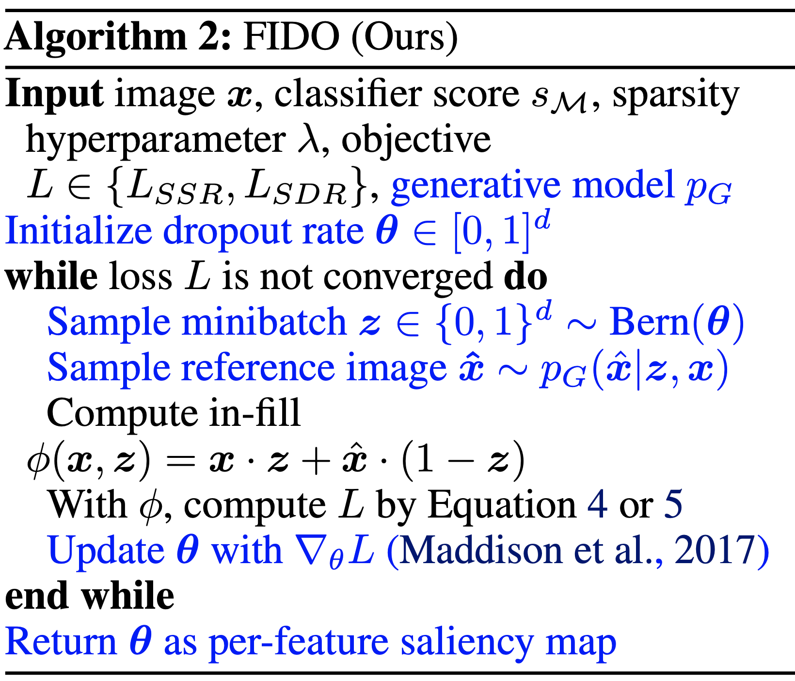

**some interesting papers on interpretable machine learning, largely organized based on this [interpretable ml review](https://arxiv.org/abs/1901.04592) (murdoch et al. 2019) and notes from this [interpretable ml book](https://christophm.github.io/interpretable-ml-book/) (molnar 2019)**

{:toc}

# reviews

## definitions

The definition of interpretability I find most useful is that given in [murdoch et al. 2019](https://arxiv.org/abs/1901.04592): basically that interpretability requires a pragmatic approach in order to be useful. As such, interpretability is only defined with respect to a specific audience + problem and an interpretation should be evaluated in terms of how well it benefits a specific context. It has been defined and studied more broadly in a variety of works:

- [Explore, Explain and Examine Predictive Models](https://pbiecek.github.io/ema/) (biecek & burzykowski, in progress) - another book on exploratory analysis with interpretability
- [Explanation Methods in Deep Learning: Users, Values, Concerns and Challenges](https://arxiv.org/abs/1803.07517) (ras et al. 2018)
- [Explainable Deep Learning: A Field Guide for the Uninitiated](https://arxiv.org/pdf/2004.14545.pdf)
- [Interpretable Deep Learning in Drug Discovery](https://arxiv.org/abs/1903.02788)
- [Explainable AI: A Brief Survey on History, Research Areas, Approaches and Challenges](https://link.springer.com/chapter/10.1007/978-3-030-32236-6_51)
- [Explainable Artificial Intelligence (XAI): Concepts, Taxonomies, Opportunities and Challenges toward Responsible AI](https://arxiv.org/abs/1910.10045)

## overviews

- [Towards a Generic Framework for Black-box Explanation Methods](https://hal.inria.fr/hal-02131174v2/document) (henin & metayer 2019)
  - sampling - selection of inputs to submit to the system to be explained
  - generation - analysis of links between selected inputs and corresponding outputs to generate explanations
    1. *proxy* - approximates model (ex. rule list, linear model)
    2. *explanation generation* - explains the proxy (ex. just give most important 2 features in rule list proxy, ex. LIME gives coefficients of linear model, Shap: sums of elements)
  - interaction (with the user)
  - this is a super useful way to think about explanations (especially local), but doesn't work for SHAP / CD which are more about how much a variable contributes rather than a local approximation

- [feature (variable) importance measurement review (VIM)](https://www.sciencedirect.com/science/article/pii/S0951832015001672) (wei et al. 2015)
  - often-termed sensitivity, contribution, or impact
  - some of these can be applied to data directly w/out model (e.g. correlation coefficient, rank correlation coefficient, moment-independent VIMs)
  - 
- [Pitfalls to Avoid when Interpreting Machine Learning Models](https://arxiv.org/pdf/2007.04131.pdf) (molnar et al. 2020)
- [Feature Removal Is a Unifying Principle for Model Explanation Methods](https://arxiv.org/abs/2011.03623#:~:text=Feature%20Removal%20Is%20a%20Unifying%20Principle%20for%20Model%20Explanation%20Methods,-Ian%20Covert%2C%20Scott&text=Exposing%20the%20fundamental%20similarities%20between,ongoing%20research%20in%20model%20explainability.) (covert, lundberg, & lee 2020)
- [Interpretable Machine Learning: Fundamental Principles and 10 Grand Challenges](https://arxiv.org/abs/2103.11251) (rudin et al. '21)

# evaluating interpretability

Evaluating interpretability can be very difficult (largely because it rarely makes sense to talk about interpretability outside of a specific context). The best possible evaluation of interpretability requires benchmarking it with respect to the relevant audience in a context. For example, if an interpretation claims to help understand radiology models, it should be tested based on how well it helps radiologists when actually making diagnoses. The papers here try to find more generic alternative ways to evaluate interp methods (or just define desiderata to do so).

- [Towards A Rigorous Science of Interpretable Machine Learning](https://arxiv.org/pdf/1702.08608.pdf) (doshi-velez & kim 2017)
  - 
- [Benchmarking Attribution Methods with Relative Feature Importance](https://arxiv.org/abs/1907.09701) (yang & kim 2019)
  - train a classifier, add random stuff (like dogs) to the image, classifier should assign them little importance
- [Visualizing the Impact of Feature Attribution Baselines](https://distill.pub/2020/attribution-baselines/)
  - **top-k-ablation**: should identify top pixels, ablate them, and want it to actually decrease
  - **center-of-mass ablation**: also could identify center of mass of saliency map and blur a box around it (to avoid destroying feature correlations in the model)
  - should we be **true-to-the-model** or **true-to-the-data**?
- [Evaluating Feature Importance Estimates](https://arxiv.org/abs/1806.10758) (hooker et al. 2019)
  - **remove-and-retrain test accuracy decrease**
- [Quantifying Interpretability of Arbitrary Machine Learning Models Through Functional Decomposition](https://arxiv.org/pdf/1904.03867.pdf) (molnar 2019)
- [An Evaluation of the Human-Interpretability of Explanation](https://arxiv.org/pdf/1902.00006.pdf) (lage et al. 2019)
  - [How do Humans Understand Explanations from Machine Learning Systems?: An Evaluation of the Human-Interpretability of Explanation](https://arxiv.org/pdf/1802.00682.pdf) (narayanan et al. 2018)
- [On the (In)fidelity and Sensitivity for Explanations](https://arxiv.org/abs/1901.09392)
- [Benchmarking Attribution Methods with Relative Feature Importance](https://arxiv.org/abs/1907.09701) (yang & kim 2019)
- [Do Explanations Reflect Decisions? A Machine-centric Strategy to Quantify the Performance of Explainability Algorithms](https://arxiv.org/abs/1910.07387)
- [On Validating, Repairing and Refining Heuristic ML Explanations](https://arxiv.org/abs/1907.02509)
- [How Much Can We See? A Note on Quantifying Explainability of Machine Learning Models](https://arxiv.org/abs/1910.13376)
- [Manipulating and Measuring Model Interpretability](https://arxiv.org/abs/1802.07810) (sangdeh et al. ... wallach 2019)
  - participants who were shown a clear model with a small number of features were better able to simulate the model’s predictions
  - no improvements in the degree to which participants followed the model’s predictions when it was beneficial to do so.
  - increased transparency hampered people’s ability to detect when the model makes a sizable mistake and correct for it, seemingly due to information overload
- [Towards a Framework for Validating Machine Learning Results in Medical Imaging](https://dl.acm.org/citation.cfm?id=3332193)
- [An Integrative 3C evaluation framework for Explainable Artificial Intelligence](https://aisel.aisnet.org/amcis2019/ai_semantic_for_intelligent_info_systems/ai_semantic_for_intelligent_info_systems/10/)
- [Evaluating Explanation Without Ground Truth in Interpretable Machine Learning](https://arxiv.org/pdf/1907.06831.pdf) (yang et al. 2019)
  - predictability (does the knowledge in the explanation generalize well)
  - fidelity (does explanation reflect the target system well)
  - persuasibility (does human satisfy or comprehend explanation well)

## basic failures

- [Sanity Checks for Saliency Maps](https://papers.nips.cc/paper/8160-sanity-checks-for-saliency-maps.pdf) (adebayo et al. 2018)
  - **Model Parameter Randomization Test** - attributions should be different for trained vs random model, but they aren't for many attribution methods
- [Rethinking the Role of Gradient-based Attribution Methods for Model Interpretability](https://openreview.net/forum?id=dYeAHXnpWJ4) (srinivas & fleuret, 2021)
  - logits can be arbitrarily shifted without affecting preds / gradient-based explanations
  - gradient-based explanations then, don't necessarily capture info about $p_\theta(y|x)$
- [Assessing the (Un)Trustworthiness of Saliency Maps for Localizing Abnormalities in Medical Imaging](https://www.medrxiv.org/content/10.1101/2020.07.28.20163899v1.full.pdf) (arun et al. 2020) - CXR images from SIIM-ACR Pneumothorax Segmentation + RSNA Pneumonia Detection
  - metrics: localizers (do they overlap with GT segs/bounding boxes), variation with model weight randomization, repeatable (i.e. same after retraining?), reproducibility (i.e. same after training different model?)
- [Interpretable Deep Learning under Fire](https://arxiv.org/abs/1812.00891) (zhang et al. 2019)

## adv. vulnerabilities

- [How can we fool LIME and SHAP? Adversarial Attacks on Post hoc Explanation Methods](https://arxiv.org/abs/1911.02508)
  - we can build classifiers which use important features (such as race) but explanations will not reflect that
  - basically classifier is different on X which is OOD (and used by LIME and SHAP)
- [Interpretation of Neural Networks is Fragile](https://arxiv.org/abs/1710.10547) (ghorbani et al. 2018)
  - minor perturbations to inputs can drastically change DNN interpretations
- [Fooling Neural Network Interpretations via Adversarial Model Manipulation](https://arxiv.org/abs/1902.02041) (heo, joo, & moon 2019) - can change model weights so that it keeps predictive accuracy but changes its interpretation
  - motivation: could falsely look like a model is "fair" because it places little saliency on sensitive attributes
    - output of model can still be checked regardless
  - fooled interpretation generalizes to entire validation set
  - can force the new saliency to be whatever we like
    - passive fooling - highlighting uninformative pixels of the image
    - active fooling - highlighting a completely different object, the firetruck
  - **model does not actually change that much** - predictions when manipulating pixels in order of saliency remains similar, very different from random (fig 4)

# intrinsic interpretability (i.e. how can we fit simpler models)

For an implementation of many of these models, see the python [imodels package](https://github.com/csinva/imodels).

## decision rules overview

For more on rules, see **[logic notes](https://csinva.io/notes/ai/logic.html)**.

- 2 basic concepts for a rule
  - converage = support
  - accuracy = confidence = consistency
    - measures for rules: precision, info gain, correlation, m-estimate, Laplace estimate
- these algorithms usually don't support regression, but you can get regression by cutting the outcome into intervals
- connections
  - every decision list is a (one-sided) decision tree
  - every decision tree can be expressed as an equivalent decision list (by listing each path to a leaf as a decision rule)
  - leaves of a decision tree (or a decision list) form a decision set
- recent work directly optimizes the performance metric (e.g., accuracy) with soft or hard sparsity constraints on the tree size, where sparsity is measured by the number of leaves in the tree using:
  1. mathematical programming, including mixed integer programming (MIP) / SAT solvers
  2. stochastic search through the space of trees
  3. customized dynamic programming algorithms that incorporate branch-and-bound techniques for reducing the size of the search space

### rule sets

*Rule sets commonly look like a series of independent if-then rules. Unlike trees / lists, these rules can be overlapping and might not cover the whole space. Final predictions can be made via majority vote, using most accurate rule, or averaging predictions. Sometimes also called rule ensembles.*

- popular ways to learn rule sets
  - [SLIPPER](http://citeseerx.ist.psu.edu/viewdoc/download?doi=10.1.1.33.1184&rep=rep1&type=pdf) (cohen, & singer, 1999) - repeatedly boosting a simple, greedy rule-builder
  - [Lightweight Rule Induction](http://citeseerx.ist.psu.edu/viewdoc/summary?doi=10.1.1.34.4619) (weiss & indurkhya, 2000) - specify number + size of rules and classify via majority vote
  - [Maximum Likelihood Rule Ensembles](https://dl.acm.org/doi/pdf/10.1145/1390156.1390185?casa_token=Lj3Ypp6bLzoAAAAA:t4p9YRPHEXJEL723ygEW5BJ9qft8EeU5934vPJFf1GrF1GWm1kctIePQGeaRiKHJa6ybpqtTqGg1Ig) (Dembczyński et al. 2008) - MLRules - rule is base estimator in ensemble - build by greedily maximizing log-likelihood
- [rulefit](https://projecteuclid.org/euclid.aoas/1223908046) (friedman & popescu, 2008) - extract rules from many decision trees, then fit sparse linear model on them
  - [A statistical approach to rule learning](https://dl.acm.org/doi/abs/10.1145/1143844.1143943?casa_token=74Cp4L015WQAAAAA:V8gYM4NMkiqRTmuGxtsnnTVZFaXl-eSzmLWFt78aVfoukuuZ-Y4-H-p3e-bF7EhA23uxKJ_oqLNq) (ruckert & kramer, 2006) - unsupervised objective to mine rules with large maring and low variance before fitting linear model
  - [Generalized Linear Rule Models](http://proceedings.mlr.press/v97/wei19a.html) (wei et al. 2019) - use column generation (CG) to intelligently search space of rules
    - re-fit GLM as rules are generated, reweighting + discarding
      - with large number of columns, can be intractable even to enumerate rules - CG avoids this by fitting a subset and using it to construct most promising next column
    - also propose a non-CG algorithm using only 1st-degree rules
    - note: from every pair of complementary singleton rules (e.g., $X_j \leq1$, $X_j > 1$), they remove one member as otherwise the pair together is collinear
- more recent global versions of learning rule sets
  - [interpretable decision set](https://dl.acm.org/citation.cfm?id=2939874) (lakkaraju et al. 2016) - set of if then rules
    - short, accurate, and non-overlapping rules that cover the whole feature space and pay attention to small but important classes
  - [A Bayesian Framework for Learning Rule Sets for Interpretable Classification](http://www.jmlr.org/papers/volume18/16-003/16-003.pdf) (wang et al. 2017) - rules are a bunch of clauses OR'd together (e.g. if (X1>0 AND X2<1) OR (X2<1 AND X3>1) OR ... then Y=1)
    - they call this method "Bayesian Rule Sets"
    - [Or's of And's for Interpretable Classification, with Application to Context-Aware Recommender Systems](https://arxiv.org/abs/1504.07614) (wang et al. 2015) - BOA - Bayesian Or's of And's
- when learning sequentially, often useful to prune at each step (Furnkranz, 1997)

### rule lists

- oneR algorithm - select feature that carries most information about the outcome and then split multiple times on that feature
- **sequential covering** - keep trying to cover more points sequentially
- pre-mining frequent patterns (want them to apply to a large amount of data and not have too many conditions)
  - FP-Growth algorithm (borgelt 2005) is fast
  - Aprior + Eclat do the same thing, but with different speeds
- [interpretable classifiers using rules and bayesian analysis](https://projecteuclid.org/download/pdfview_1/euclid.aoas/1446488742) (letham et al. 2015)
  - start by pre-mining frequent patterns rules
    - current approach does not allow for negation (e.g. not diabetes) and must split continuous variables into categorical somehow (e.g. quartiles)
    - mines things that frequently occur together, but doesn't look at outcomes in this step - okay (since this is all about finding rules with high support)
  - learn rules w/ prior for short rule conditions and short lists
    - start w/ random list 
    - sample new lists by adding/removing/moving a rule
    - at the end, return the list that had the highest probability
  - [scalable bayesian rule lists](https://dl.acm.org/citation.cfm?id=3306086) (yang et al. 2017) - faster algorithm for computing
    - doesn't return entire posterior
  - [learning certifiably optimal rules lists](https://dl.acm.org/citation.cfm?id=3098047) (angelino et al. 2017) - even faster optimization for categorical feature space
    - can get upper / lower bounds for loss = risk + $\lambda$ * listLength
    - doesn't return entire posterior
- [Expert-augmented machine learning](https://arxiv.org/abs/1903.09731) (gennatas et al. 2019)
  - make rule lists, then compare the outcomes for each rule with what clinicians think should be outcome for each rule
  - look at rules with biggest disagreement and engineer/improve rules or penalize unreliable rules

### trees

*Trees suffer from the fact that they have to cover the entire decision space and often we end up with replicated subtrees.*

- [Generalized and Scalable Optimal Sparse Decision Trees](https://arxiv.org/abs/2006.08690) (lin et al. 2020)
  - optimize for $\min L(X, y) + \lambda \cdot (numLeaves)$ 
  - can optimize many different losses (e.g. accuracy, AUC)
  - use dynamic programming, prune the search-space with bounds (e.g. if know best loss so far, know we shouldn't add too many more leaves since each adds $\lambda$ to the total loss), represent problem with bit-vectors for each leaf enabling fast computation
  - [optimal sparse decision trees](https://arxiv.org/abs/1904.12847) (hu et al. 2019) - previous paper, slower
- [optimal classification trees methodology paper](https://link.springer.com/content/pdf/10.1007%2Fs10994-017-5633-9.pdf) (bertsimas & dunn, 2017) - globally optimal decision tree with expensive optimization (solved with mixed-integer optimization) - realistically, usually too slow
  - $\begin{array}{cl}
    \min & \overbrace{R_{x y}(T)}^{\text{misclassification err}}+\alpha|T| \\
    \text { s.t. } & N_{x}(l) \geq N_{\min } \quad \forall l \in \text { leaves }(T)
    \end{array}$
    - $|T|$ is the number of branch nodes in tree $T$
    - $N_x(l)$ is the number of training points contained in leaf node $l$
  - [optimal classification trees vs PECARN](https://jamanetwork.com/journals/jamapediatrics/article-abstract/2733157) (bertsimas et al. 2019)
  - [supplemental tables](https://cdn-jamanetwork-com.libproxy.berkeley.edu/ama/content_public/journal/peds/0/poi190021supp1_prod.pdf?Expires=2147483647&Signature=EnVKjyPUrh7o2GVSU7Bxr4ZYL~5T27-sPKh14TANiL5mpXfj3YPTnUetEBPc~njVrg2VKY5TqqXCFxtR4xr6DfGLgobA~Kl92A1Jubmj9XgSL3U3so1~4O~YKob1WcS5uFI3HBpq9J-o-IkAsRq1qsnTFFzlvH7zlkwO9TW-dxnU9vtvU-QzhPNJ0cdAX-c7rrnZV0p0Fg~gzaEz5lvPP30Nort4kDTxd-FNDW5OYJFqusWF9e~3QK2S6Y4nRjv~IavQ10fQ24fSvEK5Nd1qetME8j2one0LA~KZjOk7avp76aV5os9msn-2hdPcEM7YWtLTUq12a9oVaD6pXKe3ZA__&Key-Pair-Id=APKAIE5G5CRDK6RD3PGA)
- [Building more accurate decision trees with the additive tree](https://www.pnas.org/content/116/40/19887) (luna et al. 2019)
  - present additive tree (AddTree), which builds a single decision tree, which is between a single CART tree and boosted decision stumps
  - cart can be seen as a boosting algorithm on stumps
    - can rewrite boosted stumps as a tree very easily
    - previous work: can grow tree based on Adaboost idea = AdaTree
  - 
- extremely randomized trees - randomness goes further, not only feature is selected randomly but also split has some randomness
- issues: replicated subtree problem (Pagallo & Haussler, 1990)
- [Bayesian Treed Models](http://www-stat.wharton.upenn.edu/~edgeorge/Research_papers/treed-models.pdf) (chipman et al. 2001) - impose priors on tree parameters
  - tree structure e.g. depth, splitting criteria
  - values in terminal nodes coditioned on tree structure
  - residual noise's standard deviation
- [BART: Bayesian additive regression trees](https://arxiv.org/abs/0806.3286) (chipman et al. 2008) - learns an ensemble of tree models using MCMC on a distr. imbued with a prior
- [On the price of explainability for some clustering problems](https://arxiv.org/abs/2101.01576) (laber et al. 2021) - trees for clustering

## linear (+algebraic) models

### supersparse models

- four main types of approaches to building scoring systems
  1. exact solutions using optimization techniques (often use MIP)
  2. approximation algorithms using linear programming (use L1 penalty instead of L0)
     1. can also try sampling
  3. more sophisticated rounding techniques - e.g. random, constrain sum, round each coef sequentially
  4. computeraided exploration techniques
- [Supersparse linear integer models for optimized medical scoring systems](https://link.springer.com/content/pdf/10.1007/s10994-015-5528-6.pdf) (ustun & rudin 2016)
  - [2helps2b paper](https://www.ncbi.nlm.nih.gov/pubmed/29052706)
  - 
  - note: scoring systems map points to a risk probability
- [An Interpretable Model with Globally Consistent Explanations for Credit Risk](https://arxiv.org/abs/1811.12615) (chen et al. 2018) - a 2-layer linear additive model

### gams (generalized additive models)

- gam takes form $g(\mu) = b + f_0(x_0) + f_1(x_1) + f_2(x_2) + ...$
  - usually assume some basis for the $f$, like splines or polynomials (and we select how many either manually or with some complexity penalty)
  - traditional way to fit - backfitting: each $f_i$ is fitted sequentially to the residuals of the previously fitted $f_0,...,f_{i-1}$ (hastie & tibshirani, 199)
  - boosting - fit all $f$ simultaneously, e.g. one tree for each $f_i$  on each iteration
  - can make this more interpretable by (1) making the $f$ functions smoother or (2) sparsity in the number of functions
  - could also add in interaction terms...
- [Demystifying Black-box Models with Symbolic Metamodels](https://papers.nips.cc/paper/9308-demystifying-black-box-models-with-symbolic-metamodels.pdf)
  - GAM parameterized with Meijer G-functions (rather than pre-specifying some forms, as is done with symbolic regression)
- [Neural Additive Models: Interpretable Machine Learning with Neural Nets](https://arxiv.org/abs/2004.13912) - GAM where we learn $f$ with a neural net
- [Accuracy, Interpretability, and Differential Privacy via Explainable Boosting](https://arxiv.org/abs/2106.09680) (nori, caruana et al. 2021)

### symbolic regression

- learn form of the equation using priors on what kinds of thinngs are more difficult
- [Logic Regression](https://amstat.tandfonline.com/doi/abs/10.1198/1061860032238?casa_token=WVNXGYsNPLsAAAAA:eCjYgsRw_WZ6g0GPG9x3CMyHyEV9kwcXvWCC1S0TTbLc7SDBiiyHiKLNtYsuC6WYOpto7xAi6tQ5eQ#.YJB3bGZKjzc) (ruczinski, kooperberg & leblanc, 2012) - given binary input variables, automatically construct interaction terms and linear model (fit using simulated annealing)
- [Building and Evaluating Interpretable Models using Symbolic Regression and Generalized Additive Models](https://openreview.net/pdf?id=BkgyvQzmW)
  - gams - assume model form is additive combination of some funcs, then solve via GD
  - however, if we don't know the form of the model we must generate it
- [Bridging the Gap: Providing Post-Hoc Symbolic Explanations for Sequential Decision-Making Problems with Black Box Simulators](https://arxiv.org/abs/2002.01080)
- [Model Learning with Personalized Interpretability Estimation (ML-PIE)](https://arxiv.org/abs/2104.06060) - use human feedback in the loop to decide which symbolic functions are most interpretable

## example-based = case-based (e.g. prototypes, nearest neighbor)

- ["this looks like that" prototypes II](https://arxiv.org/abs/1806.10574) (chen et al. 2018)
  - can have prototypes smaller than original input size
  - l2 distance
  - require the filters to be identical to the latent representation of some training image patch
  - cluster image patches of a particular class around the prototypes of the same class, while separating image patches of different classes
  - maxpool class prototypes so spatial size doesn't matter
  - also get heatmap of where prototype was activated (only max really matters)
  - train in 3 steps
    - train everything: classification + clustering around intraclass prototypes + separation between interclass prototypes (last layer fixed to 1s / -0.5s)
    - project prototypes to data patches
    - learn last layer
  - [original prototypes paper](https://arxiv.org/pdf/1710.04806.pdf) (li et al. 2017)
    - uses encoder/decoder setup
    - encourage every prototype to be similar to at least one encoded input
    - learned prototypes in fact look like digits
    - correct class prototypes go to correct classes
    - loss: classification + reconstruction + distance to a training point
- [ProtoPShare: Prototype Sharing for Interpretable Image Classification and Similarity Discovery](https://arxiv.org/abs/2011.14340) - share some prototypes between classes with data-dependent merge pruning

  - merge "similar" prototypes, where similarity is measured as dist of all training patches in repr. space
- [Towards Explainable Deep Neural Networks (xDNN)](https://arxiv.org/abs/1912.02523) (angelov & soares 2019) - more complex version of using prototypes
- [Case-Based Reasoning for Assisting Domain Experts in Processing Fraud Alerts of Black-Box Machine Learning Models](https://arxiv.org/abs/1907.03334)

## interpretable neural nets

- concepts
  - [Concept Bottleneck Models](https://arxiv.org/pdf/2007.04612.pdf) (koh et al. 2020) - predict concepts before making final prediction
  - [Concept Whitening for Interpretable Image Recognition](https://arxiv.org/pdf/2002.01650.pdf) (chen et al. 2020) - force network to separate "concepts" (like in TCAV) along different axes
  - [Interpretability Beyond Classification Output: Semantic Bottleneck Networks](https://arxiv.org/abs/1907.10882) - add an interpretable intermediate bottleneck representation
- [How to represent part-whole hierarchies in a neural network](https://arxiv.org/abs/2102.12627) (hinton, 2021)
  - The idea is simply to use islands of identical vectors to represent the nodes in the parse tree (parse tree would be things like wheel-> cabin -> car)
  - each patch / pixel gets representations at different levels (e.g. texture, parrt of wheel, part of cabin, etc.)
    - each repr. is a vector - vector for high-level stuff (e.g. car) will agree for different pixels but low level (e.g. wheel) will differ
    - during training, each layer at each location gets information from nearby levels
      - hinton assumes weights are shared between locations (maybe don't need to be)
      - also attention mechanism across other locations in same layer
    - each location also takes in its positional location (x, y)
    - could have the lowest-level repr start w/ a convnet
  - [iCaps: An Interpretable Classifier via Disentangled Capsule Networks](https://arxiv.org/abs/2008.08756) (jung et al. 2020)
    - the class capsule also includes classification-irrelevant information
      - uses a novel class-supervised disentanglement algorithm
    - entities represented by the class capsule overlap
      - adds additional regularizer
- localization
  - [WILDCAT: Weakly Supervised Learning of Deep ConvNets for Image Classification, Pointwise Localization and Segmentation](https://openaccess.thecvf.com/content_cvpr_2017/html/Durand_WILDCAT_Weakly_Supervised_CVPR_2017_paper.html) (durand et al. 2017) - constrains architecture
    - after extracting conv features, replace linear layers with special pooling layers, which helps with spatial localization
      - each class gets a pooling map
      - prediction for a class is based on top-k spatial regions for a class
      - finally, can combine the predictions for each class
  - [Approximating CNNs with Bag-of-local-Features models works surprisingly well on ImageNet](https://arxiv.org/abs/1904.00760)
    - CNN is restricted to look at very local features only and still does well (and produces an inbuilt saliency measure)
    - [learn shapes not texture](https://openreview.net/pdf?id=Bygh9j09KX)
    - [code](https://github.com/wielandbrendel/bag-of-local-features-models)
  - [Symbolic Semantic Segmentation and Interpretation of COVID-19 Lung Infections in Chest CT volumes based on Emergent Languages](https://arxiv.org/pdf/2008.09866v1.pdf) (chowdhury et al. 2020) - combine some segmentation with the classifier
- [Sparse Epistatic Regularization of Deep Neural Networks for Inferring Fitness Functions](https://www.biorxiv.org/content/10.1101/2020.11.24.396994v1) (aghazadeh et al. 2020) - directly regularize interactions / high-order freqs in DNNs
- [Physics-informed neural networks: A deep learning framework for solving forward and inverse problems involving nonlinear partial differential equations](https://www.sciencedirect.com/science/article/pii/S0021999118307125) (raissi et al. 2019) - PINN - solve PDEs by constraining neural net to predict specific parameters / derivatives
- [MonoNet: Towards Interpretable Models by Learning Monotonic Features](https://arxiv.org/abs/1909.13611) - enforce output to be a monotonic function of individuaul features
- [Improved Deep Fuzzy Clustering for Accurate and Interpretable Classifiers](https://ieeexplore.ieee.org/abstract/document/8858809) - extract features with a DNN then do fuzzy clustering on this
- [Towards Robust Interpretability with Self-Explaining Neural Networks](https://arxiv.org/pdf/1806.07538.pdf) (alvarez-melis & jaakkola 2018) - building architectures that explain their predictions
- [Harnessing Deep Neural Networks with Logic Rules](https://arxiv.org/pdf/1603.06318.pdf)

### connecting dnns with rule-based models

- [Distilling a Neural Network Into a Soft Decision Tree](https://arxiv.org/pdf/1711.09784.pdf) (frosst & hinton 2017) - distills DNN into DNN-like tree which uses sigmoid neuron decides which path to follow
  - training on distilled DNN predictions outperforms training on original labels
  - to make the decision closer to a hard cut, can multiply by a large scalar before applying sigmoid
  - parameters updated with backprop
  - regularization to ensure that all paths are taken equally likely
- [Neural Random Forests](https://link.springer.com/article/10.1007/s13171-018-0133-y) (biau et al. 2018) - convert DNN to RF
  - first layer learns a node for each split
  - second layer learns a node for each leaf (by only connecting to nodes on leaves in the path)
  - finally map each leaf to a value
  - relax + retrain
- [Deep Neural Decision Forests](https://openaccess.thecvf.com/content_iccv_2015/papers /Kontschieder_Deep_Neural_Decision_ICCV_2015_paper.pdf) (2015)
  - dnn learns small intermediate representation, which outputs all possible splits in a tree
  - these splits are forced into a tree-structure and optimized via SGD
  - neurons use sigmoid function
- [Gradient Boosted Decision Tree Neural Network](https://arxiv.org/abs/1910.09340) - build DNN based on decision tree ensemble - basically the same but with gradient-boosted trees
- [Neural Decision Trees](https://arxiv.org/abs/1702.07360) - treat each neural net like a node in a tree
- [Controlling Neural Networks with Rule Representations](https://arxiv.org/abs/2106.07804) (seo, ..., pfister, 21)
  - DEEPCTRL - encodes rules into DNN
    - one encoder for rules, one for data
      - both are concatenated with stochastic parameter $\alpha$ (which also weights the loss)
      - at test-time, can select $\alpha$ to vary contribution of rule part can be varied (e.g. if rule doesn't apply to a certain point)
    - training
      - normalize losses initially to ensure they are on the same scale
      - some rules can be made differentiable in a straightforward way: $r(x, \hat y) \leq \tau \to \max (r(x, \hat y ) - \tau, 0)$, but can't do this for everything e.g. decision tree rules
      - rule-based loss is defined by looking at predictions fo perturbations of the input
    - evaluation
      - `verification ratio` - fraction of samples that satisfy the rule
    - see also [Lagrangian Duality for Constrained Deep Learning](https://arxiv.org/abs/2001.09394) (fioretto et al. 2020)
- [RRL: A Scalable Classifier for Interpretable Rule-Based Representation Learning](https://openreview.net/forum?id=UwOMufsTqCy) (wang et al. 2020)
  - Rule-based Representation Learner (RRL) - automatically learns interpretable non-fuzzy rules for data representation
  - project RRL it to a continuous space and propose a novel training method, called Gradient Grafting, that can directly optimize the discrete model using gradient descent
- [Differentiable Pattern Set Mining](http://eda.mmci.uni-saarland.de/pubs/2021/binaps-fischer,vreeken.pdf) (fischer & vreeken, 2021)
  - use neural autoencoder with binary activations + binarizing weights
  - optimizing a data-sparsity aware reconstruction loss, continuous versions of the weights are learned in small, noisy steps

## misc models

- learning AND-OR Templates for Object Recognition and Detection (zhu_13)
- ross et al. - constraing model during training
- scat transform idea (mallat_16 rvw, oyallan_17)
- force interpretable description by piping through something interpretable (ex. tenenbaum scene de-rendering)
- learn concepts through probabilistic program induction
- force biphysically plausible learning rules
- [The Convolutional Tsetlin Machine](https://arxiv.org/pdf/1905.09688.pdf) - uses easy-to-interpret conjunctive clauses
  - [The Tsetlin Machine](https://arxiv.org/pdf/1804.01508.pdf)
- [Beyond Sparsity: Tree Regularization of Deep Models for Interpretability](https://arxiv.org/pdf/1711.06178.pdf)
  - regularize so that deep model can be closely modeled by tree w/ few nodes
- [Tensor networks](https://www.perimeterinstitute.ca/research/research-initiatives/tensor-networks-initiative) - like DNN that only takes boolean inputs and deals with interactions explicitly
  - widely used in physics

### bayesian models

- e.g. naive bayes
- [Making Bayesian Predictive Models Interpretable: A Decision Theoretic Approach](https://arxiv.org/abs/1910.09358)

# posthoc interpretability (i.e. how can we interpret a fitted model)

*Note that in this section we also include importances that work directly on the data (e.g. we do not first fit a model, rather we do nonparametric calculations of importance)*

### programs

- **program synthesis** - automatically find a program in an underlying programming language that satisfies some user intent
  - **ex. program induction** - given a dataset consisting of input/output pairs, generate a (simple?) program that produces the same pairs
- [probabilistic programming](https://en.wikipedia.org/wiki/Probabilistic_programming) - specify graphical models via a programming language

## model-agnostic

- local surrogate ([LIME](https://arxiv.org/abs/1602.04938)) - fit a simple model locally to on point and interpret that
   - select data perturbations and get new predictions
     - for tabular data, this is just varying the values around the prediction
     - for images, this is turning superpixels on/off
     - superpixels determined in unsupervised way
   - weight the new samples based on their proximity
   - train a kernel-weighted, interpretable model on these points
   - LEMNA - like lime but uses lasso + small changes
- [anchors](https://www.aaai.org/ocs/index.php/AAAI/AAAI18/paper/view/16982/15850) (ribeiro et al. 2018) - find biggest square region of input space that contains input and preserves same output (with high precision)
   1. does this search via iterative rules
- [What made you do this? Understanding black-box decisions with sufficient input subsets](https://arxiv.org/pdf/1810.03805.pdf)
   - want to find smallest subsets of features which can produce the prediction
     - other features are masked or imputed
- [VIN](http://citeseerx.ist.psu.edu/viewdoc/download?doi=10.1.1.91.7500&rep=rep1&type=pdf) (hooker 04) - variable interaction networks - globel explanation based on detecting additive structure in a black-box, based on ANOVA
- [local-gradient](http://www.jmlr.org/papers/v11/baehrens10a.html) (bahrens et al. 2010) - direction of highest slope towards a particular class / other class
- [golden eye](https://idp.springer.com/authorize/casa?redirect_uri=https://link.springer.com/article/10.1007/s10618-014-0368-8&casa_token=AhKnW6Xx4L0AAAAA:-SEMsMjDX3_rU5gyGx6plcmF5A_ufXvsWJHzjCUIGWHGW0fqOe50yhWKYOK6UIPDHQaUwEkE3RK17XOByzo) (henelius et al. 2014) - randomize different groups of features and search for groups which interact
- **[shapley value](http://papers.nips.cc/paper/7062-a-unified-approach-to-interpreting-model-predicti)** - average marginal contribution of a feature value across all possible sets of feature values
  - "how much does prediction change on average when this feature is added?"
  - tells us the difference between the actual prediction and the average prediction
  - estimating: all possible sets of feature values have to be evaluated with and without the j-th feature
    - this includes sets of different sizes
    - to evaluate, take expectation over all the other variables, fixing this variables value
  - shapley sampling value - sample instead of exactly computing
    - quantitative input influence is similar to this...
  - satisfies 3 properties
      - local accuracy - basically, explanation scores sum to original prediction
      - missingness - features with $x'_i=0$ have 0 impact
      - consistency - if a model changes so that some simplified input’s contribution increases or stays the same regardless of the other inputs, that input’s attribution should not decrease.
  - interpretation: Given the current set of feature values, the contribution of a feature value to the difference between the actual prediction and the mean prediction is the estimated Shapley value
  - recalculate via sampling other features in expectation
  - followup [propagating shapley values](https://arxiv.org/pdf/1911.11888.pdf) (chen, lundberg, & lee 2019) - can work with stacks of different models
- [probes](https://nlp.stanford.edu/~johnhew/interpreting-probes.html) - check if a representation (e.g. BERT embeddings) learned a certain property (e.g. POS tagging) by seeing if we can predict this property (maybe linearly) directly from the representation
    - problem: if the post-hoc probe is a complex model (e.g. MLP), it can accurately predict a property even if that property isn't really contained in the representation
    - potential solution: benchmark against control tasks, where we construct a new random task to predict given a representation, and see how well the post-hoc probe can do on that task
- [Explaining individual predictions when features are dependent: More accurate approximations to Shapley values](https://arxiv.org/abs/1903.10464) (aas et al. 2019) - tries to more accurately compute conditional expectation
- [Feature relevance quantification in explainable AI: A causal problem](https://arxiv.org/abs/1910.13413) (janzing et al. 2019) - argues we should just use unconditional expectation
- [quantitative input influence](https://ieeexplore.ieee.org/abstract/document/7546525) - similar to shap but more general
- permutation importance - increase in the prediction error after we permuted the feature's values
  - $\mathbb E[Y] - \mathbb E[Y\vert X_{\sim i}]$
  - If features are correlated, the permutation feature importance can be biased by unrealistic data
  instances (PDP problem)
  - not the same as model variance
  - Adding a correlated feature can decrease the importance of the associated feature
- [L2X: information-theoretical local approximation](https://arxiv.org/pdf/1802.07814.pdf) (chen et al. 2018) - locally assign feature importance based on mutual information with function
- [Learning Explainable Models Using Attribution Priors + Expected Gradients](https://arxiv.org/abs/1906.10670) - like doing integrated gradients in many directions (e.g. by using other points in the training batch as the baseline)
    - can use this prior to help improve performance
- [Variable Importance Clouds: A Way to Explore Variable Importance for the Set of Good Models](https://arxiv.org/pdf/1901.03209.pdf) 
- [All Models are Wrong, but Many are Useful: Learning a Variable's Importance by Studying an Entire Class of Prediction Models Simultaneously](https://arxiv.org/abs/1801.01489) (Aaron, Rudin, & Dominici 2018)
- [Interpreting Black Box Models via Hypothesis Testing](https://arxiv.org/abs/1904.00045)

### feature interactions

How interactions are defined and summarized is a very difficult thing to specify. For example, interactions can change based on monotonic transformations of features (e.g. $y= a \cdot b$, $\log y = \log a + \log b$). Nevertheless, when one has a specific question it can make sense to pursue finding and understanding interactions.

- build-up = context-free, less faithful: score is contribution of only variable of interest ignoring other variables
- break-down = occlusion = context-dependent, more faithful: score is contribution of variable of interest given all other variables (e.g. permutation test - randomize var of interest from right distr.)
- *H-statistic*: 0 for no interaction, 1 for complete interaction
  - how much of the variance of the output of the joint partial dependence is explained by the interaction instead of the individuals
  - $H^2_{jk} = \underbrace{\sum_i [\overbrace{PD(x_j^{(i)}, x_k^{(i)})}^{\text{interaction}} \overbrace{- PD(x_j^{(i)}) - PD(x_k^{(i)})}^{\text{individual}}]^2}_{\text{sum over data points}} \: / \: \underbrace{\sum_i [PD(x_j^{(i)}, x_k^{(i)})}_{\text{normalization}}]^2$
  - alternatively, using ANOVA decomp: $H_{jk}^2 = \sum_i g_{ij}^2 / \sum_i (\mathbb E [Y \vert X_i, X_j])^2$
  - same assumptions as PDP: features need to be independent
- alternatives
  - variable interaction networks (Hooker, 2004) - decompose pred into main effects + feature interactions
  - PDP-based feature interaction (greenwell et al. 2018)
- feature-screening (feng ruan's work)
  - want to find beta which is positive when a variable is important
  - idea: maximize difference between (distances for interclass) and (distances for intraclass)
  - using an L1 distance yields better gradients than an L2 distance
- ANOVA - factorial method to detect feature interactions based on differences among group means in a dataset
- Automatic Interaction Detection (AID) - detects interactions by subdividing data into disjoint exhaustive subsets to model an outcome based on categorical features
- Shapley Taylor Interaction Index (STI) (Dhamdhere et al., 2019) - extends shap to all interactions
- retraining
  - Additive groves (Sorokina et al. 2008) proposed use random forest with and without an interaction (forcibly removed) to detect feature interactions - very slow
- gradient-based methods (originally Friedman and Popescu, 2008 then later used with many models such as logit)
  - test if partial derivatives for some subset (e.g. $x_1, ..., x_p$) are nonzero $\mathbb{E}_{\mathbf{x}}\left[\frac{\partial^p f(\mathbf{x})}{\partial x_{i_{1}} \partial x_{i_{2}} \ldots \partial x_{i_p}}\right]^{2}>0$ 
  - doesn't work well for piecewise functions (e.g. Relu) and computationally expensive
- include interactions explicitly then run lasso (e.g. bien et al. 2013)
- methods for finding frequent item sets
  - [random intersection trees](https://arxiv.org/pdf/1303.6223.pdf)
  - [fp-growth](https://www.softwaretestinghelp.com/fp-growth-algorithm-data-mining/)
  - eclat

### vim (variable importance measure) framework

- VIM
  1. a quantitative indicator that quantifies the change of model output value w.r.t. the change or permutation of one or a set of input variables
  2. an indicator that quantifies the contribution of the uncertainties of one or a set of input variables to the uncertainty of model output variable
  3. an indicator that quantifies the strength of dependence between the model output variable and one or a set of input variables. 
- difference-based - deriv=based methods, local importance measure, morris' screening method
    - **LIM** (local importance measure) - like LIME
      - can normalize weights by values of x, y, or ratios of their standard deviations
      - can also decompose variance to get the covariances between different variables
      - can approximate derivative via adjoint method or smth else
    - **morris' screening method**
      - take a grid of local derivs and look at the mean / std of these derivs
      - can't distinguish between nonlinearity / interaction
    - using the squared derivative allows for a close connection w/ sobol's total effect index
      - can extend this to taking derivs wrt different combinations of variables
- parametric regression
  - correlation coefficient, linear reg coeffeicients
  - **partial correlation coefficient** (PCC) - wipe out correlations due to other variables
    - do a linear regression using the other variables (on both X and Y) and then look only at the residuals
  - rank regression coefficient - better at capturing nonlinearity
  - could also do polynomial regression
  - more techniques (e.g. relative importance analysis RIA)
    - nonparametric regression
      - use something like LOESS, GAM, projection pursuit
      - rank variables by doing greedy search (add one var at a time) and seeing which explains the most variance
- hypothesis test
  - **grid-based hypothesis tests**: splitting the sample space (X, Y) into grids and then testing whether the patterns of sample distributions across different grid cells are random
    - ex. see if means vary
    - ex. look at entropy reduction
  - other hypothesis tests include the squared rank difference, 2D kolmogorov-smirnov test, and distance-based tests
- variance-based vim (sobol's indices)
  - **ANOVA decomposition** - decompose model into conditional expectations $Y = g_0 + \sum_i g_i (X_i) + \sum_i \sum_{j > i} g_{ij} (X_i, X_j) + \dots + g_{1,2,..., p}$
    - $g_0 = \mathbf E (Y)\\ g_i = \mathbf E(Y \vert X_i) - g_0 \\ g_{ij} = \mathbf E (Y \vert X_i, X_j) - g_i - g_j - g_0\\...$
    - take variances of these terms
    - if there are correlations between variables some of these terms can misbehave
    - note: $V(Y) = \sum_i V (g_i) + \sum_i \sum_{j > i} V(g_{ij}) + ... V(g_{1,2,...,p})$ - variances are orthogonal and all sum to total variance
    - [anova decomposition basics](https://statweb.stanford.edu/~owen/mc/A-anova.pdf) - factor function into means, first-order terms, and interaction terms
  - $S_i$: **Sobol’s main effect** index: $=V(g_i)=V(E(Y \vert X_i))=V(Y)-E(V(Y \vert X_i))$
    - small value indicates $X_i$ is non-influential
    - usually used to select important variables
  - $S_{Ti}$: **Sobol's total effect** index - include all terms (even interactions) involving a variable
  - equivalently, $V(Y) - V(E[Y \vert X_{\sim i}])$
    - usually used to screen unimportant variables
      - it is common to normalize these indices by the total variance $V(Y)$
    - three methods for computation - Fourire amplitude sensitivity test, meta-model, MCMC
    - when features are correlated, these can be strange (often inflating the main effects)
      - can consider $X_i^{\text{Correlated}} = E(X_i \vert X_{\sim i})$ and $X_i^{\text{Uncorrelated}} = X_i - X_i^{\text{Correlated}}$
  - this can help us understand the contributions that come from different features, as well as the correlations between features (e.g. $S_i^{\text{Uncorrelated}} = V(E[Y \vert X_i^{\text{Uncorrelated}}])/V(Y)$
    - [sobol indices connected to shapley value](https://epubs.siam.org/doi/pdf/10.1137/130936233)
      - $SHAP_i = \underset{S, i \in S}{\sum} V(g_S) / \vert S \vert$
  - efficiently compute SHAP values directly from data ([williamson & feng, 2020 icml](http://proceedings.mlr.press/v119/williamson20a/williamson20a.pdf))
- moment-independent vim
  - want more than just the variance ot the output variables
  - e.g. **delta index** = average dist. between $f_Y(y)$ and $f_{Y \vert X_i}(y)$ when $X_i$ is fixed over its full distr.
    - $\delta_i = \frac 1 2 \mathbb E \int \vert f_Y(y) - f_{Y\vert X_i} (y) \vert dy = \frac 1 2 \int \int \vert f_{Y, X_i}(y, x_i) - f_Y(y) f_{X_i}(x_i) \vert dy \,dx_i$
    - moment-independent because it depends on the density, not just any moment (like measure of dependence between $y$ and $X_i$
  - can also look at KL, max dist..
- graphic vim - like curves
  - e.g. scatter plot, meta-model plot, regional VIMs, parametric VIMs
  - CSM - relative change of model ouput mean when range of $X_i$ is reduced to any subregion
  - CSV - same thing for variance

### importance curves

- **pdp plots** - marginals (force value of plotted var to be what you want it to be)
   - separate into **ice plots**  - marginals for instance
     - average of ice plots = pdp plot
     - sometimes these are centered, sometimes look at derivative
   - both pdp ice suffer from many points possibly not being real
   - [totalvis: A Principal Components Approach to Visualizing Total Effects in Black Box Models](https://link.springer.com/article/10.1007/s42979-021-00560-5) - visualize pdp plots along PC directions
- possible solution: **Marginal plots M-plots** (bad name - uses conditional, not marginal)
  - only use points conditioned on certain variable
  - problem: this bakes things in (e.g. if two features are correlated and only one important, will say both are important)
- **ALE-plots** - take points conditioned on value of interest, then look at differences in predictions around a window
  - this gives pure effect of that var and not the others
  - needs an order (i.e. might not work for caterogical)
  - doesn't give you individual curves
  - recommended very highly by the book...
  - they integrate as you go...
- summary: To summarize how each type of plot (PDP, M, ALE) calculates the effect of a feature at a certain grid value v:
   - Partial Dependence Plots: “Let me show you what the model predicts on average when each data instance has the value v for that feature. I ignore whether the value v makes sense for all data instances.” 
- M-Plots: “Let me show you what the model predicts on average for data instances that have values close to v for that feature. The effect could be due to that feature, but also due to correlated features.” 
  - ALE plots: “Let me show you how the model predictions change in a small “window” of the feature around v for data instances in that window.” 

## example-based explanations

- influential instances - want to find important data points
- deletion diagnostics - delete a point and see how much it changed
- [influence funcs](https://arxiv.org/abs/1703.04730) (koh & liang, 2017): use **Hessian** ($\theta x \theta$) to give effect of upweighting a point
  - influence functions = inifinitesimal approach - upweight one person by infinitesimally small weight and see how much estimate changes (e.g. calculate first derivative)
  - influential instance - when data point removed, has a strong effect on the model (not necessarily same as an outlier)
  - requires access to gradient (e.g. nn, logistic regression)
  - take single step with Newton's method after upweighting loss
  - yield change in parameters by removing one point
  - yield change in loss at one point by removing a different point (by multiplying above by cahin rule)
  - yield change in parameters by modifying one point

## tree ensembles

- **mean decrease impurity** = MDI = Gini importance
- Breiman proposes **permutation tests** = MDA: Breiman, Leo. 2001. “Random Forests.” Machine Learning 45 (1). Springer: 5–32
  - [conditional variable importance for random forests](https://bmcbioinformatics.biomedcentral.com/articles/10.1186/1471-2105-9-307) (strobl et al. 2008)
    - propose permuting conditioned on the values of variables not being permuted
      - to find region in which to permute, define the grid within which the values of $X_j$ are permuted for each tree by means of the partition of the feature space induced by that tree
    - many scores (such as MDI, MDA) measure marginal importance, not conditional importance
      - as a result, correlated variables get importances which are too high
- [Extracting Optimal Explanations for Ensemble Trees via Logical Reasoning](https://arxiv.org/abs/2103.02191) (zhang et al. '21) - OptExplain - extracts global explanation of tree ensembles using logical reasoning, sampling, + optimization
- [treeshap](https://arxiv.org/abs/1802.03888) (lundberg, erion & lee, 2019): prediction-level
  - individual feature attribution: want to decompose prediction into sum of attributions for each feature
    - each thing can depend on all features
  - Saabas method: basic thing for tree
    - you get a pred at end
    - count up change in value at each split for each variable
  - three properties
    - local acc - decomposition is exact
    - missingness - features that are already missing are attributed no importance
      - for missing feature, just (weighted) average nodes from each split
    - consistency - if F(X) relies more on a certain feature j, $F_j(x)$ should 
      - however Sabaas method doesn't change $F_j(X)$ for $F'(x) = F(x) + x_j$
  - these 3 things iply we want shap values
  - average increase in func value when selecting i (given all subsets of other features)
  - for binary features with totally random splits, same as Saabas
  - **can cluster based on explanation similarity** (fig 4)
    - can quantitatively evaluate based on clustering of explanations
  - their fig 8 - qualitatively can see how different features alter outpu
  - gini importance is like weighting all of the orderings
- [Explainable AI for Trees: From Local Explanations to Global Understanding](https://arxiv.org/abs/1905.04610) (lundberg et al. 2019)
  - shap-interaction scores - distribute among pairwise interactions + local effects
  - plot lots of local interactions together - helps detect trends
  - propose doing shap directly on loss function (identify how features contribute to loss instead of prediction)
  - can run supervised clustering (where SHAP score is the label) to get meaningful clusters
    - alternatively, could do smth like CCA on the model output
- [understanding variable importances in forests of randomized trees](http://papers.nips.cc/paper/4928-understanding-variable-importances-in-forests-of-randomized-tre) (louppe et al. 2013)
  - consider fully randomized trees
    - assume all categorical
    - randomly pick feature at each depth, split on all possibilities
    - also studied by biau 2012
    - extreme case of random forest w/ binary vars?
  - real trees are harder: correlated vars and stuff mask results of other vars lower down
  - asymptotically, randomized trees might actually be better
- [Actionable Interpretability through Optimizable Counterfactual Explanations for Tree Ensembles](https://arxiv.org/pdf/1911.12199v1.pdf) (lucic et al. 2019)
- [iterative random forest](https://www.pnas.org/content/115/8/1943) (basu et al. 2018)
  - fit RF and get MDI importances
  - iteratively refit RF, weighting probability of feature being selected by its previous MDI
  - find interactions as features which co-occur on paths (using RIT algorithm)

## neural nets (dnns)

### dnn visualization

- [good summary on distill](https://distill.pub/2017/feature-visualization/)
- **visualize intermediate features**
    1. visualize filters by layer
      - doesn't really work past layer 1
    2. *decoded filter* - rafegas & vanrell 2016
      - project filter weights into the image space
      - pooling layers make this harder
    3. *deep visualization* - yosinski 15
    4. [Understanding Deep Image Representations by Inverting Them](https://arxiv.org/abs/1412.0035) (mahendran & vedaldi 2014) - generate image given representation
    5. [pruning for identifying critical data routing paths](https://openaccess.thecvf.com/content_cvpr_2018/html/Wang_Interpret_Neural_Networks_CVPR_2018_paper.html) - prune net (while preserving prediction) to identify neurons which result in critical paths
- penalizing activations
    - [interpretable cnns](http://openaccess.thecvf.com/content_cvpr_2018/CameraReady/0490.pdf) (zhang et al. 2018) - penalize activations to make filters slightly more intepretable
      - could also just use specific filters for specific classes...
    - teaching compositionality to cnns - mask features by objects
- approaches based on maximal activation
	-	images that maximally activate a feature 
		- [deconv nets](https://arxiv.org/pdf/1311.2901.pdf) - Zeiler & Fergus (2014) use deconvnets (zeiler et al. 2011) to map features back to pixel space
			- given one image, get the activations (e.g. maxpool indices) and use these to get back to pixel space
			- everything else does not depend on the original image
			- might want to use optimization to generate image that makes optimal feature instead of picking from training set
     	 - before this, erhan et al. did this for unsupervised features
     	 - dosovitskiy et al 16 - train generative deconv net to create images from neuron activations
     	 - aubry & russel 15 do similar thing
		- [deep dream](https://research.googleblog.com/2015/06/inceptionism-going-deeper-into-neural.html) - reconstruct image from feature map
         - could use natural image prior
         - could train deconvolutional NN
         - also called *deep neuronal tuning* - GD to find image that optimally excites filters
    - *neuron feature* - weighted average version of a set of maximum activation images that capture essential properties - rafegas_17
      - can also define *color selectivity index* - angle between first PC of color distribution of NF and intensity axis of opponent color space
      - *class selectivity index* - derived from classes of images that make NF
    - saliency maps for each image / class
      - simonyan et al 2014
    - [Diagnostic Visualization for Deep Neural Networks Using Stochastic Gradient Langevin Dynamics](https://arxiv.org/pdf/1812.04604.pdf) - sample deep dream images generated by gan
- [posthoc prototypes](https://openreview.net/forum?id=r1xyx3R9tQ)
    - **counterfactual explanations** - like adversarial, counterfactual explanation describes smallest change to feature vals that changes the prediction to a predefined output
      - maybe change fewest number of variables not their values
      - counterfactual should be reasonable (have likely feature values)
      - human-friendly
      - usually multiple possible counterfactuals (Rashomon effect)
      - can use optimization to generate counterfactual
      - **anchors** - opposite of counterfactuals, once we have these other things won't change the prediction
    - prototypes (assumed to be data instances)
      - prototype = data instance that is representative of lots of points
      - criticism = data instances that is not well represented by the set of prototypes
      - examples: k-medoids or MMD-critic
        - selects prototypes that minimize the discrepancy between the data + prototype distributions
- [Architecture Disentanglement for Deep Neural Networks](https://arxiv.org/abs/2003.13268) (hu et al. 2021) - "NAD learns to disentangle a pre-trained DNN into sub-architectures according to independent tasks"
- [Explaining Deep Learning Models with Constrained Adversarial Examples](https://arxiv.org/abs/1906.10671)
- [Understanding Deep Architectures by Visual Summaries](http://bmvc2018.org/papers/0794.pdf)
- [Semantics for Global and Local Interpretation of Deep Neural Networks](https://arxiv.org/abs/1910.09085)
- [Iterative augmentation of visual evidence for weakly-supervised lesion localization in deep interpretability frameworks](https://arxiv.org/abs/1910.07373)
- [explaining image classifiers by counterfactual generation](https://arxiv.org/pdf/1807.08024.pdf) 
    - generate changes (e.g. with GAN in-filling) and see if pred actually changes
    - can search for smallest sufficient region and smallest destructive region
    - 

### dnn concept-based explanations

- [concept activation vectors](https://arxiv.org/abs/1711.11279)
    - Given: a user-defined set of examples for a concept (e.g., ‘striped’), and random
            examples, labeled training-data examples for the studied class (zebras) 
        - given trained network
        - TCAV can quantify the model’s sensitivity to the concept for that class. CAVs are learned by training a linear classifier to distinguish between the activations produced by
            a concept’s examples and examples in any layer
        - CAV - vector orthogonal to the classification boundary
        - TCAV uses the derivative of the CAV direction wrt input
    - [automated concept activation vectors](https://arxiv.org/abs/1902.03129) - Given a set of concept discovery images, each image is segmented with different resolutions to find concepts that are captured best at different sizes. (b) After removing duplicate segments, each segment is resized tothe original input size resulting in a pool of resized segments of the discovery images. (c) Resized segments are mapped to a model’s activation space at a bottleneck layer. To discover the concepts associated with the target class, clustering with outlier removal is performed. (d) The output of our method is a set of discovered concepts for each class, sorted by their importance in prediction
- [On Completeness-aware Concept-Based Explanations in Deep Neural Networks](https://arxiv.org/abs/1910.07969)
- [Interpretable Basis Decomposition for Visual Explanation](https://openaccess.thecvf.com/content_ECCV_2018/html/Antonio_Torralba_Interpretable_Basis_Decomposition_ECCV_2018_paper.html) (zhou et al. 2018) - decompose activations of the input image into semantically interpretable components pre-trained from a large concept corpus

### dnn causal-motivated attribution

- [Explaining The Behavior Of Black-Box Prediction Algorithms With Causal Learning](https://arxiv.org/abs/2006.02482) - specify some interpretable features and learn a causal graph of how the classifier uses these features (sani et al. 2021)
  - **partial ancestral graph (PAG)** ([zhang 08](https://www.jmlr.org/papers/volume9/zhang08a/zhang08a.pdf)) is a graphical representation which includes
    - directed edges (X $\to$ Y means X is a causal ancestor of Y)
    - bidirected edges (X $\leftrightarrow$ Y means X and Y are both caused by some unmeasured common factor(s), e.g., X ← U → Y )
    - partially directed edges (X $\circ \to$ Y or X $\circ-\circ$ Y ) where the circle marks indicate ambiguity about whether the endpoints are arrows or tails
    - PAGs may also include additional edge types to represent selection bias
  - given a model's predictions $\hat Y$ and some potential causes $Z$, learn a PAGE among them all
    - assume $\hat Y$ is a causal non-ancestor of $Z$ (there is no directed path from $\hat Y$ into any element of $Z$)
    - search for a PAG and not DAG bc $Z$ might not include all possibly relevant variables
- [Neural Network Attributions: A Causal Perspective](http://proceedings.mlr.press/v97/chattopadhyay19a.html) (Chattopadhyay et al. 2019)
  - the neural network architecture is viewed as a Structural Causal Model, and a methodology to compute the causal effect of each feature on the output is presented
- [CXPlain: Causal Explanations for Model Interpretation under Uncertainty](https://arxiv.org/abs/1910.12336) (schwab & karlen, 2019)
  - model-agnostic - efficiently query model to figure out which inputs are most important
  - pixel-level attributions
- [Amnesic Probing: Behavioral Explanation with Amnesic Counterfactuals](https://arxiv.org/abs/2006.00995) (elezar...goldberg, 2020)
  - instead of simple probing, generate counterfactuals in representations and see how final prediction changes
    - remove a property (e.g. part of speech) from the repr. at a layer using Iterative Nullspace Projection (INLP) ([Ravfogel et al., 2020](https://arxiv.org/abs/2004.07667))
      - iteratively tries to predict the property linearly, then removes these directions
- [Bayesian Interpolants as Explanations for Neural Inferences](https://arxiv.org/abs/2004.04198) (mcmillan 20)
  - if $A \implies B$, *interpolant* $I$ satisfies $A\implies I$, $I \implies B$ and $I$ expressed only using variables common to $A$ and $B$
    - here, $A$ is model input, $B$ is prediction, $I$ is activation of some hidden layer
  - *Bayesian interpolant* show $P(A|B) \geq \alpha^2$ when $P(I|A) \geq \alpha$ and $P(B|I) \geq \alpha$

### dnn feature importance

- saliency maps
    1. occluding parts of the image
      - sweep over image and remove patches
      - which patch removals had highest impact on change in class?
    2. text usually uses attention maps
      - ex. karpathy et al LSTMs
      - ex. lei et al. - most relevant sentences in sentiment prediction
      - [attention is not explanation](https://arxiv.org/abs/1902.10186) (jain & wallace, 2019)
      - [attention is not **not** explanation](https://arxiv.org/abs/1908.04626) (wiegreffe & pinter, 2019)
        - influence = pred with a word - pred with a word masked
          - attention corresponds to this kind of influence
      - deceptive attention - we can successfully train a model to make similar predictions but have different attention
    3. class-activation map (CAM) ([zhou et al. 2016](https://openaccess.thecvf.com/content_cvpr_2016/html/Zhou_Learning_Deep_Features_CVPR_2016_paper.html))
       1. sum the activations across channels (weighted by their weight for a particular class)
       2. weirdness: drop negative activations (can be okay if using relu), normalize to 0-1 range
          1. CALM ([kim et al. 2021](https://arxiv.org/pdf/2106.07861.pdf)) - fix issues with normalization before by introducing a latent variable on the activations
    4. [RISE](https://arxiv.org/pdf/1806.07421.pdf) (Petsiuk et al. 2018) - randomized input sampling
       1. randomly mask the images, get prediction
       2. saliency map = sum of masks weighted by the produced predictions
- gradient-based methods - visualize what in image would change class label
  - gradient * input
  - [integrated gradients](http://proceedings.mlr.press/v70/sundararajan17a/sundararajan17a.pdf) (sundararajan et al. 2017) - just sum up the gradients from some baseline to the image times the differ  (in 1d, this is just $\int_{x'=baseline}^{x'=x} (x-x') \cdot (f(x) - f(x'))$
    - in higher dimensions, such as images, we pick the path to integrate by starting at some baseline (e.g. all zero) and then get gradients as we interpolate between the zero image and the real image
    - if we picture 2 features, we can see that integrating the gradients will not just yield $f(x) - f(baseline)$, because each time we evaluate the gradient we change both features
    - [explanation distill article](https://distill.pub/2020/attribution-baselines/) 
      - ex. any pixels which are same in original image and modified image will be given 0 importance
      - lots of different possible choices for baseline (e.g. random Gaussian image, blurred image, random image from the training set)
      - multiplying by $x-x'$ is strange, instead can multiply by distr. weight for $x'$
        - 
        - could also average over distributions of baseline (this yields **expected gradients**)
      - when we do a Gaussian distr., this is very similar to smoothgrad
  - lrp
  - taylor decomposition
  - deeplift
  - smoothgrad - average gradients around local perturbations of a point
  - guided backpropagation - springenberg et al
  - lets you better create maximally specific image
  - selvaraju 17 - *grad-CAM*
  - [grad-cam++](https://arxiv.org/abs/1710.11063)
  - [competitive gradients](https://arxiv.org/pdf/1905.12152.pdf) (gupta & arora 2019)
  - Label  "wins" a pixel if either (a) its map assigns that pixel a positive score higher than the scores assigned by every other label ora negative score lower than the scores assigned by every other label. 
  - final saliency map consists of scores assigned by the chosen label to each pixel it won, with the map containing a score 0 for any pixel it did not win.
  - can be applied to any method which satisfies completeness (sum of pixel scores is exactly the logit value)
  - [Saliency Methods for Explaining Adversarial Attacks](https://arxiv.org/abs/1908.08413)
- critiques
    - [Do Input Gradients Highlight Discriminative Features?](https://arxiv.org/abs/2102.12781) (shah et a. 2021) - input gradients often don't highlight relevant features (they work better for adv. robust models)
        - prove/demonstrate this in synthetic dataset where $x=ye_i$ for standard basis vector $e_i$, $y=\{\pm 1\}$
- newer methods
    - [Score-CAM:Improved Visual Explanations Via Score-Weighted Class Activation Mapping](https://arxiv.org/abs/1910.01279)
    - [Removing input features via a generative model to explain their attributions to classifier's decisions](https://arxiv.org/abs/1910.04256)
    - [NeuroMask: Explaining Predictions of Deep Neural Networks through Mask Learning](https://ieeexplore.ieee.org/abstract/document/8784063)
    - [Interpreting Undesirable Pixels for Image Classification on Black-Box Models](https://arxiv.org/abs/1909.12446)
    - [Guideline-Based Additive Explanation for Computer-Aided Diagnosis of Lung Nodules](https://link.springer.com/chapter/10.1007/978-3-030-33850-3_5)
    - [Learning how to explain neural networks: PatternNet and PatternAttribution](https://arxiv.org/abs/1705.05598) - still gradient-based
        - [Generalized PatternAttribution for Neural Networks with Sigmoid Activations](https://ieeexplore.ieee.org/abstract/document/8851761)
    - [Learning Reliable Visual Saliency for Model Explanations](https://ieeexplore.ieee.org/abstract/document/8884184)
    - [Neural Network Attributions: A Causal Perspective](https://arxiv.org/abs/1902.02302)
    - [Gradient Weighted Superpixels for Interpretability in CNNs](https://arxiv.org/abs/1908.08997)
    - [Decision Explanation and Feature Importance for Invertible Networks](https://arxiv.org/abs/1910.00406) (mundhenk et al. 2019)
    - [Efficient Saliency Maps for Explainable AI](https://deepai.org/publication/efficient-saliency-maps-for-explainable-ai) 

### dnn feature interactions

- [hierarchical interpretations for neural network predictions](https://arxiv.org/abs/1806.05337) (singh et al. 2019)
  - [contextual decomposition](https://arxiv.org/abs/1801.05453) (murdoch et al. 2018)
  - ACD followup work
    - [Towards Hierarchical Importance Attribution: Explaining Compositional Semantics for Neural Sequence Models](https://openreview.net/forum?id=BkxRRkSKwr)
  - [Compositional Explanations for Image Classifiers](https://arxiv.org/abs/2103.03622) (chockler et al. 21) - use perturbation-based interpretations to greedily search for pixels which increase prediction the most (simpler version of ACD)
- [Detecting Statistical Interactions from Neural Network Weights](https://arxiv.org/abs/1705.04977) - interacting inputs must follow strongly weighted connections to a common hidden unit before the final output
  - [Neural interaction transparency (NIT)](https://dl.acm.org/citation.cfm?id=3327482) (tsang et al. 2017)
- [Explaining Explanations: Axiomatic Feature Interactions for Deep Networks](https://arxiv.org/abs/2002.04138) (janizek et al. 2020) - integrated hessians
    - not clear the distinction between main and interaction effects
- [Interpretable Artificial Intelligence through the Lens of Feature Interaction](https://arxiv.org/abs/2103.03103) (tsang et al. 2021)
    - feature interaction- any non-additive effect between multiple features on an outcome (i.e. cannot be decomposed into a sum of subfunctions of individual variables)
- [Learning Global Pairwise Interactions with Bayesian Neural Networks](https://arxiv.org/abs/1901.08361) (cui et al. 2020) - Bayesian Group Expected Hessian (GEH) - train bayesian neural net and analyze hessian to understand interactions
- [Sparse Epistatic Regularization of Deep Neural Networks for Inferring Fitness Functions](https://www.biorxiv.org/content/10.1101/2020.11.24.396994v1) (aghazadeh et al. 2020) - penalize DNNs spectral representation to limit learning noisy high-order interactions

### dnn textual explanations

- [Adversarial Inference for Multi-Sentence Video Description](https://arxiv.org/pdf/1812.05634.pdf) - adversarial techniques during inference for a better multi-sentence video description
- [Object Hallucination in Image Captioning](https://aclweb.org/anthology/D18-1437) - image relevance metric - asses rate of object hallucination
   - CHAIR metric - what proportion of words generated are actually in the image according to gt sentences and object segmentations
- [women also snowboard](https://arxiv.org/pdf/1803.09797.pdf) - force caption models to look at people when making gender-specific predictions
- [Fooling Vision and Language Models Despite Localization and Attention Mechanism](http://openaccess.thecvf.com/content_cvpr_2018/papers/Xu_Fooling_Vision_and_CVPR_2018_paper.pdf) -  can do adversarial attacks on captioning and VQA
- [Grounding of Textual Phrases in Images by Reconstruction](https://arxiv.org/pdf/1511.03745.pdf) - given text and image provide a bounding box (supervised problem w/ attention)
- [Natural Language Explanations of Classifier Behavior](https://ieeexplore.ieee.org/abstract/document/8791710)

## model summarization / distillation

- [piecewise linear interp](https://arxiv.org/pdf/1806.10270.pdf)
- [Computing Linear Restrictions of Neural Networks](https://arxiv.org/abs/1908.06214) - calculate function of neural network restricting its points to lie on a line
- [Interpreting CNN Knowledge via an Explanatory Graph](https://arxiv.org/abs/1708.01785) (zhang et al. 2017) - create a graph that responds better to things like objects than individual neurons
- model distillation (model-agnostic)
  - Trepan - approximate model w/ a decision tree
  - [BETA](https://arxiv.org/abs/1707.01154) (lakkaraju et al. 2017) - approximate model by a rule list
- exact distillation
  - [Born-again tree ensembles](https://arxiv.org/pdf/2003.11132.pdf) (vidal et al. 2020) - efficient algorithm to exactly find a minimal tree which reproduces the predictions of a tree ensemble

# different problems / perspectives

## improving models

- [Interpretations are useful: penalizing explanations to align neural networks with prior knowledge](https://arxiv.org/abs/1909.13584) (rieger et al. 2020)
  - [Refining Neural Networks with Compositional Explanations](https://arxiv.org/abs/2103.10415) (yao et al. 21) - human looks at saliency maps of interactions, gives natural language explanation, this is converted back to interactions (defined using IG), and then regularized
- [Right for the Right Reasons: Training Differentiable Models by Constraining their Explanations](https://arxiv.org/abs/1703.03717)
- [Explain to Fix: A Framework to Interpret and Correct DNN Object Detector Predictions](https://arxiv.org/pdf/1811.08011.pdf)
- [Understanding Misclassifications by Attributes](https://arxiv.org/abs/1910.07416)
- [Improving VQA and its Explanations by Comparing Competing Explanations](https://arxiv.org/abs/2006.15631) (wu et al. 2020)
  - train to distinguish correct human explanations from competing explanations supporting incorrect answers
    - first, predict answer candidates
    - second, retrieve/generate explanation for each candidate
    - third, predict verification score from explanation (trained on gt explanations)
    - fourth, reweight predictions by verification scores
  - generated explanations are rated higher by humans
  - [VQA-E: Explaining, Elaborating, and Enhancing Your Answers for Visual Questions](https://arxiv.org/abs/1803.07464) (li et al. 2018) - train to jointly predict answer + generate an explanation
  - [Self-Critical Reasoning for Robust Visual Question Answering](https://proceedings.neurips.cc/paper/2019/hash/33b879e7ab79f56af1e88359f9314a10-Abstract.html) (wu & mooney, 2019) - use textual explanations to extract a set of important visual objects

## recourse

- [actionable recourse in linear classification](https://arxiv.org/pdf/1809.06514.pdf) (ustun et al. 2019)
  - want model to provide actionable inputs (e.g. income) rather than immutable variables (e.g. age, marital status)
    - drastic changes in actionable inputs are basically immutable
  - **recourse** - can person obtain desired prediction from fixed mode by changing actionable input variables (not just standard explainability)

## interp for rl

- heatmaps
- visualize most interesting states / rollouts
- language explanations
- interpretable intermediate representations (e.g. bounding boxes for autonomous driving)
- policy extraction - distill a simple model from a bigger model (e.g. neural net -> tree)

## differential privacy

- differential private if the outputs of the model do not change (within some epsilon tolerance) if you remove a single datapoint

## interpretation over sets / perturbations

These papers don't quite connect to prediction, but are generally about finding stable interpretations across a set of models / choices.

- [Exploring the cloud of variable importance for the set of all good models](https://www.nature.com/articles/s42256-020-00264-0) (dong & rudin, 2020)
- [All Models are Wrong, but Many are Useful: Learning a Variable’s Importance by Studying an Entire Class of Prediction Models Simultaneously](https://www.jmlr.org/papers/volume20/18-760/18-760.pdf) (fisher, rudin, & dominici, 2019) - also had title *Model class reliance: Variable importance measures for any machine learning model class, from the “Rashomon” perspective*
  - **model reliance** = MR - like permutation importance, measures how much a model relies on covariates of interest for its accuracy
    - defined (for a feature) as the ratio of expected loss after permuting (with all possible permutation pairs) to before permuting
      - could also be defined as a difference or using predictions rather than loss
    - connects to U-statistics - can shows unbiased etc.
    - related to *Algorithm Reliance (AR)* - fitting with/without a feature and measuring the difference in loss (see [gevrey et al. 03](https://www.sciencedirect.com/science/article/abs/pii/S0304380002002570))
  - **model-class reliance** = MCR = highest/lowest degree of MR within a class of well-performing models
    - with some assumptions on model class complexity (in the form of a *covering number*), can create uniform bounds on estimation error
    - MCR can be efficiently computed for (regularized) linear / kernel linear models
  - **Rashomon set** = class of well-performing models
    - "Rashomon" effect of statistics - many prediction models may fit the data almost equally well (breiman 01)
    - "This set can be thought of as representing models that might be arrived at due to differences in data measurement, processing, filtering, model parameterization, covariate selection, or other analysis choices"
    - can study these tools for describing rank of risk predictions, variance of predictions, e.g. confidence intervals
    - 
  - **confidence intervals** - can get finite-sample interval for anything, not just loss (e.g. norm of coefficients, prediction for a specific point)
  - connections to causality
    - when function is conditional expectation, then MR is similar to many things studies in causal literature
    - conditional importance measures a different notion (takes away things attributed to spurious variables)
      - can be hard to do conditional permutation well when some feature pairs are rare so can use weighting, matching, or imputation
  - here, application is to see on COMPAS dataset whether one can build an accurate model which doesn't rely on race / sex (in order to audit black-box COMPAS models)
- [A Theory of Statistical Inference for Ensuring the Robustness of Scientific Results](https://arxiv.org/abs/1804.08646) (coker, rudin, & king, 2018)
  - Inference = process of using facts we know to learn about facts we do not know
  - **hacking intervals** - the range of a summary statistic one may obtain given a class of possible endogenous manipulations of the data
    - **prescriptively constrained** hacking intervals - explicitly define reasonable analysis perturbations
      - ex. hyperparameters (e.g. k in kNN), matching algorithm, adding a new feature
    - **tethered hacking intervals** - take any model with small enough loss on the data
      - rather than choosing $\alpha$, we choose error tolerance
      - for MLE, equivalent to profile likelihood confidence intervals
      - ex. SVM distance from point to boundary, Kernel regression prediction for a specific new point, feature selection
      - ex. linear regression ATE, individual treatment effect
    - PCS intervals could be seen as slightly broder, including data cleaning and problem translations
  - different theories of inference have different counterfactual worlds
    - p-values - data from a superpopulation
    - Fisher’s exact p-values - fix the data and randomize counterfactual treatment assignments
    - Causal sensitivity analysis - unmeasured confounders from a defined set
    - bayesian credible intervals - redrawing the data from the same data generating process, given the observed data and assumed prior and likelihood model
    - hacking intervals - counterfactual researchers making counterfactual analysis choices
  - 2 approaches to replication
    - replicating studies - generally replication is very low
    - *p*-curve approach: look at distr. of p-values, check if lots of things are near 0.05
- [A study in Rashomon curves and volumes: A new perspective on generalization and model simplicity in machine learning](https://arxiv.org/pdf/1908.01755.pdf) (semenova, rudin, & parr, 2020)
  - **rashomon ratio** - ratio of the volume of the set of accurate models to the volume of the hypothesis space
    - can use this to perform model selection over different hypothesis spaces using empirical risk v. rashomon ratio (*rashomon curve*)
  - **pattern Rashomon ratio** - considers unique predictions on the data (called “patterns”) rather than the count of functions themselves.
- [Underspecification Presents Challenges for Credibility in Modern Machine Learning](https://arxiv.org/pdf/2011.03395.pdf) (D’Amour et al. 2020)
  - different models can achieve the same validation accuracy but perform differently wrt different data perturbations
  - shortcuts = spurious correlations cause failure because of ambiguity in the data
  - *stress tests* probe a broader set of requirements
    - ex. subgroup analyses, domain shift, contrastive evaluations (looking at transformations of an individual example, such as counterfactual notions of fairness)
  - suggestions
    - need to test models more thoroughly
    - need criteria to select among good models (e.g. explanations)
- [Predictive Multiplicity in Classification](https://arxiv.org/pdf/1909.06677.pdf) (marx et al. 2020)
  - predictive multiplicity = ability of a prediction problem to admit competing models with conflicting predictions

# misc new papers

- [iNNvestigate neural nets](https://arxiv.org/abs/1808.04260) - provides a common interface and out-of-thebox implementation
- [tensorfuzz](https://arxiv.org/abs/1807.10875) - debugging
- [ICIE 1.0: A Novel Tool for Interactive Contextual Interaction Explanations](https://link.springer.com/chapter/10.1007/978-3-030-13463-1_6)
- [ConvNets and ImageNet Beyond Accuracy: Understanding Mistakes and Uncovering Biases](https://arxiv.org/abs/1711.11443)
  - cnns are more accurate, robust, and biased then we might expect on imagenet
- [Bridging Adversarial Robustness and Gradient Interpretability](https://arxiv.org/abs/1903.11626)
- [explaining a black-box w/ deep variational bottleneck](https://arxiv.org/abs/1902.06918)
- [Global Explanations of Neural Networks: Mapping the Landscape of Predictions](https://arxiv.org/abs/1902.02384)
- [neural stethoscopes](https://arxiv.org/pdf/1806.05502.pdf) 
- [xGEMs](https://arxiv.org/pdf/1806.08867.pdf) 
- [maximally invariant data perturbation](https://arxiv.org/pdf/1806.07004.pdf)
- hard coding
  - [SSIM layer](https://arxiv.org/abs/1806.09152)
  - Inverting Supervised Representations with Autoregressive Neural Density Models 
- [nonparametric var importance](http://proceedings.mlr.press/v80/feng18a/feng18a.pdf)
- [supervised local modeling](https://arxiv.org/abs/1807.02910 ) 
- [detect adversarial cnn attacks w/ feature maps](https://digitalcollection.zhaw.ch/handle/11475/8027) 
- [adaptive dropout](https://arxiv.org/abs/1807.08024)
- [lesion detection saliency](https://arxiv.org/pdf/1807.07784.pdf) 
- [How Important Is a Neuron?](https://arxiv.org/abs/1805.12233)
- [symbolic execution for dnns](https://arxiv.org/pdf/1807.10439.pdf)
- [L-shapley abd C-shapley](https://arxiv.org/pdf/1808.02610.pdf)
- [A Simple and Effective Model-Based Variable Importance Measure](https://arxiv.org/pdf/1805.04755.pdf)
  - measures the feature importance (defined as the variance of the 1D partial dependence function) of one feature conditional on different, fixed points of the other feature. When the variance is high, then the features interact with each other, if it is zero, they don’t interact.
- [Interpreting Neural Network Judgments via Minimal, Stable, and Symbolic Corrections](https://arxiv.org/pdf/1802.07384.pdf)
- [DeepPINK: reproducible feature selection in deep neural networks](https://arxiv.org/pdf/1809.01185.pdf)
- "Explaining Deep Learning Models -- A Bayesian Non-parametric Approach"
- [Detecting Potential Local Adversarial Examples for Human-Interpretable Defense](https://arxiv.org/pdf/1809.02397.pdf)
- [Interpreting Layered Neural Networks via Hierarchical Modular Representation](https://arxiv.org/pdf/1810.01588.pdf)
- [Entropic Variable Boosting for Explainability & Interpretability in Machine Learning](https://arxiv.org/abs/1810.07924)
- [Understanding Individual Decisions of CNNs via Contrastive Backpropagation](https://arxiv.org/abs/1812.02100v1)
- [Understanding Impacts of High-Order Loss Approximations and Features in Deep Learning Interpretation](https://arxiv.org/abs/1902.00407)
- [A Game Theoretic Approach to Class-wise Selective Rationalization](https://arxiv.org/abs/1910.12853)
- [Additive Explanations for Anomalies Detected from Multivariate Temporal Data](https://dl.acm.org/citation.cfm?id=3358121)
- [Asymmetric Shapley values: incorporating causal knowledge into model-agnostic explainability](https://arxiv.org/abs/1910.06358)
- [Consistent Regression using Data-Dependent Coverings](https://arxiv.org/abs/1907.02306)
- [Contextual Local Explanation for Black Box Classifiers](https://arxiv.org/abs/1910.00768)
- [Contextual Prediction Difference Analysis](https://arxiv.org/abs/1910.09086)
- [Contrastive Relevance Propagation for Interpreting Predictions by a Single-Shot Object Detector](https://ieeexplore.ieee.org/abstract/document/8851770)
- [CXPlain: Causal Explanations for Model Interpretation under Uncertainty](https://arxiv.org/abs/1910.12336)
- [Ensembles of Locally Independent Prediction Models](https://arxiv.org/abs/1911.01291)
- [Explaining Black-Box Models Using Interpretable Surrogates](https://link.springer.com/chapter/10.1007/978-3-030-29908-8_1)
- [Explaining Classifiers with Causal Concept Effect (CaCE)](https://arxiv.org/abs/1907.07165)
- [Generative Counterfactual Introspection for Explainable Deep Learning](https://arxiv.org/abs/1907.03077)
- [Grid Saliency for Context Explanations of Semantic Segmentation](https://arxiv.org/abs/1907.13054)
- [Optimal Explanations of Linear Models](https://arxiv.org/abs/1907.04669)
- [Privacy Risks of Explaining Machine Learning Models](https://arxiv.org/abs/1907.00164)
- [RL-LIM: Reinforcement Learning-based Locally Interpretable Modeling](https://arxiv.org/abs/1909.12367)
- [The many Shapley values for model explanation](https://arxiv.org/abs/1908.08474)
- [XDeep: An Interpretation Tool for Deep Neural Networks](https://arxiv.org/abs/1911.01005)
- [Shapley Decomposition of R-Squared in Machine Learning Models](https://arxiv.org/abs/1908.09718)
- [Understanding Global Feature Contributions Through Additive Importance Measures](https://arxiv.org/abs/2004.00668) (covert, lundberg, & lee 2020)
  - SAGE score looks at reduction in predictive accuracy due to subsets of features
- [Personal insights for altering decisions of tree-based ensembles over time](https://dl.acm.org/doi/abs/10.14778/3380750.3380752)
- [Gradient-Adjusted Neuron Activation Profiles for Comprehensive Introspection of Convolutional Speech Recognition Models](https://arxiv.org/abs/2002.08125)[
- [Learning Global Transparent Models from Local Contrastive Explanations](https://arxiv.org/abs/2002.08247)
- [Boosting Algorithms for Estimating Optimal Individualized Treatment Rules](https://arxiv.org/abs/2002.00079)
- [Explaining Knowledge Distillation by Quantifying the Knowledge](https://arxiv.org/abs/2003.03622)
- [Adversarial TCAV -- Robust and Effective Interpretation of Intermediate Layers in Neural Networks](https://arxiv.org/abs/2002.03549)
- [Problems with Shapley-value-based explanations as feature importance measures](https://arxiv.org/abs/2002.11097)*
- [When Explanations Lie: Why Many Modified BP Attributions Fail](https://www.researchgate.net/profile/Leon_Sixt/publication/338115768_When_Explanations_Lie_Why_Many_Modified_BP_Attributions_Fail/links/5e4e226292851c7f7f48becb/When-Explanations-Lie-Why-Many-Modified-BP-Attributions-Fail.pdf)
- [Estimating Training Data Influence by Tracking Gradient Descent](https://arxiv.org/abs/2002.08484)
- [Interpreting Interpretations: Organizing Attribution Methods by Criteria](https://arxiv.org/abs/2002.07985)
- [Explaining Groups of Points in Low-Dimensional Representations](https://arxiv.org/abs/2003.01640)
- [Causal Interpretability for Machine Learning -- Problems, Methods and Evaluation](https://arxiv.org/abs/2003.03934)
- [Cyclic Boosting - An Explainable Supervised Machine Learning Algorithm - IEEE Conference Publication](https://ieeexplore.ieee.org/abstract/document/8999347)
- [A Causality Analysis for Nonlinear Classification Model with Self-Organizing Map and Locally Approximation to Linear Model](https://www.semanticscholar.org/paper/A-Causality-Analysis-for-Nonlinear-Classification-Kirihata-Maekawa/4b76830be36ae14d878f7c0a7ff2508bfe172f64)
- [Black-Box Saliency Map Generation Using Bayesian Optimisation](https://arxiv.org/abs/2001.11366)
- [ON NETWORK SCIENCE AND MUTUAL INFORMATION FOR EXPLAINING DEEP NEURAL NETWORKS Brian Davis1∗](https://umangsbhatt.github.io/reports/icassp_2020.pdf)s