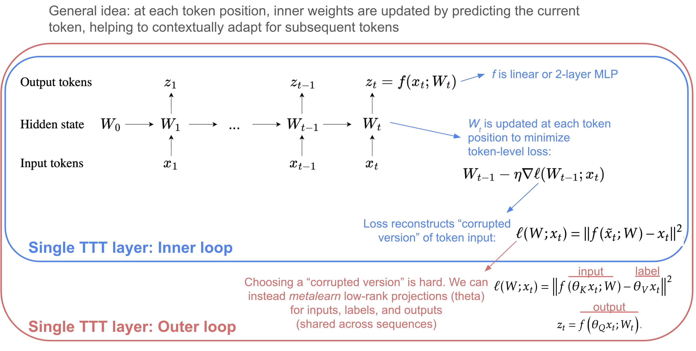
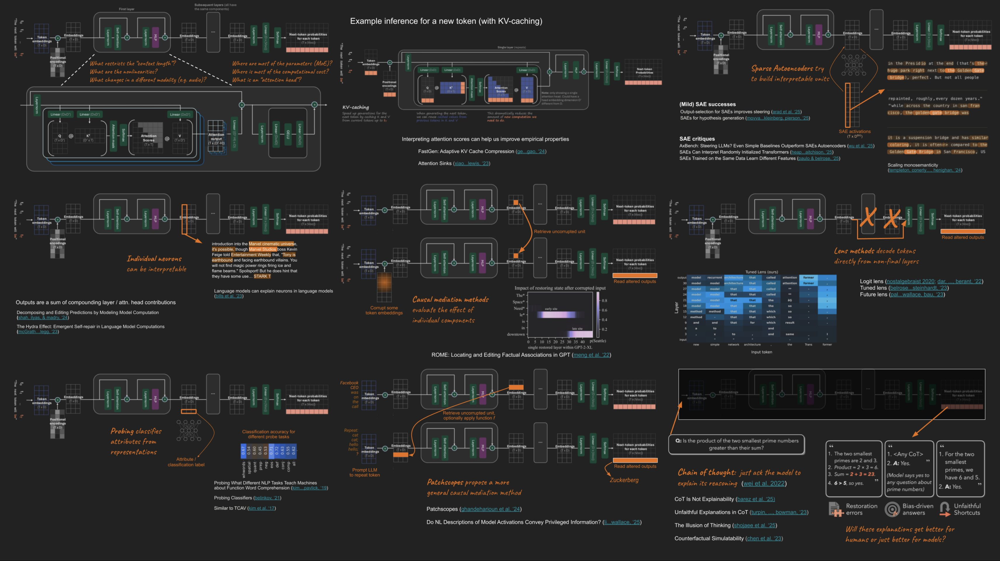
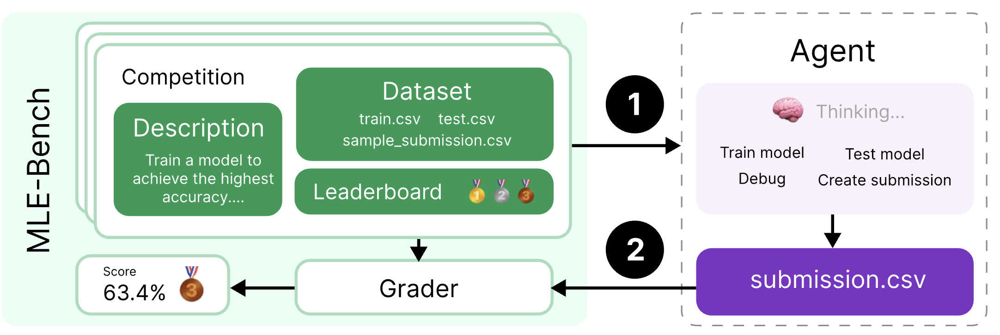

{:toc}

See related papers in the [📌 llm basics](https://csinva.io/notes/ai/llms.html) and [📌 interpretability](https://csinva.io/notes/research_ovws/ovw_interp.html) pages.

# prompting

Over time, ML has bounced from *feature-engineering* -> *architecture engineering* -> *prompt engineering* (nowadays, it's *data engineering*)

- https://github.com/dair-ai/Prompt-Engineering-Guide
- Pre-train, Prompt, and Predict: A Systematic Survey of Prompting Methods in Natural Language Processing ([liu...neubig, 2021](https://arxiv.org/pdf/2107.13586.pdf))
  - <details>
    <summary>Overview figure</summary>
    <p>	
    </p>
    </details>
- early prompting papers
  - LAMA: LMs as Knowledge Bases? ([petroni...riedel, 2019](https://arxiv.org/abs/1909.01066)) - use fill-in-the-blank (cloze) prompts for extracting knowledge from LLMs
    - create LAMA probe - dataset of (subject, relation, object) triplets with templates -- find that BERT can recall these relations
    - How to Query LMs? ([adolphs et al. 2021](https://arxiv.org/abs/2108.01928)) - query LLMs by example (e.g. "Ronaldo plays for Portugal. Who does Neuer play for?")
    - How Can We Know What LMs Know? ([jiang ... neubig, 2020](https://arxiv.org/abs/1911.12543))
      - mining-based and paraphrasing-based methods to automatically generate high-quality diverse prompts
      - ensemble methods to combine answers from different prompts (e.g. avg logits and more)
    - Noisy Channel LM Prompting for Few-Shot Text Classification ([min et al. 2022](https://arxiv.org/pdf/2108.04106.pdf))
    - Querying $P(question|answer)$ with Bayes rule outperforms standard querying $P(answer|question)$

## (auto)prompting


- natural-language prompting
  - iPrompt: Explaining Patterns in Data with LMs via Interpretable Autoprompting ([singh, morris, ...gao, 2022](https://arxiv.org/abs/2210.01848))
  - APE: LLMs Are Human-Level Prompt Engineers ([zhou...ba, 2022](https://arxiv.org/abs/2211.01910))
    - similar to iPrompt, (1) propose prompt candidates with an LLM, (2) score the prompts by the accuracy they yield when using another LLM and (3) regenerate similar prompt candidates
    - experiments on instruction induction datasets + truthful QA
  - FluentPrompt: Toward Human Readable Prompt Tuning ([shi, ..., zettlemoyer, 2022](https://arxiv.org/abs/2212.10539)) - use langevin sampling + fluency constraint to generate prompt
    - experiments relatively weak: 3 sentiment datasets + autoprompt is the only baseline
  - OPRO: LLMs as Optimizers ([yang...quoc le, zhou, & chen, 2023](https://arxiv.org/abs/2309.03409)) - add in past prompts with their scores during optimization
  - Promptbreeder: Self-Referential Self-Improvement Via Prompt Evolution ([fernando...rocktaschel, 2023](https://arxiv.org/abs/2309.16797)) - simultaneously improve prompts with LLM + improve the *mutation-prompts* the LLM uses to mutate the prompts
  - Connecting LLMs with Evolutionary Algorithms Yields Powerful Prompt Optimizers ([guo...yang, 2023](https://arxiv.org/abs/2309.08532))
  - PromptAgent: Strategic Planning with LMs Enables Expert-level Prompt Optimization ([wang...hu, 2023](https://arxiv.org/abs/2310.16427)) - iterate on prompt errors using MC tree search
  - LMs as Black-Box Optimizers for Vision-LMs ([yu...pathak, & ramanan, 2023](https://arxiv.org/pdf/2309.05950v1.pdf))
  - Automatic Prompt Optimization with "Gradient Descent" and Beam Search ([pryzant...zeng, 2023](https://arxiv.org/abs/2305.03495)) - LLM computes "gradient" by describing error made by previous prompts
  - Are LLMs Good Prompt Optimizers? ([ma...huang, 2024](https://arxiv.org/abs/2402.02101)) - critique that models often struggle
  - TextGrad: Automatic "Differentiation" via Text ([yuksekgonul...zou, 2024](https://arxiv.org/abs/2406.07496))
  - GEPA: Reflective Prompt Evolution Can Outperform RL ([agrawal...khattab, 2025](https://arxiv.org/abs/2507.19457))
    - Feedback Descent: Open-Ended Text Optimization via Pairwise Comparison ([lee, boen & finn, 2025](https://arxiv.org/abs/2511.07919))
- discrete prompting
  - AutoPrompt: Eliciting Knowledge from LMs with Automatically Generated Prompts ([shin...sameer singh, 2020](https://aclanthology.org/2020.emnlp-main.346/))
    - select prompts from a fixed set of tokens (resulting prompts are not coherent)
    - Universal Adversarial Triggers for Attacking and Analyzing NLP ([wallace...sameer singh, 2019](https://arxiv.org/abs/1908.07125) ) - find input-agnostic sequences of tokens that trigger a model to produce a specific prediction when concatenated to any input from a dataset
  - RLPrompt: Optimizing Discrete Text Prompts with Reinforcement Learning ([deng...hu, 2022](https://arxiv.org/abs/2205.12548))
  - LM-BFF: Making Pre-trained LMs Better Few-shot Learners ([gao et al. 2020](https://arxiv.org/abs/2012.15723)) - uses T5 to generate (i) template for the task (which might include a whole example or two) + (i) appropropriate label tokens in the vocabulary for the task (suffers from computationally intensive search + sub-optimal discrete space search)
  - PADA: Example-based Prompt Learning for on-the-fly Adaptation to Unseen Domains ([ben-david, ..., reichart, 2022](https://arxiv.org/abs/2102.12206))
- continuous prompt optimization
  - Prefix-Tuning: Optimizing Continuous Prompts for Generation ([li & percy liang, 2021](https://arxiv.org/abs/2101.00190)) -- optimizes in continuous space for language generation tasks
    - learn to map some parameters $\theta$ through and MLP to generate a starting hidden state $h_i$ -- never actually sends the prefix through the network 
  - P-Tuning: GPT Understands, Too ([liu et al. 2021](https://arxiv.org/abs/2103.10385)) -- use LSTM to generate prompt embeddings (don't map to tokens)
  - Control Prefixes for Parameter-Efficient Text Generation ([clive, cao, & rei, 2022](https://arxiv.org/abs/2110.08329)) - allow for adapting the prefix to each input example
    - DART: Differentiable Prompt Makes Pre-trained LMs Better Few-shot Learners ([zhang...chen, 2022](https://arxiv.org/abs/2108.13161))
      - reformulating NLP task into differentially optimizing the prompt template + target label (given a pre-trained model)
      - focus on smaller models (Roberta-large + GPT-2) + few training shots
      - fluency constraint to ensure association among prompt embeddings
  - WARP: Word-level Adversarial ReProgramming ([Hambardzumyan et al. 2021](https://arxiv.org/abs/2101.00121)) - add continous tokens + some task-specific parameters for better generalization
  - KnowPrompt: Knowledge-aware Prompt-tuning with Synergistic Optimization for Relation Extraction ([chen et al. 2021](https://arxiv.org/abs/2104.07650)) -- incorporate relations, visualize learned prompt vectors with t-SNE
- misc
  - Context-faithful Prompting for LLMs ([zhou, shang, poon & chen, 2023](https://arxiv.org/abs/2303.11315)) - ask question in clever way to force LLM to follow it
  - SentiPrompt: Sentiment Knowledge Enhanced Prompt-Tuning for Aspect-Based Sentiment Analysis ([zhang et al. 2021](https://arxiv.org/abs/2109.08306)) - use sentiment knowledge penalties in the prompt
  - Meta-learning via LM In-context Tuning ([yanda chen...he, 2022](https://arxiv.org/abs/2110.07814)) - given new task with new instruction
  - Prompt Programming for LLMs: Beyond the Few-Shot Paradigm ([Reynolds & McDonell, 2021](https://arxiv.org/abs/2102.07350)) - define metaprompts as general wrappers around tasks e.g. “This problem asks us to”
  - Re3: Generating Longer Stories With Recursive Reprompting and Revision ([yang et al. 2022](https://arxiv.org/abs/2210.06774)) - generate summaries, then expand and revise with prompts
  - Directional Stimulus Prompting ([li, baoling peng, ...jianfeng gao, xifeng yan, 2023](https://arxiv.org/abs/2302.11520)) - generate hint keywords using small LLM that are put into the prompt when calling large LLM
  - memory-assisted prompt-editing ([madaan...yang, 2022](https://arxiv.org/abs/2201.06009)) - allows model to "save things to memory" that get added to prompt when needed
  - Prompting Is Programming: A Query Language For LLMs ([beurer-kellner, fischer, & vechev, 2022](https://arxiv.org/abs/2212.06094))
- can benefit from training for promptability
  - Adapting LMs for Zero-shot Learning by Meta-tuning on Dataset and Prompt Collections ([zhong...klein, 2021](https://arxiv.org/abs/2104.04670))
  - Continued Pretraining for Better Zero- and Few-Shot Promptability ([wu...sameer singh, beltagy, 2022](https://arxiv.org/abs/2210.10258))

## chain-of-thought

- [optimizing CoT papers](https://www.aussieai.com/research/cot-optimization#concise)
- CoT Prompting ([wei et al. 2022](https://arxiv.org/abs/2201.11903)): in few-shot prompts, don't just provide answer but also reasoning
  - model outputs reasoning + answer, leading to improved performance
  - Self-Discover: LLMs Self-Compose Reasoning Structures ([zhou...le...zheng, 2024](https://arxiv.org/abs/2402.03620)) - LLMs come up with their own step-by-step structure for a task
  - Self-Consistency Improves CoT Reasoning in LMs ([wang, wei, schuurmans, quoc le, ... zhou, 2022](https://arxiv.org/abs/2203.11171)) - use output samples rather than greedy and return the most consistent final answer in the set
  - Challenging BIG-Bench Tasks and Whether CoT Can Solve Them ([suzgun, ..., quoc le, ..., jason wei, 2022](https://arxiv.org/abs/2210.09261))
  - self-ask ([Press et al., 2022](https://arxiv.org/pdf/2210.03350.pdf)) - LLM asks itself (and then answers) follow-up questions before answering the initial question
  - Text Classification via LLMs ([sun...wang, 2023](https://arxiv.org/pdf/2305.08377.pdf)) - add clues to the prompt
  - Let's Do a Thought Experiment: Using Counterfactuals to Improve Moral Reasoning ([ma, …, chen, 2023](https://arxiv.org/abs/2306.14308)) - counterfactuals help improve CoT
  - RCOT: Detecting and Rectifying Factual Inconsistency in Reasoning by Reversing CoT ([xue et al. 2023]())
  - SelfCheck: Using LLMs to Zero-Shot Check Their Own Step-by-Step Reasoning ([miao, teh, & rainforth, 2023](https://arxiv.org/abs/2308.00436))
  - EchoPrompt: Instructing the Model to Rephrase Queries for Improved In-context Learning ([mekala...sameer singh, 2023](https://arxiv.org/pdf/2309.10687.pdf)) - replace *let's think step by step* with *Let's repeat the question and also think step by step*
  - Let's Think Dot by Dot: Hidden Computation in Transformer LMs ([pfau, merrill, & bowman, 2024](https://arxiv.org/abs/2404.15758))
  - Show Your Work: Scratchpads for Intermediate Computation with LMs ([nye et al. 2021](https://arxiv.org/abs/2112.00114))
  - selection inference ([creswell et al. 2022](https://arxiv.org/abs/2205.09712)) - generate set of facts, then iteratively generate inferences from the facts to yield the final answer
  - least-to-most prompting ([zhou...quoc le et al. 2022](https://arxiv.org/abs/2205.10625)) - prompt LLM with context showing how to reduce into subproblems; then LLM sequentially solves the subproblems, using the previous answers
  - Generated Knowledge Prompting for Commonsense Reasoning ([liu...hasjishirzi, 2021](https://arxiv.org/abs/2110.08387)) - generate knowledge from an LLM then provide it as additional input when answering a question
  - maieutic prompting ([jung et al. 2022](https://arxiv.org/abs/2205.11822)) - generate a tree of all explanation of the form "True, because...", "False, because..." then query LLM with these as prompts
    - then use Max-SAT to try to satisfy as many relations between the model explanations as possible to come up with the true answer

## self-verification

- LM vs LM: Detecting Factual Errors via Cross Examination ([cohen et al. 2023](https://arxiv.org/abs/2305.13281))
  - [Thread](https://twitter.com/ChengleiSi/status/1664023767373299715) of papers combating hallucination
  - verifiers ([cobbe et al. 2021](https://arxiv.org/abs/2110.14168)) - train model to judge whether an answer and thought are likely to be “valid”
  - subgoal search ([czechowski et al. 2021](https://t.co/PCR4yexHti)) - train model to generate subgoals then solve them in a graph
  - STaR “Self-taught reasoner” ([zelikman...goodman, 2022](https://arxiv.org/abs/2203.14465))
    - first, finetune on observed $(Q, T, A)$ triplets, where $T$ is a rationale
    - then, impute unknown $T_i$ given dataset of pairs $(Q_i, A_i)$ by sampling until finding a $T_i$ which leads to the correct answer
  - zero-shot planning in robotics ([huang, abbeel, pathak, & mordatch, 2022](https://arxiv.org/abs/2201.07207))
- Prover-Verifier Games improve legibility of LLM outputs ([kirchner, chen, ... leike, mcaleese, & burda, 2024](https://arxiv.org/abs/2407.13692)) - trained strong LMs to produce text that is easy for weak LMs to verify and found that this training also made the text easier for humans to evaluate
- self-verification
  - review on self-verification ([pan...wang, 2023](https://arxiv.org/pdf/2308.03188.pdf))
  - Self-Refine: Iterative Refinement with Self-Feedback ([madaan, ..., clark, 2023](https://arxiv.org/abs/2303.17651))
  - Self-Verification Improves Few-Shot Clinical Information Extraction ([gero et al. 2023](https://arxiv.org/abs/2306.00024))
  - SelfCheckGPT: Zero-Resource Black-Box Hallucination Detection for Generative LLMs ([manakul...gales, 2023](https://arxiv.org/abs/2303.08896))
- process reward models ([openai, 2024](https://openreview.net/pdf?id=v8L0pN6EOi)) - identify and mitigate intermediate reasoning errors rather than just final answer

## sampling / efficient inference

- tree-related
  - Aug-tree ([singh, askari, caruana, & gao, 2023](https://arxiv.org/abs/2209.11799))
  - Tree-prompting ([morris, singh, rush, gao, & deng, 2023](https://arxiv.org/abs/2310.14034))
    - Interpretable-by-Design Text Classification with Iteratively Generated Concept Bottleneck ([ludan...callison-burch, 2023](https://arxiv.org/abs/2310.19660))
    - ACT: Agentic Classification Tree ([grari...detyniecki, 2025](https://arxiv.org/abs/2509.26433)) - same as tree-prompting
  - tree of thoughts ([yao et al. 2023](https://arxiv.org/abs/2305.10601)) - LLM generates a tree of intermediate answers and perform steps such as backtracking
    - Graph of Thoughts: Solving Elaborate Problems with LLMs ([besta, .., hoefler, 2023](https://arxiv.org/pdf/2308.09687.pdf)) - allows merging/looping in the tree, e.g. for sorting
- optimizing cost efficiency
  - frugalGPT ([chen, zaharia, & zou, 2023](https://arxiv.org/pdf/2305.05176.pdf))
    - 3 components
      1. prompt adaptation - identify effective / shorter prompts (e.g. less demonstrations)
      2. LLM approximation - create simpler/cheaper LLMs
      3. LLM cascade - adaptively choose LLM based on query
         1. train "generation scoring function" - returns reliability score from 0 to 1 for each (question, answer)
         2. router sequentially proceeds through LLM APIs, returning the answer if the reliability score is high enough
    - frugalML ([chen, zaharia, zou, 2020](https://proceedings.neurips.cc/paper/2020/hash/789ba2ae4d335e8a2ad283a3f7effced-Abstract.html)) - tradeoff performance with budget for sequential cascade of API calls for single label
      - FrugalMCT ([chen, zaharia, zou, 2022](https://proceedings.mlr.press/v162/chen22ad.html)) - extends to multilabel
  - EcoAssistant: Using LLM Assistant More Affordably and Accurately ([zhang...awadallah, wang, 2023](https://arxiv.org/abs/2310.03046)) - answer code-driven queries efficiently using code executor + cascade of increasingly complex LLMs
- decoding (basics in [HF blog post](https://huggingface.co/blog/mlabonne/decoding-strategies) + [docs](https://huggingface.co/docs/transformers/en/generation_strategies) on slightly more advanced stuff)
  - greedy - iteratively pick highest-probability token
  - nucleus sampling: The Curious Case of Neural Text Degeneration ([holtzman...choi, 2019](https://arxiv.org/abs/1904.09751))
  - contrastive decoding ([li et al. 2022](https://arxiv.org/abs/2210.15097)) - decode based on the difference between a large and small LLM
    - Context-aware decoding ([shi, ...zettlemoyer, yih, 2023](https://arxiv.org/pdf/2305.14739.pdf)) - the difference between the output probabilities when a model is used with and without context
    - DoLa: Decoding by Contrasting Layers Improves Factuality in LLMs ([chuang...he, 2023](https://arxiv.org/abs/2309.03883)) - contasting later layers with early layers can improve truthfulness
    - Calibrate Before Use: Improving Few-Shot Performance of LMs ([zhao, ..., dan klein, sameer singh, 2021](https://arxiv.org/abs/2102.09690)) - to make prompting easier, first calibrate output distr by making it uniform when given null inputs, e.g. "N/A"
  - Minimum Bayes Risk Decoding ([suzgun, ..., jurafsky, 2022](https://arxiv.org/abs/2211.07634)) or ([freitag et al. 2022](https://arxiv.org/pdf/2111.09388.pdf))
  - A Frustratingly Simple Decoding Method for Neural Text Generation ([yang, ..., shi, 2023](https://arxiv.org/abs/2305.12675)) - build an anti-LM based on previously generated text and use this anti-LM to penalize future generation of what has been generated
  - Mixture of Inputs: Text Generation Beyond Discrete Token Sampling ([zhuang, liu, singh, shang, & gao, 2025](https://arxiv.org/abs/2505.14827)) - post-hoc (requires no finetuning), combines discrete tokens into continuous vector
  - Min-p sampling ([nguyen...shwartz-ziv, 2025](https://arxiv.org/abs/2407.01082)) - adjusts the sampling threshold based on the model's confidence by using the top token's probability as a scaling factor
    - Min-p, Max Exaggeration: A Critical Analysis of Min-p Sampling in LMs ([schaeffer...denisov-blanch, 2025](https://arxiv.org/abs/2506.13681))
  - Sampling from Your LM One Byte at a Time ([hayase, liu, smith, oh, 2025](https://arxiv.org/pdf/2506.14123))
    - Broken Tokens? Your LM can Secretly Handle Non-Canonical Tokenizations ([zheng...choi, smith, 2025](https://arxiv.org/abs/2506.19004)) - some sequences can be tokenized in different ways (e.g. using character-level tokenizer) -- feeding these into a model still generally works
  - Verbalized Sampling ([zhang...shi, 2025](https://arxiv.org/abs/2510.01171)) - simple prompting strategy for more diverse sampling, e.g. "Generate 5 jokes about coffee and their corresponding probabilities"

## prompt chaining / ensembling

- overviews
  - Ai chains: Transparent and controllable human-ai interaction by chaining LLM prompts ([wu, terry, & cai, 2022](https://dl.acm.org/doi/abs/10.1145/3491102.3517582)) - chaining LLM steps together: output of one step becomes the input for the next
    - interactive system where users can modify chains + their intermediate results -- improves performance + human experience
  - LM Cascades ([dohan...sutton, 2022](https://arxiv.org/abs/2207.10342)) - treat chaining models as probabilistic programs
    - use a probabilistic-programming language (PPL) to define a joint probability model on string-valued random variables, parameterized using LMs, and then condition this model on string-valued observations in order to compute a posterior over string-valued unknowns
    - self-PPLs extend probabilistic graphical models to support more complex joint distributions whose size and “shape” can itself be stochastic
      - e.g., a graph unrolled for a random number of iterations, until a data-dependent stopping criterion is met
      - variables are all text: questions $Q$, answers $A$, and intermediate thoughts $T$
- prompt ensembles
  - [liu…neubig, 2023](https://dl.acm.org/doi/pdf/10.1145/3560815) review discusses different strategies for ensembling prompts, e.g. averaging, weighted averaging
  - black-box querying
    - Tree-Prompting ([morris...deng, 2023](https://arxiv.org/abs/2310.14034))
    - PromptBoosting: Black-Box Text Classification with Ten Forward Passes ([hou, ..., jacob andreas, ..., zhang, 2022](https://arxiv.org/abs/2212.09257)) - get a small pool of prompts, learn a verbalizer (final classification layer) for each, then ensemble them with AdaBoost on LLM output
    - people have studied many works on prompt ensembling (e.g. [lester et al. 2021](https://arxiv.org/abs/2104.08691))
    - Boosted Prompt Ensembles for LLMs ([pitis...ba, 2023](https://arxiv.org/abs/2304.05970)) - similar but use CoT-style prompts and tasks, e.g. GSM8k
    - PREFER: Prompt Ensemble Learning via Feedback-Reflect-Refine ([zhang...cai, 2023](https://arxiv.org/abs/2308.12033)) - builds set of prompts dynamically rather than assuming they're fixed
    - PTR: Prompt Tuning with Rules for Text Classification ([han et al. 2021](https://arxiv.org/abs/2105.11259)) -- use logic rules to construct prompts with sub-prompts for many-class text classification (prompt is constructed hierarchically, but only one call is made to the LLM for inference)
  - soft prompts
    - Learning How to Ask: Querying LMs with Mixtures of Soft Prompts ([Qin & Eisner, 2021](https://arxiv.org/abs/2104.06599)) - learn a mixture of soft prompts using gradient descent
  - require model retraining
    - PRBOOST: Prompt-Based Rule Discovery and Boosting for Interactive Weakly-Supervised Learning ([zhang...zhang, 2022](https://arxiv.org/abs/2203.09735)) - iteratively (1) select high-error examples, (2) have human label them as rules, and (3) use boosting to train model on the new rules + ensemble
    - typical rule generation
      - Snuba ([Varma and Ré, 2018](https://pubmed.ncbi.nlm.nih.gov/31777681/)) generates heuristics based on a small labeled dataset with pre-defined rule types
      - TALLOR ([Li et al. 2021a](https://arxiv.org/pdf/2107.02282.pdf)) & GLaRA ([Zhao et al. 2021](https://arxiv.org/pdf/2104.06230.pdf)) study rule expansion for NER problem based on lexical information and then select rules based on a hand-tuned threshold
  - Prompt ensembling / selection without labels
    - Zero-Label Prompt Selection ([liao, zheng, & yang, 2022](https://arxiv.org/abs/2211.04668)) - use prompts to label unlabeled data and then select prompts using these labels
    - A Simple Zero-shot Prompt Weighting Technique to Improve Prompt Ensembling in Text-Image Models ([alingham…lakshminarayanan, 2023](https://proceedings.mlr.press/v202/allingham23a.html)) - use confidence (max output logit) after appropriate normalization as weight
  - few-shot text classification
    - FastFit ([yehudai & bandel, 2024](https://arxiv.org/pdf/2404.12365.pdf)) - fit few-shot batch with contrastive examples then predict using similarities to shots rather than a classification head (base model is roberta)
      - SetFit ([tunstal…pereg, 2022](https://arxiv.org/abs/2209.11055)) - finetune stentence transformer with contrastive loss, then train classification head
- Dense Communication between LMs ([wu, wang, yao, 2025](https://arxiv.org/pdf/2505.12741)) - use pre-trained LMs as modules, and pass continuous embeddings between them
  - train seq2seq models to connect the different small LMs, and get strong performance with very small training cost


## llm querying / causal inference

- Can LLMs Infer Causation from Correlation? ([jin...scholkopf, 2023](https://arxiv.org/abs/2306.05836)) - introduce Corr2Cause dataset (must infer causal graph from correlational statements), doesn't test pre-existing knowledge
- Causal Reasoning and LLMs: Opening a New Frontier for Causality ([kiciman...tan, 2023](https://arxiv.org/abs/2305.00050))
  - LLMs to be used alongside existing causal methods, as a proxy for human domain knowledge and to reduce human effort in setting up a causal analysis
    - cause-effect pairs, LLM has to discover from graph (tubingen benchmark, neuropathic pain, etc.)
- Causal Inference in Natural Language Processing: Estimation, Prediction, Interpretation and Beyond ([feder...vetich, diyi yang, 2022](https://direct.mit.edu/tacl/article/doi/10.1162/tacl_a_00511/113490/Causal-Inference-in-Natural-Language-Processing))
- Zero-shot causal learning ([nilforoshan...leskovec, 2023](https://arxiv.org/abs/2301.12292))
- InferBERT: A Transformer-Based Causal Inference Framework for Enhancing Pharmacovigilance ([wang...liu, 2021](https://www.frontiersin.org/articles/10.3389/frai.2021.659622/full)) - learn + test feature relationships from attention weights
- CausaLM: Causal Model Explanation Through Counterfactual LMs ([2021](https://direct.mit.edu/coli/article/47/2/333/98518/CausaLM-Causal-Model-Explanation-Through)) - produce example-level causal model explanations using models finetuned on auxiliary adversarial tasks derived from the causal graph of the problem
- Investigating Gender Bias in LMs Using Causal Mediation Analysis ([vig, ..., shieber, 2020](https://proceedings.neurips.cc/paper/2020/file/92650b2e92217715fe312e6fa7b90d82-Paper.pdf))
  - Applies causal mediation analysis to identify decisive neurons and attention heads responsible for gender bias in LLMs
  - Identifies a small handful of decisive attention heads in this case
- Amnesic Probing: Behavioral Explanation with Amnesic Counterfactuals ([elazar, ..., goldberg, 2021](https://arxiv.org/pdf/2006.00995.pdf)) - measure the importance of specific info within a model by introducing a causal intervention to erase that information, then observing the causal effects
- TrustLLM ([sun...zhao, 2024](https://arxiv.org/abs/2401.05561)) - evaluation and benchmark of many aspects of trustworthiness ([github](https://github.com/HowieHwong/TrustLLM))
- What Evidence Do LMs Find Convincing? ([wan, wallace, & klein, 2024](https://arxiv.org/abs/2402.11782)) - rather than relying on facts, LLMs largely rely on textual similarities in evidence to decide whether it's important
- Deductive Closure Training of LMs for Coherence, Accuracy, and Updatability ([aykurek...andreas, 2024](https://arxiv.org/abs/2401.08574)) - LMs generate additional text implied by documents, reason about the generated text, and finetune on the correct text
  - LMs' reasoning capabilities during inference can be leveraged during training to improve their reliability
- Causal foundation models
  - Do-PFN: In-Context Learning for Causal Effect Estimation ([robertson...hollman, hutter, scholkopf, 2025](https://arxiv.org/abs/2506.06039))
  - Black Box Causal Inference: Effect Estimation via Meta Prediction ([bynum...cho, ranganath, 2025](https://arxiv.org/abs/2503.05985))
  - CausalPFN: Amortized Causal Effect Estimation via In-Context Learning ([balazadeh...krishnan, 2025](https://arxiv.org/abs/2506.07918))
  - CausalFM: FMs for Causal Inference via Prior-Data Fitted Networks ([ma, frauen, javurek & feuerriegel, 2025](https://arxiv.org/abs/2506.10914))
- getting diverse outputs
  - Echoes in AI: Quantifying lack of plot diversity in LLM outputs ([xu...dolan, 2024](https://arxiv.org/abs/2501.00273)) - LLM-generated stories often contain combinations of idiosyncratic plot elements echoed frequently across generations and across different LLMs


## uncertainty

- Semantic Uncertainty ([kuhn, gal, & farquhar, 2023](https://arxiv.org/abs/2302.09664)) - instead of calculating entropy over tokens, first generate set of answers, then cluster them base on semantic equivalence, before computing entropy
  - clustering is done via an LM that tests entailment e.g. E.g., “The capital of France is Paris.” entails “Paris is the capital of France.” because they mean the same thing

- Can LLMs Express Their Uncertainty? An Empirical Evaluation of Confidence Elicitation in LLMs ([xiong...hooi, 2023](https://arxiv.org/abs/2306.13063))
  - verbalized uncertainty - model outputs its own uncertainty
  - consistency-based uncertainty - consistency between output generations

- Quantifying Uncertainty in Natural Language Explanations of LLMs ([tanneru...lakkaraju, 2023](https://arxiv.org/abs/2311.03533))
  - probing uncertainty (like consistency-based uncertainty above) - applies input perturbations (e.g., paraphrasing) and measure the consistency of the resulting explanations
  - verbalized uncertainty of explanations often performs poorly

- Relying on the Unreliable: The Impact of LMs' Reluctance to Express Uncertainty ([zhou...sap, 2024](https://arxiv.org/abs/2401.06730))
  - LMs are often unable to express uncertainties
  - LM confidences tend to be overconfident
  - users rely heavily on LM generations, whether or not they are marked by certainty
- Teaching Models to Express Their Uncertainty in Words ([Lin et al., 2022](https://arxiv.org/abs/2205.14334)) - GPT3 can  generate both an answer and a level of confidence (e.g. "90% confidence")
- Decomposing Uncertainty for LLMs through Input Clarification Ensembling ([hou...zhang, 2023](https://arxiv.org/pdf/2311.08718.pdf))

## prompt compression / compiling

- Learning How to Ask: Querying LMs with Mixtures of Soft Prompts ([Qin & Eisner, 2021](https://arxiv.org/abs/2104.06599)) - learn a mixture of soft prompts using gradient descent
- [liu…neubig, 2023](https://dl.acm.org/doi/pdf/10.1145/3560815) review discusses different strategies for ensembling prompts, e.g. averaging, weighted averaging
- Prompt ensembling / selection without labels
  - Zero-Label Prompt Selection ([liao, zheng, & yang, 2022](https://arxiv.org/abs/2211.04668)) - use prompts to label unlabeled data and then select prompts using these labels
  - A Simple Zero-shot Prompt Weighting Technique to Improve Prompt Ensembling in Text-Image Models ([alingham…lakshminarayanan, 2023](https://proceedings.mlr.press/v202/allingham23a.html)) - use confidence (max output logit) after appropriate normalization as weight
- LLMLingua ([jiang, wu...qiu, 2023](https://arxiv.org/abs/2310.05736)) - learn BERT-size model to compress prompt (iterative token classification approach from distilled GPT-4 compressed prompts)
  - LongLLMLingua: Accelerating and Enhancing LLMs in Long Context Scenarios via Prompt Compression ([jiang, wu...qiu, 2023](https://arxiv.org/abs/2310.06839))

## classifier-guided generation

- Plug and Play LMs: A Simple Approach to Controlled Text Generation ([dathathri, …, yosinski, & liu, 2020](https://arxiv.org/abs/1912.02164))
    - gradients from the classifier push the LM’s hidden activations, then recompute logits to guide generation (and maybe avg with original logits to maintain fluency)
- FUDGE: Controlled Text Generation With Future Discriminators ([yang & klein, 2021](https://arxiv.org/abs/2104.05218))
    - classifier predicts probability of attribute for running sequence with each next-token appended
    - these attribute probs. are multiplied with next-token probs for each token and then we sample from that distr (after normalization)
- Diffusion-LM Improves Controllable Text Generation ([lisa li, thickstun, gulrajani, liang, & hashimoto, 2022](https://arxiv.org/abs/2205.14217)) - continuous embeddings
- Mixture of Soft Prompts for Controllable Data Generation ([chen, lee, …, yu, 2023](https://arxiv.org/pdf/2303.01580.pdf)) - trains a small model on data from a big frozen LLM that is then more controllable

# architecture engineering & vetting

## architecture/attention variants

- state space models (good overview in [albert gu thesis](https://searchworks.stanford.edu/view/14784021), 2023)
  - S4: *structured* state space models ([gu...re, 2022](https://arxiv.org/abs/2111.00396)) - similar to RNNs but can predict all outputs at once via convolution
    - the core of the state space model is basically a linear RNN
      - inputs x, hidden states h, outputs y
      - 3 matrices: $A, B, C$
      - $y_i = C h_i$
      - $h_i = A h_{i-1} + B x_i$
        - note: there is no nonlinearity between hidden states
        - note: the transition from one hidden state to the next is the same for all positions (except for the input)
      - can compute hidden states simultaneously by just pre-multiplying these A and B matrices with x the right number of times ( a convolution operation)
  - mamba: *selective* state space models ([gu & dao, 2023](https://arxiv.org/abs/2312.00752))
    - changes (2) above -- the transition from one hidden state to the next now depends on the input (making it closer to LSTMs)
      - $B = B(x)$
      - $C = C(x)$
  - RNNs are not Transformers (Yet): The Key Bottleneck on In-context Retrieval ([wen, dang, & lyu, 2024](https://arxiv.org/abs/2402.18510)) - RNNs fail to retrieve info from long contexts, RAG helps
- MAD synthetic tasks: Mechanistic Design and Scaling of Hybrid Architectures ([poli...ermon, re, zhang, & massaroli, 2024](https://arxiv.org/abs/2403.17844)) - introduces 6 synthetic tasks on which performance correlates very well when scaling to real tasks: in-context recall, fuzzy in-context recall, noisy in-context recall, selective copying, compression, memorization
- Scalable MatMul-free LMs ([zhu...eshraghian, 2024](https://arxiv.org/abs/2406.02528)) - LM architecture that doesn't use matmuls, builds on GRU, and shows improved efficiency on FPGAs
- The Era of 1-bit LLMs: All LLMs are in 1.58 Bits ([ma...wei, 2024](https://arxiv.org/abs/2402.17764))
  - BitNet: Scaling 1-bit Transformers for LLMs ([wang...wei, 2023](https://arxiv.org/abs/2310.11453))
- HRM: Hierarchical Reasoning Model (Sapient; [wang...yadkori, 2025](https://arxiv.org/abs/2506.21734)) - 4 learnable components: an input network, a low-level recurrent module, a high-level recurrent module, and an output network
  - TRM: Tiny Recursive Model: Recursive Reasoning with Tiny Networks ([jolicoeur-martineau, 2025](https://arxiv.org/abs/2510.04871))
  - Teaching Pretrained LMs to Think Deeper with Retrofitted Recurrence ([mcleish...goldblum, 2025](https://arxiv.org/abs/2511.07384)) - post-train regular LMs into looped models
  
- The Dragon Hatchling: The Missing Link between the Transformer and Models of the Brain (Pathway; [kosowski...bartoszkiewicz, 2025](https://arxiv.org/abs/2509.26507))
- Misc
  - Tree Transformer: Integrating Tree Structures into Self-Attention ([wang, .., chen, 2019](https://arxiv.org/pdf/1909.06639.pdf))
  - Waveformer: Linear-Time Attention with Forward and Backward Wavelet Transform ([zhuang...shang, 2022](https://arxiv.org/abs/2210.01989))
  - White-Box Transformers via Sparse Rate Reduction: Compression Is All There Is? ([yaodong yu...yi ma, 2023](https://arxiv.org/abs/2311.13110))


## mixture of experts (MoE) / routing

mixture of experts models have become popular because of the need for (1) fast speed / low memory at test time while still (2) having a large model during training

- note: nowadays often the "experts" are different MLPs following the self-attention layers (since their computations can be computed independently)
- A Review of Sparse Expert Models in Deep Learning ([fedus, jeff dean, zoph, 2022](https://arxiv.org/abs/2209.01667))
  - sparsity decouples the parameter count from the compute per example allowing for extremely large, but efficient models
  - routing algorithm - determines where to send examples
    - discreteness makes it difficult
      - some works use RL to learn routing
      - standard approach uses gumbel-softmax
      - usually get matrix of similarities between input tokens and experts and route based on these
        - sometimes route to topk experts rather than top1
    - load balancing - usually add an auxiliary loss to encourage equal tokens being sent to different experts
- non-specialized experts
  - Early versions ([Jacobs, michael jordan, nowlan, & hinton, 1991](https://ieeexplore.ieee.org/abstract/document/6797059)) had independent feed-forward networks serving as experts
  - Sparsely-gated MOE layer ([Shazeer...quoc le, hinton, dean, 2017](https://arxiv.org/abs/1701.06538)) have been studied with token-based routing with backprop
  - replace FFN in transformers with expert layers
    - GShard [Lepikhin et al. (2021)](https://arxiv.org/abs/2006.16668), which appplies this concept to machine translation
    - Switch transformers ([Fedus et al. (2022)](https://www.jmlr.org/papers/volume23/21-0998/21-0998.pdf)) simplifies the architecture to activation of only one expert per layer
  - BASE Layers [Lewis et al. (2021)](https://proceedings.mlr.press/v139/lewis21a.html) - find an alternative approach to routing by formulating it as a linear assignment problem
  - Hash layers [Roller et al. (2021)](https://arxiv.org/abs/2106.04426) use a fixed hash as the gating function
  - THOR ([zuo, liu...zhao, gao, 2022](https://arxiv.org/abs/2110.04260)) - randomly route to different experts then merge at the parameter level at test time
- [routing notes](https://www.sscardapane.it/assets/files/nnds2022/Lecture_8_Dynamic_NNs.pdf) - make hard decision but still want to learn probabilities
  - straight-through estimator (STE) - take the argmax during the forward pass, while considering the original probabilities in the backward pass
    - highly biased
  - gumbel-softmax- allows for better sampling
- specialized experts as fully independent models (sometimes for multi-task learning)
  - DEmix Layers ([Gururangan...smith, zettlemoyer, 2021](https://arxiv.org/abs/2108.05036)) --  DEMix layers – placed in the feedforward layers of the Transformer – contain experts which specialize on specific domains. Routing at train time is determined only by the domain label, but all experts are activated at inference time and mixed according to weights estimated from a validation set
  - [Sparsely Activated Mixture-of-Experts are Robust Multi-Task Learners](https://arxiv.org/abs/2204.07689) (gupta...awadallah, gao, 2022) - use task description to improve routing
  - [Pfeiffer et al. (2022)](https://arxiv.org/abs/2205.06266) - multilingual expert model with language-specific routing
  - task-level MoE [Kudugunta et al. (2021](https://arxiv.org/abs/2110.03742)) -- multi-task expert model with task-specific routing
  - scaling up
    - OPT-MOE ([artetxe et al. 2021](https://arxiv.org/abs/2112.10684))
    - AutoMoE ([jawahar, mukherjee, liu...gao, 2022](https://arxiv.org/abs/2210.07535))
- Towards Understanding Mixture of Experts in Deep Learning ([chen...gu, li, 2022](https://arxiv.org/abs/2208.02813))
- Interpretable Mixture of Experts ([ismail...pfister, 2023](https://arxiv.org/abs/2206.02107)) - each sample assigned to single expert for prediction
  - InterpretCC: Intrinsic User-Centric Interpretability through Global Mixture of Experts ([swamy...kaser, 2024](https://arxiv.org/abs/2402.02933v2)) - first, discriminator predicts which features are important. Then, all other features are masked and used for prediction. The discriminator network can additionally select a different network to send different features to

## pruning / caching

- SparseGPT: Massive LMs Can Be Accurately Pruned in One-Shot ([frantar & alistarh, 2023](https://arxiv.org/abs/2301.00774)) - prune GPT-style models to atleast 50% sparsity in one-shot, without any retraining, at minimal loss of accuracy
- Cramming: Training a LM on a Single GPU in One Day ([geiping & goldstein, 2022](https://arxiv.org/abs/2212.14034)) - tricks for training BERT
- The Unreasonable Ineffectiveness of the Deeper Layers ([gromov...roberts, 2025](https://arxiv.org/abs/2403.17887)) - use angle similarity to search for which consecutive layers to remove and find that can easily remove large numbers of deep layers
- fast decoding
  - [KV caching](https://kipp.ly/transformer-inference-arithmetic/) + some other tricks - if repeatedly using the same tokens at the beginning of the context, can cache the KV vectors for those tokens
    - KV caching trades off speed with memory
    - FastGen: Model Tells You What to Discard: Adaptive KV Cache Compression for LLMs ([ge...gao, 2024](https://arxiv.org/abs/2310.01801)) - for each input prompt, run quick profiling to decide whether to evict things from the KV cache (e.g. attention heads that don't care about long context, or heads that attend only to punctuation)
  - speculative decoding ([leviathan, kalma, & matias, 2022](https://arxiv.org/abs/2211.17192))  - decode multiple tokens in parallel with small model, potentially skipping steps for the large model
- early exit - popular way to speed up inference
  - Multi-exit vision transformer for dynamic inference ([Bakhtiarnia, A., Zhang, Q. and Iosifidis, A., 2021](https://arxiv.org/abs/2106.15183))
    - early layers have large activation map so early exist classifier must be complex
    - solution: ViT class token allows early-exit classifier to have constant complexity
  - DeeBERT: Dynamic early exiting for accelerating BERT inference ([xin...lin, 2020](https://arxiv.org/abs/2004.12993))

## adaptation / transfer

*These are transformer-specific. For more general notes, see [📌 transfer learning](https://csinva.io/notes/research_ovws/ovw_transfer_learning.html) or [📌 uncertainty](https://csinva.io/notes/research_ovws/ovw_transfer_learning.html).* Most of these approaches can be combined with metalearning.

- finetuning
  - finetune all DNN params
  - finetune linear layer on activations
    - standard - train linear model on the embedding of the first token (usually an added `[CLS]` token) ([peters et al. 2018](https://aclanthology.org/N18-1202/))
    - finetune linear model on all the activations
      - e.g. [evci, et al. 2022](https://arxiv.org/abs/2201.03529) - learn linear layer (using group-lasso) on features extracted from all layers
  - finetune specific DNN params (e.g. just the bias terms)
    - Cutting Down on Prompts and Parameters ([logan...sameer singh, riedel, 2021](https://arxiv.org/abs/2106.13353)) - finetune only the bias terms; works even with null prompts
    - BitFit: Simple Parameter-efficient Fine-tuning for Transformer-based Masked Language-models ([zaken, ravfogel, & goldberg, 2021](https://arxiv.org/abs/2106.10199)) - finetune only bias terms
- adapter - finetune lightweight layers on top of pre-trained layers (between finetuning all layers, and just finetuning a new layer)
  - add some new layers and retrain some specific things (all human choices)
  - side-tuning ([zhang, sax...malik, 2020](https://link.springer.com/chapter/10.1007/978-3-030-58580-8_41)) - train a “side” network that is fused with the pretrained model via summation
  - Combining Modular Skills in Multitask Learning ([ponti, sordoni, bengio, & reddy, 2022](https://arxiv.org/pdf/2202.13914.pdf)) - learn adaptor with disentangled inventory of skills
  - [Parameter-Efficient Transfer Learning for NLP](http://proceedings.mlr.press/v97/houlsby19a.html)
  - [AdapterHub: A Framework for Adapting Transformers](https://arxiv.org/abs/2007.07779)
  - Text-to-LoRA: Instant Transformer Adaption ([charakorn…lange, 2025](https://arxiv.org/pdf/2506.06105))
- vaguely similar to adapter
  - LoRA
  - QLoRA: Efficient Finetuning of Quantized LLMs ([dettmers, ..., zettlemoyer, 2023](https://arxiv.org/abs/2305.14314))
  - TOAST ([shi, …, darrel, xin wang, 2023](https://arxiv.org/pdf/2305.15542.pdf)) - use top-down attention steering for efficient finetuning
- focused on editing
  - Continual Learning via Sparse Memory Finetuning ([jessy lin, zettlemoyer...oğuz, 2025](https://arxiv.org/abs/2510.15103); + [blog post](https://jessylin.com/2025/10/20/continual-learning/)) - learn sparse layers building on memory layers ([berges...ghosh, 2024](https://arxiv.org/abs/2412.09764)) that show strong performance improvements

- predict a mask
  - ablate some model weights by training a binary mask over model parameters (Zhao et al., 2020; Radiya-Dixit and Wang, 2020)
  - predict mask over attention heads
- prompting = few-shot learning = priming = in-context learning (starts with GPT)
  - prompting without changing any model parameters
    - limitation: can't exploit sets longer than the training window
  - MetaICL: Learning to Learn In Context ([min et al. 2022](https://arxiv.org/abs/2110.15943)) - tune LLM to do in-context learning on a large set of training tasks (few-shot prompting and training time and at test-time)
  - Visual Prompting via Image Inpainting ([bar...darrell, globerson, efros, 2022](https://arxiv.org/abs/2209.00647) )
  - PatternExploiting Training (PET) -- Exploiting Cloze Questions for Few Shot Text Classification and Natural Language Inference ([schick & schutze, 2021](https://aclanthology.org/2021.eacl-main.20.pdf))
    - **cloze questions** - same as masked LMs: task is to replace some missing words
    - use cloze-question templates (e.g. it was "good" or "bad") to get soft labels for unlabeled data and then finetune on theses
- prompt-tuning (also see next section on autoprompting)
  - [Attentional Mixtures of Soft Prompt Tuning for Parameter-efficient Multi-task Knowledge Sharing](https://arxiv.org/abs/2205.11961)
  - [STT: Soft Template Tuning for Few-Shot Adaptation](https://arxiv.org/abs/2207.08408)
  - Mixture of Soft Prompts for Controllable Data Generation ([chen, ... yu, 203](https://arxiv.org/abs/2303.01580)) - LLMs as Synthetic Data Generators for Training Smaller Models
- long-context adaptation
  - RoPE: RoFormer: Enhanced Transformer with Rotary Position Embedding ([su...liu, 2021](https://arxiv.org/abs/2104.09864))
    - encodes the absolute position with a rotation matrix
  - NTK+RoPE (LocalLLaMA reddit post) - unequal interpolation and extrapolation across RoPE dimensions
  - YaRN ([Peng et al., 2023](https://arxiv.org/abs/2309.00071)) - categorizes RoPE dimensions into 3frequency-based groups & applies extrapolation, NTK, and linear interpolations, respectively
  - LongRoPE ([ding...yang, 2024](https://arxiv.org/abs/2402.13753))
    - exploit two forms of non-uniformities in positional interpolation through genertic algo search
    - progressive extension (first extend to 256k then to 2048k)
    - readjust on short contexts to preserve original perf
- Self-Adapting LMs ([zweiger...pulkit agrawal, 2025](https://arxiv.org/abs/2506.10943)) - use RL to have LLMs self-adapt by generating their own finetuning data (+maybe some hyperparameters / augmentations / other details) and the LoRA finetuning on that data

- **mt-dnn line of work**

  - Multi-Task Deep Neural Networks for Natural Language Understanding ([xiaodong liu ... gao 2019](https://aclweb.org/anthology/papers/P/P19/P19-1441/)) - multi-task learning on the 9 glue tasks (first layers are shared, then some task-specific layers at top)

    - RAdam: On the Variance of the Adaptive Learning Rate and Beyond ([liyuan liu...gao, han, 2020](https://openreview.net/pdf?id=rkgz2aEKDr))
      - usually need to do learning-rate warmup when trainin (e.g. with Adam)
      - RAdam = add a term to rectify the variance of the adaptive learning rate in Adam


    - SMART: Robust and Efficient Fine-Tuning for Pre-trained Natural LMs through Principled Regularized Optimization ([jiang...gao, zhao, 2020](https://aclanthology.org/2020.acl-main.197/))
      1. Smoothness-inducing regularization, which effectively manages the complexity of the model
      2. Bregman proximal point optimization to prevent aggressive updating


  - Microsoft Toolkit of Multi-Task Deep Neural Networks for Natural Language Understanding ([xiaodong liu...gao, 2020](https://aclanthology.org/2020.acl-demos.16/))

  - Posterior Differential Regularization with f-divergence for Improving Model Robustness ([hao cheng, ..., gao 2021](https://aclanthology.org/2021.naacl-main.85/))
    - regularize model posterior difference between clean + noisy inputs (e.g. adversarially attacked inputs)


- **comparing different tasks**

  - Task2Vec: Task Embedding for Meta-Learning ([achille, ..., soatto, perona, 2019](https://openaccess.thecvf.com/content_ICCV_2019/html/Achille_Task2Vec_Task_Embedding_for_Meta-Learning_ICCV_2019_paper.html)) - summarize each task as a vector, by taking diagonal of fisher info matrix (derivative of network output wrt to parameters) - clusters similar tasks

  - Efficiently Tuned Parameters are Task Embeddings ([zhou...mcauley, 2022](https://arxiv.org/abs/2210.11705))
    - Editing Models with Task Arithmetic ([ilharco, ribeiro, ..., farhadi, 2022](https://arxiv.org/abs/2212.04089)) - task vector is model weights after task finetuning - model weights before finetuning
      - can use this direction to alter model behavior


  - Overcoming Catastrophic Forgetting in Zero-Shot Cross-Lingual Generation ([vu....constant, 2022](https://arxiv.org/abs/2205.12647)) - train with prompts of some (language translation, task) pairs and show that they can generalize to new (language, task) pairs


## instruction tuning / rlhf / rl

*We taught models to generate, now can we get them to **understand?*** 

- PASTA: Tell Your Model Where to Attend: Post-hoc Attention Steering for LLMs, PASTA ([zhang et al. 2023](https://arxiv.org/abs/2311.02262)) - select attention heads to upweight for specific part of the prompt
  - Model Tells Itself Where to Attend: Faithfulness Meets Automatic Attention Steering ([zhang et al. 2024](https://arxiv.org/abs/2409.10790)) - rather than user-given prompt upweighting, instead model decides what to upweight
    - Salience Aware Mark-Steered Prompting For LLMs ([iclr submission, 2025](https://openreview.net/forum?id=oySbAiD69E)) - automatically identifies mask to apply to input tokens with gradient-guided search, then upweights similar to contrastive decoding
  - Attention Reveals More Than Tokens: Training-Free Long-Context Reasoning with Attention-guided Retrieval ([zhang...jingbo shang, 2025](https://arxiv.org/pdf/2503.09819)) - see what context tokens get high attention scores during CoT, then explicitly retrieve those and use in new CoT
  - Instruction Following by Boosting Attention of LLMs ([guardierio...wong, 2025](https://www.arxiv.org/pdf/2506.13734)) - like PASTA with cheaper profiling
  - Focus on This, Not That! Steering LLMs with Adaptive Feature Specification ([lamb, davies, paren, torr, & pinto, 2025](https://arxiv.org/abs/2410.22944)) - add focus instruction tuning, which finetunes LLM specifically to focus on some things while ignoring others
  - SIMS: Self-Improving Model Steering ([zhu…wang, 2025](https://arxiv.org/abs/2507.08967)) - generates and refines contrastive samples through iterative self-improvement cycles, enabling adaptive, context-specific steerin
  - Selective Prompt Anchoring for Code Generation ([tian & zhang, 2024](https://arxiv.org/abs/2408.09121)) - use contrastive decoding on user queries in code generation
- HonestLLaMA = Inference-Time Intervention: Eliciting Truthful Answers from a LM ([li...wattenberg, 2023](https://arxiv.org/abs/2306.03341)) - observe a full 40% difference between probe accuracy (decoding from activations) and generation accuracy (generating answer throught prompting) on TruthfulQA
  - step 1 = profiling: identify a sparse set of attention heads with high linear probing accuracy for truthfulness (from small profiling set on truthfulqa)
  - step 2 = shift activation along these truth-correlated directions at inference time
  - Discovering Latent Knowledge in LMs Without Supervision ([burns, ye, klein, & steinhardt, 2022](https://arxiv.org/abs/2212.03827)) - identify whether text is true or false directly from a model’s *unlabeled activations*
  - LASER: Improving Reasoning in LMs with Layer-Selective Rank Reduction ([sharma...misra, 2023](https://arxiv.org/abs/2312.13558))
- Teach Llamas to Talk: Recent Progress in Instruction Tuning ([gao blogpost 2023](https://gaotianyu.xyz/blog/2023/11/30/instruction-tuning/))
- RL / RLHF algorithms for LLMs
  - PPO: Proximal Policy Optimization ([schulman et al. 2017](https://arxiv.org/abs/1707.06347))
    - uses a policy gradient method to update the policy based on the reward from a separate reward model

  - DPO: Direct Preference Optimization ([rafailov...manning, finn, 2023](https://arxiv.org/abs/2305.18290)) - simpler technique that eliminates the need for a separate reward model using preference data directly
    - essentially frames the problem as a classification task between the chosen and rejected responses

  - GRPO: Group Relative Policy Optimization ([deepseek-r1, 2025](https://arxiv.org/abs/2501.12948)) - groups similar samples together and compares them as a group (can evaluate them in different ways, e.g. with reward model or function like a code solver)
- human feedback
  - Learning to summarize with human feedback ([OpenAI, 2020](https://proceedings.neurips.cc/paper/2020/hash/1f89885d556929e98d3ef9b86448f951-Abstract.html))
  - Can LMs learn from explanations in context? ([lampinen et al. 2022](https://arxiv.org/abs/2204.02329))
  - natural language feedback ([scheurer et al. 2022](https://arxiv.org/abs/2204.14146)) - makes training more efficient
    - Training LMs with Language Feedback at Scale ([scheurer et al. 2023](https://arxiv.org/pdf/2303.16755.pdf))
  - Explanation-based Finetuning Makes Models More Robust to Spurious Cues ([ludan...callison-burch, 2023](https://arxiv.org/abs/2305.04990))
    - Post hoc explanations of LMs can improve LMs ([krishna...singh, lakkaraju, 2023](https://arxiv.org/abs/2305.11426)) - use rationales as corrective signals for LLMs
    - Show Me How It’s Done: The Role of Explanations in Fine-Tuning LMs ([ballout...kuhnberger, 2023](https://arxiv.org/pdf/2402.07543.pdf))
- RLAIF: Scaling Reinforcement Learning from Human Feedback with AI Feedback ([lee...rastogi, 2023](https://arxiv.org/abs/2309.00267))
  - Tuning LMs by Proxy ([liu...choi, smith, 2024](https://arxiv.org/abs/2401.08565))
  - Self-Rewarding LMs ([yuan...weston, 2024](https://arxiv.org/abs/2401.10020))
- Reinforcement Pre-Training ([dong...wei, 2025](https://arxiv.org/abs/2506.08007))

## diffusion LLMs (dLLMs)

Nice survey here: A Survey on dLLMs ([li, chen, guo & shen, 2025](https://arxiv.org/abs/2508.10875))

- Continuous modeling - transform discrete text into a continuous latent space, apply a diffusion process and then decode the output back into discrete tex
  - Diffusion-LM Improves Controllable Text Generation ([lisa li, thickstun, gulrajani, liang, & hashimoto, 2022](https://arxiv.org/abs/2205.14217)) - fixed set of continuous word vectors are progressively denoised from Gaussian noise
    - Latent Diffusion for Language Generation ([lovelace...weinberger, 2023](https://proceedings.neurips.cc/paper_files/paper/2023/file/b2a2bd5d5051ff6af52e1ef60aefd255-Paper-Conference.pdf))
  - AR-Diffusion: Auto-Regressive Diffusion Model for Text Generation ([wu...chen, 2023](https://proceedings.neurips.cc/paper_files/paper/2023/hash/7d866abba506e5a56335e4644ebe18f9-Abstract-Conference.html))
  - TESS: Text-to-Text Self-Conditioned Simplex Diffusion ([mahabadi...cohan, 2023](https://arxiv.org/abs/2305.08379))
- Energy-Based dLLMs for Text Generation ([xu...leskovec, ermon, & vahdat, 2024](https://arxiv.org/abs/2410.21357))
  - From Denoising Diffusions to Denoising Markov Models ([benton...doucet, 2024](https://arxiv.org/abs/2211.03595))
  - SEDD: Discrete Diffusion Modeling by Estimating the Ratios of the Data Distribution ([lou, meng, & ermon, 2024](https://arxiv.org/abs/2310.16834)) - model $p(\text{altered text}) / p(\text{orig text})$, and make alterations using word swaps at individual locations
  - Mercury: Ultra-Fast LMs Based on Diffusion ([inception labs...ermon, grover, kuleshov, 2025](https://arxiv.org/abs/2506.17298))
- Masked modeling
  - LLaDA ([nie, ..., li, 2025](https://arxiv.org/abs/2502.09992)) - scale to 8B and competitive with LLaMA 3 8B at many tasks
    - $t \in (0, 1)$, each token is masked with prob $t$, and iteratively predicts masked tokens as $t$ moves from 1 to 0 (simultaneously predicts all masked tokens)
    - LLaDA2.0: Scaling Up Diffusion Language Models to 100B ([bie…zhuang, 2025](https://www.arxiv.org/abs/2512.15745))
    - Simple and Effective Masked Diffusion LMs ([sahoo...rush, kuleshov, 2024](https://proceedings.neurips.cc/paper_files/paper/2024/hash/eb0b13cc515724ab8015bc978fdde0ad-Abstract-Conference.html))
    - LongLLaDA: Unlocking Long Context Capabilities in dLLMs ([liu...qiu, 2025](https://arxiv.org/abs/2506.14429v1)) - adds NTK+RoPE to LLaDA
      - UltraLLaDA: Scaling the Context Length to 128K for dLLMs ([he...yuan, 2025](https://arxiv.org/abs/2510.10481)) - use a simple modification to RoPE
  - Dream 7B ([ye...kong, 2025](https://github.com/HKUNLP/Dream))
    - DiffuLLaMA ([gong...jiawei han, kong, 2025](https://openreview.net/pdf?id=j1tSLYKwg8)) - adapt LM by annealing the causal mask  causal mask during training then slowly predicting a masked token's label rather than the next token (minor point about shifting: still have each head predict the label of the next token rather than the current token, since its more similar to what the original model was trianed for)
    - Diffusion LMs Can Perform Many Tasks with Scaling and Instruction-Finetuning ([ye...quanquan gu, 2023](https://arxiv.org/abs/2308.12219)) - adapt LLaMA to DLM via masked LMs, but lose skills during adaptation
    - Diffusion text embedding models ([zhang...zhao, 2025](https://arxiv.org/pdf/2505.15045)) - finetune DREAM 7B
    - DreamOn ([wu...kong, 2025](https://hkunlp.github.io/blog/2025/dreamon/)) - finetune Dream 7B for variable length generation
  - Diffusion Beats Autoregressive in Data-Constrained Settings ([prabhudesai...pathak, 2025](https://arxiv.org/abs/2507.15857))
  - Accelerating Diffusion LLMs via Adaptive Parallel Decoding ([israel, van den broeck, grover, 2025](https://arxiv.org/abs/2506.00413)) - dynamically adjusts the number of tokens sampled in parallel using small autoregressive model to help (kind of like opposite of speculative decoding)
    - DiffuSeq-v2: Bridging Discrete and Continuous Text Spaces for Accelerated Seq2Seq Diffusion Models ([gong...kong, 2023](https://arxiv.org/abs/2310.05793)) - parallel text generation
  - Esoteric LMs ([sahoo...thickstun, vahdat, 2025](https://arxiv.org/abs/2506.01928)) - bridge AR and masked diffusion model (MDM) paradigms + introduce KV-caching for MDMs
  - Beyond Masked and Unmasked: Discrete Diffusion Models via Partial Masking ([chao...krishnan, 2025](https://arxiv.org/abs/2505.18495))
  - DiffuCoder: Understanding and Improving Masked Diffusion Models for Code Generation ([gong...zhang, 2025](https://arxiv.org/abs/2506.20639)) - increasing sampling temp. diversifies generation order of tokens
  - BERT has a Mouth, and It Must Speak: BERT as a Markov Random Field LM ([wang & cho, 2019](https://arxiv.org/abs/1902.04094)) - older paper using BERT as a diffusion LM
- Uniform-state discrete diffusion models: fast, few-step generation but generally outperformed by masked diffusion models
  - D3PM: Structured Denoising Diffusion Models in Discrete State-Spaces ([austin...van den Berg, 2021](https://proceedings.neurips.cc/paper/2021/hash/958c530554f78bcd8e97125b70e6973d-Abstract.html))
  - UDLM: Simple Guidance Mechanisms for Discrete Diffusion Models ([schif...kuleshov, 2024](https://arxiv.org/abs/2412.10193))
  - Duo: The Diffusion Duality ([sahoo...kuleshov, 2025](https://arxiv.org/abs/2506.10892)) - show that uniform-state discrete diffusion models can be built form underlying Gaussian diffusion, yielding faster generation (fewer steps)
- applications
  - PLANNER: Generating Diversified Paragraph via Latent Language Diffusion Model ([zhang...jaitly, 2023](https://proceedings.neurips.cc/paper_files/paper/2023/hash/fdba5e0a9b57fce03e89cc0cad0a24e9-Abstract-Conference.html))
  - Edit Flows: Flow Matching with Edit Operations ([havasi...chen, 2025](https://arxiv.org/abs/2506.09018)) - trains flow matching with substitution, insertion, and delete operations to natively handle generative variable-length sequences
  - Deep Researcher with Test-Time Diffusion ([han...pfister, lee, 2025](https://arxiv.org/pdf/2507.16075v1)) - not really a diffusion model, just resamples things
- dLLM reasoning
  - d1: Scaling Reasoning in dLLMs via Reinforcement Learning ([zhao...grover, 2025](https://arxiv.org/abs/2504.12216))
  - Beyond Autoregression: Discrete Diffusion for Complex Reasoning and Planning ([ye...kong, 2024](https://arxiv.org/abs/2410.14157))
  - Diffusion of Thoughts: CoT Reasoning in Diffusion LMs ([ye...kong, 2024](https://arxiv.org/abs/2402.07754)) - diffuse over time steps rather than tokens
  - Implicit Search via Discrete Diffusion: A Study on Chess ([ye...kong, 2025](https://arxiv.org/abs/2502.19805))
  - Planned Diffusion ([israel...carbin, 2025](https://arxiv.org/abs/2510.18087)) - autoregressive model generates high level plan and then diffusion fills in many parts of the plan simultaneously 
- Theory
  - Simplified and Generalized Masked Diffusion for Discrete Data ([shi...titsias, 2024](https://arxiv.org/abs/2406.04329))
  - Flow Straight and Fast: Learning to Generate and Transfer Data with Rectified Flow ([liu, gong, & liu, 2022](https://arxiv.org/abs/2209.03003))
  - Mean Flows for One-step Generative Modeling ([geng...kolter, he, 2025](https://arxiv.org/abs/2505.13447))
  - Fisher Flow Matching for Generative Modeling over Discrete Data ([davis...bronstei, bose, 2024](https://arxiv.org/abs/2405.14664))
  - Optimal Inference Schedules for Masked DMs ([chen, cong & li, 2025](https://arxiv.org/abs/2511.04647))
- Slightly related methods
  - Energy-Based Transformers are Scalable Learners and Thinkers ([gladstone...iqbal, 2025](https://arxiv.org/abs/2507.02092)) - optimize next-token distribution energy (like minimizing entropy)
  - Test-Time Token-Level Cross-Validation for Diffusion LLMs ([tian...shang, 2025](https://arxiv.org/abs/2510.05090)) - repeatedly regenerate tokens based on span-level planning

## reasoning models / rl models

- finetuning-based continuous latent reasoning
  - Coconut: Training LLMs to Reason in a Continuous Latent Space ([hao...weston, tian, 2024](https://arxiv.org/abs/2412.06769)) - requires some extra finetuning, reason directly within continuous latent spaces, using final hidden states as embeddings to achieve reasoning without explicit CoT
    - Pretraining LMs to Ponder in Continuous Space ([zeng...lin, 2025](https://arxiv.org/abs/2505.20674)) - reason by recycling embeddings derived from predicted probs. of LLM
    - Looped Transformers as Programmable Computers ([giannou...papailiopoulos, 2023](https://proceedings.mlr.press/v202/giannou23a.html)) - recycle output hidden states back into input embeddings for algorithmic tasks
  - CoTFormer: A Chain-of-Thought Driven Architecture with Budget-Adaptive Computation Cost at Inference ([mohtashami, pagliardini & jaggi, 2023](https://arxiv.org/abs/2310.10845)) - every forward pass first computes preliminary token embeddings; these activations are then interleaved back into the sequence and the shared block
    stack is executed again
  - CODI: Compressing Chain-of-Thought into Continuous Space via Self-Distillation ([shen...he, 2025](https://arxiv.org/abs/2502.21074)) - learns to align recurrent hidden states through distillation of final answer between teacher (with full CoT) and student (with compressed reasoning) paths
- Training-free continuous latent reasoning
  - Mixture of Inputs: Text Generation Beyond Discrete Token Sampling ([zhuang, liu, singh, shang, & gao, 2025](https://arxiv.org/abs/2505.14827)) - post-hoc (requires no finetuning)
    - Soft Thinking: Unlocking the Reasoning Potential of LLMs in Continuous Concept Space ([zhang...shen, xin eric wang, 2025](https://arxiv.org/abs/2505.15778)) - post-hoc (requires no finetuning, outperformed by mixture of inputs)
- e3: Learning to Explore Enables Extrapolation of Test-Time Compute for LLMs ([setlur...kumar, 2025](https://arxiv.org/abs/2506.09026)) - finetune LMs to include multiple steps like verification & refinement in their reasoning chains
- different reward mechanisms for RLVR (RL with verifiable rewards)
  - The Surprising Effectiveness of Negative Reinforcement in LLM Reasoning ([zhu...danqi chen, yu meng, 2025](https://arxiv.org/abs/2506.01347)) - just penalize negative rewards often works
  - Spurious rewards: rethinking training signals in RLVR ([shao...hajishirzi, koh, zettlemoyer, 2025](https://github.com/ruixin31/Rethink_RLVR/blob/main/paper/rethink-rlvr.pdf)) - for QWEN model only, random & incorrect rewards can still lead to major improvements
  - Intuitor: Learning to Reason without External Rewards ([zhao...levine, dawn song, 2025](https://arxiv.org/abs/2505.19590)) - sole reward signal is model's own confidence, termed self-certainty
  - Absolute Zero: Reinforced Self-play Reasoning with Zero Data ([zhao...huang, 2025](https://arxiv.org/abs/2505.03335)) - a single model learns to propose tasks that maximize its own learning progress and improves reasoning by solving them, without relying on any external data
  - RL for Reasoning in LLMs with One Training Example ([wang...jianfeng gao...yelong shen, 2025](https://arxiv.org/abs/2504.20571)) - RLVR using one training example (1-shot RLVR) improves math reasoning capabilities
  - Unleashing the Reasoning Potential of Pre-trained LLMs by Critique Fine-Tuning on One Problem ([wang...chen, 2025](https://arxiv.org/abs/2506.03295)) - supervised fine-tuning on 1 problem can achieve similar performance gain as RL on 1 problem with less compute
  - Beyond the 80/20 Rule: High-Entropy Minority Tokens Drive Effective RL for LLM Reasoning ([wang...lin, 2025](https://arxiv.org/abs/2506.01939)) - high-entropy minority tokens fork the path while low-entropy majority tokens continue the path
  - Emergent Hierarchical Reasoning in LLMs through RL ([wang...chen, 2025](https://arxiv.org/abs/2509.03646v2)) - models first learn low-level procedural execution then high-level planning; introduce hierarchy-aware credit assignment (HICRA), which focuses on high-impact planning tokens (use semantic entropy to identify these)
- understanding
  - Does Reinforcement Learning Really Incentivize Reasoning Capacity in LLMs Beyond the Base Model? ([yue...huang, 2025](https://arxiv.org/pdf/2504.13837)) - during RLVR, avg performance (i.e., pass@1) improves, but the coverage of solvable problems (i.e., pass@256) decreases, indicating a reduction in LLM’s reasoning boundary
  - Cognitive Behaviors that Enable Self-Improving Reasoners ([gandhi…goodman, 2025](https://arxiv.org/pdf/2503.01307)) - track four aspects of reasoning (verification, backtracking, subgoal setting, and backward chaining) across RL training across two models
  - Lost in Transmission: When and Why LLMs Fail to Reason Globally ([schnabel, tomlinson, swaminathan & neville, 2025](https://arxiv.org/abs/2505.08140)) - LRMs struggle with problems that require integrating information across multiple tokens in context (introduce BAPO measure to quantify this)
- RL Teachers of Test Time Scaling ([cetin, zhao, & tang, 2025](https://arxiv.org/pdf/2506.08388)) - rather than learning through exploration, give teacher models the correct explanation and ask them to “connect-the-dots" with explanations for their students
  - this yields more accurate teachers, and better distillation data from the teachers for student models
- nice blog post on scaling RL/RLVR: https://yidingjiang.github.io/blog/post/exploration/
- Reasoning Activation in LLMs via Small Model Transfer ([ouyang...jiawei han, 2025](https://ozyyshr.github.io/RAST/)) - perform RL finetuning on small model, then take [difference between RL-finetuned small model and original small model] and add difference to logits from big model
- reasoning gym: https://github.com/open-thought/reasoning-gym
- Meta-RL Induces Exploration in Language Agents ([jiang...brbic, 2025](https://arxiv.org/abs/2512.16848))

## test-time training

- Learning to (Learn at Test Time): RNNs with Expressive Hidden States ([sun...guestrin, 2024](https://arxiv.org/abs/2407.04620))
  - 
- Critique Fine-Tuning: Learning to Critique is More Effective than Learning to Imitate ([wang...chen, 2025](https://arxiv.org/abs/2501.17703))
- s1: Simple test-time scaling ([muennighof...hashimoto, 2025](https://arxiv.org/pdf/2501.19393))
- Let's (not) just put things in Context: Test-Time Training for Long-Context LLMs ([bansal...jelassi, 2025](https://www.arxiv.org/abs/2512.13898))

## test-time scaling

- Scaling LLM Test-Time Compute Optimally can be More Effective than Scaling Model Parameters ([snell, lee, xu & kumar, 2024](https://arxiv.org/abs/2408.03314))
- Knowledge Flow: Scaling Reasoning Beyond the Context Limit ([zhuang...gao, 2025; blog post](https://yufanzhuang.notion.site/knowledge-flow)) - iteratively update a knowledge list between LLM rollouts
  - ReasoningBank: Scaling Agent Self-Evolving with Reasoning Memory ([ouyang...pfister, 2025](https://arxiv.org/abs/2509.25140)) - store and retrieve text memories during learning (or during test-time scaling)
  - The Markovian Thinker ([aghajohari...sordoni, courville, reddy, 2025](https://arxiv.org/abs/2510.06557v1)) - want to reason over long contexts with a fixed state length
    - create environment "Delethink", where LRM iteratively keeps deleting most of the context (keeping only the question and the end text) and then continuing to answer
    - use RL to train a 1.5B R1-Distill model
  - Recursive LMs ([zhang, kraska & khattab, 2025 paper](https://arxiv.org/abs/2512.24601v1))
    - Recursive Language Models ([zhang & kattab, 2025 blog post](https://alexzhang13.github.io/blog/2025/rlm/)) - explore LLMs that recursively call themselves or other LLMs before providing a final answer
    - enables GPT-5-mini to outperform GPT-5 on OOLONG long-context benchmark
  - Agentic Context Engineering (ACE): Evolving Contexts for Self-Improving LMs ([zhang...olukotun, 2025](https://arxiv.org/abs/2510.04618))
    - context collapse - when an LLM is tasked with fully rewriting the accumulated context at each adaptation step (e.g. Dynamic Cheatsheet ([suzgun...zou, 2025](https://arxiv.org/abs/2504.07952)) or A-MEM ([xu...zhang, 2025](https://arxiv.org/abs/2502.12110))), the summaries become much shorter and less informative over time
    - ACE introduces 3 roles: generator, reflector, and curator
  - Scaling Latent Reasoning via Looped LMs ([Bytedance; zhu...eshraghian, 2025](https://arxiv.org/abs/2510.25741)) - build reasoning in during pre-training
  - AsyncThink -- The Era of Agentic Organization: Learning to Organize with LMs ([chi...furu wei, 2025](https://arxiv.org/abs/2510.26658))
  - ExpeL: LLM Agents Are Experiential Learners ([zhao...huang, 2023](https://arxiv.org/abs/2308.10144)) - extract insights that are not query-specific
  - Rethinking Thinking Tokens: LLMs as Improvement Operators ([madaan...goyal, 2025](https://arxiv.org/abs/2510.01123)) - use paralell refinement + finetune an 8B model to be compatible with the Knowledge-Flow style inference procedure
- variations on finding solution paths (add some post-training to make these work)
  - Recursive Self-Aggregation Unlocks Deep Thinking in LLMs ([venkatraman...jain, 2025](https://arxiv.org/abs/2509.26626))
    - self-aggregation: provide LRM with the query and a set of candidate solutions, then prompt it to produce an improved solution
    - repeat this process recursively with a population of candidate solutions
  - Parallel-R1: Towards Parallel Thinking via RL ([zheng...yu, 2025](https://arxiv.org/abs/2509.07980))
- aggregating information across tasks
  - RLAD: Training LLMs to Discover Abstractions for Solving Reasoning Problems ([qu...kumar, 2025](https://arxiv.org/abs/2510.02263)) - use NL abstractions to guide more general reasoning paths
  - EvoLib: Evolving Library Through Self-Play ([xu et al. 2026, blog post](https://www.notion.so/EvoLib-Evolving-Library-Through-Self-Play-2cccfcea3dd081e7bd2ef1735a29672d))
  - MemEvolve: Meta-Evolution of Agent Memory Systems ([zhang...yan, 2025](https://arxiv.org/abs/2512.18746))


# (mech) interp

 

## model merging

Model merging (some of these are non-transformer papers) = combine different models that have the same architecture (see collection of papers [here](https://huggingface.co/collections/osanseviero/model-merging-65097893623330a3a51ead66) and huggingface blog post [here](https://huggingface.co/blog/mlabonne/merge-models)). Also see the review paper Deep Model Fusion: A Survey ([li...shen, 2023](https://arxiv.org/abs/2309.15698))
- standard methods (see [mergekit package](https://github.com/arcee-ai/mergekit))
  1. linear averaging, e.g. model soups ([wortsman...schmidt, 2021](https://proceedings.mlr.press/v162/wortsman22a.html))
  2. spherical linear interpolation - interpolate angle but keep norm constant
  3. TIES: Resolving Interference When Merging Models ([yadav...raffel, bansal, 2023](https://arxiv.org/abs/2306.01708)) 
     1. only keep top-k% most significant changes in weights
     2. vote on signs of parameters
  4. DARE ([yu...li 2023](https://arxiv.org/abs/2311.03099))
     1. randomly reset $p$ fraction of changed fine-tuned weights to their original values in the base model
     2. rescale remaining changed weights by $1/(1-p)$
  5. passthrough/frankenmerging
     1. stack layers to yield model with different size
     2. e.g. depth up-scaling creates a larger model by merging some layers and copying others (solar 10.7B, [kim...kim, 2023](https://arxiv.org/abs/2312.15166))
- more complex posthoc methods
  - Learning to Route Among Specialized Experts for Zero-Shot Generalization ([muqeeth, ..., raffel, 2024](https://arxiv.org/abs/2402.05859)) - PHATGOOSE routes to different LoRA model for each token and at each layer
  - Fisher-Weighted Averaging ([matena & raffel, 2022](https://arxiv.org/abs/2111.09832)) - merge models with same architecture with particular weights
  - Git Re-Basin: Merging Models modulo Permutation Symmetries ([ainsworth, hayase, & srinivasa, 2022](https://arxiv.org/abs/2209.04836)) - permute units of one model to align them with a reference model before merging; supports linear mode connectivity between ResNet models on CIFAR
    - ZipIt! Merging Models from Different Tasks without Training ([stoica...hoffman, 2023](https://arxiv.org/abs/2305.03053)) - layerwise merging & don't merge all the layers
  - Model Merging by Uncertainty-Based Gradient Matching ([adheim...khan, 2023](https://arxiv.org/abs/2310.12808))
  - UnIVAL: multimodal merging ([shukor...cord, 2023](https://arxiv.org/abs/2307.16184))
    - Multimodal Model Merging ([sung...bansal, wang, 2023](https://arxiv.org/abs/2304.14933)) - merge a separately trained vision & LM and get a multiomodal model
  - LoraHub ([huang...lin, 2023](https://arxiv.org/abs/2307.13269)) - fiven examples from a new task, merge LoRA adaptors
  - AdaMerging: Adaptive Model Merging for Multi-Task Learning ([yang...tao, 2023](https://arxiv.org/abs/2310.02575)) - learn coefficients to average models by minimizing entropy on unlabeled test samples
  - Model Ratatouille: Recycling Diverse Models for Out-of-Distribution Generalization ([rame...bottou, lopez-paz, 2022](https://arxiv.org/abs/2212.10445)) - finetune many models initially trained on diverse tasks then average their weights
    - Diverse Weight Averaging for Out-of-Distribution Generalization ([rame...cord, 2023](https://arxiv.org/abs/2205.09739))
  - UltraFuser - 2-stage training with token-level routing to 3 models ([ding...sun, 2024](https://arxiv.org/pdf/2403.08281.pdf))
  
- training paradigms
  - Branch-Train-Merge: ELMS (Expert LMs) ([li...smith, zettlemoyer 2022](https://arxiv.org/abs/2208.03306))
    - parallel LM of smaller expert LMs
    - each can be added/removed, ensembled, or parameter-averaged at any time for efficient scaling and rapid customization
    - improves perplexities, when controlling for training cost
      - require expert domain specialization
    - Cluster-Branch-Train-Merge ([gururangan...smith, zettlemoyer, 2023](https://arxiv.org/abs/2303.14177)) - start by clustering data to do unsupervised domain discovery
  - LiNeS: Post-training Layer Scaling Prevents Forgetting and Enhances Model Merging ([wang...frossard, 2024](https://arxiv.org/abs/2410.17146)) - updating deeper layers more than shallow layers helps prevent forgetting across tasks
- fit many models into one
  - superposition of many models into one ([cheung...olshausen, 2019](https://proceedings.neurips.cc/paper/2019/hash/4c7a167bb329bd92580a99ce422d6fa6-Abstract.html)) - both during training/testing models are indexed via a high-dim key for each task
  - supermasks in superposition ([wortsman, ..., yosinski, farhadi, 2020](https://proceedings.neurips.cc/paper/2020/hash/ad1f8bb9b51f023cdc80cf94bb615aa9-Abstract.html)) - randomly fixed base net + for each task finds subnet that performs well
    - if task identity not given, correct subnet inferred by minimizing output entropy
- non-transformer
  - snapshot ensembles - average different checkpoints during training ([huang et al. 2017](https://arxiv.org/abs/1704.00109))
  - stochastic weight averaging ([izmailov, ..., wilson, 2019](https://arxiv.org/abs/1803.05407v3)) - average multiple checkpoints during training
  - batch ensemble ([wen et al. 2020](https://arxiv.org/pdf/2002.06715.pdf)) - have several rank-1 keys that index different weights hidden within one neural net
  - data-based distillation for model merging ([roth...akata, 2024](https://arxiv.org/abs/2310.17653)) - can combine multiple models that excel at different classes using data-based distillation
  - Model Fusion via Optimal Transport ([singh & jaggi, 2019](https://arxiv.org/abs/1910.05653)) - layer-wise fusion algorithm using optimal transport
  - Qualitatively characterizing neural network optimization problems ([goodfellow, viynals, & saxe, 2014](https://arxiv.org/abs/1412.6544)) -  linear interpolation experiments on DNNs

## editing

Editing is generally very similar to just adaptation/finetuning. One distinction is that it tends to try to keep changes localized, in an effort not to affect performance for most of the model.

- Tell Your Model Where to Attend: Post-hoc Attention Steering for LLMs ([zhang, singh, liu, liu, yu, gao, zhao, 2023](https://arxiv.org/abs/2311.02262)) - upweight attention scores at specific positions to improve LLM controllability
- Editing LLMs: Problems, Methods, and Opportunities ([yao, ..., zhang, 2023](https://arxiv.org/pdf/2305.13172.pdf))
    - model-editing = data-efficient alterations to a model
- memory-based
    - SERAC: Memory-Based Model Editing at Scale ([mitchell...manning, finn, 2022](https://proceedings.mlr.press/v162/mitchell22a/mitchell22a.pdf))
      - keep track of list of edits in external memory and use them as appropriate context at test time (don't finetune the model, instead train a smaller simpler model for using the external contexts)    
    - LMs with Editable External Knowledge ([li, liu..., neubig, andreas, 2024](https://arxiv.org/abs/2406.11830v1)) - have LLM rewrite and update knowledge base as new docs are added
    - T-Patcher (Huang et al., 2023) and CaliNET (Dong et al., 2022) introduce extra trainable parameters into the feed- forward module of PLMs
- weight updates
    - Knowledge Neurons in Pretrained Transformers ([dai et al. 2021](https://arxiv.org/abs/2104.08696)) - integrated gradients wrt to each neuron in BERT, then selectively udpate these neurons
    - ROME: Locating and Editing Factual Associations in GPT ([meng, bau et al. 2022](https://arxiv.org/abs/2202.05262))
      - *localize factual associations* - causal intervention for identifying neuron activations that are decisive in a model’s factual predictions
        - "causal traces" - run net multiple times, introducing corruptions and then restore states from original non-corrupted forward pass to see which states can restore the original results
        - a small number of states contain info that can flip the model from one state to another
      - *change factual associations* - modify feedforward weights to update specific factual associations using Rank-One Model Editing (ROME)
      - MEMIT: Mass Editing Memory in a Transformer ([meng..., bau, 2022](https://memit.baulab.info/))
      - Aging with GRACE: Lifelong Model Editing with Discrete Key-Value Adapters ([hartvigsen, ..., palangi, ..., ghassemi, 2023](https://arxiv.org/abs/2211.11031v3))
      - Flexible Model Interpretability through Natural LM Editing ([d'oosterlinck, ..., potts, 2023](https://arxiv.org/abs/2311.10905))
      - Model Editing with Canonical Examples ([hewitt, ..., liang, manning, 2024](https://arxiv.org/abs/2402.06155))
    - meta-learning
      - KnowledgeEditor: Editing Factual Knowledge in LMs ([de cao, aziz, & titov, 2021](https://arxiv.org/pdf/2104.08164.pdf)) - train a network that takes in input, output, edit and predicts a weight update to the model
      - MEND: Fast model editing at scale ([mitchell...finn, manning, 2022](https://arxiv.org/abs/2110.11309))
        -  a collection of small auxiliary editing networks that use a single desired input-output pair to edit a pre-trained model
        -  MEND learns to transform the gradient obtained by standard fine-tuning, using a low-rank decomposition of the gradient
- REMEDI ([hernandez, li, & andreas, 2023](https://arxiv.org/pdf/2304.00740.pdf)) and related activation engineering
    - get "edit vectors" by obtaining embeddings when passing attributes through LLM
    - perform edit by by adding linear transformation of edit vector to prompt embedding
      - then, perform generation with latent embedding
      - learn linear transformation given a dataset of examples with attributes and desired completions
        - (also regularize the model to not change *too much* on other stuff)
- Activation Addition: Steering LMs Without Optimization ([turner...macdiarmid, 2023](https://arxiv.org/abs/2308.10248))
  - blog post: activation engineering: Steering GPT-2-XL by adding an activation vector ([turner, ..., mini, 2023](https://www.alignmentforum.org/posts/5spBue2z2tw4JuDCx/steering-gpt-2-xl-by-adding-an-activation-vector#6__The_Eiffel_Tower_is_in_Rome))
  - obtain "steering vector" by embedding a phrase (e.g. *love*) and adding that vector to the llm embedding during generation
    - they only add the embedding for some layers for some tokens
  - Extracting Latent Steering Vectors from Pretrained LMs ([subramani, ..., peters, 2022](https://arxiv.org/abs/2205.05124)) - find latent vectors via optimization that cause an LLM to output a particular sequence
    - then, use these vectors to do things like transfer to new tasks / compute textual similarity
  - Function Vectors in LLMs ([todd...wallace, bau, 2023](https://arxiv.org/pdf/2310.15213.pdf))
    - In-Context Learning Creates Task Vectors ([hendel, geva, & globerson, 2023](https://arxiv.org/pdf/2310.15916))
  - Programming Refusal with Conditional Activation Steering ([lee...dhurandhar, 2024](https://arxiv.org/abs/2409.05907))
- Improved Representation Steering for LMs ([wu, yu, arora, manning, potts, 2025](https://arxiv.org/pdf/2505.20809))
- PURR: Efficiently Editing LM Hallucinations by Denoising LM Corruptions ([chen...sameer singh...kelvin guu, 2023](https://drive.google.com/file/d/1CXSUii4w8Y2uj-zLm8zRl63SYh45FaZL/view))
- new datasets
    - MQUAKE: Assessing Knowledge Editing in LMs via Multi-Hop Questions ([zhong...manning, potts, chen, 2023](https://www.cs.princeton.edu/~zzhong/papers/MQuAKE.pdf)) - introduces benchmark MQUAKE + method MeLLo, which stores edited facts externally while prompting the LM iteratively to generate answers that are consistent with the edited facts
    - [COUNTERFACT+ benchmark](https://arxiv.org/pdf/2305.17553.pdf) - checks that edits don’t affect existing info
    - [ALMANACS](https://arxiv.org/abs/2312.12747): A Simulatability Benchmark for LM Explainability
- model unlearning approaches (see review Rethinking Machine Unlearning for LLMs, [liu et al. 2024](https://arxiv.org/abs/2402.08787))
  - gradient ascent - worsen performance on set of examples to forget
  - gradient descent - improve performance on examples labeled with hidden info, e.g. response "I don't know"
  - localization-informed unlearning, e.g. ROME
  - influence function-based methods
  - prompt-based (e.g. only change prompt rather than model parameters)
  - Offset Unlearning for LLMs ([huang...poon, chen , 2024](https://arxiv.org/pdf/2404.11045.pdf)) - unlearning for black-box models by learning the logit offset for contrasting with a smaller model
- Steering Out-of-Distribution Generalization with Concept Ablation Fine-Tuning ([casademunt...nanda, 2025](https://arxiv.org/abs/2507.16795)) - don't actually modify weights, just ablate concept embeddings during finetuning

## direct weight inspection

- overviews
  - Overview of mechanistic interpretability ([nanda, 2022+](https://www.neelnanda.io/mechanistic-interpretability/favourite-papers))
  - review paper ([rauker...hadfield-menell, 2023](https://arxiv.org/abs/2207.13243))
  - A Primer on the Inner Workings of Transformer-based LMs ([ferrando et al. 2024](https://arxiv.org/pdf/2405.00208))
  - Representation engineering: A Top-Down Approach to AI Transparency ([zou...kolter, hendrycks, 2023](https://arxiv.org/pdf/2310.01405.pdf))
    - representation engineering (RepE) -  analyzes representations/representation transformations rather than neurons or circuits
    - basically extends probing to more general tasks, including model control
- Transformer visualization via dictionary learning: contextualized embedding as a linear superposition of transformer factors ([yun, chen, olshausen, lecun, 2021](https://arxiv.org/abs/2103.15949)) - investigate LLM embeddings of different words using dictionary learning
  - LLMs produce interesting contextualized word embeddings
  - dictionary elements (of activations across layers) correspond to meaningful things
  - dictionary element has size $d$, the embedding size
    - given list of sentences $S$, training matrix has size $\left(\underbrace{\text{num\_layers}}_{\text{12 for BERT}} \cdot \sum_{s \in S} \text{len(s)}\right) \times \underbrace{d}_{\text{768 for BERT}}$
  - dictionary coefficient: maps (text, layer, sequence_index) $\to$ coefficient
    - extract $d$-dimensional embedding for text at specified layer & sequence_index
- Neuron-level Interpretation of Deep NLP Models: A Survey ([sajjad et al. 2022](https://direct.mit.edu/tacl/article/doi/10.1162/tacl_a_00519/113852/Neuron-level-Interpretation-of-Deep-NLP-Models-A))
  - previous works generally use pre-specified concepts, and focus on
    - concept search - given a neuron find its concept(s)
    - neuron search - (ii) given a concept find its matching neuron(s)
  - concept search
    - visualization, e.g. [karpathy, johnson, fei-fei li, 2015](https://www.semanticscholar.org/paper/Visualizing-and-Understanding-Recurrent-Networks-Karpathy-Johnson/40be3888daa5c2e5af4d36ae22f690bcc8caf600) visualize LSTM head response in text
    - elicit top-k ngram responses on a corpus, which are then labelled manually ([kadar et al. 2017](https://www.semanticscholar.org/paper/Representation-of-Linguistic-Form-and-Function-in-Kádár-Chrupała/9462eee3e5eff15df5e97c38e24072c65e581cee))
    - elicit top-k activating sentences from a corpus, which are then summarized using a parse tree into a synthetic explanation ([na...kim, 2019](https://arxiv.org/pdf/1902.07249.pdf))
      - limitation: the explanation may be ungrammatical and biased towards something arbitrary (like reptition)
    - input maximization (e.g. textattack, [poerner et al. 2018](https://www.semanticscholar.org/paper/Interpretable-Textual-Neuron-Representations-for-Poerner-Roth/36fc119ce631c3ec66866ce31918978824d05f78))
  - Evaluating Neuron Interpretation Methods of NLP Models ([fan...sajjad, 2023](https://arxiv.org/abs/2301.12608)) - metric is how well evaluation from one method matches the other ones
- A Circuit for Indirect Object Identification in GPT-2 small ([wang, ..., steinhardt, 2022](https://arxiv.org/abs/2211.00593))
  - explanation encompasses 26 attention heads grouped into 7 main classes
  - task: indirect object identification - “When Mary and John went to the store, John gave a drink to _ ” should be "Mary"
  - circuit
    - identify all previous names
    - remove duplicated names
    - output remaining name
  - Circuit Component Reuse Across Tasks in Transformer LMs ([merullo, eickhoff, & pavlick 2024](https://arxiv.org/abs/2310.08744)) - find that the same circuit is used for 2 different tasks: IOI from above and Colored objects (from big-bench)
  - Sparse Feature Circuits: Discovering and Editing Interpretable Causal Graphs in LMs ([marks...belinkov, bau, mueller, 2024](https://arxiv.org/abs/2403.19647v1))
    - ex. for biasbios, find circuit and intervene so that it doesn't rely on gender
- Interpretability at Scale: Identifying Causal Mechanisms in Alpaca ([wu..., potts, goodman, 2023](https://arxiv.org/pdf/2305.08809.pdf)) - propose boundless DAS and automatically identify a circuit for math
  - builds on DAS ([geiger, ...goodman, 2023](https://arxiv.org/abs/2303.02536))
- N2G: A Scalable Approach for Quantifying Interpretable Neuron Representations in LLMs ([foote, nanda, ..., barez, 2023](https://arxiv.org/abs/2304.12918)) - explain each neuron in a graph
- Finding Skill Neurons in Pre-trained Transformer-based LMs ([wang et al. 2022](https://arxiv.org/abs/2211.07349)) - some individual neurons are predictive of the final task (dubbed "skill neurons')
- circuits thread ([elhage...olah, 2021](https://transformer-circuits.pub/2021/framework/index.html))
- all layers are same dimension and each attention block **adds** a vector to it
- Although they’re parameterized as separate matrices, $W_O W_V$ and $W_Q^T W_K$ can always be thought of as individual, low-rank matrices
  - $x \in \mathbb R^{d_{embed} \times d_{sequence}}$: $d_{embed}$ can be hundreds - tens of thousands 
  - $W_Q, W_K, W_V \in \mathbb R^{d_{attn} \times d_{embed}}$
    - $W_Q^TW_k \in \mathbb R ^{d_{embed} \times d_{embed}}$
  - $W_O \in \mathbb R^{d_{embed} \times d_{attn}}$: projects attention values back to embedding dimention
    - $W_O W_V \in \mathbb R ^{d_{embed} \times d_{embed}}$
  - $W_E \in \mathbb R^{d_{embed} \times d_{vocab}}$ embeds initial tokens and $W_U \in \mathbb R^{d_{vocab} \times d_{embed}}$ undoes the embedding
    - $d_{vocab}$ can be very large, e.g. 50k
  - $A = \text{softmax}(x^TW_Q^TW_kx) \in \mathbb R^{d_{sequence} \times d_{sequence}}$
- if we have a 0-layer net (e.g. predict next token with linear layer given current token), we just learn bigram log-likelihood
- 2 circuits
  - QK circuit determines which "source" token the present "destination" token attends back to and copies information from
    - $W_{E}^{T} W_{Q}^{T} W_{K} W_{E} \in \mathbb R ^{d_{vocab} \times d_{vocab}}$
  - OV circuit describes what the resulting effect on the "out" predictions for the next token is
    - $W_{U} W_{O} W_{V} W_{E} \in \mathbb R ^{d_{vocab} \times d_{vocab}}$
- if a single head increases the probability of both `keep… in mind` and `keep… at bay`, it *must* also increase the probability of `keep… in bay` and `keep… at mind`
- **induction heads** search previous examples of present token
  - If they don't find it, they attend to the first token and do nothing
  - if they do find it, they then look at the *next* token and copy it. This allows them to repeat previous sequences of tokens, both exactly and approximately
  - sometimes can do some kind of "fuzzy" matching
- tensor/kronecker product $\bigotimes$:
  - Left-right multiplying: Multiplying $x$ by a tensor product $A \otimes W$ is equivalent to simultaneously left and right multiplying: $(A \otimes W) x=A x W^{T}$
  - When we add them, it is equivalent to adding the results of this multiplication: $\left(A_{1} \otimes W_{1}+A_{2} \otimes W_{2}\right) x=A_{1} x W_{1}^{T}+A_{2} x W_{2}^{T}$ 
  **[Softmax Linear Units](https://transformer-circuits.pub/2022/solu/index.html)**
- replacing activation function with softmax linear unit increases fraction of MLP neurons which are "interpretable", i.e. correspond to meaningful features
  - however, may “hide” some non-neuron-aligned features by decreasing their magnitude and then later recovering it with LayerNorm
- the presence of nonlinear activation functions createse an incentive for features to align with this basis and not get superposed
  - if the gains to sparse coding are large enough, this incentive will get overwhelmed
- ways to combat polysemanticity
  - activation sparsity
  - lateral inhibition / co-occurrence sparsity
  - weight sparsity
  - superlinear activation functions
  - increase neurons per param
- $\text{SoLU}(x) = x \cdot \text{softmax}(x)$
  - adds lateral inhibition, superlinearity, approximate sparsity
  - changes GeLU, which is approximately $\text{sigmoid}(1.7x) \cdot x$
  - just changing to SoLU decrease performance, had to add LayerNorm afterwards
- logit lens ([2020](https://www.alignmentforum.org/posts/AcKRB8wDpdaN6v6ru/interpreting-gpt-the-logit-lens)) - apply unembedding matrix to outputs of each transformer layer
  - tuned-lens ([belrose...steinhardt, 2023](https://arxiv.org/abs/2303.08112)) - train linear model for each layer to decode vocab
  - Analyzing Transformers in Embedding Space ([dar, ..., berant, 2022](https://arxiv.org/pdf/2209.02535.pdf)) - apply unembeddix matrix to weights, etc. to interpret transformers
  - Getting More from Less: LLMs are Good Spontaneous Multilingual Learners ([zhang...huang, 2024](https://arxiv.org/pdf/2405.13816v2)) - applying logit lens finds that model internally translates to english in multilingual tasks
  - Future Lens: Anticipating Subsequent Tokens from a Single Hidden State ([pal...wallace, bau, 2023](https://arxiv.org/abs/2311.04897)) - can train linear decoder to decode future tokens from current hidden states
  - Patchscopes ([ghandeharioun...geva, 2023](https://arxiv.org/abs/2401.06102)) - decode LLM's representation of a token by asking another copy of it to decode from that same representation (by repeating)
  - Do Natural Language Descriptions of Model Activations Convey Privileged Information? ([li...wallace, 2025](https://arxiv.org/abs/2509.13316)) - this type of method may not really tell us about the activations so much as the inputs
  - LatentQA: Teaching LLMs to Decode Activations Into Natural Language ([pan, chen & steinhardt, 2024](https://arxiv.org/abs/2412.08686)) - train model to answer NL questions about activations
    - Activation Oracles: Training and Evaluating LLMs as General-Purpose Activation Explainers ([karvonen...marks, 2025](https://arxiv.org/abs/2512.15674)) - extend latentQA to broader tasks with more training and test generalization to new settings
    - Predictive Concept Decoders: Training Scalable End-to-End Interpretability Assistants ([huang...steinhardt, 2025](https://arxiv.org/abs/2512.15712)) - extend latentQA by having LM generate explanations from a sparse bottleneck of the activations
- Monitoring Latent World States in LMs with Propositional Probes ([feng, russell, & steinhardt, 2024](https://arxiv.org/pdf/2406.19501)) - identifying a binding subspace in which bound
  tokens have high similarity (Greg ↔ nurse) but unbound ones do not (Greg̸ ↔
  physicist)
  - How do LMs Bind Entities in Context? ([feng & steinhardt, 2023](https://arxiv.org/abs/2310.17191))
- In-Context Language Learning: Architectures and Algorithms ([akyurek...andreas, 2024](https://arxiv.org/pdf/2401.12973.pdf)) - find evidence for "n-gram heads", higher-order variants of previously seen "induction heads"
  - Zoology: Measuring and Improving Recall in Efficient LMs ([arora...rudra, & re, 2023](https://arxiv.org/pdf/2312.04927.pdf)) - also find evidence for ngram heads
  - Does Time Have Its Place? Temporal Heads: Where LMs Recall Time-specific Information ([park...kang, 2025](https://arxiv.org/pdf/2502.14258))
- The Dual-Route Model of Induction ([feucht...bau, 2025](https://arxiv.org/abs/2504.03022)) - "concept induction heads" - copy entire lexical units rather than individual tokens
- Iteration heads ([cabannes...charton, kempe, 2024](https://arxiv.org/pdf/2406.02128)) - when doing CoT for tokens, hypothesized iteration head (which shows up in small transformers trained on custom iterations tasks) implements attending to tokens sequentially and also the preceding CoT token
- ICL performance depends primarily on function-vector heads rather than induction heads ([yin & steinhardt, 2025](https://arxiv.org/pdf/2502.14010))
  - function-vector headsare a compact representation of a task extracted from specific attention heads, and they can be added to a model’s computation to recover ICL behavior without in-context demonstrations
- Retrieval Head Mechanistically Explains Long-Context Factuality ([wu...fu, 2024](https://arxiv.org/abs/2404.15574))
- A Phase Transition between Positional and Semantic Learning in a Solvable Model of Dot-Product Attention ([cui...zdeborova, 2024](https://arxiv.org/pdf/2402.03902.pdf)) - solve 1-layer attention model for histogram task and find  phase transition
- The Hydra Effect: Emergent Self-repair in LM Computations ([mcgrath...legg, 2023](https://arxiv.org/abs/2307.15771)) - ablations atone attention layer of an LLM cause another layer to compensate
  - LLM Layers Immediately Correct Each Other ([patrawala, feng, jones & steinhardt, 2025](https://openreview.net/forum?id=7DY7kB8wyZ&referrer=%5Bthe%20profile%20of%20Jacob%20Steinhardt%5D(%2Fprofile%3Fid%3D~Jacob_Steinhardt1)))

- Neurons in LLMs: Dead, N-gram, Positional ([voita, ferrando, & nalmpantis, 2023](https://arxiv.org/pdf/2309.04827.pdf))
- Codebook Features: Sparse and Discrete Interpretability for Neural Networks ([tamkin, taufeeque, & goodman, 2023](https://arxiv.org/abs/2310.17230))
- Program synthesis via mechanistic interpretability ([michaud...tegmark](https://arxiv.org/abs/2402.05110)) - condense RNN on simple algorithmic tasks into code
- Your Transformer is Secretly Linear ([razzhigaev...kuznetsov, 2024](https://arxiv.org/abs/2405.12250)) - many transformer layers can be replaced by linear layer
- Fine-Tuning Enhances Existing Mechanisms: A Case Study on Entity Tracking ([prakash...belinkov, bau, 2024](https://arxiv.org/abs/2402.14811)) - finetuning does not seem to change the behavior of circuits, rather just enhances them
  - Mechanistically analyzing the effects of fine-tuning on procedurally defined tasks ([jain...krueger, 2024](https://arxiv.org/abs/2311.12786)) - finetuning learns a fairly simple wrapper that can be reversed easily
- Pinpointing Attention-Causal Communication in LMs ([franco & crovella, 2025](https://openreview.net/forum?id=wUoK24u4x7))
- registers / attention sinks
  - Vision transformers need registers ([darcet...mairal, bojanowski, 2023](https://arxiv.org/pdf/2309.16588.pdf))
    - adding extra [reg1], [reg2] tokens that aren't used at output improve vision transformer performance and attention map interpretability
    - without these tokens, attention maps are sometimes very noisy, particularly for uninformative tokens
    - Vision Transformers Don't Need Trained Registers ([jiang, dravid, efros, & gandelsman, 2025](https://arxiv.org/abs/2506.08010)) - shifting the high-norm activations from *register neurons* into an additional untrained token mimics the effect of register tokens without retraining
  - Efficient Streaming LMs with Attention Sinks ([xiao...lewis, 2023](https://arxiv.org/pdf/2309.17453.pdf)) - keep the first four tokens even when using a sliding window on a long context
    - observation: the first few tokens make up for a shockingly large amount of the attention score, even if the tokens are not semantically important
    - potential explanation: if the next token to be generated has no match with any of the prior tokens, then the Softmax operation still forces the attention to sum to 1
    - [sun...kolter, liu 2024](https://arxiv.org/abs/2402.17762) demonstrated that “attention sinks” emerge due to previous massive neuron activation
    - [yona...gandelsman, 2025](https://arxiv.org/abs/2503.08908) linked the emergence of “attention sinks” to the inability of LMs to repeatedly generate a single token, and suggested a test-time fix by zeroing out the relevant activated neuron
    - Why do LLMs attend to the first token? ([barbero...pascanu, 2025](https://arxiv.org/abs/2504.02732)) - attention sink provides a method for LLMs to avoid over-mixing
  - Attention Sinks in dLLMs ([rulli...devoto, 2025](https://arxiv.org/abs/2510.15731)) - dLLMs (1) attend to different sink tokens during unmasking, and (2) masking out sinks doesn't hurt performance too much
  - applications
    - Memorization Sinks: Isolating Memorization during LLM Training ([ghosal, maini & raghunathan, 2025](https://arxiv.org/abs/2507.09937))
    - Multi-Token Prediction Needs Registers ([gerontopoulos, gidaris & komodakis, 2025](https://openreview.net/forum?id=WDdBhcwzGe)) - predict multiple tokens into the future, is aided by interleaving register tokens throughout

## sparse autoencoders (saes)

- early papers
  - Interpreting and Steering LLMs with Mutual Information-based Explanations on Sparse Autoencoders ([wu…liu, 2025](https://arxiv.org/abs/2502.15576)) - introduce a penalty in explaining SAE features that mitigates a frequency bias to find diverse and unique words corresponding to an SAE feature
  - Improving Dictionary Learning with Gated Sparse Autoencoders ([rajamanoharan...nanda, 2024](https://arxiv.org/pdf/2404.16014))
  - neuronpedia: visualization tool for neuron SAEs ([lin & bloom, 2024](https://www.lesswrong.com/posts/BaEQoxHhWPrkinmxd/announcing-neuronpedia-as-a-platform-to-accelerate-research))
  - [transformer-debugger](https://github.com/openai/transformer-debugger) using SAEs (openAI)
  - Automatically Interpreting Millions of Features in LLMs ([paulo...belrose, 2024](https://arxiv.org/abs/2410.13928))
- Do something useful
  - Resa: Transparent Reasoning Models via SAEs ([wang…neiswanger, 2025](https://arxiv.org/abs/2506.09967)) - train SAE on reasoning model (with reasoning data), then insert the frozen SAE into a base model and finetune the base model — this is more efficient than simply finetuning the base model
  - SAEs Are Good for Steering -- If You Select the Right Features ([arad, mueller, belinkov, 2025](https://arxiv.org/abs/2505.20063)) - rather than looking at highly activated input tokens, look at tokens that are output when a feature is amplified, then use those for downstream steering
  - Sparse Autoencoders for Hypothesis Generation ([movva...kleinberg, pierson, 2025](https://arxiv.org/abs/2502.04382)) - use natural-language explanations of important SAE features for predicting a target variable [see further discussion in survey paper: Use Sparse Autoencoders to Discover Unknown Concepts, Not to Act on Known Concepts ([peng...kleinberg, pierson, garg, 2025](https://arxiv.org/pdf/2506.23845))]
  - Into the Rabbit Hull: From Task-Relevant Concepts in DINO to Minkowski Geometry ([fel...wattenberg, 2025](https://arxiv.org/abs/2510.08638)) - characterize interesting neurons in DINO, e.g. fire everywhere but an object or probe the registers
  - Interpretable Embeddings with Sparse Autoencoders: A Data Analysis Toolkit ([jiang...nanda, 2025](https://arxiv.org/abs/2512.10092))
- sparse autoencoder (sae) critiques
  - AxBench: Steering LLMs? Even Simple Baselines Outperform Sparse Autoencoders ([wu...jurafsky, manning, potts, 2025](https://arxiv.org/abs/2501.17148))
  - Sparse Autoencoders Can Interpret Randomly Initialized Transformers ([heap...aitchison, 2025](https://arxiv.org/abs/2501.17727))
  - Sparse Autoencoders Trained on the Same Data Learn Different Features ([paulo & belrose, 2025](https://arxiv.org/abs/2501.16615))

## linear representations

- Efficient Estimation of Word Representations in Vector Space ([mikolov...dean, 2013](https://arxiv.org/abs/1301.3781)) - find linear directions in word embeddings
- The Linear Representation Hypothesis and the Geometry of LLMs ([park...veitch, 2023](https://arxiv.org/abs/2311.03658)) - concepts can be decoded linearly from representations
- Not All LM Features Are Linear ([engels...tegmark, 2024](https://arxiv.org/abs/2405.14860)) - find irreducible multi-dimensional features (e.g. days of the week)
- Linear Representations of Sentiment in LLMs ([tigges...nanda, 2023](https://arxiv.org/abs/2310.15154)) - sentiment is distributed across tokens (not just at sentiment-laden words)
- Refusal in LMs Is Mediated by a Single Direction ([arditi...nanda, 2024](https://arxiv.org/pdf/2406.11717))
  - LLMs Encode Harmfulness and Refusal Separately ([zhao...bau, shi, 2025](https://www.arxiv.org/abs/2507.11878)) - identify harmfulness as a new dimension to analyze safety mechanisms in LLMs, which is encoded internally as a separate concept from refusal.
- Convergent Linear Representations of Emergent Misalignment ([soligo...nanda, 2025](https://arxiv.org/pdf/2506.11618)) - different approaches (e.g. mean weight differences vs lora) find different linear directions corresponding to emergent misalignment
  - some directions correspond to misalignment in a narrow domain, e.g. medicine
- Uncovering Meanings of Embeddings via Partial Orthogonality ([jiang, aragam, & veitch, 2023](https://arxiv.org/abs/2310.17611))
- Emergent Linear Representations in World Models of Self-Supervised Sequence Models ([nanda, lee, & wattenberg, 2023](https://arxiv.org/abs/2309.00941))
- LEACE: Perfect linear concept erasure in closed form ([belrose...biderman, 2023](https://arxiv.org/abs/2306.03819)) - a classification task is linearly guarded if and only if every class has exactly the same
  mean feature vector
  - Null It Out: Guarding Protected Attributes by Iterative Nullspace Projection ([ravfogel...gonen, twiton, goldberg, 2020](https://arxiv.org/abs/2004.07667))

## universal representations

- Universal Sparse Autoencoders: Interpretable Cross-Model Concept Alignment ([thasarathan…derpanis, 2025](https://arxiv.org/abs/2502.03714))
  - Sparse Crosscoders for Cross-Layer Features and Model Diffing ([anthropic blog post, 2024](https://transformer-circuits.pub/2024/crosscoders/index.html)) - learn SAE across different layers of same model
  - Quantifying Feature Space Universality Across LLMs via Sparse Autoencoders ([lan…barez, 2025](https://arxiv.org/abs/2410.06981))
- From Tokens to Thoughts: How LLMs and Humans Trade Compression for Meaning ([shani, jurafsky, lecun, & shwartz-ziv, 2025](https://arxiv.org/abs/2505.17117))
  - LLM-derived clusters significantly align with human-defined conceptual categories but only modest alignment with human-perceived fine-grained semantic distinctions
  - LLMs demonstrate markedly superior information-theoretic efficiency in their conceptual representations compared to human conceptual structures

- The Platonic Representation Hypothesis ([huh, cheung, wang, & isola, 2024](https://arxiv.org/abs/2405.07987))
  - vec2vec ([jha, zhang, shmatikov, & morris, 2025](https://arxiv.org/pdf/2505.12540)) - use cyclegan-style approach to translate embeddings from one space to another (without paired samples)
  - The Universal Weight Subspace Hypothesis ([kaushik...yuille, 2025](https://www.arxiv.org/abs/2512.05117))
- Rosetta Neurons: Mining the Common Units in a Model Zoo ([dravid, ..., efros, shocher, 2023](https://openaccess.thecvf.com/content/ICCV2023/html/Dravid_Rosetta_Neurons_Mining_the_Common_Units_in_a_Model_Zoo_ICCV_2023_paper.html))
  - Multimodal Neurons in Pretrained Text-Only Transformers ([schwettmann...torralba, 2023](https://arxiv.org/pdf/2308.01544.pdf))
  - Interpreting CLIP's Image Representation via Text-Based Decomposition ([gandelsman, efros, & steinhardt, 2023](https://arxiv.org/abs/2310.05916))
  - Universal Neurons in GPT2 LMs ([gurnee...nanda, & bertsimas, 2024](https://arxiv.org/abs/2401.12181)) - study the universality of neurons across GPT2 models trained from different initial random seeds
- Text-To-Concept (and Back) via Cross-Model Alignment ([moayeri...feizi, 2023](https://arxiv.org/pdf/2305.06386)) - given a new image encoder, if we want to align it to a text encoder, we can just learn a linear transformation from image embeddings to CLIP image embeddings and use the CLIP text encoder

## debugging / interpretation

- reviews
  - Rethinking Interpretability in the Era of LLMs ([singh, inala, galley, caruana, & gao, 2024](https://arxiv.org/abs/2402.01761))
  - Because we have LLMs, we Can and Should Pursue Agentic Interpretability ([been kim, hewitt, nanda, fiedel, & tafjord, 2025](https://arxiv.org/pdf/2506.12152))
  - Usable XAI: 10 Strategies Towards Exploiting Explainability in the LLM Era ([wu...liu, 2024](https://arxiv.org/pdf/2403.08946.pdf))
- TalkToModel: Understanding Machine Learning Models With Open Ended Dialogues ([slack...lakkaraju, sameer singh, 2022](https://arxiv.org/abs/2207.04154)) - natural language interface to query model (by converting to commands such as filtering the data / calculating importance)
  - Rethinking Explainability as a Dialogue: A Practitioner's Perspective ([lakkaraju, slack, ..., sameer singh, 2022](https://arxiv.org/abs/2202.01875)) - interviews with high-stakes users suggest they would like to be able to interact with systems via dialog
- AdaTest: Adaptive Testing and Debugging of NLP Models ([ribeiro & lundberg, 2022](https://aclanthology.org/2022.acl-long.230/))
  - goal: easily specify, discover, and fix undesirable behaviors in an NLP model
  - 2-step iterative algorithm
    1. LLM generates many tests targeting the model's failures

       - example of a test: `f(“I am a black woman”) ≠ neg`

       - user selects and organizes the tests and reprompts the LLM to find more
    2. User fixes the tests (e.g. via finetuning)
  - Checklist --Beyond Accuracy: Behavioral Testing of NLP models with CheckList ([ribeiro...sameer singh, 2020](https://arxiv.org/abs/2005.04118))
    - matrix of general linguistic capabilities + test types
- Fixing Model Bugs with Natural Language Patches ([murty, manning, lundberg, & ribeiro 2022](https://openreview.net/forum?id=B6wzhbPhsZ9))
  - specify patches with natural language rather than hard rule, allowing them to better handle text
  - finetune a model to combine original model output with output from a patch-conditioned interpreter head

## interpretable models

- Backpack LMs ([hewit, thickstun, manning, & liang, 2023](https://arxiv.org/abs/2305.16765)) - change transformer layers to represent each word
- [(DirtyCat): Encoding High-Cardinality String Categorical Variables](https://ieeexplore.ieee.org/abstract/document/9086128) (cerda & varoquax, 2020) - use embedding model to improve string categorical variables
- LLMs can Learn Rules ([zhu...dai, 2024](https://arxiv.org/abs/2310.07064))
- Learning Transformer Programs ([friedman, wettig, & chen, 2023](https://arxiv.org/abs/2306.01128)) - place strong constraints on transformer architecture that allow it to be written as a [RASP]([https://arxiv.org/abs/2106.06981) program compiled with [Tracr](https://arxiv.org/abs/2301.05062)
  - 2 contraints
    - disentangled residual stream - attention head inputs K/Q/V are one-hot, ouputs are concatenated at each layer
    - each module implements rule-based mapping: attention is onehot

# embeddings

## embedding models

- detailed overview of info retrieval ([bruch, 2024](https://arxiv.org/pdf/2401.09350.pdf))
  - Faiss: A library for efficient similarity search ([johnson et al 2019](https://engineering.fb.com/2017/03/29/data-infrastructure/faiss-a-library-for-efficient-similarity-search/)) - implement fast approximante nearest neighbor search
- introductory [blog post](https://osanseviero.github.io/hackerllama/blog/posts/sentence_embeddings/) on embeddings
- basic training pipeline
  1. standard self-supervised pre-training, e.g. BERT
  2. weak unsupervised pre-training, e.g. weakly related text pairs, such as QA pairs from forums like StackExchange and Quora
  3. high-quality contrastive finetuning on curated paired data, e.g. QA from web searches
- datasets
  - **[MTEB leaderboard](https://huggingface.co/spaces/mteb/leaderboard)**
  - Instructor eval: Billboard, Prompt retrieval
  - [FollowIR](https://arxiv.org/abs/2403.15246) (weller...soldaini, 2024)
  - [TREC-RAG](https://trec-rag.github.io/)
  - Long contexts: [LoCo Benchmark](https://hazyresearch.stanford.edu/blog/2024-01-11-m2-bert-retrieval), [Jina Long Context Benchmark](https://arxiv.org/pdf/2310.19923.pdf)
  - Older: BEIR benchmark](https://arxiv.org/abs/2104.08663)
  - Training
    - Nomic 235M curated text pairs (mostly filtered from [here](https://huggingface.co/datasets/sentence-transformers/embedding-training-data))
      - Followed by supervised contrastive fine-tuning on datasets like MSMarco, NQ, NLI, HotpotQA, Fever, WikiAnswers, etc.

    - MEDI (from Instructor paper): combines 300 datasets from Super- NaturalInstructions with 30 datasets from existing collections designed for embedding training
- customization
  - e.g. add prompt or prefixes like *search query*, *search document*, *classification*, *clustering* before embedding so model knows how to match things
- top-performing models
  - NV-Embed: Improved Techniques for Training LLMs as Generalist Embedding Models ([lee...ping, 2024](https://arxiv.org/abs/2405.17428))
  - LLM2Vec: LLMs Are Secretly Powerful Text Encoders ([behnamghader...reddy, 2024](https://arxiv.org/abs/2404.05961))
  - Gecko: Versatile Text Embeddings Distilled from LLMs ([lee...naim, 2024](https://arxiv.org/abs/2403.20327))
  - GRIT: Generative Representational Instruction Tuning ([meunninghoff...kiela, 2024](https://arxiv.org/abs/2402.09906)) - train a single model that, given different instructions, can produce either generations or embeddings
  - EchoEmbeddings: Repetition Improves LM Embeddings ([springer, kotha, fried, neubig, & raghunathan, 2024](https://arxiv.org/pdf/2402.15449.pdf))
    - Feed a prompt such as “Rewrite the sentence: x, rewritten sentence: x” to the LM and pool the contextualized embeddings of the 2nd occurence of x

    - include task-specific prefix like in E5-mistral-instruct

  - E5-mistral-instruct: Improving Text Embeddings with LLMs ([wang...wei, 2023](https://arxiv.org/abs/2401.00368)) - finetune embeddings on synthetic data
    - first prompt GPT-4 to brainstorm a list of potential retrieval tasks, and then generate *(query, positive, hard negative)* triplets for each task (GPT write the whole documents)
    - builds on E5 ([wang...wei, 2022](https://arxiv.org/abs/2212.03533))
  - Jina Embeddings 2 ([gunther...xiao, 2024](https://arxiv.org/abs/2310.19923)) - achieves long context (8192 tokens)
  - Instructor: One Embedder, Any Task: Instruction-Finetuned Text Embeddings ([su, ..., smith, zettlemoyer, yu, 2022](https://instructor-embedding.github.io)) - embedding is contextualized to each task
    - Task-aware Retrieval with Instructions ([asai...riedel, hajishirzi, & yih, 2023](https://aclanthology.org/2023.findings-acl.225/))
    - PromptBERT ([jiang...furu wei...zhang, 2022](https://arxiv.org/abs/2201.04337)):  `This sentence: “ [text] ” means [MASK]` then use the embedding of the mask token
    - Scaling Sentence Embeddings with LLMs ([jiang, ..., zhuang, 2023](https://arxiv.org/pdf/2307.16645)): `This sentence: “ [text] ” means in one word:` then use the embedding of the final token
  - GTE: Towards General Text Embeddings with Multi-stage Contrastive Learning ([li...zhang, 2023](https://arxiv.org/abs/2308.03281))
  - BGE ([github](https://github.com/FlagOpen/FlagEmbedding))
  - Nomic Embed ([nussbaum, morris, duderstadt, & mulyar, 2024](https://static.nomic.ai/reports/2024_Nomic_Embed_Text_Technical_Report.pdf)), ([blog post](https://blog.nomic.ai/posts/nomic-embed-text-v1))
  - Older: [SBERT](https://arxiv.org/abs/1908.10084), [SIMCSE](https://arxiv.org/abs/2104.08821), [SGPT](https://arxiv.org/abs/2202.08904)
- embedding approaches [overview](https://github.com/caiyinqiong/Semantic-Retrieval-Models)
  - 3 levels of interaction
    - bi-encoder: separately encode query & doc
    - cross-encoder: encode query and doc together
    - late-interaction encoder: hybrid, separately encode, but then learn some params on how to compute similarity between them (e.g. ColBERT ([khattab & zaharia, 2020](https://arxiv.org/abs/2004.12832)))

  - expansion & reweighting (e.g. doc2query)
  - sparse representation learning (e.g. UHD-BERT ([jang...seo, 2021](https://arxiv.org/abs/2104.07198)))
  - joint learning with index
  - prior work: query expansion, term dependency model (e.g. tf-idf), topic model, translation model
- query expansion
  - doc2query ([noguiera, … cho, 2019](https://arxiv.org/abs/1904.08375)) – train passage to query model on MS MARCO then retrieve with BM-25
  - InPars ([bonifacio…nogueira, 2022](https://dl.acm.org/doi/abs/10.1145/3477495.3531863)) – generate questions with GPT-3; retrieve with BM25
- Promptagator ([dai…wei chang, 2022](https://arxiv.org/abs/2209.11755)) – hand-write prompts for each BEIR dataset; generate queries with FLAN; fine-tune
- Meta-Task Prompting Elicits Embedding from LLMs ([lei...yates, 2024](https://arxiv.org/pdf/2402.18458.pdf)) - ask a few pre-canned templates e.g. "Categorize into one of these categories ___" and look at logits for the outputs as an embedding
- embedding search monograph ([bruch, 2024](https://arxiv.org/pdf/2401.09350.pdf))
- Active Retrieval Augmented Generation ([jiang...neubig, 2023](https://arxiv.org/abs/2305.06983)) - introduce FLARE, a method that iteratively uses a prediction of the upcoming sentence to anticipate future content, which is then utilized as a query to retrieve relevant documents to regenerate the sentence if it contains low-confidence tokens
- Matryoshka Representation Learning ([kusupati...kakade, jain, & farhadi, 2022](https://arxiv.org/abs/2205.13147)) - in training given an embedding of full dimensionality M (e.g. 2048), learn N different distance functions for each prefix of the embedding (e.g. l2_norm(embedding[:32]), l2_norm(embedding[:64]), l2_norm(embedding[:128]), etc). 
  - Beyond Matryoshka: Revisiting Sparse Coding for Adaptive Representation ([wen...you, 2025](https://arxiv.org/abs/2503.01776)) - instead learn sparse mask on top of original embedding
  - AGRAME: Any-Granularity Ranking with Multi-Vector Embeddings ([reddy...potdar, 2024](https://arxiv.org/pdf/2405.15028)) - rank at varying levels of granularity while maintaining encoding at a single (coarser) level
- Hypothetical Document Embeddings ([gao…callan, 2022](https://arxiv.org/pdf/2212.10496.pdf)) - generate hypothetical document from query + instruction using GPT and find match for that doc
- Embedding inversions
  - Generative Embedding Inversion Attack to Recover the Whole Sentence ([li...song, 2023](https://arxiv.org/pdf/2305.03010)) - train projection to LM jointly to reconstruct input
    - Information Leakage from Embedding in LLMs ([wan...wang, 2024](https://arxiv.org/abs/2405.11916))
      - base embed inversion - directly pass hidden states to the LM head for generation
      - hotmap embed inversion - find input which yields embedding with greatest cosine similarity
      - embed parrot - learn a linear mapping to embedding states that is then 
  - vec2text ([morris et al. 2023](https://arxiv.org/abs/2310.06816)) - invert embeddings to text without using gradients
    - logit2prompt ([morris, ..., rush, 2024](https://arxiv.org/pdf/2311.13647)) - recover prompt from output logits
    - output2prompt ([zhang, morris, & shmatikov, 2024](https://arxiv.org/pdf/2405.15012)) - recover prompt from long text outputs (by building a model of the sparse encodings of the outputs)
    - ZSInvert: universal zero-shot embedding inversion ([zhang, morris, & shmatikov, 2025](https://arxiv.org/pdf/2504.00147)) - beam search but keep prefixes that have best similarity with given embedding & train text-to-text correction model that helps refine hypotheses
      - builds on adversarial decoding ([zhang, zhang, & shmatikov, 2024](https://arxiv.org/abs/2410.02163)) - use beam search with multiple scorers besides just perplexity (e.g. for defense evasion)
- RAPTOR: Recursive Abstractive Processing for Tree-Organized Retrieval ([sarthi...manning](https://arxiv.org/abs/2401.18059)) - retrieve many docs and cluster/summarize before using
- Seven Failure Points When Engineering a Retrieval Augmented Generation System ([barnet...abdelrazek, 2024](https://arxiv.org/abs/2401.05856))
- Retrieve to Explain: Evidence-driven Predictions with LMs ([patel...corneil, 2024](https://arxiv.org/pdf/2402.04068.pdf))

## explainable embeddings

- QA-Emb: Crafting Interpretable Embeddings by Asking LLMs Questions ([benara...gao, 2024](https://arxiv.org/pdf/2405.16714)) - use yes/no questions to extract embeddings from text
  - A General Framework for Producing Interpretable Semantic Text Embeddings ([sun...yu, 2024](https://arxiv.org/abs/2410.03435)) - extend QA-Emb to systematically generate highly discriminative, low cognitive load yes/no questions
  - PromptReps: Prompting LLMs to Generate Dense and Sparse Representations for Zero-Shot Document Retrieval ([zhuang...zuccon, 2024](https://arxiv.org/pdf/2404.18424))
  - InBedder: Answer is All You Need: Instruction-following Text Embedding via Answering the Question ([peng...jingbo shang, 2024](https://arxiv.org/pdf/2402.09642.pdf))
    - embeddings consist of answers to questions
    - answer models are finetuned on QA datasets
    - questions are given ahead of time
  - Learning Interpretable Style Embeddings via Prompting LLMs ([patel, rao, kothary, mckeown, & callison-burch, 2023](https://arxiv.org/abs/2305.12696))
  - CHiLL: Zero-shot Custom Interpretable Feature Extraction from Clinical Notes with LLMs ([mcinerney...wallace, 2023](https://arxiv.org/abs/2302.12343))
    - extract interpretable feature (e.g. "Does this patient have a chronic illness?") and use in a linear model (use Flan-T5)
    - example features: 10 ICD codes + (1) Does the patient have a chronic illness? (2) Is the condition life-threatening?
  - Concept Induction: Analyzing Unstructured Text with High-Level Concepts Using LLooM ([lam...bernstein, 2024](https://arxiv.org/pdf/2404.12259))
  - Explain via Any Concept: Concept Bottleneck Model with Open Vocabulary Concepts ([tan, zhou, & chen, 2024](https://arxiv.org/pdf/2408.02265))
  - BC-LLM: Bayesian Concept Bottleneck Models with LLM Priors ([feng...tan, 2024](https://arxiv.org/abs/2410.15555))
    - Learning Interpretable Concept-Based Models with Human Feedback ([lage & doshi-velez, 2020](https://arxiv.org/abs/2012.02898))
    - Interpretable-by-Design Text Understanding with Iteratively Generated Concept Bottleneck ([ludan...callison-burch, 2023](https://arxiv.org/abs/2310.19660))
    - Programmatic Representation Learning with LMs ([poesia & sampaio, 2025](https://arxiv.org/abs/2510.14825)) - build decision trees on llm-extracted features
  - HypotheSAEs ([movva...pierson, 2025](https://arxiv.org/abs/2502.04382))
  - Evaluating scientific theories as predictive models in language neuroscience ([singh...huth, 2025](https://www.biorxiv.org/content/10.1101/2025.08.12.669958v1))
    - Bridging Brains and Concepts: Interpretable Visual Decoding from fMRI with Semantic Bottlenecks ([cammarota, ferrante & toschi, 2025](https://openreview.net/forum?id=K6ijewH34E))
    - Disentangling Superpositions: Interpretable Brain Encoding Model with Sparse Concept Atoms ([zeng & gallant, 2025](https://openreview.net/forum?id=3aNvX9TQTo))
      - apply sparse coding to word embeddings (e.g. eng1000) before fitting linear encoding models to mitigate feature correlations
        - normalize word embeddings before fitting so that highly frequent words (which are closer to the origin) do not end up with the same dictionary codes simply because of their frequency
- Box Embeddings: An open-source library for representation learning using geometric structures ([chheda...mccallum, 2021](https://arxiv.org/abs/2109.04997)) - allow for learning non-symmetric relations (e.g. entailment)
  - Bridging Continuous and Discrete Spaces: Interpretable Sentence Representation Learning via Compositional Operations ([huang...yu, 2023](https://arxiv.org/abs/2305.14599)) - learn interpretable compositional operations, which helps with similarities for compositional tasks
- multimodal
  - SPLICE: Interpreting CLIP with Sparse Linear Concept Embeddings ([bhalla…lakkaraju, 2024](https://arxiv.org/abs/2402.10376))
    - given CLIP, build an embedding concept dictionary by taking text embeddings of a bunch of individual semantic words
    - given a new image, get its image embedding and then decompose it into a sparse, nonnegative combination of the concept dictionary (this makes it interpretable)
- Computer-vision focused
  - Axiomatic Explanations for Visual Search, Retrieval, and Similarity Learning ([hamilton, lundberg…freeman, 2021](https://arxiv.org/abs/2103.00370)) - add in “second-order” methods that look at similarities between different image features in the 2 images being compared
  - Why do These Match? Explaining the Behavior of Image Similarity Models ([plummer…saenko, forsyth, 2020](https://www.ecva.net/papers/eccv_2020/papers_ECCV/papers/123560630.pdf)) - generate saliency map + with an attribute based on the salient region
  - Towards Visually Explaining Similarity Models ([zheng…wu, 2020](https://arxiv.org/abs/2008.06035)) - similarity of cnn embeddings
- Interpretable entity representations through large-scale typing ([onoe & durrett, 2020](https://arxiv.org/abs/2005.00147)) - embedding is interpretable predictions for different entities
- Explaining similarity with different outputs
  - Analogies and Feature Attributions for Model Agnostic Explanation of Similarity Learners ([ramamurthy…tariq, 2022](https://arxiv.org/pdf/2202.01153.pdf)) - returned explanation is an analogy (pair from the training set) rather than a saliency map
  - Sim2Word: Explaining Similarity with Representative Attribute Words via Counterfactual Explanations ([chen…cao, 2023](https://dl.acm.org/doi/full/10.1145/3563039)) - give both saliency map + counterfactual explanation

## retrieval-augmented generation (RAG)

- RAG perspective paper ([asai, zhong, chen, koh, zettlemoyer, hajishirzi, & yih, 2024](https://arxiv.org/pdf/2403.03187.pdf))

  - |                            | Granularity | Incorporation | Frequency                  | Training                 | Data order              |
    | :------------------------- | :---------- | :------------ | :------------------------- | :----------------------- | :---------------------- |
    | DrQA                       | Chunks      | Input         | One-time                   | Independent              | $O\left(10^9\right)$    |
    | REALM, RAG, ATLAS          | Chunks      | Input         | One-time                   | Joint                    | $O\left(10^9\right)$    |
    | RALM, REPLUG               | Chunks      | Input         | Every $k$ tokens, One-time | Independent*             | $O\left(10^9\right)$    |
    | Active-Retriever, Self-RAG | Chunks      | Input         | Adaptive                   | Independent*, Sequential | $O\left(10^9\right)$    |
    | RETRO, InstructRetro       | Chunks      | Intermediate  | Every $k$ tokens           | Sequential               | $O\left(10^{12}\right)$ |
    | kNN LM, TRIME              | Tokens      | Output        | Every token                | Independent*, Joint      | $O\left(10^9\right)$    |
    | NPM, Copy Generator        | Phrases     | Output        | Every phrase               | Joint                    | $O\left(10^9\right)$    |
    | SPALM, Adaptive kNN        | Tokens      | Output        | Adaptive                   | Independent*, Joint      | $O\left(10^9\right)$    |

  - RAGGED: Towards Informed Design of Retrieval Augmented Generation Systems ([hsia...neubig, 2024](https://arxiv.org/pdf/2403.09040.pdf)) - gives benchmark of multi-hop QA questions for evaluating RAG systems holistically

- dynamic systems

  - Active RAG ([jiang...neubig, 2023](https://arxiv.org/abs/2305.06983)) -  propose FLARE, which iteratively uses a prediction of the upcoming sentence to anticipate future content, which is then utilized as a query to retrieve relevant documents to regenerate the sentence if it contains low-confidence tokens
  - Self-RAG: Learning to Retrieve, Generate, and Critique through Self-Reflection ([asai...hajishirzi, 2023](https://arxiv.org/abs/2310.11511)) -  train an LM that adaptively retrieves passages on-demand, and generates and reflects on retrieved passages and its own generations using special tokens, called reflection token
  - Infer–Retrieve–Rank: In-Context Learning for Extreme Multi-Label Classification ([D’Oosterlinck, ..., potts, 2024](https://arxiv.org/pdf/2401.12178.pdf))
    - Infer: an LM processes the input document and guesses a set of applicable terms 
    - Retrieve: a retriever relates each predicted term to the actual label space
    - Rank: Finally, an LM is used to rerank retrieved labels
  - Adaptive-RAG: Learning to Adapt Retrieval-Augmented LLMs through Question Complexity ([jeong...park, 2024](https://arxiv.org/abs/2403.14403)) - dynamically selects the most suitable retrieval-augmented strategy based on the predicted complexity level of input query
  - From Local to Global: A Graph RAG Approach to Query-Focused Summarization ([edge...larson, 2024](https://arxiv.org/abs/2404.16130)) - build and summarize a graph of documents to be used at query time for summarizing docs
- Original papers
  - Retrieval-Augmented Generation for Knowledge-Intensive NLP Tasks ([lewis, perez, ...kiela, 2020](https://arxiv.org/abs/2005.11401)) - introduce idea of end-to-end RAG
  - k-nearest neighbors LM ([khandelwal…zettlemoyer, lewis, 2020](https://arxiv.org/abs/1911.00172))
  - REALM ([guu, ..., chang, 2020](https://arxiv.org/abs/2002.08909)) - retrieves document chunks from corpus and adds them to context, for open-domain QA
  - early systems
    - DrQA ([chen, weston, bordes 2017](https://arxiv.org/abs/1704.00051))
    - ORQA ([lee...toutanova, 2019](https://arxiv.org/abs/1906.00300))
- retrieval-augmented in-context learning (put retrieved info into context, or something very similar)
  - RETRO ([deepmind, 2022](https://arxiv.org/abs/2112.04426)) - nearest neighbors to model's input are retrieved, encoded, and conditioned on with chunked cross-attention 
  - Decomposed prompting ([khot et al., 2022](https://arxiv.org/pdf/2210.02406.pdf)) - decompose tasks via prompting which are delegated to a shared library of prompting-based LLMs dedicated to these sub-tasks
  - retrieval-in-context approach ([shi, min et al. 2023](https://arxiv.org/abs/2301.12652); [ram…shoham, 2023](https://arxiv.org/abs/2302.00083)) - retrieve docs and preprend to the context
  - LLM-Augmenter ([peng, galley...gao, 2023](https://arxiv.org/abs/2302.12813)) -  (1) consolidates evidence from external knowledge for the LLM to generate responses grounded in evidence, and (2) revising LLM’s (candidate) responses using automated feedback
  - DRAGON: Diverse Augmentation Towards Generalizable Dense Retrieval [(Lin et al 2023)](https://arxiv.org/abs/2302.07452) 
  - Knowledgeable Prompt-tuning ([Hu et al. 2021](https://arxiv.org/abs/2108.02035)) - add knowledge-base info into the prompt search
  - Atlas: Few-shot Learning with Retrieval Augmented LMs ([meta, 2022](https://arxiv.org/abs/2208.03299))
  - GRIT: Generative Representational Instruction Tuning [(Muennighoff et al 2024)](https://arxiv.org/abs/2402.09906) - train same model for  text generation and retrieval tasks
  - Fine-grained Hallucination Detection and Editing for LMs ([mishra, ..., hajishirzi, 2024](https://arxiv.org/abs/2401.06855)) - train a retrieval-augmented LM to correct fine-grained hallucinations
  - RAG can even outperform LMs fine-tuned on the downstream domain data on QA ([Ovadia et al., 2023](https://arxiv.org/abs/2312.05934); [Gupta et al., 2024](https://arxiv.org/abs/2401.08406))
- Different ideas
  - Transformer Memory as a Differentiable Search Index ([Tay at al 2022](https://arxiv.org/abs/2202.06991)) - Same model learns to encode documents and find closest search index (rather than retrieving with maximal inner product search)
    - Self-Retrieval: Building an Information Retrieval System with One LLM ([tang...li, 2024](https://arxiv.org/pdf/2403.00801.pdf)) - LLM learns to generate retrieved document from query
  - xRAG: Extreme Context Compression for Retrieval-augmented Generation with One Token ([cheng...furu wei...zhao, 2024](https://arxiv.org/pdf/2405.13792))

## external memory

- memorizing transformers ([wu...szegedy, 2022](https://arxiv.org/abs/2203.08913)) - knn-based learned indexing + retrieval at training time
  - at test time, you just need to index the entire context and the model will be able to use it
  - kNN Prompting: Learning Beyond the Context with Nearest Neighbor Inference ([xu...zhang, 2023](https://openreview.net/forum?id=fe2S7736sNS)) - instead of verbalizer, use nearest-neighbor (nice results for dbpedia)
  - kNN-Prompt: Nearest Neighbor Zero-Shot Inference ([shi...zettlemoyer, 2022](https://arxiv.org/pdf/2205.13792.pdf))
- Memory Networks ([weston, chopra, & bordes, 2014](https://arxiv.org/abs/1410.3916)) - external KB that can be read / written to (stores plain text)
    - End-To-End Memory Networks ([sukhbaatar, szlam, weston, & fergus, 2015](https://proceedings.neurips.cc/paper_files/paper/2015/hash/8fb21ee7a2207526da55a679f0332de2-Abstract.html)) - trained with less supervision for memory reading/writing
- SILO LMs: Isolating Legal Risk In a Nonparametric Datastore ([min…smith, zettlemoyer, 2023](https://arxiv.org/pdf/2308.04430.pdf))
  - Use a parametric LM on open data then one of 2 nonparametric datastores: kNN LM or retrieval in-context
- A Soft and Fast Pattern Matcher for Billion-Scale Corpus Searches ([deguchi...yokoi, 2025](https://openreview.net/pdf?id=Q6PAnqYVpo))
- Hybrid computing using a neural network with dynamic external memory ([graves…hassabis, 2016](https://www.nature.com/articles/nature20101)) [see [blog post](https://jaspock.github.io/funicular/dnc.html)]
    - differentiable neural computer (DNC) - neural network that can read from and write to an external memory matrix
    - stores external memory matrix
        - reads from memory via multiplying by a vector (e.g. one-hot vector would yield single element)
    - extends Neural turing machines ([graves, wayne, & danihelka, 2014](https://arxiv.org/abs/1410.5401))
- Hopfield Networks is All You Need ([ramsaeur...hochreiter, 2020](https://arxiv.org/abs/2008.02217))
    - keys: each input has a key vector which "represents info about this input" (e.g. this is a noun)
    - queries: each input has a query vector which "asks for other inputs that would be useful context" (e.g. what adjectives describe this word)
      - in self-attention these queries also come from the input whereas in just regular attention they come from somewhere else (e.g. the output of a translation task)
    - transformer finds similarity between each key with each query then takes softmax - this provides weights for each of the inputs, as context for the original input
      - in transformer, these weights are used to weight the values but in hopfield nets we would take a weighted sum of the keys and feed it back as the input
    - as we update becomes more skewed towards the things that match the most
- pre-transformers
    - Improving Neural LMs with a Continuous Cache ([grave...usunier, 2016](https://arxiv.org/abs/1612.04426)) - cache previous embeddings as memory from a document to contextualize an LSTM

# explanation / discovery

## dataset / module explanation

- Rethinking Interpretability in the Era of LLMs ([singh et al. 2024](https://arxiv.org/abs/2402.01761)) - review emphasizing emerging areas like dataset explanation
- dataset explanation
  - iPrompt: Explaining Patterns in Data with LMs via Interpretable Autoprompting ([singh, morris, ...gao, 2022](https://arxiv.org/abs/2210.01848)) - prompting approach
    - Verbalized Machine Learning: Revisiting Machine Learning with LMs ([xiao, bamler, scholkopf, & liu, 2024](https://arxiv.org/pdf/2406.04344v1)) - fitting regression models optimized through natural language iteratively
  - Instruction Induction: From Few Examples to Natural Language Task Descriptions ([honovich...bowman, levy 2022](https://arxiv.org/abs/2205.10782)) - directly query model with prompt to search for task description
  - D3: Describing Differences between Text Distributions with Natural Language ([zhong, snell, klein, & steinhardt, 2022](https://arxiv.org/abs/2201.12323)) - finetune an LLM to directly describe difference between 2 text distrs
    - D5: Goal Driven Discovery of Distributional Differences via Language Descriptions ([zhong, zhang, ..., klein, & steinhardt, 2023](https://arxiv.org/abs/2302.14233)) - add dataset-specific prompt + evaluation on larger set of 675 datasets
    - technically this is just learning a classifier, where the classifier is a natural-language string
    - method
      - proposer network generates hypotheses
      - verifier networks looks at all samples in the dataset (since proposer couldn't fit them all in context) and returns how accurate the hypotheses were
      - some tricks
        - select samples which are "representative" of a class by predicting with another LLM
        - have a pool of 302 manual hypotheses they usefor seeding
    - Explaining Datasets in Words: Statistical Models with Natural Language Parameters ([zhong, wang, klein, & steinhardt, 2024](https://arxiv.org/pdf/2409.08466)) - assign labels to continuous vectors in statistical models, e.g. text label to cluster mean embedding
    - Goal-Driven Explainable Clustering via Language Descriptions ([wang..., zhong, 2023](https://arxiv.org/abs/2305.13749))
      - ClusterLLM: LLMs as a Guide for Text Clustering ([zhang...shang, 2023](https://arxiv.org/abs/2305.14871))
      - LLMs4OL: LLMs for Ontology Learning ([giglou et al. 2023](https://arxiv.org/pdf/2307.16648.pdf)) - use prompting to construct ontologies
      - Towards Ontology Construction with LMs ([funk...lutz, 2023](https://arxiv.org/abs/2309.09898)) - build ontologies, but only use manual inspection
        - Toward a Comparison Framework for Interactive Ontology Enrichment Methodologies ([jarno...rudolph, 2022](https://oa.tib.eu/renate/items/1ee156c1-0870-47da-8bff-0c216e273d9f))
      - TopicGPT: A Prompt-based Topic Modeling Framework ([pham...iyyer, 2023](https://arxiv.org/abs/2311.01449))
    - Mass-Producing Failures of Multimodal Systems with LMs ([tong, jones, & steinhardt, 2023](https://arxiv.org/abs/2306.12105))
    - TopicGPT: A Prompt-based Topic Modeling Framework ([pham...iyyer, 2023](https://arxiv.org/abs/2311.01449))
  - What is different between these datasets? ([babbar, guo, & rudin, 2024](https://arxiv.org/abs/2403.05652)) - combine a variety of different methods to find the difference between (mostly tabular) datasets
  - GSCLIP : A Framework for Explaining Distribution Shifts in Natural Language ([zhu...james zou, 2022](https://arxiv.org/abs/2206.15007)) - automatically explain dataset-level distribution shifts (in image datasets) with natural language
    - Domino: Discovering Systematic Errors with Cross-Modal Embeddings ([eyuboglu...zou, re, 2022](https://arxiv.org/abs/2203.14960))
  - MaNtLE: Model-agnostic Natural Language Explainer ([menon, zaman, & srivastava, 2023](https://arxiv.org/pdf/2305.12995.pdf)) - train model to generate explanations on simple tables (they do this for classifier outputs but could easily do it directly for data labels)
  - Scaling deep learning for materials discovery ([merchant...cubuk, 2023](https://www.nature.com/articles/s41586-023-06735-9))
  - wikipedia
    - Improving Wikipedia verifiability with AI ([petroni...riedel, 2023](https://www.nature.com/articles/s42256-023-00726-1))
    - Assisting in Writing Wikipedia-like Articles From Scratch with LLMs ([shao...lam, 2024](https://arxiv.org/abs/2402.14207))
    - Retrieval-based Full-length Wikipedia Generation for Emergent Events ([zhang...li, 2024](https://arxiv.org/abs/2402.18264))
- module explanation in natural language
  - SASC: Explaining black box text modules in natural language with LMs ([singh, hsu, ..., gao, 2023](https://arxiv.org/abs/2305.09863))
	  - Zero-shot LLM-guided Counterfactual Generation for Text ([bhattacharjee...liu, 2024](https://arxiv.org/pdf/2405.04793))
    - SAGE: An Agentic Explainer Framework for Interpreting SAE Features in LMs ([han, xu, jin & du, 2025](https://arxiv.org/abs/2511.20820)) - iterates and tests natural language explanations
    - PRISM: A Multi-Concept Feature Description Framework ([kopf...eberle, 2025](https://arxiv.org/abs/2506.15538v3)) - combines SASC with QA-Emb ([benara...gao, 2024](https://arxiv.org/pdf/2405.16714)) and clusters NL explanations for an individual neuron
  - LMs can explain neurons in LMs ([bills, cammarata, ...saunders, 2023, openai](https://openaipublic.blob.core.windows.net/neuron-explainer/paper/index.html))
    - goal: explain a neuron
      - step 1: summarize (token, activation) pairs into an explanation
      - step 2: create simulated neuron that outputs activations given tokens
      - step 3: check correlation of simulated neuron outputs with real neuron outputs
    - their [unigram baseline](https://openaipublic.blob.core.windows.net/neuron-explainer/paper/index.html) summarizes top unigrams into a string
    - they use synthetic generated data to revise the explanation
    - they also do some recovery tests on "neuron puzzles"
    - The Importance of Prompt Tuning for Automated Neuron Explanations ([lee...weng, 2023](https://arxiv.org/abs/2310.06200)) - improve the prompt used to generate the explanations
  - CoSy: Evaluating Textual Explanations of Neurons ([kopf...bykov, 2024](https://arxiv.org/abs/2405.20331))
  - Evaluating Concept-based Explanations of LMs: A Study on Faithfulness and Readability ([li...wang, 2024](https://arxiv.org/pdf/2404.18533))
  - A Multimodal Automated Interpretability Agent ([shaham...hernandez, andreas, torralba, 2024](https://arxiv.org/pdf/2404.14394))
  - MILAN: Natural Language Descriptions of Deep Visual Features ([hernandez...david bau...torallba, andreas, 2022](https://openreview.net/forum?id=NudBMY-tzDr)) - given a neuron, generates a natural-language string that maximizes pointwise mutual information with the image regions in which the neuron is active
    - Scale Alone Does not Improve Mechanistic Interpretability in Vision Models ([zimmermann, klein, & brendel, 2023](https://arxiv.org/abs/2307.05471)) - perform human eval of interpretability of different units (show human top-activating patches and ask them to decide which of 2 patches will be top-activating)
    - CLIP-Dissect: Automatic Description of Neuron Representations in Deep Vision Networks ([oikarinen & weng, 2023](https://arxiv.org/abs/2204.10965))
      - Describe-and-Dissect: Interpreting Neurons in Vision Networks with LMs ([bai...weng, 2024](https://openreview.net/forum?id=Rnxam2SRgB)) - extend to explanations beyond individual words
      - Linear Explanations for Individual Neurons ([oikarinen & weng, 2024](https://arxiv.org/pdf/2405.06855))
  - BehaviorBox: Automated Discovery of Fine-Grained Performance Differences Between LMs ([tjuatja, neubig, 2025](https://arxiv.org/abs/2506.02204)) - use SAE features to describe sentences where performance differs
  - Eliciting LM Behaviors with Investigator Agents ([li...liang, schwettmann, steinhardt, 2025](https://arxiv.org/pdf/2502.01236)) - finetune/RL-finetune an LM to produce prompts that elicit particular behavior (e.g. hallucination, harmful response) from another LM
  - Evaluation
    - A Function Interpretation Benchmark for Evaluating Interpretability Methods ([schwettmann, ..., andreas, bau, & torralba, 2023](https://arxiv.org/abs/2309.03886))
    - Rigorously Assessing Natural Language Explanations of Neurons ([huang..potts, 2023](https://arxiv.org/abs/2309.10312))
    - Ravel: Evaluating Interpretability Methods on Disentangling LM Representations ([huang, wu, potts, geva, & geiger, 2024](https://arxiv.org/pdf/2402.17700v1.pdf))
  

## natural-language explanations: CoT faithfulness & reasoning faithfulness

- prompting-based methods
  - Faithful CoT Reasoning ([yu et al. 2023](https://arxiv.org/abs/2301.13379))
  - Contrastive CoT Prompting ([chia...bing, 2023](https://arxiv.org/abs/2311.09277))
  - Program of Thoughts Prompting: Disentangling Computation from Reasoning for Numerical Reasoning Tasks ([chen et al. 2022](https://arxiv.org/abs/2211.12588))
  - Chain of Code: Reasoning with a LM-Augmented Code Emulator ([li...levine, fei-fei, xia, ichter, 2024](https://arxiv.org/abs/2312.04474)) - attempts to write and evaluate variables using code, otherwise evaluates them using LLM
- finetuning-based methods
  - Towards Consistent Natural-Language Explanations via Explanation-Consistency Finetuning ([chen...gao, 2024](https://arxiv.org/abs/2401.13986)) - measure consistent NL explanations and finetune on consistent examples
  - Benchmarking and Improving Generator-Validator Consistency of LMs ([lisa li...liang, 2023](https://arxiv.org/abs/2310.01846)) - measure generator-validator consistency and finetune on consistent examples
  - Inducing Faithfulness in Structured Reasoning via Counterfactual Sensitivity ([akter, shihab & sharma, 2025](https://arxiv.org/abs/2509.01544)) - finetune to avoid getting the same answer when introducing small logical errors into the CoT
  - ReFIne: A Framework for Trustworthy Large Reasoning Models with Reliability, Faithfulness, and Interpretability ([sun, yan, kulkarni & weng, 2025](https://arxiv.org/abs/2510.09062)) - add extra parts besides *think* tag, like *facts* and *self_assesment* tags
- measurements
  - Counterfactual Simulatability of Natural Language Explanations ([yanda chen, zhong, ..., steinhardt, yu, mckeown, 2023](https://arxiv.org/abs/2307.08678)) - metric evaluates LLM performance on counterfactuals given explanations
    - Faithfulness Tests for Natural Language Explanations ([atanasova...augenstein, 2023](https://arxiv.org/abs/2305.18029))
      - propose a counterfactual input editor for inserting reasons that lead to counterfactual predictions but are not reflected by the explanation
      - reconstruct inputs from the reasons stated in the generated explanations and check how often they lead to the same prediction
    - Potemkin Understanding in LLMs ([mancoridis...mullainathan, 2025](https://arxiv.org/pdf/2506.21521)) - models can often explain rules, even when they can't follow them
  - How Interpretable are Reasoning Explanations from Prompting LLMs? ([yeo...cambria, 2024](https://arxiv.org/abs/2402.11863)) - evaluate different methods using paraphrases, counterfactuals, adding mistakes, and simulatability 
  - Humans Perceive Wrong Narratives from AI Reasoning Texts ([levy, elyoseph, & goldberg, 2025](https://do-you-understand-ai.com/paper/paper.pdf))
  - CoT May Be Highly Informative Despite “Unfaithfulness” ([METR blog post, 2025](https://metr.org/blog/2025-08-08-cot-may-be-highly-informative-despite-unfaithfulness/)) - CoT is informative about LLM cognition as long as the cognition is complex enough that it can’t be performed in a single forward pass
  - overview paper: CoT Is Not Explainability ([barez...bengio, 2025](https://www.alphaxiv.org/abs/2025.02))
  - Monitoring Monitorability ([openai, 2025](https://cdn.openai.com/pdf/d57827c6-10bc-47fe-91aa-0fde55bd3901/monitoring-monitorability.pdf)) - define monitorability metric based on whether a model's actions can be predicted from its CoT (e.g. reward hacking, sycophantic)
  - Is Chain-of-Thought Really Not Explainability? Chain-of-Thought Can Be Faithful without Hint Verbalization ([zaman & srivastava, 2025](https://arxiv.org/abs/2512.23032))
- large reasoning models (LRMs)
  - Do explanations generalize across large reasoning models? ([pal, bau & singh, 2026](https://arxiv.org/abs/2601.11517))
  - Measuring the Faithfulness of Thinking Drafts in LRMs ([xiong...lakkaraju, 2025](https://arxiv.org/abs/2505.13774))
    - Intra-Draft Faithfulness - uses counterfactual step insertions to assess whether individual reasoning steps causally influence subsequent steps and final draft conclusion
    - Draft-to-Answer Faithfulness - perturbs draft's concluding logic to assess whether final answers follow from the the thinking draft
  - LRMs Don't Always Say What They Think ([yanda chen...bowman, leike, kaplan, & perez, 2025](https://arxiv.org/abs/2505.05410)) - prompt models to answer a multiple-choice question & the same question but with a hint inserted. In cases where the model produces non-hint answers without the hint and the hint answer with the hint, they measure whether the model acknowledges the hint when solving the question with hint
  - Stop Anthropomorphizing Intermediate Tokens as Reasoning/Thinking Traces! ([kambhampati...biswas, 2025](https://arxiv.org/abs/2504.09762))
    - Beyond Semantics: The Unreasonable Effectiveness of Reasonless Intermediate Tokens ([stechly...kambhampati, 2025](https://arxiv.org/abs/2505.13775)) - given setup with groundtruth reasoning traces, finetuned LMs get correct answer with invalid reasoning traces
    - Interpretable Traces, Unexpected Outcomes: Investigating the Disconnect in Trace-Based Knowledge Distillation ([bhambri...kambhampati, 2025](https://arxiv.org/abs/2505.13792))
    - Let’s Think Dot by Dot: Hidden computation in transformer LMs ([pfau, merril, bowman, 2024](https://openreview.net/forum?id=NikbrdtYvG#discussion)) -  transformers can use meaningless filler tokens in place of CoT to solve two hard algorithmic tasks (but requires careful training)
    - Do Cognitively Interpretable Reasoning Traces Improve LLM Performance? ([bhambri, biswas & kambhampati, 2025](https://arxiv.org/abs/2508.16695)) - more accurate reasoning traces for models are not necessarily ranked higher in human studies
  - The Illusion of Thinking: Understanding the Strengths and Limitations of LRMs via the Lens of Problem Complexity ([shojaee, mirzadeh...samy bengio, farajtabar, 2025](https://ml-site.cdn-apple.com/papers/the-illusion-of-thinking.pdf)) - evaluate LRMs on synthetic tasks (like towers of hanoi) & observe that, depending on task complexity, LRMs can fail to use explicit algorithms and they reason inconsistently across puzzles
    - The Illusion of the Illusion of Thinking ([lawsen, 2025](https://arxiv.org/pdf/2506.09250))
  - Are DeepSeek R1 And Other Reasoning Models More Faithful? ([chua & evans, 2025](https://openreview.net/forum?id=rI38nonvF5))
  - - Thought Anchors: Which LLM Reasoning Steps Matter? ([bogdan…conmy, 2025](https://arxiv.org/pdf/2506.19143)) - evaluate reasoning models at the sentence level
      - find that some sentences (typically planning or backtracking sentences) are esp. important
- Critiques
  - The Unreliability of Explanations in Few-shot Prompting for Textual Reasoning ([ye & durrett, 2022](https://proceedings.neurips.cc/paper_files/paper/2022/file/c402501846f9fe03e2cac015b3f0e6b1-Paper-Conference.pdf))
  - Unfaithful Explanations in CoT Prompting ([turpin, ..., bowman, 2023](https://arxiv.org/abs/2305.04388))
    - CoT explanations can be heavily influenced by biasing the model towards certain answers, thereby yielding invalid explanations
    - try biasing in 2 ways: answer is always (A), or setting where prompt suggests a certain answer
  - Two Failures of Self-Consistency in the Multi-Step Reasoning of LLMs ([chen, ..., bowman, cho, 2023](https://arxiv.org/abs/2305.14279)) - models fail at these 2 tasks:
    - hypothetical consistency (the ability for a model to predict what its output would be in a hypothetical other context)
    - compositional consistency (consistency of a model's outputs for a compositional task even when an intermediate step is replaced with the model's output for that step)
- faithfulness metric = model sensitivity to removing some of the explanation
  - Question Decomposition Improves the Faithfulness of Model-Generated Reasoning ([anthropic, 2023](https://www-files.anthropic.com/production/files/question-decomposition-improves-the-faithfulness-of-model-generated-reasoning.pdf)) - introduce factored decomposition to improve faithfulness metric
  - Measuring Faithfulness in CoT Reasoning ([anthropic, 2023](https://www-files.anthropic.com/production/files/measuring-faithfulness-in-chain-of-thought-reasoning.pdf)) - in addition to just removing some of the explanation, also add mistakes to it / paraphrase it
    - larger models become less faithful by this metric
  - Logical Satisfiability of Counterfactuals for Faithful Explanations in NLI ([sia...zettlemoyer, mathias, 2023](https://ojs.aaai.org/index.php/AAAI/article/view/26174))
- loosely related
  - What Do Learning Dynamics Reveal About Generalization in LLM Reasoning? ([kang...tomlin, levine, kumar, 2024](https://arxiv.org/abs/2411.07681)) - simple metric (whether LLM memorizes CoT before or after producing correct answer) during finetuning predicts LLM generalization on held-out examples
  - ReasonFlux: Hierarchical LLM Reasoning via Scaling Thought Templates ([yang...wang, 2025](https://arxiv.org/abs/2502.06772))
    - Enhancing Reasoning Capabilities of Small LMs with Blueprints and Prompt Template Search ([han...rajmohan, 2025](https://www.arxiv.org/abs/2506.08669)) - develop prompt templates for reasoning tasks using automatic prompt optimization
  - Measuring and Improving Attentiveness to Partial Inputs with Counterfactuals ([elazar...sameer singh, noah smith, 2023](https://arxiv.org/pdf/2311.09605.pdf))
  - Faithful Explanations of Black-box NLP Models Using LLM-generated Counterfactuals ([gat…reichart, 2023](https://arxiv.org/abs/2310.00603))
  - Counterfactually Aware Fair Text Generation ([banerjee...bhatia, 2023](https://arxiv.org/abs/2311.05451))
  - Causal Proxy Models for Concept-based Model Explanations ([wu...potts, 2023](https://proceedings.mlr.press/v202/wu23b.html))
  - Evaluating Models' Local Decision Boundaries via Contrast Sets ([gardner...zhou, 2020](https://arxiv.org/abs/2004.02709))
  - Are LLMs Post Hoc Explainers? ([kroeger...lakkaraju, 2023](https://arxiv.org/abs/2310.05797))
    - Self-Interpretability: LLMs Can Describe Complex Internal Processes that Drive Their Decisions, and Improve with Training ([plunkett...morales, 2025](https://www.arxiv.org/abs/2505.17120))
  - Why CoT Fails in Clinical Text Understanding ([wu...yang, 2025](https://arxiv.org/abs/2509.21933)) - CoT hurts performance for medical tasks
- pre-llm era
    - WT5?! Training Text-to-Text Models to Explain their Predictions ([narang, raffel, ..., malkan, 2020](https://arxiv.org/pdf/2004.14546.pdf))

    - [Adversarial Inference for Multi-Sentence Video Description](https://arxiv.org/pdf/1812.05634.pdf) - adversarial techniques during inference for a better multi-sentence video description

    - [Object Hallucination in Image Captioning](https://aclweb.org/anthology/D18-1437) - image relevance metric - asses rate of object hallucination
      - CHAIR metric - what proportion of words generated are actually in the image according to gt sentences and object segmentations

    - [women also snowboard](https://arxiv.org/pdf/1803.09797.pdf) - force caption models to look at people when making gender-specific predictions

    - [Fooling Vision and LMs Despite Localization and Attention Mechanism](http://openaccess.thecvf.com/content_cvpr_2018/papers/Xu_Fooling_Vision_and_CVPR_2018_paper.pdf) -  can do adversarial attacks on captioning and VQA

    - [Grounding of Textual Phrases in Images by Reconstruction](https://arxiv.org/pdf/1511.03745.pdf) - given text and image provide a bounding box (supervised problem w/ attention)

    - [Natural Language Explanations of Classifier Behavior](https://ieeexplore.ieee.org/abstract/document/8791710)

    - [eli5](https://eli5.readthedocs.io/en/latest/libraries/sklearn.html#library-scikit-learn) has nice text highlighting for interp

## directly learning algorithms

- Empirical results
  - FunSearch: Mathematical discoveries from program search with LLMs ([deepmind, 2023](https://www.nature.com/articles/s41586-023-06924-6))
    - Discovering Symbolic Cognitive Models from Human and Animal Behavior ([castro...stachenfeld, 2025](https://www.biorxiv.org/content/10.1101/2025.02.05.636732v1))
    - AlphaEvolve: A coding agent for scientific and algorithmic discovery ([deepmind, 2025](https://storage.googleapis.com/deepmind-media/DeepMind.com/Blog/alphaevolve-a-gemini-powered-coding-agent-for-designing-advanced-algorithms/AlphaEvolve.pdf))
      - Scientific Algorithm Discovery by Augmenting AlphaEvolve with Deep Research ([liu, zhu, chen & jiang, 2025](https://arxiv.org/abs/2510.06056))
      - ShinkaEvolve: Towards Open-Ended And Sample-Efficient Program Evolution ([lange, imajuku & cetin, 2025](https://arxiv.org/abs/2509.19349))
      - ThetaEvolve: Test-time Learning on Open Problems ([wang...shen, 2025](https://arxiv.org/abs/2511.23473)) - use RL and a weaker model to learn the pipeline end to end
        - Self-Improving LMs for Evolutionary Program Synthesis: A Case Study on ARC-AGI ([pourcel, colas & oudeyer, 2025](https://arxiv.org/abs/2507.14172))
    - An AI system to help scientists write expert-level empirical software ([aygün...brenner, 2025](https://arxiv.org/abs/2509.06503)) - use tree search with LLMs; train on kaggle and evaluate on a few interesting datasets (e.g. predict zebrafish neuron activity, predict covid hospitalization)
  - Faster sorting algorithms discovered using deep reinforcement learning ([deepmind, 2023](https://www.nature.com/articles/s41586-023-06004-9))
  - Discovering faster matrix multiplication algorithms with reinforcement learning ([deepmind, 2022](https://www.nature.com/articles/s41586-022-05172-4))
  - Nuclear fusion control ([deepmind, 2022](https://www.nature.com/articles/s41586-021-04301-9))
  - Quantum Circuit Optimization with AlphaTensor ([deepmind, 2024](https://arxiv.org/pdf/2402.14396.pdf))
- Alphafold
  - Accurate proteome-wide missense variant effect prediction with AlphaMissense ([deepmind, 2023](https://www.science.org/doi/full/10.1126/science.adg7492)) - predict effects of varying single-amino acid changes
  - Bridging the Human-AI Knowledge Gap: Concept Discovery and Transfer in AlphaZero ([schut...hassabis, paquet, & been kim, 2023](https://arxiv.org/abs/2310.16410))
- Learning a Decision Tree Algorithm with Transformers ([zhuang...gao, 2024](https://arxiv.org/abs/2402.03774))
- Meta-Statistical Learning: Supervised Learning of Statistical Inference ([peyrard & cho, 2025](https://arxiv.org/abs/2502.12088))
- Targeted Cause Discovery with Data-Driven Learning ([kim...cho, 2024](https://arxiv.org/abs/2408.16218))
  - Sample, estimate, aggregate: A recipe for causal discovery foundation models ([wu, bao, barzilay, & jaakkola, 2024](https://arxiv.org/abs/2402.01929))

## (automatic) data science

- datasets (some of these also introduce a method along with the dset)
  - Evaluating LLMs in Scientific Discovery ([song...duan, 2025](https://arxiv.org/abs/2512.15567)) - interesting very hard benchmark at two levels: QA and open-ended discovery
  - ScienceAgentBench ([chen...huan sun, 2024](https://arxiv.org/abs/2410.05080)) - 102 scientific coding tasks (from 44 papers in 4 disciplines validated by 9 subject-matter experts)
    - target output for every task is a self-contained Python file
    - each task has (a) task instruction, (b) dataset info, (c) expert-provided info and (d) a groundtruth annotated program
    - 
  - AutoSDT: Scaling Data-Driven Discovery Tasks Toward Open Co-Scientists ([li...huan sun, 2025](https://arxiv.org/abs/2506.08140)) - 5k scientific coding tasks automatically scraped from github repos for papers (as a sanity check, they manually verified that a subset were reasonable)
    - 
  - DiscoveryBench: Towards Data-Driven Discovery with LLMs ([majumder...clark, 2024](https://arxiv.org/abs/2407.01725)) - 264 tasks collected across 6 diverse domains, such as sociology and engineering, by manually deriving discovery workflows from papers
    - each task has datasets, metadata, natural-language discovery goal
    - 
  - BLADE: Benchmarking LM Agents for Data-Driven Science ([gu...althoff, 2024](https://arxiv.org/pdf/2408.09667)) - 12 tasks, each has a (fairly open-ended) research question, dataset, and groundtruth expert-conducted analysis
    - 
  - Mlagentbench: Benchmarking LLMs As AI Research Agents ([huang, vora, liang, & leskovec, 2023](https://arxiv.org/abs/2310.03302v2)) - 13 prediction tasks, e.g. CIFAR-10, BabyLM, kaggle (evaluate via test prediction perf.)
    - 
  - IDA-Bench: Evaluating LLMs on Interactive Guided Data Analysis ([li...jordan, 2025](https://arxiv.org/pdf/2505.18223)) - scraped 25 notebooks from recent kaggle competitions, parse into goal + reference insights that incorporate domain knowledge
    - paper emphasizes interactive setting: evaluates by using the instruction materials to build a knowledgeable user simulator and then tests data science agents' ability to help the user simulator improve predictive performance
    - 
  - MLE-bench: Evaluating Machine Learning Agents on Machine Learning Engineering ([openai, 2025](https://arxiv.org/abs/2410.07095)) - 75 ML engineering-related competitions from Kaggle
    - 
  - InfiAgent-DABench: Evaluating Agents on Data Analysis Tasks ([hu...wu, 2024](https://arxiv.org/abs/2401.05507)) - 257 precise (relatively easy) questions that can be answered from 1 of 52 csv datasets
    - 
- earlier benchmarks (+their associated models)
  - DataSciBench: An LLM Agent Benchmark for Data Science ([zhang...yue, 2025](https://arxiv.org/abs/2502.13897))
  - Data Interpreter: An LLM Agent For Data Science ([hong...wu, 2024](https://arxiv.org/pdf/2402.18679.pdf))
  - QRdata benchmark ([liu...kai-wei cheng, feng, 2024](https://arxiv.org/abs/2402.17644)) - 411 questions accompanied by data sheets from textbooks, online learning materials, and academic papers
  - DS-Agent: Automated Data Science by Empowering LLMs with Case-Based Reasoning ([guo...wang, 2024](https://arxiv.org/abs/2402.17453)) - store reasoning/code from solutions to training kaggle tasks, then use them given new kaggle task
    - DSEval ([zhang...ren, 2024](https://arxiv.org/abs/2402.17168))
    - DS-1000: A Natural and Reliable Benchmark for Data Science Code Generation ([lai...yu, 2023](https://proceedings.mlr.press/v202/lai23b.html))
    - DSBench ([jing...yu, 2024](https://arxiv.org/abs/2409.07703))
  - Tapilot-Crossing: Benchmarking and Evolving LLMs Towards Interactive Data Analysis Agents ([li...cheng, 2024](https://arxiv.org/pdf/2403.05307)) - contains 1024 examples of interactions between data analysis agents simulating humans (e.g. asking for clarifications)
- agent systems
  - The AI Scientist: Towards Fully Automated Open-Ended Scientific Discovery ([lu...clune, ha, 2024](https://arxiv.org/abs/2408.06292))
  - R&D-Agent: Automating Data-Driven AI Solution Building Through LLM-Powered Automated Research, Development, and Evolution ([yang...bian, 2025](https://arxiv.org/abs/2505.14738)) - do well on MLE-Bench
  - The Virtual Lab of AI agents designs new SARS-CoV-2 nanobodies ([swanson...james zou, 2025](https://www.nature.com/articles/s41586-025-09442-9)) - use human to guide a set of agents each with their own expertise
  - Paper2Agent: Reimagining Research Papers As Interactive and Reliable AI Agents ([miao, davis, pritchard & zou, 2025](https://arxiv.org/abs/2509.06917)) - read paper and have agents write code to implement the paper
- Towards an AI co-scientist ([gottweis...natarajan, 2025](https://storage.googleapis.com/coscientist_paper/ai_coscientist.pdf))
  - Learning to Generate Novel Scientific Directions with Contextualized Literature-based Discovery ([wang...hope, 2023](https://arxiv.org/abs/2305.14259))
  - literature-based discovery ([swanson, 1986](https://www.journals.uchicago.edu/doi/abs/10.1086/601720)) - focus on predicting pairwise links between concepts from papers (e.g. drug-disease links)
    - task 1: idea-sentence generation -- given sentences describing background context + a seed term, generate a sentence describing an idea
    - task 2: idea-node prediction -- given the background context, predict new links between existing concepts (and generate new concepts)
  - forecasting paper titles ([blog post](https://csinva.io/gpt-paper-title-generator/))
  - All That Glitters is Not Novel: Plagiarism in AI Generated Research ([gupta & pruthi, 2025](https://arxiv.org/pdf/2502.16487))
  - AI-Researcher: Autonomous Scientific Innovation ([tang, xia, li & huang, 2025](https://arxiv.org/abs/2505.18705))
  - Kosmos: An AI Scientist for Autonomous Discovery ([mitchener...white, 2025](https://arxiv.org/abs/2511.02824))
- LLMs for Automated Open-domain Scientific Hypotheses Discovery ([yang...cambria, 2023](https://arxiv.org/abs/2309.02726)) - pipeline to generate new hypotheses from social science academic papers
  - Can LLMs Generate Novel Research Ideas? A Large-Scale Human Study with 100+ NLP Researchers ([si, yang, & hashimoto, 2024](https://arxiv.org/abs/2409.04109)) - LLM ideas are judged to be slightly better than human expert ideas
    - The Ideation-Execution Gap: Execution Outcomes of LLM-Generated versus Human Research Ideas ([si, hashimoto, & yang, 2025](https://arxiv.org/abs/2506.20803)) - after implementation and reporting in a 4-pg paper, LLM ideas are no longer judged to be better
  - Autonomous LLM-driven research from data to human-verifiable research papers ([ifaragan...kishony, 2024](https://arxiv.org/abs/2404.17605))
  - From Zero to One: Building An Autonomous and Open Data Scientist Agent from Scratch ([bianchi...james zou, 2025](https://www.together.ai/blog/building-an-autonomous-and-open-data-scientist-agent-from-scratch))
  - Agent Laboratory: Using LLM Agents as Research Assistants ([schmidgall...barsoum, 2025](https://arxiv.org/pdf/2501.04227))
  - domain-specific
    - LLMs surpass human experts in predicting neuroscience results ([luo...love, 2024](https://www.nature.com/articles/s41562-024-02046-9)) - finetune a model to do well on BrainBench, which is a classification task built by modifying new Neuroscience paper abstracts to change a key result or keep the accurate one
    - AutoClimDS: Climate Data Science Agentic AI -- A Knowledge Graph is All You Need ([jaber...zheng, 2025](https://arxiv.org/abs/2509.21553)) - use agents to help collect + verify related works
  - aiXiv: A Next-Generation Open Access Ecosystem for Scientific Discovery Generated by AI Scientists ([zhang...liu, 2025](https://www.arxiv.org/abs/2508.15126))
  - Virtuous Machines: Towards Artificial General Science ([wehr...ehrhardt, 2025](https://arxiv.org/abs/2508.13421))
- critiques
  - LLM Hacking: Quantifying the Hidden Risks of Using LLMs for Text Annotation ([baumann...hovy, 2025](https://arxiv.org/abs/2509.08825))
  - The threat of analytic flexibility in using LLMs to simulate human data: A call to attention ([cummins, 2025](https://arxiv.org/abs/2509.13397))
  - Evaluating LLMs as Expert Annotators ([tseng, chen, chen & chen, 2025](https://arxiv.org/abs/2508.07827)) - multi-agent discussion improves annotations

## visualization / charts

- similar to causality, we may want to use interpretability just to understand our data rather than to get any form of model
- visualization

  - Data Formulator 2: Iterative Creation of Data Visualizations, with AI Transforming Data Along the Way ([chenglong wang...gao, 2024](https://arxiv.org/abs/2408.16119))
  - LIDA: A Tool for Automatic Generation of Grammar-Agnostic Visualizations and Infographics using LLMs ([dibia, 2023](https://arxiv.org/abs/2303.02927))

  - Execution-based Evaluation for Data Science Code Generation Models ([huang…gao, 2022](https://arxiv.org/abs/2211.09374))

  - On the Design of AI-powered Code Assistants for Notebooks ([mcnutt, wang, deline, & drucker, 2023](https://dl.acm.org/doi/abs/10.1145/3544548.3580940))

    - Visualization by Example ([chenglong wang...dillig, 2019](https://arxiv.org/abs/1911.09668)) - automatically synthesize a program to visual data based on user "sketches" = partial visualization of a subset of the data by the user
      - Falx: Synthesis-Powered Visualization Authoring ([chenglong wang...ko, 2021](https://arxiv.org/abs/2102.01024))

    - Lux: Always-on Visualization Recommendations for Exploratory Dataframe Workflows ([lee...hearts, parameswaram, 2021](https://arxiv.org/abs/2105.00121))
      - high-level language for recommendations (e.g. `df.intent = ["AvgLifeexpetancy", "Inequality"]`) -> Lux automatically creates relevant visualizations

  - see also things in [imodelsX](https://github.com/csinva/imodelsX)

  - Can Foundation Models Wrangle Your Data? ([narayan...re, 2022](https://arxiv.org/abs/2205.09911))
    - Towards Parameter-Efficient Automation of Data Wrangling Tasks with Prefix-Tuning ([vos, dohmen, & schelter, 2024](https://openreview.net/pdf?id=8kyYJs2YkFH))
- llms for reading charts

  - ChartLlama: A Multimodal LLM for Chart Understanding and Generation ([han...zhang, 2023](https://arxiv.org/abs/2311.16483))
  - Plot2Code: A Comprehensive Benchmark for Evaluating Multi-modal LLMs in Code Generation from Scientific Plots ([wu...luo, 2024](https://arxiv.org/abs/2405.07990))
  - MathVista: Evaluating Math Reasoning in Visual Contexts ([lu...galley, gao, 2024](https://mathvista.github.io/))
  - Evaluating Task-based Effectiveness of MLLMs on Charts ([wu...tang, 2024](https://arxiv.org/abs/2405.07001)) - evals + chhain-of-charts prompting
  - Visual SKETCHPAD: Sketching as a Visual CoT for Multimodal LMs ([hu...zettlemoyer, smith, krishna, 2024](https://arxiv.org/pdf/2406.09403)) - allow LLM to use image-based tools (draw lines, zoom in, annotate, create python plots) to answer reasoning questions about images
  - CharXiv: Charting Gaps in Realistic Chart Understanding in Multimodal LLMs ([wang...arora, chen, 2024](https://arxiv.org/abs/2406.18521))
  - eye-tracking data
    - MassVis [dataset](http://massvis.mit.edu/) - folks look at plots and then are tested for memory/recall
      - Patterns of Attention: How Data Visualizations are Read ([matzen...stites, 2017](https://www.osti.gov/servlets/purl/1425321))
      - Eye Fixation Metrics for Large Scale Analysis Eye Movement Metrics for Information Visualizations of Information Visualizations ([bylinskii & borkin, 2015](https://web.mit.edu/zoya/www/Bylinskii_eyefixations_small.pdf)) - different ways to visualize eye-tracking data
    - “Seeing” Data Like an Expert: An Eye-Tracking Study Using Graphical Data Representations ([harsh...maltese, 2019](https://www.ncbi.nlm.nih.gov/pmc/articles/PMC6755310/))

## teaching, HITL

- overviews
  - AI & Human Co-Improvement for Safer Co-Superintelligence ([weston & foerster, 2025](https://arxiv.org/abs/2512.05356))
  
- LLMs asking questions
  - CollabLLM: From Passive Responders to Active Collaborators ([wu, galley, …, gao, 2025](https://arxiv.org/abs/2502.00640))
    - Can LMs Teach Weaker Agents? Teacher Explanations Improve Students via Personalization ([saha…bansal, 2023](https://arxiv.org/pdf/2306.09299))
    - Know Thy Student: Interactive Learning with Gaussian Processes ([wang…goodman, 2022](https://arxiv.org/abs/2204.12072))
  - GATE: Eliciting Human Preferences with LMs ([li, tamkin, goodman, & andreas, 2023](https://arxiv.org/pdf/2310.11589.pdf)) - LMs guide the task specification process (e.g. content recommendation), which is both free-form and interactive
    - Task Ambiguity in Humans and LMs ([tamkin, .., goodman, 2023](https://arxiv.org/abs/2212.10711))
    - Bayesian Preference Elicitation with LMs ([handa, gal, pavlick, goodman, tamkin, andreas, & li, 2024](https://arxiv.org/pdf/2403.05534v1.pdf))
    - STaR-GATE: Teaching LMs to Ask Clarifying Questions ([andukuri...goodman, 2024](https://arxiv.org/abs/2403.19154))
    - Rephrase and Respond: Let LLMs Ask Better Questions for Themselves ([deng...gu, 2024](https://arxiv.org/abs/2311.04205))
  - Loose LIPS Sink Ships:  Asking Questions in *Battleship* with Language-Informed Program Sampling ([grand, pepe, andreas, & tenenbaum , 2024](https://arxiv.org/pdf/2402.19471.pdf)) - language-informed program sampling (LIPS) model uses LLMs (LLMs) to generate NL questions, translate them into symbolic programs, and evaluate their expected info gain
    - Shoot First, Ask Questions Later? Building Rational Agents that Explore and Act Like People ([grand, pepe, andreas & tenenbaum, 2025](https://arxiv.org/abs/2510.20886)) - agent tries to ask useful questions to another agent that can see the whole board
    - Completion $\neq$ Collaboration: Scaling Collaborative Effort with Agents ([shen...sontag, 2025](https://arxiv.org/abs/2510.25744))
  - Proactive Agents for Multi-Turn Text-to-Image Generation Under Uncertainty ([hahn...been kim, wang 2024](https://arxiv.org/abs/2412.06771)) - maintain explicit and organized knowledge graph of the user’s stated understanding and confusion
  - Tandem Training for LMs ([west, anderson, kamar & horvitz, 2025](https://arxiv.org/abs/2510.13551)) - during training, encourage big LM to produce solutions that remain intelligible to weaker LM
  - Bridging the Gulf of Envisioning: Cognitive Design Challenges in LLM Interfaces ([subramonyam...seifert, 2023](https://arxiv.org/abs/2309.14459))
- User simulators
  - Nice blog posts: https://jessylin.com/2025/07/10/user-simulators-1/
  - On the Utility of Learning about Humans for Human-AI Coordination ([carroll...dragan, 2019](https://arxiv.org/abs/1910.05789))
    - self-play training against a model that hasn’t been trained to be human-like only teaches the model to collaborate with other models in [narrow ways](https://arxiv.org/abs/1910.05789), falling flat when faced with (out-of-distribution) human behavior
  - Flipping the Dialogue: Training and Evaluating User LMs ([naous, laban, xu & neville, 2025](https://arxiv.org/abs/2510.06552)) - train an 8B model to better work as a user simulator

- AI tutor
  - Unifying AI Tutor Evaluation: An Evaluation Taxonomy for Pedagogical Ability Assessment of LLM-Powered AI Tutors ([maurya et al. 2025](https://arxiv.org/pdf/2412.09416)) - evaluate LLM tutor/student conversations by rating them on several automated metrics, e.g. "Has the tutor identified/recognized a mistake in a student’s response?"
  - Zone of Proximal Development (ZPD) (Vygotsky, 1978) posits that learning is maximized when
    individuals tackle tasks slightly beyond their current independent capabilities, but achievable with
    guidance
  - SocraticLM: Exploring Socratic Personalized Teaching
    with LLMs ([liu...chen, 2024](https://proceedings.neurips.cc/paper_files/paper/2024/file/9bae399d1f34b8650351c1bd3692aeae-Paper-Conference.pdf)) - build a dataset (SocraTeach) using agents that has socratic multi-round teaching dialogues for math
    - finetune models on them and evaluate using 5 pedagogical dimensions (e.g. "problem understanding")
  - Collaborative Gym: A Framework for Enabling and Evaluating Human-Agent Collaboration ([shao...diyi yang, 2025](https://arxiv.org/pdf/2412.15701))
  - SimulatorArena: Are User Simulators Reliable Proxies for Multi-Turn Evaluation of AI Assistants? ([dou...gao, 2025](https://arxiv.org/abs/2510.05444))
- Learning to Make MISTAKEs: Modeling Incorrect Student Thinking And Key Errors ([ross & andreas, 2025](https://arxiv.org/abs/2510.11502)) - unsupervised method for teaching LLMs how to model student reasoning errors without any annotations
  -  generate synth data that enforces cycle consistency  between: incorrect answers  & inferred misconceptions  (& associated reasoning chains)
  - Modeling Student Learning with 3.8 Million Program Traces ([ross, srivastava, blanchard & andreas, 2025](https://arxiv.org/abs/2510.05056)) - train LMs on error traces from Pencil Code (programming education website)

- LLM-based game agents ([awesome repo](https://github.com/git-disl/awesome-LLM-game-agent-papers))
  - Baba Is AI: Break the Rules to Beat the Benchmark ([cloos...barbu, cueva, 2024](https://arxiv.org/pdf/2407.13729))
  - BALROG: Benchmarking Agentic LLM and VLM Reasoning On Games ([paglieri...rocktäschel, 2024](https://arxiv.org/abs/2411.13543))
- chess-specific
  - Aligning Superhuman AI with Human Behavior: Chess as a Model System ([mcilroy-young, sen, kleinberg & anderson, 2020](https://arxiv.org/abs/2006.01855))
  - Designing Skill-Compatible AI: Methodologies and Frameworks in Chess ([hamade...anderson, 2024](https://arxiv.org/abs/2405.05066))

- modeling
  - TalkToModel: Explaining Machine Learning Models with Interactive Natural Language Conversations ([slack, krishna, lakkaraju, & singh, 2023](https://arxiv.org/abs/2207.04154)) - train model to translate human queries into API calls (~30 calls, things like feature importance, filter data, counterfactual explanation)
  - TalkToEBM: LLMs Understand Glass-Box Models, Discover Surprises, and Suggest Repairs ([lengerich...caruana, 2023](https://arxiv.org/abs/2308.01157)) - use LLMs to analyze tabular data and make suggestions for EBMs
    - Data Science with LLMs and Interpretable Models ([bordt, lengerich, nori, & carauna, 2024](https://arxiv.org/pdf/2402.14474.pdf))
    - GAM Changer: Editing Generalized Additive Models with Interactive Visualization ([wang...caruana, 2021](https://arxiv.org/abs/2112.03245)) - gui for editing GAMs
  - LMPriors: Pre-Trained LMs as Task-Specific Priors ([choi...ermon, 2022](https://arxiv.org/abs/2210.12530))
    - LLM-Lasso: A Robust Framework for Domain-Informed Feature Selection and Regularization ([zhang...tibshirani, 2025](https://arxiv.org/pdf/2502.10648))
  - Tisane: Authoring Statistical Models via Formal Reasoning from Conceptual and Data Relationships ([jun, seo, heer, & just, 2022](https://eunicemjun.com/assets/files/jun2022tisane.pdf)) - language to better specify assumptions when fitting GLMs / GLMMs
  - LLMs for Semi-Automated Data Science: Introducing CAAFE for Context-Aware Automated Feature Engineering ([hollmann, muller & hutter, 2023](https://arxiv.org/abs/2305.03403))
  - Interpretable Medical Diagnostics with Structured Data Extraction by LLMs ([bisercic...petrovic, 2023](https://arxiv.org/abs/2306.05052)) - extract tabular datasets from unstructured text and then train interpretable models (linear regression and small decision trees) on top of this data
- agent interfaces to tools for agents : MCP (anthropic) & A2A (google)

## cool tasks

- Forecasting Future World Events with Neural Networks ([zou...hendrycks, 2022](https://arxiv.org/abs/2206.15474)) - takes tasks from metaculus

  - ForecastBench: A Dynamic Benchmark of AI Forecasting Capabilities ([karger...tetlock, 2024](https://arxiv.org/abs/2409.19839))
  - AIA Forecaster ([alur...sekhon, 2025; bridgewater](https://www.arxiv.org/abs/2511.07678))
    - combines 3 elements
      - agentic search over high-quality news  sources
      - supervisor agent that reconciles disparate forecasts for the same event
      - set of statistical calibration techniques to counter behavioral biases in LLMs

    - evaluate on real-time, forward-looking forecasts
    - LLMs are too cautious, require calibration

- Shortcut Learning of LLMs in Natural Language Understanding: A Survey ([du et al. 2022](https://arxiv.org/abs/2208.11857))

- science

  - Generative causal testing to bridge data-driven models and scientific theories in language neuroscience ([antonello...huth, 2024](https://arxiv.org/abs/2410.00812))
    - Automated Hypothesis Validation with Agentic Sequential Falsifications ([huang...leskovec, 2025](https://openreview.net/forum?id=iTevNo8PzG&noteId=6DFYazHqy1))
  - Neurosymbolic Programming for Science ([sun...costilla-reyes, 2022](https://arxiv.org/abs/2210.05050))
  - Discovering New Interpretable Conservation Laws as Sparse Invariants ([liu...tegmark, 2023](https://arxiv.org/abs/2305.19525)) - does not use transformers

- evaluation without groundtruth
  - Evaluating Superhuman Models with Consistency Checks ([fluri, …, tramer, 2023](https://arxiv.org/abs/2306.09983))
  - A Taxonomy of Transcendence ([abreu, zhang, malach & saphra, 2025](https://arxiv.org/abs/2508.17669))

- Learning from learning machines: a new generation of AI technology to meet the needs of science ([berkeley+lbnl+, 2021](https://arxiv.org/pdf/2111.13786.pdf))
  - do more than predict what will happen, they attempt to offer insight into how or why
  - AI-based LMs powering drug discovery and development ([liu et al. 2021](https://www.sciencedirect.com/science/article/pii/S1359644621002816))
  - BioTranslator: Multilingual translation for zero-shot biomedical classification ([xu, woicik, poon, altman, & wang, 2023](https://www.nature.com/articles/s41467-023-36476-2)) - takes a user- written textual description of a new concept and then translates this description to a non-text biological data instance
    - results for biological data, e.g. genes, proteins
    - enables the identification of novel cell types using only a textual description

- Communication with animals
  - [Coller-Dolittle Prize](https://coller-dolittle-24.sites.tau.ac.il) for Inter-species Communication
  - Cetacean Translation Initiative: a roadmap to deciphering the communication of sperm whales ([andreas, begus, …, wood, 2021](https://arxiv.org/pdf/2104.08614.pdf))
      - sperm whale has largest brain
      - ML outputs are  primarily a tool to constrain hypothesis space to build formal and interpretable descriptions of the sperm whale communication
  - A Theory of Unsupervised Translation Motivated by Understanding Animal Communication ([goldwasser…paradise, 2023](https://arxiv.org/abs/2211.11081))
  - Approaching an unknown communication system by latent space exploration and causal inference ([begus, leban, & gero, 2023](https://arxiv.org/abs/2303.10931)) - manipulate GAN latent variables in approach called causal disentanglement with extreme values (CDEV)
  - Vowels and Diphthongs in Sperm Whales ([begus, sprous, leban, & gero, 2023](https://osf.io/preprints/osf/285cs)) - use data from the dominica sperm whale project ([gero et al. 2014](https://onlinelibrary.wiley.com/doi/abs/10.1111/mms.12086))

- scientific organization ([galactica](https://galactica.org/static/paper.pdf))
  - related but smaller models
    - SciBERT ([beltagy...cohan, 2019](https://arxiv.org/abs/1903.10676))
    - BioLM ([lewis...stoyanov, 2020](https://aclanthology.org/2020.clinicalnlp-1.17/))
    - ScholarBERT ([hong...foster, 2022](https://arxiv.org/abs/2205.11342)) - large dataset, 770M-param model
  - all data is processed in a common markdown format
  - task-specific tokens to support different types of knowledge (e.g. citations, step-by-step reasoning, different modalities, e.g. proteins)
  - chemical compounds (train on 2 mil / 110 mil from PubChem Compound, authors still want it to focus on text)
    - predict IUPAC name from SMILES formula e.g. `CC(C)(C)C(=O)N(CC1=NC(=CS1)C(=O)OC)C2CCCCC2` -> `methyl 2-[[cyclohexyl-(2,2-dimethylpropanoyl)]amino] methyl]thiazole-4- `
    - [moleculenet](https://moleculenet.org/datasets-1) ([wu et al. 2017](https://arxiv.org/abs/1703.00564)) classification benchmark (6 tasks)
      - training set examples are trained as text during fitting
        - HIV - classify whether comopund inhibits HIV replication
        - BACE C - binding results (classification + regression) for BACE
        - BBBP - blood-brain barrier penetration(permeability) (binary classification)
        - Tox21 - qualitative toxicity on 12 targets (12-class multilabel binary)
        - SIDER - 27-class multi-class disorders in different organ systems
        - ClinTox - binary toxicity classification
      - ex. for BBBP (one of the 6 tasks) - question is posed in different ways during training
        ```
        Here is a SMILES formula:   
           [START_I_SMILES]O=C(O)CCCC1=CC=C(N(CCCl)CCCl)C=C1[END_I_SMILES]
           
        Question: Will the chemical compound penetrate the blood-brain barrier?
        Answer: No
        ```
  - protein sequences
    - from 227 million in UniProt, look at only 0.5 million subset (called Swiss-Prot)
    - evaluate protein sequence perplexity
    - protein keyword prediction (predict keywords in UniProt, like "ATP-Binding", "Cell membrane")
    - protein function description - compare free-form description to GT UniProt function description

## clinical nlp

- AI-based Clinical Decision Support for Primary Care: A Real-World Study ([korom...singhal, 2025](https://arxiv.org/pdf/2507.16947))
- Self-Verification Improves Few-Shot Clinical Information Extraction ([gero et al. 2023](https://arxiv.org/abs/2306.00024))
  - LLMs are Few-Shot Clinical Information Extractors ([agrawal...sontag, 2022](https://arxiv.org/abs/2205.12689)) - use GPT3
  - Universal Abstraction: Harnessing Frontier Models to Structure Real-World Data at Scale ([wong...poon, 2025](https://arxiv.org/abs/2502.00943)) - specialized prompt template for extracting attributes using LLM
  - OmniStruct: Universal Text-to-Structure Generation across Diverse Schemas ([huang...chen, 2025](https://arxiv.org/abs/2511.18335)) - aggregate benchmarks to evaluate output formatting, e.g. in structured json
- Human-AI Co-design for Clinical Prediction Models ([feng...singh, 2026](https://arxiv.org/abs/2601.09072))
- guideline / decision rule following
  - CancerGUIDE: Cancer Guideline Understanding via Internal Disagreement Estimation ([unell...poon, 2025](https://arxiv.org/abs/2509.07325)) - construct clinician-annotated dataset for 121 NSCLC patient guideline trajectories & evaluate LLMs on it (closed source)
  - MedGUIDE: Benchmarking Clinical Decision-Making in LLMs ([li...wang, 2025](https://arxiv.org/abs/2505.11613)) - construct manually annotated dataset for ~7k samples from 55 trees across 17 cancer types for NCCN guidelines of patient trajectories [samples are synthetic]
  - MedCalc-Bench: Evaluating LLMs for Medical Calculations ([khandekar...lu, 2024](https://arxiv.org/abs/2406.12036)) - create examples / questions from popular MDCalc guidelines
  - CDR-Agent: Intelligent Selection and Execution of Clinical Decision Rules Using LLM Agents ([xiang...yu, 2025](https://arxiv.org/abs/2505.23055))
  - MedCaseReasoning: Evaluating and learning diagnostic reasoning from clinical case reports ([wu...zou, 2025](https://arxiv.org/abs/2505.11733))
- Health system-scale LMs are all-purpose prediction engines ([NYU 2023](https://www.nature.com/articles/s41586-023-06160-y))
- Sequential Diagnosis with LMs ([nori...horvitz, 2025](https://arxiv.org/abs/2506.22405v1)) - train LLM system to solve hard cases from NEJM - AI starts with limited information and can order tests (by querying info), and tries to minimize overall cost
  - AMIE: Towards Conversational Diagnostic AI ([tu...natarajan, 2024](https://arxiv.org/abs/2401.05654))
  - Polaris: A Safety-focused LLM Constellation Architecture for Healthcare ([mukherjee...miller, 2024](https://arxiv.org/pdf/2403.13313.pdf))
- GPT4 in medicine book ([lee, goldberg, & kohane, 2023](https://www.amazon.com/AI-Revolution-Medicine-GPT-4-Beyond/dp/0138200130))
  - For summaries: "Can you check the proposed note and identify any facts in it that don't appear explicitly in the transcript?" - gpt often better at reviewing text than writing it
  - evaluation: hard to run gpt clinical trial, although can be used to identify candidates, e.g. biomarkers for followup tests
  - paperwork - replace patient intake form, medical encounter note, prior authorization note (to insurance), universal translator for health info / formatting
- Evaluating LLMs on Medical Evidence Summarization ([tang...peng, 2023](https://pubmed.ncbi.nlm.nih.gov/37162998/)) - score summaries based on 6 dimensions (e.g. coherence)
  - Summarizing, Simplifying, and Synthesizing Medical Evidence Using GPT-3 (with Varying Success) ([shaib...wallace, 2023](https://arxiv.org/abs/2305.06299))
  - SummIt: Iterative Text Summarization via ChatGPT ([zhang, ..., zhang, 2023](https://arxiv.org/abs/2305.14835))
- TRIALSCOPE: A Unifying Causal Framework for Scaling Real-World Evidence Generation with Biomedical LMs ([gonzalez, wong, gero, …, poon, 2023](https://arxiv.org/pdf/2311.01301.pdf))
  - extract attributes from structured & unstructured EHR to form basis for clinical trial specification / experiments
- Scaling Clinical Trial Matching Using LLMs: A Case Study in Oncology ([wong, zhang, …, poon, 2023](https://proceedings.mlr.press/v219/wong23a.html))
  - LLMs can structure eligibility criteria of clinical trials and extract complex matching logic (e.g., nested AND/OR/NOT)
- BiomedJourney: Counterfactual Biomedical Image Generation by Instruction-Learning from Multimodal Patient Journeys ([gu, yang, usuyama, …, gao, poon, 2023](https://arxiv.org/abs/2310.10765))
  - counterfactual biomedical image generation by instruction-learning from multimodal patient journeys
  - specifically, learn from triplets (prior image, progression description, new image), where GPT-4 generates progression description based on the image notes
- EHR prediction
  - problem formulation
      - each token represents a distinct unit of clinical information, corresponding to diagnoses, medication administrations, hospital admissions, time intervals, or other meaningful elements from the patient’s health trajectory
        - each clinical event is tokenized into 1 to 7 discrete tokens, designed to encode key semantic elements
        - ~4k vocab size
        - numerical lab values and scores are tokenized using quantile-based binning
        - to represent temporal gaps between events, time-interval tokens are inserted throughout
          the sequence
        - age and timeline start year are encoded as coarse 5-year interval tokens
      - assess zero-shot performance on ICU mortality / 30-day inpatient readmission
  - ETHOS: Zero shot health trajectory prediction using transformer ([renc…sitek, 2024](https://www.nature.com/articles/s41746-024-01235-0))
      - ARES (ETHOS followup) - Foundation Model of Electronic Medical Records for Adaptive Risk Estimation ([renc…sitek, 2025](https://arxiv.org/abs/2502.06124)) - compute dynamic, personalized risk probabilities for clinician-defined critical events (i.e. risk updates as new patient data is added)
  - Exploring Scaling Laws for EHR Foundation Models ([zhang…wong, naumann, poon, 2025](https://arxiv.org/abs/2505.22964)) - train models from scratch up to 1B with LLaMA architecture
- Training LLMs for EHR-Based Reasoning Tasks via Reinforcement Learning ([lin, wu, & sun, 2025](https://arxiv.org/abs/2505.24105)) - train on MedCalc-Bench and eval on risk calculator computation (MedCalc-Bench), clinical trial matching (TREC Clinical Trials), and disease diagnosis (EHRShot)
  - start with supervised finetuning before applying RLVR
- Why Chain of Thought Fails in Clinical Text Understanding ([wu...yang, 2025](https://arxiv.org/abs/2509.21933))


## clinical/bio image segmentation

- 3D models (2D + time)
  - SAM 2 ([FAIR, 2024](https://arxiv.org/abs/2408.00714))
    - MedSAM ([ma, he, li, han, you, & wang, 2024](https://www.nature.com/articles/s41467-024-44824-z))
      - MedSAM benchmarking & deployment ([ma, …wang, 2024](https://arxiv.org/pdf/2408.03322))
    - Medical SAM 2: Segment Medical Images as Video via Segment Anything Model 2 ([zhu…wu, 2024](https://arxiv.org/pdf/2408.00874)) - finetuned on some biomedical domains
- 2D models (images)
  - BioMedParse ([zhao…poon, wang, 2024](https://arxiv.org/abs/2405.12971)) - 2D medical image segmentation
  - SAM 1 ([FAIR, 2023](https://arxiv.org/abs/2304.02643)) - works only on 2D images
- 4D/5D models (4D image + time)
  - Semi-Supervised Echocardiography Video Segmentation via Adaptive Spatio-Temporal Tensor Semantic Awareness and Memory Flow ([li…hu, 2025](https://ieeexplore.ieee.org/abstract/document/10833843/authors#authors))
  - LesionLocator: Zero-Shot Universal Tumor Segmentation and Tracking in 3D Whole-Body Imaging ([rokuss…maier-hein, 2025](https://arxiv.org/abs/2502.20985))
- Cell-pose ([github](https://github.com/MouseLand/cellpose?tab=readme-ov-file))
  - Cellpose 1: a generalist algorithm for cellular segmentation ([stringer et al. 2021](https://t.co/kBMXmPp3Yn?amp=1))
    - note: predicts (1) vector direction pointing to center of each cell & (2) a binary probability of cell vs backgrounds
      - vector direction is applied to find components that flow to the same center and then further refined by the binary prob. mask
    - only takes in 2D images, in 3D computes the vectors using xy/xz/yz slices and then does segmentation on those vectors
      - baseline stitching just does 2D segmentations then merges components whose ROI has IoU ≥ 0.25
  - Cellpose 2: how to train your own model ([pachitariu & stringer, 2022](https://www.nature.com/articles/s41592-022-01663-4))
  - Cellpose 3: one-click image restoration for improved segmentation ([stringer et al. 2025](https://www.nature.com/articles/s41592-025-02595-5)) - trained model to output images that are well segmented by a generalist segmentation model, while maintaining perceptual similarity to the target images
- MaskCut / CutLER: Cut and Learn for Unsupervised Object Detection and Instance Segmentation ([wang, girdhar, yu, & misra, 2023](https://arxiv.org/pdf/2301.11320))
  - MaskCut - gets patch-wise similarity matrix from DINO then iteratively uses normalized cuts ([shi & malik, 2000](https://ieeexplore.ieee.org/abstract/document/868688)) to identify objects (e.g. clusters)
  - VideoCutLER: Surprisingly Simple Unsupervised Video Instance Segmentation ([wang...girdhar, darrell, 2023](https://arxiv.org/abs/2308.14710))
    - generate masks with maskcut, then creates synthetic video tracking training data by moving these masked objects around on background images
  - Simplifying DINO via Coding Rate Regularization ([wu...ma, 2025](https://arxiv.org/abs/2502.10385))

# other modalities / domains

## tabular data

- LLMs on Tabular Data: A Survey ([fang...qi,...faloutsos, 2024](https://stewarthu.com/papers/LLM-on-tabular-data.pdf))
  - Robustness is Important: Limitations of LLMs for Data Fitting ([liu, yang & adomavicius, 2025](https://arxiv.org/abs/2508.19563v2)) - LMs in tabular tasks are sensitive to variables names and presentation order

- neurips 2023 [tabular workshop](https://table-representation-learning.github.io) and [review](https://arxiv.org/abs/2402.05121) from feb 4 2024

- benchmarks

  - TabArena ([erickson...salinas, hutter, 2025](https://arxiv.org/abs/2506.16791))

  - TALENT benchmark ([ye...zhan, 2024](https://arxiv.org/abs/2407.00956))

  - meta-test bechmark ([holzmuller, grinsztajn, & steinwart, 2024](https://proceedings.neurips.cc/paper_files/paper/2024/file/2ee1c87245956e3eaa71aaba5f5753eb-Paper-Conference.pdf))

- tabPFN main works
  - TabICL: A Tabular Foundation Model for In-Context Learning on Large Data ([qu...varoquax, le morvan, 2025](https://www.arxiv.org/abs/2502.05564))

  - JoLT: Joint Probabilistic Predictions on Tabular Data Using LLMs ([shysheya...duvenaud, turner, 2025](https://arxiv.org/pdf/2502.11877))

  - TabPFN v2: Accurate predictions on small data with a tabular foundation model ([hollman....hutter, 2025](https://www.nature.com/articles/s41586-024-08328-6))
    - 
      Model is open-source on huggingface and easy to use, but training dataset is not released (it was trained only on synthetic data)
    - Model context length is limited to datasets with 10k samples / 500 features
    - minutia
      - model is not quite invariant to feature order

  - TabPFN v1: A Transformer That Solves Small Tabular Classification Problems in a Second ([hollman, ..., hutter, 2022](https://arxiv.org/abs/2207.01848))
    - transformer takes in train + test dataset then outputs predictions
    - each row (data example) is treated as a token and test points attend only to training
      - takes fixed-size 100 columns, with zero-padded columns at the end (during training, randomly subsample columns)

  - PFNs: prior-data fitted networks ([muller, ..., hutter, 2021](https://arxiv.org/abs/2112.10510))
    - trained on synthetic data

- using retrieval can help put more relevant rows in context

  - two papers do this only during inference
    - Retrieval & Fine-Tuning for In-Context Tabular Models ([thomas...caterini, 2024](https://arxiv.org/abs/2406.05207))
    - Mixture of In-Context Prompters for Tabular PFNs ([xu...wang, 2024](https://arxiv.org/abs/2405.16156))

  - recent paper does this both during training and inference
    - TabDPT: Scaling Tabular FMs on Real Data ([ma...volkovs, 2025](https://openreview.net/forum?id=pIZxEOZCId))

- tabPFN applications
  - TabPFN-TS: TabPFN Outperforms Specialized Time Series Forecasting Models Based on Simple Features ([hoo...salinas, hutter, 2025](https://arxiv.org/abs/2501.02945))
    - engineer time embedding and just use that as features: index of timepoint, sine and cosine features
    - ForecastPFN: Synthetically-Trained Zero-Shot Forecasting ([dooley...white, 2023](https://proceedings.neurips.cc/paper_files/paper/2023/hash/0731f0e65559059eb9cd9d6f44ce2dd8-Abstract-Conference.html)) - trained PFNs with a time-series prior
  - A Closer Look at TabPFN v2: Strength, Limitation, and Extension ([ye, liu, & chao, 2025](https://arxiv.org/abs/2502.17361))
  - Drift-Resilient TabPFN: In-Context Learning Temporal Distribution Shifts on Tabular Data ([helli...hutter, 2024](https://arxiv.org/abs/2411.10634)) - train and test TabPFN on SCM with edges that change over time
    - In-context learning of evolving data streams with tabular foundational models ([lourenco...marreiros, 2025](https://arxiv.org/abs/2502.16840)) - test TabPFN on SCM wieth edges that change over time

- tabPFN-related
  - GAMformer: In-Context Learning for Generalized Additive Models ([mueller...caruana, hutter, 2024](https://arxiv.org/abs/2410.04560))
  - Transformers Boost the Performance of Decision Trees on Tabular Data across Sample Sizes ([jayawardhana...hutter, white, goldstein, goldblum, 2025](https://arxiv.org/abs/2502.02672))
    - learn boosted trees on top of TabPFN to extend to big datasets
    - learn boosted trees on top of LLM-based model to build in prior knowledge
  - Can Transformers Learn Full Bayesian Inference in Context? ([reuter...rugamer, 2025](https://arxiv.org/abs/2501.16825))
  - MotherNet: A Foundational Hypernetwork for Tabular Classification ([muller, curino, & ramakrishan, 2023](https://arxiv.org/abs/2312.08598)) - generate parameters for a net from a training set and then use that net at test time

- value string methods - directly treating numerical values as strings and finetune GPT on them (everything is represented as text)
  - LIFT: Language-Interfaced Fine-Tuning for Non-Language Machine Learning Tasks ([dinh...lee, 2022](https://arxiv.org/abs/2206.06565))
  - GreaT ([Borisov et al., 2022](https://openreview.net/forum?id=cEygmQNOeI))
    - augmenting a sample with copies of different feature permutations
  - TapTap ([Zhang et al., 2023](https://arxiv.org/abs/2305.09696))
  - Table-GPT ([li...chaudhuri, 2023](https://arxiv.org/pdf/2310.09263.pdf))
  - TabFMs: Towards Foundation Models for Learning on Tabular Data ([zhang...bian, 2023](https://arxiv.org/abs/2310.07338)) - unified text
  - TableLlama: Towards Open Large Generalist Models for Tables ([zhang...sun, 2023](https://arxiv.org/pdf/2311.09206.pdf))
  - OmniPred: LMs as Universal Regressors ([song...chen, 2024](https://arxiv.org/abs/2402.14547)) - metalearn on huge number of regression problems from Google Vizier
  - TabSTAR: A Tabular FM for Tabular Data with Text Fields ([arazi, shapira & reichart, 2025](https://arxiv.org/abs/2505.18125)) - allow further training text encoder as part of the tabular model

- do not use text tokens
  - TabDDPM: Modelling Tabular Data with Diffusion Models ([kotelnikov...babenko 2022](https://arxiv.org/abs/2209.15421))
    - main eval: downstream ML model performance
    - Revisiting Pretraining Objectives for Tabular Deep Learning ([rubachev...babenko, 2022](https://arxiv.org/abs/2207.03208))- using the object target labels during the pretraining stage is beneficial for the downstream performance
  - FT-Transformer: Revisiting Deep Learning Models for Tabular Data ([gorishniy...babenko, 2021](https://proceedings.neurips.cc/paper_files/paper/2021/hash/9d86d83f925f2149e9edb0ac3b49229c-Abstract.html))
    - XTab: Cross-table Pretraining for Tabular Transformers ([zhu...shoaran, autogluon, 2023](https://openreview.net/forum?id=uGORNDmIdr))
    - Scaling Experiments in Self-Supervised Cross-Table Representation Learning ([schambach...otterbach, 2023](https://arxiv.org/pdf/2309.17339.pdf))
    - CT-BERT ([Ye et al., 2023](https://arxiv.org/abs/2307.04308))
    - TransTab ([Wang & Sun, 2022](https://proceedings.neurips.cc/paper_files/paper/2022/hash/1377f76686d56439a2bd7a91859972f5-Abstract-Conference.html)) - focus on clinical trial tables
  - TABBIE ([Iida, ..., Iyyer, 2021](https://arxiv.org/abs/2105.02584)) - trained to detect corrupted cells (then embeddings used for downstream tasks)
    - average row/column embeddings
  - Enhanced Model-agnostic Training of Deep Tabular Generation Models https://openreview.net/forum?id=gJiOQw1fkF

- jointly encode table with text prompt / text in the table
  - TP-BERTa: Making Pre-trained LMs Great on Tabular Prediction ([2023](https://openreview.net/forum?id=anzIzGZuLi))
    - adds *relative magnitude tokenization* - converts scalar numerical feature values to discrete tokens (discretization requires a label)
    - *intra-feature attention* approach integrates feature values with the corresponding feature names
  - UniPredict: LLMs are Universal Tabular Predictors ([wang, wang, & sun, 2023](https://aps.arxiv.org/abs/2310.03266)) - use text and prompt descriptions
  - Trompt: Towards a Better Deep Neural Network for Tabular Data ([chen...chang, 2023](https://openreview.net/forum?id=0yNmeyteuS)) - use a prompting-style approach
  - TaBERT: Pretraining for Joint Understanding of Textual and Tabular Data ([yin, neubig, ..., riedel, 2020](https://www.semanticscholar.org/paper/TaBERT%3A-Pretraining-for-Joint-Understanding-of-and-Yin-Neubig/a5b1d1cab073cb746a990b37d42dc7b67763f881))
  - Chain-of-Table: Evolving Tables in the Reasoning Chain for Table Understanding ([wang...pfister, 2024](https://arxiv.org/abs/2401.04398)) - have LLMs perform operations to add cols to a table before answering a query

- classification / predictions
  - TabR: Unlocking the power of retrieval-augmented tabular deep learning ([gorishniy...babenko, 2023](https://arxiv.org/abs/2307.14338))
  - TabLLM: Few-shot Classification of Tabular Data with LLMs  ([hegelsmann..., sontag, 2022](https://arxiv.org/abs/2210.10723))
  - LMs are weak learners ([manikandan, jian, & kolter, 2023](https://arxiv.org/abs/2306.14101)) - use prompted LLMs as weak learners in boosting algorithm for tabular data
  - TabRet: Pre-training Transformer-based Tabular Models for Unseen Columns ([onishi...hayashi, 2023](https://arxiv.org/abs/2303.15747))
  - AnyPredict: A Universal Tabular Prediction System Based on LLMs https://openreview.net/forum?id=icuV4s8f2c - converting tabular data into machine-understandable prompts and fine-tuning LLMs to perform accurate predictions

- interpretability
  - TabNet: Attentive Interpretable Tabular Learning ([arik & pfister, 2021](https://ojs.aaai.org/index.php/AAAI/article/view/16826))
  - InterpreTabNet: Enhancing Interpretability of Tabular Data Using Deep Generative Models and LLM ([si...krishnan, 2023](https://openreview.net/pdf?id=kzR5Cj5blw)) - make attention sparse and describe it with GPT4

- older

  - AutoInt ([song...tang, 2019](https://dl.acm.org/doi/abs/10.1145/3357384.3357925))
  - (not using transformers): transform a relation table in a graph and perform random walks on the latter to produce node embeddings ([cappuzzo et al., 2020](https://dl.acm.org/doi/10.1145/3318464.3389742))
  - baseline methods: usually flatten tables, maybe with special character for starting each row/col
    - could combine output from rows/cols with using element-wise product, average pooling and concatenation ([tabularnet, 2021](https://dl.acm.org/doi/10.1145/3447548.3467228))
    - sometimes add column headers to cell content
    - also popular is converting the table-to-text with finetuned models before processing
  - CTAB-GAN+ ([zhao...chen, 2022](https://arxiv.org/abs/2204.00401))
    - CTAB-GAN ([zhao...chen, 2021](https://proceedings.mlr.press/v157/zhao21a))
    - CTGAN ([xu...veeramachaneni, 2019](https://proceedings.neurips.cc/paper/2019/hash/254ed7d2de3b23ab10936522dd547b78-Abstract.html))

- kernel approaches

  - xRFM: Accurate, scalable, and interpretable feature learning models for tabular data ([beaglehole, holzmüller, radhakrishnan & belkin, 2025](https://arxiv.org/abs/2508.10053))

    - use more general kernel than RFM with parameters

    - recursively learn a decision tree by splitting on the kernel eigenvector direction of 1-step RFM

    - Recursive Feature Machine (RFM) ([radhakrishnan…belkin, 2024](https://www.science.org/doi/abs/10.1126/science.adi5639))

      - use the Average Gradient Outer Product (AGOP). Given a predictive model $\widehat{f}: \mathbb{R}^d \rightarrow \mathbb{R}$ and data $S=\left\{x^{(1)}, \ldots, x^{(n)}\right\} \subset \mathbb{R}^d$, the AGOP is defined as

        $$
        \operatorname{AGOP}(\widehat{f}, S)=\frac{1}{n} \sum_{i=1}^n \nabla \widehat{f}\left(x^{(i)}\right) \nabla \widehat{f}\left(x^{(i)}\right)^T \in \mathbb{R}^{d \times d}
        $$

        where $\nabla \widehat{f}\left(x^{(i)}\right)$ denotes the gradient of $\widehat{f}$ at the point $x^{(i)}$. The AGOP is an estimate of the (un-centered) covariance of the gradients of $\widehat{f}$ and intuitively captures the subspace along which the predictor highly varies

        - diagonal indicates coordinates relevant for prediction (basically the average )
        - top eigenvectors indicate directions in data most relevant for prediction

      - RFM iterates between training $\hat f$ and using the AGOP of the trained model to select features and linearly transform input data

- reviews
  - Transformers for Tabular Data Representation: A Survey of Models and Applications ([badaro...papotti, 2023](https://direct.mit.edu/tacl/article/doi/10.1162/tacl_a_00544/115239/Transformers-for-Tabular-Data-Representation-A))
    - common data sources: Wikipedia tables for QA (e.g. 3.2M tables in [this paper](https://www.semanticscholar.org/paper/TabEL%3A-Entity-Linking-in-Web-Tables-Bhagavatula-Noraset/8ffcad9346c4978a211566fde6807d6fb4bfa5ed)) or WDC web table corpus (233M tables from [lehmberg et al. 2016](https://dl.acm.org/doi/10.1145/2872518.2889386))
    - modifications
      - positional embeddings based on rows + cols
      - attention variants: add row-wise, sparse attention allows for adding more context
    - Table Pre-training: A Survey on Model Architectures, Pretraining Objectives, and Downstream Tasks ([dong et al. 2022](https://www.semanticscholar.org/paper/Table-Pre-training%3A-A-Survey-on-Model-Pretraining-Dong-Cheng/49f4b4ca86e574c7ec688cfd45d2e17ff079c313))
    - Embeddings for Tabular Data: A Survey ([singh & bedathur, 2023](https://arxiv.org/abs/2302.11777))
    - Deep neural networks and tabular data: A survey ([borisov et al. 2022]()) - mostly compares performance on standard tasks (e.g. classification)

## audio / time-series

- CLAP: Learning Audio Concepts From Natural Language Supervision ([elizalde…wang, 2022](https://arxiv.org/abs/2206.04769)) - learn audio-text embeddings through contrastive learning (like CLIP)
    - Learning Audio Concepts from Counterfactual Natural Language ([vosoughi…xu, 2024](https://arxiv.org/abs/2401.04935)) - improve learning signal by prompting text-only model to modify caption in a particular way that preserves the primary info and then using that as a third input during contrastive learning
- Leveraging Pre-Trained Autoencoders for Interpretable Prototype Learning of Music Audio ([alonso-jimenez…rocamora, 2024](https://arxiv.org/abs/2402.09318))

## education
- Towards Responsible Development of Generative AI for Education: An Evaluation-Driven Approach ([jurenka…ibrahim, 2024](https://storage.googleapis.com/deepmind-media/LearnLM/LearnLM_paper.pdf))
    - seven diverse educational benchmark
- The FACTS Grounding Leaderboard: Benchmarking LLMs' Ability to Ground Response?s to Long-Form Input ([jacovi…das, 2025](https://arxiv.org/abs/2501.03200)) - benchmark evaluates whether responses are consistent with a provided document as context

# misc

## data quality selection

- PPL ([Ankner et al., 2024](https://openreview.net/forum?id=0r0Bg1NY1X)) - selects samples with the lowest perplexity scores on the validation dataset
- Semdedup ([Abbas et al., 2023](https://arxiv.org/abs/2303.09540)) - data is clustered and data points farthest from the centroid in each cluster are selected
- DSIR ([Xie et al., 2023b](https://proceedings.neurips.cc/paper_files/paper/2023/hash/6b9aa8f418bde2840d5f4ab7a02f663b-Abstract-Conference.html)) - use hashed N-gram features to identify and select data that exhibits similarity to a specified dataset
- QuRating ([Wettig et al., 2024](https://arxiv.org/abs/2402.09739)) - use pre-trained models that annotate qualities like Required Expertise, Writing Style, Facts and
  Trivia, and Educational Value
  - Fineweb-edu ([Penedo et al., 2024](https://proceedings.neurips.cc/paper_files/paper/2024/hash/370df50ccfdf8bde18f8f9c2d9151bda-Abstract-Datasets_and_Benchmarks_Track.html)) - similar to QuRating, build an educational value rater
- MATES ([Yu et al., 2024](https://proceedings.neurips.cc/paper_files/paper/2024/hash/c4bec0d2fd217e6c2c3eafeced432582-Abstract-Conference.html)) - data influence model continuously adapts to approximate influence on the pretraining model
- PRRC ([zhuang...he, 2025](https://arxiv.org/pdf/2504.14194)) - train rating models for professionalism, readability, reasoning, & cleanliness
- Recycling the Web: A Method to Enhance Pre-training Data Quality and Quantity for LMs ([nguyen...zettlmoyer, oh, schmidt, li, 2025](https://arxiv.org/abs/2506.04689))
- Diversity-driven Data Selection for LM Tuning through Sparse Autoencoder ([yang...mao, 2025](https://arxiv.org/pdf/2502.14050))

## security

- benchmarks: [harmbench](https://www.harmbench.org) (Automated Red Teaming and Robust Refusal) & [trustllm](https://arxiv.org/abs/2401.05561) (diverse collection of datasets) & [jailbreakbench](https://jailbreakbench.github.io/)
- LLM Capture-the-flag [competition](https://ctf.spylab.ai)

**Defenses**

- Baseline Defenses for Adversarial Attacks Against Aligned LMs ([jain...goldstein, 2023](https://arxiv.org/abs/2309.00614))
    - detection (perplexity based)
    - input preprocessing (paraphrase and retokenization)
    - adversarial training

- Interpretability and Transparency-Driven Detection and Transformation of Textual Adversarial Examples (IT-DT) ([sabir, babar, & abuadbba, 2023](https://arxiv.org/pdf/2307.01225.pdf))
    - leverages techniques such as attention maps, integrated gradients, and model feedback to detect and then change adversarial inputs
- generation-time defenses
    - Rephrase and Respond: Let LLMs Ask Better Questions for Themselves ([deng...gu, 2023](https://arxiv.org/abs/2311.04205))
    - SafeDecoding ([xu…poovendran, 2024](https://arxiv.org/pdf/2402.08983#page=3.89))
    - Hierarchical instruction following ([wallace..beutel, 2024](https://arxiv.org/abs/2404.13208))
- Constitutional Classifiers: Defending against Universal Jailbreaks across Thousands of Hours of Red Teaming ([anthropic 2025](https://arxiv.org/pdf/2501.18837)) - use constitution to generate synthetic harmful/harmless texts and train classifiers on them
- The Attacker Moves Second: Stronger Adaptive Attacks Bypass Defenses Against Llm Jailbreaks and Prompt Injections ([nasr...tramèr, 2025](https://arxiv.org/abs/2510.09023))


**Attacks**

- LLM attacks
    - Explore, Establish, Exploit: Red Teaming LMs from Scratch ([casper…hadfield-menell, 2023](https://arxiv.org/abs/2306.09442)) - consider red-teaming “from scratch” in which the adversary does not begin with a way to classify failures
    - BEAST: Fast Adversarial Attacks on LMs In One GPU Minute ([sadasivan...feizi, 2024](https://arxiv.org/abs/2402.15570)) - sample attacks using beam search and tokens that induce strong issues
    - Universal and Transferable Adversarial Attacks on Aligned LMs ([zou...fredrikson, 2023](https://arxiv.org/abs/2307.15043))
    - NOTABLE: Transferable Backdoor Attacks Against Prompt-based NLP Models ([mei...ma, 2023](https://aclanthology.org/2023.acl-long.867/))
    - Transferability of Adversarial Images across Prompts on Vision-LMs ([luo...torr, 2024](https://openreview.net/forum?id=nc5GgFAvtk))
- attacks from [TextAttack](https://github.com/QData/TextAttack) (mostly focused on classification or entailment):
    - hotflip: gradient-based word swap ([Ebrahimi et al., 2017](https://arxiv.org/abs/1712.06751); [Kuleshov et al., 2018](https://openreview.net/pdf?id=r1QZ3zbAZ))
      - word embedding swap with genetic algo ([Wang et al., 2019](https://arxiv.org/abs/1909.06723))
      - input reduction with word deletion ([Feng et al., 2018](https://arxiv.org/pdf/1804.07781.pdf))
      - textbugger: greedy word swap based on saliency ([Ren et al., 2019](https://www.aclweb.org/anthology/P19-1103/))
      - textfooler: greedy word swap with many constraints: (word emb, part-of-speech, sentence emb ([Jin et al., 2019](https://arxiv.org/abs/1907.11932))
      - word swap with particle swarm optimization ([Zang et al., 2020](https://www.aclweb.org/anthology/2020.acl-main.540/))
    - levenshtein edit distance on characters with gradient ([Gao et al., 2018](https://arxiv.org/abs/1801.04354))
      - character swaps with sentence encoding similarity ([Li et al., 2018](https://arxiv.org/abs/1812.05271))
      - greedy character changes ([pruthi et al., 2019](https://arxiv.org/abs/1905.11268))
    - genetic-based word perturbing ([alzantot et al., 2018](https://arxiv.org/abs/1804.07998); [jia et al., 2019](https://arxiv.org/abs/1909.00986))
    - bert masked-token prediction gradient, constrain based on sentence similarity ([garg & ramakrishnan, 2019](https://arxiv.org/abs/2004.01970); [li et al., 2020](https://arxiv.org/abs/2004.09984))
    - checklist distance ([ribeiro et al., 2020](https://arxiv.org/abs/2005.04118))
    - gradient-based word perturbing ([yoo et al., 2021](https://arxiv.org/abs/2109.00544))
    - Cats Confuse Reasoning LLM: Query Agnostic Adversarial Triggers for Reasoning Models ([rajeev...james zou, rajani, 2025](https://arxiv.org/abs/2503.01781))

**Misc**

- Effective Backdoor Mitigation Depends on the Pre-training Objective ([verma...bilmes, 2023](https://arxiv.org/abs/2311.14948))
    - CleanCLIP mitigates backdoors by finetuning models on a clean subset of image-text pairs using a combination of contrastive and self-supervised loss
    - If the original model is changed with a different pre-training objective, CleanCLIP fails to remove backdoors
- Adversaries Can Misuse Combinations of Safe Models ([jones, dragan, & steinhardt, 2024](https://arxiv.org/pdf/2406.14595))


## privacy / memorization

- Training Data Extraction From Pre-trained LMs: A Survey ([ishihara, 2023](https://arxiv.org/abs/2305.16157))
  - definitions
    - *eidetic memorization* -  a string s is k-eidetic memorized by LLM $f$ if a prompt p exists such that $f(p) = s$ and s appears at most k times in the training set
      - slightly different definition: a string s is k-memorized with k tokens of context from LLM f if a (length-k) string p exists such that the concatenation p + s is contained in the training set, and f produces s when prompted with p by using greedy decoding

    - *differential privacy* = removing any data from the training set should not considerably change trained models
    - *counterfactual memorization* = difference between a training data’s expected loss under a model that has and has not been trained on that data
    - some studies loosen the definition of memorization using a similarity metric for strings rather than exact string matching

- Extracting Training Data from LLMs ([carlini, …, raffel, 2021](https://arxiv.org/abs/2012.07805)) - LLMs are particularly likely to memorize atypical data points
  - Quantifying Memorization Across Neural LMs ([carlini, …, zhang, 2022](https://arxiv.org/abs/2202.07646))
  - What does it mean for a LM to preserve privacy? ([brown, …, tramer, 2022](https://dl.acm.org/doi/abs/10.1145/3531146.3534642)) - “privacy-preserving” LM should guarantee that a user’s data cannot ever appear (or be inferable) outside the context they originally expected it to appear in
  - Can Neural Network Memorization Be Localized? ([maini, …, lipton, kolter, zhang, 2023](https://arxiv.org/abs/2307.09542)) - memorization is often confined to a small number of neurons or channels, propose example-tied dropout to direct memorization to few neurons
- Localizing Paragraph Memorization in LMs ([stoehr, ..., lewis, 2024](https://arxiv.org/abs/2403.19851))
- Detecting Personal Information in Training Corpora: an Analysis ([subramani, luccioni, dodge, & mitchell, 2023](https://trustnlpworkshop.github.io/papers/28.pdf))
- RE-IMAGINE: Symbolic Benchmark Synthesis for Reasoning Evaluation ([xu...gonzalez, 2025](https://arxiv.org/abs/2506.15455)) - remake benchmarks with variations and find reduced performance
- Data Contamination Can Cross Language Barriers ([yao...shang, 2024](https://arxiv.org/abs/2406.13236)) - translate benchmarks and find reduced performance

## symbolic reasoning

*See also notes on [📌 comp neuro](https://csinva.io/notes/research_ovws/ovw_comp_neuro.html).*

- Compositional processing emerges in neural networks solving math problems ([russin, roland fernandez, ..., smolensky, gao, 2021](https://www.ncbi.nlm.nih.gov/pmc/articles/PMC8491571/))
- Modular Deep Learning ([pfeiffer, ruder, .., ponti, 2023)](https://arxiv.org/pdf/2302.11529.pdf) - overview of different modular architectures
- neurocompositional computing ([smolensky…gao, 2022](https://arxiv.org/abs/2205.01128))
  - longer tutorial ([smolensky, …, gao, 2022](https://www.microsoft.com/en-us/research/uploads/prod/2022/04/Neurocompositional_computing__tutorial.pdf))

  - *central paradox of cognition* is that brain both uses continuous neural symbols but is compositional ([smolensky et al. 1992](https://citeseerx.ist.psu.edu/viewdoc/download?doi=10.1.1.20.4352&rep=rep1&type=pdf))
    - Compositionality
    - Continuity - the encoding and processing of information is formalized with real numbers that vary continuously

  - 3 challenges: compositional generalization, data efficiency, comprehensibility
  - solution - NECST: Neurally-Encoded Compositionally-Structured Tensor computing ([smolensky & legendre, 2006](https://psycnet.apa.org/record/2006-07970-000)) - basically leverages TPR
    - TPR roles and fillers can both be made continuous
  
  - neural space vs symbolic space (many different things (e.g. sentences) can mean the same thing) - word vectors can be thought of as “soft symbols”
  - want to move from symbolic repr. to neural repr. while keeping interpretability
    - system should output intermediate steps in addition to answer
    - thinking fast (system 1: fast, intuitive) + slow (system 2: slower, logical, derivative)
  - concrete proposal: transformer activation vector should encode graph of flow through the network
    - ex. task: regurgitate a sequence
- NECSTransformer: [Enhancing the Transformer with Explicit Relational Encoding for Math Problem Solving](https://www.microsoft.com/en-us/research/publication/enhancing-the-transformer-with-explicit-relational-encoding-for-math-problem-solving/) (schlag, smolensky, ..., schmidhuber, gao, 2019)
  - TP-attention
  - beat SOA on free-form math word-problems
  - in addition to K, Q, V, also add a role-vector
    - do element-wise multiplication of outputted vector with role-vector
  - TPR built as outer product of 2 vectors:
    - filler - the vector returned by attention
      - ex. one head learns "second-argument-of"
    - role - a relation conceptually labeling an edge of the attention graph
- [TP-N2F: Tensor Product Representation for Natural To Formal Language Generation - Microsoft Research](https://www.microsoft.com/en-us/research/publication/natural-to-formal-language-generation-using-tensor-product-representations/) (chen...gao, 2019)
- Logical Transformers: Infusing Logical Structures into Pre-Trained LMs ([wang, huang, ..., gao, 2023](https://aclanthology.org/2023.findings-acl.111/)) - use logical model to alter embeddings before feeding to LLM
- Implicit CoT Reasoning via Knowledge Distillation ([deng...smolensky..., 2023](https://arxiv.org/abs/2311.01460))


## tool use / agents

- private
  - https://www.perplexity.ai/ - nice demo adding citation to each fact
  - https://you.com
  - [langchain](https://github.com/hwchase17/langchain) library
  - https://www.fixie.ai/ - provide tools for wrapping APIs in LLM + interaction through router (also default modules for stateful storage, user identity, etc.)
- Augmented LMs: a Survey ([meta, 2023](https://arxiv.org/abs/2302.07842)) - 3 categories: reasoning, tools, action
  - PAL: Program-aided LMs ([gao...neubig, 2023](https://arxiv.org/abs/2211.10435))
  - Demonstrate-Search-Predict: Composing retrieval and LMs for knowledge-intensive NLP ([khattab, ..., liang, potts, & zaharia, 2022](https://arxiv.org/abs/2212.14024)) - use high-level programs to use multiple steps between retrieving and reading
- Toolformer: LMs Can Teach Themselves to Use Tools ([meta, 2023](https://arxiv.org/abs/2302.04761)) - model trained to decide which APIs to call, when to call them, what arguments to pass, and how to best incorporate the results into future token prediction
  - Given input, sample position and API call candidates, try them all, and filter out ones which do not reduce next-token loss
    - put correct API calls into prompt, e.g. Pittsburgh is also known as `[QA(What ...?→ Steel City)]` the Steel City.
  - Training
    - start with few human-written examples of API use
    - LLM generates more uses
    - self-supervised loss determines which calls help with future-token prediction
- original
  - ACT-1: Transformer for Actions ([2022, adept](https://www.adept.ai/act)) - transformer directly interacts with computer
  - ReAct: Synergizing Reasoning and Acting in LMs ([yao...cao, 2022](https://arxiv.org/abs/2210.03629)) - use LLMs to generate reasoning traces + task-specific actions in interleaved manner
  - RLPG ([shrivastava, larochelle, & tarlow, 2022](https://arxiv.org/abs/2206.12839)) - for code-completion, retrieves functions from a repo
  - knowledge base triplets
    - Relational Memory-Augmented LMs ([liu, yogatama, & blunsom, 2022](https://direct.mit.edu/tacl/article/doi/10.1162/tacl_a_00476/110997/Relational-Memory-Augmented-Language-Models)) - integrate knowledge base triplets with LLM
    - DRAGON: Deep Bidirectional Language-Knowledge Graph Pretraining ([yasanaga, ..., manning, liang, leskovec, 2022](https://arxiv.org/abs/2210.09338))
  - toolformer ([schick, dwivedi-yu, ..., scialom, 2023](https://arxiv.org/abs/2302.04761))
- webgpt ([nakano, ..., schulman, 2022, OpenAI](https://arxiv.org/abs/2112.09332)) - allows google search to add world info
  - Internet-augmented LMs ([Lazaridou et al., 2022](https://arxiv.org/pdf/2203.05115.pdf))
  - GopherCite ([menick, ..., mcaleese, 2022, Deepmind](https://arxiv.org/abs/2203.11147)) - generate answers + link/relevant snippet when making predictions (trained with RL from human preferences )
  - LaMDA ([thoppilan, ..., quoc le, 2022, google](https://arxiv.org/abs/2201.08239)) - allows google search to add world info (in a dialog model)
    - this was the model that sparked the controversy about consciousness 🤔
    - A Neural Corpus Indexer for Document Retrieval ([wang...yang, 2022](https://arxiv.org/abs/2206.02743)) - train model to directly spit out document IDs given queries
- AutoGen: Enabling Next-Gen LLM Applications via Multi-Agent Conversation ([wu...wang, 2023](https://arxiv.org/abs/2308.08155))
- Magentic-One: A Generalist Multi-Agent System for Solving Complex Tasks ([fourney...amershi, 2024](https://arxiv.org/abs/2411.04468))
- rStar2-Agent: Agentic Reasoning Technical Report ([shang...yang, 2025](https://arxiv.org/abs/2508.20722))

## multilingual stuff

- multilingual defenses
  - PolyGuard: A Multilingual Safety Moderation Tool for 17 Languages ([kumar...sap, 2025](https://arxiv.org/abs/2504.04377))

**multilingual learning**

- Multilingual Jailbreak Challenges in LLMs ([deng…bing, 2024](https://openreview.net/forum?id=vESNKdEMGp)) - jailbreaks work better in low-resource languages - propose to remedy this by safety finetuning on multilingual data
- *Evaluating and Mitigating Linguistic Discrimination in LLMs* ([dong…wang, 2024](https://arxiv.org/abs/2404.18534)) - translate all queries into multiple languages and then get the response from the model, and then convert the responses to English and give the answer that has highest similarities to other answers
- *Getting More from Less: LLMs are Good Spontaneous Multilingual Learners* ([zhang...huang, 2024](https://arxiv.org/pdf/2405.13816v2)) - applying logit lens finds that model internally translates to english in multilingual tasks
- *Low-Resource Languages Jailbreak GPT-4* ([Yong...Bach 2024](https://arxiv.org/abs/2310.02446)): exact same result as the [deng…bing, 2024](https://openreview.net/forum?id=vESNKdEMGp) paper — low resource languages have much higher ASR than high resource languages. They translated AdvBench in 12 languages and did it.
- *A Cross-Language Investigation into Jailbreak Attacks in LLMs* ([Li...Xue 2024](https://arxiv.org/abs/2401.16765)): Not a well written paper. Findings: GPT4 does not experience difference in ASR across languages, whereas worse models do (for the unintentional case) — similar to our finding for GPT4. They have done some attention visualization for intentional, unintensional, and multilingual case — not in a good manner. Their mitigation is finetuning Vicuna model with questions in multiple languages. This paper created its own dataset and used Microsoft Translate for translation.
- *Comprehensive Evaluation of ChatGPT Reliability Through Multilingual Inquiries* ([Puttaparthi…Yu 2023](https://arxiv.org/abs/2312.10524)): Constructed their own multilingual dataset, 30 malicious questions translated into 121 languages (Google Translate). Show that some languages have higher ASR than others (low resources ones, but they also generate lot of invalid responses). RQ2 is the interesting study, where they parts of a single question in different languages and mandated response in that language — it increased the ASR. This is useful.
- MindMerger: Efficient Boosting LLM Reasoning in non-English Languages ([huang…yuan, 2024](https://arxiv.org/pdf/2405.17386)) - merge capabilities across languages

**multilingual representations**

- CS-LRD
  - LSAR: Discovering Low-rank Subspaces for Language-agnostic Multilingual Representations ([xie…li, 2024](https://arxiv.org/abs/2401.05792)) - unsupervised approach to identify language-specific subspace, then project it out. the language specific subspace is common across languages.
- LRD
  - A Simple and Effective Method To Eliminate the Self Language Bias in Multilingual Representations ([yang…darve, 2021](https://arxiv.org/abs/2109.04727)): LRD finds a language specific subspace for each language and removes it from the language representations to get better language agnostic representation.
  - Other works look at token-level tasks for language-agnostic embeddings (e.g. [gonen…goldberg, 2020](https://arxiv.org/abs/2010.08275)) — words level is not relevant to us
- Language Agnostic Code Embeddings ([utpala…chen 2023](https://arxiv.org/abs/2310.16803)): Compare three model agnostic language embeddings computational methods, centering, LRD, and CS-LRD for code language embeddings. For 3 code tasks (classification, retrieval), they get the best agnostic representations with CS-LRD. also CS-LRD is sensitive to rank “r”, whereas LRD is not
- First Align, then Predict: Understanding the Cross-Lingual Ability of Multilingual BERT ([muller…seddah, 2021](https://scholar.google.com/scholar?hl=en&as_sdt=0%2C48&q=First+Align%2C+then+Predict%3A+Understanding+the+Cross-Lingual+Ability+of+Multilingual+BERT&btnG=))
  - the model first aligns representations of different languages together, and then (starting from the middle layers) makes them more language-specific again (to accompany the language-specific training objective)
- The Semantic Hub Hypothesis: LMs Share Semantic Representations Across Languages and Modalities ([wu...kim, 2024](https://arxiv.org/pdf/2411.04986))
- Cross-lingual Similarity of Multilingual Representations Revisited ([del & fishel, 2022](https://aclanthology.org/2022.aacl-main.15.pdf))
  - measure similarity with Averaged Neuron-Wise Correlation (ANC)
- Discovering Language-neutral Sub-networks in Multilingual LMs ([foroutan…aberer, 2022](https://arxiv.org/abs/2205.12672))

**cipher attacks on LLMs**

- *GPT-4 Is Too Smart To Be Safe: Stealthy Chat with LLMs via Cipher* ([Yuan…Tu 2023](https://arxiv.org/abs/2308.06463)): This is similar to ASCII paper, that when instructed to talk in CIPHER, it can bypass model safety filters. However, if the model has never seen a CIPHER like morse or Caesar than the outputs are hardly valid. Outputs are only valid for ASCII and self-cipher. However, in both these cases one needs atleast 3 unsafe demos that can be recognized by a filter in the input space. Research Problem: So can we design a cipher that has high validity and cannot be detected in the input space with a classifier (self cipher can be, maybe other ciphers cannot be).
- *ArtPrompt: ASCII Art-based Jailbreak Attacks against Aligned LLMs* ([Xu...Poovendran 2024](https://arxiv.org/abs/2402.11753)): Basically mixing text with ascii increases the AST by a lot, renders defense much less effective. This is similar to mixing english with words from other languages like in ([Puttaparthi…Yu 2023](https://arxiv.org/abs/2312.10524)). They first show that LLMs have poor performance in recognizing ASCII, but not that poor, so the attack can still be executed. They also execute this as a nested attacked (which are the most successful I think). Experiment section well written, lot of baselines and relevant papers. So basically LLMs will execute the attack if it can do some basic understanding, but has not seen that kind of input much in real world.
- Jailbreaking Proprietary LLMs using Word Substitution Cipher ([Handa…Baral 2024](https://arxiv.org/abs/2402.10601)): short nice paper! just says substitute unsafe words with safe words, provide the mapping to the model and the original question substituted with the words. Ask the LLM to reply, high ASR for ChatGPT and Gemini.
- CodeChameleon: Personalized Encryption Framework for Jailbreaking LLMs ([Lv…Huang 2024](https://arxiv.org/abs/2402.16717)): In this case they ask the malicious question using code where the input sentence is encrypted using some simple coding schemes (reverse words or sort words by their length) and the code includes the decryption function. Highest ASR among all baselines which includes the CipherChat and multilingual.
- MULTIVERSE: Exposing LLM Alignment Problems in Diverse Worlds ([Jin…Zhang 2024](https://arxiv.org/abs/2402.01706)): This is not doing cipher language. It creates several layers of alternate worlds where one can put a malicious query and it bypasses model security. The deeper the layers, the higher ASR the attack has.
- Data Contamination Can Cross Language Barriers ([feng yao, yufan zhuang, ..., jingbo shang](https://arxiv.org/html/2406.13236v1)) - LLMs can overfit to benchmarks by being trained on translations of them
  - To detect this contamination, for each question, we replace all the incorrect choices with correct choices taken from other questions

## in-context learning (ICL) / few-shot learning

- What Can Transformers Learn In-Context? A Case Study of Simple Function Classes ([garg, tsipras, liang, & valiant, 2022](https://arxiv.org/abs/2208.01066)) - models can succesfully metalearn functions like OLS
  - e.g. during training, learn inputs-outputs from different linear functions
  - during testing, have to predict outputs for inputs from a different linear function
  - also test on slightly harder functions, like decision trees and 2-layer nets
  - Decision tree ([zhuang...gao, 2024](https://arxiv.org/abs/2402.03774)) - transformer can learn to algorithmically interpolate between CART and GOSDT
  - What Algorithms can Transformers Learn? A Study in Length Generalization ([zhou...bengio, nakkiran, 2023](https://arxiv.org/abs/2310.16028)) - Transformers tend to length generalize on a task if the task can be solved by a short RASP program which works for all input lengthsr
    - Transformers Can Achieve Length Generalization But Not Robustly ([zhou...zhou, 2024](https://arxiv.org/abs/2402.09371))
  - Understanding In-Context Learning in Transformers and LLMs by Learning to Learn Discrete Functions ([bhattamishra...varun kanade, 2023](https://arxiv.org/abs/2310.03016)) - on boolean functions, transformers can learn to match optimal aglorithms for simple tasks but not on complex tasks
    - Transformers can learn to implement two distinct algorithms to solve a single task, and can adaptively select the more sample-efficient algorithm depending on the sequence of in-context examples
  - Limits of Transformer LMs on Learning Algorithmic Compositions ([thomm...scholkopf, rahimi, 2024](https://arxiv.org/pdf/2402.05785.pdf))
  - Dissecting CoT: Compositionality through In-Context Filtering and Learning ([li...papailiopoulos, oymak, 2023](https://openreview.net/forum?id=xEhKwsqxMa)) - CoT helps LLMs learn MLP compositional functions in-context
  - Vector-ICL: In-context Learning with Continuous Vector Representations ([zhuang...gao, 2024](https://arxiv.org/abs/2410.05629)) - language-only LLMs can perform ICL on vectors from many domains using a simple lightweight linear projector trained with a simple reconstruction loss 
- Learning a (sparse) linear model
  - The contextual lasso: Sparse linear models via deep neural networks ([thompson, …, kohn, 2023](https://arxiv.org/pdf/2302.00878.pdf)) - very rough results...
  - [Breaking the Paradox of Explainable Deep Learning](https://arxiv.org/abs/2305.13072)
  - Aug-imodels ([singh et al 2023](https://arxiv.org/abs/2209.11799))
- What learning algorithm is in-context learning? Investigations with linear models ([aykurek, schuurmans, andreas, ma, & zhou, 2023](https://arxiv.org/abs/2211.15661)) - investigate prompting through synthetic experiments with transformers trained for linear regression
  - Transformers as Algorithms: Generalization and Implicit Model Selection in In-context Learning ([li, ..., oymak, 2023](https://arxiv.org/pdf/2301.07067.pdf)) - generalization bounds for in-context learning when the input prompt is (1) a sequence of i.i.d. (input, label) pairs or (2) a trajectory arising from a dynamical system
  - Trained Transformers Learn Linear Models In-Context ([zhang, frei, & bartlett, 2023](https://arxiv.org/pdf/2306.09927.pdf))
  - One Step of Gradient Descent is Provably the Optimal In-Context Learner with One Layer of Linear Self-Attention ([Mahankali, Hashimoto, Ma, 23](https://arxiv.org/pdf/2307.03576.pdf))
    - math analysis for: icl can do gradient decent on linear regression
  - Pretraining task diversity and the emergence of non-Bayesian in-context learning for regression ([raventos…ganguli, 2023](https://openreview.net/forum?id=BtAz4a5xDg))
  - The Bayesian Geometry of Transformer Attention ([aggarwal, dalal & misra, 2025](https://arxiv.org/abs/2512.22471)) - use synthetic tasks to track bayersian inference by attention
  - Understanding In-context Learning of Addition via Activation Subspaces ([hu, yin, jordan, steinhardt, & chen, 2025](https://arxiv.org/pdf/2505.05145)) - in ICL addition task, find low-dim subspace that tracks the unit digit, the tens digit, and identifies which tokens contain the most info
- Transformers Learn Higher-Order Optimization Methods for In-Context Learning: A Study with Linear Models ([fu...sharan, 2023](https://arxiv.org/abs/2310.17086))
  - How Well Can Transformers Emulate In-context Newton’s Method? ([giannou...papailiopoulos, & lee, 2024](https://arxiv.org/pdf/2403.03183v1.pdf))
- Teaching Algorithmic Reasoning via In-context Learning ([zhou...sedghi, 2022](https://arxiv.org/abs/2211.09066))
- LLMs can In-Context Learn Multiple Tasks in Superposition ([xiong, ..., papailiopoulous, 2024](https://arxiv.org/abs/2410.05603)) - like task arithmetic, but all happens through ICL prompting
- Looped Transformers as Programmable Computers ([giannou, ..., jason lee, papailiopoulos, 2023](https://arxiv.org/abs/2301.13196)) - use transformers as universal computers by programming them with specific weights
- Learning mathematical problems ([francois charton](https://scholar.google.com/citations?hl=en&user=1tMnd-4AAAAJ&view_op=list_works&sortby=pubdate))
- Probing the Decision Boundaries of In-context Learning in LLMs ([zhao, nguyen, & grover, 2024](https://arxiv.org/pdf/2406.11233v1)) - cool visualizations of decision boundary given few-shot samples
- Theory (don't directly predict algorithm)
  - Meta-learning for Mixed Linear Regression ([kong...kakade, oh, 2020](https://proceedings.mlr.press/v119/kong20a.html)) - generalization for linear regression based on which linear tasks were seen before
  - Transformers are Universal In-context Learners ([furuya...peyre, 2024](https://arxiv.org/abs/2408.01367)) - mathetmatically show that transformers are universal and can approximate continuous in-context mappings to arbitrary precision
  - Learning without training: The implicit dynamics of in-context learning ([dherin...gonzalvo, 2025](https://arxiv.org/abs/2507.16003)) - each prompt token writes a rank-1 tweak onto the first weight matrix during the forward pass, turning the context into a temporary patch that steers the model like a 1‑step finetune
- Limitations
  - Faith and Fate: Limits of Transformers on Compositionality ([dziri...choi, 2023](https://arxiv.org/abs/2305.18654)) - LLMs can't (easily) be trained well for multiplication (and similar tasks)
- ICLR: In-Context Learning of Representations ([park...wattenberg, tanaka, 2024](https://arxiv.org/abs/2501.00070)) - showing pairs of words sampled from a graph can make the embeddings of those words match the structure of that graph
- Label Words are Anchors: An Information Flow Perspective for Understanding In-Context Learning ([wang...sun, 2023](https://aclanthology.org/2023.emnlp-main.609.pdf))
- Correlation and Navigation in the Vocabulary Key Representation Space of LMs ([peng...shang, 2024](https://arxiv.org/abs/2410.02284)) - some tokens are correlated in embedding space and wrong next-token completions  can be highly ranked if their embeddings are correlated with correct ones
  - as we sample tokens in context, we get more diverse completions, skipping nearby wrong next tokens
- The dynamic interplay between in-context and in-weight learning in humans and neural networks ([russin, pavlick & frank, 2024](https://arxiv.org/abs/2402.08674)) - ICL and in-weight learning show similarities to human learning systems that do (i) rapid, rule-based inferences versus (ii) slow, incremental adaptation


## llm limitations / critiques

- Dissociating language and thought in LLMs: a cognitive perspective ([mahowald, ..., tenenbaum, fedorenko, 2023](https://arxiv.org/pdf/2301.06627.pdf)) - 2 competences: (1) formal & (2) functional linguistic competence

- Hallucination is Inevitable: An Innate Limitation of LLMs ([xu...kankanhalli, 2024](https://arxiv.org/pdf/2401.11817.pdf))
- overview foundation models paper ([stanford, 2022](https://arxiv.org/abs/2108.07258))
- critiques of prompting
  - Do Prompt-Based Models Really Understand the Meaning of their Prompts? ([webson & pavlick, 2022](https://arxiv.org/abs/2109.01247)) - models can learn fine with prompts that are intentionally irrelevant
    - Are LMs Worse than Humans at Following Prompts? It's Complicated ([webson, ..., pavlick, 2023](https://arxiv.org/abs/2301.07085))
  - Fantastically ordered prompts and where to find them: Overcoming few-shot prompt order sensitivity ([lu...riedel, stenetorp, 2021](https://arxiv.org/abs/2104.08786))
  - Quantifying LMs' Sensitivity to Spurious Features in Prompt Design or: How I learned to start worrying about prompt formatting ([sclar, choi..., suhr, 2023](https://arxiv.org/abs/2310.11324))
  - Lost in the Middle: How LMs Use Long Contexts ([liu...petroni, liang, 2023](https://arxiv.org/abs/2307.03172)) - LLMs often fail to properly use relevant context when it's in the middle of a long context

## evaluating with LLMs

- G-Eval: NLG Evaluation using GPT-4 with Better Human Alignment ([liu…zhu, 2023, microsoft](https://arxiv.org/abs/2303.16634)) - ask for a score (1-5) in different categories, e.g. fluency, relevance, …
- Human-like Summarization Evaluation with ChatGPT ([gao…wan, 2023](https://arxiv.org/abs/2304.02554)) - prompt-based scoring of different categories, facts
- Question-answering
  - FActScore: Fine-grained Atomic Evaluation of Factual Precision in Long Form Text Generation ([min…hajishirzi, 2023](https://arxiv.org/abs/2305.14251)) - breaks a generation into a series of facts and count what fraction of facts are supported by a reliable knowledge source
  - PRD: Peer Rank and Discussion Improve LLM based Evaluations ([li…du, 2023](https://arxiv.org/abs/2307.02762))
- Machine-translation
  - Towards Explainable Evaluation Metrics for Machine Translation ([leiter…eger, 2023](https://arxiv.org/abs/2306.13041))
- General NLG
  - ChatEval: Towards Better LLM-based Evaluators through Multi-Agent Debate ([chan…liu, 2023](https://arxiv.org/abs/2308.07201))
  - AlignScore: Evaluating Factual Consistency with a Unified Alignment Function ([zha…hu, 2023](https://arxiv.org/abs/2305.16739)) - train a model to explicitly evaluate factual consistency
  - Not All Metrics Are Guilty: Improving NLG Evaluation with LLM Paraphrasing ([tang…wei, 2023](https://arxiv.org/abs/2305.15067))
- Classical eval
  - ROUGE, BLEU
  - BERTScore, BLEURTScore

## self-improvement

- self-improvement: https://github.com/dongxiangjue/Awesome-LLM-Self-Improvement
- LLMs Can Self-Improve ([huang…jiawei han, 2023](https://aclanthology.org/2023.emnlp-main.67/)) - use LLM to generate “high-confidence” rationale-augmented answers for unlabeled questions using CoT and self-consistency, and fine-tune the LLM using those self-generated solutions as target outputs
- Self-Improvement in LMs: The Sharpening Mechanism ([huang…krishnamurthy, 2025](https://openreview.net/forum?id=WJaUkwci9o)) - formalize self-improvement as using the model itself as a verifier during post-training in order to ‘sharpen’ the model to one placing large mass on high-quality sequences, thereby amortizing the expensive inference-time computation of generating good sequences

## information extraction / named entity recognition

- Some popular models: [bert-base-NER](https://huggingface.co/dslim/bert-base-NER), [medical-NER](https://huggingface.co/blaze999/Medical-NER)
- two most frequent categories of IE targets are entity and relation, which structure many IE tasks, such as named entity recognition ([Sang and Meulder, 2003](https://arxiv.org/abs/cs/0306050)), relation extraction ([Carreras and Màrquez, 2004](https://aclanthology.org/W05-0620.pdf)), event extraction ([Walker et al., 2006](https://cir.nii.ac.jp/crid/1880865118012204544)), and others
- Universal NER has a good dataset for a wide variety of attribute labels (https://universal-ner.github.io/), could just finetune something here [they finetune a 7B model to answer one question at a time]
  - Outperforms previous best model InstructUIE ([2023](https://arxiv.org/abs/2304.08085))
- Cuckoo: An IE Free Rider Hatched by Massive Nutrition in LLM’s Nest ([peng, wang, yao, & shang, 2025](https://arxiv.org/pdf/2502.11275))
  - use repeated text as label
  - filter repeated text to only include non-overlapping noun phrases from spacy
  - BIO tags mark each token with beginning (B), inside (I), and outside (O) tagging schemes
- text classification but related idea: Joint Embedding of Words and Labels for Text Classification ([wang, li…henao, carin, 2018](https://arxiv.org/abs/1805.04174))