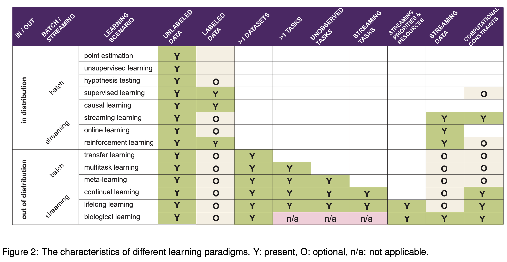

{:toc}

*See also notes on [📌 causal inference](https://csinva.io/notes/research_ovws/ovw_causal_inference.html) for some close connections.*

For neural-net specific transferring see [📌 adaption/transfer](https://csinva.io/notes/research_ovws/ovw_transformers.html#adaptation--transfer).

# overviews

 (from [this paper](https://arxiv.org/pdf/2109.14501v1.pdf))

# domain adaptation algorithms

*Domain test bed available [here](https://github.com/facebookresearch/DomainBed), for generalizating to new domains (i.e. performing well on domains that differ from previous seen data)*

- Empirical Risk Minimization (ERM, [Vapnik, 1998](https://www.wiley.com/en-fr/Statistical+Learning+Theory-p-9780471030034)) - standard training
- Invariant Risk Minimization (IRM, [Arjovsky et al., 2019](https://arxiv.org/abs/1907.02893)) - learns a feature representation such that the optimal linear classifier on top of that representation matches across domains.
- distributional robust optimization
  - instead of minimizing training err, minimize maximum training err over different perturbations
  - Group Distributionally Robust Optimization (GroupDRO, [Sagawa et al., 2020](https://arxiv.org/abs/1911.08731)) - ERM + increase importance of domains with larger errors (see also papers from Sugiyama group e.g. [1](http://papers.neurips.cc/paper/3019-mixture-regression-for-covariate-shift.pdf), [2](https://arxiv.org/abs/1611.02041))
    - minimize error for worst group
  - Variance Risk Extrapolation (VREx, [Krueger et al., 2020](https://arxiv.org/abs/2003.00688)) - encourages robustness over affine combinations of training risks, by encouraging strict equality between training risks
- Interdomain Mixup (Mixup, [Yan et al., 2020](https://arxiv.org/abs/2001.00677)) - ERM on linear interpolations of examples from random pairs of domains + their labels
- Marginal Transfer Learning (MTL, [Blanchard et al., 2011-2020](https://arxiv.org/abs/1711.07910)) - augment original feature space with feature vector marginal distributions and then treat as a supervised learning problem
- MAML ([finn, abbeel, & levine, 2017](http://proceedings.mlr.press/v70/finn17a/finn17a.pdf)) - minimize parameters for metalearning including finetuning as part of the process (intuitively, find parameters that improve performance on a task after finetuning on that task)
  - $\min _\theta \underbrace{\mathbb{E}_\tau }_{\text{average over tasks }  \tau}\left[\mathcal{L}_\tau\left(\underbrace{U_\tau(\theta)}_{\text{finetuned model}}\right)\right]$​
    - compute finetuned models then take gradient wrt to held-out samples from the same tasks
  - Meta Learning Domain Generalization (MLDG, [Li et al., 2017](https://arxiv.org/abs/1710.03463)) - use MAML to meta-learn how to generalize across domains

- learning more diverse predictors
  - Representation Self-Challenging (RSC, [Huang et al., 2020](https://arxiv.org/abs/2007.02454)) - adds dropout-like regularization to important features, forcing model to depend on many features
  - Spectral Decoupling (SD, [Pezeshki et al., 2020](https://arxiv.org/abs/2011.09468)) - regularization which forces model to learn more predictive features, even when only a few suffice
- embedding prior knowledge
  - Style Agnostic Networks (SagNet, [Nam et al., 2020](https://arxiv.org/abs/1910.11645)) - penalize style features (assumed to be spurious)
  - Penalizing explanations ([Rieger et al. 2020](https://arxiv.org/abs/1909.13584)) - penalize spurious features using prior knowledge
- Domain adaptation under structural causal models ([chen & buhlmann, 2020]((https://arxiv.org/abs/2010.15764)))
  - make clearer assumptions for domain adaptation to work
  - introduce CIRM, which works better when both covariates and labels are perturbed in target data
- kernel approach ([blanchard, lee & scott, 2011](https://papers.nips.cc/paper/2011/file/b571ecea16a9824023ee1af16897a582-Paper.pdf)) - find an appropriate RKHS and optimize a regularized empirical risk over the space
- In-N-Out ([xie...lang, 2020](https://arxiv.org/abs/2012.04550)) - if we have many features, rather than using them all as features, can use some as features and some as targets when we shift, to learn the domain shift

## domain invariance

*key idea: want repr. to be invariant to domain label*

- 
- same idea is used to [learn fair representations](https://www.cs.toronto.edu/~toni/Papers/icml-final.pdf), but domain label is replaced with sensitive attribute
- Domain Adversarial Neural Network (DANN, [Ganin et al., 2015](https://arxiv.org/abs/1505.07818))
- Conditional Domain Adversarial Neural Network (CDANN, [Li et al., 2018](https://arxiv.org/abs/1807.08479)) - variant of DANN matching the conditional distributions  across domains, for all labels 
- Deep CORAL (CORAL, [Sun and Saenko, 2016](https://arxiv.org/abs/1607.01719)) - match mean / covariance of feature distrs
- Maximum Mean Discrepancy (MMD, [Li et al., 2018](https://openaccess.thecvf.com/content_cvpr_2018/papers/Li_Domain_Generalization_With_CVPR_2018_paper.pdf))
- adversarial discriminative domain adaptation (ADDA [tzeng et al. 2017](https://arxiv.org/abs/1702.05464))
- balancing with [importance weighting](https://citeseerx.ist.psu.edu/viewdoc/download?doi=10.1.1.370.4921&rep=rep1&type=pdf)
- [Learning Robust Representations by Projecting Superficial Statistics Out](https://arxiv.org/abs/1903.06256) (wang et al. 2019)

## feature learning

- https://arxiv.org/pdf/2212.07346.pdf (zhang & bottou, 2022) - during training, concatenate the representations obtained with different random seeds

## dynamic selection

*Dynamic Selection (DS) refers to techniques in which, for a new test point, pre-trained classifiers are selected/combined from a pool at test time  [review paper](https://www.etsmtl.ca/Unites-de-recherche/LIVIA/Recherche-et-innovation/Publications/Publications-2017/RCruz_InfoFusion.pdf) (cruz et al. 2018), [python package](https://github.com/scikit-learn-contrib/DESlib)*

1. define region of competence
   1. clustering
   2. kNN - more refined than clustering
   3. decision space - e.g. a model's classification boundary, internal splits in a model
   4. potential function - weight all the points (e.g. by their distance to the query point)
2. criteria for selection
   1. individual scores: acc, prob. behavior, rank, meta-learning, complexity
   2. group: data handling, ambiguity, diversity
3. combination
   1. non-trainable: mean, majority vote, product, median, etc.
   2. trainable: learn the combination of models
      1. related: in mixture of experts models + combination are trained jointly
   3. dynamic weighting: combine using local competence of base classifiers
   4. Oracle baseline - selects classifier predicts correct label, if such a classifier exists 

## test-time adaptation

- test-time adaptation
  - test-time augmentation
  - batch normalization (AdaBN, [li...hou, 2016](https://arxiv.org/abs/1603.04779))
  - label shift estimation (BBSE, [lipton, wang, & smola, 2018](https://arxiv.org/abs/1802.03916)) - $p(y)$ shifts but $P(x|y)$ does not
  - entropy minimization (test-time entropy minimization, TENT, [wang...olshausen, darrel, 2020](https://arxiv.org/abs/2006.10726)) - optimize for model confidence (entropy of predictions), using only norm. statistics and channel-wise affine transformations
    - Test-Time Prompt Tuning for Zero-Shot Generalization in Vision-Language Models ([shu...anandkumar, xiao, 2022](https://arxiv.org/abs/2209.07511)) - optimize prompt to minimize the entropy with confidence selection so that the model has consistent predictions across different augmented views of each test sample
  - combining train-time and test-time adaptation: Adaptive Risk Minimization (ARM, [zhang et al., 2020](https://arxiv.org/abs/2007.02931)) - combines groups at training time + *batches at test-time*
    - *meta-train* the model using simulated distribution shifts, which is enabled by the training groups, such that it exhibits strong *post-adaptation* performance on each shift
- TTT: Test-Time Training with Self-Supervision for Generalization under Distribution Shifts ([sun...efros, hardt. 2020](https://arxiv.org/abs/1909.13231)) - at test-time, update parameters for self-supervised rotation prediction task then use for classification
  - TTT with masked autoencoders ([gandelsman, sun, ..., efros, 2022](https://arxiv.org/abs/2209.07522)) - use reconstructed with masked autoencoder and improve performance on robustness tasks
  - Test-Time Training on Video Streams ([wang, sun, ..., efros, wang, 2023](https://arxiv.org/abs/2307.05014)) - use masked autoencoder per-frame and incrementally update across each frame
  - M-TTT: Learning to (Learn at Test Time) ([sun, li, dalal, ...guestrin, 2024](https://arxiv.org/pdf/2407.04620))
  - analysis
    - TTT for Reading Comprehension ([banerjee et al. 2021](https://arxiv.org/abs/2103.11263)) - uses self-supervision to train models on synthetically generated question-answer pairs, and then infers answers to unseen human-authored questions for this context
    - TTT++: When Does Self-Supervised Test-Time Training Fail or Thrive? ([liu et al. 2021](https://proceedings.neurips.cc/paper/2021/hash/b618c3210e934362ac261db280128c22-Abstract.html)) - explore different test-time adaptation methods and combine Test-time feature alignment with Test-time contrastive learning
- Never Train from Scratch: Fair Comparison of Long-Sequence Models Requires Data-Driven Priors ([amos, berant, & gupta, 2024](https://arxiv.org/pdf/2310.02980)) - when transferring to a specific task, should first finetune the LM on the task before doing supervised finetuning

# adv attacks

- Adversarial Attacks and Defenses in Images, Graphs and Text: A Review ([xu et al. 2019](https://arxiv.org/abs/1909.08072)) 
- attacks
  - fast gradient step method - keep adding gradient to maximize noise (limit amplitude of pixel's channel to stay imperceptible)
  - Barrage of Random Transforms for Adversarially Robust Defense ([raff et al. 2019](http://openaccess.thecvf.com/content_CVPR_2019/papers/Raff_Barrage_of_Random_Transforms_for_Adversarially_Robust_Defense_CVPR_2019_paper.pdf)) 
  - DeepFool: a simple and accurate method to fool deep neural networks ([Moosavi-Dezfooli et. al 2016](https://arxiv.org/abs/1511.04599))
- defenses
  - Adversarial training -  training data is augmented with adv examples (Szegedy et al., 2014b; Madry et al., 2017; Tramer et al., 2017; Yu et al., 2019)
    - $$\min _{\boldsymbol{\theta}} \frac{1}{N} \sum_{n=1}^{N} \operatorname{Loss}\left(f_{\theta}\left(x_{n}\right), y_{n}\right)+\lambda\left[\max _{\|\delta\|_{\infty} \leq \epsilon} \operatorname{Loss}\left(f_{\theta}\left(x_{n}+\delta\right), y_{n}\right)\right]$$
    - this perspective differs from "robust statistics" which is usually robustness against some kind of model misspecification/assumptions, not to distr. shift
      - robust stat usually assumes a generative distr. as well
      - still often ends up with the same soln (e.g. ridge regr. corresponds to certain robusteness)
  - Stochasticity: certain inputs or hidden activations are shuffled or randomized (Xie et al., 2017; Prakash et al., 2018; Dhillon et al., 2018)
  - Preprocessing: inputs or hidden activations are quantized, projected into a different representation or are otherwise preprocessed (Guo et al., 2017; Buckman et al., 2018; Kabilan et al., 2018)
  - Manifold projections: an input sample is projected in a lower dimensional space in which the neural network has been trained to be particularly robust (Ilyas et al., 2017; Lamb et al., 2018)
  - Regularization in the loss function: an additional penalty term is added to the optimized objective function to upper bound or to approximate the adversarial loss (Hein and Andriushchenko, 2017; Yan et al., 2018)
  - constraint
    - robustness as a constraint not a loss ([Constrained Learning with Non-Convex Losses](https://arxiv.org/abs/2103.05134) (chamon et al. 2021))
      - $$\begin{aligned}
        \min _{\boldsymbol{\theta}} & \frac{1}{N} \sum_{n=1}^{N} \operatorname{Loss}\left(f_{\theta}\left(x_{n}\right), y_{n}\right) \\
        \text { subject to } & \frac{1}{N} \sum_{n=1}^{N}\left[\max _{\|\delta\|_{\infty} \leq \epsilon} \operatorname{Loss}\left(f_{\theta}\left(\boldsymbol{x}_{n}+\delta\right), y_{n}\right)\right] \leq c
        \end{aligned}$$
      - when penalty is convex, these 2 problems are the same
  - a possible defense against adversarial attacks is to solve the anticausal classification problem by modeling the causal generative direction, a method which in vision is referred to as *analysis by synthesis* ([Schott et al., 2019](https://arxiv.org/abs/1805.09190))
- robustness vs accuracy
  - [robustness may be at odds with accuracy](https://openreview.net/pdf?id=SyxAb30cY7) (tsipiras...madry, 2019)
  - [Precise Tradeoffs in Adversarial Training for Linear Regression](https://arxiv.org/abs/2002.10477) (javanmard et al. 2020) - linear regression with gaussian features
    - use adv. training formula above
  - [Theoretically Principled Trade-off between Robustness and Accuracy](https://arxiv.org/abs/1901.08573) (Zhang, ..., el ghaoui, Jordan, 2019)
- adversarial examples
  - [Decision Boundary Analysis of Adversarial Examples ](https://pdfs.semanticscholar.org/08c5/88465b7d801ad912ef3e9107fa511ea0e403.pdf)(He, Li, & Song 2019)
  - [Natural Adversarial Examples](https://arxiv.org/abs/1907.07174) (Hendrycks, Zhao, Basart, Steinhardt, & Song 2020)
  - [Image-Net-Trained CNNs Are Biased Towards Texture](https://openreview.net/pdf?id=Bygh9j09KX) (Geirhos et al. 2019)
- adversarial transferability
  - [Transferability in Machine Learning: from Phenomena to Black-Box Attacks using Adversarial Samples](https://arxiv.org/abs/1605.07277) (papernot, mcdaniel, & goodfellow, 2016)
  - [Ensemble Adversarial Training: Attacks and Defenses](https://arxiv.org/pdf/1705.07204.pdf) (tramer et al. 2018)
  - [Improving Adversarial Robustness via Promoting Ensemble Diversity](https://arxiv.org/pdf/1901.08846.pdf) (pang et al. 2019)
    - encourage diversity in non-maximal predictions
- robustness
  - smoothness yields robustness (but can be robust without smoothness)
  - margin idea - data points close to the boundary are not robust
    - we want our boundary to go through regions where data is scarce
