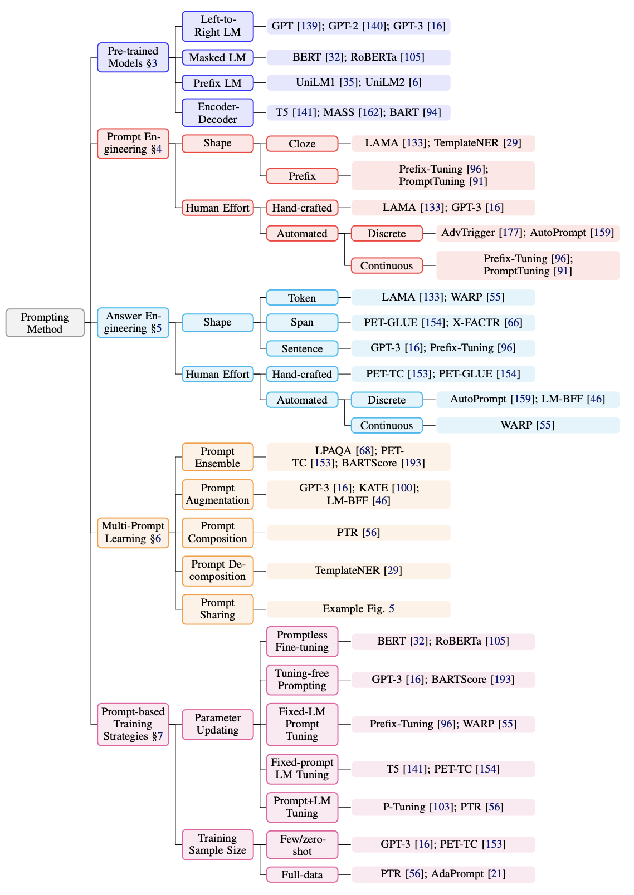
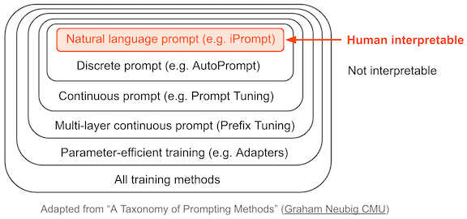
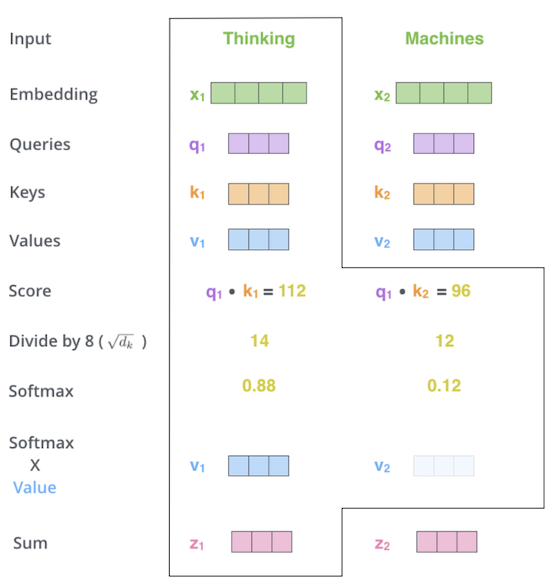

{:toc}

# papers

See related papers in the [📌 interpretability](https://csinva.io/notes/research_ovws/ovw_interp.html) page.

## high-performing

**nlp** (see also [this link](https://medium.com/nlplanet/a-brief-timeline-of-nlp-from-bag-of-words-to-the-transformer-family-7caad8bbba56))

- early papers
  - attention is all you need ([vaswani et al. 2017](https://arxiv.org/abs/1706.03762)) - initial transformer
    - encoder-decoder transformer for seq-to-seq (most new models don't have  special encoder-decoder structure for translation)
    - Semi-supervised Sequence Learning ([dai & quoc le, 2015](https://arxiv.org/abs/1511.01432))
      - context vector is weighted sum of context vector at each word
  - [ULMFiT](https://arxiv.org/abs/1801.06146) (howard & ruder, 2018)
- BERT ([devlin et al. 2018](https://arxiv.org/abs/1810.04805)) - semi-supervised learning (predict masked word - this is bidirectional) + supervised finetuning
  - [roberta](https://arxiv.org/abs/1907.11692) (liu et al. 2019)
  - [BART](https://arxiv.org/abs/1910.13461) (lewis et al. 2019) - generalizes BERT with sequence-to-squence training: train by (1) corrupting text then (2) reconstruct the original text
  - [ELMo](https://arxiv.org/abs/1802.05365) (peters...zettlemoyer, 2018) - no word embeddings - train embeddings w/ bidirectional lstm (on language modeling)
  - XLNet ([yang...quoc le, 2020](https://arxiv.org/abs/1906.08237))
- GPT-4 (openai, 2023) - adds multimodal understanding + boosts context length to 32k
  - GPT-3 ([brown et al. 2020](https://arxiv.org/abs/2005.14165?2)) - identitical to GPT-2 except larger and replaces dense attention with sparse attention
    - sizes: largest has 175B params, 96 layers, 96 heads in each layer, head with dim 128, vocab size ~50k
  - InstructGPT ([ouyang...lowe, 2022](https://arxiv.org/abs/2203.02155))
  - GPT-2 ([radford et al. 2018](https://d4mucfpksywv.cloudfront.net/better-language-models/language_models_are_unsupervised_multitask_learners.pdf))
  - GPT ([radford et al. 2018](https://s3-us-west-2.amazonaws.com/openai-assets/research-covers/language-unsupervised/language_understanding_paper.pdf))
  - Gopher ([deepmind, 2021](https://arxiv.org/abs/2112.11446)) - basically gpt-3 with slight mods (replace layernorm by RMSnorm, different positional embeddings)
  - open-source (from meta ai): [LlaMa 2](https://ai.meta.com/research/publications/llama-2-open-foundation-and-fine-tuned-chat-models/), [LLaMa](https://scontent-sea1-1.xx.fbcdn.net/v/t39.8562-6/333078981_693988129081760_4712707815225756708_n.pdf?_nc_cat=108&ccb=1-7&_nc_sid=ad8a9d&_nc_ohc=0JlbsRuMCfYAX89GkW5&_nc_ht=scontent-sea1-1.xx&oh=00_AfAKI4SBnQesKWtXsUVxzF9w_IT_qOgOTTKNpeZRptOBuw&oe=63FDD562), [OPT-IML](https://arxiv.org/abs/2212.12017), [OPT](https://arxiv.org/abs/2205.01068)
    - [GPT4All](https://s3.amazonaws.com/static.nomic.ai/gpt4all/2023_GPT4All_Technical_Report.pdf) (LLaMA 7B finetuned on code/stories/dialogue)

- ELECTRA: Pre-training Text Encoders as Discriminators Rather Than Generators ([clark...quoc le, chris manning, 2020](https://arxiv.org/abs/2003.10555))

  - more efficient: rather than standard masked training, use generator-discriminator setup for "token detection"
    - generator replaces many masked tokens with plausible samples - train with MLM
    - discriminator tries to guess which tokens were the masked ones - this is the main model that gets used

- LongNet: Scaling Transformers to 1,000,000,000 Tokens ([ding, ..., wei, 2023](https://arxiv.org/abs/2307.02486)) - multiscale attention similar to wavelets
  - Longformer: The Long-Document Transformer ([Beltagy, Peters, & Cohan 2020](https://arxiv.org/abs/2004.05150)) - processes very long contexts
  - Lost in the Middle: How Language Models Use Long Contexts ([liu...petroni, liang, 2023](https://arxiv.org/abs/2307.03172))
- PaLM: Scaling Language Modeling with Pathways ([Google 2022](https://arxiv.org/abs/2204.02311)) - 540 Billion params
  - pathways hardware center allows for fast/efficient training
  - discontinuous improvements - at some point large model improves
  - prompt engineering: "Explain yourself" - lets it explain jokes
  - Chinchilla: Training Compute-Optimal Large Language Models ([DeepMind 2022](https://arxiv.org/abs/2203.15556))
    - "chinchilla scaling laws" - for compute-optimal training, the model size and the number of training tokens should be scaled equally

- T0 ([sanh...rush, 2022](https://arxiv.org/pdf/2110.08207.pdf)) - multitask training enables better zero-shot generalization
  - T5 ([raffel...liu, 2020](https://jmlr.org/papers/volume21/20-074/20-074.pdf)) -- text-to-text transfer transformer
  - UL2: Unifying Language Learning Paradigms ([tay...metzler, 2022](https://arxiv.org/abs/2205.05131)) - open-source 20B model, beats GPT-3 at zero-shot

- more effective training

  - instruction following

    - FLAN-PaLM: Scaling Instruction-Finetuned Language Models ([chung, ..., quoc le, jason wei, 2022](https://arxiv.org/abs/2210.11416)) - finetune with datasets phrased as instructions
      - FLAN ([wei, ..., le, 2021](https://arxiv.org/abs/2109.01652)) - finetune on instructions to follows instructions

  - human feedback
    - Learning to summarize with human feedback ([OpenAI, 2020](https://proceedings.neurips.cc/paper/2020/hash/1f89885d556929e98d3ef9b86448f951-Abstract.html))
    - Can language models learn from explanations in context? ([lampinen et al. 2022](https://arxiv.org/abs/2204.02329))
    - natural language feedback ([scheurer et al. 2022](https://arxiv.org/abs/2204.14146)) - makes training more efficient
      - Training Language Models with Language Feedback at Scale ([scheurer et al. 2023](https://arxiv.org/pdf/2303.16755.pdf))
    - Explanation-based Finetuning Makes Models More Robust to Spurious Cues ([ludan...callison-burch, 2023](https://arxiv.org/abs/2305.04990))
      - Post hoc explanations of language models can improve language models ([krishna...singh, lakkaraju, 2023](https://arxiv.org/abs/2305.11426)) - use rationales as corrective signals for LLMs
    - RLAIF: Scaling Reinforcement Learning from Human Feedback with AI Feedback ([lee...rastogi, 2023](https://arxiv.org/abs/2309.00267))

**other**

- text-vision models
  - CLIP ([radford et al. 2021](https://cdn.openai.com/papers/Learning_Transferable_Visual_Models_From_Natural_Language.pdf)) - jointly train text/images
    - batch-based loss: encodings from same image/text pair should be close while encodings across different examples in the batch should be different
    - note: empirically works better with very large batch size
  - DALL-E 2 ([OpenAI, 2022](https://openai.com/dall-e-2/))
    - clip is foundation as generative model
    - generates text + image embeddings
    - "prior network" maps text embedding to image embedding
    - adds diffusion model
    - Stable diffusion ([stability.ai, 2022](https://stability.ai/blog/stable-diffusion-public-release)) - open-source recreation, now highly optimized for speed
    - Imagen ([google, 2022](https://arxiv.org/abs/2205.11487))
  - BLIP-2 ([salesforce, 2023](https://arxiv.org/abs/2301.12597)) - Bootstrapping Language-Image Pre-training with Frozen Image Encoders and Large Language Models  
    - BEiT-3 ([2022](https://arxiv.org/abs/2208.10442)) - treat vision as language and large-scale multimodal training
    - outperforms [Flamingo: a Visual Language Model for Few-Shot Learning](https://arxiv.org/abs/2204.14198) (2022), which uses more domain knowledge to connect vision & language
  - video
    - Text-To-4D Dynamic Scene Generation ([meta, 2023](https://arxiv.org/abs/2301.11280v1))

- vision
  - VIT: An Image is Worth 16x16 Words: Transformers for Image Recognition at Scale ([dosoviskiy, ..., houlsby, 2020](https://arxiv.org/abs/2010.11929))
    - [attention augmentation to resnet](https://arxiv.org/abs/1904.09925) for vision (bello...quoc le, 2020)
    - here, people call image patches "tokens"
  - DINO [Emerging Properties in Self-Supervised Vision Transformers](https://arxiv.org/abs/2104.14294) (caron...joulin, 2021)
  - Masked Autoencoders Are Scalable Vision Learners ([he...dollar, girshick, 2021](https://arxiv.org/abs/2111.06377)) - BERT-style training
    -  speed up by not applying encoder to mask tokens + adding mask to a lot of the data (like 75%)
    -  really good results without much data
  - spatial transformers networks ([deepmind, 2015](https://papers.nips.cc/paper/5854-spatial-transformer-networks.pdf ))

- rl
  - AdA: Human-Timescale Adaptation in an Open-Ended Task Space ([deepmind, 2023](https://arxiv.org/abs/2301.07608))
  - GATO: [A Generalist Agent](https://arxiv.org/abs/2205.06175) (deepmind, 2022) - single agent plays many different video games
    - different modalities are converted to tokens differently (e.g. image patches are fed through resnet)
  - In-context Reinforcement Learning with Algorithm Distillation ([laskin, wang, ..., sahni, satinder singh, mnih, 2022, deepmind](https://arxiv.org/abs/2210.14215)) - learn to improve an RL algorithm
    - put history of (observation, action, reward) sequences into context and then use them to predict new action given new observation
  - Decision Transformer: Reinforcement Learning via Sequence Modeling ([chen, lu, ...abbeel, srinivas, mordatch, 2021](https://arxiv.org/pdf/2106.01345.pdf)) - transformer that predicts what the next highest reward step is instead of the next word

- question-answering (now just done with generic LLMs)

  - [UnifiedQA: Crossing Format Boundaries With a Single QA System](https://arxiv.org/abs/2005.00700) (khashabi...hajishirzi, 2020)

- dialog
  - ChatGPT
  - [GODEL: Large-Scale Pre-Training for Goal-Directed Dialog](https://arxiv.org/abs/2206.11309) (baolin peng, galley, ..., gao , 2022) - add grounded pre-training
  - [Deal or No Deal? End-to-End Learning for Negotiation Dialogues](https://arxiv.org/abs/1706.05125) (lewis...batra, 2017, Meta) - controversial paper where agents "make up their own language"
    - this is pre-transformers

- [MINERVA: Solving Quantitative Reasoning Problems with Language Models](https://arxiv.org/abs/2206.14858) (google, 2022) - train on well-parsed, domain-specific data (math arxiv) to solve math-reasoning problems

  - autoformalization ([wu..., szegedy, 2022](https://arxiv.org/abs/2205.12615)) - translating from natural language math to formal language
  - produce sql/python that then finds an answer ([cheng...zettlemoyer, smith, yu, 2022](https://arxiv.org/abs/2210.02875))

- CODEX: [Evaluating Large Language Models Trained on Code](https://arxiv.org/abs/2107.03374) (2021, openai)
  - Repair Is Nearly Generation: Multilingual Program Repair with LLMs ([Joshi et al. 2022](https://arxiv.org/abs/2208.11640))
  - Improving automatically generated code from Codex via Automated Program Repair ([Fan et al. 2022](https://arxiv.org/abs/2205.10583)) - use automated program repair to tweak codex outputs to make them better
  - Generating Question Titles for Stack Overflow from Mined Code Snippets ([Gao et al. 2020](https://dl.acm.org/doi/abs/10.1145/3401026?casa_token=FEWYSo9ZmNIAAAAA:-_ZIkXQVUR3xYaB3NtrzBv0jZU6IZ6O4f_W_ZDtb6TipLBV4YHB-0lbO1JU8T9wwIl_jLBS3ts0))
  - Automatic Program Repair with OpenAI's Codex: Evaluating QuixBugs ([Prenner & Robbes, 2021](https://arxiv.org/abs/2111.03922))
    - use prompt like:
      ```python
      ### fix the bug in the following function
      <buggy function and/or docstring here>
      ### fixed function
      ```
    
  - program synthesis [arxiv.org/abs/2108.07732](https://arxiv.org/abs/2108.07732) - formalize natural language into runnable code

- science

  - Galactica: A Large Language Model for Science ([taylor..., stojnic, 2022, meta ai](https://galactica.org/static/paper.pdf)) - trained on mostly papers + some knowledge bases (e.g. proteins)
    - Nougat: Neural Optical Understanding for Academic Documents ([blecher…scialom, sojnic, 2023](https://arxiv.org/abs/2308.13418))

- music
  - MusicLM: Generating Music From Text ([google, 2023](https://arxiv.org/abs/2301.11325))
  - Jukebox: A Generative Model for Music ([openai, 2020](https://arxiv.org/abs/2005.00341))

- summarization / keywords

  - KeyBERT: Minimal keyword extraction with BERT ([grootendorst, 2020](https://github.com/MaartenGr/KeyBERT))

- text-to-speech

  - Voicebox: Text-Guided Multilingual Universal Speech Generation at Scale ([meta, 2023](https://research.facebook.com/publications/voicebox-text-guided-multilingual-universal-speech-generation-at-scale/))

## external knowledge / tool use / grounding

- private
  - https://www.perplexity.ai/ - nice demo adding citation to each fact
  - https://you.com
  - [langchain](https://github.com/hwchase17/langchain) library
  - https://www.fixie.ai/ - provide tools for wrapping APIs in LLM + interaction through router (also default modules for stateful storage, user identity, etc.)
- review
  - Augmented Language Models: a Survey ([meta, 2023](https://arxiv.org/abs/2302.07842)) -- 3 categories: reasoning, tools, action
- Demonstrate-Search-Predict: Composing retrieval and language models for knowledge-intensive NLP ([khattab, ..., liang, potts, & zaharia, 2022](https://arxiv.org/abs/2212.14024)) - use high-level programs to use multiple steps between retrieving and reading
- Toolformer: Language Models Can Teach Themselves to Use Tools ([meta, 2023](https://arxiv.org/abs/2302.04761)) - model trained to decide which APIs to call, when to call them, what arguments to pass, and how to best incorporate the results into future token prediction
  - Given input, sample position and API call candidates, try them all, and filter out ones which do not reduce next-token loss
    - put correct API calls into prompt, e.g. Pittsburgh is also known as `[QA(What ...?→ Steel City)]` the Steel City.

  - Training
    - start with few human-written examples of API use
    - LLM generates more uses
    - self-supervised loss determines which calls help with future-token prediction

  - Atlas: Few-shot Learning with Retrieval Augmented Language Models ([meta, 2022](https://arxiv.org/abs/2208.03299))
- retreival-augmented in-context learning (put retrieved info into context, or something very similar)
  - REALM ([guu, ..., chang, 2020](https://arxiv.org/abs/2002.08909)) - retrieves document chunks from corpus and adds them to context, for open-domain QA
  - RETRO ([deepmind, 2022](https://arxiv.org/abs/2112.04426)) - nearest neighbors to model's input are retrieved, encoded, and conditioned on with chunked cross-attention 
  - Decomposed prompting ([khot et al., 2022](https://arxiv.org/pdf/2210.02406.pdf)) - decompose tasks via prompting which are delegated to a shared library of prompting-based LLMs dedicated to these sub-tasks
  - LLM-Augmenter ([peng, galley...gao, 2023](https://arxiv.org/abs/2302.12813)) -  (1) consolidates evidence from external knowledge for the LLM to generate responses grounded in evidence, and (2) revising LLM’s (candidate) responses using automated feedback
  - Knowledgeable Prompt-tuning ([Hu et al. 2021](https://arxiv.org/abs/2108.02035)) -- add knowledge-base info into the prompt search
- knowledge base triplets
  - Relational Memory-Augmented Language Models ([liu, yogatama, & blunsom, 2022](https://direct.mit.edu/tacl/article/doi/10.1162/tacl_a_00476/110997/Relational-Memory-Augmented-Language-Models)) - integrate knowledge base triplets with LLM
  - DRAGON: Deep Bidirectional Language-Knowledge Graph Pretraining ([yasanaga, ..., manning, liang, leskovec, 2022](https://arxiv.org/abs/2210.09338))
- webgpt ([nakano, ..., schulman, 2022, OpenAI](https://arxiv.org/abs/2112.09332)) - allows google search to add world info
  - Internet-augmented language models [Lazaridou et al., 2022](https://arxiv.org/pdf/2203.05115.pdf)
  - GopherCite ([menick, ..., mcaleese, 2022, Deepmind](https://arxiv.org/abs/2203.11147)) - generate answers + link/relevant snippet when making predictions (trained with RL from human preferences )
  - LaMDA ([thoppilan, ..., quoc le, 2022, google](https://arxiv.org/abs/2201.08239)) - allows google search to add world info (in a dialog model)
    - this was the model that sparked the controversy about consciousness 🤔
    - A Neural Corpus Indexer for Document Retrieval ([wang...yang, 2022](https://arxiv.org/abs/2206.02743)) - train model to directly spit out document IDs given queries
- RLPG ([shrivastava, larochelle, & tarlow, 2022](https://arxiv.org/abs/2206.12839)) - for code-completion, retrieves functions from a repo
- memorizing transformers ([wu...szegedy, 2022](https://arxiv.org/abs/2203.08913)) - knn-based learned indexing + retrieval at training time
  - at test time, you just need to index the entire context and the model will be able to use it
  - kNN Prompting: Learning Beyond the Context with Nearest Neighbor Inference ([xu...zhang, 2023](https://openreview.net/forum?id=fe2S7736sNS)) - instead of verbalizer, use nearest-neighbor
    - has dbpedia results
  - kNN-Prompt: Nearest Neighbor Zero-Shot Inference ([shi...zettlemoyer, 2022](https://arxiv.org/pdf/2205.13792.pdf))
- self-verification
  - Self-Refine: Iterative Refinement with Self-Feedback ([madaan, ..., clark, 2023](https://arxiv.org/abs/2303.17651))
  - Self-Verification Improves Few-Shot Clinical Information Extraction ([gero et al. 2023](https://arxiv.org/abs/2306.00024))
  - SelfCheckGPT: Zero-Resource Black-Box Hallucination Detection for Generative Large Language Models ([manakul...gales, 2023](https://arxiv.org/abs/2303.08896))
- ACT-1: Transformer for Actions ([2022, Adept](https://www.adept.ai/act)) - transformer directly interacts with computer
- ReAct: Synergizing Reasoning and Acting in Language Models ([yao...cao, 2022](https://arxiv.org/abs/2210.03629)) - use LLMs to generate reasoning traces + task-specific actions in interleaved manner

# prompting

- https://github.com/dair-ai/Prompt-Engineering-Guide
- Pre-train, Prompt, and Predict: A Systematic Survey of Prompting Methods in Natural Language Processing ([liu...neubig, 2021](https://arxiv.org/pdf/2107.13586.pdf))
  - from *feature-engineering* -> *architecture engineering* -> *prompt engineering*
  - 
- early prompting papers
  - LAMA [Language Models as Knowledge Bases?](https://arxiv.org/abs/1909.01066) (petroni...riedel, 2019) - Proposes using fill-in-the-blank (cloze) prompts for extracting knowledge from large language models
    - create LAMA probe - dataset of (subject, relation, object) triplets with templates -- find that BERT can recall these relations
    - [How to Query Language Models?](https://arxiv.org/abs/2108.01928) (adolphs et al. 2021) - query LLMs by example (e.g. "Ronaldo plays for Portugal. Who does Neuer play for?")
    - [How Can We Know What Language Models Know?](https://arxiv.org/abs/1911.12543) (jiang ... neubig, 2020)
      - mining-based and paraphrasing-based methods to automatically generate high-quality diverse prompts
      - ensemble methods to combine answers from different prompts (e.g. avg logits and more)

    - Noisy Channel Language Model Prompting for Few-Shot Text Classification ([min et al. 2022](https://arxiv.org/pdf/2108.04106.pdf))
    - Querying $P(question|answer)$ with Bayes rule outperforms standard querying $P(answer|question)$


## (auto)prompting



- natural-language prompting
  - iPrompt: Explaining Patterns in Data with Language Models via Interpretable Autoprompting ([singh, morris, ...gao, 2022](https://arxiv.org/abs/2210.01848))
  - APE: Large Language Models Are Human-Level Prompt Engineers ([zhou...ba, 2022](https://arxiv.org/abs/2211.01910))
    - similar to iPrompt, (1) propose prompt candidates with an LLM, (2) score the prompts by the accuracy they yield when using another LLM and (3) regenerate similar prompt candidates
    - experiments on instruction induction datasets + truthful QA
  - FluentPrompt: Toward Human Readable Prompt Tuning ([shi, ..., zettlemoyer, 2022](https://arxiv.org/abs/2212.10539)) - use langevin sampling + fluency constraint to generate prompt
    - experiments relatively weak: 3 sentiment datasets + autoprompt is the only baseline
  - APO: Automatic Prompt Optimization with “Gradient Descent” and Beam Search ([pryzant...zeng, 2023](https://arxiv.org/pdf/2305.03495.pdf)) - update prompts based on errors made by previous prompts
  - OPRO: Large Language Models as Optimizers ([yang...quoc le, zhou, & chen , 2023](https://arxiv.org/abs/2309.03409)) - add in past prompts with their scores during optimization
  - Promptbreeder: Self-Referential Self-Improvement Via Prompt Evolution ([fernando...rocktaschel, 2023](https://arxiv.org/abs/2309.16797)) - simultaneously improve prompts with LLM + improve the *mutation-prompts* the LLM uses to mutate the prompts
  - Connecting Large Language Models with Evolutionary Algorithms Yields Powerful Prompt Optimizers ([guo...yang, 2023](https://arxiv.org/abs/2309.08532))
  - Language Models as Black-Box Optimizers for Vision-Language Models ([yu...pathak, & ramanan, 2023](https://arxiv.org/pdf/2309.05950v1.pdf))
- discrete prompting
  - AutoPrompt: Eliciting Knowledge from Language Models with Automatically Generated Prompts ([shin...sameer singh, 2020](https://aclanthology.org/2020.emnlp-main.346/))
    - select prompts from a fixed set of tokens (resulting prompts are not coherent)
    - only work on MLM
    - elicit sentiment / factual knowledge
    - [Universal Adversarial Triggers for Attacking and Analyzing NLP](https://arxiv.org/abs/1908.07125) (wallace...sameer singh, 2019) - find input-agnostic sequences of tokens that trigger a model to produce a specific prediction when concatenated to any input from a dataset
  - [RLPrompt: Optimizing Discrete Text Prompts with Reinforcement Learning](https://arxiv.org/abs/2205.12548) (deng...hu, 2022)
  - LM-BFF: Making Pre-trained Language Models Better Few-shot Learners ([gao et al. 2020](https://arxiv.org/abs/2012.15723)) - uses T5 to generate (i) template for the task (which might include a whole example or two) + (i) appropropriate label tokens in the vocabulary for the task (suffers from computationally intensive search + sub-optimal discrete space search)
  - [PADA: Example-based Prompt Learning for on-the-fly Adaptation to Unseen Domains](https://arxiv.org/abs/2102.12206) (ben-david, ..., reichart, 2022)
- continuous prompt optimization
  - Prefix-Tuning: Optimizing Continuous Prompts for Generation ([li & percy liang, 2021](https://arxiv.org/abs/2101.00190)) -- optimizes in continuous space for language generation tasks
    - learn to map some parameters $\theta$ through and MLP to generate a starting hidden state $h_i$ -- never actually sends the prefix through the network 

  - P-Tuning: GPT Understands, Too ([liu et al. 2021](https://arxiv.org/abs/2103.10385)) -- use LSTM to generate prompt embeddings (don't map to tokens)
  - Control Prefixes for Parameter-Efficient Text Generation ([clive, cao, & rei, 2022](https://arxiv.org/abs/2110.08329)) - allow for adapting the prefix to each input example

    - DART: Differentiable Prompt Makes Pre-trained Language Models Better Few-shot Learners ([zhang...chen, 2022](https://arxiv.org/abs/2108.13161))
      - reformulating NLP task into differentially optimizing the prompt template + target label (given a pre-trained model)
      - focus on smaller models (Roberta-large + GPT-2) + few training shots
      - fluency constraint to ensure association among prompt embeddings

  - WARP: Word-level Adversarial ReProgramming ([Hambardzumyan et al. 2021](https://arxiv.org/abs/2101.00121)) - add continous tokens + some task-specific parameters for better generalization
  - KnowPrompt: Knowledge-aware Prompt-tuning with Synergistic Optimization for Relation Extraction ([Chen et al. 2021](https://arxiv.org/abs/2104.07650)) -- incorporate relations, visualize learned prompt vectors with t-SNE

- critiques of prompting
  - Do Prompt-Based Models Really Understand the Meaning of their Prompts? ([webson & pavlick, 2022](https://arxiv.org/abs/2109.01247)) - models can learn fine with prompts that are intentionally irrelevant
    - Are Language Models Worse than Humans at Following Prompts? It's Complicated ([webson, ..., pavlick, 2023](https://arxiv.org/abs/2301.07085))
  - Fantastically ordered prompts and where to find them: Overcoming few-shot prompt order sensitivity ([lu...riedel, stenetorp, 2021](https://arxiv.org/abs/2104.08786))
- misc

  - Context-faithful Prompting for Large Language Models ([zhou, shang, poon & chen, 2023](https://arxiv.org/pdf/2303.11315.pdf)) - ask question in clever way to force LLM to follow it
  - SentiPrompt: Sentiment Knowledge Enhanced Prompt-Tuning for Aspect-Based Sentiment Analysis ([Zhang et al. 2021](https://arxiv.org/abs/2109.08306)) -- use sentiment knowledge penalties in the prompt
  - Meta-learning via Language Model In-context Tuning ([Chen et al. 2022](https://arxiv.org/abs/2110.07814)) -- Given new task with new instruction
  - Prompt Programming for Large Language Models: Beyond the Few-Shot Paradigm ([Reynolds & McDonell, 2021](https://arxiv.org/abs/2102.07350)) -- define metaprompts as general wrappers around tasks e.g. “This problem asks us to”
  - Re3: Generating Longer Stories With Recursive Reprompting and Revision ([Yang et al. 2022](https://arxiv.org/abs/2210.06774)) - generate summaries, then expand and revise with prompts

  - Directional Stimulus Prompting ([li, baoling peng, ...jianfeng gao, xifeng yan, 2023](https://arxiv.org/abs/2302.11520)) - generate hint keywords using small LLM that are put into the prompt when calling large LLM

  - [memory-assisted prompt-editing](https://arxiv.org/abs/2201.06009) (madaan...yang, 2022) - allows model to "save things to memory" that get added to prompt when needed

  - Prompting Is Programming: A Query Language For Large Language Models ([Beurer-Kellner, Fischer, & Vechev, 2022](https://arxiv.org/abs/2212.06094))
- can benefit from training for promptability
  - Adapting Language Models for Zero-shot Learning by Meta-tuning on Dataset and Prompt Collections ([zhong...klein, 2021](https://arxiv.org/abs/2104.04670))
  - Continued Pretraining for Better Zero- and Few-Shot Promptability ([wu...sameer singh, beltagy, 2022](https://arxiv.org/abs/2210.10258))


## llm chaining / decoding

**many notes are from this [thread](https://twitter.com/iraphas13/status/1551959289023016967) on chaining models together**

- overviews
  - Ai chains: Transparent and controllable human-ai interaction by chaining large language model prompts ([wu, terry, & cai, 2022](https://dl.acm.org/doi/abs/10.1145/3491102.3517582)) - chaining LLM steps together: output of one step becomes the input for the next
    - interactive system where users can modify chains + their intermediate results -- improves performance + human experience
  - [Language Model Cascades](https://arxiv.org/abs/2207.10342) (dohan...sutton, 2022) - treat chaining models as probabilistic programs
    - use a probabilistic-programming language (PPL) to define a joint probability model on string-valued random variables, parameterized using LMs, and then condition this model on string-valued observations in order to compute a posterior over string-valued unknowns
    - self-PPLs extend probabilistic graphical models to support more complex joint distributions whose size and “shape” can itself be stochastic
      - e.g., a graph unrolled for a random number of iterations, until a data-dependent stopping criterion is met
      - variables are all text: questions $Q$, answers $A$, and intermediate thoughts $T$

- posthoc

  - 2023

    - Faithful Chain-of-Thought Reasoning ([yu et al. 2023](https://arxiv.org/abs/2301.13379))

    - Program of Thoughts Prompting: Disentangling Computation from Reasoning for Numerical Reasoning Tasks ([chen et al. 2022](https://arxiv.org/abs/2211.12588))

      PAL: Program-aided Language Models ([gao...neubig, 2023](https://arxiv.org/abs/2211.10435))

    - Language Models Don't Always Say What They Think: Unfaithful Explanations in Chain-of-Thought Prompting ([turpin, ..., bowman, 2023](https://arxiv.org/abs/2305.04388))

      - CoT explanations can be heavily influenced by biasing the model towards certain answers, thereby yielding invalid explanations
      - try biasing in 2 ways: answer is always (A), or setting where prompt suggests a certain answer

    - faithfulness metric = model sensitivity to removing some of the explanation

      - Question Decomposition Improves the Faithfulness of Model-Generated Reasoning ([anthropic, 2023](https://www-files.anthropic.com/production/files/question-decomposition-improves-the-faithfulness-of-model-generated-reasoning.pdf)) - introduce factored decomposition to improve faithfulness metric
      - Measuring Faithfulness in Chain-of-Thought Reasoning ([anthropic, 2023](https://www-files.anthropic.com/production/files/measuring-faithfulness-in-chain-of-thought-reasoning.pdf)) - in addition to just removing some of the explanation, also add mistakes to it / paraphrase it
        - larger models become less faithful by this metric

    - Do Models Explain Themselves? Counterfactual Simulatability of Natural Language Explanations ([chen, zhong, ..., steinhardt, yu, mckeown, 2023](https://arxiv.org/abs/2307.08678))

      - Logical Satisfiability of Counterfactuals for Faithful Explanations in NLI ([sia...zettlemoyer, mathias, 2023](https://ojs.aaai.org/index.php/AAAI/article/view/26174))

    - Faithful Explanations of Black-box NLP Models Using LLM-generated Counterfactuals ([gat…reichart, 2023](https://arxiv.org/abs/2310.00603))

    - Causal Proxy Models for Concept-based Model Explanations ([wu...potts, 2023](https://proceedings.mlr.press/v202/wu23b.html))

    - Two Failures of Self-Consistency in the Multi-Step Reasoning of LLMs ([chen, ..., bowman, cho, 2023](https://arxiv.org/abs/2305.14279)) - models fail at these 2 tasks:
  
      - hypothetical consistency (the ability for a model to predict what its output would be in a hypothetical other context)
      - compositional consistency (consistency of a model's outputs for a compositional task even when an intermediate step is replaced with the model's output for that step)
  
    - Are Large Language Models Post Hoc Explainers? ([kroeger...lakkaraju, 2023](https://arxiv.org/abs/2310.05797))
  
  - Chain of Thought Prompting ([wei et al. 2022](https://arxiv.org/abs/2201.11903))
    - in few-shot prompts, don't just provide answer but also reasoning
    - model output then provides reasoning + answer
    - Self-Consistency Improves Chain of Thought Reasoning in Language Models ([wang, wei, schuurmans, quoc le, ... zhou, 2022](https://arxiv.org/abs/2203.11171)) - use output samples rather than greedy and return the most consistent final answer in the set
    - Challenging BIG-Bench Tasks and Whether Chain-of-Thought Can Solve Them ([suzgun, ..., quoc le, ..., jason wei, 2022](https://arxiv.org/abs/2210.09261))
    - *self-ask* ([Press et al., 2022](https://arxiv.org/pdf/2210.03350.pdf)) - LLM asks itself (and then answers) follow-up questions before answering the initial question
    - Text Classification via Large Language Models ([sun...wang, 2023](https://arxiv.org/pdf/2305.08377.pdf)) - add clues to the prompt
    - Let's Do a Thought Experiment: Using Counterfactuals to Improve Moral Reasoning ([ma, …, chen, 2023](https://arxiv.org/abs/2306.14308)) - counterfactuals help improve CoT
    - RCOT: Detecting and Rectifying Factual Inconsistency in Reasoning by Reversing Chain-of-Thought ([xue et al. 2023]())
    - SelfCheck: Using LLMs to Zero-Shot Check Their Own Step-by-Step Reasoning ([miao, teh, & rainforth, 2023](https://arxiv.org/abs/2308.00436))
    - EchoPrompt: Instructing the Model to Rephrase Queries for Improved In-context Learning ([mekala...sameer singh, 2023](https://arxiv.org/pdf/2309.10687.pdf)) - replace *let's think step by step* with *Let's repeat the question and also think step by step*
    
  - scratchpads [Show Your Work: Scratchpads for Intermediate Computation with Language Models](https://arxiv.org/abs/2112.00114) (nye et al. 2021)
  
  - selection inference ([creswell et al. 2022](https://arxiv.org/abs/2205.09712)) - generate set of facts, then iteratively generate inferences from the facts to yield the final answer
  
  - least-to-most prompting ([zhou...quoc le et al. 2022](https://arxiv.org/abs/2205.10625)) - prompt LLM with context showing how to reduce into subproblems; then LLM sequentially solves the subproblems, using the previous answers
  
  - Generated Knowledge Prompting for Commonsense Reasoning ([liu...hasjishirzi, 2021](https://arxiv.org/abs/2110.08387)) - generate knowledge from an LLM then provide it as additional input when answering a question
  
  - maieutic prompting ([jung et al. 2022](https://arxiv.org/abs/2205.11822)) - generate a tree of all explanation of the form "True, because...", "False, because..." then query LLM with these as prompts
    - then use Max-SAT to try to satisfy as many relations between the model explanations as possible to come up with the true answer


  - review on self-verification ([pan...wang, 2023](https://arxiv.org/pdf/2308.03188.pdf))

      - LM vs LM: Detecting Factual Errors via Cross Examination ([cohen et al. 2023](https://arxiv.org/abs/2305.13281))
        - [Thread](https://twitter.com/ChengleiSi/status/1664023767373299715) of papers combating hallucination
  - training
    - verifiers ([cobbe et al. 2021](https://arxiv.org/abs/2110.14168)) - train model to judge whether an answer and thought are likely to be “valid”
    - subgoal search ([czechowski et al. 2021](https://t.co/PCR4yexHti)) - train model to generate subgoals then solve them in a graph
    - STaR “Self-taught reasoner” ([zelikman...goodman, 2022](https://arxiv.org/abs/2203.14465))
      - first, finetune on observed $(Q, T, A)$ triplets, where $T$ is a rationale
      - then, impute unknown $T_i$ given dataset of pairs $(Q_i, A_i)$ by sampling until finding a $T_i$ which leads to the correct answer
  - robotics-specific
    - zero-shot planning ([huang, abbeel, pathak, & mordatch, 2022](https://arxiv.org/abs/2201.07207))
    - [socratic models](https://arxiv.org/abs/2204.00598)
    - [Inner Monologue](https://arxiv.org/abs/2207.05608)
    - [global workspace](https://arxiv.org/abs/2103.01197)
  - tree-related

    - tree of thoughts ([yao et al. 2023](https://arxiv.org/abs/2305.10601)) - LLM generates a tree of intermediate answers and perform steps such as backtracking
    - Graph of Thoughts: Solving Elaborate Problems with Large Language Models ([besta, .., hoefler, 2023](https://arxiv.org/pdf/2308.09687.pdf)) - allows merging/looping in the tree, e.g. for sorting
    - Aug-tree ([singh, askari, caruana, & gao, 2023](https://arxiv.org/abs/2209.11799))
    - frugalGPT ([chen, zaharia, & zou, 2023](https://arxiv.org/pdf/2305.05176.pdf))
      - 3 components
        1. prompt adaptation - identify effective / shorter prompts (e.g. less demonstrations)
        2. LLM approximation - create simpler/cheaper LLMs
        3. LLM cascade - adaptively choose LLM based on query
           1. train "generation scoring function" - returns reliability score from 0 to 1 for each (question, answer)
           2. router sequentially proceeds through LLM APIs, returning the answer if the reliability score is high enough
      - frugalML ([chen, zaharia, zou, 2020](https://proceedings.neurips.cc/paper/2020/hash/789ba2ae4d335e8a2ad283a3f7effced-Abstract.html)) - tradeoff performance with budget for sequential cascade of API calls for single label
        - FrugalMCT ([chen, zaharia, zou, 2022](https://proceedings.mlr.press/v162/chen22ad.html)) - extends to multilabel
    - EcoAssistant: Using LLM Assistant More Affordably and Accurately ([zhang...awadallah, wang, 2023](https://arxiv.org/abs/2310.03046)) - answer code-driven queries efficiently using code executor + cascade of increasingly complex LLMs

### decoding


  - Greedy - iteratively pick highest-probability token
  - Nucleus sampling: [The Curious Case of Neural Text Degeneration](https://arxiv.org/abs/1904.09751) (holtzman...choi, 2019)
  - Contrastive decoding ([li et al. 2022](https://arxiv.org/abs/2210.15097)) - decode based on the difference between a large and small LLM
    - Context-aware decoding ([shi, ...zettlemoyer, yih, 2023](https://arxiv.org/pdf/2305.14739.pdf)) - the difference between the output probabilities when a model is used with and without context
    - DoLa: Decoding by Contrasting Layers Improves Factuality in Large Language Models ([chuang...he, 2023](https://arxiv.org/abs/2309.03883)) - contasting later layers with early layers can improve truthfulness
    - Calibrate Before Use: Improving Few-Shot Performance of Language Models ([zhao, ..., dan klein, sameer singh, 2021](https://arxiv.org/abs/2102.09690)) - to make prompting easier, first calibrate output distr by making it uniform when given null inputs, e.g. "N/A"
  - Semantic Uncertainty ([kuhn, gal, & farquhar, 2023](https://arxiv.org/abs/2302.09664)) - yields uncertainties by incorporating linguistic invariances created by shared meanings
  - Minimum Bayes Risk Decoding ([suzgun, ..., jurafsky, 2022](https://arxiv.org/abs/2211.07634)) or ([freitag et al. 2022](https://arxiv.org/pdf/2111.09388.pdf))
  - A Frustratingly Simple Decoding Method for Neural Text Generation ([yang, ..., shi, 2023](https://arxiv.org/abs/2305.12675)) - build an anti-LM based on previously generated text and use this anti-LM to penalize future generation of what has been generated

- speedy decoding

  - [KV caching](https://kipp.ly/transformer-inference-arithmetic/) + some other tricks - if repeatedly using the same tokens at the beginning of the context, can cache the KV vectors for those tokens
    - KV caching trades off speed with memory

  - speculative decoding ([leviathan, kalma, & matias, 2022](https://arxiv.org/abs/2211.17192))  - decode multiple tokens in parallel with small model, potentially skipping steps for the large model

### prompt ensembles

- [liu…neubig, 2023](https://dl.acm.org/doi/pdf/10.1145/3560815) review discusses different strategies for ensembling prompts, e.g. averaging, weighted averaging
- black-box querying
  - PromptBoosting: Black-Box Text Classification with Ten Forward Passes ([hou, ..., jacob andreas, ..., zhang, 2022](https://arxiv.org/abs/2212.09257)) - get a small pool of prompts, learn a verbalizer (final classification layer) for each, then ensemble them with AdaBoost on LLM output
    - people have studied many works on prompt ensembling (e.g. [lester et al. 2021](https://arxiv.org/abs/2104.08691))
    - Boosted Prompt Ensembles for Large Language Models ([pitis...ba, 2023](https://arxiv.org/abs/2304.05970)) - similar but use CoT-style prompts and tasks, e.g. GSM8k
    - PREFER: Prompt Ensemble Learning via Feedback-Reflect-Refine ([zhang...cai, 2023](https://arxiv.org/abs/2308.12033)) - builds set of prompts dynamically rather than assuming they're fixed
  - PTR: Prompt Tuning with Rules for Text Classification ([han et al. 2021](https://arxiv.org/abs/2105.11259)) -- use logic rules to construct prompts with sub-prompts for many-class text classification (prompt is constructed hierarchically, but only one call is made to the LLM for inference)
- soft prompts
  - Learning How to Ask: Querying LMs with Mixtures of Soft Prompts ([Qin & Eisner, 2021](https://arxiv.org/abs/2104.06599)) - learn a mixture of soft prompts using gradient descent
- require model retraining
  - PRBOOST: Prompt-Based Rule Discovery and Boosting for Interactive Weakly-Supervised Learning ([zhang...zhang, 2022](https://arxiv.org/abs/2203.09735)) - iteratively (1) select high-error examples, (2) have human label them as rules, and (3) use boosting to train model on the new rules + ensemble
    - typical rule generation
      - Snuba ([Varma and Ré, 2018](https://pubmed.ncbi.nlm.nih.gov/31777681/)) generates heuristics based on a small labeled dataset with pre-defined rule types
      - TALLOR ([Li et al. 2021a](https://arxiv.org/pdf/2107.02282.pdf)) & GLaRA ([Zhao et al. 2021](https://arxiv.org/pdf/2104.06230.pdf)) study rule expansion for NER problem based on lexical information and then select rules based on a hand-tuned threshold
- Prompt ensembling / selection without labels
  - Zero-Label Prompt Selection ([liao, zheng, & yang, 2022](https://arxiv.org/abs/2211.04668)) - use prompts to label unlabeled data and then select prompts using these labels
  - A Simple Zero-shot Prompt Weighting Technique to Improve Prompt Ensembling in Text-Image Models ([alingham…lakshminarayanan, 2023](https://proceedings.mlr.press/v202/allingham23a.html)) - use confidence (max output logit) after appropriate normalization as weight


## llm querying / causal inference

- Can Large Language Models Infer Causation from Correlation? ([jin...scholkopf, 2023](https://arxiv.org/abs/2306.05836)) - introduce Corr2Cause dataset (must infer causal graph from correlational statements), doesn't test pre-existing knowledge
- Causal Reasoning and Large Language Models: Opening a New Frontier for Causality ([kiciman...tan, 2023](https://arxiv.org/abs/2305.00050))
  - LLMs to be used alongside existing causal methods, as a proxy for human domain knowledge and to reduce human effort in setting up a causal analysis
    - cause-effect pairs, LLM has to discover from graph (tubingen benchmark, neuropathic pain, etc.)
- Zero-shot causal learning ([nilforoshan...leskovec, 2023](https://arxiv.org/abs/2301.12292))
- Discovering Latent Knowledge in Language Models Without Supervision ([burns, ye, klein, & steinhardt, 2022](https://arxiv.org/abs/2212.03827)) - identify whether text is true or false directly from a model’s *unlabeled activations*
  - Inference-Time Intervention: Eliciting Truthful Answers from a Language Model ([li...pfister, wattenberg, 2023](https://arxiv.org/abs/2306.03341))

- [InferBERT: A Transformer-Based Causal Inference Framework for Enhancing Pharmacovigilance](https://www.frontiersin.org/articles/10.3389/frai.2021.659622/full) (wang...liu, 2021) - learn + test feature relationships from attention weights
- [CausaLM: Causal Model Explanation Through Counterfactual Language Models](https://direct.mit.edu/coli/article/47/2/333/98518/CausaLM-Causal-Model-Explanation-Through) (2021) - produce example-level causal model explanations using models finetuned on auxiliary adversarial tasks derived from the causal graph of the problem
- Investigating Gender Bias in Language Models Using Causal Mediation Analysis ([vig, ..., shieber, 2020](https://proceedings.neurips.cc/paper/2020/file/92650b2e92217715fe312e6fa7b90d82-Paper.pdf))
  - Applies causal mediation analysis to identify decisive neurons and attention heads responsible for gender bias in large language models
  - Identifies a small handful of decisive attention heads in this case
- Amnesic Probing: Behavioral Explanation with Amnesic Counterfactuals ([elazar, ..., goldberg, 2021](https://arxiv.org/pdf/2006.00995.pdf)) - measure the importance of specific info within a model by introducing a causal intervention to erase that information, then observing the causal effects

# misc

## direct weight inspection

- overviews
  - Overview of mechanistic interpretability ([nanda, 2022+](https://www.neelnanda.io/mechanistic-interpretability/favourite-papers))
  - review paper ([rauker...hadfield-menell, 2023](https://arxiv.org/abs/2207.13243))
  - Representation engineering: A Top-Down Approach to AI Transparency ([zou...kolter, hendrycks, 2023](https://arxiv.org/pdf/2310.01405.pdf))
    - representation engineering (RepE) -  analyzes representations/representation transformations rather than neurons or circuits
    - basically extends probing to more general tasks, including model control

- Transformer visualization via dictionary learning: contextualized embedding as a linear superposition of transformer factors ([yun, chen, olshausen, lecun, 2021](https://arxiv.org/abs/2103.15949)) - investigate LLM embeddings of different words using dictionary learning
  - LLMs produce interesting contextualized word embeddings
  - dictionary elements (of activations across layers) correspond to meaningful things
  - dictionary element has size $d$, the embedding size
    - given list of sentences $S$, training matrix has size $\left(\underbrace{\text{num\_layers}}_{\text{12 for BERT}} \cdot \sum_{s \in S} \text{len(s)}\right) \times \underbrace{d}_{\text{768 for BERT}}$
  - dictionary coefficient: maps (text, layer, sequence_index) $\to$ coefficient
    - extract $d$-dimensional embedding for text at specified layer & sequence_index
- Neuron-level Interpretation of Deep NLP Models: A Survey ([sajjad et al. 2022](https://direct.mit.edu/tacl/article/doi/10.1162/tacl_a_00519/113852/Neuron-level-Interpretation-of-Deep-NLP-Models-A))
  - previous works generally use pre-specified concepts, and focus on
    - concept search - given a neuron find its concept(s)
    - neuron search - (ii) given a concept find its matching neuron(s)
  - concept search
    - visualization, e.g. [karpathy, johnson, fei-fei li, 2015](https://www.semanticscholar.org/paper/Visualizing-and-Understanding-Recurrent-Networks-Karpathy-Johnson/40be3888daa5c2e5af4d36ae22f690bcc8caf600) visualize LSTM head response in text
    - elicit top-k ngram responses on a corpus, which are then labelled manually ([kadar et al. 2017](https://www.semanticscholar.org/paper/Representation-of-Linguistic-Form-and-Function-in-Kádár-Chrupała/9462eee3e5eff15df5e97c38e24072c65e581cee))
    - elicit top-k activating sentences from a corpus, which are then summarized using a parse tree into a synthetic explanation ([na...kim, 2019](https://arxiv.org/pdf/1902.07249.pdf))
      - limitation: the explanation may be ungrammatical and biased towards something arbitrary (like reptition)
    - input maximization (e.g. textattack, [poerner et al. 2018](https://www.semanticscholar.org/paper/Interpretable-Textual-Neuron-Representations-for-Poerner-Roth/36fc119ce631c3ec66866ce31918978824d05f78))
  - Evaluating Neuron Interpretation Methods of NLP Models ([fan...sajjad, 2023](https://arxiv.org/abs/2301.12608)) - metric is how well evaluation from one method matches the other ones
- A Circuit for Indirect Object Identification in GPT-2 small ([wang, ..., steinhardt, 2022](https://arxiv.org/abs/2211.00593))
  - explanation encompasses 26 attention heads grouped into 7 main classes
  - task: indirect object identification - “When Mary and John went to the store, John gave a drink to ___” should be "Mary"
  - circuit
    - identify all previous names
    - remove duplicated names
    - output remaining name
- Interpretability at Scale: Identifying Causal Mechanisms in Alpaca ([wu..., potts, goodman, 2023](https://arxiv.org/pdf/2305.08809.pdf)) - propose boundless DAS and automatically identify a circuit for math
  - builds on DAS ([geiger, ...goodman, 2023](https://arxiv.org/abs/2303.02536))
- N2G: A Scalable Approach for Quantifying Interpretable Neuron Representations in Large Language Models ([foote, nanda, ..., barez, 2023](https://arxiv.org/abs/2304.12918)) - explain each neuron in a graph
- [Finding Skill Neurons in Pre-trained Transformer-based Language Models](https://arxiv.org/abs/2211.07349) - some individual neurons are predictive of the final task (dubbed "skill neurons')
- [thread](https://transformer-circuits.pub/2021/framework/index.html) (elhage...olah, 2021)
- all layers are same dimension and each attention block **adds** a vector to it
- Although they’re parameterized as separate matrices, $W_O W_V$ and $W_Q^T W_K$ can always be thought of as individual, low-rank matrices
  - $x \in \mathbb R^{d_{embed} \times d_{sequence}}$: $d_{embed}$ can be hundreds - tens of thousands 
  - $W_Q, W_K, W_V \in \mathbb R^{d_{attn} \times d_{embed}}$
    - $W_Q^TW_k \in \mathbb R ^{d_{embed} \times d_{embed}}$
  - $W_O \in \mathbb R^{d_{embed} \times d_{attn}}$: projects attention values back to embedding dimention
    - $W_O W_V \in \mathbb R ^{d_{embed} \times d_{embed}}$
  - $W_E \in \mathbb R^{d_{embed} \times d_{vocab}}$ embeds initial tokens and $W_U \in \mathbb R^{d_{vocab} \times d_{embed}}$ undoes the embedding
    - $d_{vocab}$ can be very large, e.g. 50k
  - $A = \text{softmax}(x^TW_Q^TW_kx) \in \mathbb R^{d_{sequence} \times d_{sequence}}$
- if we have a 0-layer net (e.g. predict next token with linear layer given current token), we just learn bigram log-likelihood
- 2 circuits
  - QK circuit determines which "source" token the present "destination" token attends back to and copies information from
    - $W_{E}^{T} W_{Q}^{T} W_{K} W_{E} \in \mathbb R ^{d_{vocab} \times d_{vocab}}$
  - OV circuit describes what the resulting effect on the "out" predictions for the next token is
    - $W_{U} W_{O} W_{V} W_{E} \in \mathbb R ^{d_{vocab} \times d_{vocab}}$
- if a single head increases the probability of both `keep… in mind` and `keep… at bay`, it *must* also increase the probability of `keep… in bay` and `keep… at mind`
- **induction heads** search previous examples of present token
  - If they don't find it, they attend to the first token and do nothing
  - if they do find it, they then look at the *next* token and copy it. This allows them to repeat previous sequences of tokens, both exactly and approximately
  - sometimes can do some kind of "fuzzy" matching
- tensor/kronecker product $\bigotimes$:
  - Left-right multiplying: Multiplying $x$ by a tensor product $A \otimes W$ is equivalent to simultaneously left and right multiplying: $(A \otimes W) x=A x W^{T}$
  - When we add them, it is equivalent to adding the results of this multiplication: $\left(A_{1} \otimes W_{1}+A_{2} \otimes W_{2}\right) x=A_{1} x W_{1}^{T}+A_{2} x W_{2}^{T}$ 
  **[Softmax Linear Units](https://transformer-circuits.pub/2022/solu/index.html)**
- replacing activation function with softmax linear unit increases fraction of MLP neurons which are "interpretable", i.e. correspond to meaningful features
  - however, may “hide” some non-neuron-aligned features by decreasing their magnitude and then later recovering it with LayerNorm
- the presence of nonlinear activation functions createse an incentive for features to align with this basis and not get superposed
  - if the gains to sparse coding are large enough, this incentive will get overwhelmed
- ways to combat polysemanticity
  - activation sparsity
  - lateral inhibition / co-occurrence sparsity
  - weight sparsity
  - superlinear activation functions
  - increase neurons per param
- $\text{SoLU}(x) = x \cdot \text{softmax}(x)$
  - adds lateral inhibition, superlinearity, approximate sparsity
  - changes GeLU, which is approximately $\text{sigmoid}(1.7x) \cdot x$
  - just changing to SoLU decrease performance, had to add LayerNorm afterwards
- logit lens ([2020](https://www.alignmentforum.org/posts/AcKRB8wDpdaN6v6ru/interpreting-gpt-the-logit-lens)) - apply unembedding matrix to outputs of each transformer layer
  - tuned-lens ([belrose...steinhardt, 2023](https://arxiv.org/abs/2303.08112)) - train linear model for each layer to decode vocab
  - Analyzing Transformers in Embedding Space ([dar, ..., berant, 2022](https://arxiv.org/pdf/2209.02535.pdf)) - apply unembeddix matrix to weights, etc. to interpret transformers
- Rosetta Neurons: Mining the Common Units in a Model Zoo (dravid, ..., efros, shocher, 2023)
  - Multimodal Neurons in Pretrained Text-Only Transformers ([schwettmann...torralba, 2023](https://arxiv.org/pdf/2308.01544.pdf))
  - Interpreting CLIP's Image Representation via Text-Based Decomposition ([gandelsman, efros, & steinhardt, 2023](https://arxiv.org/abs/2310.05916))
  
- The Hydra Effect: Emergent Self-repair in Language Model Computations ([mcgrath...legg, 2023](https://arxiv.org/abs/2307.15771)) - ablations atone attention layer of an LLM cause another layer to compensate

- Neurons in Large Language Models: Dead, N-gram, Positional ([voita, ferrando, & nalmpantis, 2023](https://arxiv.org/pdf/2309.04827.pdf))

- Vision transformers need registers ([darcet...mairal, bojanowski, 2023](https://arxiv.org/pdf/2309.16588.pdf))
  - adding extra [reg1], [reg2] tokens that aren't used at output improve vision transformer performance and attention map interpretability
  - without these tokens, attention maps are sometimes very noisy, particularly for uninformative tokens

- Efficient Streaming Language Models with Attention Sinks ([xiao...lewis, 2023](https://arxiv.org/pdf/2309.17453.pdf))

## attention variants

- Tree Transformer: Integrating Tree Structures into Self-Attention ([wang, .., chen, 2019](https://arxiv.org/pdf/1909.06639.pdf))
- Waveformer: Linear-Time Attention with Forward and Backward Wavelet Transform ([zhuang...shang, 2022](https://arxiv.org/abs/2210.01989))

## editing

- Editing Large Language Models: Problems, Methods, and Opportunities ([yao, ..., zhang, 2023](https://arxiv.org/pdf/2305.13172.pdf))
  - model-editing = data-efficient alterations to a model
- memory-based
  - SERAC: Memory-Based Model Editing at Scale ([mitchell...manning, finn, 2022](https://proceedings.mlr.press/v162/mitchell22a/mitchell22a.pdf))
    - keep track of list of edits in external memory and use them as appropriate context at test time (don't finetune the model)

  - T-Patcher (Huang et al., 2023) and CaliNET (Dong et al., 2022) introduce extra trainable parameters into the feed- forward module of PLMs
- weight updates
  - Knowledge Neurons in Pretrained Transformers ([dai et al. 2021](https://arxiv.org/abs/2104.08696)) - integrated gradients wrt to each neuron in BERT, then selectively udpate these neurons
  - ROME: Locating and Editing Factual Associations in GPT ([meng, bau et al. 2022](https://arxiv.org/abs/2202.05262) )
    - *localize factual associations* - causal intervention for identifying neuron activations that are decisive in a model’s factual predictions
      - "causal traces" - run net multiple times, introducing corruptions and then restore states from original non-corrupted forward pass to see which states can restore the original results
      - a small number of states contain info that can flip the model from one state to another
    - *change factual associations* - modify feedforward weights to update specific factual associations using Rank-One Model Editing (ROME)
    - MEMIT: Mass Editing Memory in a Transformer ([meng..., bau, 2022](https://memit.baulab.info/))
    - Aging with GRACE: Lifelong Model Editing with Discrete Key-Value Adapters ([hartvigsen, ..., palangi, ..., ghassemi, 2023](https://arxiv.org/abs/2211.11031v3))
  - meta-learning
    - KnowledgeEditor: Editing Factual Knowledge in Language Models ([de cao, aziz, & titov, 2021](https://arxiv.org/pdf/2104.08164.pdf)) - train a network that takes in input, output, edit and predicts a weight update to the model
    - MEND: Fast model editing at scale ([mitchell...finn, manning, 2022](https://arxiv.org/abs/2110.11309))
      -  a collection of small auxiliary editing networks that use a single desired input-output pair to edit a pre-trained model
      -  MEND learns to transform the gradient obtained by standard fine-tuning, using a low-rank decomposition of the gradient
- REMEDI ([hernandez, li, & andreas, 2023](https://arxiv.org/pdf/2304.00740.pdf)) and related activation engineering
  - get "edit vectors" by obtaining embeddings when passing attributes through LLM
  - perform edit by by adding linear transformation of edit vector to prompt embedding
    - then, perform generation with latent embedding
    - learn linear transformation given a dataset of examples with attributes and desired completions
      - (also regularize the model to not change *too much* on other stuff)
  - Activation Addition: Steering Language Models Without Optimization ([turner...macdiarmid, 2023](https://arxiv.org/abs/2308.10248))
    - blog post: activation engineering: Steering GPT-2-XL by adding an activation vector ([turner, ..., mini, 2023](https://www.alignmentforum.org/posts/5spBue2z2tw4JuDCx/steering-gpt-2-xl-by-adding-an-activation-vector#6__The_Eiffel_Tower_is_in_Rome))
    - obtain "steering vector" by embedding a phrase (e.g. *love*) and adding that vector to the llm embedding during generation
      - they only add the embedding for some layers for some tokens
    - Extracting Latent Steering Vectors from Pretrained Language Models ([subramani, ..., peters, 2022](https://arxiv.org/abs/2205.05124)) - find latent vectors via optimization that cause an LLM to output a particular sequence
      - then, use these vectors to do things like transfer to new tasks / compute textual similarity
  
- PURR: Efficiently Editing Language Model Hallucinations by Denoising Language Model Corruptions ([chen...sameer singh...kelvin guu, 2023](https://drive.google.com/file/d/1CXSUii4w8Y2uj-zLm8zRl63SYh45FaZL/view))
- new datasets
  - MQUAKE: Assessing Knowledge Editing in Language Models via Multi-Hop Questions ([zhong...manning, potts, chen, 2023](https://www.cs.princeton.edu/~zzhong/papers/MQuAKE.pdf)) - introduces benchmark MQUAKE + method MeLLo, which stores edited facts externally while prompting the language model iteratively to generate answers that are consistent with the edited facts
  - [COUNTERFACT+ benchmark](https://arxiv.org/pdf/2305.17553.pdf) - checks that edits don’t affect existing info

## debugging / interpretation

- TalkToModel: Understanding Machine Learning Models With Open Ended Dialogues ([slack...lakkaraju, sameer singh, 2022](https://arxiv.org/abs/2207.04154)) - natural language interface to query model (by converting to commands such as filtering the data / calculating importance)
  - Rethinking Explainability as a Dialogue: A Practitioner's Perspective ([lakkaraju, slack, ..., sameer singh, 2022](https://arxiv.org/abs/2202.01875)) - interviews with high-stakes users suggest they would like to be able to interact with systems via dialog
- The Unreliability of Explanations in Few-shot Prompting for Textual Reasoning ([ye & durrett, 2022](https://arxiv.org/abs/2205.03401?context=cs))
- AdaTest: Adaptive Testing and Debugging of NLP Models ([ribeiro & lundberg, 2022](https://aclanthology.org/2022.acl-long.230/))
  - goal: easily specify, discover, and fix undesirable behaviors in an NLP model
  - 2-step iterative algorithm
    1. LLM generates many tests targeting the model's failures

       - example of a test: `f(“I am a black woman”) ≠ neg`

       - user selects and organizes the tests and reprompts the LLM to find more
    2. User fixes the tests (e.g. via finetuning)

  - Checklist [Beyond Accuracy: Behavioral Testing of NLP models with CheckList](https://arxiv.org/abs/2005.04118) (ribeiro...sameer singh, 2020)
    - matrix of general linguistic capabilities + test types
- Fixing Model Bugs with Natural Language Patches ([murty, manning, lundberg, & ribeiro 2022](https://openreview.net/forum?id=B6wzhbPhsZ9))
  - specify patches with natural language rather than hard rule, allowing them to better handle text
  - finetune a model to combine original model output with output from a patch-conditioned interpreter head
- Aug-imodels: Augmenting Interpretable Models with LLMs during Training ([singh, askari, caruana, & gao, 2023](https://arxiv.org/abs/2209.11799))

## symbolic reasoning

*See also notes on [📌 comp neuro](https://csinva.io/notes/research_ovws/ovw_comp_neuro.html).*

- GPT-3 [Large Language Models are Zero-Shot Reasoners](https://arxiv.org/abs/2205.11916) - simply adding “Let’s think step by step” before each answer increases the accuracy on MultiArith from 17.7% to 78.7% and GSM8K from 10.4% to 40.7% with GPT-3
- [Compositional processing emerges in neural networks solving math problems](https://www.ncbi.nlm.nih.gov/pmc/articles/PMC8491571/) (russin, roland fernandez, ..., smolensky, gao, 2021)
- Modular Deep Learning ([pfeiffer, ruder, .., ponti, 2023)](https://arxiv.org/pdf/2302.11529.pdf) - overview of different modular architectures
- neurocompositional computing ([smolensky…gao, 2022](https://arxiv.org/abs/2205.01128))
  - longer tutorial ([smolensky, …, gao, 2022](https://www.microsoft.com/en-us/research/uploads/prod/2022/04/Neurocompositional_computing__tutorial.pdf))
  
  - *central paradox of cognition* is that brain both uses continuous neural symbols but is compositional ([smolensky et al. 1992](https://citeseerx.ist.psu.edu/viewdoc/download?doi=10.1.1.20.4352&rep=rep1&type=pdf))
    - Compositionality
    - Continuity - the encoding and processing of information is formalized with real numbers that vary continuously
  
  - 3 challenges
    - compositional generalization
    - data efficiency
    - comprehensibility
  - solution - NECST: Neurally-Encoded Compositionally-Structured Tensor computing ([smolensky & legendre, 2006](https://psycnet.apa.org/record/2006-07970-000)) - basically leverages TPR
    - TPR roles and fillers can both be made continuous
  
  - neural space vs symbolic space (many different things (e.g. sentences) can mean the same thing)
    - word vectors can be thought of as “soft symbols”
  - want to move from symbolic repr. to neural repr. while keeping interpretability
    - system should output intermediate steps in addition to answer
    - thinking fast (system 1: fast, intuitive) + slow (system 2: slower, logical, derivative)
  - concrete proposals
    - transformer activation vector should encode graph of flow through the network
      - ex. task: regurgitate a sequence
- TPR: Tensor product variable binding and the representation of symbolic structures in connectionist systems ([paul smolensky, 1990](https://www.sciencedirect.com/science/article/abs/pii/000437029090007M?via%3Dihub)) - activation patterns are "symbols" and internal structure allows them to be processed like symbols
  - tensor product representation = TPR
  - [TPR slides](https://www.mit.edu/~jda/teaching/6.884/slides/oct_02.pdf)
  - TPR of a structure is the sum of the TPR of its constituents
    - tensor product operation allows constituents to be uniquely identified, even after the sum (if roles are linearly independent)
  - **filler** - one vector that embeds the content of the constituent
  - **role** - second vector that embeds the structural role it fills
-  NECSTransformer: [Enhancing the Transformer with Explicit Relational Encoding for Math Problem Solving](https://www.microsoft.com/en-us/research/publication/enhancing-the-transformer-with-explicit-relational-encoding-for-math-problem-solving/) (schlag, ..., gao, 2019)
  - TP-attention
  - beat SOAon free-form math word-problems
  - in addition to K, Q, V, also add a role-vector
    - do element-wise multiplication of outputted vector with role-vector
  - TPR built as tensor product of 2 vectors:
    - filler - the vector returned by attention
      - ex. one head learns "second-argument-of"
    - role - a relation conceptually labeling an edge of the attention graph
- [TP-N2F: Tensor Product Representation for Natural To Formal Language Generation - Microsoft Research](https://www.microsoft.com/en-us/research/publication/natural-to-formal-language-generation-using-tensor-product-representations/) (chen...gao, 2019)
- Logical Transformers: Infusing Logical Structures into Pre-Trained Language Models ([wang, huang, ..., gao, 2023](https://aclanthology.org/2023.findings-acl.111/)) - use logical model to alter embeddings before feeding to LLM

##  adaptation / transfer

*These are transformer-specific. For more general notes, see [📌 transfer learning](https://csinva.io/notes/research_ovws/ovw_transfer_learning.html) or [📌 uncertainty](https://csinva.io/notes/research_ovws/ovw_transfer_learning.html).* Most of these approaches can be combined with metalearning.

- finetuning
  - finetune all DNN params
  - finetune linear layer on activations
    - standard - train linear model on the embedding of the first token (usually an added `[CLS]` token) ([peters et al. 2018](https://aclanthology.org/N18-1202/))
    - finetune linear model on all the activations
      - e.g. [evci, et al. 2022](https://arxiv.org/abs/2201.03529) - learn linear layer (using group-lasso) on features extracted from all layers
  - finetune specific DNN params (e.g. just the bias terms)
    - Cutting Down on Prompts and Parameters ([logan...sameer singh, riedel, 2021](https://arxiv.org/abs/2106.13353)) - finetune only the bias terms; works even with null prompts
    - BitFit: Simple Parameter-efficient Fine-tuning for Transformer-based Masked Language-models ([zaken, ravfogel, & goldberg, 2021](https://arxiv.org/abs/2106.10199)) - finetune only bias terms
- adapter - finetune lightweight layers on top of pre-trained layers (between finetuning all layers, and just finetuning a new layer)
  - add some new layers and retrain some specific things (all human choices)
  - side-tuning ([zhang, sax...malik, 2020](https://link.springer.com/chapter/10.1007/978-3-030-58580-8_41)) - train a “side” network that is fused with the pretrained model via summation
  - Combining Modular Skills in Multitask Learning ([ponti, sordoni, bengio, & reddy, 2022](https://arxiv.org/pdf/2202.13914.pdf)) - learn adaptor with disentangled inventory of skills
  - [Parameter-Efficient Transfer Learning for NLP](http://proceedings.mlr.press/v97/houlsby19a.html)
  - [AdapterHub: A Framework for Adapting Transformers](https://arxiv.org/abs/2007.07779)
- vaguely similar to adapter
  - LoRA
  - QLoRA: Efficient Finetuning of Quantized LLMs ([dettmers, ..., zettlemoyer, 2023](https://arxiv.org/abs/2305.14314))
  - TOAST ([shi, …, darrel, xin wang, 2023](https://arxiv.org/pdf/2305.15542.pdf)) - use top-down attention steering for efficient finetuning
- predict a mask
  - ablate some model weights by training a binary mask over model parameters (Zhao et al., 2020; Radiya-Dixit and Wang, 2020)
  - predict mask over attention heads
- prompting = few-shot learning = priming = in-context learning (starts with GPT)
  - prompting without changing any model parameters
    - limitation: can't exploit sets longer than the training window
  - [MetaICL: Learning to Learn In Context](https://arxiv.org/abs/2110.15943) (min et al. 2022) - tune LLM to do in-context learning on a large set of training tasks (few-show prompting and training time and at test-time)
  - [Visual Prompting via Image Inpainting](https://arxiv.org/abs/2209.00647) (bar...darrell, globerson, efros, 2022)
  - PatternExploiting Training (PET) -- Exploiting Cloze Questions for Few Shot Text Classification and Natural Language Inference ([schick & schutze, 2021](https://aclanthology.org/2021.eacl-main.20.pdf))
    - **cloze questions** - same as masked language modeling: task is to replace some missing words
    - use cloze-question templates (e.g. it was "good" or "bad") to get soft labels for unlabeled data and then finetune on theses
- prompt-tuning (also see next section on autoprompting)
  - [Attentional Mixtures of Soft Prompt Tuning for Parameter-efficient Multi-task Knowledge Sharing](https://arxiv.org/abs/2205.11961)
  - [STT: Soft Template Tuning for Few-Shot Adaptation](https://arxiv.org/abs/2207.08408)
  - Mixture of Soft Prompts for Controllable Data Generation ([chen, ... yu, 203](https://arxiv.org/abs/2303.01580)) - LLMs as Synthetic Data Generators for Training Smaller Models

**mt-dnn line of work**

- Multi-Task Deep Neural Networks for Natural Language Understanding ([xiaodong liu ... gao 2019](https://aclweb.org/anthology/papers/P/P19/P19-1441/)) - multi-task learning on the 9 glue tasks (first layers are shared, then some task-specific layers at top)
- RAdam: On the Variance of the Adaptive Learning Rate and Beyond ([liyuan liu...gao, han, 2020](https://openreview.net/pdf?id=rkgz2aEKDr))
  - usually need to do learning-rate warmup when trainin (e.g. with Adam)
  - RAdam = add a term to rectify the variance of the adaptive learning rate in Adam

- SMART: Robust and Efficient Fine-Tuning for Pre-trained Natural Language Models through Principled Regularized Optimization ([jiang...gao, zhao, 2020](https://aclanthology.org/2020.acl-main.197/))
  1. Smoothness-inducing regularization, which effectively manages the complexity of the model
  2. Bregman proximal point optimization to prevent aggressive updating

- Microsoft Toolkit of Multi-Task Deep Neural Networks for Natural Language Understanding ([xiaodong liu...gao, 2020](https://aclanthology.org/2020.acl-demos.16/))
- Posterior Differential Regularization with f-divergence for Improving Model Robustness ([hao cheng, ..., gao 2021](https://aclanthology.org/2021.naacl-main.85/))
  - regularize model posterior difference between clean + noisy inputs (e.g. adversarially attacked inputs)

**comparing different tasks**

- Task2Vec: Task Embedding for Meta-Learning ([achille, ..., soatto, perona, 2019](https://openaccess.thecvf.com/content_ICCV_2019/html/Achille_Task2Vec_Task_Embedding_for_Meta-Learning_ICCV_2019_paper.html)) - summarize each task as a vector, by taking diagonal of fisher info matrix (derivative of network output wrt to parameters) - clusters similar tasks
- Efficiently Tuned Parameters are Task Embeddings ([zhou...mcauley, 2022](https://arxiv.org/abs/2210.11705))
- Editing Models with Task Arithmetic ([ilharco, ribeiro, ..., farhadi, 2022](https://arxiv.org/abs/2212.04089)) - task vector is model weights after task finetuning - model weights before finetuning
  - can use this direction to alter model behavior
- Overcoming Catastrophic Forgetting in Zero-Shot Cross-Lingual Generation ([vu....constant, 2022](https://arxiv.org/abs/2205.12647)) - train with prompts of some (language translation, task) pairs and show that they can generalize to new (language, task) pairs

## model merging / mixture of experts (MoE) / routing

mixture of experts models have become popular because of the need for (1) fast speed / low memory at test time while still (2) having a large model during training

- note: nowadays often the "experts" are different MLPs following the self-attention layers
- A Review of Sparse Expert Models in Deep Learning ([fedus, jeff dean, zoph, 2022](https://arxiv.org/abs/2209.01667))
  - sparsity decouples the parameter count from the compute per example allowing for extremely large, but efficient models
  - routing algorithm - determines where to send examples
    - discreteness makes it difficult
      - some works use RL to learn routing
      - standard approach uses gumbel-softmax
      - usually get matrix of similarities between input tokens and experts and route based on these
        - sometimes route to topk experts rather than top1
    - load balancing - usually add an auxiliary loss to encourage equal tokens being sent to different experts
- non-specialized experts
  - Early versions ([Jacobs, michael jordan, nowlan, & hinton, 1991](https://ieeexplore.ieee.org/abstract/document/6797059)) had independent feed-forward networks serving as experts
  - Sparsely-gated MOE layer ([Shazeer...quoc le, hinton, dean, 2017](https://arxiv.org/abs/1701.06538)) have been studied with token-based routing with backprop
  - replace FFN in transformers with expert layers
    - GShard [Lepikhin et al. (2021)](https://arxiv.org/abs/2006.16668), which appplies this concept to machine translation
    - Switch transformers ([Fedus et al. (2022)](https://www.jmlr.org/papers/volume23/21-0998/21-0998.pdf)) simplifies the architecture to activation of only one expert per layer
  - BASE Layers [Lewis et al. (2021)](https://proceedings.mlr.press/v139/lewis21a.html) - find an alternative approach to routing by formulating it as a linear assignment problem
  - Hash layers [Roller et al. (2021)](https://arxiv.org/abs/2106.04426) use a fixed hash as the gating function
- [routing notes](https://www.sscardapane.it/assets/files/nnds2022/Lecture_8_Dynamic_NNs.pdf) - make hard decision but still want to learn probabilities
  - straight-through estimator (STE) - take the argmax during the forward pass, while considering the orig- inal probabilities in the backward pass
    - highly biased

  - gumbel-softmax- allows for better sampling
- specialized experts as fully independent models (sometimes for multi-task learning)
  - DEmix Layers [Gururangan et al.](https://arxiv.org/abs/2108.05036) (2022) --  DEMix layers – placed in the feedforward layers of the Transformer – contain experts which specialize on specific domains. Routing at train time is determined only by the domain label, but all experts are activated at inference time and mixed according to weights estimated from a validation set
  - [Sparsely Activated Mixture-of-Experts are Robust Multi-Task Learners](https://arxiv.org/abs/2204.07689) (gupta...awadallah, gao, 2022) - use task description to improve routing
  - [Pfeiffer et al. (2022)](https://arxiv.org/abs/2205.06266) - multilingual expert model with language-specific routing
  - task-level MoE [Kudugunta et al. (2021](https://arxiv.org/abs/2110.03742)) -- multi-task expert model with task-specific routing
  - scaling up
    - OPT-MOE ([artetxe et al. 2021](https://arxiv.org/abs/2112.10684))
    - AutoMoE ([jawahar, mukherjee, liu...gao, 2022](https://arxiv.org/abs/2210.07535))
    - [Interpretable entity representations through large-scale typing](https://arxiv.org/abs/2005.00147) (onoe & durrett, 2020) - embedding is interpretable predictions for different entities/
- [Towards Understanding Mixture of Experts in Deep Learning](https://arxiv.org/abs/2208.02813) (chen...gu, li, 2022)
- model merging (some of these are non-transformer papers) = combine different models that have the same architecture
  - model soups ([wortsman...schmidt, 20221](https://proceedings.mlr.press/v162/wortsman22a.html)) - average weights of finetuned models
    - snapshot ensembles - average different checkpoints during training ([huang et al. 2017](https://arxiv.org/abs/1704.00109))
    - stochastic weight averaging ([izmailov, ..., wilson, 2019](https://arxiv.org/abs/1803.05407v3)) - average multiple checkpoints during training
    - batch ensemble ([wen et al. 2020](https://arxiv.org/pdf/2002.06715.pdf)) - have several rank-1 keys that index different weights hidden within one neural net
  - ELMS -- Branch-Train-Merge ([li et al. 2022](https://arxiv.org/abs/2208.03306))
    - parallel language model of smaller expert LMs
    - each can be added/removed, ensembled, or parameter-averaged at any time for efficient scaling and rapid customization
    - improves perplexities, when controlling for training cost
      - require expert domain specialization
  - Merging Models with Fisher-Weighted Averaging ([matena & raffel, 2022](https://arxiv.org/abs/2111.09832)) - merge models with same architecture with particular weights
    - An Empirical Study of Multimodal Model Merging ([sung...wang](https://arxiv.org/abs/2304.14933)) - merge a separately trained vision & language model and get a multiomodal model
  - TIES: Resolving Interference When Merging Models ([yadav...raffel, bansal, 2023](https://arxiv.org/abs/2306.01708)) - empirical heuristics for merging model weights specific to tasks, e.g. vote on signs of parameters
- fit many models into one
  - superposition of many models into one ([cheung...olshausen, 2019](https://proceedings.neurips.cc/paper/2019/hash/4c7a167bb329bd92580a99ce422d6fa6-Abstract.html)) - both during training/testing models are indexed via a high-dim key for each task
  - supermasks in superposition ([wortsman, ..., yosinski, farhadi, 2020](https://proceedings.neurips.cc/paper/2020/hash/ad1f8bb9b51f023cdc80cf94bb615aa9-Abstract.html)) - randomly fixed based net + for each task finds subnet that chieves good performance
    - if task identity not given, correct subnet inferred by minimizing output entropy
  - Git Re-Basin: Merging Models modulo Permutation Symmetries ([ainsworth, hayase, & srinivasa, 2022](https://arxiv.org/abs/2209.04836)) - algo to merge models even when they haven't been pretrained together
- early exit - popular way to speed up inference

  - Multi-exit vision transformer for dynamic inference ([Bakhtiarnia, A., Zhang, Q. and Iosifidis, A., 2021](https://arxiv.org/abs/2106.15183))

    - early layers have large activation map so early exist classifier must be complex
    - solution: ViT class token allows early-exit classifier to have constant complexity
  - DeeBERT: Dynamic early exiting for accelerating BERT inference ([xin...lin, 2020](https://arxiv.org/abs/2004.12993))

## embeddings

- Instructor: One Embedder, Any Task: Instruction-Finetuned Text Embeddings ([su, ..., smith, zettlemoyer, yu, 2022](https://instructor-embedding.github.io)) - embedding is contextualized to eaach task
- Text Embeddings Reveal (Almost) As Much As Text ([2023](https://openreview.net/pdf?id=wK7wUdiM5g0))
- Explaining embeddings
  - Computer-vision focused
    - Axiomatic Explanations for Visual Search, Retrieval, and Similarity Learning ([hamilton, lundberg…freeman, 2021](https://arxiv.org/abs/2103.00370)) - add in “second-order” methods that look at similarities between different image features in the 2 images being compared
    - Why do These Match? Explaining the Behavior of Image Similarity Models ([plummer…saenko, forsyth, 2020](https://www.ecva.net/papers/eccv_2020/papers_ECCV/papers/123560630.pdf)) - generate saliency map + with an attribute based on the salient region
    - Towards Visually Explaining Similarity Models ([zheng…wu, 2020](https://arxiv.org/abs/2008.06035)) - similarity of cnn embeddings
  - Explaining similarity with different outputs
    - Analogies and Feature Attributions for Model Agnostic Explanation of Similarity Learners ([ramamurthy…tariq, 2022](https://arxiv.org/pdf/2202.01153.pdf)) - returned explanation is an analogy (pair from the training set) rather than a saliency map
    - Sim2Word: Explaining Similarity with Representative Attribute Words via Counterfactual Explanations ([chen…cao, 2023](https://dl.acm.org/doi/full/10.1145/3563039)) - give both saliency map + counterfactual explanation

## pruning

- SparseGPT: Massive Language Models Can Be Accurately Pruned in One-Shot ([frantar & alistarh, 2023](https://arxiv.org/abs/2301.00774)) - prune GPT-style models to atleast 50% sparsity in one-shot, without any retraining, at minimal loss of accuracy
- Cramming: Training a Language Model on a Single GPU in One Day ([geiping & goldstein, 2022](https://arxiv.org/abs/2212.14034)) - tricks for training BERT

# applications

## dataset / module explanation

- dataset explanation
  - iPrompt: Explaining Patterns in Data with Language Models via Interpretable Autoprompting ([singh, morris, ...gao, 2022](https://arxiv.org/abs/2210.01848) ) - prompting approach
  - Instruction Induction: From Few Examples to Natural Language Task Descriptions ([honovich...bowman, levy 2022](https://arxiv.org/abs/2205.10782)) - directly query model with prompt to search for task description
  - D3: Describing Differences between Text Distributions with Natural Language ([zhong, snell, klein, & steinhardt, 2022](https://arxiv.org/abs/2201.12323)) - finetune an LLM to directly describe difference between 2 text distrs
    - D5: Goal Driven Discovery of Distributional Differences via Language Descriptions ([zhong, zhang, ..., klein, & steinhardt, 2023](https://arxiv.org/abs/2302.14233)) - add dataset-specific prompt + evaluation on larger set of 675 datasets
    - technically this is just learning a classifier, where the classifier is a natural-language string
    - method
      - proposer network generates hypotheses
      - verifier networks looks at all samples in the dataset (since proposer couldn't fit them all in context) and returns how accurate the hypotheses were
      - some tricks
        - select samples which are "representative" of a class by predicting with another LLM
        - have a pool of 302 manual hypotheses they usefor seeding

    - Goal-Driven Explainable Clustering via Language Descriptions ([wang..., zhong, 2023](https://arxiv.org/abs/2305.13749))
      - ClusterLLM: Large Language Models as a Guide for Text Clustering ([zhang...shang, 2023](https://arxiv.org/abs/2305.14871))
    
      - LLMs4OL: Large Language Models for Ontology Learning ([giglou et al. 2023](https://arxiv.org/pdf/2307.16648.pdf)) - use prompting to construct ontologies
    
      - Towards Ontology Construction with Language Models ([funk...lutz, 2023](https://arxiv.org/abs/2309.09898))
      
    - Mass-Producing Failures of Multimodal Systems with Language Models ([tong, jones, & steinhardt, 2023](https://arxiv.org/abs/2306.12105))
    
  - GSCLIP : A Framework for Explaining Distribution Shifts in Natural Language ([zhu...james zou, 2022](https://arxiv.org/abs/2206.15007)) - automatically explain dataset-level distribution shifts (in image datasets) with natural language
  - MaNtLE: Model-agnostic Natural Language Explainer ([menon, zaman, & srivastava, 2023](https://arxiv.org/pdf/2305.12995.pdf)) - train model to generate explanations on simple tables (they do this for classifier outputs but could easily do it directly for data labels)
  - Large Language Models for Automated Open-domain Scientific Hypotheses Discovery ([yang...cambria, 2023](https://arxiv.org/abs/2309.02726))
  
- module explanation in natural language
  - Explaining black box text modules in natural language with language models ([singh, hsu, ..., gao, 2023](https://arxiv.org/abs/2305.09863))
  - Language models can explain neurons in language models ([bills, cammarata, ...saunders, 2023, openai](https://openaipublic.blob.core.windows.net/neuron-explainer/paper/index.html))
    - goal: explain a neuron
      - step 1: summarize (token, activation) pairs into an explanation
      - step 2: create simulated neuron that outputs activations given tokens
      - step 3: check correlation of simulated neuron outputs with real neuron outputs
    - their [unigram baseline](https://openaipublic.blob.core.windows.net/neuron-explainer/paper/index.html) summarizes top unigrams into a string
    - they use synthetic generated data to revise the explanation
    - they also do some recovery tests on "neuron puzzles"
    - The Importance of Prompt Tuning for Automated Neuron Explanations ([lee...weng, 2023](https://arxiv.org/abs/2310.06200))
  - MILAN: Natural Language Descriptions of Deep Visual Features ([hernandez...david bau...torallba, andreas, 2022](https://openreview.net/forum?id=NudBMY-tzDr)) - given a neuron, generates a natural-language string that maximizes pointwise mutual information with the image regions in which the neuron is active
    - Scale Alone Does not Improve Mechanistic Interpretability in Vision Models ([zimmermann, klein, & brendel, 2023](https://arxiv.org/abs/2307.05471)) - perform human eval of interpretability of different units (show human top-activating patches and ask them to decide which of 2 patches will be top-activating)
  - A Function Interpretation Benchmark for Evaluating Interpretability Methods ([schwettmann, ..., andreas, bau, & torralba, 2023](https://arxiv.org/abs/2309.03886))
  

## learning algorithms

- Empirical results
  - Discovering faster matrix multiplication algorithms with reinforcement learning ([deepmind, 2022](https://www.nature.com/articles/s41586-022-05172-4))
  - Faster sorting algorithms discovered using deep reinforcement learning ([deepmind, 2023](https://www.nature.com/articles/s41586-023-06004-9))
  - Nuclear fusion control ([deepmind, 2022](https://www.nature.com/articles/s41586-021-04301-9))
- Alphafold
  - Accurate proteome-wide missense variant effect prediction with AlphaMissense ([deepmind, 2023](https://www.science.org/doi/full/10.1126/science.adg7492)) - predict effects of varying single-amino acid changes

- What Can Transformers Learn In-Context? A Case Study of Simple Function Classes ([garg, tsipras, liang, & valiant, 2022](https://arxiv.org/abs/2208.01066)) - models can succesfully metalearn functions like OLS
  - e.g. during training, learn inputs-outputs from different linear functions
  - during testing, have to predict outputs for inputs from a different linear function
  - also test on slightly harder functions, like decision trees and 2-layer nets
- What Algorithms can Transformers Learn? A Study in Length Generalization ([zhou...bengio, nakkiran, 2023](https://arxiv.org/abs/2310.16028))
- Learning a (sparse) linear model
  - The contextual lasso: Sparse linear models via deep neural networks ([thompson, …, kohn, 2023](https://arxiv.org/pdf/2302.00878.pdf)) - very rough results...
  - [Breaking the Paradox of Explainable Deep Learning](https://arxiv.org/abs/2305.13072)
  - [Aug-imodels](https://arxiv.org/abs/2209.11799)
- What learning algorithm is in-context learning? Investigations with linear models ([aykurek, schuurmans, andreas, ma, & zhou, 2023](https://arxiv.org/abs/2211.15661)) - investigate prompting through synthetic experiments with transformers trained for linear regression
  - Transformers as Algorithms: Generalization and Implicit Model Selection in In-context Learning ([li, ..., oymak, 2023](https://arxiv.org/pdf/2301.07067.pdf)) - generalization bounds for in-context learning when the input prompt is (1) a sequence of i.i.d. (input, label) pairs or (2) a trajectory arising from a dynamical system
  - Trained Transformers Learn Linear Models In-Context ([zhang, frei, & bartlett, 2023](https://arxiv.org/pdf/2306.09927.pdf))
  - One Step of Gradient Descent is Provably the Optimal In-Context Learner with One Layer of Linear Self-Attention ([Mahankali, Hashimoto, Ma, 23](https://arxiv.org/pdf/2307.03576.pdf))
    - math analysis for: icl can do gradient decent on linear regression
  - Pretraining task diversity and the emergence of non-Bayesian in-context learning for regression ([raventos, … ,ganguli, 2023]())
  - Understanding In-Context Learning in Transformers and LLMs by Learning to Learn Discrete Functions ([bhattamishra...kanade, 2023](https://arxiv.org/abs/2310.03016))
- Teaching Algorithmic Reasoning via In-context Learning ([zhou...sedghi, 2022](https://arxiv.org/abs/2211.09066))
- Looped Transformers as Programmable Computers ([giannou, ..., jason lee, papailiopoulos, 2023](https://arxiv.org/abs/2301.13196) - use transformers as universal computers by programming them with specific weights
- Learning mathematical problems ([francois charton](https://scholar.google.com/citations?hl=en&user=1tMnd-4AAAAJ&view_op=list_works&sortby=pubdate))
- Negative results
  - Faith and Fate: Limits of Transformers on Compositionality ([dziri...choi, 2023](https://arxiv.org/abs/2305.18654)) - LLMs can't (easily) be trained well for multiplication (and similar tasks)
- Theory (don't directly predict algorithm)
  - Meta-learning for Mixed Linear Regression ([kong...kakade, oh, 2020](https://proceedings.mlr.press/v119/kong20a.html)) - generalization for linear regression based on which linear tasks were seen before

## cool tasks

- [Forecasting Future World Events with Neural Networks](https://arxiv.org/abs/2206.15474) (zou...hendrycks, 2022) - takes tasks from metaculus
- [Shortcut Learning of Large Language Models in Natural Language Understanding: A Survey](https://arxiv.org/abs/2208.11857) (du et al. 2022)
- Neurosymbolic Programming for Science ([sun...costilla-reyes, 2022](https://arxiv.org/abs/2210.05050))
- Discovering New Interpretable Conservation Laws as Sparse Invariants ([liu...tegmark, 2023](https://arxiv.org/abs/2305.19525)) - does not use transformers
- evaluation without groundtruth
  - Evaluating Superhuman Models with Consistency Checks ([fluri, …, tramer, 2023](https://arxiv.org/abs/2306.09983))

- Learning from learning machines: a new generation of AI technology to meet the needs of science ([berkeley+lbnl+, 2021](https://arxiv.org/pdf/2111.13786.pdf))

  - do more than predict what will happen, they attempt to offer insight into how or why
  - [AI-based language models powering drug discovery and development](https://www.sciencedirect.com/science/article/pii/S1359644621002816) (liu et al. 2021)
  - BioTranslator: Multilingual translation for zero-shot biomedical classification ([xu, woicik, poon, altman, & wang, 2023](https://www.nature.com/articles/s41467-023-36476-2)) - takes a user- written textual description of a new concept and then translates this description to a non-text biological data instance
    - results for biological data, e.g. genes, proteins
    - enables the identification of novel cell types using only a textual description
- Learning to Generate Novel Scientific Directions with Contextualized Literature-based Discovery ([wang...hope, 2023](https://arxiv.org/abs/2305.14259))
  - literature-based discovery ([swanson, 1986](https://www.journals.uchicago.edu/doi/abs/10.1086/601720)) - focus on predicting pairwise links between concepts from papers (e.g. drug-disease links)
    - task 1: idea-sentence generation -- given sentences describing background context + a seed term, generate a sentence describing an idea
    - task 2: idea-node prediction -- given the background context, predict new links between existing concepts (and generate new concepts)
  - forecasting paper titles ([blog post](https://csinva.io/gpt-paper-title-generator/))
- scientific organization ([galactica](https://galactica.org/static/paper.pdf))
  - related but smaller models
    - SciBERT ([beltagy...cohan, 2019](https://arxiv.org/abs/1903.10676))
    - BioLM ([lewis...stoyanov, 2020](https://aclanthology.org/2020.clinicalnlp-1.17/))
    - ScholarBERT ([hong...foster, 2022](https://arxiv.org/abs/2205.11342)) - large dataset, 770M-param model
  - all data is processed in a common markdown format
  - task-specific tokens to support different types of knowledge (e.g. citations, step-by-step reasoning, different modalities, e.g. proteins)
  - chemical compounds (train on 2 mil / 110 mil from PubChem Compound, authors still want it to focus on text)
    - predict IUPAC name from SMILES formula e.g. `CC(C)(C)C(=O)N(CC1=NC(=CS1)C(=O)OC)C2CCCCC2` -> `methyl 2-[[cyclohexyl-(2,2-dimethylpropanoyl)]amino] methyl]thiazole-4- `

    - [moleculenet](https://moleculenet.org/datasets-1) ([wu et al. 2017](https://arxiv.org/abs/1703.00564)) classification benchmark (6 tasks)
      
      - training set examples are trained as text during fitting
      
        - HIV - classify whether comopund inhibits HIV replication
        - BACE C - binding results (classification + regression) for BACE
        - BBBP - blood-brain barrier penetration(permeability) (binary classification)
        - Tox21 - qualitative toxicity on 12 targets (12-class multilabel binary)
        - SIDER - 27-class multi-class disorders in different organ systems
        - ClinTox - binary toxicity classification
      
      - ex. for BBBP (one of the 6 tasks) - question is posed in different ways during training
      
        ```
        Here is a SMILES formula:   
           [START_I_SMILES]O=C(O)CCCC1=CC=C(N(CCCl)CCCl)C=C1[END_I_SMILES]
           
        Question: Will the chemical compound penetrate the blood-brain barrier?
        Answer: No
        ```

  - protein sequences
    - from 227 million in UniProt, look at only 0.5 million subset (called Swiss-Prot)
    - evaluate protein sequence perplexity
    - protein keyword prediction (predict keywords in UniProt, like "ATP-Binding", "Cell membrane")
    - protein function description - compare free-form description to GT UniProt function description

## automated assistants / HITL

- similar to causality, we may want to use interpretability just to understand our data rather than to get any form of model

- Benchmarking Large Language Models As AI Research Agents ([huang, vora, liang, & leskovec, 2023](https://arxiv.org/abs/2310.03302v1)) - formulate concrete ml tasks (like improve accuracy on a kaggle task) and see how well LLMs can do at them

- GATE: Eliciting Human Preferences with Language Models ([li, tamkin, goodman, & andreas, 2023](https://arxiv.org/pdf/2310.11589.pdf)) - LMs guide the task specification process (e.g. content recommendation), which is both free-form and interactive

  - Task Ambiguity in Humans and Language Models ([tamkin, .., goodman, 2023](https://arxiv.org/abs/2212.10711))

- visualization

  - LIDA: A Tool for Automatic Generation of Grammar-Agnostic Visualizations and Infographics using Large Language Models ([dibia, 2023](https://arxiv.org/abs/2303.02927))
  - Execution-based Evaluation for Data Science Code Generation Models ([huang…gao, 2022](https://arxiv.org/abs/2211.09374))
  - On the Design of AI-powered Code Assistants for Notebooks ([mcnutt, wang, deline, & drucker, 2023](https://dl.acm.org/doi/abs/10.1145/3544548.3580940))
  - Visualization by Example ([chenglong wang...dillig, 2019](https://arxiv.org/abs/1911.09668)) - automatically synthesize a program to visual data based on user "sketches" = partial visualization of a subset of the data by the user
    - Falx: Synthesis-Powered Visualization Authoring ([chenglong wang...ko, 2021](https://arxiv.org/abs/2102.01024))
  - Lux: Always-on Visualization Recommendations for Exploratory Dataframe Workflows ([lee...hearts, parameswaram, 2021](https://arxiv.org/abs/2105.00121))
    - high-level language for recommendations (e.g. `df.intent = ["AvgLifeexpetancy", "Inequality"]`) -> Lux automatically creates relevant visualizations
  - see also things in [imodelsX](https://github.com/csinva/imodelsX)
  - Can Foundation Models Wrangle Your Data? ([narayan...re, 2022](https://arxiv.org/abs/2205.09911))

- modeling

  - TalkToModel: Explaining Machine Learning Models with Interactive Natural Language Conversations ([slack, krishna, lakkaraju, & singh, 2023](https://arxiv.org/abs/2207.04154)) - train model to translate human queries into API calls (~30 calls, things like feature importance, filter data, counterfactual explanation)

  - TalkToEBM: LLMs Understand Glass-Box Models, Discover Surprises, and Suggest Repairs ([lengerich...caruana, 2023](https://arxiv.org/abs/2308.01157)) - use LLMs to analyze tabular data and make suggestions for EBMs
    - GAM Changer: Editing Generalized Additive Models with Interactive Visualization ([wang...caruana, 2021](https://arxiv.org/abs/2112.03245)) - gui for editing GAMs
  - Tisane: Authoring Statistical Models via Formal Reasoning from Conceptual and Data Relationships ([jun, seo, heer, & just, 2022](https://eunicemjun.com/assets/files/jun2022tisane.pdf)) - language to better specify assumptions when fitting GLMs / GLMMs
  - LLMs for Semi-Automated Data Science: Introducing CAAFE for Context-Aware Automated Feature Engineering ([hollmann, muller & hutter, 2023](https://arxiv.org/abs/2305.03403))

## tabular data

- matrix completion
  - value string methods - directly treating numerical values as strings and finetune GPT on them (everything is represented as text)
    - GreaT ([Borisov et al., 2022a](https://arxiv.org/abs/2110.01889))
    - TapTap ([Zhang et al., 2023](https://arxiv.org/abs/2305.09696))
    - Table-GPT ([li...chaudhuri, 2023](https://arxiv.org/pdf/2310.09263.pdf))
    - TabFMs: Towards Foundation Models for Learning on Tabular Data ([zhang...bian, 2023](https://arxiv.org/abs/2310.07338)) - unified text
  - value-multiplied feature name embeddings
    - CT-BERT ([Ye et al., 2023](https://arxiv.org/abs/2307.04308))
    - FT-Transformer ([Gorishniy et al., 2021](https://proceedings.neurips.cc/paper_files/paper/2021/hash/9d86d83f925f2149e9edb0ac3b49229c-Abstract.html))
    - TransTab ([Wang & Sun, 2022](https://proceedings.neurips.cc/paper_files/paper/2022/hash/1377f76686d56439a2bd7a91859972f5-Abstract-Conference.html)) - focus on clinical trial tables
      - XTab: Cross-table Pretraining for Tabular Transformers ([zhu...shoaran, 2023](https://openreview.net/forum?id=uGORNDmIdr))
    - TabDDPM: Modelling Tabular Data with Diffusion Models ([kotelnikove et al. 2022](https://arxiv.org/abs/2209.15421))
    - *TP-BERTa*: Making Pre-trained Language Models Great on Tabular Prediction ([2023](https://openreview.net/forum?id=anzIzGZuLi))
      - adds *relative magnitude tokenization* -  converts scalar numerical feature values to discrete tokens
      -  *intra-feature attention* approach integrates feature values with the corresponding feature names
  - jointly encode text and table
    - UniPredict: Large Language Models are Universal Tabular Predictors ([wang, wang, & sun, 2023](https://aps.arxiv.org/abs/2310.03266)) - use text and prompt descriptions
    - Trompt: Towards a Better Deep Neural Network for Tabular Data ([chen...chang, 2023](https://openreview.net/forum?id=0yNmeyteuS)) - use a prompting-style approach
    - TaBERT: Pretraining for Joint Understanding of Textual and Tabular Data ([yin, neubig, ..., riedel, 2020](https://www.semanticscholar.org/paper/TaBERT%3A-Pretraining-for-Joint-Understanding-of-and-Yin-Neubig/a5b1d1cab073cb746a990b37d42dc7b67763f881))
    - Scaling Experiments in Self-Supervised Cross-Table Representation Learning ([schambach...otterbach, 2023](https://arxiv.org/pdf/2309.17339.pdf))

- classification / predictions
  - TabPFN: A Transformer That Solves Small Tabular Classification Problems in a Second ([hollman, ..., hutter, 2022](https://arxiv.org/abs/2207.01848))
    - transformer takes in train + test dataset then outputs predictions
    - each row (data example) is treated as a token and test points attend only to training t
      - takes fixed-size 100 columns, with zero-padded columns at the end (during training, randomly subsample columns)
    - builds on prior-data fitted networks (PFNs) ([muller, ..., hutter, 2021](https://arxiv.org/abs/2112.10510))
    - trained on synthetic data
  - TabLLM: Few-shot Classification of Tabular Data with Large Language Models  ([hegelsmann..., sontag, 2022](https://arxiv.org/abs/2210.10723))
  - Language models are weak learners ([manikandan, jian, & kolter, 2023](https://arxiv.org/abs/2306.14101)) - use prompted LLMs as weak learners in boosting algorithm for tabular data
  - AnyPredict: A Universal Tabular Prediction System Based on Large Language Models https://openreview.net/forum?id=icuV4s8f2c - converting tabular data into machine-understandable prompts and fine-tuning LLMs to perform accurate predictions

- older

  - (not using transformers): transform a relation table in a graph and perform random walks on the latter to produce node embeddings ([cappuzzo et al., 2020](https://dl.acm.org/doi/10.1145/3318464.3389742))
  - baseline methods: usually flatten tables, maybe with special character for starting each row/col
    - could combine output from rows/cols with using element-wise product, average pooling and concatenation ([tabularnet, 2021](https://dl.acm.org/doi/10.1145/3447548.3467228))
    - sometimes add column headers to cell content
    - also popular is converting the table-to-text with finetuned models before processing
  - TABBIE ([Iida, ..., Iyyer, 2021](https://arxiv.org/abs/2105.02584)) - average row/column embeddings
- one-off tasks

  - LLMs are realistic tabular data generators ([borisov et al. 2022](https://arxiv.org/abs/2210.06280))
    - Enhanced Model-agnostic Training of Deep Tabular Generation Models https://openreview.net/forum?id=gJiOQw1fkF
  - TabRet: Pre-training Transformer-based Tabular Models for Unseen Columns ([onishi...hayashi, 2023](https://arxiv.org/abs/2303.15747))
- reviews

  - Transformers for Tabular Data Representation: A Survey of Models and Applications ([badaro...papotti, 2023](https://direct.mit.edu/tacl/article/doi/10.1162/tacl_a_00544/115239/Transformers-for-Tabular-Data-Representation-A))
    - common data sources: Wikipedia tables for QA (e.g. 3.2M tables in [this paper](https://www.semanticscholar.org/paper/TabEL%3A-Entity-Linking-in-Web-Tables-Bhagavatula-Noraset/8ffcad9346c4978a211566fde6807d6fb4bfa5ed)) or WDC web table corpus (233M tables from [lehmberg et al. 2016](https://dl.acm.org/doi/10.1145/2872518.2889386))
    - modifications
      - positional embeddings based on rows + cols
      - attention variants: add row-wise, sparse attention allows for adding more context


  - Table Pre-training: A Survey on Model Architectures, Pretraining Objectives, and Downstream Tasks ([dong et al. 2022](https://www.semanticscholar.org/paper/Table-Pre-training%3A-A-Survey-on-Model-Pretraining-Dong-Cheng/49f4b4ca86e574c7ec688cfd45d2e17ff079c313))
  - Embeddings for Tabular Data: A Survey ([singh & bedathur, 2023](https://arxiv.org/abs/2302.11777))
  - Deep neural networks and tabular data: A survey ([borisov et al. 2022]()) - mostly compares performance on standard tasks (e.g. classification)

## llm limitations / perspectives

- Dissociating language and thought in large language models: a cognitive perspective ([mahowald, ..., tenenbaum, fedorenko, 2023](https://arxiv.org/pdf/2301.06627.pdf))

  - 2 competences: (1) formal & (2) functional linguistic competence

- speculative [foundation models paper](https://arxiv.org/abs/2108.07258) (stanford, 2022)

## text explanations (pre-CoT)

- WT5?! Training Text-to-Text Models to Explain their Predictions ([narang, raffel, ..., malkan, 2020](https://arxiv.org/pdf/2004.14546.pdf))

- [Adversarial Inference for Multi-Sentence Video Description](https://arxiv.org/pdf/1812.05634.pdf) - adversarial techniques during inference for a better multi-sentence video description

- [Object Hallucination in Image Captioning](https://aclweb.org/anthology/D18-1437) - image relevance metric - asses rate of object hallucination
  - CHAIR metric - what proportion of words generated are actually in the image according to gt sentences and object segmentations

- [women also snowboard](https://arxiv.org/pdf/1803.09797.pdf) - force caption models to look at people when making gender-specific predictions

- [Fooling Vision and Language Models Despite Localization and Attention Mechanism](http://openaccess.thecvf.com/content_cvpr_2018/papers/Xu_Fooling_Vision_and_CVPR_2018_paper.pdf) -  can do adversarial attacks on captioning and VQA

- [Grounding of Textual Phrases in Images by Reconstruction](https://arxiv.org/pdf/1511.03745.pdf) - given text and image provide a bounding box (supervised problem w/ attention)

- [Natural Language Explanations of Classifier Behavior](https://ieeexplore.ieee.org/abstract/document/8791710)

- [eli5](https://eli5.readthedocs.io/en/latest/libraries/sklearn.html#library-scikit-learn) has nice text highlighting for interp

  

## clinical papers

- Self-Verification Improves Few-Shot Clinical Information Extraction ([gero et al. 2023](https://arxiv.org/abs/2306.00024))
- Large Language Models are Few-Shot Clinical Information Extractors ([agrawal...sontag, 2022](https://arxiv.org/abs/2205.12689)) - use GPT3
- Health system-scale language models are all-purpose prediction engines ([NYU 2023](https://www.nature.com/articles/s41586-023-06160-y))
- GPT4 in medicine book ([lee, goldberg, & kohane, 2023](https://www.amazon.com/AI-Revolution-Medicine-GPT-4-Beyond/dp/0138200130))
  - For summaries: "Can you check the proposed note and identify any facts in it that don't appear explicitly in the transcript?"
    - gpt often better at reviewing text than writing it
  - evaluation
    - hard to run gpt clinical trial, although can be used to identify candidates, e.g. biomarkers for followup tests
  - paperwork - replace patient intake form, medical encounter note, prior authorization note (to insurance), universal translator for health info / formatting
- Evaluating Large Language Models on Medical Evidence Summarization ([tang...peng, 2023](https://pubmed.ncbi.nlm.nih.gov/37162998/)) - score summaries based on 6 dimensions (e.g. coherence)
  - Summarizing, Simplifying, and Synthesizing Medical Evidence Using GPT-3 (with Varying Success) ([shaib...wallace, 2023](https://arxiv.org/abs/2305.06299))
  - SummIt: Iterative Text Summarization via ChatGPT ([zhang, ..., zhang, 2023](https://arxiv.org/abs/2305.14835))


## evaluating with LLMs

- G-Eval: NLG Evaluation using GPT-4 with Better Human Alignment ([liu…zhu, 2023, microsoft](https://arxiv.org/abs/2303.16634)) - ask for a score (1-5) in different categories, e.g. fluency, relevance, …
- Human-like Summarization Evaluation with ChatGPT ([gao…wan, 2023](https://arxiv.org/abs/2304.02554)) - prompt-based scoring of different categories, facts
- Question-answering
  - FActScore: Fine-grained Atomic Evaluation of Factual Precision in Long Form Text Generation ([min…hajishirzi, 2023](https://arxiv.org/abs/2305.14251)) - breaks a generation into a series of facts and count what fraction of facts are supported by a reliable knowledge source
  - PRD: Peer Rank and Discussion Improve Large Language Model based Evaluations ([li…du, 2023](https://arxiv.org/abs/2307.02762))
- Machine-translation
  - Towards Explainable Evaluation Metrics for Machine Translation ([leiter…eger, 2023](https://arxiv.org/abs/2306.13041))
- General NLG
  - ChatEval: Towards Better LLM-based Evaluators through Multi-Agent Debate ([chan…liu, 2023](https://arxiv.org/abs/2308.07201))
  - AlignScore: Evaluating Factual Consistency with a Unified Alignment Function ([zha…hu, 2023](https://arxiv.org/abs/2305.16739)) - train a model to explicitly evaluate factual consistency
  - Not All Metrics Are Guilty: Improving NLG Evaluation with LLM Paraphrasing ([tang…wei, 2023](https://arxiv.org/abs/2305.15067))
- Classical eval
  - ROUGE, BLEU
  - BERTScore, BLEURTScore

**Trained llms**

- ClinicalGPT: Large Language Models Finetuned with Diverse Medical Data and Comprehensive Evaluation ([wang, ..., li, 2023](https://arxiv.org/abs/2306.09968))
- BioGPT: [Generative pre-trained transformer for biomedical text generation and mining](https://academic.oup.com/bib/article-abstract/23/6/bbac409/6713511) (luo...poon, liu, 2022)
  - ChatDoctor (finetuned LLAMA) ([yunxiang, ..., you, 2023](https://arxiv.org/abs/2303.14070))
  - PubMedGPT (2.7B): ([bolton, hall, ..., manning, liang, 2022](https://crfm.stanford.edu/2022/12/15/pubmedgpt.html)) -> renamed to *BioMedLM*
  - BioBERT: [A pre-trained biomedical language representation model for biomedical text mining](https://arxiv.org/abs/1901.08746) (2019)
  - PubMedBERT: [Domain-Specific Language Model Pretraining for Biomedical Natural Language Processing](https://arxiv.org/abs/2007.15779) (gu...gao, poon, 2021)
  - Med-PaLM 2 ([google, 2023](https://arxiv.org/abs/2305.09617)) - state of the art QA
    - Large Language Models Encode Clinical Knowledge ([singhal, ..., natarajan, 2022, google/deepmind](https://arxiv.org/abs/2212.13138)) - introduce MultiMedQA dataset + derive Med-PaLM, a prompt-tuned version of PaLM
  - PMC-LLaMA ([wu et al. 2023](https://arxiv.org/pdf/2304.14454.pdf))

## privacy

- Training Data Extraction From Pre-trained Language Models: A Survey ([ishihara, 2023](https://arxiv.org/abs/2305.16157))
  - definitions
    - (eidetic memorization). A string s is k-eidetic memorized by LLMf if a prompt p exists such that f(p) = s and s appears at most k times in the training set
      - slightly different definition: A string s is k-memorized with k tokens of context from LLM f if a (length-k) string p exists such that the concatenation p + s is contained in the training set, and f produces s when prompted with p by using greedy decoding

    - *Differential privacy* = removing any data from the training set should not considerably change trained models
    - *counterfactual memorization* = difference between a training data’s expected loss under a model that has and has not been trained on that data
    - some studies loosen the definition of memorization using a similarity metric for strings rather than exact string matching

- Extracting Training Data from Large Language Models ([carlini, …, raffel, 2021](https://arxiv.org/abs/2012.07805)) - LLMs are particularly likely to memorize atypical data points
  - Quantifying Memorization Across Neural Language Models ([carlini, …, zhang, 2022](https://arxiv.org/abs/2202.07646))
  - What does it mean for a language model to preserve privacy? ([brown, …, tramer, 2022](https://dl.acm.org/doi/abs/10.1145/3531146.3534642)) - “privacy-preserving” LM should guarantee that a user’s data cannot ever appear (or be inferable) outside the context they originally expected it to appear in
  - Can Neural Network Memorization Be Localized? ([maini, …, lipton, kolter, zhang, 2023](https://arxiv.org/abs/2307.09542)) - memorization is often confined to a small number of neurons or channels, propose example-tied dropout to direct memorization to few neurons
- Detecting Personal Information in Training Corpora: an Analysis ([subramani, luccioni, dodge, & mitchell, 2023](https://trustnlpworkshop.github.io/papers/28.pdf))

## paper parsing

- Nougat: Neural Optical Understanding for Academic Documents ([blecher…scialom, sojnic, 2023](https://arxiv.org/abs/2308.13418))
- PDFTriage: Question Answering over Long, Structured Documents ([adobe, 2023](https://arxiv.org/abs/2309.08872))


# basics

- **attention** = vector of importance weights
  - to predict or infer one element, such as a pixel in an image or a word in a sentence, we estimate using the attention vector how strongly it is correlated with (or “*attends to*” other elements and take the sum of their values weighted by the attention vector as the approximation of the target
- vanilla transformer: multihead attention, add + norm, position-wise ffn, add + norm
- self-attention layer [implementation](https://github.com/mertensu/transformer-tutorial), [mathematics](https://homes.cs.washington.edu/~thickstn/docs/transformers.pdf), and **chandan's self-attention [cheat-sheet](https://slides.com/chandansingh-2/deck-51f404)**

## mathematical overview of transformers ([Formal Algorithms for Transformers](https://arxiv.org/abs/2207.09238?utm_source=substack&utm_medium=email))

- tasks
  - *sequence modeling*: learn $p(x)$, usually factorized as $p(x_i|x_1,...,x_{i-1})$
  - *sequence-to-sequence*: learn $p(z|x)$, e.g. transalation, speech-to-text, question answering
- preprocessing
  - embedding matrix takes in one-hot tokens and linearly maps them to a vector
  - positional embedding of a token is usually added to the token embedding to form a token’s initial embedding
- attention types
  - *Bidirectional / unmasked self-attention* - primary/context vectors are the same
  - *Unidirectional / masked self-attention* - mask scores from before a given word
  - *Cross-attention* - primary/context vectors can come from different places
- non-attention
  - layernorm: controls mean/variance of activations
    - RMSnorm: simpler version, sets mean/offset to zero
- unembedding
  - linear layer (with softmax) that outputs size of original vocab
    - sometimes fixed to be transpose of the embedding matrix
- predictions
  - predict next word using single linear layer on hidden state from previous word
  - finetune classification head often only using linear layer on first token from sequence

- architectures
  - initially, encoder-decoder was common, but now often no decoder

## visual explanation (notes on article by jay allamar)

- **self-attention ** - layer that lets word learn its relation to other layers
  - for each word, want score telling how much importance to place on each other word (queries $\cdot$ keys)
  - we get an encoding for each word
    - the encoding of each word returns a weighted sum of the values of the words (the current word gets the highest weight)
    - softmax this and use it to do weighted sum of values
  - (optional) implementation details
    - **multi-headed attention** - just like having many filters, get many encodings for each word
      - each one can take input as the embedding from the previous attention layer
    - **position vector** - add this into the embedding of each word (so words know how far apart they are) - usually use sin/cos rather than actual position number
    - **padding mask** - add zeros to the end of the sequence
    - **look-ahead mask** - might want to mask to only use previous words (e.g. if our final task is decoding)
    - **residual + normalize** - after self-attention layer, often have residual connection to previous input, which gets added then normalized
  - decoder - each word only allowed to attend to previous positions
  - 3 components
    - queries
    - keys
    - values
- **attention**
  - encoder reads input and ouputs context vector after each word
  - decoder at each step uses a different weighted combination of these context vectors
    - specifically, at each step, decoder concatenates its hidden state w/ the attention vector (the weighted combination of the context vectors)
    - this is fed to a feedforward net to output a word
    - 
  - at a high level we have $Q, K, V$ and compute $\text{softmax}(QK^T)V$
    - instead could simplify it and do $\text{softmax}(XX^T)V$ - this would then be based on kernel
- **transformer**
  - uses many self-attention layers
  - many stacked layers in encoder + decoder (not rnn: self-attention + feed forward)
  - details
    - initial encoding: each word -> vector
    - each layer takes a list of fixed size (hyperparameter e.g. length of longest sentence) and outputs a list of that same fixed size (so one output for each word)
      - can easily train with a masked word to predict the word at the predicted position in the encoding
  - multi-headed attention has several of each of these (then just concat them)

## huggingface tutorial

Broadly, models can be grouped into three categories:

- GPT-like (also called *auto-regressive* Transformer models)
- BERT-like (also called *auto-encoding* Transformer models)
- BART/T5-like (also called *sequence-to-sequence* Transformer models)
- [Handling multiple sequences - Hugging Face Course](https://huggingface.co/course/chapter2/5?fw=pt)
  - pad sequences to have the same length (need to modify attention masks to ignore the padded values)

## pre-transformer nlp models

- rnns
  - when training rnn, accumulate gradients over sequence and then update all at once
  - **stacked rnns** have outputs of rnns feed into another rnn
  - bidirectional rnn - one rnn left to right and another right to left (can concatenate, add, etc.)
- standard seq2seq
  - encoder reads input and outputs context vector (the hidden state)
  - decoder (rnn) takes this context vector and generates a sequence