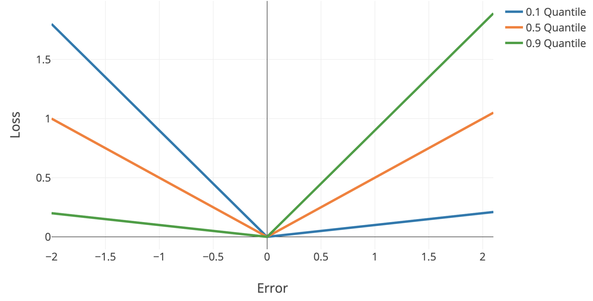

**some notes on uncertainty in machine learning, particularly deep learning**

{:toc}

# basics

- **calibration** - predicted probabilities should match real probabilities
  - platt scaling - given trained classifier and new calibration dataset, basically just fit a logistic regression from the classifier predictions -> labels
  - isotonic regression - nonparametric, requires more data than platt scaling
    - piecewise-constant non-decreasing function instead of logistic regression
- ensemble uncertainty
  - [DNN ensemble uncertainty works](http://papers.nips.cc/paper/7219-simple-and-scalable-predictive-uncertainty-estimation-using-deep-ensembles) - predict mean and variance w/ each network then ensemble (don't need to do bagging, random init is enough)
  - can also use ensemble of [snapshots during training](https://arxiv.org/abs/1704.00109) (huang et al. 2017)
- neural network basic uncertainty: predicted probability = confidence, max margin, entropy of predicted probabilities across classes
- quantile regression - use quantile loss to penalize models differently + get confidence intervals
  - [can easily do this with sklearn](https://scikit-learn.org/stable/auto_examples/ensemble/plot_gradient_boosting_quantile.html)
  - quantile loss = $\begin{cases} \alpha \cdot \Delta & \text{if} \quad \Delta > 0\\\\(\alpha - 1) \cdot \Delta & \text{if} \quad \Delta < 0\end{cases}$
    - $\Delta =$ actual - predicted
    - 

# complementarity

## rejection learning

- **rejection learning** - allow models to *reject* (not make a prediction) when they are not confidently accurate ([chow 1957](https://ieeexplore.ieee.org/abstract/document/5222035/?casa_token=UiIdn8AjFjYAAAAA:XvnZPA7rJlvwxD-bIh2dNG4SPfnHtDYWcBUmAFYRxD6Xk8QE5osnKLs8tAlib_doL8OxqYjMLDE), [cortes et al. 2016](https://link.springer.com/chapter/10.1007/978-3-319-46379-7_5))
- [To Trust Or Not To Trust A Classifier](http://papers.nips.cc/paper/7798-to-trust-or-not-to-trust-a-classifier.pdf) (jiang, kim et al 2018) - find a trusted region of points based on nearest neighbor density (in some embedding space)
    - trust score uses density over some set of nearest neighbors
    - do clustering for each class - trust score = distance to once class's cluster vs the other classes

## complementarity

- **complementarity** - ML should focus on points hard for humans + seek human input on points hard for ML
    - note: goal of perception isn't to learn categories but learn things that are associated with actions
- [Predict Responsibly: Improving Fairness and Accuracy by Learning to Defer](http://papers.nips.cc/paper/7853-predict-responsibly-improving-fairness-and-accuracy-by-learning-to-defer) (madras et al. 2018) - adaptive rejection learning - build on rejection learning considering the strengths/weaknesses of humans
- [Learning to Complement Humans](https://arxiv.org/abs/2005.00582) (wilder et al. 2020) - 2 approaches for how to incorporate human input:
    - discriminative approach - jointly train predictive model and policy for deferring to human (witha cost for deferring)
    - decision-theroetic approach - train predictive model + policy jointly based on value of information (VOI)
    - do real-world experiments w/ humans to validate:  scientific discovery (a galaxy classification task) and medical diagnosis (detection of breast cancer metastasis)
- [Gaining Free or Low-Cost Transparency with Interpretable Partial Substitute](https://arxiv.org/pdf/1802.04346.pdf) (wang, 2019) - given a black-box model, find a subset of the data for which predictions can be made using a simple rule-list ([tong wang](https://scholar.google.com/citations?hl=en&user=KB6A0esAAAAJ&view_op=list_works&sortby=pubdate) has a few papers like this)
    - [Interpretable Companions for Black-Box Models](https://arxiv.org/abs/2002.03494) (pan, wang, et al. 2020) - offer an interpretable, but slightly less acurate model for each decision
      - human experiment evaluates how much humans are able to tolerate

# nearest-neighbor methods

- [Deep k-Nearest Neighbors: Towards Confident, Interpretable and Robust Deep Learning](https://arxiv.org/pdf/1803.04765.pdf) (papernot & mcdaniel, 2018)
- [distance-based confidence scores](https://arxiv.org/pdf/1709.09844.pdf) (mandelbaum et al. 2017) - use either distance in embedding space or adversarial training to get uncertainties for DNNs
- [deep kernel knn](https://arxiv.org/pdf/1811.02579.pdf) (card et al. 2019) - predict labels based on weighted sum of training instances, where weights are given by distance in embedding space
    - add an uncertainty based on conformal methods
- **local outlier factor** (breunig et al. 2000) - score based on nearest neighbor density
- idea: gradients should be larger if you are on the image manifold

# outlier-detection

- overview from [sklearn](https://scikit-learn.org/stable/modules/outlier_detection.html)
- **elliptic envelope** - assume data is Gaussian and fit elliptic envelop (maybe robustly) to tell when data is an outlier
- [isolation forest](https://ieeexplore.ieee.org/abstract/document/4781136) (liu et al. 2008) - lower average number of random splits required to isolate a sample means more outlier
- [one-class svm](https://scikit-learn.org/stable/modules/generated/sklearn.svm.OneClassSVM.html#sklearn.svm.OneClassSVM) - estimates the support of a high-dimensional distribution using a kernel (2 approaches:)
  - separate the data from the origin (with max margin between origin and points) (scholkopf et al. 2000)
  - find a sphere boundary around a dataset with the volume of the sphere minimized ([tax & duin 2004](https://link.springer.com/article/10.1023/B:MACH.0000008084.60811.49))
- [detachment index](https://escholarship.org/uc/item/9d34m0wz) (kuenzel 2019) - based on random forest
  - for covariate $j$, detachment index $d^j(x) = \sum_i^n w (x, X_i) \vert X_i^j - x^j \vert$
    - $w(x, X_i) = \underbrace{1 / T\sum_{t=1}^{T}}_{\text{average over T trees}} \frac{\overbrace{1\{ X_i \in L_t(x) \}}^{\text{is }   X_i \text{ in the same leaf?}}}{\underbrace{\vert L_t(x) \vert}_{\text{num points in leaf}}}$ is $X_i$ relevant to the point $x$?

# predicting uncertainty for DNNs

- [Inhibited Softmax for Uncertainty Estimation in Neural Networks](https://arxiv.org/abs/1810.01861) (mozejko et al. 2019) - directly predict uncertainty by adding an extra output during training
- [Learning Confidence for Out-of-Distribution Detection in Neural Networks](https://arxiv.org/pdf/1802.04865.pdf) (devries et al. 2018) - predict both prediction *p* and confidence *c*
  - during training, learn using $p' = c \cdot p + (1 - c) \cdot y$
- [Bias-Reduced Uncertainty Estimation for Deep Neural Classifiers](https://arxiv.org/abs/1805.08206) (geifmen et al. 2019)
    - just predicting uncertainty is biased
    - estimate uncertainty of highly confident points using earlier snapshots of the trained model
- [Contextual Outlier Interpretation](https://arxiv.org/abs/1711.10589) (liu et al. 2018) - describe outliers with 3 things: outlierness score, attributes that contribute to the abnormality, and contextual description of its neighborhoods

# bayesian approaches

- [Dropout as a Bayesian Approximation: Representing Model Uncertainty in Deep Learning](http://proceedings.mlr.press/v48/gal16.pdf)
  - dropout at test time gives you uncertainty
- [gaussian processes](https://distill.pub/2019/visual-exploration-gaussian-processes/)
- bayesian neural networks
  - [Evaluating Scalable Bayesian Deep Learning Methods for Robust Computer Vision](https://arxiv.org/pdf/1906.01620.pdf)
    - **epistemic uncertainty** - uncertainty in the DNN model parameters
      - without good estimates of this, often get aleatoric uncertainty wrong (since $p(y\vert x) = \int p(y \vert x, \theta) p(\theta \vert data) d\theta$
    - **aleatoric uncertainty** -  inherent and irreducible data noise (e.g. features contradict each other)
      - this can usually be gotten by predicting a distr. $p(y \vert x)$ instead of a point estimate
      - ex. logistic reg. already does this
      - ex. regression - just predict mean and variance of Gaussian
  - [icu bayesian dnns](https://aiforsocialgood.github.io/icml2019/accepted/track1/pdfs/38_aisg_icml2019.pdf)
    - focuses on epistemic uncertainty
    - could use one model to get uncertainty and other model to predict