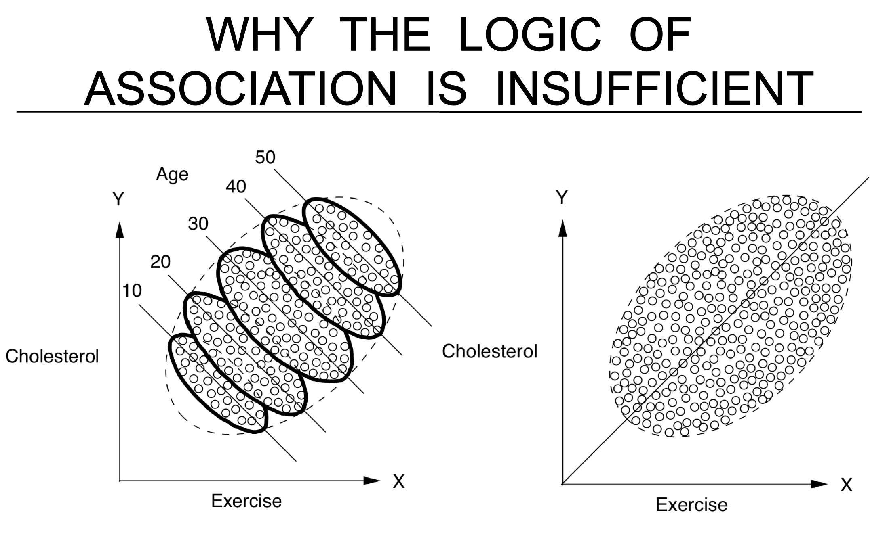

* TOC
{:toc}
---

# causality (freedman ch 1)

- When using observational (non-experimental) data to make causal inferences, the key problem is *confounding*
  - *stratification* = *cross-tabulation* - only look at when confounding variables have same value
- association is circumstantial evidence for causation
- examples
  - HIP trial of mammography - want to do whole treatment group v. whole control group
  - Snow on cholera - water
  - causes of poverty - Yul's model, changes with lots of things
- problem: never get to see gt

# basic causal inference

- *confounding* - difference between groups other than the treatment which affects the response
- 3 frameworks
  1. neyman-rubin model: $Y_i = T_i a_i + (1-T_i) b_i$
    - $\hat{ate} = \hat{a}_A - \hat{b}_B$
    - $\hat{ate}_{adj} = [\bar{a}_A - (\bar{x}_A - \bar{x})^T \hat{\theta}_A] - [\bar{b}_B - (\bar{x}_B - \bar{x})^T \hat{\theta}_B]$
      - $\hat{\theta}_A = argmin \sum_{i \in A} (a_i - \bar{a}_A - (x_i - \bar{x}_A)^T \theta)^2$

  2. neyman-pearson
    - null + alternative hypothesis
      - null is favored unless there is strong evidence to refute it
  3. fisherian testing framework
    - small p-values evidence against null hypothesis
    - null hypothesis

- errors
  - *type I err*: FP - reject when false
  - *type II err*: FN
  - *power*: TP = sensitivity
  - TN
  - newer
    - sensitivity = power
    - recall = sensitivity - true positive rate = TP / P
    - precision = TP / (TP + FP)
    - specificity = true neg rate = TN / N
- natural experiments
  - ex. john snow
- *propensity score* - probability that a subject recieving a treatment is valid after conditioning on appropriate covariates
- 3 principles of experimental design
  1. replication
  2. randomization
  3. conditioning

# causal inference papers

- 2 general approaches
  1. matching - find patients that are similar and differ only in the treatment
     1. only variables you don't match on could be considered causal
  2. regression
     - requires *unconfoundedness* = *omitted variable bias*
     - if there are no confounders, correlation is causation
- Hainmueller & Hangartner (2013) - Swiss passport
  - naturalization decisions vary with immigrants' attributes
  - is there immigration against immigrants based on country of origin?
  - citizenship requires voting by municipality
- Sekhon et al. - when natural experiments are neither natural nor experiments
  - even when natural interventions are randomly as- signed, some of the treatment–control comparisons made available by natural experiments may not be valid
- Grossman et al. - "Descriptive Representation and Judicial Outcomes in Multiethnic Societies"
  - judicial outcomes of arabs depended on whether there was an Arab judge on the panel
- liver transplant
  - maximize benefit (life with - life without)
  - currently just goes to person who would die quickest without
  - Y = T Y(1) + (1-T) Y(0)
    - Y(1) = survival with transplant
    - Y(0) = survival w/out transplant
      - fundamental problem of causal inference - can't observe Y(1) and Y(0)
    - T = 1 if receive transplant else 0
  - goal: estimate $\tau = Y(1) - Y(0)$ for each person

# causality ovw

