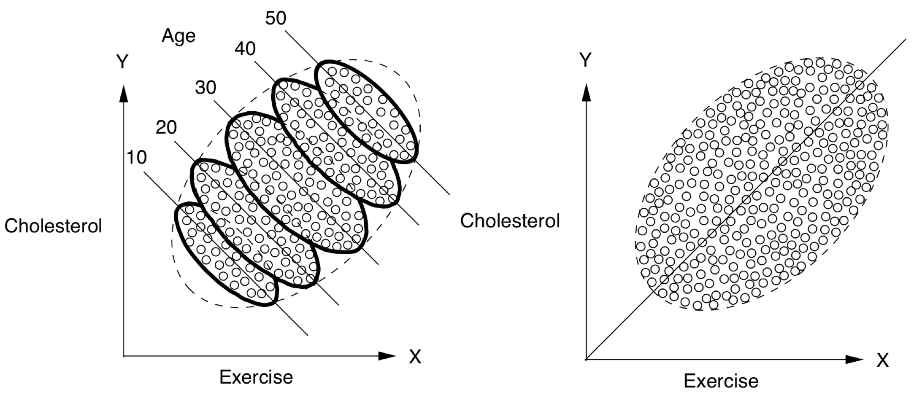
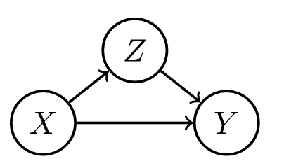
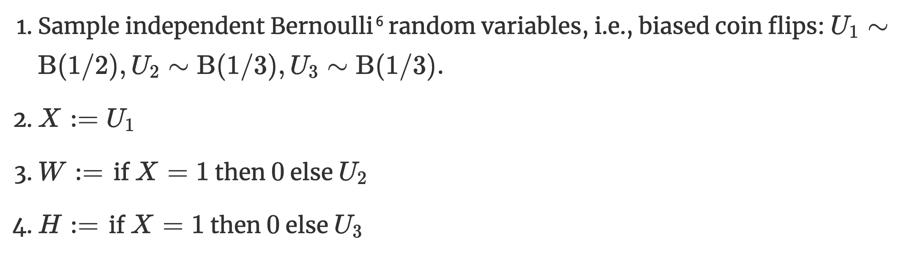
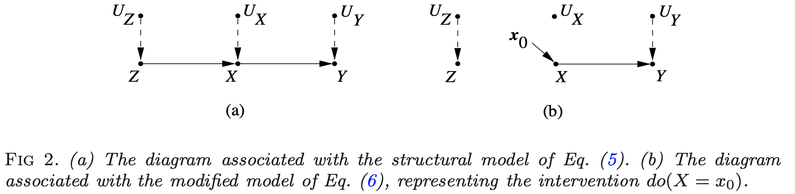
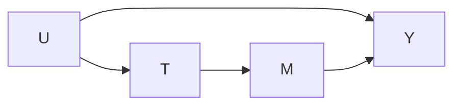

{:toc}

*Some notes on causal inference both from the following resources*:

- introductory courses following neyman-rubin framework at UC Berkeley
- the textbook [What if](https://cdn1.sph.harvard.edu/wp-content/uploads/sites/1268/2020/01/ci_hernanrobins_21jan20.pdf) (hernan & robins)
- the book of why
-  of the fairml book
- rebecca barter's [blog posts](http://www.rebeccabarter.com/blog/2017-07-05-ip-weighting/)


# basics

- **confounding** = difference between groups other than the treatment which affects the response
  - this is the key problem when using observational (non-experimental) data to make causal inferences
  - problem occurs because we don't get to see counterfactuals
  - ex from Pearl where Age is the confounder
- **potential outcomes** = **counterfactual outcomes** $Y^{t=1}, Y^{t=0}$ 
  - **treatment** =  intervention, exposure, action
  - potential outcomes are often alternatively written as $Y(1)$ and $Y(0$) or $Y_1$ and $Y_0$
  - alternatively, $P(Y=y|do(T=1))$ and $P(Y=y|do(T=0))$  or $P(Y=y|set(T=1))$ and $P(Y=y|set(T=0))$ 
  - treatment $T$ and outcome $Y$ (from "What If"):
  - 
- different approaches to causal analysis
  - experimental design: collect data in a way that enables causal conclusions
    - ex. *randomized control trial (RCT)* - controls for any possible confounders
  - quasi-experiments: without explicit random assignment, some data pecularity approximates randomization
    - ex. *regression discontinuity analysis*
    - ex. *instrumental variables* - variable which can be used to effectively due a RCT because it was made random by some external factor
  - post-hoc analysis: by arguing that certain assumptions hold, we can draw causal conclusions from non-observational data
    - ex. *regression-based adjustment* after assuming *ignorability*
    - some assumptions are not checkable, and we can only reason about how badly they can go wrong (e.g. using *sensitivity analysis*)
- background
  - very hard to decide what to include and what is irrelevant
  - **epiphenomenon** - a correlated effect (not a cause)
    - a secondary effect or byproduct that arises from but does not causally influence a process
  - **ontology** - study of being, concepts, categories
    - nodes in graphs must refer to stable concepts
    - ontologies are not always stable
      - world changes over time
      - "looping effect" - social categories (like race) are constantly chainging because people who putatively fall into such categories to change their behavior in possibly unexpected ways
  - **epistemology** - theory of knowledge

## intuition

- [bradford hill criteria](https://en.wikipedia.org/wiki/Bradford_Hill_criteria) - some simple criteria for establishing causality (e.g. strength, consistency, specificity)
  - association is circumstantial evidence for causation
- *no causation without manipulation* (rubin, 1975; Holland, 1986)
  - in this manner, something like causal effect of race/gender doesn't make sense
  - can partially get around this by changing *race* $\to$ *perceived race*
  - weaker view (e.g. of Pearl) is that we only need to be able to understand how entities interact (e.g. write an SEM)
- different levels
  - **experiment**: experiment, RCT, natural experiment, observation
  - **evidence**: marginal correlation, regression, invariance, causal
  - **inference** (pearl's ladder of causality): prediction/association, intervention, counterfactuals
    - kosuke imai's levels of inference: descriptive, predictive, causal

## measures of association

- correlation
- regression coefficient
- risk difference = $P(Y=1|T=1) - P(Y=1|T=0)$
- **risk ratio** = relative risk =  $P(Y=1|T=1) / P(Y=1|T=0)$
- **odds ratio** = $\frac{P(Y=1|T=1) / P(Y=0|T=1)}{P(Y=1|T=0) / P(Y=0|T=0)}$
  - measures association (1 is independent, >1 is positive association, <1 is negative association)
  - **odds** that $P(Y=1)$ = $P(Y=1)/P(Y \neq 1)$

## causal ladder (different levels of inference)

1. **prediction/association** $P(Y|T)$
  
  - only requires joint distr. of the variables
  
2. **intervention** $P(Y^{T=t}) = P(Y|do(T=t))$
  
  - we can change things and get conditionals based on *evidence after intervention*
  - represents the conditional distr. we would get if we were to manipulate $t$ in a randomized trial
  - to get this, we assume the causal structure (can still kind of test it based on conditional distrs.)
  - having assumed the structure, we delete all edges going into a do operator and set the value of $x$
  - then, do-calculus yields a formula to estimate $p(y|do(x))$ assuming this causal structure
  - see introductory paper [here](https://arxiv.org/pdf/1305.5506.pdf), more detailed paper [here](https://ftp.cs.ucla.edu/pub/stat_ser/r416-reprint.pdf) (pearl 2013)
  - by assuming structure, we learn how large impacts are
  
3. **counterfactuals** $P(Y^{T=t'} = y'|T=t, y=y)$

  - we can change things and get conditionals based on *evidence before intervention*

  - instead of intervention $p(y|do(x))$ we get $p(y^*|x^*, u=u)$ where $u$ represents fixing all the other variables and $y^*$ and $x^*$ are not observed

  - averaging over all data points, we'd expect to get something similar to the intervention $p(y|do(x))$

  - probabalistic answer to a "what would have happened if" question
    - e.g. "Given that Hillary lost and didn't visit Michigan, would she win if she had visited Michigan?"
    - e.g. “What fraction of patients who are treated and died would have survived if they were not treated?”
    - this allows for our intervention to contradict something we condition on 
    - simple matching is often not sufficient (need a very good model for how to match, hopefully a causal one)
  - key difference with standard intervention is that we incorporate available evidence into our calculation
    - available evidence influences exogenous variables
    - this is for a specific data point, not a randomly sampled data point like an intervention would be
    - requires SEM, not just causal graph

# frameworks

## fisher randomization test

*in this framework, look for evidence against the null hypothesis (e.g. that there is no causal effect)*

- **fisher null hypothesis**: $H_{0F}: Y_i^{T=0} = Y_i^{T=1}\quad \forall i$ 
  - also called strong null hypothesis = sharp null hypothesis (Rubin, 1980)
    - weak null hypothesis would be $\bar Y_i^{T=0} = Y_i^{T=1}$
  - can work for any test statistic $test$
  - only randomness comes from treatment variable - this allows us to get *randomization distribution* for a test-statistic $test(T, Y^{T=1}, Y^{T=0})$
  - this yields $p$-values: $p= \frac 1 M \sum_{m=1}^M \mathbb 1 \{ test(\mathbf t^m, \mathbf Y) \geq test (\mathbf T, \mathbf Y) \}$
    - can approximate this with Monte Carlo permutation test, with $R$ random permutations of $\mathbf T$:  $p= \frac 1 R \sum_r \mathbb 1 \{ test(\mathbf t^r, \mathbf Y) \geq test (\mathbf T, \mathbf Y) \}$
- canonical choices of test-statistic
  - **difference in means**: $\hat \tau = \hat{\bar{Y}}^{T=1} - \hat{\bar{Y}}^{T=0}$
    - $= \frac 1 {n_1} \sum_i T_i Y_i - \frac 1 {n_0}  \sum_i (1 - T_i) Y_i$
    - $= \frac 1 {n_1} \sum_{T_i=1} Y_i - \frac 1 {n_0}  \sum_{T_i=0} Y_i$
  - **studentized statistic**:  $$t=\frac{\hat \tau}{\sqrt{\frac{\hat S^2(T=1)}{n_1}+\frac{\hat S^2 (T=0)}{n_0}}}$$
    - allows for variance to change between groups (heteroscedasticity)
  - **wilcoxon rank sum**: $W = \sum_i T_i R_i$, where $R_i = \#\{j : Y_j \leq Y_i \}$ is the rank of $Y_i$ in the observed samples
    - the sum of the ranks is $n(n+1)/2$, and the mean of $W$ is $n_1(n+1)/2$
    - less sensitive to outliers
  - **kolmogorov-smirnov statistic**: $D = \max_y|\hat F_1(y) - \hat F_0 (y)|$ where $\hat F_1(y) = \frac 1 {n_1} \sum_i T_i 1(Y_i \leq y)$, $\hat F_0(y) = \frac 1 {n_0} \sum_i (1 -T_i) 1(Y_i \leq y)$
    - measures distance between distributions of treatment outcomes and control outcomes
- alternative neyman-pearson framework has a null + alternative hypothesis
  - null is favored unless there is strong evidence to refute it

## potential outcome framework (neyman-rubin)

*In this framework, try to explicitly compute the effect*

- **average treatment effect ATE** $\tau = E \{Y^{T=1} - Y^{T=0} \}$
- estimator $\hat \tau = \hat{\bar{Y}}^{T=1} - \hat{\bar{Y}}^{T=0}$ 
  - unbiased: $E(\hat \tau) = \tau$
  - $V(\hat \tau) = \underbrace{S^2(1) / n_1 + S^2(0)/n_0}_{\hat V(\tau) \text{ conservative estimator}} - S^2(\tau)/n$ 
    - 95% CI: $\hat \tau \pm 1.96 \sqrt{\hat V}$ (based on normal approximation)
    - we could similarly get a p-value testing whether $\hat \tau$ goes to 0, unlcear if this is better
    - key assumptions: SUTVA, consistency, ignorability
- advantages over DAGs: easy to express some common assumptions, such as monotonicity / convexity
  1. **neyman-rubin model**: $Y_i = \begin{cases} Y_i^{T=1}, &\text{if } T_i=1\\Y_i^{T=0}, &\text{if } T_i=0 \end{cases}$
  	- equivalently, $Y_i = T_i Y_i^{T=1} + (1-T_i) Y_i^{T=0}$
    - $\widehat{ATE} = \mathbb E [\hat{Y}^{T=1} - \hat{Y}^{T=0}]$
    - $\widehat{ATE}_{adj} = [\bar{a}_A - (\bar{x}_A - \bar{x})^T \hat{\theta}_A] - [\bar{b}_B - (\bar{x}_B - \bar{x})^T \hat{\theta}_B]$
      - $\hat{\theta}_A = \mathrm{argmin} \sum_{i \in A} (a_i - \bar{a}_A - (x_i - \bar{x}_A)^T \theta)^2$
  2. neyman-pearson
    - null + alternative hypothesis

## DAGs / structural causal models (pearl et al.)

*In this framework, depict assumptions in a DAG / SEM and use it to reason about effects. For notes on graphical models, see [here](https://csinva.io/notes/stat/graphical_models.html) and basics of do-calculus see [here](https://www.inference.vc/untitled/).*


- comparison to potential outcomes
  - easy to make clear exactly what is independent, particularly when there are many variables
  - do-calculus allows for answering some specific questions easily
  - often difficult to come up with proper causal graph, although may be easier than coming up with ignorability assumptions that hold
  - more flexibly extends to cases with many variables
- DAGs quick review (more details [here](https://csinva.io/notes/stat/graphical_models.html))
  - *d-separation* allows us to identify independence
    - A set $S$ of nodes is said to block a path $p$ if either
      - $p$ contains at least one arrow-emitting node that is in $S$
      - $p$ contains at least one collision node that is outside $S$ and has no descendant in $S$
  - absence of edges often corresponds to qualitative judgements of conditional independence

| forks                                                        | mediators                                                    | colliders                                                    |
| ------------------------------------------------------------ | ------------------------------------------------------------ | ------------------------------------------------------------ |
|  |  |  |
| confounder $z$, can be adjusted for                          | confounder can vary causal effect                            | conditioning on confounder z can explain away a cause        |

- **structural causal model (scm)** gives a set of variables $X_1, ... X_i$ and and assignments of the form $X_i := f_i(X_{parents(i)}, \epsilon_i)$, which tell how to compute value of each node given parents
    - **exogenous variables** $\epsilon_i$ = noise variables = disturbances = errors - node in the network that represents all the data not collected
        - are not influenced by other variables
        - modeler decides to keep these unexplained
        - not the same as the noise term in a regression - need not be uncorrelated with regressors
      - *direct causes* = parent nodes
    - **controlling** for a variable  (when we have a causal graph):
    - $P(Y=y|do(T:=t)) = \sum_z \underbrace{P(Y=y|T=t, T_{parents}=z)}_{\text{effect for slice}} \underbrace{P(T_{parents}=z)}_{\text{weight for slice}}$
    - **post-intervention distribution** $P(z, y|do(t_0))$ - result of setting $T = t_0$
        - also called "controlled" or "experimental" distr.
    - **counterfactual** $Y^{T=t}(x)$ under SCM can be explicitly computed
        -   given structural causal model *M*, observed event *x*, action *T:=t*, target variable *Y*, define counterfactual $Y^{T=t}(x)$ in 3 steps:
        -   **abduction** - adjust noise variables to be consistent with $x$
        -   **action** - perform do-intervention, setting $T=t$
        -   **prediction** - compute target counterfactual, which follows directly from $M_t$, model where action has been performed
        -   counterfactuals can be derived from the model, unlike  potential outcomes framework where counterfactuals are taken as primitives (e.g. they are undefined quantities which other quantities are derived from)
- identifiability
    - effects are identifiable whenever model is **Markovian**
        - graph is acyclic
        - error terms are jointly independent
    - in general, parents of $X$ are the only variables that need to be measured to estimate the causal effects of $X$
    - in this simple case, $E(Y|do(x_0)) = E(Y|X=x_0)$
        - can plug into the algebra of an SEM to see the effect of intervention
        - alternatively, can factorize the graph, set $x=x_0$ and then marginalize over all variables not in the quantity we want to estimate
          - this is what people commonly call "adjusting for confounders"
        - this is the same as the G-computation formula ([Robins, 1987](https://www.sciencedirect.com/science/article/abs/pii/S0021968187800188)), which was derived from a more complext set of assumptions
- examples
    - ex. correlate flips
      - 
      - in this ex, $W$ and $H$ are usually correlated, so conditional distrs. are similar, but do operator of changing $W$ has no effect on $H$ (and vice versa)
      - notation: $P(H|do(W:=1))$ or $P_{M[W:=1]}(h)$
      - ATE of $W$ on $H$ would be $P(H|do(W:=1)) - P(H|do(W:=0))$
    - ex. simple structure
      -  where $\begin{align}z &= f_Z(u_Z)\\x&=f_X(z, u_X)\\y&=f_Y(x, u_Y) \end{align}$

# randomized experiments

*Randomized experiments randomly assign a treatment, thus creating comparable treatment and control groups on average (i.e. controlling for any confounders).*

## design

### stratification / matched-pairs design

- sometimes we want different strata, ex. on feature $X_i \in \{1, ..., K \}$
  - fully random experiment will not put same amount of points in each stratum + will have different treatment/control balance in each stratum
- **stratification at design stage**: stratify and run RCT for each stratum
  - can do all the same fisher tests, usually by computing statistics within each stratum than aggregating
    - sometimes bridge strata with global data
    - ex. aligned rank statistic - normalize each $Y_i$ with stratum mean, then look at ranks across all data (hodges & lehmann 1962)
  - can do neyman-rubin analysis as well - CLT holds with a few large strata and many small strata
    - can prove that variance for stratified estimator is smaller when stratification is predictive of outcome

**matched-pairs design** - like stratification, but with only one point in each stratum (i.e. a pair)

- in each pair, one unit is given treatment and the other is not
- Fisherian inference
  - $H_{0F}: Y_{i, j}^{T=1}=Y_{i, j}^{T=0} \; \underbrace{\forall i}_{\text{all pairs}} \underbrace{\forall j}_{\text{both units in pair}}$ 
    - $\hat \tau_i = \underbrace{(2T_i - 1)}_{-1\text{ or } 1}(Y_{i1} - Y_{i2})$, where $T_i$ determines which of the two units in the pair was given treatment
    - many other statistics...e.g. wilcoxon sign-rank statistic, sign statistic, mcnemar's statistic
- Neymanian inference
  - $\hat \tau = \frac 1 n \sum_i \tau_i$
  - $\hat V = \frac 1 {n(n-1)} \sum_i (\hat \tau_i - \hat \tau)^2$
    - can't estimate variance as in stratified randomized experiment
  - heuristically, matched-pairs design helps when matching is well-done and covariates are predictive of outcome (can't check this at design stage though)
- can also perform covariate adjustment (on covariates that weren't used for matching, or in case matching was inexact)

### rerandomization balances covariates

*rerandomization* adjusts for covariate imbalance given covariate vector $\mathbf x$ (assume mean 0) at design stage

- covariate difference-in-means: $\mathbf{\hat \tau_x} = \frac 1 {n_1} \sum_i T_i \mathbf x_i - \frac 1 {n_0} \sum_i (1 - T_i)\mathbf  x_i$
  - this is for RCT
  - asymptotically zero, but real value need not be
- $\textbf{cov}(\hat\tau_x) = \frac 1 {n_1} S_x^2 + \frac 1 {n_0}S_x^2 = \frac{n}{n_1 n_0}S_x^2$
- $M = \hat \tau_x^T \textbf{cov}(\hat \tau_x)^{-1} \hat \tau_x$ - Mahalanabois distance measures difference between treatment/control groups
  - invariant to non-degenerate linear transformations of $\mathbf x$
  - can use other covariate balance criteria
- rerandomization: discard treatment allocations when $M \leq m_{thresh}$
  - $m_{thresh}=\infty$: RCT
  - $m_{thresh}=0$: few possible treatment allocations - limits randomness; in practice try to choose very small $m_{thresh}$
  - proposed by Cox (1982) + Morgan & Rubin (2012)
- can derive asymptotic distr. for $\hat \tau$ ([li, deng & rubin 2018](https://www.pnas.org/content/115/37/9157.short))

- **combining rerandomization + regression adjustment** can achieve better results ([li & ding, 2020](https://rss.onlinelibrary.wiley.com/doi/abs/10.1111/rssb.12353))

## post-hoc analysis

### statification / matching

- post-stratification at analysis stage: condition on stratum
  - can do conditional FRT or post-stratified Neymanian analysis
  - can often improve efficiency
  - is limited, because eventually there are no points in certain strata

### regression adjustment balances covariates

- *regression adjustment* at analysis stage account for covariates **x**
- fisher random trial adjustment - 2 strategies
  1. construct test-statistic based on residuals of statistical models
     - regress $Y_i$ on $\mathbf x_i$ to obtain residual $e_i$ - then treat $e_i$ as pseudo outcome to construct test statistics
  2. use regression coefficient as a test statistic
     - regress $Y_i$ on $(T_i, \mathbf x_i$) to obtain coefficient of $T_i$ as the test statistic (Fisher's ANCOVA estimator): $\hat \tau_F$
       - Freedman (2008) found that this estimator had issues: biased, large variance, etc.
     - [Lin (2013)](https://projecteuclid.org/euclid.aoas/1365527200) finds favorable properties of the $\hat \tau_F$ estimator
       - can get minor improvements by instead using coefficient of $T_i$ in the OLS of $Y_i$ on $(T_i, \mathbf x_i, T_i \times \mathbf x_i$) 

# quasi-experiments

*Can also be called pseudo-experiments. These don't explicitly randomize treatment, as in RCTs, but some property of the data allows us to control for confounders.*

## natural experiments

- hard to justify
- e.g. jon snow on cholera - something acts as if it were randomized

## back-door criterion: capture parents of T

-   **back-door criterion** - establishes if variables $T$ and  $Y$ are confounded in a graph given set $S$
  -   *sufficient set* $S$ = admissible set - set of factors to calculate causal effect of $T$ on $Y$ requires 2 conditions
    -   no element of $S$ is a descendant of $T$
    -   $S$ blocks all paths from $T$ to $Y$ that end with an arrow pointing to $T$ (i.e. *back-door paths*)
        -   intuitively, paths which point to $T$ are confounders
  -   if $S$ is sufficient set, in each stratum of $S$, risk difference is equal to causal effect
      -   e.g. risk difference $P(Y=1|T=1, S=s) - P(Y=1|T=0, S=s)$
      -   e.g. causal effect $P(Y=1|do(T=1), S=s) - P(Y=1|do(T=0), S=s)$
      -   average outcome under treatment, $P(Y=y|do(T=t)) = \sum_s P(Y=y|T=t, S=s) P(S=s) $
          -   sometimes called *back-door adjustment* - really just covariate adjustment
  -   there can be many sufficient sets, so we may choose the set which minimizes measurement cost or sampling variability
  -   propensity score methods help us better estimate the RHS of this average outcome, but can't overcome the necessity of the back-door criterion

## front-door criterion: good mediator variable

- **front-door criterion** - establishes if variables $T$ and  $Y$ are confounded in a graph given mediators $M$
  -   [intuition](https://www.canr.msu.edu/afre/events/Bellemare%20and%20Bloem%20(2020).pdf): we have unknown confounder $U$, but can find a mediator $M$ between $T$ and $Y$ unaffected by $U$, we can still calculate the effect
    -   this is because we can calculate effect of $T$ on $M$, $M$ on $Y$, then multiply them
  -   $M$ must satisfy 3 conditions
    -   $M$ intercepts all directed paths from $T$ to $Y$ (i.e. *front-door paths*)
    -   there is no unblocked back-door path from $T$ to $M$
    -   all back-door paths from $M$ to $Y$ are blocked by $T$
  -   when satisfied and $P(t, m) > 0$, then causal effect is identifiable as $P(y|do(T=t)) = \sum_m P(m|t) \sum_{t'} P(y|t', m) P(t')$
  -   smoking ex. (hard to come up with many)
    -   $T$ = whether one smokes
    -   $Y$ = lung cancer
    -   $M$ = accumulation of tar in lungs
    -   $U$ = condition of one's environment
  -   only really need to know about treatment, M, and outcome



## regression discontinuity

- treatment definition (e.g. high-school acceptance) has an arbitrary threshold (e.g. score on a test)
  - comparing groups very close to the cutoff should basically control for confounding

## difference-in-difference

- requires data from both groups at 2 or more time periods (at least one before treatment and one after)

## instrumental variable

- see this nice [blog post](http://www.rebeccabarter.com/blog/2018-05-23-instrumental_variables/) by Rebecca Barter

  - ```mermaid
    graph LR
    I --> T
    X --> T
    T --> Y
    ```
    
  - **instrument** $I$- measurable quantity that correlates with the treatment, and is $\underbrace{\color{NavyBlue}{\text{only related to the outcome via the treatment}}}_{\textbf{exclusion restriction}}$
    
    - exclusion restriction is uncheckable

  - key idea: randomization holds for $I$ but not for $T$

  - intuitively, need to combine effect of instrument on treatment and effect of instrument on outcome (through treatment)

    - **Wald estimator** = $\frac{Cov(Y, I)}{Cov(T, I)}$
    - LATE = local average treatment effect - this estimate is only valid for the patients who were influenced by the instrument
    - in practice, often implemented in a 2-stage least squares (regress $I \to T$ then $T\to Y$)

- examples

  - $I$: quarter of birth, $T$: schooling in years, $Y$: earnings (angrist & krueger, 1991)
  - $I$: sibling sex composition, $T$: family size, $Y$: mother's employment (angist & evans, 1998)
  - $I$: lottery number, $T$: veteran status, $Y$: mortality
  - $I$: geographic variation in college proximity, $T$: schooling, $Y$: wage (card, 1993)

- **CACE** $\tau_c$ (complier average causal effect) = **LATE** (local average treatement effect)

  - technical setting: **noncompliance** - sometimes treatment assigned $I$ and treatment received $T$ are different
  
- assumptions
    - randomization: $I \perp \{T^{I=1}, T^{I=0}, Y^{I=1}, Y^{I=0} \}$
      - randomization lets us identify ATE of $I$ on $T$ and $I$ on $Y$
        - $\tau_{T}=E\{T^{I=1}-T^{I=0}\}=E(T \mid I=1)-E(T \mid I=0)$
        - $\tau_{Y}=E\{Y^{I=1}-Y^{I=0}\}=E(Y \mid I=1)-E(Y \mid I=0)$
      -  **intention-to-treat** $\tau_Y$
      - four possible outcomes:
        - $C_{i}=\left\{\begin{array}{ll}
          \mathrm{a}, & \text { if } T_{i}^{I=1}=1 \text { and } T_{i}^{I=0}=1 \text{ always taker}\\
          \mathrm{c}, & \text { if } T_{i}^{I=1}=1 \text { and } T_{i}^{I=0}=0\text{ complier} \\
          \mathrm{d}, & \text { if } T_{i}^{I=1}=0 \text { and } T_{i}^{I=0}=1 \text{ defier}\\
          \mathrm{n}, & \text { if } T_{i}^{I=1}=0 \text { and } T_{i}^{I=0}=0\text{ never taker}
          \end{array}\right.$
    - exclusion restriction: $Y_i^{I=1} = Y_i^{I=0}$ for always-takers and never-takers
      - means treatment assignment affects outcome only if it affects the treatment
    - monotonicity: $P(C=d) = 0$ or $T_i^{U=1} \geq T_i^{U=0} \; \forall i$ - there are no defiers
      - testable implication: $P(T=1|I=1) \geq P(T=1|C=0)$
  - under these 3 assumptions, LATE $\tau_c = \frac{\tau_Y}{\tau_T} = \frac{E(Y \mid I=1)-E(Y \mid I=0)}{E(T \mid I=1)-E(T \mid I=0)}$ 
  
    - this can be estimated with the WALD estimator
    - basically just scales the intention-to-treat estimator, so usually similar conclusions
    - if we have some confounders $X$, can adjust for them
    - the smaller $\tau_T$ is (i.e. the more noncompliance there is), the worse properties the LATE estimator has
    - instrumental variable inequalities $E(Q|I=1) \geq E(Q|I=0)$ where $Q = TY, T(1-Y), (1-T)Y, T+Y - TY$
  - *instrumental inequality* ([Pearl 1995](https://arxiv.org/abs/1302.4976)) - a necessary condition for any variable $I$ to qualify as an instrument relative to the pair $(T, Y)$: $\max_T \sum_Y \left[ \max_I P(T,Y | I) \right] \leq 1$
    - when all vars are binary, this reduces to the following:
    - $P(Y=0, T=0 \mid I=0) + P(Y=1, T=0 \mid I=1) \leq 1$
      $P(Y=0, T=1 \mid I=0)+P(Y=1, T=1 \mid I=1) \leq 1$
      $P(Y=1, T=0 \mid I=0)+P(Y=0, T=0 \mid I=1) \leq 1$
      $P(Y=1, T=1 \mid I=0)+P(Y=0, T=1 \mid I=1) \leq 1$
  
- **instrumental variable criterion** -  sufficient condition for identifying the causal effect $P(y|do(t))$ is that every path between $T$ and any of its children traces at least one arrow emanating from a measured variable
  
  -   sometimes this is satisfied even when back-door criterion is not

## synthetic data experiments

- [Towards causal benchmarking of bias in face analysis algorithms](https://arxiv.org/abs/2007.06570) (balakrishnan et al. 2020) - use GANs to generate synthetic data where only attribute varies
- causal imputation / causal transport = mapping bbetween different domains, where only one domain at a time is ever observed
  - [Multi-Domain Translation by Learning Uncoupled Autoencoders](https://arxiv.org/abs/1902.03515) (yang & uhler 2019)
    - learn autoencoders for different domains that all map to a shared latent space
    - this allows to translate between different domains, by using one encoder and then a different decoder
  - [Causal Imputation via Synthetic Interventions](https://arxiv.org/abs/2011.03127) (squires, ..., uhler 2020)

# observational analysis

*The emphasis in this section is on ATE estimation, as an example of the considerations required for making causal conclusions.*

## ATE estimation basics

- assume we are given iid samples of $\{ X_i, T_i, Y_i^{T=1}, Y_i^{T=0} \}$, and drop the index $i$
-  $\tau = E\{Y^{T=1} - Y^{T=0}\}$: **average treatment effect (ATE)** - goal is to estimate this
  - $\tau_T =E\{Y^{T=1}−Y^{T=0}|T =1\}$: *ATE on the treated units*
  - $\tau_C =E\{Y^{T=1}−Y^{T=0}|T =0\}$: *ATE on the control units*
- $\tau_{PF} = E[Y|T=1] - E[Y|T=0]$: *prima facie causal effect*
  - $= E[Y^{T=1}|T=1] - E[Y^{T=0}|T=0]$
  - naive, but computable!
  - generally biased, with **selection biases**:
    - $E[Y^{T=0}|T=\textcolor{NavyBlue}1] - E[Y^{T=0}|T=\textcolor{NavyBlue}0]$
    - $E[Y^{T=1}|T=\textcolor{NavyBlue}1] - E[Y^{T=1}|T=\textcolor{NavyBlue}0]$
- **randomization** tells us the treatment is independent of the outcome with/without treatment $T \perp \{Y^{T=1}, Y^{T=0}\}$, so the selection biases are zero (rubin, 1978)
  - $\implies \tau = \tau_T = \tau_C$
  - this is more important than balancing the distr. of covariates
- conditioning on observed X, selection bias terms are zero:
  - $E\{Y^{T=0}|T=1, X\} = E\{Y^{T=0}|T=0, X\}$ 
  - $E\{Y^{T=1}|T=1, X\} = E\{Y^{T=1}|T=0, X\}$ 
  - $\implies \tau(X) = \tau_T(X) = \tau_C(X) = \tau_{PF}(X)$

## regression adjustments

- ATE simple methods (all assume ignorability)
  - ex. stratified ATE estimator (given discrete covariate)
  - ex. $\tau = \beta_t$  in OLS
    - $E(Y|T, X) = \beta_0 + \beta_t T + \beta_x^TX$
  - ex. $\tau = \beta_t + \beta_{tx}^TE(X)$
    - $E(Y|T, X) = \beta_0 + \beta_tT + \beta_x^TX + \beta^T_{tx} X T$
    - incorporates heterogeneity
- $\hat \tau = \frac 1 n \sum_i (\hat \mu_1(X_i) - \hat \mu_0(X_i))$
  - general mean functions $\hat \mu_1(x), \hat \mu_0(x)$ approximate $\mu_i =E\{ Y^{T=i} |X\}$
  - consistent when $\mu_i$ functions are well-specified
- over-adjustment
    - M-bias
        - originally, $T \perp Y$ 😊
        - after adjusting for X, $T \not \perp Y$ 🙁
		- ```mermaid
          graph LR
          U1 --> T
          U1 --> X
          U2 --> X
          U2 --> Y
          ```
        
	- Z-bias: after adjusting, bias is larger
   -  ```mermaid
        graph LR
        X --> T
        T --> Y
        U --> Y
        U --> T
     ```

## weighting methods

*Weighting methods assign a different importance weight to each unit to match the covariates distributions across treatment groups after reweighting.*


### inverse propensity weighting

- **propensity score** $e(X, Y^{T=1}, Y^{T=0}) = P\{T=1|X, Y^{T=1}, Y^{T=0}\}$
  - under strong ignorability, $e(X)=P(T=1|X)$
  - *Thm.* if $\underbrace{T \perp \{ Y^{T=1}, Y^{T=0}\} | \color{NavyBlue} X}_{\text{strong ignorability on X}}$, then $\underbrace{T \perp \{ Y^{T=1}, Y^{T=0}\} | \textcolor{NavyBlue}{e(X)}}_{\text{strong ignorability on e(X)}}$
    - therefore, can stratify on $e(X)$, but still need to estimate $e(X)$, maybe bin it into K quantiles (and pick K)
    - could combine this propensity score weighting with regression adjustment (e.g. within each stratum)
  - *Thm*. $T \perp X \; | \; e(X)$. Moreover, for any function $h$, $E\{\frac{T \cdot h(X)}{e(X)}\} = E\{\frac{(1-T)h(X)}{1-e(X)}\}$
    - can use this result to check for covariate balance in design stage
    - can view $h(X)$ as psuedo outcome and estimtate ATE
      - if we specify it to something like $h(X)=X$, then it should be close to 0
- $\hat \tau_{ht} = \frac 1 n \sum_i \frac{T_iY_i}{\hat e(X_i)} - \frac 1 n \sum_i \frac{(1-T_i)Y_i}{1-\hat e(X_i)} $  = **inverse propensity score weighting estimator = horvitz-thompson estimator** (horvitz & thompson 1952)
  - weight outcomes by $1/e(X)$ for treated individuals and $1/(1-e(X))$ for untreated
  - *Based on Thm.* if $\underbrace{T \perp \{ Y^{T=1}, Y^{T=0}\} | X}_{\text{strong ignorability on X}}$, then:
    - $E\{Y^{T=1}\} = E \left \{ \frac{TY}{e(X)} \right \}$
    - $E\{Y^{T=0}\} = E\left \{ \frac{(1-T)Y}{1-e(X)} \right \}$
    - $\implies \tau = E \left \{ \frac{TY}{e(X)} - \frac{(1-T)Y}{1-e(X)} \right \}$
  - consistent when propensity scores are correctly specified
  - intuition: assume we have 2 subgroups in our data
    - if prob. of a sample being assigned treatment in one subgroup is low, should upweight it because this sample is rare + likely gives us more information
    - this also helps balance the distribution of the treatment for each subgroup
  - if we add a constant to $Y$, then this estimator changes (not good) - if we adjust to avoid this change, we get the **Hajek estimator** (hajek, 1971), which is often more stable
  - scores near 0/1 are unstable - sometimes truncate ("trim") or drop units with these scores
    - fundamental problem is ovelap of covariate distrs. in treatment/control
    - when score = 0 or 1, counterfactuals may not even be well defined

### doubly robust estimator

- $\hat \tau^{\text{dr}} = \hat \mu_1^{dr} - \hat \mu_0^{dr}$ = **doubly robust estimator** = augmented inverse propensity score weighting estimator (scharfstein et al. 1999, [bang & robins 2005](https://onlinelibrary.wiley.com/doi/full/10.1111/j.1541-0420.2005.00377.x?casa_token=oqdc-GxLFTYAAAAA%3A7CETBzsiHXXEu23NM-sMJ1CXlgI6oeAxt1Ydca3wXmPoTGsORR0IEoYszCo1GzNLtYXGNgxU4blu4gLn))
  - given $\mu_1(X, \beta_1)$, $\mu_0(X, \beta_0)$, e.g. linear
  - given $e(X, \alpha)$, e.g. logistic
  - $\tilde{\mu}_{1}^{\mathrm{dr}} =E\left[ \overbrace{\frac{T\left\{Y-\mu_{1}\left(X, \beta_{1}\right)\right\}}{e(X, \alpha)}}^{\text{inv-prop residuals}}+\overbrace{\mu_{1}\left(X, \beta_{1}\right)}^{\text{outcome mean}}\right]$
  - $\tilde{\mu}_{0}^{\mathrm{dr}} =E\left[\frac{(1-T)\left\{Y-\mu_{0}\left(X, \beta_{0}\right)\right\}}{1-e(X, \alpha)}+\mu_{0}\left(X, \beta_{0}\right)\right]$
  - augments the oucome regression mean with inverse-propensity of residuals
    - can alternatively augment inv propensity score weighting estimator by the outcome models:
    - $\begin{aligned}
      \tilde{\mu}_{1}^{\mathrm{dr}} &=E\left[\frac{T Y}{e(X, \alpha)}-\frac{T-e(X, \alpha)}{e(X, \alpha)} \mu_{1}\left(X, \beta_{1}\right)\right] \\
      \tilde{\mu}_{0}^{\mathrm{dr}} &=E\left[\frac{(1-T) Y}{1-e(X, \alpha)}-\frac{e(X, \alpha)-T}{1-e(X, \alpha)} \mu_{0}\left(X, \beta_{0}\right)\right]
      \end{aligned}$
  - consistent if either the propensity scores or mean functions are well-specified:
    - propensities well-specified: $e(X, \alpha) = e(X)$
    - mean functions well-specified: $\left\{\mu_{1}\left(X, \beta_{1}\right)=\mu_{1}(X), \mu_{0}\left(X, \beta_{0}\right)=\mu_{0}(X)\right\}$

### alternatives

- solutions to deal with extreme weights (from assaad et al. 2020): 
  - Matching Weights (Li & Greene, 2013): MW
  - Truncated IPW (Crump et al., 2009): TruncIPW
  - Overlap Weights (Li et al., 2018): OW
- directly incorporating covariate imbalance in weight construction (Graham et al., 2012; Diamond & Sekhon, 2013)
  - hard moment-matching conditions (Li & Fu, 2017; Hainmueller, 2012; Imai & Ratkovic, 2014)
  - soft moment-matching conditions  (Zubizarreta, 2015).

## stratification / matching

*Matching methods choose try to to equate (or "balance'') the distribution of covariates in the treated and control groups  by picking well-matched samples of the original treated and control groups*

- [Matching methods for causal inference: A review and a look forward](https://www.ncbi.nlm.nih.gov/pmc/articles/PMC2943670/pdf/nihms200640.pdf) (stuart 2010)
  - matching basics
    - includes 1:1 matching, weighting, or subclassification
    - linear regression adjustment (so not matching) can actually increase bias in the estimated treatment effect when the true relationship between the covariate and outcome is even moderately non-linear, especially when there are large differences in the means and variances of the covariates in the treated and control groups
  - matching distance measures
    - propensity scores summarize all of the covariates into one scalar: the probability of being treated
      - defined as the probability of being treated given the observed covariates
      - propensity scores are balancing scores: At each value of the propensity score, the distribution of the covariates X defining the propensity score is the same in the treated and control groups -- usually this is logistic regresion
      - if treatment assignment is ignorable given the covariates, then treatment assignment is also ignorable given the propensity score: 
    - hard constraints are called "exact matching" - can be combined with other methods
    - mahalanabois distance
  - matching methods
    - *stratification* = *cross-tabulation* - only compare samples when confounding variables have same value
    - nearest-neighbor matching - we discard many samples this way (but samples are more similar, so still helpful)
      - optimal matching - consider all potential matches at once, rather than one at a time
      - ratio matching - could match many to one (especially for a rare group), although picking the number of matches can be tricky
      - with/without replacement - with seems to have less bias, but more practical issues
    - subclassification/weighting: use **all the data** - this is nice because we have more samples, but we also get some really poor matches
      - subclassification - stratify score, like propensity score, into groups and measure effects among the groups
      - full matching - automatically picks the number of groups
      - weighting - use propensity score as weight in calculating ATE (also know as inverse probability of treatment weighting)
    - common support - want to look at points which are similar, and need to be careful with how we treat points that violate similarity
    - genetic matching - find the set of matches which minimize the discrepancy between the distribution of potential confounders
  - diagnosing matches - are covariates balanced after matching?
    - ideally we would look at all multi-dimensional histograms, but since we have few points we end up looking at 1-d summaries
    - one standard metric is difference in means of each covariate, divided by its stddev in the whole dataset
  - analysis of the outcome - can still use regression adjustment after doing the matching to clean up residual covariances
    - unclear how to propagate variance from matching to outcome analysis
- matching does not scale well to higher dimensions ([abadie & imbens, 2005](https://onlinelibrary.wiley.com/doi/abs/10.1111/j.1468-0262.2006.00655.x?casa_token=kfpUCPnks9AAAAAA:wPkNkzM6lR9ji7fMuy6I61RfWB6rzIc6mVXVbyTXS1tFtmqWCJBapEq7rD1MDI-lrB8kD1G8vh_blA)), improving balance for some covariates at the expense of others
- **bias-corrected matching estimator** averages over all matches
  - if we get perfect matches on covariates $X$ (or propensity score), it is just like doing matched design
  - in practice, we only get approximate matches
  - for a unit, we take its value and impute its counterfactual as $\frac 1 {|matches|} \sum_{\text{match} \in {\text{matches}}} Y_{\text{match}}$
  - [Abadie and Imbens (2011)](https://economics.mit.edu/files/11861) add bias correction term
  - requires complex bootstrap procedure to obtain variance
  - bias-corrected matching estimator is very similar to doubly robust estimator
    - $\begin{aligned}
      \hat{\tau}^{\mathrm{mbc}} &=n^{-1} \sum_{i=1}^{n}\left\{\hat{\mu}_{1}\left(X_{i}\right)-\hat{\mu}_{0}\left(X_{i}\right)\right\}+n^{-1} \sum_{i=1}^{n}\left\{\left(1+\frac{K_{i}}{M}\right) T_{i} \hat{R}_{i}-\left(1+\frac{K_{i}}{M}\right)\left(1-T_{i}\right) \hat{R}_{i}\right\} \\
      \hat{\tau}^{\mathrm{dr}} &=n^{-1} \sum_{i=1}^{n}\left\{\hat{\mu}_{1}\left(X_{i}\right)-\hat{\mu}_{0}\left(X_{i}\right)\right\}+n^{-1} \sum_{i=1}^{n}\left\{\frac{T_{i} \hat{R}_{i}}{\hat{e}\left(X_{i}\right)}-\frac{\left(1-T_{i}\right) \hat{R}_{i}}{1-\hat{e}\left(X_{i}\right)}\right\}
      \end{aligned}$

# assumptions

## common assumptions

- **unconfoundedness**
  - **exchangeability** $T \perp \!\!\! \perp \{ Y^{t=1}, Y^{t=0}\}$  = exogeneity = randomization: the value of the counterfactuals doesn't change based on the choice of the treatment
    - **ignorability** $T \perp \!\!\! \perp \{ Y^{T=1}, Y^{T=0}\} | X $  = unconfoundedness = selection on observables = conditional exchangeability
      - very hard to check!
      - rubin 1978; rosenbaum & rubin 1983
      - this is strong ignorability, weak ignorability is a little weaker
    - this will make **selection biases** zero
      - $E[Y^{T=0}|T=\textcolor{NavyBlue}1] - E[Y^{T=0}|T=\textcolor{NavyBlue}0]$
      - $E[Y^{T=1}|T=\textcolor{NavyBlue}1] - E[Y^{T=1}|T=\textcolor{NavyBlue}0]$
  - graph assumptions
    - **back-door criterion**, **front-door criterion**
    - basics in a graph
      - *exclusion restrictions*: For every variable $Y$ having parents $PA(Y)$ and for every set of endogenous variables $S$ disjoint of $PA(Y)$, we have  $Y^{PA(y)} = Y^{PA(Y), S}$
        - fixing a variables parents fully determines it
      - *independence restrictions*: variables are independent of noise variables given their markov blanket
- **overlap** / imbalance assumption
  - **positivity** - probability of receiving any treatment is positive for every individual: $P(T=1|x) > 0 \: \forall x$
  - without overlap, assumption of linear effect can be very strong (e.g. extrapolates out of sample)
  - strong overlap assumption: propensity scores are bounded away from 0 and 1
    - $0 < \alpha_L \leq e(X) \leq \alpha_U < 1$
    - when $e(X)=$0 or 1, potential outcomes are not even well-defined ([king & zeng, 2006](https://www.cambridge.org/core/journals/political-analysis/article/dangers-of-extreme-counterfactuals/2E70ACE0D50C6D51A1E042DFBB1BC335))
  - things can be matched
- treatment assumptions
  - treatment is not ambiguous
  - is it something that could be intervened on?
    - can we intervene on something like Race? Soln: intervene on perceived race
    - can we intervene on BMI? many potential interventions: e.g. diet, exercise
    - **consistency**: $Y=Y^{t=0}(1-T) + Y^{t=1}T$ - outcome agrees with the potential outcome corresponding to the treatment indicator (really this is used to ground the definition of the counterfactuals $Y^{t=0}, Y^{t=1}$)
    - SCM counterfactuals further assume 2 things:
      - $Y_{yz} = y \quad \forall y, \text{ subsets }Z\text{, and values } z \text{ for } Z$
        - ensures interventions $do(Y=y)$ results in $Y=y$, regardless of concurrent interventions, say $do(Z=z)$
      - $X_z = x \implies Y_{xz} = Y_z \quad \forall x, \text{ subsets }Z\text{, and values } z \text{ for } Z$
        - generalizes above
        - ensures interventions $do(X=x)$ results in appropriate counterfactual, regardless of holding a variable fixed, say $Z=z$
- combinations
  - **stable unit treatment value assumption (SUTVA) = no-interference assumption** (Rubin, 1980)
    - treatment one unit receives doesn't change effect of treatment for any other unit
    - treatment does not have versions / ambiguity
  - assumptions for ATE being identifiable: exhangeability (or ignorability) + consistency, positivity


## assumption checking

### check ignorability: use auxilary outcome

- **negative outcome** - assume we have a secondary informative outcome $Y'$
  - $Y'$ is similar to $Y$ in terms of confounding: if we believe $T \perp Y(t) \mid X$ we also think $T \perp Y'(t) \mid X$
  
  - we know the expected effect of $T$ on $Y'$ (ex. it should be 0)
    
  - $\tau(T \to Y') = E\{Y'^{T=1} - Y'^{T=0})\}$
  
- ex. cornfield et al. 1959 - effect of smoking on car accident
- ```mermaid
  graph LR
  X(X) -->Y'(Y')
    X --> Y
    X --> T
    T --> Y
  ```
- **negative exposure** - assume we have a secondary informative treatment $T'$
  - $T'$ is similar to $T$ in terms of confounding: if we believe $T \perp Y(t) \mid X$ we also think $T' \perp Y(t) \mid X$
  - we know the expected effect of $T'$ on $Y$ (ex. it should be 0)
    - $\tau(T' \to Y) = E\{Y^{T'=1} - Y^{T'=0})\}$
  - ex. maternal exposure $T$ and parental exposure $T'$
- ```mermaid
  graph LR
  X -->T'
  X --> Y
  X --> T
  T --> Y
  ```

- **bounds without ignorability** ([manski 1990](https://www.jstor.org/stable/2006592?casa_token=5wsmh0n73ecAAAAA%3AGrmKG84ZmaGgvx7Xsadw_Gta7y59XrUMUe8IpYH-IWfN7mVx0p51Wte4H8m7zZy6l06TYQZeNHRgpz7cPAvXtrw2O6pABDcgYanESUXjuyhM7_9vAOws&seq=1#metadata_info_tab_contents))
  
  - worst-case bounds are very poor

### check ignorability impact: sensitivity analysis wrt unmeasured confounding

- broadly, sensitivity analysis measures how “sensitive” a model is to changes in the value of the parameters of the model and to changes in the structure of the model
- here, we focus on sensitivity analyses *wrt unmeasured confounding* - how strong the effects of an unobserved covariate $U$ on the exposure and/or the outcome would have to be to change the study inference (estimated effect of $T$ on $Y$)
- there are many types of such analyses (for a review, see [liu et al. 2013](https://www.ncbi.nlm.nih.gov/pmc/articles/PMC3800481/pdf/nihms470690.pdf))
  - ex. **rosenbaum-type**
    - interested in finding thresholds of the following association(s) that would render test statistic of the study inference insignificant (e.g. true odds-ratio of outcome and treatment, adjusted for $X$ and $U$):
      - unobserved confounder and the treatment (odds-ratio $OR_{\text{UT}}$)
      - and/or unobserved confounder and the outcome (odds-ratio $OR_{\text{UY}}$)
    - usually used after matching
    - 3 types
      - primal sensitivity analysis: vary $OR_{\text{UT}}$ with $OR_{\text{UY}} = \infty$
      - dual sensitivity analysis: vary $OR_{\text{UY}}$ with $OR_{\text{UT}}=\infty$ 
      - simultaneous sensitivity analysis: vary both vary $OR_{\text{UT}}$ and $OR_{\text{UY}}$
	- ex. **confidence-interval methods**
    - quantify unobserved confounder under specifications then arrive at target of interest + confidence interval, adjusted for $U$
    - first approach: use association between $T, Y, U$ to create data as if $U$ was observed
      - specifications: $P(U|T=0$), $P(U|T=1)$ ([greenland, 1996](https://academic.oup.com/ije/article/25/6/1107/672425))
      - specifications: $OR_{\text{UY}}$ and $OR_{\text{UT}}$,  $U$ evenly distributed ([harding, 2003](https://www.journals.uchicago.edu/doi/abs/10.1086/379217?casa_token=LEDms9TVjrEAAAAA:Zg7CU9s6InCHOR4o9N9MTrrmOWRS80iJLw_vjDHrcF5KYCsWgYfE1--tyaKMNbvChjmsirT6eQvD))
      - given either of these specifications, can fill out the table of $X, Y|U$, then use these weights to re-create data and fit weighted logistic regression
    - second approach: use association between $T, Y, U$ to compute adjustment
      - this approach can relax some assumptions, such as the no-three-way-interaction assumption
      - specifications: $P(U|T=1), P(U|T=0), OR_{\text{UY|T=1}}, OR_{\text{UY|T=0}}$([lin et al. 1998](https://www.jstor.org/stable/2533848?casa_token=VUsEU1I6EgIAAAAA:RZQhdfGYtwlSb2GO_PQvR68CM-mx-RmOcoKMNImxX8-sMxd_M7nmVwWSn6CqVHs6ai0tqBWr54PvUfj--zqGtUFVEw-2Muw8y9HIXBQUoWYosF77m4-f))
      - specifications: $P(U|T=1), P(U|T=0), OR_{\text{UY}}$ ([vanderweele & arah, 2011](https://www.jstor.org/stable/29764679?casa_token=4Gd4twU75G8AAAAA%3AZw_K4QbIK3-VKJMKOzYICbDbW-YASmvJYLfMwyhWISXvnH-3u9S1F_vss66QYrlHpVEfcJar94PaKGKgPLheaTp2-KGD9CHDLLv4cGBkvn7igRzdlpoy&seq=1#metadata_info_tab_contents))
  - ex. **cornfield-type** ([cornfield et al. 1959](https://academic.oup.com/jnci/article-abstract/22/1/173/912572)) - seminal work
    - ignorability does not hold $T \not \perp \{ Y^{T=1}, Y^{T=0}\} | X $
    - latent ignorability holds $T \perp \{ Y^{T=1}, Y^{T=0}\} | (X, U) $
    - true causal effect (risk ratio): $\mathrm{RR}_{x}^{\text {true }}=\frac{\operatorname{pr}\{Y^{T=1}=1 \mid X=x\}}{\operatorname{pr}\{Y^{T=0}=1 \mid X=x\}}$
    - observed: $\mathrm{RR}_{x}^{\mathrm{obs}}=\frac{\operatorname{pr}(Y=1 \mid T=1, X=x)}{\operatorname{pr}(Y=1 \mid T=0, X=x)}$
    - we can ask how strong functions of U, T, Y all given X must be to explain away an observed association
      - $\mathrm{RR}_{T U \mid x}=\frac{\operatorname{pr}(U=1 \mid T=1, X=x)}{\operatorname{pr}(U=1 \mid T=0, X=x)}$
      - $\mathrm{RR}_{U Y \mid x}=\frac{\operatorname{pr}(Y=1 \mid U=1, X=x)}{\operatorname{pr}(Y=1 \mid U=0, X=x)}$
      - *Thm*: under latent ignorability, $\mathrm{RR}_{x}^{\mathrm{obs}} \leq \frac{\mathrm{R} \mathrm{R}_{T U \mid x} \mathrm{RR}_{U Y \mid x}}{\mathrm{RR}_{T U \mid x}+\mathrm{RR}_{U Y \mid x}-1}$
  - ex. bounds on direct effects with confounded intermediate variables ([Cai et al. 2008](https://onlinelibrary.wiley.com/doi/full/10.1111/j.1541-0420.2007.00949.x?casa_token=WdtSDtKM_zsAAAAA%3AyEmvyHkEBk5qtvcj4p8r5ewrI5npbTts9J9IKRQyc4XmbpDvsmtIDy28sbOU2m32oT31ol2VM4Kb5w))

