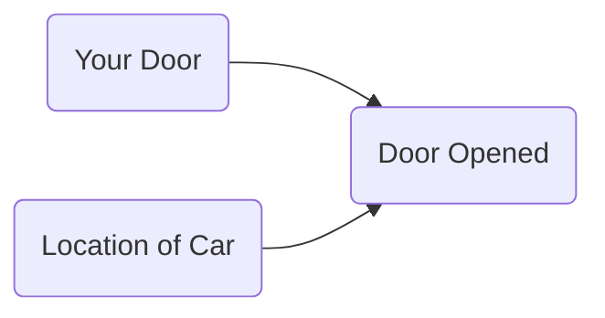
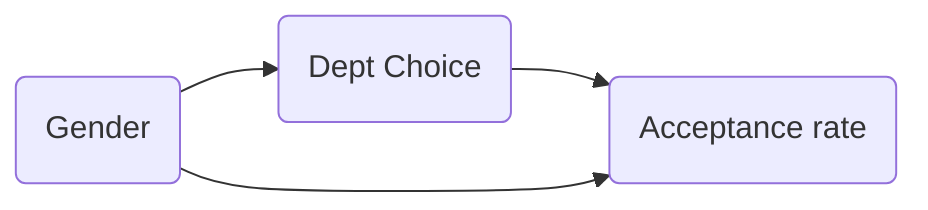
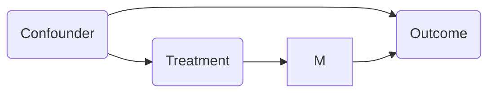

{:toc}

*Some notes on causal inference both from introductory courses following neyman-rubin framework (+ the textbook "[What if](https://cdn1.sph.harvard.edu/wp-content/uploads/sites/1268/2020/01/ci_hernanrobins_21jan20.pdf)?") + based on Judea Pearl's ladder of causality (+ "The book of why?"). Also includes notes from [this chapter](https://fairmlbook.org/causal.html) of the fairml book.*

# basics

- **confounding** = difference between groups other than the treatment which affects the response
  - this is the key problem when using observational (non-experimental) data to make causal inferences
  - problem occurs because we don't get to see counterfactuals
  - ex from Pearl where Age is the confounder
- study types
  - 3 principles of experimental design: replication, randomization, conditioning
  - **randomized control trial (RCT)** - controls for any possible confounders
  - **case-control study** - retrospective - compares "cases" (people with a disease) to controls
  - **sensitivity analysis** - instead of drawing conclusions by assuming the absence of certain causal relationships, challenge such assumptions and evaluate how strong altervnative relationships must be in order to explain the observed data
  - **regression-based adjustment** - if we know the confounders, can just regress on the confounders and the treatment and the coefficient for the treatment (the partial regression coefficient) will give us the average causal effect)
    - works only for linear models
    - **propensity score** - probability that a subject recieving a treatment is valid after conditioning on appropriate covariates
  - **instrumental variables** - variable which can be used to effectively due a RCT because it was made random by some external factor
    - ex. army draft, john snow's cholera study
- background
  - very hard to decide what to include and what is irrelevant
  - **epiphenomenon** - a correlated effect (not a cause)
    - a secondary effect or byproduct that arises from but does not causally influence a process
  - **ontology** - study of being, concepts, categories
    - nodes in graphs must refer to stable concepts
    - ontologies are not always stable
      - world changes over time
      - "looping effect" - social categories (like race) are constantly chainging because people who putatively fall into such categories to change their behavior in possibly unexpected ways
  - **epistemology** - theory of knowledge

## intuition

- [bradford hill criteria](https://en.wikipedia.org/wiki/Bradford_Hill_criteria) - some simple criteria for establishing causality (e.g. strength, consistency, specificity)
  - association is circumstantial evidence for causation
- *no causation without manipulation* (rubin, 1975; Holland, 1986)
  - in this manner, something like causal effect of race/gender doesn't make sense
  - can partially get around this by changing *race* $\to$ *perceived race*
  - weaker view (e.g. of Pearl) is that we only need to be able to understand how entities interact (e.g. write an SEM)
- different levels
  - **experiment**: experiment, RCT, natural experiment, observation
  - **evidence**: marginal correlation, regression, invariance, causal
  - **inference** (pearl's ladder of causality): prediction/association, intervention, counterfactuals
    - kosuke imai's levels of inference: descriptive, predictive, causal

## common examples

- HIP trial of mammography - want to do whole treatment group v. whole control group
- John Snow on cholera - water
- causes of poverty - Yul's model, changes with lots of things
- liver transplant
- monty hall problem: why you should switch

- berkson's paradox - diseases in hospitals are correlated even when they are not in the general population
  - possible explanation - only having both diseases together is strong enough to put you in the hospital
- **simpson's paradox** = **yule-simpson paradox** - trend appears in several different groups but disappears/reverses when groups are combined
  - e.g. overall men seemed to have higher acceptance rates, but in each dept. women seemed to have higher acceptance rates - explanation is that women selectively apply to harder depts.

# frameworks

## potential outcome framework (neyman-rubin)

- advantages over DAGs: easy to express some common assumptions, such as monotonicity / convexity
- 3 frameworks
  1. neyman-rubin model: $Y_i = T_i a_i + (1-T_i) b_i$
    - $\widehat{ATE} = \hat{a}_A - \hat{b}_B$
    - $\widehat{ATE}_{adj} = [\bar{a}_A - (\bar{x}_A - \bar{x})^T \hat{\theta}_A] - [\bar{b}_B - (\bar{x}_B - \bar{x})^T \hat{\theta}_B]$
      - $\hat{\theta}_A = argmin \sum_{i \in A} (a_i - \bar{a}_A - (x_i - \bar{x}_A)^T \theta)^2$
  2. neyman-pearson
    - null + alternative hypothesis
      - null is favored unless there is strong evidence to refute it
  3. fisherian testing framework
    - small p-values evidence against null hypothesis
    - null hypothesis
- action = intervention, exposure, treatments
- action $A$ and outcome $Y$
- 
- **potential outcomes** = **counterfactual outcomes** $Y^{a=1}, Y^{a=0}$ 
- **average treatment effect ATE**: $E[Y^{a=1} - Y^{a=0}]$
- key assumptions: SUTVA, consistency, ignorability

## DAGs (pearl et al.)

- comparison to potential outcomes
  - easy to make clear exactly what is independent, particularly when there are many variables
  - do-calculus allows for answering some specific questions easily
  - often difficult to come up with proper causal graph
- [blog post on causal ladder](http://smithamilli.com/blog/causal-ladder/)
- [intro to do-calculus post](https://www.inference.vc/untitled/) and subsequent posts

### causal ladder (different levels of inference)

1. **prediction/association** - just need to have the joint distr. of all the variables
	- basically just $p(y|x)$
2. **intervention** - we can change things and get conditionals based on *evidence after intervention*
  - $p(y|do(x))$ - which represents the conditional distr. we would get if we were to manipulate $x$ in a randomized trial
    - to get this, we assume the causal structure (can still kind of test it based on conditional distrs.)
    - having assumed the structure, we delete all edges going into a do operator and set the value of $x$
    - then, do-calculus yields a formula to estimate $p(y|do(x))$ assuming this causal structure
    - see introductory paper [here](https://arxiv.org/pdf/1305.5506.pdf), more detailed paper [here](https://ftp.cs.ucla.edu/pub/stat_ser/r416-reprint.pdf) (pearl 2013)
  - by assuming structure, we learn how large impacts are
3. **counterfactuals** - we can change things and get conditionals based on *evidence before intervention*
  - instead of intervention $p(y|do(x))$ we get $p(y^*|x^*, z=z)$ where z represents fixing all the other variables and $y^*$ and $x^*$ are not observed
    - averaging over all data points, we'd expect to get something similar to the intervention $p(y|do(x))$
  - probabalistic answer to a "what would have happened if" question
    - e.g. "Given that Hillary lost and didn't visit Michigan, would she win if she had visited Michigan?"
    - e.g. “What fraction of patients who are treated and died would have survived if they were not treated?”
    - this allows for our intervention to contradict something we condition on 
    - simple matching is often not sufficient (need a very good model for how to match, hopefully a causal one)
  - key difference with standard intervention is that we incorporate available evidence into our calculation
    - available evidence influences exogenous variables
    - this is for a specific data point, not a randomly sampled data point like an intervention would be
    - requires SEM, not just causal graph

## sem (structured equation model)

- gives a set of variables $X_1, ... X_i$ and and assignments of the form $X_i := f_i(X_{parents(i)}, \epsilon_i)$, which tell how to compute value of each node given parents

  - $\epsilon_i$ = noise variables = **exogenous nodes** - node in the network that represents all the data not collected
  - parent nodes = *direct causes*
- again, fix value of $x$ (and values of $\epsilon$ seend in the data) and use SEM to set all downstream variables
- ex. 

  - in this ex, W and H are usually correlated, so conditional distrs. are similar, but do operator of changing W has no effect on H (and vice versa)
  - notation: $P(H|do(W:=1))$ or $P_{M[W:=1]}(h)$
  - ATE of $W$ on $H$ would be $P(H|do(W:=1)) - P(H|do(W:=0))$

### causal graphs

- common graphs
	- absence of edges often corresponds to qualitative judgements
| forks                                                        | mediators                                                    | colliders                                                    |
| ------------------------------------------------------------ | ------------------------------------------------------------ | ------------------------------------------------------------ |
|  |  |  |
| confounder $z$, can be adjusted for                          | confounder can vary causal effect                            | conditioning on confounder z can explain away a cause        |

-   **controlling** for a variable  (when we have a causal graph):
- $P(Y=y|do(X:=x)) = \sum_z \underbrace{P(Y=y|X=x, X_{parents}=z)}_{\text{effect for slice}} \underbrace{P(X_{parents}=z)}_{\text{weight for slice}}$
-   **counterfactual** - given structural causal model *M*, observed event *E*, action *X:=x*, target variable *Y*, define counterfactual $Y_{X:=x}(E)$ in 3 steps:
    - **abduction** - adjust noise variables to be consistent with observation
    - **action** - perform do-intervention
    - **prediction** - compute target counterfactual
    - counterfactual can be a random variable or deterministic
- **back-door criterion** - establishes if 2 variables X, Y are confounded
  - more details: http://bayes.cs.ucla.edu/BOOK-2K/ch3-3.pdf
  - ensure that there is no path which points to X which allows dependence between X and Y ( paths which point to X are non-causal, representing confounders )
  - remember, in DAG junctions conditioning makes things independent unless its at a V junction
- **front-door criterion** - want to deconfound treatment from outcome, even without info on the confounder
  - only really need to know about treatment, M, and outcome

- **mediation analysis** - identify a mechanism through which a cause has an effect
  - if there are multiple possible paths by which a variable can exert influence, can figure out which path does what, even with just observational data

# assumptions

- **stable unit treatment value assumption (SUTVA)** - treatment one unit receives doesn't change effect of action for any other unit
  - **exchangeability** = exogeneity: $\color{orange}{Y^{a}} \perp \!\!\! \perp A$ for all $a$ - $\textcolor{orange}{\text{the value of the counterfactuals}}$ doesn't change based on the choice of the action
- **consistency**: $Y=Y^{a=0}(1-A) + Y^{a=1}A$ - outcome agrees with the potential outcome corresponding to the treatment indicator
- **ignorability** - potential outcomes are conditionally independent of treatment given some deconfounding varibles
  - very hard to check!

# modeling approaches

## ladder of evidence

- RCT
- natural experiment
- instrumental variable
- discontinuity analysis - look for points near a threshold treatment assignment

## measures of association

- correlation
- regression coefficient
- risk difference = $p(Y=1|A=1) - P(Y=1|A=0)$
- risk ratio = $p(Y=1|A=1) / P(Y=1|A=0)$
- odds ratio = $\frac{p(Y=1|A=1) / P(Y=0|A=1)}{p(Y=1|A=0) / P(Y=0|A=0)}$

## matching

- [Matching methods for causal inference: A review and a look forward](https://www.ncbi.nlm.nih.gov/pmc/articles/PMC2943670/pdf/nihms200640.pdf) (stuart 2010)
  - matching methods choose try to to equate (or ``balance'') the distribution of covariates in the treated and control groups 
    - they do this by picking well-matched samples of the original treated and control groups
    - this may involve 1:1 matching, weighting, or subclassification
    - linear regression adjustment (so noto matching) can actually increase bias in the estimated treatment effect when the true relationship between the covariate and outcome is even moderately non-linear, especially when there are large differences in the means and variances of the covariates in the treated and control groups
  - matching distance measures
    - propensity scores summarize all of the covariates into one scalar: the probability of being treated
      - defined as the probability of being treated given the observed covariates
      - propensity scores are balancing scores: At each value of the propensity score, the distribution of the covariates X defining the propensity score is the same in the treated and control groups -- usually this is logistic regresion
      - if treatment assignment is ignorable given the covariates, then treatment assignment is also ignorable given the propensity score: 
    - hard constraints are called "exact matching" - can be combined with other methods
    - mahalanabois distance
  - matching methods
    - *stratification* = *cross-tabulation* - only compare samples when confounding variables have same value
    - nearest neighbor matching - we discard many samples this way (but samples are more similar, so still helpful)
      - optimal matching - consider all potential matches at once, rather than one at a time
      - ratio matching - could match many to one (especially for a rare group), although picking the number of matches can be tricky
      - with/without replacement - with seems to have less bias, but more practical issues
    - subclassification/weighting: use **all the data** - this is nice because we have more samples, but we also get some really poor matches
      - subclassification - stratify score, like propensity score, into groups and measure effects among the groups
      - full matching - automatically picks the number of groups
      - weighting - use propensity score as weight in calculating ATE (also know as inverse probability of treatment weighting)
    - common support - want to look at points which are similar, and need to be careful with how we treat points that violate similarity
    - genetic matching - find the set of matches which minimize the discrepancy between the distribution of potential confounders
  - diagnosing matches - are covariates balanced after matching?
    - ideally we would look at all multi-dimensional histograms, but since we have few points we end up looking at 1-d summaries
    - one standard metric is difference in means of each covariate, divided by its stddev in the whole dataset
  - analysis of the outcome - can still use regression adjustment after doing the matching to clean up residual covariances
    - unclear how to propagate variance from matching to outcome analysis
- [Multivariate and Propensity Score Matching Software with Automated Balance Optimization: The Matching Package for R](http://sekhon.berkeley.edu/papers/MatchingJSS.pdf) (sekhon 2011)

## weighting / regression adjustments

- regression adjustments use models like a linear model to account for confounders
- requires *unconfoundedness* = *omitted variable bias*
- if there are no confounders, correlation is causation

# studies

## classic studies

- [Who Gets a Swiss Passport? A Natural Experiment in Immigrant Discrimination](http://www.hangartner.net/files/passportapsr.pdf) (Hainmueller & Hangartner 2013)
  - naturalization decisions vary with immigrants' attributes
  - is there immigration against immigrants based on country of origin?
  - citizenship requires voting by municipality
- [When Natural Experiments Are Neither Natural nor Experiments](http://sekhon.berkeley.edu/papers/SekhonTitiunik.pdf) (sekhon & titunik 2012)
  - even when natural interventions are randomly as- signed, some of the treatment–control comparisons made available by natural experiments may not be valid
- [Descriptive Representation and Judicial Outcomes in Multiethnic Societies](https://onlinelibrary.wiley.com/doi/full/10.1111/ajps.12187) (Grossman et al. 2016)
  - judicial outcomes of arabs depended on whether there was an Arab judge on the panel
- [Identification of Causal Effects Using Instrumental Variables](https://www.jstor.org/stable/2291629?seq=1#metadata_info_tab_contents) (angrist, imbens, & rubin 1996)
  - bridges the literature of instrumental variables in econometrics and the literature of causal inference in statistics
  - applied paper with delicate statistics
  - carefully discuss the assumptions
  - instrumental variables - regression w/ constant treatment effects
  - effect of veteran status on mortality, using lottery number as instrument
- [Sex Bias in Graduate Admissions: Data from Berkeley](https://homepage.stat.uiowa.edu/~mbognar/1030/Bickel-Berkeley.pdf) (bickel et al. 1975)
  - simpson's paradox example
- [Using Maimonides' Rule to Estimate the Effect of Class Size on Scholastic Achievement](http://citeseerx.ist.psu.edu/viewdoc/summary?doi=10.1.1.554.9675) (angrist & lavy 1999)
  - reducing class size induces a signi􏰜cant and substantial increase in test scores for fourth and 􏰜fth graders, although not for third graders.
- [Smoking and Lung Cancer: Recent Evidence and a Discussion of Some Questions](https://academic.oup.com/jnci/article/22/1/173/912572) (cornfield et al. 1959)
  - not a traditional statistics paper
  - most of it is a review of various scientific evidence about smoking and cancer
  - small methodology section that describes an early version of sensitivity analysis
  - describes one of the most important contributions causal inference has made to science
- [Matching and thick description in an observational study of mortality after surgery.](https://www.ncbi.nlm.nih.gov/pubmed/12933551) (rosenbaum & silber 2001)
  - spends a lot of time discussing links between quantitative and qualitative analyses
  - takes the process of checking assumptions very seriously, and it deals with an important scientific problem
- [Attributing Effects to a Cluster-Randomized Get-Out-the-Vote Campaign](https://www.tandfonline.com/doi/abs/10.1198/jasa.2009.ap06589) (hansen & bowers 2009)
  - about a randomized experiment
  - proved complex to analyze and led to some controversy in political science
  - resolves that controversy using well-chosen statistical tools.
  - Because randomization is present in the design I think the assumptions are much less of a stretch than in many settings (this is also the case in the Angrist, Imbens, Rubin paper)

## stability / invariance

- [Invariance, Causality and Robustness](https://arxiv.org/abs/1812.08233) (buhlmann 18)
  - predict $Y^e$ given $X^e$ such that the prediction “works well” or is “robust” for all $e ∈ \mathcal F$ based on data from much fewer environments $e \in \mathcal E$
    - assumption: ideally $e$ changes only the distr. of $X^e$ ( so doesn't act directly on $Y^e$ or change the mechanism between $X^e$ and $Y^e$)
    - assumption (invariance): there exists a subset of "causal" covariates - when conditioning on these covariates, the loss is the same across all environments $e$
    - when these assumptions are satisfied, then minimizing a worst-case risk over environments $e$ yields a causal parameter
  - identifiability issue: we typically can't identify the causal variables without very many perturbations $e$
    - **Invariant Causal Prediction (ICP)** only identifies variables as causal if they appear in all invariant sets
  - anchor regression model helps to relax assumptions
- [Invariant Risk Minimization](https://arxiv.org/abs/1907.02893) (arjovsky, bottou, gulrajani, & lopez-paz 2019)
  - random splitting causes problems with our data
  - what to perform well under different distributions of X, Y
  - can't be solved via robust optimization
  - a correlation is spurious when we do not expect it to hold in the future in the same manner as it held in the past
    - i.e. spurious correlations are unstable
  - assume we have infinite data, and know what kinds of changes our distribution for the problem might have (e.g. variance of features might change)
    - make a model which has the minimum test error regardless of the distribution of the problem
  - adds a penalty inspired by invariance (which can be viewed as a stability criterion)
- [The Hierarchy of Stable Distributions and Operators to Trade Off Stability and Performance](https://arxiv.org/abs/1905.11374) (subbaswamy, chen, & saria 2019)
  - different predictors learn different things
  - only pick the stable parts of what they learn (in a graph representation)
  - there is a tradeoff between stability to all shifts and average performance on the shifts we expect to see
  - different types of methods
    - *transfer learning* - given unlabelled test data, match training/testing representations
    - *proactive methods* - make assumptions about possible set of target distrs.
    - *data-driven methods* - assume independence of cause and mechanism, like ICP, and use data from different shifts to find invariant subsets
    - *explicit graph methods* - assume explicit knowledge of graph representing the data-generating process
  - hierarchy
    - level 1 - invariant conditional distrs. of the form $P(Y|\mathbf Z)$
    - level 2 - conditional interventional distrs. of the form $P(Y|do(\mathbf W), \mathbf Z)$
    - level 3 - distributions corresponding to counterfactuals

## reviews

- [Causality for Machine Learning](https://arxiv.org/abs/1911.10500) (scholkopf 19)
  - most of ml is built on the iid assumption and fails when it is violated (e.g. cow on a beach)
- [Potential Outcome and Directed Acyclic Graph Approaches to Causality: Relevance for Empirical Practice in Economics](https://arxiv.org/abs/1907.07271) (imbens 2020)

## recent

- [Incremental causal effects](https://arxiv.org/abs/1907.13258) (rothenhausler & yu, 2019)
  - instead of considering a treatment, consider an infinitesimal change in a continuous treatment
  - use assumption of local independence and can prove some nice things
    - local ignorability assumption states that potential outcomes are independent of the current treatment assignment in a neighborhood of observations

- [link to iclr talk](https://www.technologyreview.com/s/613502/deep-learning-could-reveal-why-the-world-works-the-way-it-does/?fbclid=IwAR3LF2dc_3EvWXzEHhtrsqtH9Vs-4pjPALfuqKCOma9_gqLXMKDeCWrcdrQ) (bottou 2019)
- [The Blessings of Multiple Causes](https://arxiv.org/abs/1805.06826) (wang & blei, 2019) - having multiple causes can help construct / find all the confounders

# different problems

## heterogenous treatment effects

*Heterogenous treatment effects refer to effects which differ for different subgroups / individuals in a population and requires more refined modeling.*

- **conditional average treatment effect (CATE)** - get treatment effect for each individual conditioned on its covariates
  - meta-learners - break down CATE into regression subproblems
    - e.g. T-learner (foster et al. 2011, simplest) - fit one model for conditional expectation of each potential outcome and then subtract
    - e.g. X-learner (kunzel et al. 19)
    - e.g. R-learner (nie-wager, 20)
    - e.g. S-learner (hill 11)
  - tree-based methods
    - e.g. causal tree (athey-imbens, 16) - like decision tree, but change splitting criterion for differentiating 2 outcomes
    - e.g. causal forest (wager-athery, 18)
    - e.g. BART (hill, 12)
- **subgroup analysis** - identify subgroups with treatment effects far from the average
  - generally easier than CATE
- [staDISC](https://arxiv.org/pdf/2008.10109.pdf) (dwivedi, tan et al. 2020) - learn stable / interpretable subgroups for causal inference
  - CATE - estimate with a bunch of different models
    - meta-learners: T/X/R/S-learners
    - tree-based methods: causal tree/forest, BART
    - **calibration** to evaluate subgroup CATEs
      - main difficulty: hard to do model selection / validation (especially with imbalanced data)
        - often use some kind of proxy loss function
      - solution: compare average CATE within a bin to CATE on test data in bin
        - actual CATE doesn't seem to generalize
        - but ordering of groups seems pretty preserved
      - stability: check stability of this with many CATE estimators
  - subgroup analysis
    - use CATE as a stepping stone to finding subgroups
    - easier, but still linked to real downstream tasks (e.g. identify which subgroup to treat)
    - main difficulty: can quickly overfit
    - **cell-search** - sequential
      - first prune features using feature importance
      - target: maximize a cell's true positive - false positive (subject to using as few features as possible)
      - sequentially find cell which maximizes target
        - find all cells which perform close to as good as this cell
        - remove all cells contained in another cell
        - pick one randomly, remove all points in this cell, then continue
    - stability: rerun search multiple times and look for stable cells / stable cell coverage

## causal discovery

- overview
  - **goal of causal discovery is to identify the causal relationships** (sometimes under some smoothness / independence assumptions)
    - basics: conditional indep. checks can only determine graphs up to markov equivalence
  - 2 approaches
    - test noise distr. of relationships in different directions
    - check variables which reduce entropy the most
- [Discovering Causal Signals in Images](http://openaccess.thecvf.com/content_cvpr_2017/papers/Lopez-Paz_Discovering_Causal_Signals_CVPR_2017_paper.pdf) (lopez-paz et al. 2017)
  - C(A, B) - count number of images in which B would disappear if A was removed
  - we say A *causes* B when C(A, B) is (sufficiently) greater than the converse C(B, A)
  - basics
    - given joint distr. of (A, B), we want to know if A -> B, B-> A
      - with no assumptions, this is nonidentifiable
    - requires 2 assumptions
      - ICM: independence between cause and mechanism (i.e. the function doesn't change based on distr. of X) - this usually gets violated in anticausal direction
      - causal sufficiency - we aren't missing any vars
    - ex. 
      - here noise is indep. from x (causal direction), but can't be independent from y (non-causal direction)
      - in (c), function changes based on input
    - can turn this into binary classification and learn w/ network: given X, Y, does X->Y or Y-X?
  - on images, they get scores for different objects (w/ bounding boxes)
    - eval - when one thing is erased, does the other also get erased?
- [Visual Causal Feature Learning](https://arxiv.org/abs/1412.2309) (chalupka, perona, & eberhardt, 2015)
  - assume the behavior $T$ is a function of some hidden causes $H_i$ and the image
    - 
  - **Causal Coarsening Theorem** - causal partition is coarser version of the observational partition
    - observational partition - divide images into partition where each partition has constant prediction $P(T|I)$
    - causal partition - divide images into partition where each partition has constant $P(T|man(I))$
      - $man(I)$ does visual manipulation which changes $I$, while keeping all $H_i$ fixed and $T$ fixed
        - ex. turn a digit into a 7 (or turn a 7 into not a 7)
  - can further simplify the problem into $P(T|I) = P(T|C, S)$
    - $C$ are the causes and $S$ are the spurious correlates
    - any other variable $X$ such that $P(T|I) = P(T|X)$ has Shannon entropy $H(X) \geq H(C, S)$ - these are the simplest descriptions of $P(T|I$)
  - causal effect prediction
    - first, create causal dataset of $P(T|man(I))$ and train, so the model can't learn spurious correlations
    - then train on this - very similar to adversarial training
- [Visual Physics: Discovering Physical Laws from Videos](https://arxiv.org/abs/1911.11893)
  - 3 steps
    - Mask R-CNN finds bounding box of object and center of bounding box is taken to be location
    - $\beta-VAE$ compresses the trajectory to some latent repr. (while also being able to predict held-out points of the trajectory)
    - **Eureqa** package does eq. discovery on latent repr + trajectory
      - includes all basic operations, such as addition, mult., sine function
      - R-squared value measures goodness of fit
  - see also SciNet -  [Discovering physical concepts with neural networks](https://arxiv.org/abs/1807.10300) (iten et al. 2020)
  - see also the field of symbolic regression
    - genetic programming is the most pervalent method here
    - alternatives: sparse regression, dimensional function synthesis
