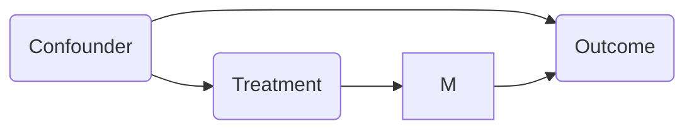
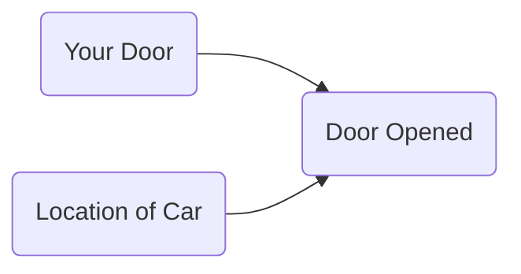

* TOC
{:toc}
---

*Some notes on causal inference both from introductory courses following the neyman-rubin school of thought and based on Judea Pearl's ladder of causality*

# basics

- when using observational (non-experimental) data to make causal inferences, the key problem is **confounding** - difference between groups other than the treatment which affects the response
  - *stratification* = *cross-tabulation* - only look at when confounding variables have same value
- [bradford hill criteria](https://en.wikipedia.org/wiki/Bradford_Hill_criteria) - some simple criteria for establishing causality (e.g. strength, consistency, specificity)
- association is circumstantial evidence for causation
- problem: never get to see gt
- groundtruth: randomized control trial (RCT) - controls for any possible confounders

## 2 general approaches

1. matching - find patients that are similar and differ only in the treatment
   1. only variables you don't match on could be considered causal
2. regression adjustments
   - requires *unconfoundedness* = *omitted variable bias*
   - if there are no confounders, correlation is causation

## common examples

- HIP trial of mammography - want to do whole treatment group v. whole control group
- Snow on cholera - water
- causes of poverty - Yul's model, changes with lots of things
- liver transplant
  - maximize benefit (life with - life without)
  - currently just goes to person who would die quickest without
  - Y = T Y(1) + (1-T) Y(0)
    - Y(1) = survival with transplant
    - Y(0) = survival w/out transplant
      - fundamental problem of causal inference - can 't observe Y(1) and Y(0)
    - T = 1 if receive transplant else 0
  - goal: estimate $\tau = Y(1) - Y(0)$ for each person

# neyman-rubin basics

- 
- 3 frameworks
  1. neyman-rubin model: $Y_i = T_i a_i + (1-T_i) b_i$
    - $\hat{ate} = \hat{a}_A - \hat{b}_B$
    - $\hat{ate}_{adj} = [\bar{a}_A - (\bar{x}_A - \bar{x})^T \hat{\theta}_A] - [\bar{b}_B - (\bar{x}_B - \bar{x})^T \hat{\theta}_B]$
      - $\hat{\theta}_A = argmin \sum_{i \in A} (a_i - \bar{a}_A - (x_i - \bar{x}_A)^T \theta)^2$

  2. neyman-pearson
    - null + alternative hypothesis
      - null is favored unless there is strong evidence to refute it
  3. fisherian testing framework
    - small p-values evidence against null hypothesis
    - null hypothesis
- natural experiments
  - ex. john snow
- *propensity score* - probability that a subject recieving a treatment is valid after conditioning on appropriate covariates
- 3 principles of experimental design
  1. replication
  2. randomization
  3. conditioning

# causality graphs causal inference

- more from the book of why
- [blog post on causal ladder](http://smithamilli.com/blog/causal-ladder/)
- [intro to do-calculus post](https://www.inference.vc/untitled/) and subsequent posts

## 1- **prediction/association** - just need to have the joint distr. of all the variables

- basically just $p(y|x)$

## 2 - **intervention** - we can change things and get conditionals based on evidence **after intervention**

- $p(y|do(x))$ - which represents the conditional distr. we would get if we were to manipulate $x$ in a randomized trial
  - to get this, we assume the causal structure (can still kind of test it based on conditional distrs., can sometimes use causal discovery techniques to try to identify the causal diagram under just some smoothness / independence assumptions)
  - having assumed the structure, we delete all edges going into a do operator and set the value of $x$
  - then, do-calculus yields a formula to estimate $p(y|do(x))$ assuming this causal structure
    - 3 rules which go from do-calculus to probability expressiom (remove do operator from statement and allow us to calculate it)
  - see introductory paper [here](https://arxiv.org/pdf/1305.5506.pdf), more detailed paper [here](https://ftp.cs.ucla.edu/pub/stat_ser/r416-reprint.pdf) (pearl 2013)
- by assuming structure, we learn how large impacts are

## 3 - **counterfactuals** - we can change things and get conditionals based on evidence **before intervention**
- probablilistic answer to a "what would have happened if" question
- very similar to neyman's potential outcome framework
- simple matching is often not sufficient (need a very good model for how to match, hopefully a causal one)
- this is for a specific data point, not a randomly sampled data point like an intervention would be
  - instead of intervention $p(y|do(x))$ we get $p(y^*|x^*, z=z)$ where z represents fixing all the other variables and $y^*$ and $x^*$ are not observed
  - averaging over all data points, we'd expect to get something similar to the intervention $p(y|do(x))$
- requires SEM - structured equation model not just causal graph
  - this is set of equations which tell how to compute value of each node given parents (and maybe some noise $\epsilon$ for each node)
  - again, fix value of $x$ (and values of $\epsilon$ seend in the data) and use SEM to set all downstream variables
- this allows for our intervention to contradict something we condition on 
	- 	e.g. "Given that Hillary lost and didn't visit Michigan, would she win if she had visited Michigan?"
	- 	e.g. “What fraction of patients who are treated and died would have survived if they were not treated?”
- 	exogenous nodes - node in the network that represents all the data note collected

## technical notes

- **case-control study** - retrospective - compares "cases" (people with a disease) to controls
- **sensitivity analysis** - instead of drawing conclusions by assuming the absence of certain causal relationships, challenge such assumptions and evaluate how strong altervnative relationships must be in order to explain the observed data
- **regression-based adjustment** - if we know the confounders, can just regress on the confounders and the treatment and the coefficient for the treatment (the partial regression coefficient) will give us the average causal effect)
  - works only for linear models
- **back-door criterion** - want to deconfound 2 variables X and Y: http://bayes.cs.ucla.edu/BOOK-2K/ch3-3.pdf
  - ensure that there is no path which points to X which allows dependence between X and Y ( paths which point to X are non-causal, representing confounders )
  - remember, in DAG junctions conditioning makes things independent unless its at a V junction
- **front-door criterion** - want to deconfound treatment from outcome, even without info on the confounder
  - only really need to know about treatment, M, and outcome

- **instrumental variables** - variable which can be used to effectively due a RCT because it was made random by some external factor
  - ex. army draft, john snow's cholera study

## historical notes

- key problem: no language to write causal relationships 
- counter factual: set value but erase all arrows going into the variable which we set (everything else the same)
- do causal diagrams exist in brain?
- regression to the mean - galton and pearson originally discover correlation instead of causation
- sewall wright studying guinea pigs uses causation to predict correlations (path analysis)
- path analysis became structural equation modeling

## paradox examples

- monty hall problem: why you should switch

- berkson's paradox - diseases in hospitals are correlated even when they are not in the general population
  - possible explanation - only having both diseases together is strong enough to put you in the hospital
- simpson's paradox - see plot above where lines decrease given conditioning but increase overall
