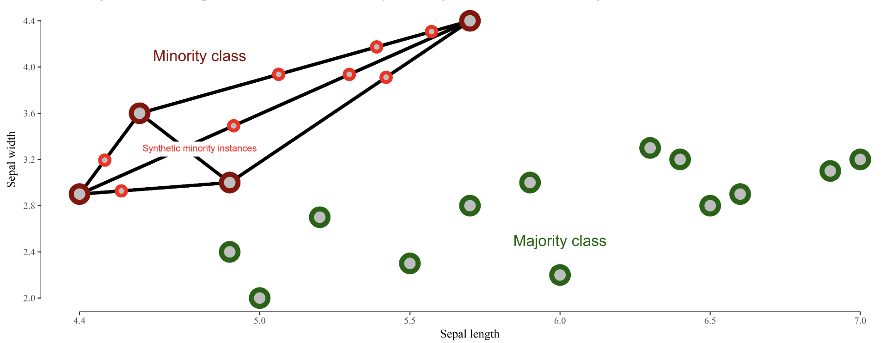

{:toc}

# pqrs

- Goal: *inference* - conclusion or opinion formed from evidence
- *PQRS*
  - P - population
  - Q - question - 2 types
    1. hypothesis driven - does a new drug work
    2. discovery driven - find a drug that works
  - R - representative data colleciton
    - simple random sampling = *SRS*
      - w/ replacement: $var(\bar{X}) = \sigma^2 / n$
      - w/out replacement: $var(\bar{X}) = (1 - \frac{n}{N}) \sigma^2 / n$ 
  - S - scrutinizing answers

# visual summaries

- numerical summaries
  - mean vs. median
  - sd vs. iq range
- visual summaries
  - histogram
  - *kernel density plot* - Gaussian kernels
    - with *bandwidth* h $K_h(t) = 1/h K(t/h)$
- plots
  1. box plot / pie-chart
  2. scatter plot / q-q plot
    - *q-q plot* = *probability plot* - easily check normality
      - plot percentiles of a data set against percentiles of a theoretical distr.
      - should be straight line if they match
  3. transformations = feature engineering
    - log/sqrt make long-tail data more centered and more normal
    - **delta-method** - sets comparable bw (wrt variance) after log or sqrt transform: $Var(g(X)) \approx [g'(\mu_X)]^2 Var(X)$ where $\mu_X = E(X)$
    - if assumptions don't work, sometimes we can transform data so they work
    - *transform x* - if residuals generally normal and have constant variance 
      - *corrects nonlinearity*
    - *transform y* - if relationship generally linear, but non-constant error variance
      - *stabilizes variance*
    - if both problems, try y first
    - Box-Cox: Y' = $Y^l \: if \: l \neq 0$, else log(Y)
  4. *least squares*
    - inversion of pxp matrix ~O(p^3)
    - regression effect - things tend to the mean (ex. bball children are shorter)
    - in high dims, l2 worked best
  5. kernel smoothing + lowess
    - can find optimal bandwidth
    - *nadaraya-watson kernel smoother* - locally weighted scatter plot smoothing
      - $$g_h(x) = \frac{\sum K_h(x_i - x) y_i}{\sum K_h (x_i - x)}$$ where h is bandwidth
    - *loess* - multiple predictors / *lowess* - only 1 predictor
      - also called *local polynomial smoother* - locally weighted polynomial
      - take a window (span) around a point and fit weighted least squares line to that point
      - replace the point with the prediction of the windowed line
      - can use local polynomial fits rather than local linear fits
  6. *silhouette plots* - good clusters members are close to each other and far from other clustersf

     1. popular graphic method for K selection
     2. measure of separation between clusters $s(i) = \frac{b(i) - a(i)}{max(a(i), b(i))}$
       1. a(i) - ave dissimilarity of data point i with other points within same cluster
       2. b(i) - lowest average dissimilarity of point i to any other cluster
     3. good values of k maximize the average silhouette score
  7. lack-of-fit test - based on repeated Y values at same X values

# dealing with imbalanced data

1. randomly oversample minority class
2. randomly undersample majority class
3. weighting classes in the loss function - more efficient, but requires modifying model code
4. generate synthetic minority class samples
   1. [smote](https://jair.org/index.php/jair/article/view/10302) (chawla et al. 2002) - interpolate betwen points and their nearest neighbors (for minority class) - some heuristics for picking which points to interpolate
      1. [adasyn](https://ieeexplore.ieee.org/abstract/document/4633969/) (he et al. 2008) - smote, generate more synthetic data for minority examples which are harder to learn (number of samples is proportional to number of nearby samples in a different class)
   2. [smrt](https://github.com/tgsmith61591/smrt) - generate with vae
5. selectively removing majority class samples
   1. [tomek links](https://pdfs.semanticscholar.org/090a/6772a1d69f07bfe7e89f99934294a0dac1b9.pdf?_ga=2.141687734.587787484.1573518991-2102528433.1505064485) (tomek 1976) - selectively remove majority examples until al lminimally distanced nearest-neighbor pairs are of the same class
   2. [near-miss](https://www.site.uottawa.ca/~nat/Workshop2003/jzhang.pdf) (zhang & mani 2003) - select samples from the majority class which are close to the minority class. Example: select samples from the majority class for which the average distance of the N *closest* samples of a minority class is smallest
   3. [edited nearest neighbors](https://ieeexplore.ieee.org/abstract/document/4309137) (wilson 1972) - "edit" the dataset by removing samples that don't agree "enough" with their neighborhood
6. feature selection and extraction
   1. minority class samples can be discarded as noise - removing irrelevant features can reduce this risk
   2. feature selection - select a subset of features and classify in this space
   3. feature extraction - extract new features and classify in this space
   4. ideas
      1. use majority class to find different low dimensions to investigate
      2. in this dim, do density estimation
      3. residuals - iteratively reweight these (like in boosting) to improve performance
7. incorporate sampling / class-weighting into ensemble method (e.g. treat different trees differently)
   1. ex. undersampling + ensemble learning (e.g. [IFME](https://dl.acm.org/citation.cfm?id=2467736), Becca's work)
8. algorithmic classifier modifications
9. misc papers
   1. [enrichment](https://arxiv.org/pdf/1911.06965v1.pdf) (jegierski & saganowski 2019) - add samples from an external dataset
10. ref
   1. [imblanced-learn package](https://imbalanced-learn.readthedocs.io/en/stable/api.html) with several methods for dealing with imbalanced data
   2. [good blog post](https://www.jeremyjordan.me/imbalanced-data/)
   3. [Learning from class-imbalanced data: Review of methods and applications](https://www-sciencedirect-com.libproxy.berkeley.edu/science/article/pii/S0957417416307175) (Haixiang et al. 2017)
   4. sample majority class w/ density (to get best samples)
   5. log-spline - doesn't scale

# feature selection

- select k-best based on summary statistic
	- variance threshold
	- chi$^2$, mutual info, f anova, correlation screening
- select from a model
	- tree, lasso
- recursive feature elimination
	- keep retraining and removing features
