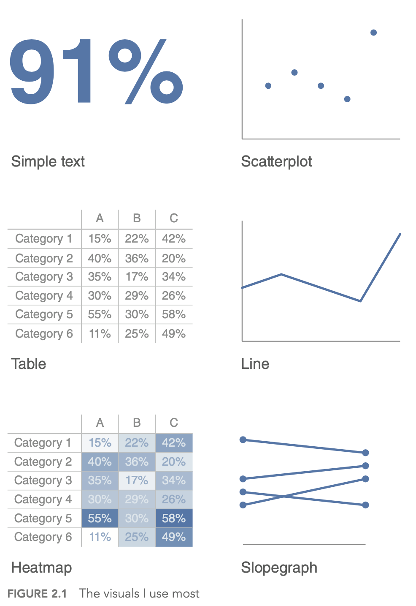
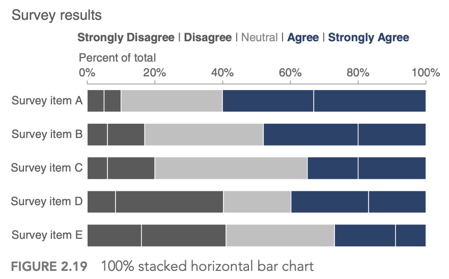
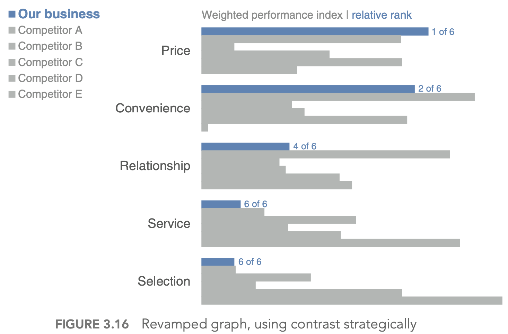
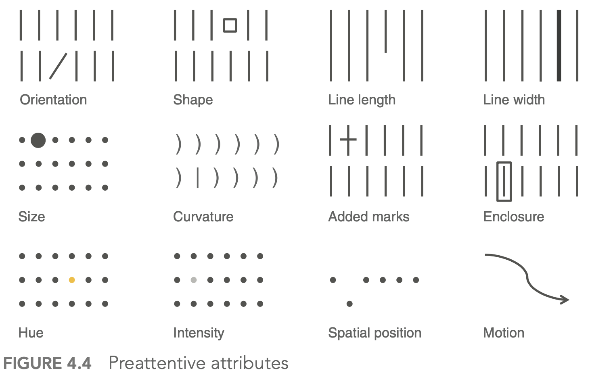

{:toc}

# pqrs

- Goal: *inference* - conclusion or opinion formed from evidence
- *PQRS*
  - P - population
  - Q - question - 2 types
    1. hypothesis driven - does a new drug work
    2. discovery driven - find a drug that works
  - R - representative data colleciton
    - simple random sampling = *SRS*
      - w/ replacement: $var(\bar{X}) = \sigma^2 / n$
      - w/out replacement: $var(\bar{X}) = (1 - \frac{n}{N}) \sigma^2 / n$ 
  - S - scrutinizing answers

# visualization

First 5 parts here are based on the book [storytelling with data](http://www.storytellingwithdata.com/) by cole nussbaumer knaflic

- difference between showing data + storytelling with data

## understand the context (1)

- who is your audience? what do you need them to know/do?
- **exploratory** vs **explanatory** analysis
- slides (need little details) vs email (needs lots of detail) - usually need to make both in slideument
- should know how much nonsupporting data to show
- distill things down into a 3-minute story or a 1-sentence Big Idea
- easiest to start things on paper/post-it notes

## choose an effective visual (2)

|  |  |
| ------------------------------------------------------------ | ------------------------------------------------------------ |
|  |  |
|  |  |
|  |  |

- generally avoid pie/donut charts, 3D charts, 2nd y-axes
- tables
  - best for when people will actually read off numbers
  - minimalist is best
- bar charts should basically always start at 0
  - horizontal charts typically easy to read
- on axes, retain things like dollar signs, percent, etc.

## eliminate clutter (3)

- gestalt principles of  vision
  - proximity - close things are grouped
  - similarity - similar things are grouped
  - connection - connected things are grouped
  - enclosure
  - closure
  - continuity
- generally good to have titles and such at top-left!
- diagonal lines / text should be avoided
  - center-aligned text should be avoided
- label lines directly

## focus attention (4)

- visual hierarchy - outlines what is important

## tell a story / think like a designer (5)

- affordances - aspects that make it obvious how something will be used (e.g. a button affords pushing)
- “You know you’ve achieved perfection, not when you have nothing more to add, but when you have nothing to take away” (Saint‐Exupery, 1943)
- stories have different parts, which include conflict + tension
  - beginning - introduce a problem / promise
  - middle - what could be
  - end - call to action
- horizontal logic - people can just read title slides and get out what they need
- can either convince ppl through conventional rhetoric or through a story

## visual summaries

- numerical summaries
  - mean vs. median
  - sd vs. iq range
- visual summaries
  - histogram
  - *kernel density plot* - Gaussian kernels
    - with *bandwidth* h $K_h(t) = 1/h K(t/h)$
- plots
  1. box plot / pie-chart
  2. scatter plot / q-q plot
    - *q-q plot* = *probability plot* - easily check normality
      - plot percentiles of a data set against percentiles of a theoretical distr.
      - should be straight line if they match
  3. transformations = feature engineering
    - log/sqrt make long-tail data more centered and more normal
    - **delta-method** - sets comparable bw (wrt variance) after log or sqrt transform: $Var(g(X)) \approx [g'(\mu_X)]^2 Var(X)$ where $\mu_X = E(X)$
    - if assumptions don't work, sometimes we can transform data so they work
    - *transform x* - if residuals generally normal and have constant variance 
      - *corrects nonlinearity*
    - *transform y* - if relationship generally linear, but non-constant error variance
      - *stabilizes variance*
    - if both problems, try y first
    - Box-Cox: Y' = $Y^l \: if \: l \neq 0$, else log(Y)
  4. *least squares*
    - inversion of pxp matrix ~O(p^3)
    - regression effect - things tend to the mean (ex. bball children are shorter)
    - in high dims, l2 worked best
  5. kernel smoothing + lowess
    - can find optimal bandwidth
    - *nadaraya-watson kernel smoother* - locally weighted scatter plot smoothing
      - $$g_h(x) = \frac{\sum K_h(x_i - x) y_i}{\sum K_h (x_i - x)}$$ where h is bandwidth
    - *loess* - multiple predictors / *lowess* - only 1 predictor
      - also called *local polynomial smoother* - locally weighted polynomial
      - take a window (span) around a point and fit weighted least squares line to that point
      - replace the point with the prediction of the windowed line
      - can use local polynomial fits rather than local linear fits
  6. *silhouette plots* - good clusters members are close to each other and far from other clustersf

     1. popular graphic method for K selection
     2. measure of separation between clusters $s(i) = \frac{b(i) - a(i)}{max(a(i), b(i))}$
       1. a(i) - ave dissimilarity of data point i with other points within same cluster
       2. b(i) - lowest average dissimilarity of point i to any other cluster
     3. good values of k maximize the average silhouette score
  7. lack-of-fit test - based on repeated Y values at same X values

# imbalanced data

1. randomly oversample minority class
2. randomly undersample majority class
3. weighting classes in the loss function - more efficient, but requires modifying model code
4. generate synthetic minority class samples
   1. [smote](https://jair.org/index.php/jair/article/view/10302) (chawla et al. 2002) - interpolate betwen points and their nearest neighbors (for minority class) - some heuristics for picking which points to interpolate
      1. [adasyn](https://ieeexplore.ieee.org/abstract/document/4633969/) (he et al. 2008) - smote, generate more synthetic data for minority examples which are harder to learn (number of samples is proportional to number of nearby samples in a different class)
   2. [smrt](https://github.com/tgsmith61591/smrt) - generate with vae
5. selectively removing majority class samples
   1. [tomek links](https://pdfs.semanticscholar.org/090a/6772a1d69f07bfe7e89f99934294a0dac1b9.pdf?_ga=2.141687734.587787484.1573518991-2102528433.1505064485) (tomek 1976) - selectively remove majority examples until al lminimally distanced nearest-neighbor pairs are of the same class
   2. [near-miss](https://www.site.uottawa.ca/~nat/Workshop2003/jzhang.pdf) (zhang & mani 2003) - select samples from the majority class which are close to the minority class. Example: select samples from the majority class for which the average distance of the N *closest* samples of a minority class is smallest
   3. [edited nearest neighbors](https://ieeexplore.ieee.org/abstract/document/4309137) (wilson 1972) - "edit" the dataset by removing samples that don't agree "enough" with their neighborhood
6. feature selection and extraction
   1. minority class samples can be discarded as noise - removing irrelevant features can reduce this risk
   2. feature selection - select a subset of features and classify in this space
   3. feature extraction - extract new features and classify in this space
   4. ideas
      1. use majority class to find different low dimensions to investigate
      2. in this dim, do density estimation
      3. residuals - iteratively reweight these (like in boosting) to improve performance
7. incorporate sampling / class-weighting into ensemble method (e.g. treat different trees differently)
   1. ex. undersampling + ensemble learning (e.g. [IFME](https://dl.acm.org/citation.cfm?id=2467736), Becca's work)
8. algorithmic classifier modifications
9. misc papers
   1. [enrichment](https://arxiv.org/pdf/1911.06965v1.pdf) (jegierski & saganowski 2019) - add samples from an external dataset
10. ref
   1. [imblanced-learn package](https://imbalanced-learn.readthedocs.io/en/stable/api.html) with several methods for dealing with imbalanced data
   2. [good blog post](https://www.jeremyjordan.me/imbalanced-data/)
   3. [Learning from class-imbalanced data: Review of methods and applications](https://www-sciencedirect-com.libproxy.berkeley.edu/science/article/pii/S0957417416307175) (Haixiang et al. 2017)
   4. sample majority class w/ density (to get best samples)
   5. log-spline - doesn't scale

# missing-data imputation

- Missing value imputation: a review and analysis of the literature ([lin & tsai 2019](https://link.springer.com/article/10.1007/s10462-019-09709-4))
- Causal Inference: A Missing Data Perspective ([ding & li, 2018](https://arxiv.org/abs/1712.06170))
- different missingness mechanisms ([little & rubin, 1987](https://www.jstor.org/stable/1165119))
  - MCAR = missing completely at random - no relationship between the missingness of the data and any values, observed or missing
  - MAR = missing at random - propensity of missing values depends on *observed* data, but *not* the missing data
    - can easily test for this vs MCAR
  - MNAR = missing not at random - propensity of missing values depends both on observed and unobserved data
  - connections to causal: MCAR is much like randomization, MAR like ignorability (although slightly more general), and MNAR like unmeasured unconfounding
- imputation problem: propensity of missing values depends on the unobserved values themselves (not ignorable)
  - simplest approach: drop rows with missing vals
  - mean/median imputation
  - probabilistic approach
    - EM approach, MCMC, GMM, sampling
  - matrix completion: low-rank, PCA, SVD
  - nearest-neighbor / matching: hot-deck
  - (weighted) prediction approaches
    - linear regr, LDA, naive bayes, regr. trees
    - can do weighting using something similar to inverse propensities, although less common to check things like covariate balance
  - multiple imputation: impute multiple times to get better estimates
    - MICE (passes / imputes data multiple times sequentially)
- can perform sensitivity analysis to evaluate the assumption that things are not MNAR
  - two standard models for nonignorable missing data are the *selection* models and the *pattern-mixture* models ([Little and Rubin, 2002](https://books.google.com/books?hl=en&lr=&id=BemMDwAAQBAJ&oi=fnd&pg=PR11&dq=Little,+R.+J.+and+Rubin,+D.+B.+(2002).+Statistical+analysis+with+missing+data.+John+Wiley+%26+Sons.&ots=FByXa-CVWU&sig=jIjvaI90RNK1rNfJoKoGvGJsz-E#v=onepage&q=Little%2C%20R.%20J.%20and%20Rubin%2C%20D.%20B.%20(2002).%20Statistical%20analysis%20with%20missing%20data.%20John%20Wiley%20%26%20Sons.&f=false), Chapter 15)
- performance evaluation
  - acc at finding missing vals
  - acc in downstream task
- applications
  - Purposeful Variable Selection and Stratification to Impute Missing FAST Data in Trauma Research ([fuchs et al. 2014](https://www.ncbi.nlm.nih.gov/pmc/articles/PMC3744188/))

## matrix completion

- A Survey on Matrix Completion: Perspective of Signal Processing ([li...zhao, 2019](https://arxiv.org/pdf/1901.10885.pdf))

  - formulations
    - Exact matrix completion via convex optimization ([candes & recht, 2012](https://dl.acm.org/doi/abs/10.1145/2184319.2184343))
      - $\min _{\boldsymbol{M}} \operatorname{rank}(\boldsymbol{M})$, s.t. $\left\|\boldsymbol{M}_{\Omega}-\boldsymbol{X}_{\Omega}\right\|_F \leq \delta$: - this is NP-hard
    - nuclear norm approxmiation
      - $\min _{\boldsymbol{M}}\|\boldsymbol{M}\|_*$, s.t. $||\boldsymbol{M}_{\Omega}-\boldsymbol{X}_{\Omega}||_F \leq \delta$
      - this has be formulated as semidefinite programming, nuclear norm relaxation, or robust PCA
    - minimum rank approximation helps with the assumption that the data are corrupted by noise (e.g. ADMiRA ([lee & bresler, 2010](https://ieeexplore.ieee.org/abstract/document/5550497/)))
      - $\min _{\boldsymbol{M}}\left\|(\boldsymbol{M})_{\Omega}-\boldsymbol{X}_{\Omega}\right\|_F^2$, s.t. $\operatorname{rank}(\boldsymbol{M}) \leq r$
    - matrix factorization is a faster but non-convex approximation (e.g. LMaFit ([wen, yin, & zhang, 2012](https://link.springer.com/article/10.1007/s12532-012-0044-1)))
      - $\min _{\boldsymbol{U}, \boldsymbol{V}, \boldsymbol{Z}}\left\|\boldsymbol{U} \boldsymbol{V}^T-\boldsymbol{Z}\right\|_F^2$, s.t. $\boldsymbol{Z}_{\Omega}=\boldsymbol{X}_{\Omega}$
    - $\ell_p$-Norm minimization - use a different norm than Frobenius to handle specific types of noise
    - Adaptive outlier pruning ([yan, yang, & osher, 2013](https://link.springer.com/article/10.1007/s10915-013-9682-3)) - better handles outliers
  - algorithms
    - gradient-based
      - gradient descent
      - accelerated proximal descent
      - bregman iteration
    - non-gradient
      - block coordinate descent
      - ADMM: alterntating direction method of multipliers

- Newer approaches

  - Simple, Fast, and Flexible Framework for Matrix Completion with Infinite Width Neural Networks ([radhakrishnan...belkin, uhler, 2022](https://arxiv.org/abs/2108.00131)) - use NTK for FCN/CNN to do matrix completion
  - Graph Convolutional Matrix Completion ([van den berg, kipf, & welling, 2017](https://arxiv.org/abs/1706.02263))
  - Transformer methods for image inpainting (e.g. mask-aware tranfsormer, [2022]())

  

# preprocessing

- often good to discretize/binarize features
  - e.g. [from genomics](http://cis.jhu.edu/people/faculty/geman/publications/pdf/Digitizing_omics_profiles_by_divergence_from_a_baseline.pdf)

- whitening

  - get decorrelated features $Z$ from inputs $X$

  - $W=$ whitening matrix , selected based on problem goals:
    - PCA: Maximal compression of $\mathbf{X}$ in $\mathbf{Z}$
      - ZCA: Maximal similarity between $\mathbf{X}$ and $\mathbf{Z}$
      - Cholesky: Inducing structure: $\operatorname{Cov}(X, Z)$ is lower-triangular with positive diagonal elements
      - $W$ is constrained as to enforce $\Sigma_{Z}=I$

# principles

## breiman

- conversation
  - moved sf -> la -> caltech (physics) -> columbia (math) -> berkeley (math)
  - info theory + gambling
  - CART, ace, and prob book, bagging
  - ucla prof., then consultant, then founded stat computing at berkeley
  - lots of cool outside activities
    - ex. selling ice in mexico
- 2 cultures paper
  1. *generative* - data are generated by a given stochastic model
    - stat does this too much and needs to move to 2
    - ex. assume y = f(x, noise, parameters)
    - validation: goodness-of-fit and residuals
  2. *predictive* - use algorithmic model and data mechanism unknown
    - assume nothing about x and y
    - ex. generate P(x, y) with neural net
    - validation: prediction accuracy
  - axioms
    1. Occam
    2. *Rashomon* - lots of different good models, which explains best?
      - ex. rf is not robust at all
    3. *Bellman* - curse of dimensionality
      - might actually want to increase dimensionality (ex. svms embedded in higher dimension)
  - industry was problem-solving, academia had too much culture

## box + tukey

- questions
  1. what points are relevant and irrelevant today in both papers? 
    - relevant
      - box
        - thoughts on scientific method
        - solns should be simple
        - necessity for developing experimental design
        - flaws (cookbookery, mathematistry)
      - tukey
        - separating data analysis and stats
        - all models have flaws
        - no best models
        - lots of goold old techniques (e.g. LSR)
    - irrelevant
      - some of the data techniques (I think)
      - tukey multiple-response data has been better attacked (graphical models)
  2. how do you think the personal traits of Tukey and Box relate to the scientific opinions expressed in their papers?
    - probably both pretty critical of the science at the time
    - box - great respect for Fisher
    - both very curious in different fields of science
  3. what is the most valuable msg that you get from each paper?
    - box - data analysis is a science
    - tukey - models must be useful
      - no best models
      - find data that is useful
      - no best models
- box_79 "science and statistics"
  - scientific method - iteration between theory and practice
    - learning - discrepancy between theory and practice
    - solns should be simple
  - fisher - founder of statistics (early 1900s)
    - couples math with applications
    - data analysis - subiteration between tentative model and tentative analysis
    - develops experimental design
  - flaws
    - *cookbookery* - forcing all problems into 1 or 2 routine techniques
    - *mathematistry* - development of theory for theory's sake
- tukey_62 "the future of data analysis"
  - general considerations
    - data analysis - different from statistics, is a science
    - lots of techniques are very old (LS - Gauss, 1803)
    - all models have flaws
    - no best models
    - must teach multiple data analysis methods
  - spotty data - lots of irregularly non-constant variability
    - could just trim highest and lowest values
      - *winzorizing* - replace suspect values with closest values that aren't
    - must decide when to use new techniques, even when not fully understood
    - want some automation
    - FUNOP - fulll normal plot
      - can be visualized in table
  - spotty data in more complex situations
    
    - FUNOR-FUNOM
  - multiple-response data
    - understudied except for factor analysis
    - multiple-response procedures have been modeled upon how early single-response procedures were supposed to have been used, rather than upon how they were in fact used
    - factor analysis
      1. reduce dimensionality with new coordinates
      2. rotate to find meaningful coordinates
      
      - can use multiple regression factors as one factor if they are very correlated
    - regression techniques always offer hopes of learning more from less data than do variance-component techniques
  - flexibility of attack
    
    - ex. what unit to measure in

## models

- normative - fully interpretable + modelled
  - idealized
  - probablistic
- ~mechanistic - somewhere in between
- descriptive - based on reality
  - empirical

## exaggerated claims

- [video](https://www.youtube.com/watch?time_continue=4&v=PwCyvSDkUCY&feature=emb_logo) by Rob Kass
- concepts are ambiguous and have many mathematical instantiations
  - e.g. "central tendency" can be mean or median
  - e.g. "information" can be mutual info (reduction in entropy) or squared correlation (reduction in variance)
  - e.g. measuring socioeconomic status and controlling for it
- regression "when controlling for another variable" makes causal assumptions
  - must make sure that everything that could confound is controlled for
- Idan Segev: "modeling is the lie that reveals the truth"
  - picasso: "art is the lie that reveals the truth"
- box: "all models are wrong but some are useful" - statistical pragmatism
  - moves **from true to useful** - less emphasis on truth
  - "truth" is contingent on the purposes to which it will be put
- the scientific method aims to provide explanatory models (theories) by collecting and analyzing data, according to protocols, so that
  - the data provide info about models
  - replication is possible
  - the models become increasingly accurate
- scientific knowledge is always uncertain - depends on scientific method