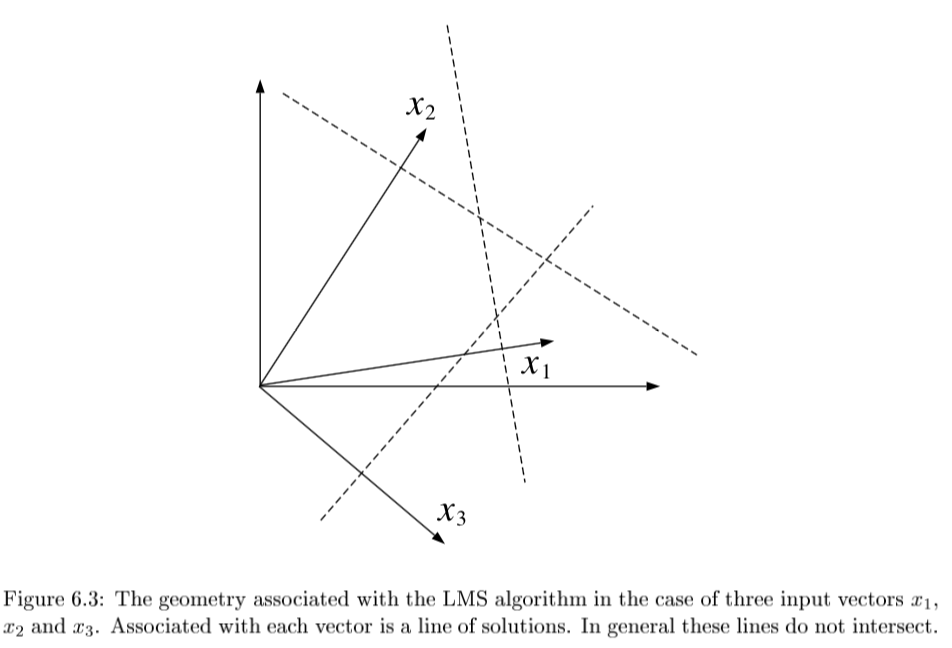

{:toc}

# introduction

- $Y = X \beta + \epsilon$

  | type of linear regression | X            | Y                |
  | ------------------------- | ------------ | ---------------- |
  | simple                    | univariate   | univariate       |
  | multiple                  | multivariate | univariate       |
  | multivariate              | either       | multivariate     |
  | generalized               | either       | error not normal |

- minimize: $L(\theta) = \|\|Y-X\beta\|\|_2^2 \implies \hat{\theta} = (X^TX)^{-1} X^TY$

- 2 proofs

  1. set deriv and solve
  2. use projection matrix H to show HY is proj of Y onto R(X)
     1. the projection matrix maps the responses to the predictions: $\hat{y} = Hy$

  - define projection (hat) matrix $H = X(X^TX)^{-1} X^T$
    - show $\|\|Y-X \theta\|\|^2 \geq \|\|Y - HY\|\|^2$
    - key idea: subtract and add $HY$

- interpretation
  - if feature correlated, weights aren't stable / can't be interpreted
  - curvature inverse $(X^TX)^{-1}$ - dictates stability
  - feature importance = weight * feature value
- LS doesn't work when p >> n because of colinearity of X columns
- assumptions
  - $\epsilon \sim N(X\beta,\sigma^2)$
  - *homoscedasticity*: $\text{var}(Y_i\|X)$ is the same for all i
    - opposite is *heteroscedasticity*
- normal linear regression
  - variance MLE $\hat{\sigma}^2 = \sum (y_i - \hat{\theta}^T x_i)^2 / n$
    - in unbiased estimator, we divide by n-p
  - LS has a distr. $N(\theta, \sigma^2(X^TX)^{-1})$
- linear regression model
  - when n is large, LS estimator ahs approx normal distr provided that X^TX /n is approx. PSD
- *weighted LS*: minimize $\sum [w_i (y_i - x_i^T \theta)]^2$
  - $\hat{\theta} = (X^TWX)^{-1} X^T W Y$
  - heteroscedastic normal lin reg model: erorrs ~ N(0, 1/w_i)
- *leverage scores* - measure how much each $x_i$ influences the LS fit
  - for data point i, $H_{ii}$ is the leverage score
- *LAD (least absolute deviation)* fit
  - MLE estimator when error is Laplacian

# freedman notes

## regularization

- when $(X^T X)$ isn't invertible can't use normal equations and gradient descent is likely unstable
  - X is nxp, usually n >> p and X almost always has rank p
  - problems when n < p
- intuitive way to fix this problem is to reduce p by getting rid of features
- a lot of papers assume your data is already zero-centered
  - conventionally don't regularize the intercept term

1. *ridge* regression (L2)
  - if $X^T X$ is not invertible, add a small element to diagonal
  - then it becomes invertible
  - small lambda -> numerical solution is unstable
  - proof of why it's invertible is difficult
  - argmin $\sum_i (y_i - \hat{y_i})^2+ \lambda \vert \vert \beta\vert \vert _2^2 $
  - equivalent to minimizing $\sum_i (y_i - \hat{y_i})^2$ s.t. $\sum_j \beta_j^2 \leq t$
  - solution is $\hat{\beta_\lambda} = (X^TX+\lambda I)^{-1} X^T y$
  - for small $\lambda$ numerical solution is unstable
  - When $X^TX=I$, $\beta _{Ridge} = \frac{1}{1+\lambda} \beta_{Least Squares}$
2. *lasso* regression (L1)
  - $\sum_i (y_i - \hat{y_i})^2+\lambda  \vert \vert \beta\vert \vert _1 $ 
  - equivalent to minimizing $\sum_i (y_i - \hat{y_i})^2$ s.t. $\sum_j \vert \beta_j\vert  \leq t$
  - lasso - least absolute shrinkage and selection operator - L1
  - acts in a nonlinear manner on the outcome y
  - keep the same SSE loss function, but add constraint of L1 norm
  - doesn't have closed form for Beta
    - because of the absolute value, gradient doesn't exist
    - can use directional derivatives
    - good solver is *LARS* - least angle regression
  - if tuning parameter is chosen well, will set lots of coordinates to 0
  - convex functions / convex sets (like circle) are easier to solve
  - disadvantages
    - if p>n, lasso selects at most n variables
    - if pairwise correlations are very high, lasso only selects one variable
3. *elastic net* - hybrid of the other two
  - $\beta_{Naive ENet} = \sum_i (y_i - \hat{y_i})^2+\lambda_1 \vert \vert \beta\vert \vert _1 + \lambda_2  \vert \vert \beta\vert \vert _2^2$ 
  - l1 part generates sparse model
  - l2 part encourages grouping effect, stabilizes l1 regularization path
    - grouping effect - group of highly correlated features should all be selected
  - naive elastic net has too much shrinkage so we scale $\beta_{ENet} = (1+\lambda_2) \beta_{NaiveENet}$
  - to solve, fix l2 and solve lasso

## the regression line (freedman ch 2)

- regression line
  - goes through $(\bar{x}, \bar{y})$
  - slope: $r s_y / s_x$
  - intercept: $\bar{y} - slope \cdot \bar{x}$
  - basically fits graph of averages (minimizes MSE)
- SD line
  - same except slope: $sign(r) s_y / s_x$
  - intercept changes accordingly
- for regression, MSE = $(1-r^2) Var(Y)$

## multiple regression (freedman ch 4)

- assumptions
  1. assume $n > p$ and X has full rank (rank p - columns are linearly independent)
  2. $\epsilon_i$ are iid, mean 0, variance $\sigma^2$
  3. $\epsilon$ independent of $X$
    - $e_i$ still orthogonal to $X$
- OLS is conditionally unbiased
  
  - $E[\hat{\theta} \| X] = \theta$
- $Cov(\hat{\theta}\|X) = \sigma^2 (X^TX)^{-1}$
  - $\hat{\sigma^2} = \frac{1}{n-p} \sum_i e_i^2$
    - this is unbiased - just dividing by n is too small since we have minimized $e_i$ so their variance is lower than var of $\epsilon_i$
- *random errors* $\epsilon$
- *residuals* $e$
- $H = X(X^TX)^{-1} X^T$
  1. e = (I-H)Y = $(I-H) \epsilon$
  2. H is symmetric
  3. $H^2 = H, (I-H)^2 = I-H$
  4. HX = X
  5. $e \perp X$
- basically H projects Y int R(X)
- $E[\hat{\sigma^2}\|X] = \sigma^2$
- random errs don't need to be normal
- variance
  - $var(Y) = var(X \hat{\theta}) + var(e)$
    - $var(X \hat{\theta})$ is the *explained variance*
    - *fraction of variance explained*: $R^2 = var(X \hat{\theta}) / var(Y)$
    - like summing squares by projecting
  - if there is no intercept in a regression eq, $R^2 = \|\|\hat{Y}\|\|^2 / \|\|Y\|\|^2$

# advanced topics

## BLUE

- drop assumption: $\epsilon$ independent of $X$
  - instead: $E[\epsilon\|X]=0, cov[\epsilon\|X] = \sigma^2 I$
  - can rewrite: $E[\epsilon]=0, cov[\epsilon] = \sigma^2 I$ fixing X
- *Gauss-markov thm* - assume linear model and assumption above: when X is fixed, OLS estimator is *BLUE* = best linear unbiased estimator
  - has smallest variance.
  - ***prove this***

## GLS = GLM

- GLMs roughly solve the problem where outcomes are non-Gaussian
  - mean is related to $w^tx$ through a link function (ex. logistic reg assumes sigmoid)
  - also assume different prob distr on Y (ex. logistic reg assumes Bernoulli)
- *generalized least squares regression model*: instead of above assumption, use $E[\epsilon\|X]=0, cov[\epsilon\|X] = G, \: G \in S^K_{++}$
  - covariance formula changes: $cov(\hat{\theta}_{OLS}\|X) = (X^TX)^{-1} X^TGX(X^TX)^{-1}$
  - estimator is the same, but is no longer BLUE - can correct for this:
    $(G^{-1/2}Y) = (G^{-1/2}X)\theta + (G^{-1/2}\epsilon)$
- *feasible GLS*=*Aitken estimator* - use $\hat{G}$
- examples
  - simple
  - iteratively reweighted
- 3 assumptions can break down:
  1. if $E[\epsilon\|X] \neq 0$ - GLS estimator is biased
  2. else if $cov(\epsilon\|X) \neq G$ - GLS unbiased, but covariance formula breaks down
  3. if G from data, but violates estimation procedure, estimator will be misealding estimate of cov

## path models

- *path model* - graphical way to represent a regression equation
- making causal inferences by regression requires a *response schedule*

## simultaneous equations

- *simultaneous-equation* models - use *instrumental variables / two-stage least squares*
  - these techniques avoid *simultaneity bias = endogeneity bias*

## binary variables

- indicator variables take on the value 0 or 1
  - *dummy coding* - matrix is singular so we drop the last indicator variable - called *reference* class / *baseline* class
  - effect coding
    - one vector is all -1s
    - B_0 should be weighted average of the class averages
  - orthogonal coding
- *additive effects* assume that each predictor’s effect on the response does not depend on the value of the other predictor (as long as the other one was fixed
  - assume they have the same slope
- *interaction effects* allow the effect of one predictor on the response to depend on the values of other predictors.
  - $y_i = β_0 + β_1x_{i1} + β_2x_{i2} + β_3x_{i1}x_{i2} + ε_i$

## LR with non-linear basis functions

- can have nonlinear basis functions (ex. polynomial regression)
- radial basis function - ex. kernel function (Gaussian RBF)
  - $\exp(-(x-r)^2 /  (2 \lambda ^2))$
- non-parametric algorithm - don't get any parameters theta; must keep data

## locally weighted LR (lowess)

- recompute model for each target point
- instead of minimizing SSE, we minimize SSE weighted by each observation's closeness to the sample we want to query

## kernel regression

- nonparametric method

- $\operatorname{E}(Y | X=x) = \int y f(y|x) dy = \int y \frac{f(x,y)}{f(x)} dy$

  Using the kernel density estimation for the joint distribution ''f(x,y)'' and ''f(x)'' with a kernel '''''K''''',

  $\hat{f}(x,y) = \frac{1}{n}\sum_{i=1}^{n} K_h\left(x-x_i\right) K_h\left(y-y_i\right)$
  $\hat{f}(x) = \frac{1}{n} \sum_{i=1}^{n} K_h\left(x-x_i\right)$
  

  we get

  $\begin{align} \operatorname{\hat E}(Y | X=x) &= \int \frac{y \sum_{i=1}^{n} K_h\left(x-x_i\right) K_h\left(y-y_i\right)}{\sum_{j=1}^{n} K_h\left(x-x_j\right)} dy,\\ &= \frac{\sum_{i=1}^{n} K_h\left(x-x_i\right) \int y \, K_h\left(y-y_i\right) dy}{\sum_{j=1}^{n} K_h\left(x-x_j\right)},\\ &= \frac{\sum_{i=1}^{n} K_h\left(x-x_i\right) y_i}{\sum_{j=1}^{n} K_h\left(x-x_j\right)},\end{align}$

## GAM = generalized additive model

- generalized additive models: assume mean output is sum of functions of individual variables (no interactions)
  - learn individual functions using splines
- $g(\mu) = b + f(x_0) + f(x_1) + f(x_2) + ...$
- can also add some interaction terms (e.g. $f(x_0, x_1)$)

## multicollinearity

- *multicollinearity* - predictors highly correlated
  - this affects fitted coefficients, potentially changing their values and even flipping their sign
- *variance inflation factor (VIF)* for a feature $X_j$ is $\frac{1}{1-R_j^2}$, where $R_j^2$ is obtained by predicting $X_j$ from all features excluding $X_j$
  - this measures the impact of multicollinearity on a feature coefficient
- Studying 
  - Variable Selection via Nonconcave Penalized Likelihood and Its Oracle Properties ([fan & li, 2001](https://www.jstor.org/stable/3085904)) - frame an estimator as "oracle" if:
    - it can correctly select the nonzero coefficients in a model with prob converging to one
    - and if the nonzero coefficients are asymptotically normal
  - AdaLasso: The Adaptive Lasso and Its Oracle Properties ([zou, 2006](http://users.stat.umn.edu/~zouxx019/Papers/adalasso.pdf))
    - can make lasso ""oracle" in the sense above by weighting each coef in the optimization
      - appropriate weight for each feature $X_j$ is simply $1/ \hat{\beta_j}$, where we attain $\beta_j$ from fitting OLS with no weights
- using marginal regression
  - A Comparison of the Lasso and Marginal Regression ([genovese...yao, 2011](https://www.stat.cmu.edu/~jiashun/Research/Area/Marginal.pdf))
  - Revisiting Marginal Regression ([genovese, jin, & wasserman, 2009](https://arxiv.org/abs/0911.4080))
  - Exact Post Model Selection Inference for Marginal Screening ([jason lee & taylor, 2014](https://proceedings.neurips.cc/paper/2014/hash/a0a080f42e6f13b3a2df133f073095dd-Abstract.html))
  
- SIS: Sure independence screening for ultrahigh dimensional feature space ([fan & lv, 2008](https://rss.onlinelibrary.wiley.com/doi/10.1111/j.1467-9868.2008.00674.x), 2k+ citations)
  - 2 steps (sometimes iterate these)
    1. Feature selection - select marginal features with largest absolute coefs (pick some threshold)
    2. Fit Lasso on selected features
  - Followups
    - Sure independence screening in generalized linear models with NP-dimensionality ([fan & song, 2010](https://projecteuclid.org/journals/annals-of-statistics/volume-38/issue-6/Sure-independence-screening-in-generalized-linear-models-with-NP-dimensionality/10.1214/10-AOS798.full))
    - Nonparametric independence screening in sparse ultra-high-dimensional additive models ([fan, feng, & song, 2011](https://www.tandfonline.com/doi/abs/10.1198/jasa.2011.tm09779))
  - RAR: Regularization after retention in ultrahigh dimensional linear regression models ([weng, feng, & qiao, 2017](https://arxiv.org/abs/1311.5625)) - only apply regularization on features not identified to be marginally important
    - Regularization After Marginal Learning for Ultra-High Dimensional Regression Models ([feng & yu, 2017](https://yangfeng.hosting.nyu.edu/publication/feng-2017-regularization/feng-2017-regularization.pdf)) - introduces 3-step procedure using a retention set, noise set, and undetermined set

# sums interpretation

- SST - total sum of squares - measure of total variation in response variable
  - $\sum(y_i-\bar{y})^2$
- SSR - regression sum of squares - measure of variation explained by predictors
  - $\sum(\hat{y_i}-\bar{y})^2$
- SSE - measure of variation not explained by predictors
  - $\sum(y_i-\hat{y_i})^2$
- SST = SSR + SSE
- $R^2 = \frac{SSR}{SST}$ - coefficient of determination
  - measures the proportion of variation in Y that is explained by the predictor

# geometry - J. 6

- *LMS* = *least mean squares* (p-dimensional geometries)

  - 
  - $y_n = \theta^T x_n + \epsilon_n$
  - $\theta^{(t+1)}=\theta^{(t)} + \alpha (y_n - \theta^{(t)T} x_n) x_n$
    - converges if $0 < \alpha < 2/||x_n||^2$
    - 
    - 
  - if N=p and all $x^{(i)}$ are lin. indepedent, then there exists exact solution $\theta$

- solving requires finding *orthogonal projection of y on column space of X* (n-dimensional geometries)

  - 

  1. 3 Pfs
     1. geometry - $y-X\theta^*$ must be orthogonal to columns of X: $X^T(y-X\theta)=0$
     2. minimize least square cost function and differentiate
     3. show HY projects Y onto col(X)

  - either of these approaches yield the *normal eqns*: $X^TX \theta^* = X^Ty$

- SGD

  - SGD converges to normal eqn

- ***convergence analysis***: requires $0 < \rho < 2/\lambda_{max} [X^TX]$

  - algebraic analysis: expand $\theta^{(t+1)}$ and take $t \to \infty$
  - geometric convergence analysis: consider contours of loss function

- weighted least squares: $J(\theta)=\frac{1}{2}\sum_n w_n (y_n - \theta^T x_n)^2$

  - yields $X^T WX \theta^* = X^T Wy$

- probabilistic interpretation

  - $p(y\|x, \theta) = \frac{1}{(2\pi\sigma^2)^{N/2}} exp \left( \frac{-1}{2\sigma^2} \sum_{n=1}^N (y_n - \theta^T x_n)^2 \right)$
  - $l(\theta; x,y) = - \frac{1}{2\sigma^2} \sum_{n=1}^N (y_n - \theta^T x_n)^2$
    - log-likelihood is equivalent to least-squares cost function

# likelihood calcs

## normal equation

- $L(\theta) = \frac{1}{2} \sum_{i=1}^n (\hat{y}_i-y_i)^2$
- $L(\theta) = 1/2 (X \theta - y)^T (X \theta -y)$
- $L(\theta) = 1/2 (\theta^T X^T - y^T) (X \theta -y)$ 
- $L(\theta) = 1/2 (\theta^T X^T X \theta - 2 \theta^T X^T y +y^T y)$ 
- $0=\frac{\partial L}{\partial \theta} = 2X^TX\theta - 2X^T y$
- $\theta = (X^TX)^{-1} X^Ty$

## ridge regression

- $L(\theta) = \sum_{i=1}^n (\hat{y}_i-y_i)^2+ \lambda \vert \vert \theta\vert \vert _2^2$ 
- $L(\theta) = (X \theta - y)^T (X \theta -y)+ \lambda \theta^T \theta$
- $L(\theta) = \theta^T X^T X \theta - 2 \theta^T X^T y +y^T y +  \lambda \theta^T \theta$ 
- $0=\frac{\partial L}{\partial \theta} = 2X^TX\theta - 2X^T y+2\lambda \theta$
- $\theta = (X^TX+\lambda I)^{-1} X^T y$