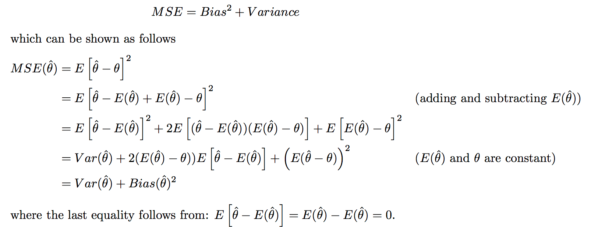

* TOC
{:toc}
- *material based on probability and statistics cookbook by matthias vallentin*

---

# models

- normative - fully interpretable + modelled
  - idealized
  - probablistic
- ~mechanistic - somewhere in between
- descriptive - based on reality
  - empirical

# error bars

- always write what you use
  - standard dev
  - standard error = standard dev / sqrt(n) = standard error of the mean when you're estimating a mean
  - 95% confidence interval = 2*standard error

# probability

- mutually exclusive: $P(AB)=0$
- independent: $P(AB) = P(A)P(B)$
  - A and B conditional independence given C: $$P(AB\vert C) = P(A\vert C) P(B\vert C)$$
- conditional (Bayes' thm): $P(A|B) = \frac{P(AB)}{P(B)} = \frac{P(B|A)P(A)}{\sum P(B|A)P(A)}$

# distributions

- PMF: $f_X(x) = P(X=x)$
- PDF: $P(a \leq X \leq b) = \int_a^b f(x) dx$

## multivariate gaussians - j 13

- 2 parameterizations ($x \in \mathbb{R}^n$)

  1. *canonical parameterization*: $$p(x\vert\mu, \Sigma) = \frac{1}{(2\pi )^{n/2} \vert\Sigma\vert^{1/2}} \exp\left[ -\frac{1}{2} (x-\mu)^T \Sigma^{-1} (x-\mu) \right]$$
  2. *moment parameterization*: $$p(x\vert\eta, \Omega) = \text{exp}\left( a + \eta^T x - \frac{1}{2} x^T \Omega x\right)$$ ~ also called information parameterization
  		- $\Omega = \Sigma^{-1}$	
	    - $\eta = \Sigma^{-1} \mu$

- joint distr - split parameters into block matrices

- want to *block diagonalize* the matrix
  - *Schur complement* of matrix M w.r.t. H: $M/H$
  - $\mu = \begin{bmatrix} \mu_1 \\ \mu_2 \end{bmatrix}$
  - $\Sigma = \begin{bmatrix} \Sigma_{11} & \Sigma_{12}\\ \Sigma_{21} & \Sigma_{22} \end{bmatrix}$
  - $p(x_1, x_2) = \underbrace{p(x_1|x_2)}_{\text{conditional}}\cdot\underbrace{p(x_2)}_{\text{marginal}}$
    - marginal
      - $\mu_2^m = \mu_2$
      - $\Sigma_2^m = \Sigma_{22}$
    - conditional
      - $\mu_{1|2}^c = \mu_1 + \Sigma_{12}\Sigma_{22}^{-1} (x_2 - \mu_2)$
      - $\Sigma_{1|2}^c = \Sigma_{11} - \Sigma_{12} \Sigma_{22}^{-1} \Sigma_{21}$
- mle

# expectation, variance, and correlation

- $E[X] = \int P(x)x dx$
  - $E[h(X)] \approx h(E[X])$
- $V[X] = E[(x-\mu)^2] = E[x^2]-E[x]^2$
  - for unbiased estimate, divide by n-1
  - $V(X_1-X_2) = V(X_1) + V(X_2)$ if $X_1,X_2$ independent
  - $V(a_1X_...+a_nX_n) =  \sum_{i=1}^{n}\sum_{j=1}^{n}a_ia_jcov(X_i,X_j)$
  - $V[h(X)] \approx h'(E[X])^2 V[X]$
  - standard deviation - sqrt of variance
  - standard error - error of the mean
- $Cov[X,Y] = E[(X-\mu_X)(Y-\mu_Y)] = E[XY]-E[X]E[Y]$
  - $Cov(aX+bY,Z) = aCov(X,Z)+bCov(Y,Z)$
- $Corr(Y,X) = \rho = \frac{Cov(Y,X)}{s_xs_y}$
  - $Corr(aX+b,cY+d) = Corr(X,Y)$ if a and c have same sign
  - $R^2 = \rho^2$
- **skewness** = $E[(\frac{X-\mu}{\sigma})^3]$

# inequalities

- *cauchy-schwarz*: $|x \cdot y| \leq ||x||\:||y||$
  - $E[XY]^2 \leq E[X^2] E[Y^2]$
- *triangle*: $\vert \vert x + y \vert \vert \leq \vert \vert x \vert \vert + \vert \vert y \vert \vert$
- *markov's*: $P(X \geq a) \leq \frac{E[X]}{a}$
  - X is typically running time of the algorithm
  - if we don't have E[X], can use upper bound for E[X]
- *chebyshev's*: $P(\vert X-\mu\vert  \geq a) \leq \frac{Var[X]}{a^2}$
  - utilizes the variance to get a better bound
- *jensen's*: $f(E[X]) \leq E[f(X)]$ for convex f

# moment-generating function

- $M_X(t) = E(e^{tX})$
  - derivatives yield moments: $\frac{d^r}{dX^r}M_X (0) = E(X^r) $
- sometimes $ln[M_x(t)]$ yields $\mu$ and $V(X)$
- $Y = aX+b \implies M_y(t) = e^{bt}M_x(at)$
- $Y = a_1X_1+a_2X_2 \implies M_Y(t) = M_{X_1}(a_1t)M_{X_2}(a_2t)$ if $X_i$ independent
- *ordered statistics* - variables $Y_i$ such that $Y_i$ is the ith smalless

# statistics and sampling distributions

## law of large numbers

- equivalent statements
  - $ E(\bar{X}-\mu)^2 \to 0$ as $n \to \infty,$
  - $ P(\vert\bar{X}-\mu\vert \geq \epsilon) \to 0$ as $n \to \infty$
  - $T_o = X_1+...+X_n, E(T_o) = n\mu , V(T_o) = n\mu ^2$
- implications
  - $E(\bar{X}) = \mu$
  - $V(\bar{X}) = \frac{\sigma_x^2}{n}$

## central limit thm

- 2 characterizations
  - random samples have a normal distr. if n is large
  - $lim_{n\to\infty}P(\frac{\bar{X}-\mu}{\sigma/\sqrt{n}}\leq z)=P(Z\leq z) = \Phi(z)$
- implications
  - $X_1*..*X_n$ has approximately lognormal distribution if all $P(X_i>0)$

# bias and point estimation

- *point estimator* $\hat{\theta}$ - statistic that predicts a parameter
  - *point estimate* - single number prediction
- **bias**: $E(\hat{\theta}) - \theta$
  - more complex models (more nonzero parameters) have lower bias, higher variance
    - if high bias, train and test error will be very close (model isn't complex enough)
  - after unbiased we want MVUE (minimum variance unbiased estimator)
  - need *inductive inference property*: must make prior assumptions in order to classify unseen instances
    - define *inductive bias* of a learner as the set of additional assumptions B sufficient to justify its inductive inferences as deductive inferences
  - bias types
    - *preference bias* = *search bias* - models can search entire space (e.g. NN, decision tree)
    - *restriction bias* = *language bias* - models that can't express entire space (e.g. linear)
- **consistent**: $\hat{\theta_n} \to \theta$
- **bias/variance trade-off**
  - MSE - mean squared error  - $E[(\hat{\theta}-\theta)^2]$ = $V(\hat{\theta})+[E(\hat{\theta})-\theta]^2$
    - 
  - defs
    - bias = *approximation err*
    - variance = *estimation err*

## MLE

- MLE - maximize likelihood $L(\theta) = p(X_1,...,X_n;\theta_1,...\theta_m)$ (the agreement with a chosen distribution)
- $\hat{\theta} = $argmax $  L(\theta)$
    - $L(\theta)=P(X_1...X_n\vert\theta)=\prod_{i=1}^n P(X_i\vert\theta)$
    - $log \: L(\theta)= \ell(\theta) = \sum log P(X_i\vert\theta)$
    - to maximize, set $\frac{\partial \ell (\theta)}{\partial \theta} = 0$
- **fisher information** $I(\theta)=V[\frac{\partial}{\partial\theta}ln(f[x;\theta])]$ (for n samples, multiply by n)
    - higher info $\implies​$ lower estimation error

# overview - J. 5

- prob theory: given model $\theta$, infer data $X$
- statistics: given data $X$, infer model $\theta$
- 2 statistical schools of thought: *Bayesian* and *frequentist*
  1. Bayesian: $\overbrace{p(\theta \vert x)}^{\text{posterior}} = \frac{\overbrace{p(x\vert\theta)}^{\text{likelihood}} \overbrace{p(\theta)}^{\text{prior}}}{p(x)}$
     - assumes $\theta$ is a RV, find its distr.
     - prior probability $p(\theta)$= *statistician's uncertainty*
       - *posterior* $p(\theta|x)$ is what you don't observe
     - $\hat{\theta}_{Bayes} = \int \theta \: p(\theta \vert x) d\theta$ ~ mean of the posterior
     - $\hat{\theta}_{MAP} = \underset{\theta}{argmax} \: p(\theta\vert x) = \underset{\theta}{argmax} \: p(x\vert \theta) p(\theta)  \\\ = \underset{\theta}{argmax} \: [ log \: p(x\vert\theta) + log \: p(\theta) ]$
       - like *penalized likelihood*
     - bayesians prefer whole distr. rather than parameter estimates
  2. frequentist - use estimators (ex. MLE)
     - no prior - only use priors when they correspond to objective frequencies of observing values
     - neyman / pearson
     - $\hat{\theta}_{MLE} = argmax_\theta \: p(x\vert\theta)$

## 3 problems

1. *density estimation* - given samples of X, estimate P(X)
   - ex. univariate Gaussian density estimation
     - frequentist
       - derive MLE for mean and variance
     - bayesian
       - assume distr. for $\mu$  
         - ex. $p(\mu) \sim N(\mu_0, \tau^2)$
       - derive MAP for mean and variance (assuming some prior)
     - can use plate to show repeated element
   - ex. discrete, multinomial prob. distr.
     - derive MLE
       - $P(x|\theta) \sim $multionomial distr.
     - derive MAP
       - want to be able to plug in posterior as prior recursively
       - this requires a *Dirichlet prior* to multiply the multinomial
         - Dirichlet: $p(\theta) = C(\alpha) \theta_1^{\alpha_1 - 1}\cdot \cdot \cdot \theta_M^{\alpha_M-1}$
   - ex. *mixture models* - $p(x\vert\theta)=\sum_k \alpha_k f_k (x\vert\theta_k)$
     - here $f_k$ represent densities (*mixture components*)
     - $\alpha_k$ are weights (*mixing proportions*)
     - can do inference on this - given x, figure out which cluster it fits into better
     - learning requires EM
     - can be used nonparametrically - *mixture seive*
       - however, means are allowed to vary
     - solving with random projection: project to low dim and keep track of means etc.
   - ex. *nonparametric density estimation*
     - ex. *kernel density estimator* - stacking up mass
     - each point contributes a kernel function $k(x,x_n, \lambda)$
       - $x_n$ is location, $\lambda$ is smoothing
     - $\hat{p}(x) = \frac{1}{N}\sum_n k(x,x_n,\lambda)$
     - nonparametric models sometimes called *infinite-dimensional*
2. *regression* - want $p(y \vert x)$
   - *conditional mixture model* - variable z can be used to pick out regions of input space where different regression functions are used
     - $p(y_n\vert x_n,\theta) = \sum_k p(y_n\vert z_n^k = 1, x_n, \theta) \cdot  p(z_n^k=1\vert x_n,\theta)$
   - *nonparametric regression* 
     - ex. *kernel regression* $\hat{f}(x) = \frac{\sum_{i=1}^N k(x, x_i) \cdot y_i}{\sum_{m=1}^N k(x, x_j)}$
3. *classification*
   - ex. Gaussian class-conditional densities
     - posterior probability is *logistic function*
   - *clustering* - use mixture models

## model selection / averaging

- bayesian
  - for model m, want to maximize $p(m\vert x) = \frac{p(x\vert m) p(m)}{p(x)}$
    - usually, just take $m$ that maximizes $p(m\vert x)$
    - *model averaging*: $p(x_{new}|x) = \int dm \int d\theta \: p(x_{new}|\theta, m) p(\theta|x, m) p(m|x)$
    - otherwise integrate over $\theta, m​$ - *model averaging*
- frequentist
  - can't use MLE - will always prefer more complex models
  - use some criteria such as KL-divergence, AIC, cross-validationt